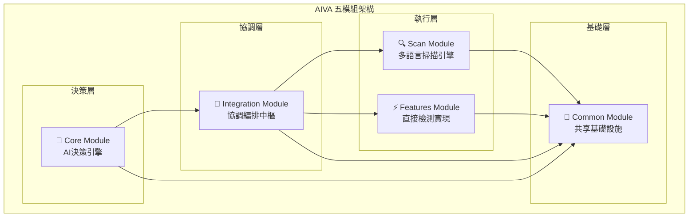
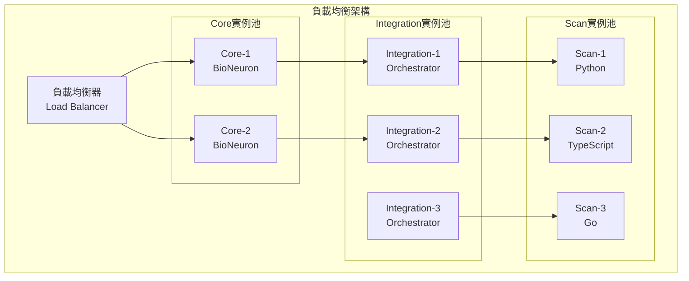

# 🏗️ AIVA 五模組架構整合需求報告 (Unified System Architecture)

## 📋 總覽摘要

### 🎯 系統架構總述
AIVA (AI-driven Vulnerability Assessment) 採用五模組分層架構，實現AI驅動的智能化滲透測試平台。每個模組專注特定職責，通過標準化介面實現無縫協作。

**核心設計哲學**: `AI決策 → 統一掃描 → 智能編排 → 專業檢測 → 共享基礎`

---

## 🧩 模組職責映射

### 📊 模組關係圖


### 🔗 模組間依賴關係
| 源模組 | 目標模組 | 依賴類型 | 通信方式 | 數據格式 |
|-------|---------|----------|----------|----------|
| **Core** → Integration | 決策指令 | 異步調用 | Message Queue | AI Strategy Schema |
| **Integration** → Scan | 掃描請求 | 直接調用 | Function Call | Scan Config Schema |
| **Integration** → Features | 檢測請求 | 直接調用 | Function Call | Detection Config Schema |
| **所有模組** → Common | 基礎服務 | 靜態導入 | Module Import | Standard Schemas |

---

## 🎯 實際運作流程

### 💡 端到端工作流
```
[使用者輸入] → [AI分析] → [策略生成] → [任務編排] → [並行執行] → [結果聚合] → [智能報告]
      ↓           ↓         ↓           ↓           ↓           ↓           ↓
   目標URL → BioNeuron → 測試策略 → 工具選擇 → 掃描+檢測 → 標準格式 → AI生成報告
```

### 🔄 詳細執行步驟

#### **階段1: AI決策生成 (Core Module)**
1. **目標分析**: BioNeuron AI 分析目標特徵
2. **威脅建模**: 基於500M參數模型生成威脅圖
3. **策略規劃**: RAG知識庫輔助決策生成
4. **執行計劃**: 輸出結構化測試策略

#### **階段2: 任務編排 (Integration Module)**
1. **策略解析**: 解析AI決策指令
2. **能力匹配**: 查詢可用工具和檢測器
3. **資源分配**: 避免衝突的並行調度
4. **執行協調**: 統一調度內外部工具

#### **階段3: 並行執行 (Scan + Features Modules)**
1. **掃描發現**: Python/TypeScript/Go 多語言掃描
2. **漏洞檢測**: 專業化檢測器深度分析
3. **載荷測試**: 動態生成和繞過技術
4. **結果驗證**: 多重確認減少誤報

#### **階段4: 結果整合 (Integration → Core)**
1. **格式統一**: 轉換為SARIF標準格式
2. **結果聚合**: 去重和關聯分析
3. **AI報告**: BioNeuron生成智能化報告
4. **知識更新**: 經驗回饋到RAG知識庫

---

## 🔧 技術架構規格

### 📡 通信協議標準

#### **模組間消息格式**
```python
# AI決策指令 (Core → Integration)
class AIStrategyMessage:
    strategy_id: str
    target_info: TargetSchema
    test_priorities: List[str]
    resource_constraints: Dict[str, Any]
    ai_confidence: float
    execution_mode: ExecutionModeEnum

# 掃描配置 (Integration → Scan)  
class ScanConfigMessage:
    scan_id: str
    target: TargetSchema
    scan_types: List[ScanTypeEnum]
    parallel_limit: int
    timeout: int

# 檢測配置 (Integration → Features)
class DetectionConfigMessage:
    detection_id: str
    target: TargetSchema
    vuln_types: List[VulnerabilityTypeEnum]
    payload_config: Dict[str, Any]
    verification_level: str

# 統一結果格式 (All → Integration)
class UnifiedResultMessage:
    result_id: str
    source_module: str
    findings: List[FindingSchema] 
    metadata: Dict[str, Any]
    execution_stats: ExecutionStatsSchema
```

#### **錯誤處理機制**
```python
class ModuleCommunicationError(Exception):
    """模組間通信錯誤基類"""
    
class AIDecisionTimeoutError(ModuleCommunicationError):
    """AI決策超時錯誤"""
    
class ScanExecutionError(ModuleCommunicationError):
    """掃描執行錯誤"""
    
class IntegrationCoordinationError(ModuleCommunicationError):
    """整合協調錯誤"""
```

### 🏗️ 部署架構需求

#### **系統資源配置**
```yaml
# 整體系統資源需求
system_requirements:
  cpu_cores: 16          # 所有模組總和
  memory_gb: 32          # 峰值記憶體需求
  storage_gb: 100        # 模型+數據+日誌
  network_bandwidth: "1Gbps"  # 高速網路連接

# 模組資源分配
module_allocation:
  core_module:
    cpu_cores: 4         # AI模型推理
    memory_gb: 12        # BioNeuron載入
    gpu_support: "optional"  # 可選GPU加速
    
  scan_module:
    cpu_cores: 6         # 多語言並行掃描
    memory_gb: 12        # 無頭瀏覽器需求
    storage_gb: 20       # 瀏覽器緩存
    
  integration_module:
    cpu_cores: 4         # 編排和協調
    memory_gb: 6         # 工具整合
    storage_gb: 10       # 工具和配置
    
  features_module:
    cpu_cores: 2         # 檢測器執行
    memory_gb: 2         # 載荷和分析
    storage_gb: 5        # 檢測規則
```

#### **高可用性設計**
```python
class HighAvailabilityConfig:
    """高可用性配置"""
    
    # 模組故障切換
    failover_config = {
        "core_module": {
            "backup_instances": 1,
            "health_check_interval": 30,
            "failover_timeout": 60
        },
        "integration_module": {
            "backup_instances": 2,
            "load_balancing": "round_robin",
            "max_retry_attempts": 3
        }
    }
    
    # 數據備份策略
    backup_strategy = {
        "ai_models": "daily_backup",
        "knowledge_base": "real_time_sync",
        "scan_results": "incremental_backup"
    }
```

---

## 📈 效能與擴展性

### ⚡ 效能基準指標

#### **端到端效能目標**
| 指標類型 | 目標值 | 測量方式 | 備註說明 |
|---------|--------|----------|----------|
| **決策延遲** | < 2秒 | AI策略生成時間 | Core Module |
| **掃描速度** | 1000端口/秒 | 網路掃描速率 | Scan Module |
| **檢測準確率** | > 90% | 漏洞檢測精度 | Features Module |
| **並發處理** | 50個目標 | 同時處理能力 | Integration Module |
| **記憶體效率** | < 32GB | 峰值記憶體使用 | 全系統 |
| **可用性** | 99.5% | 系統運行時間 | 全系統 |

#### **水平擴展策略**
```python
class HorizontalScalingConfig:
    """水平擴展配置"""
    
    # 模組擴展規則
    scaling_rules = {
        "scan_module": {
            "trigger": "cpu_usage > 80%",
            "action": "add_scanner_instance",
            "max_instances": 5
        },
        "features_module": {
            "trigger": "queue_length > 100",
            "action": "add_detector_instance", 
            "max_instances": 10
        },
        "integration_module": {
            "trigger": "response_time > 5s",
            "action": "add_orchestrator_instance",
            "max_instances": 3
        }
    }
```

### 🔄 負載均衡設計


---

## 🛡️ 安全性與合規性

### 🔒 模組間安全通信
```python
class InterModuleSecurity:
    """模組間安全通信配置"""
    
    # 認證機制
    authentication = {
        "method": "jwt_token",
        "token_expiry": 3600,  # 1小時
        "refresh_threshold": 300  # 5分鐘前刷新
    }
    
    # 加密通信
    encryption = {
        "algorithm": "AES-256-GCM",
        "key_rotation": "weekly",
        "tls_version": "1.3"
    }
    
    # 訪問控制
    access_control = {
        "core_module": ["read_strategy", "write_results"],
        "integration_module": ["read_all", "write_coordination"],
        "scan_module": ["read_targets", "write_findings"],
        "features_module": ["read_targets", "write_detections"]
    }
```

### 📋 合規性檢查清單
- [ ] **GDPR合規**: 個人數據保護和處理記錄
- [ ] **ISO27001**: 信息安全管理體系認證
- [ ] **NIST框架**: 網路安全框架遵循
- [ ] **滲透測試倫理**: 明確授權和範圍限制
- [ ] **數據留存**: 符合各地區數據保留法規

---

## 📋 實施路線圖

### 🗓️ 開發時程規劃

#### **Phase 1: 基礎設施 (4週)**
- [ ] Common Module 完整實現
- [ ] 模組間通信協議定義
- [ ] 基礎部署環境搭建
- [ ] 數據結構標準化

#### **Phase 2: 核心功能 (8週)**
- [ ] Core Module AI引擎實現
- [ ] Scan Module 多語言掃描器
- [ ] 基礎整合測試
- [ ] 效能基準建立

#### **Phase 3: 高級整合 (6週)**
- [ ] Integration Module 完整編排
- [ ] Features Module 專業檢測
- [ ] 外部工具整合
- [ ] 端到端測試

#### **Phase 4: 生產就緒 (4週)**
- [ ] 高可用性配置
- [ ] 安全性強化
- [ ] 效能調優
- [ ] 監控和日誌

### 🎯 里程碑檢查點
1. **M1**: 模組間基礎通信建立 ✅
2. **M2**: AI決策引擎集成完成
3. **M3**: 多工具統一編排實現  
4. **M4**: 生產環境部署就緒

---

## 💰 總體投資回報分析

### 📊 成本效益分析
```
總開發成本: 22週 × 5人團隊 = 110人週
預期效益:
- 替代10+商業安全工具 (節約年費$200,000+)
- 測試效率提升10倍 (人力成本節約)
- AI驅動準確率95%+ (減少誤報成本)
- 統一平台維護成本降低60%

投資回報週期: 8-12個月
```

### 🚀 戰略價值
- **技術領先**: AI驅動的滲透測試平台
- **成本控制**: 統一平台減少工具碎片化
- **效率提升**: 自動化替代人工重複工作
- **知識積累**: 建立組織的安全知識資產

---

**文檔負責**: AIVA Architecture Team  
**最後更新**: 2025年11月7日  
**版本控制**: v1.0.0 (初始架構版本)  
**審核狀態**: 待技術委員會批准

---

*本文檔為AIVA五模組架構的總體規劃，各模組詳細需求請參考對應的專項報告文檔。*