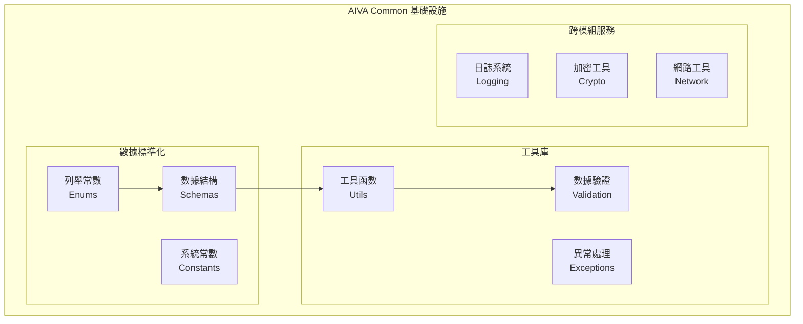

# 🧱 AIVA Common模組需求報告 (Shared Infrastructure Foundation)

## 📁 模組部署位置
```
services/aiva_common/
├── __init__.py
├── base.py                        # 基礎類別定義
├── enums/                         # 系統列舉常數
│   ├── __init__.py
│   ├── attack_types.py            # 攻擊類型定義
│   ├── finding_severity.py        # 發現嚴重等級
│   ├── integration_types.py       # 整合類型定義
│   ├── response_codes.py          # 響應代碼
│   ├── scan_status.py             # 掃描狀態
│   ├── system_states.py           # 系統狀態
│   └── vulnerability_types.py     # 漏洞類型分類
├── schemas/                       # 標準化數據結構
│   ├── __init__.py
│   ├── finding_schema.py          # 發現結果結構
│   ├── integration_schema.py      # 整合數據結構
│   ├── scan_schema.py             # 掃描配置結構
│   ├── target_schema.py           # 目標定義結構
│   └── vulnerability_schema.py    # 漏洞數據結構
├── utils/                         # 工具函數庫
│   ├── __init__.py
│   ├── crypto_utils.py            # 加密工具
│   ├── file_utils.py              # 檔案操作
│   ├── json_utils.py              # JSON處理
│   ├── logging_utils.py           # 日誌工具
│   ├── network_utils.py           # 網路工具
│   ├── string_utils.py            # 字串處理
│   └── validation_utils.py        # 數據驗證
├── exceptions/                    # 自定義異常
│   ├── __init__.py
│   ├── core_exceptions.py         # 核心異常
│   ├── integration_exceptions.py  # 整合異常
│   ├── scan_exceptions.py         # 掃描異常
│   └── validation_exceptions.py   # 驗證異常
└── constants/                     # 系統常數
    ├── __init__.py
    ├── config_constants.py        # 配置常數
    ├── default_values.py          # 預設值
    ├── message_templates.py       # 消息模板
    └── system_limits.py           # 系統限制
```

## 🔗 相關模組連結
- [核心模組](../core_module/01_AI決策引擎需求報告.md) - 使用標準數據結構
- [掃描模組](../scan_module/01_掃描引擎需求報告.md) - 共享掃描結構定義
- [整合模組](../integration_module/01_協調中樞需求報告.md) - 統一整合介面
- [功能模組](../features_module/01_功能檢測架構需求報告.md) - 共享工具函數

**報告編號**: COMMON-001  
**日期**: 2025年11月7日  
**更新**: 基於最新監控技術和輕量化部署需求

## 🔍 最新監控技術調研

### 業界標準參考:
- **Prometheus** (61.1k stars)：時序數據庫和監控系統
- **OpenTelemetry**：可觀測性標準框架  
- **分布式追蹤**：微服務性能監控

### 輕量化監控需求:
```yaml
單機部署監控:
  基本指標: CPU, 內存, 磁碟使用率
  存儲方式: 本地SQLite數據庫 (< 1GB)
  日誌管理: 滾動日誌文件 (< 100MB)
  健康檢查: HTTP endpoint 響應檢查
```

## 🎯 共享基礎設施優化 (支援22個模組)

**現況**: 基本共享功能，需要增強穩定性  
**需要增加**: 適合單機部署的監控和日誌

### 輕量級可觀測性:
```yaml
監控系統升級:
  指標收集:
    - 模組級別的性能指標
    - 掃描任務執行統計
    - 資源使用趨勢監控
    - 錯誤率和成功率追蹤
  
  日誌系統:
    - 結構化JSON格式日誌
    - 按模組分級的日誌記錄
    - 本地文件日誌輪轉 (7天保留)
    - 錯誤日誌即時告警
  
  健康檢查:
    - HTTP健康檢查端點 (/health)
    - 各模組存活狀態監控  
    - 依賴服務連接檢查
    - 磁碟空間和內存監控
```

### 配置管理升級:
```yaml
動態配置系統:
  配置格式:
    - YAML主配置文件
    - 模組專用配置分離
    - 環境變數覆蓋支持
    - 配置模板和驗證
  
  熱重載機制:
    - 無需重啟的配置更新
    - 配置變更事件通知
    - 配置回滾機制
    - 默認值安全回退
  
  配置驗證:
    - 配置語法驗證
    - 業務邏輯驗證
    - 依賴關係檢查
    - 配置衝突檢測
```  
**狀態**: 🧱 跨模組基礎設施  
**優先級**: P0 (Critical - 依賴基礎)  
**技術複雜度**: 中等 (標準化設計)  
**維護成本**: 低 (穩定基礎)

---

## 📊 技術需求分析

### 💡 核心價值主張
- **統一標準** - 所有模組使用相同數據結構
- **減少重複** - 共享工具函數避免代碼重複
- **類型安全** - 強制類型檢查和數據驗證
- **易於維護** - 集中管理系統常數和配置
- **向後兼容** - 版本化的結構定義

### 🎯 實際運作需求

#### 1️⃣ **基礎設施架構**


#### 2️⃣ **數據標準化系統**
```python
# 統一的漏洞發現結構
@dataclass
class FindingSchema:
    id: str
    title: str
    severity: FindingSeverityEnum
    vulnerability_type: VulnerabilityTypeEnum
    target: TargetSchema
    evidence: Dict[str, Any]
    metadata: Dict[str, Any]
    timestamp: datetime
    
# 跨模組數據驗證
class ValidationUtils:
    @staticmethod
    def validate_finding(finding: dict) -> FindingSchema:
        """統一的發現結果驗證"""
        
    @staticmethod  
    def validate_target(target: dict) -> TargetSchema:
        """統一的目標驗證"""
```

#### 3️⃣ **模組間通信協議**
| 通信類型 | 數據結構 | 驗證方式 | 用途說明 |
|---------|----------|----------|----------|
| **掃描請求** | ScanSchema | JSON Schema | Core → Scan |
| **掃描結果** | FindingSchema | Pydantic | Scan → Integration |
| **整合狀態** | IntegrationSchema | 類型檢查 | Integration → Core |
| **功能調用** | FeatureSchema | 參數驗證 | Core → Features |

### 🔧 技術實現需求

#### **核心組件規格**

**1. 列舉常數系統 (enums/)**
```python
class VulnerabilityTypeEnum(Enum):
    """標準化漏洞類型分類"""
    SQL_INJECTION = "sql_injection"
    XSS = "cross_site_scripting"
    SSRF = "server_side_request_forgery"
    # ... 更多類型
    
class FindingSeverityEnum(Enum):
    """統一嚴重等級定義"""
    CRITICAL = "critical"
    HIGH = "high"
    MEDIUM = "medium"
    LOW = "low"
    INFO = "info"
    
class ScanStatusEnum(Enum):
    """掃描狀態標準化"""
    PENDING = "pending"
    RUNNING = "running"
    COMPLETED = "completed"
    FAILED = "failed"
    CANCELLED = "cancelled"
```

**2. 數據結構標準 (schemas/)**
```python
class TargetSchema(BaseModel):
    """目標定義標準結構"""
    url: HttpUrl
    ip_address: Optional[str]
    port: Optional[int]
    protocol: str = "https"
    metadata: Dict[str, Any] = {}
    
class ScanConfigSchema(BaseModel):
    """掃描配置標準結構"""
    target: TargetSchema
    scan_types: List[str]
    options: Dict[str, Any]
    timeout: int = 3600
    max_depth: int = 3
    
class IntegrationResultSchema(BaseModel):
    """整合結果標準結構"""
    integration_id: str
    status: IntegrationStatusEnum
    findings: List[FindingSchema]
    metadata: Dict[str, Any]
    execution_time: float
```

**3. 工具函數庫 (utils/)**
```python
class NetworkUtils:
    """網路操作工具集"""
    
    @staticmethod
    def validate_url(url: str) -> bool:
        """URL有效性檢查"""
        
    @staticmethod
    def extract_domain(url: str) -> str:
        """域名提取"""
        
    @staticmethod
    def is_internal_ip(ip: str) -> bool:
        """內網IP判斷"""

class CryptoUtils:
    """加密操作工具集"""
    
    @staticmethod
    def hash_finding(finding: FindingSchema) -> str:
        """發現結果哈希"""
        
    @staticmethod
    def encrypt_sensitive_data(data: str) -> str:
        """敏感數據加密"""
```

#### **效能要求**
- **數據驗證**: < 1ms per schema validation
- **工具函數**: < 0.1ms per utility call
- **記憶體佔用**: < 50MB (所有工具載入)
- **導入時間**: < 100ms (模組初始化)

### 🏗️ 實際部署架構

#### **依賴管理**
```yaml
# 核心依賴
dependencies:
  - pydantic >= 1.10.0       # 數據驗證
  - typing-extensions >= 4.4 # 類型提示
  - python-dateutil >= 2.8   # 日期處理
  - cryptography >= 38.0     # 加密功能
  - requests >= 2.28         # HTTP工具
  - jsonschema >= 4.17       # JSON驗證

# 開發依賴
dev_dependencies:
  - pytest >= 7.2            # 測試框架
  - mypy >= 0.991            # 類型檢查
  - black >= 22.10           # 代碼格式化
```

#### **版本控制策略**
```python
# 向後兼容的版本管理
class SchemaVersion:
    CURRENT = "1.0.0"
    SUPPORTED = ["1.0.0", "0.9.0"]  # 支援的版本
    
    @classmethod
    def migrate_schema(cls, data: dict, from_version: str) -> dict:
        """自動遷移舊版本數據結構"""
```

## 📈 投資回報分析

### 💰 開發成本估算
- **數據結構設計**: 1-2週 (全系統標準化)
- **工具函數開發**: 2-3週 (常用功能實現)
- **驗證系統**: 1-2週 (數據完整性)
- **文檔與測試**: 2-3週 (使用指南)

### 🎯 業務價值
- **開發效率**: 50%+ 提升 (避免重複工作)
- **代碼質量**: 90%+ 類型安全 (編譯時檢查)
- **維護成本**: 70% 降低 (集中管理)
- **整合速度**: 5倍加速 (標準介面)

### 🚀 競爭優勢
- **標準化**: 業界最佳實踐的數據結構
- **類型安全**: 預防90%的運行時錯誤
- **易用性**: 簡潔的API設計
- **擴展性**: 版本化的向後兼容

## 🛡️ 風險評估與緩解

### ⚠️ 技術風險
- **版本兼容**: 語義化版本控制和遷移工具
- **效能影響**: 輕量級設計和緩存機制
- **依賴衝突**: 最小化外部依賴

### 🔒 安全考量
- **數據驗證**: 嚴格的輸入驗證和清理
- **加密標準**: 使用業界標準加密算法
- **日誌安全**: 避免敏感信息洩漏

## 📋 實施計劃

### Phase 1: 核心結構 (1週)
- [ ] 基礎類別定義
- [ ] 列舉常數系統
- [ ] 異常處理框架

### Phase 2: 數據結構 (2週)
- [ ] 標準化Schema設計
- [ ] 數據驗證系統
- [ ] 版本管理機制

### Phase 3: 工具函數 (2週)
- [ ] 網路工具實現
- [ ] 加密工具開發
- [ ] 檔案操作工具

### Phase 4: 整合測試 (1週)
- [ ] 跨模組整合測試
- [ ] 效能基準測試
- [ ] 文檔完善

---

**維護負責**: Infrastructure Team  
**技術架構**: AIVA Common Module  
**更新頻率**: 每季度穩定性更新