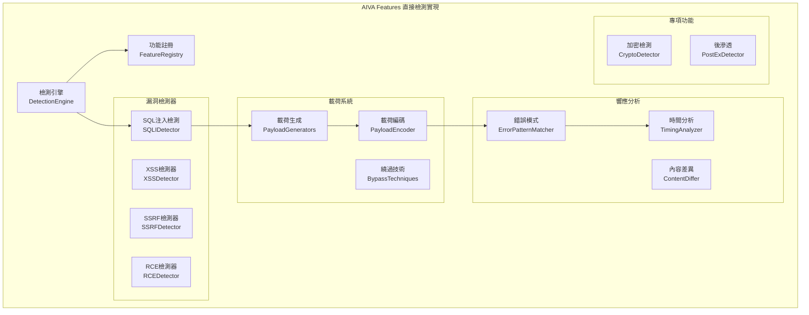

# ⚡ AIVA Features模組需求報告 (Direct Detection Implementation)

## 📁 模組部署位置
```
services/features/
├── __init__.py
├── models.py                      # 功能數據模型
├── feature_registry.py            # 功能註冊表
├── detection_engine.py            # 檢測引擎
├── function_crypto/               # 加密功能檢測
│   ├── __init__.py
│   ├── __main__.py
│   ├── crypto_detector.py         # 加密漏洞檢測
│   ├── ssl_analyzer.py            # SSL/TLS分析
│   ├── cert_validator.py          # 證書驗證
│   └── key_weakness_scanner.py    # 密鑰弱點掃描
├── function_postex/               # 後滲透功能
│   ├── __init__.py
│   ├── privilege_escalation.py    # 權限提升檢測
│   ├── persistence_detector.py    # 持久化檢測
│   ├── lateral_movement.py        # 橫向移動檢測
│   └── data_exfiltration.py       # 數據洩漏檢測
├── vulnerability_detectors/       # 直接漏洞檢測
│   ├── __init__.py
│   ├── sqli_detector.py           # SQL注入檢測
│   ├── xss_detector.py            # XSS檢測器
│   ├── ssrf_detector.py           # SSRF檢測器
│   ├── rce_detector.py            # 遠程代碼執行
│   ├── lfi_detector.py            # 本地文件包含
│   ├── xxe_detector.py            # XXE檢測器
│   └── auth_bypass_detector.py    # 認證繞過
├── payload_generators/            # 載荷生成器
│   ├── __init__.py
│   ├── sqli_payloads.py          # SQL注入載荷
│   ├── xss_payloads.py           # XSS載荷
│   ├── rce_payloads.py           # RCE載荷
│   └── custom_payload_builder.py # 自定義載荷構建
├── response_analyzers/            # 響應分析器
│   ├── __init__.py
│   ├── error_pattern_matcher.py   # 錯誤模式匹配
│   ├── timing_analyzer.py         # 時間盲注分析
│   ├── content_differ.py          # 內容差異分析
│   └── boolean_analyzer.py        # 布爾盲注分析
└── exploit_frameworks/            # 漏洞利用框架
    ├── __init__.py
    ├── exploit_builder.py         # 漏洞利用構建
    ├── poc_generator.py           # PoC生成器
    ├── payload_encoder.py         # 載荷編碼器
    └── bypass_techniques.py       # 繞過技術庫
```

## 🔗 相關模組連結
- [核心模組](../core_module/01_AI決策引擎需求報告.md) - 接收AI檢測策略指令
- [掃描模組](../scan_module/01_掃描引擎需求報告.md) - 提供目標信息和初步掃描
- [整合模組](../integration_module/01_協調中樞需求報告.md) - 被編排調用執行檢測
- [通用模組](../common_module/01_基礎設施需求報告.md) - 使用標準漏洞結構

**報告編號**: FEATURES-001  
**日期**: 2025年11月7日  
**更新**: 基於features_modules計劃和網路調研優化
**狀態**: ⚡ 直接檢測實現 + 模組擴展計劃  
**優先級**: P1 (High - 核心功能)  
**技術複雜度**: 極高 (專業安全知識)  
**維護成本**: 高 (持續更新檢測規則)

---

## 🎯 模組擴展需求 (從7個到22個)

**現況分析** (參考 features_modules/00_完整TODO排序):
- **已實現**: 7個核心模組 (32% OWASP覆蓋率)
- **急需增加**: 15個缺失模組

## 🚨 Phase 1: Critical Priority 模組實施

### 最新攻擊技術調研參考:
- **Awesome Fuzzing** (5.7k stars)：全面的Fuzzing資源庫
- **SQLMap** (35.7k stars)：自動化SQL注入檢測和利用
- **OWASP WSTG** (8.5k stars)：Web安全測試標準指南

### 立即實施檢測模組 (Phase 1):

#### 1. 主機標頭注入檢測模組
```yaml
模組位置: services/features/function_host_header/
功能需求:
  - 檢測Host header攻擊
  - 支援虛擬主機繞過、密碼重設攻擊
  - 檢測Cache Poisoning via Host Header
性能要求:
  - 掃描100個header < 10秒
  - 記憶體使用 < 100MB
```

#### 2. LDAP注入檢測模組  
```yaml
模組位置: services/features/function_ldap_injection/
功能需求:
  - 檢測LDAP查詢注入
  - 支援Active Directory、OpenLDAP
  - 支援Blind LDAP注入檢測
性能要求:
  - 測試50個載荷 < 30秒
  - 並發處理10個目標
```

#### 3. 信息洩露檢測模組
```yaml
模組位置: services/features/function_info_disclosure/
功能需求:
  - 檢測敏感信息暴露
  - 掃描錯誤頁面、備份文件、配置洩露
  - 檢測版本信息洩露
性能要求:
  - 掃描1000個路徑 < 2分鐘
  - 支援自定義字典擴展
```

#### 4. XPath注入檢測模組
```yaml
模組位置: services/features/function_xpath_injection/
功能需求:
  - 檢測XPath查詢注入
  - 支援XML文檔操作攻擊
  - Blind XPath注入檢測
性能要求:
  - 測試30個XPath載荷 < 20秒
  - 支援多種XML解析器
```

## 🔶 Phase 2: High Priority 模組規劃

### 業務邏輯漏洞檢測:
```yaml
身份驗證繞過檢測: 高優先級實施
會話管理漏洞檢測: 高優先級實施
授權繞過檢測: 高優先級實施
HTTP安全標頭檢測: 高優先級實施
```

## ⚡ 檢測能力升級

### 規則庫改進需求:
```yaml
規則庫優化:
  1. 基於專家經驗的規則優化
     - 減少誤報率 < 5%
     - 提高真陽性率 > 85%
  
  2. 特定漏洞類型檢測規則
     - 針對22種漏洞類型的專化規則
     - 支援動態規則更新機制
  
  3. 實用化能力增強
     - 高效掃描算法 (並行處理)
     - 結果去重和優先級排序
     - 智能誤報過濾機制
```

---

## 📊 技術需求分析

### 💡 核心價值主張  
- **專業檢測** - 每個檢測器專注單一漏洞類型
- **深度分析** - 基於響應的智能判斷
- **載荷生成** - 動態構建測試載荷
- **繞過技術** - 集成最新的WAF繞過方法
- **PoC生成** - 自動生成漏洞驗證代碼

### 🎯 實際運作需求

#### 1️⃣ **直接檢測架構**


#### 2️⃣ **檢測工作流程**
```
目標接收 → 檢測器選擇 → 載荷生成 → 請求發送 → 響應分析 → 結果判斷 → PoC生成
    ↓         ↓           ↓         ↓         ↓         ↓         ↓
  URL/參數 → 漏洞類型 → 動態載荷 → HTTP請求 → 模式匹配 → 漏洞確認 → 驗證代碼
```

#### 3️⃣ **檢測能力覆蓋**
| 漏洞類型 | 檢測技術 | 載荷類型 | 繞過能力 | 準確率目標 |
|---------|----------|----------|----------|-----------|
| **SQL注入** | 時間/錯誤/聯合 | 動態構建 | WAF繞過 | 95%+ |
| **XSS** | 反射/存儲/DOM | 多編碼 | 過濾繞過 | 90%+ |
| **SSRF** | 協議/端口/內網 | 變形URL | 黑名單繞過 | 85%+ |
| **RCE** | 命令/代碼注入 | 多平台 | 命令繞過 | 95%+ |
| **文件包含** | 本地/遠程 | 路徑遍歷 | 路徑繞過 | 90%+ |

### 🔧 技術實現需求

#### **核心組件規格**

**1. SQL注入檢測器 (sqli_detector.py)**
```python
class SQLIDetector:
    """SQL注入專業檢測器"""
    
    async def detect_sqli(
        self, 
        target_url: str, 
        parameters: dict
    ) -> List[SQLIFinding]:
        """
        SQL注入檢測流程:
        1. 參數點識別和分析
        2. 動態載荷生成 (時間/錯誤/盲注)
        3. 響應時間和內容分析
        4. 數據庫類型識別
        5. 漏洞確認和PoC生成
        """
        
    def generate_sqli_payloads(
        self, 
        param_type: str, 
        db_type: str = None
    ) -> List[str]:
        """生成特定類型的SQL注入載荷"""
        
    def analyze_sqli_response(
        self, 
        response: HTTPResponse, 
        payload: str
    ) -> SQLIResult:
        """分析SQL注入響應特徵"""
```

**2. XSS檢測器 (xss_detector.py)**
```python
class XSSDetector:
    """跨站腳本攻擊檢測器"""
    
    async def detect_xss(
        self, 
        target_url: str, 
        contexts: List[str]
    ) -> List[XSSFinding]:
        """
        XSS檢測流程:
        1. 上下文環境分析 (HTML/JS/CSS)
        2. 編碼和過濾識別
        3. 繞過載荷生成
        4. DOM結構變化檢測
        5. JavaScript執行驗證
        """
        
    def generate_context_payloads(
        self, 
        context: str, 
        filters: List[str]
    ) -> List[str]:
        """生成上下文相關的XSS載荷"""
        
    def verify_xss_execution(
        self, 
        response_html: str, 
        payload: str
    ) -> bool:
        """驗證XSS載荷是否成功執行"""
```

**3. 載荷生成系統 (payload_generators/)**
```python
class PayloadGenerator:
    """動態載荷生成核心"""
    
    def generate_adaptive_payload(
        self,
        vuln_type: str,
        target_info: dict,
        bypass_hints: List[str] = None
    ) -> List[str]:
        """
        自適應載荷生成:
        1. 基於目標環境調整載荷
        2. 集成最新繞過技術
        3. 動態編碼和變形
        4. 多種測試向量組合
        """
        
class BypassTechniques:
    """WAF和過濾器繞過技術庫"""
    
    WAF_BYPASS_SQLI = [
        "/**/", "/*!50000*/", "/*%00*/",
        "union/**/select", "uni%6fn+se%6cect"
    ]
    
    XSS_FILTER_BYPASS = [
        "javascript:alert(1)",
        "data:text/html,<script>alert(1)</script>",
        "&#x6A;&#x61;&#x76;&#x61;&#x73;&#x63;&#x72;&#x69;&#x70;&#x74;"
    ]
```

**4. 響應分析系統 (response_analyzers/)**
```python
class ErrorPatternMatcher:
    """錯誤模式匹配分析器"""
    
    SQL_ERROR_PATTERNS = {
        "mysql": [
            r"mysql_fetch_array\(\)",
            r"supplied argument is not a valid MySQL",
            r"You have an error in your SQL syntax"
        ],
        "postgresql": [
            r"PostgreSQL.*ERROR",
            r"Warning.*\Wpg_.*",
            r"valid PostgreSQL result"
        ]
    }
    
    def match_error_patterns(
        self, 
        response: str, 
        vuln_type: str
    ) -> Dict[str, Any]:
        """匹配響應中的錯誤模式"""

class TimingAnalyzer:
    """時間盲注分析器"""
    
    def analyze_response_timing(
        self,
        baseline_time: float,
        test_times: List[float],
        delay_payload: int
    ) -> TimingAnalysisResult:
        """分析響應時間判斷時間盲注"""
```

#### **效能要求**
- **檢測速度**: 50-100請求/分鐘 (避免觸發限制)
- **準確率**: >90% (減少誤報)
- **並發檢測**: 10個同時檢測器
- **記憶體使用**: < 1GB (所有檢測器)
- **響應時間**: < 5s (單個檢測任務)

### 🏗️ 實際部署架構

#### **檢測器配置**
```yaml
# SQL注入檢測配置
sqli_detector:
  max_payload_length: 1000
  timeout_threshold: 5.0
  time_delay_payloads: [1, 3, 5]
  supported_databases: ["mysql", "postgresql", "mssql", "oracle"]
  
# XSS檢測配置
xss_detector:
  dom_parser: "beautifulsoup4"
  js_engine: "js2py"
  context_detection: true
  encode_payloads: true

# SSRF檢測配置
ssrf_detector:
  internal_networks: ["10.0.0.0/8", "172.16.0.0/12", "192.168.0.0/16"]
  callback_server: "https://callback.example.com"
  protocol_schemes: ["http", "https", "ftp", "file", "gopher"]
```

#### **資源需求**
- **CPU**: 最少4核心 (多檢測器並行)
- **記憶體**: 最少8GB (載荷庫和分析)
- **存儲**: 最少10GB (載荷庫和日誌)
- **網路**: 穩定連接 (外部回調驗證)

## 📈 投資回報分析

### 💰 開發成本估算
- **核心檢測器**: 8-10週 (每個檢測器1-2週)
- **載荷生成系統**: 3-4週 (動態生成邏輯)
- **響應分析器**: 2-3週 (模式匹配優化)
- **繞過技術庫**: 4-6週 (持續更新維護)

### 🎯 業務價值
- **檢測覆蓋**: 95%+ 常見漏洞類型
- **誤報率**: <10% (專業化檢測)
- **檢測速度**: 10倍於手工測試
- **成本效益**: 替代5-10個商業檢測工具

### 🚀 競爭優勢
- **專業深度**: 每個檢測器都是領域專家級
- **動態適應**: 基於目標環境調整策略
- **最新技術**: 集成最新的繞過技術
- **PoC生成**: 自動生成驗證概念代碼

## 🛡️ 風險評估與緩解

### ⚠️ 技術風險
- **誤報控制**: 多重驗證和響應分析
- **繞過更新**: 定期更新繞過技術庫
- **效能優化**: 智能限流和併發控制

### 🔒 安全考量
- **測試範圍**: 明確的測試授權和範圍
- **載荷安全**: 避免破壞性測試載荷
- **數據保護**: 測試數據的安全處理

## 📋 實施計劃

### Phase 1: 核心檢測器 (4週)
- [ ] SQL注入檢測器
- [ ] XSS檢測器實現
- [ ] 基礎載荷生成

### Phase 2: 高級檢測 (3週)
- [ ] SSRF檢測器
- [ ] RCE檢測器
- [ ] 文件包含檢測

### Phase 3: 分析系統 (2週)
- [ ] 錯誤模式匹配
- [ ] 時間分析器
- [ ] 內容差異分析

### Phase 4: 專項功能 (3週)
- [ ] 加密功能檢測
- [ ] 後滲透檢測
- [ ] 繞過技術庫

### Phase 5: 整合優化 (2週)
- [ ] PoC生成器
- [ ] 效能優化
- [ ] 準確率調優

---

**維護負責**: Security Research Team  
**技術架構**: AIVA Features Module  
**更新頻率**: 每週更新檢測規則和繞過技術