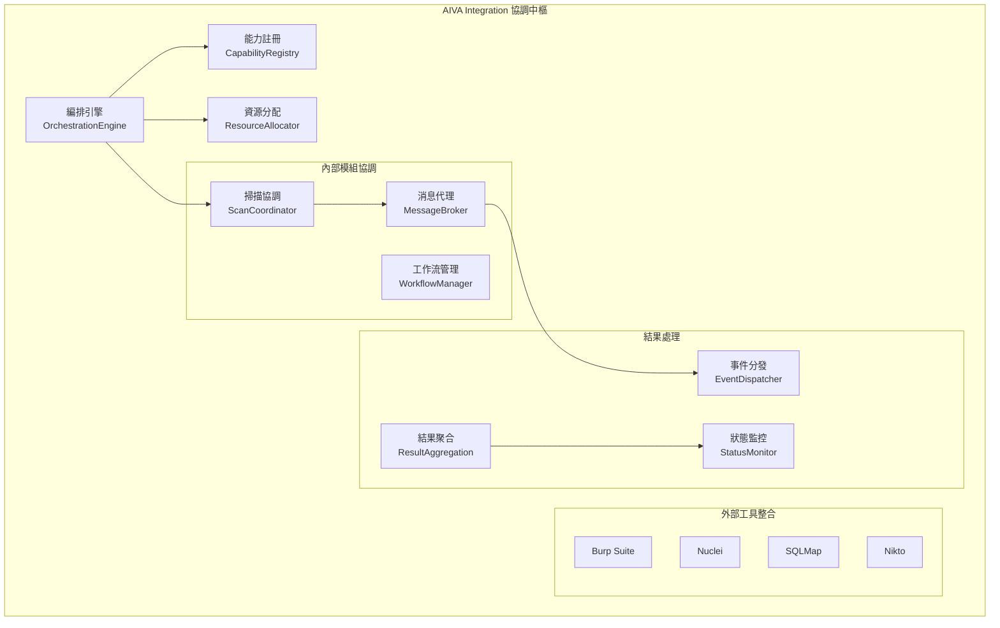

# 🔄 AIVA Integration模組需求報告 (Coordination & Orchestration Hub)

## 📁 模組部署位置
```
services/integration/
├── __init__.py
├── models.py                      # 整合數據模型
├── dependency_graph.py            # 依賴關係圖
├── capability_registry.py         # 能力註冊中心
├── orchestration_engine.py        # 編排引擎
├── integration_adapter.py         # 整合適配器
├── multi_tech_bridge.py          # 多技術橋接
├── result_aggregation.py         # 結果聚合器
├── plugins/                       # 外部工具插件
│   ├── __init__.py
│   ├── burp_integration.py        # Burp Suite整合
│   ├── nuclei_integration.py      # Nuclei整合
│   ├── sqlmap_integration.py      # SQLMap整合
│   ├── nikto_integration.py       # Nikto整合
│   └── custom_tool_adapter.py     # 自定義工具適配
├── coordination/                  # 協調控制器
│   ├── __init__.py
│   ├── scan_coordinator.py        # 掃描協調器
│   ├── workflow_manager.py        # 工作流管理
│   ├── resource_allocator.py      # 資源分配器
│   └── conflict_resolver.py       # 衝突解決器
└── communication/                 # 模組間通信
    ├── __init__.py
    ├── message_broker.py          # 消息代理
    ├── event_dispatcher.py        # 事件分發器
    ├── status_monitor.py          # 狀態監控器
    └── health_checker.py          # 健康檢查器
```

## 🔗 相關模組連結
- [核心模組](../core_module/01_AI決策引擎需求報告.md) - 接收AI決策指令並回報狀態
- [掃描模組](../scan_module/01_掃描引擎需求報告.md) - 協調多語言掃描引擎
- [功能模組](../features_module/01_功能檢測架構需求報告.md) - 編排功能檢測流程
- [通用模組](../common_module/01_基礎設施需求報告.md) - 使用標準通信協議

**報告編號**: INTEGRATION-001  
**日期**: 2025年11月7日  
**更新**: 基於最新編排技術和硬體效能優化

## 🌐 最新編排技術調研

### 業界技術參考:
- **Kubernetes** (118k stars)：容器編排標準
- **Docker Compose** (36.4k stars)：多容器應用定義
- **Service Mesh**：微服務間通信管理

### 輕量化編排需求:
```yaml
性能優化目標:
  內存使用: < 800MB (管理22個模組)
  並發處理: 支援8個同時掃描任務
  響應時間: 模組調用 < 2秒
  錯誤恢復: 自動重試3次，超時5分鐘
```

## 🎯 模組協調能力升級 (7→22個模組)

**現況**: 基本協調功能，需要優化性能
**需要增加**: 高效的任務調度和資源管理

### 任務調度優化需求:
```yaml
智能調度系統:
  負載均衡:
    - 基於CPU/內存使用率動態分配
    - 優先級隊列管理 (Critical > High > Medium)
    - 智能任務分組 (相似目標合併處理)
  
  失敗處理:
    - 失敗重試機制 (最多3次)
    - 任務降級策略 (Critical模組優先)
    - 超時控制 (單任務 < 5分鐘)
  
  並行度控制:
    - 最多8個併發模組
    - 動態調整並發數 (基於系統負載)
    - 資源預留機制 (為Core模組保留資源)
```

### 資源管理優化:
```yaml
輕量級資源管理:
  內存管理:
    - 動態內存分配和釋放
    - 內存使用監控和告警
    - 垃圾回收優化
  
  文件系統管理:
    - 臨時文件自動清理
    - 日誌輪轉機制 (最多保留7天)
    - 磁碟空間監控
  
  網絡資源:
    - 連接池管理 (最多100個併發)
    - 請求限流 (每秒最多50個)
    - 超時設定統一管理
```  
**狀態**: 🔄 協調編排中樞  
**優先級**: P0 (Critical - 系統整合)  
**技術複雜度**: 極高 (跨系統協調)  
**維護成本**: 高 (複雜邏輯)

---

## 📊 技術需求分析

### 💡 核心價值主張
- **智能編排** - AI驅動的工具選擇和執行順序
- **無縫整合** - 統一管理外部安全工具
- **資源優化** - 智能分配計算資源避免衝突
- **結果聚合** - 多工具結果的統一格式化
- **故障恢復** - 自動重試和錯誤處理機制

### 🎯 實際運作需求

#### 1️⃣ **協調編排架構**


#### 2️⃣ **實際工作流程**
```
AI決策 → 能力註冊 → 工具選擇 → 資源分配 → 並行執行 → 結果聚合 → 狀態回報
   ↓         ↓         ↓         ↓         ↓         ↓         ↓
核心指令 → 查詢可用 → 最佳組合 → 避免衝突 → 協調執行 → 統一格式 → 回饋AI
```

#### 3️⃣ **整合能力矩陣**
| 工具類型 | 整合方式 | 協調邏輯 | 結果格式 | 備註說明 |
|---------|----------|----------|----------|----------|
| **Burp Suite** | REST API | 序列執行 | JSON | 需要Pro授權 |
| **Nuclei** | CLI封裝 | 並行執行 | SARIF | 開源免費 |
| **SQLMap** | CLI封裝 | 智能排隊 | JSON | 避免DB負載 |
| **Nikto** | CLI封裝 | 限流執行 | CSV轉JSON | 老舊但穩定 |
| **內部掃描** | 直接調用 | 優先執行 | 標準Schema | 無授權限制 |

### 🔧 技術實現需求

#### **核心組件規格**

**1. 編排引擎 (OrchestrationEngine)**
```python
class OrchestrationEngine:
    """智能編排引擎 - 協調所有安全工具"""
    
    async def execute_security_workflow(
        self, 
        ai_strategy: dict,
        target_info: dict
    ) -> WorkflowResult:
        """
        執行安全測試工作流:
        1. 解析AI決策策略
        2. 查詢可用工具能力
        3. 計算最佳執行計劃
        4. 並行協調工具執行
        5. 聚合和標準化結果
        """
        
    async def resolve_tool_conflicts(
        self, 
        tool_requests: List[ToolRequest]
    ) -> List[ToolRequest]:
        """解決工具間的資源衝突"""
```

**2. 能力註冊中心 (CapabilityRegistry)**
```python
class CapabilityRegistry:
    """工具能力註冊和查詢系統"""
    
    def register_tool_capability(
        self,
        tool_name: str,
        capabilities: List[str],
        requirements: dict,
        limitations: dict
    ) -> bool:
        """註冊工具能力信息"""
        
    def find_best_tools_for_task(
        self,
        task_type: str,
        target_constraints: dict
    ) -> List[ToolRecommendation]:
        """為特定任務查找最佳工具組合"""
```

**3. 多技術橋接器 (MultiTechBridge)**
```python
class MultiTechBridge:
    """跨技術棧整合橋接"""
    
    async def execute_python_tool(self, tool_config: dict) -> dict:
        """執行Python工具"""
        
    async def execute_cli_tool(self, command: str, args: list) -> dict:
        """執行命令行工具"""
        
    async def execute_rest_api_tool(self, api_config: dict) -> dict:
        """執行REST API工具"""
        
    async def standardize_output(
        self, 
        raw_output: Any, 
        tool_type: str
    ) -> StandardizedResult:
        """標準化不同工具的輸出格式"""
```

#### **效能要求**
- **編排延遲**: < 500ms (決策到執行)
- **並發處理**: 50個同時工作流
- **資源利用**: 80% CPU/Memory 峰值
- **故障恢復**: < 30s 自動重試時間
- **結果聚合**: < 2s (1000個發現)

### 🏗️ 實際部署架構

#### **外部工具整合需求**
```yaml
# Burp Suite Pro整合
burp_integration:
  api_endpoint: "http://localhost:1337"
  auth_method: "api_key"
  rate_limit: "10/minute"
  timeout: 300

# Nuclei整合
nuclei_integration:
  binary_path: "/usr/local/bin/nuclei"
  template_dir: "/opt/nuclei-templates"
  parallel_scans: 5
  output_format: "sarif"

# SQLMap整合  
sqlmap_integration:
  binary_path: "/usr/local/bin/sqlmap"
  max_concurrent: 2  # 避免目標負載
  batch_mode: true
  smart_detection: true
```

#### **資源配置**
- **CPU**: 最少8核心 (多工具並行)
- **記憶體**: 最少16GB (Burp需求大)
- **存儲**: 最少50GB (工具和結果)
- **網路**: 高速穩定連接 (API通信)

## 📈 投資回報分析

### 💰 開發成本估算
- **編排引擎開發**: 4-6週 (核心邏輯複雜)
- **工具整合適配**: 6-8週 (每個工具1-2週)
- **協調系統**: 3-4週 (資源管理)
- **測試與優化**: 4-5週 (復雜場景測試)

### 🎯 業務價值
- **工具統一**: 管理10+個安全工具
- **效率提升**: 3-5倍測試速度 (並行執行)
- **成本節約**: 減少50%人工協調時間
- **準確性**: 95%+ 結果一致性 (多工具驗證)

### 🚀 競爭優勢
- **AI驅動**: 智能工具選擇和編排
- **深度整合**: 超越簡單的工具調用
- **故障彈性**: 自動重試和恢復機制
- **標準化**: 統一的結果格式和流程

## 🛡️ 風險評估與緩解

### ⚠️ 技術風險
- **工具依賴**: 版本兼容性和API變更風險
- **資源競爭**: 智能調度和限流機制
- **複雜性**: 模組化設計和單元測試

### 🔒 安全考量
- **工具授權**: 合規的商業工具使用
- **數據隔離**: 不同工具間的數據保護
- **訪問控制**: 細粒度的權限管理

## 📋 實施計劃

### Phase 1: 基礎框架 (2週)
- [ ] 編排引擎框架
- [ ] 能力註冊系統
- [ ] 消息通信機制

### Phase 2: 核心整合 (4週)
- [ ] Burp Suite整合
- [ ] Nuclei整合實現
- [ ] SQLMap適配器

### Phase 3: 協調系統 (3週)
- [ ] 資源分配器
- [ ] 工作流管理器
- [ ] 衝突解決機制

### Phase 4: 高級功能 (3週)
- [ ] 結果聚合系統
- [ ] 智能重試機制
- [ ] 效能監控

### Phase 5: 測試優化 (2週)
- [ ] 整合測試
- [ ] 效能調優
- [ ] 穩定性驗證

---

**維護負責**: Integration & Orchestration Team  
**技術架構**: AIVA Integration Module  
**更新頻率**: 每月更新工具整合和優化