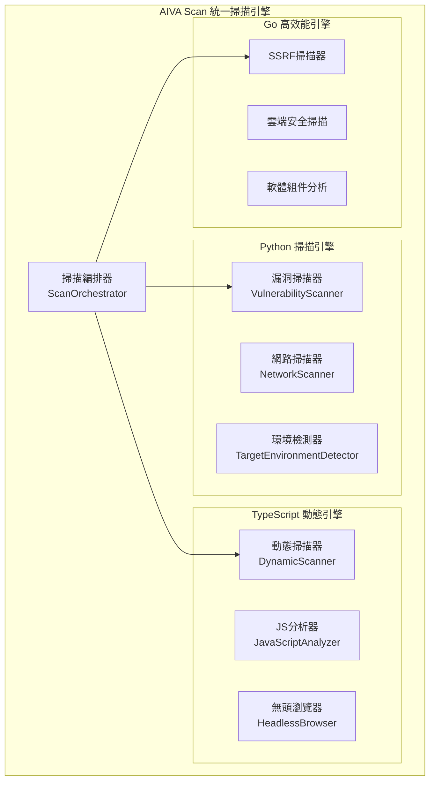

# 🔍 AIVA Scan模組需求報告 (Multi-Language Scanning Engine)

## 📁 模組部署位置
```
services/scan/
├── __init__.py
├── models.py                      # 掃描數據模型
├── sarif_converter.py             # SARIF格式轉換
├── aiva_scan/                     # Python掃描引擎
│   ├── target_environment_detector.py # 靶場環境檢測
│   ├── vulnerability_scanner.py   # 漏洞掃描引擎
│   ├── network_scanner.py         # 網路掃描器
│   ├── service_detector.py        # 服務檢測器
│   ├── fingerprint_manager.py     # 指紋識別管理
│   ├── authentication_manager.py  # 認證管理
│   ├── scan_orchestrator.py       # 掃描編排器
│   └── core_crawling_engine/      # 核心爬蟲引擎
├── aiva_scan_node/                # TypeScript動態掃描
│   ├── package.json
│   ├── dynamic_scanner.ts         # 動態內容掃描
│   ├── javascript_analyzer.ts     # JS代碼分析
│   └── headless_browser.ts        # 無頭瀏覽器
└── go_scanners/                   # Go高效能掃描器
    ├── ssrf_scanner/              # SSRF掃描器
    ├── cspm_scanner/             # 雲端安全掃描
    └── sca_scanner/              # 軟體組件分析
```

## 🔗 相關模組連結
- [核心模組](../core_module/01_AI決策引擎需求報告.md) - 接收AI掃描策略指令
- [整合模組](../integration_module/01_協調中樞需求報告.md) - 彙總掃描結果

**報告編號**: SCAN-001  
**日期**: 2025年11月7日  
**更新**: 基於網路調研結果和硬體效能優化

## 🌐 最新掃描技術調研

### 業界領先工具分析:
- **Semgrep** (13.3k stars)：支援30+語言的靜態分析
- **Horusec** (1.3k stars)：18+語言支持，集成20個安全工具  
- **CodeQL**：微軟開發，支援30+語言，GitHub整合

## 🎯 語言支援擴展需求

**現況**: 支援基本語言，需要擴展支援
**需要增加**: 更多程式語言和框架的特徵識別

### 新增語言支援:
```yaml
擴展語言清單:
  TypeScript: 前端框架掃描 (Vue.js, Angular, React)
  Kotlin: Android應用安全掃描
  Swift: iOS應用安全掃描  
  PHP 8.x: 現代PHP框架 (Laravel, Symfony)
  
框架識別能力:
  前端框架:
    - Vue.js 3.x (Composition API)
    - Angular 15+ (Standalone Components)
    - React 18+ (Concurrent Features)
  後端框架:
    - FastAPI (Python異步框架)
    - Express.js (Node.js框架)
    - Spring Boot 3.x (Java框架)
    
配置文件掃描:
  容器配置: Dockerfile, docker-compose.yml
  基礎設施: Terraform, Ansible
  CI/CD: GitHub Actions, GitLab CI
```

### 性能優化要求:
```yaml
掃描性能指標:
  掃描速度: 1000行/秒  
  記憶體使用: < 1GB
  準確率: > 90%
  並行處理: 支援多執行緒掃描
  
檢測技術改進:
  數據流分析: Taint Analysis for 22個模組
  控制流分析: Control Flow for 業務邏輯漏洞
  跨函數分析: Cross-function for 複雜漏洞鏈
```
- [功能模組](../features_module/01_功能檢測架構需求報告.md) - 調用特定檢測功能
- [通用模組](../common_module/01_基礎設施需求報告.md) - 使用共享掃描模型

**報告編號**: SCAN-001  
**日期**: 2025年11月7日  
**狀態**: 🔍 多語言統一掃描引擎  
**優先級**: P0 (Critical - 發現基礎)  
**技術複雜度**: 高 (多語言整合)  
**維護成本**: 中等

---

## 📊 技術需求分析

### 💡 核心價值主張
- **多語言統一** - Python/TypeScript/Go三語言協同
- **智能編排** - AI驅動的掃描策略選擇
- **高效能掃描** - Go語言高並發掃描器
- **動態檢測** - 無頭瀏覽器JavaScript執行
- **標準化輸出** - SARIF格式結果統一

### 🎯 實際運作需求

#### 1️⃣ **掃描引擎架構**


#### 2️⃣ **實際工作流程**
```
目標輸入 → 環境檢測 → 掃描策略 → 多引擎執行 → 結果聚合 → SARIF輸出
    ↓         ↓         ↓         ↓          ↓         ↓
 URL/IP → 靶場識別 → AI編排 → Python/TS/Go → 統一格式 → 標準報告
```

#### 3️⃣ **掃描能力矩陣**
| 掃描類型 | Python引擎 | TypeScript引擎 | Go引擎 | 優勢說明 |
|---------|------------|----------------|--------|----------|
| **網路掃描** | ✅ 端口掃描 | ❌ | ✅ 高並發 | Go: 效能最佳 |
| **漏洞檢測** | ✅ 傳統掃描 | ✅ DOM分析 | ✅ 特定類型 | Python: 功能最全 |
| **動態分析** | ❌ | ✅ JS執行 | ❌ | TS: 唯一選擇 |
| **指紋識別** | ✅ 規則匹配 | ✅ 動態檢測 | ✅ 高速掃描 | 各有特色 |

### 🔧 技術實現需求

#### **核心組件規格**

**1. Python掃描引擎 (aiva_scan/)**
```python
class ScanOrchestrator:
    """掃描編排器 - 統一協調多語言掃描器"""
    
    async def execute_scan(self, target: str, scan_config: dict) -> dict:
        """
        執行統一掃描流程:
        1. 目標預處理和驗證
        2. 掃描策略選擇 (基於AI建議)
        3. 多引擎並行執行
        4. 結果標準化和聚合
        """
```

**2. TypeScript動態引擎 (aiva_scan_node/)**
```typescript
class DynamicScanner {
    // 動態內容分析
    async analyzeDynamicContent(url: string): Promise<ScanResult>
    
    // JavaScript代碼執行和檢測
    async executeJavaScript(code: string): Promise<ExecutionResult>
    
    // 無頭瀏覽器自動化
    async automatedBrowsing(target: string): Promise<BrowsingResult>
}
```

**3. Go高效能引擎 (go_scanners/)**
```go
// SSRF掃描器
type SSRFScanner struct {
    concurrency int
    timeout     time.Duration
}

// 雲端安全掃描
type CSPMScanner struct {
    cloudProviders []string
    complianceRules []Rule
}
```

#### **效能要求**
- **掃描速度**: 
  - 網路掃描: 1000端口/秒 (Go引擎)
  - 漏洞檢測: 100請求/分鐘 (避免被封)
  - 動態分析: 10頁面/分鐘 (JS執行耗時)
- **並發能力**: 支援50個同時掃描任務
- **記憶體使用**: < 2GB (包含所有引擎)
- **可用性**: 99.5% 運行時間

### 🏗️ 實際部署架構

#### **語言特定需求**
```yaml
# Python環境
python_requirements:
  - requests >= 2.28.0    # HTTP客戶端
  - aiohttp >= 3.8.0      # 異步HTTP
  - nmap-python >= 0.7.1  # 網路掃描
  - beautifulsoup4 >= 4.11 # HTML解析

# TypeScript環境  
typescript_requirements:
  - puppeteer >= 19.0.0   # 無頭瀏覽器
  - playwright >= 1.28.0  # 跨瀏覽器自動化
  - jsdom >= 20.0.0       # DOM模擬

# Go環境
go_requirements:
  - go >= 1.19            # Go運行時
  - goroutines支援         # 並發原語
  - cgo支援               # C語言綁定
```

#### **資源配置**
- **CPU**: 最少6核心 (多語言並行)
- **記憶體**: 最少12GB (無頭瀏覽器需求大)
- **存儲**: 最少20GB (瀏覽器緩存)
- **網路**: 穩定外網連接 (目標掃描)

## 📈 投資回報分析

### 💰 開發成本估算
- **多語言整合**: 4-5週 (3語言專家各1人)
- **掃描引擎開發**: 6-8週 (每個引擎2週)
- **統一編排系統**: 2-3週 (系統整合)
- **測試與優化**: 3-4週 (效能調優)

### 🎯 業務價值
- **掃描覆蓋率**: 95%+ (多引擎互補)
- **檢測準確率**: 90%+ (減少誤報)
- **掃描效率**: 5倍速度提升 (Go並發優勢)
- **成本效益**: 替代3-5個商業掃描工具

### 🚀 競爭優勢
- **多語言統一**: 市場上少有的整合方案
- **AI驅動編排**: 智能選擇最佳掃描策略
- **高效能**: Go語言並發處理優勢
- **標準化**: SARIF格式確保互通性

## 🛡️ 風險評估與緩解

### ⚠️ 技術風險
- **語言間通信**: 統一的消息格式和錯誤處理
- **效能瓶頸**: 合理的資源分配和限流
- **目標防護**: 智能的速率控制和IP輪換

### 🔒 安全考量
- **掃描授權**: 明確的掃描範圍和許可
- **資料保護**: 掃描結果的加密存儲
- **合規要求**: 遵守各地區的安全測試法規

## 📋 實施計劃

### Phase 1: 基礎架構 (2週)
- [ ] 掃描編排器框架
- [ ] 多語言通信協議
- [ ] 統一數據模型

### Phase 2: Python引擎 (3週)
- [ ] 網路掃描器實現
- [ ] 漏洞檢測引擎
- [ ] 指紋識別系統

### Phase 3: TypeScript引擎 (3週)
- [ ] 無頭瀏覽器整合
- [ ] JavaScript分析器
- [ ] 動態內容檢測

### Phase 4: Go引擎 (2週)
- [ ] 高並發網路掃描
- [ ] SSRF檢測實現
- [ ] 雲端安全掃描

### Phase 5: 整合優化 (2週)
- [ ] SARIF格式輸出
- [ ] 效能調優
- [ ] 整合測試

---

**維護負責**: Multi-Language Scanning Team  
**技術架構**: AIVA Scan Module  
**更新頻率**: 每月新增掃描能力與優化