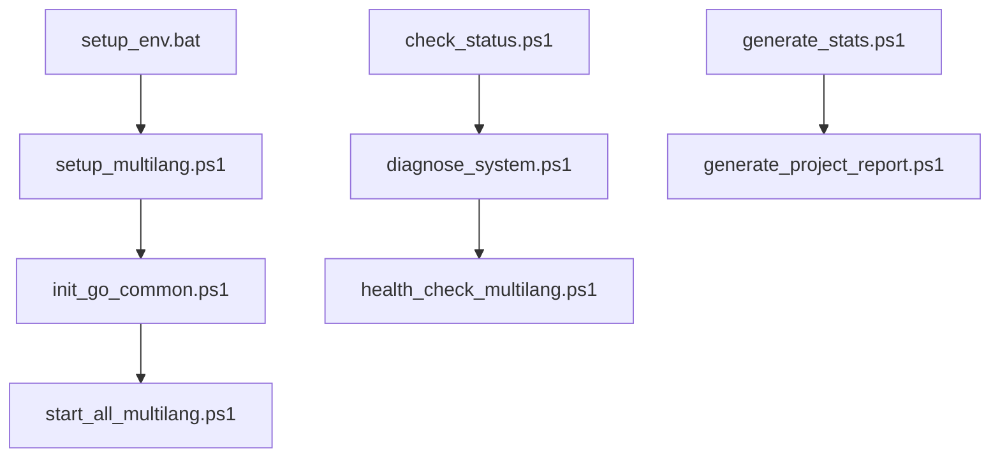

# 🔧 AIVA 腳本集合

本目錄包含 AIVA 專案的各種自動化腳本和工具。

## 📁 目錄結構

### 🚀 deployment/ - 部署腳本
- `start_all.ps1` - 啟動所有服務
- `start_all_multilang.ps1` - 啟動多語言服務
- `start_dev.bat` - 開發環境啟動
- `start_ui_auto.ps1` - 自動啟動 UI
- `stop_all.ps1` - 停止所有服務  
- `stop_all_multilang.ps1` - 停止多語言服務

### ⚙️ setup/ - 環境設置腳本
- `setup_env.bat` - 環境設置（批次檔）
- `setup_multilang.ps1` - 多語言環境設置
- `init_go_common.ps1` - 初始化 Go 共用模組
- `init_go_deps.ps1` - 初始化 Go 依賴
- `migrate_sca_service.ps1` - 遷移 SCA 服務

### 🔍 maintenance/ - 維護腳本
- `check_status.ps1` - 檢查系統狀態
- `diagnose_system.ps1` - 系統診斷
- `health_check_multilang.ps1` - 多語言健康檢查
- `generate_project_report.ps1` - 生成專案報告
- `generate_stats.ps1` - 生成統計資料
- `generate_tree_ultimate_chinese.ps1` - 生成專案樹狀圖

## 🚀 快速使用

### 首次部署
```powershell
# 1. 設置環境
.\scripts\setup\setup_multilang.ps1

# 2. 初始化 Go 模組
.\scripts\setup\init_go_common.ps1

# 3. 啟動服務
.\scripts\deployment\start_all_multilang.ps1
```

### 日常維護
```powershell
# 檢查系統狀態
.\scripts\maintenance\check_status.ps1

# 系統診斷
.\scripts\maintenance\diagnose_system.ps1

# 生成報告
.\scripts\maintenance\generate_project_report.ps1
```

### 開發模式
```bash
# 開發環境啟動
.\scripts\deployment\start_dev.bat

# 自動啟動 UI
.\scripts\deployment\start_ui_auto.ps1
```

## 📋 使用說明

### 權限要求
- PowerShell 腳本需要 **執行權限**
- 某些腳本需要 **管理員權限**
- Docker 相關腳本需要 **Docker Desktop** 運行

### 環境變數
確保以下環境變數已設置：
- `AIVA_ROOT` - AIVA 專案根目錄
- `DOCKER_HOST` - Docker 主機位址（如需要）

### 故障排除
1. **權限拒絕**: 使用管理員身份運行 PowerShell
2. **找不到命令**: 檢查 PATH 環境變數
3. **Docker 錯誤**: 確認 Docker Desktop 已啟動

## 🔄 腳本依賴關係



---

**維護者**: DevOps Team  
**最後更新**: 2025-10-16