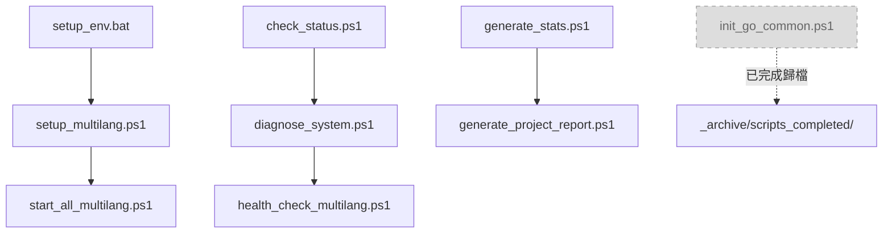

# 🔧 AIVA 腳本集合

本目錄包含 AIVA 專案的各種自動化腳本和工具。

## 📁 目錄結構

### 🚀 launcher/ - 啟動器腳本 ⭐ 新增
- `aiva_launcher.py` - AIVA 主啟動器
- `start_ai_continuous_training.py` - AI 持續訓練啟動器  
- `smart_communication_selector.py` - 智能通訊選擇器

### 🧪 testing/ - 測試相關腳本 ⭐ 新增
- `ai_system_connectivity_check.py` - AI 系統連接檢查
- `aiva_full_worker_live_test.py` - 完整工作者實時測試
- `aiva_module_status_checker.py` - 模組狀態檢查器
- `aiva_system_connectivity_sop_check.py` - 系統連接 SOP 檢查

### ✅ validation/ - 驗證相關腳本 ⭐ 新增
- `aiva_package_validator.py` - 套件驗證器

### 🔗 integration/ - 整合相關腳本 ⭐ 新增
- `cross_language_bridge.py` - 跨語言橋接器
- `ffi_integration.py` - 外部函數介面整合
- `graalvm_integration.py` - GraalVM 整合
- `wasm_integration.py` - WebAssembly 整合

### 📊 reporting/ - 報告生成腳本 ⭐ 新增
- `aiva_enterprise_security_report.py` - 企業安全報告生成器
- `final_report.py` - 最終報告生成器
- `aiva_crosslang_unified.py` - 跨語言統一報告工具

### 🔄 conversion/ - 轉換工具腳本 ⭐ 新增
- `docx_to_md_converter.py` - DOCX 轉 Markdown 轉換器

### 🚀 deployment/ - 部署腳本
- `start_all.ps1` - 啟動所有服務
- `start_all_multilang.ps1` - 啟動多語言服務
- `start_dev.bat` - 開發環境啟動
- `start_ui_auto.ps1` - 自動啟動 UI
- `stop_all.ps1` - 停止所有服務  
- `stop_all_multilang.ps1` - 停止多語言服務

### ⚙️ setup/ - 環境設置腳本
- `setup_env.bat` - 環境設置（批次檔）
- `setup_multilang.ps1` - 多語言環境設置

**已完成並歸檔的腳本** (位於 `_archive/scripts_completed/`)：
- ✅ `init_go_common.ps1` - Go 共用模組初始化 (已完成)
- ✅ `init_go_deps.ps1` - Go 依賴初始化 (已完成)
- ✅ `migrate_sca_service.ps1` - SCA 服務遷移 (已完成)

### 🔍 maintenance/ - 維護腳本
- `check_status.ps1` - 檢查系統狀態
- `diagnose_system.ps1` - 系統診斷
- `health_check_multilang.ps1` - 多語言健康檢查
- `generate_project_report.ps1` - 生成專案報告
- `generate_stats.ps1` - 生成統計資料
- `generate_tree_ultimate_chinese.ps1` - 生成專案樹狀圖

## 🚀 快速使用

### 首次部署
```powershell
# 1. 設置環境
.\scripts\setup\setup_multilang.ps1

# 2. 啟動服務 (Go 模組已完成初始化)
.\scripts\deployment\start_all_multilang.ps1
```

### 日常維護
```powershell
# 檢查系統狀態
.\scripts\maintenance\check_status.ps1

# 系統診斷
.\scripts\maintenance\diagnose_system.ps1

# 生成報告
.\scripts\maintenance\generate_project_report.ps1
```

### 開發模式
```bash
# 開發環境啟動
.\scripts\deployment\start_dev.bat

# 自動啟動 UI
.\scripts\deployment\start_ui_auto.ps1
```

## 📋 使用說明

### 權限要求
- PowerShell 腳本需要 **執行權限**
- 某些腳本需要 **管理員權限**
- Docker 相關腳本需要 **Docker Desktop** 運行

### 環境變數
確保以下環境變數已設置：
- `AIVA_ROOT` - AIVA 專案根目錄
- `DOCKER_HOST` - Docker 主機位址（如需要）

### 故障排除
1. **權限拒絕**: 使用管理員身份運行 PowerShell
2. **找不到命令**: 檢查 PATH 環境變數
3. **Docker 錯誤**: 確認 Docker Desktop 已啟動

## � 腳本清理狀況

### 已完成的階段性任務腳本
以下腳本對應的階段性任務已完成，已移至 `_archive/scripts_completed/`：

| 腳本名稱 | 任務狀態 | 完成日期 | 歸檔位置 |
|---------|---------|----------|----------|
| `init_go_common.ps1` | ✅ Go 共用模組已建立並測試通過 | 2025-10-15 | `_archive/scripts_completed/` |
| `init_go_deps.ps1` | ✅ Go 依賴初始化已完成 | 2025-10-15 | `_archive/scripts_completed/` |
| `migrate_sca_service.ps1` | ✅ SCA 服務遷移至共用模組完成 | 2025-10-15 | `_archive/scripts_completed/` |

### 歸檔機制
- **已完成腳本** → `_archive/scripts_completed/`
- **過時文檔** → `_archive/`
- **舊版本報告** → `reports/` 下的歷史子目錄

## �🔄 腳本依賴關係



---

**維護者**: DevOps Team  
**最後更新**: 2025-10-16  
**清理日期**: 2025-10-16