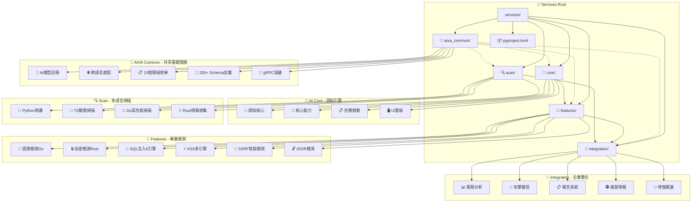

# 🏗️ AIVA Services - 企業級 Bug Bounty 平台服務架構

> **🎯 Bug Bounty 專業化 v6.3**: 六大核心服務協同，AI 驅動智能滲透測試平台  
> **✅ 系統狀態**: 100% Bug Bounty 就緒，完整的多語言協同架構，跨語言 gRPC 整合完成  
> **🔄 最後更新**: 2025年11月17日 (基於完整目錄樹分析)

---

## 📑 目錄

- [📋 概述](#-概述)
  - [🎯 核心特性](#-核心特性)
- [🏗️ 服務架構總覽](#️-服務架構總覽)
- [📦 六大核心服務](#-六大核心服務)
  - [🤖 Core - AI 驅動核心引擎](#-core---ai-驅動核心引擎)
  - [🔗 Common - Bug Bounty 共享庫](#-common---bug-bounty-共享庫)
  - [🎯 Features - 多語言安全功能](#-features---多語言安全功能)
  - [🔄 Integration - 企業級整合中樞](#-integration---企業級整合中樞)
  - [🔍 Scan - 多語言統一掃描引擎](#-scan---多語言統一掃描引擎)
  - [📁 Services Root - 服務管理層](#-services-root---服務管理層)
- [📊 整體統計](#-整體統計)
  - [代碼規模](#代碼規模)
  - [技術棧分布](#技術棧分布)
  - [數據模型](#數據模型)
- [🚀 快速開始](#-快速開始)
  - [環境要求](#環境要求)
  - [安裝流程](#安裝流程)
- [🏗️ 架構設計原則](#️-架構設計原則)
- [🔗 服務間協作流程](#-服務間協作流程)
- [📚 文檔導航](#-文檔導航)
- [🛠️ 開發指南](#️-開發指南)
- [🎯 2025年11月更新摘要](#-2025年11月更新摘要)
- [🔐 安全性](#-安全性)
- [📊 監控與可觀測性](#-監控與可觀測性)
- [🤝 貢獻指南](#-貢獻指南)
- [📄 授權](#-授權)
- [📞 支援與聯繫](#-支援與聯繫)

---

## 📋 概述

**AIVA Services** 是一個現代化的企業級 Bug Bounty 平台，採用**微服務架構**設計，整合 **Python**、**TypeScript**、**Rust**、**Go** 四種語言技術棧，專精於動態漏洞檢測、黑盒滲透測試和智能攻擊策略規劃。

### 🎯 核心特性

- ✅ **AI 驅動**: 智能攻擊策略規劃、語義分析、自動化決策
- ✅ **多語言協同**: Python (AI/協調) + Rust (性能) + Go (並發) + TypeScript (前端)
- ✅ **企業級架構**: 微服務設計、分散式整合、統一數據標準
- ✅ **Bug Bounty 專業化**: 動態檢測、黑盒測試、實戰滲透
- ✅ **國際標準支援**: CVSS v3.1、MITRE ATT&CK、SARIF v2.1.0、CVE/CWE/CAPEC

## 🏗️ 完整目錄結構

```
services/                          # 🚀 AIVA Services 根目錄
├── README.md                      # 📋 本服務架構文檔
├── pyproject.toml                 # 📦 Python 專案配置
├── __init__.py                    # 🐍 Python 包初始化
│
├── aiva_common/                   # 🔗 共享基礎設施庫 (100+ 模組)
│   ├── ai/                        # 🤖 AI 基礎設施
│   │   ├── interfaces.py          # AI 抽象介面
│   │   ├── performance_config.py  # AI 性能配置
│   │   └── registry.py            # AI 模型註冊
│   ├── async_utils/               # ⚡ 異步工具包
│   ├── cli/                       # 💻 命令行介面
│   ├── config/                    # ⚙️ 統一配置管理
│   │   ├── settings.py            # 全域設定
│   │   └── unified_config.py      # 統一配置介面
│   ├── cross_language/            # 🌐 跨語言適配器
│   │   ├── adapters/              # 語言適配器
│   │   │   ├── go_adapter.py      # Go 語言適配
│   │   │   └── rust_adapter.py    # Rust 語言適配
│   │   ├── core.py                # 跨語言核心
│   │   └── errors.py              # 跨語言錯誤處理
│   ├── enums/                     # 📋 標準枚舉定義 (13個領域)
│   │   ├── academic.py            # 學術研究枚舉
│   │   ├── ai.py                  # AI 相關枚舉
│   │   ├── assets.py              # 資產枚舉
│   │   ├── business.py            # 商業邏輯枚舉
│   │   ├── common.py              # 通用枚舉
│   │   ├── data_models.py         # 資料模型枚舉
│   │   ├── infrastructure.py      # 基礎設施枚舉
│   │   ├── modules.py             # 模組枚舉
│   │   ├── operations.py          # 操作枚舉
│   │   ├── pentest.py             # 滲透測試枚舉
│   │   ├── security.py            # 安全枚舉
│   │   ├── ui_ux.py               # UI/UX 枚舉
│   │   └── web_api_standards.py   # Web API 標準
│   ├── messaging/                 # 📨 消息傳遞系統
│   │   ├── compatibility_layer.py # 兼容性層
│   │   ├── retry_handler.py       # 重試處理
│   │   └── unified_topic_manager.py # 統一主題管理
│   ├── observability/             # 👀 可觀測性
│   ├── plugins/                   # 🔌 插件基礎設施
│   ├── protocols/                 # 🔗 gRPC 協議定義
│   │   ├── aiva_enums_pb2*.py     # 枚舉 protobuf
│   │   ├── aiva_errors_pb2*.py    # 錯誤 protobuf
│   │   ├── aiva_services_pb2*.py  # 服務 protobuf
│   │   └── generate_proto.py      # Proto 生成器
│   ├── schemas/                   # 📐 數據 Schema 定義 (200+ 模型)
│   │   ├── _base/                 # 基礎 Schema
│   │   ├── analysis/              # 分析相關 Schema
│   │   ├── generated/             # 自動生成 Schema
│   │   ├── infrastructure/        # 基礎設施 Schema
│   │   ├── interfaces/            # 介面 Schema
│   │   ├── risk/                  # 風險評估 Schema
│   │   ├── security/              # 安全相關 Schema
│   │   ├── testing/               # 測試相關 Schema
│   │   └── [40+ individual schemas] # 專業領域 Schema
│   ├── services/                  # 🔧 服務工具
│   │   └── features/common/typescript/ # TypeScript 生成代碼
│   ├── tools/                     # 🛠️ 開發工具
│   │   ├── schema_codegen_tool.py # Schema 代碼生成器
│   │   ├── schema_validator.py    # Schema 驗證器
│   │   └── services/              # 工具服務
│   ├── utils/                     # 🔧 通用工具
│   │   ├── dedup/                 # 去重工具
│   │   ├── network/               # 網路工具
│   │   ├── ids.py                 # ID 生成器
│   │   ├── logging.py             # 日誌工具
│   │   └── retry.py               # 重試工具
│   ├── v2_client/                 # 🚀 v2 客戶端
│   │   └── aiva_client.py         # AIVA 客戶端
│   └── [30+ core modules]         # 核心功能模組
│
├── core/                          # 🤖 AI 核心引擎
│   ├── aiva_core/                 # AI 核心實現
│   │   ├── cognitive_core/        # 🧠 認知核心
│   │   │   ├── anti_hallucination/ # 🛡️ 反幻覺模組
│   │   │   ├── decision/          # 🎯 決策引擎
│   │   │   ├── neural/            # 🧠 神經網路
│   │   │   ├── rag/               # 📚 檢索增強生成
│   │   │   ├── external_loop_connector.py
│   │   │   ├── internal_loop_connector.py
│   │   │   └── nlg_system.py      # 自然語言生成
│   │   ├── core_capabilities/     # 💪 核心能力
│   │   │   ├── analysis/          # 🔍 分析引擎
│   │   │   ├── attack/            # ⚔️ 攻擊能力
│   │   │   ├── dialog/            # 💬 對話系統
│   │   │   ├── ingestion/         # 📥 數據攝取
│   │   │   ├── output/            # 📤 輸出處理
│   │   │   ├── plugins/           # 🔌 插件系統
│   │   │   ├── processing/        # ⚙️ 處理引擎
│   │   │   ├── capability_registry.py
│   │   │   └── multilang_coordinator.py
│   │   ├── external_learning/     # 🎓 外部學習
│   │   │   ├── ai_model/          # 🤖 AI 模型
│   │   │   ├── analysis/          # 📊 分析學習
│   │   │   ├── learning/          # 📖 機器學習
│   │   │   ├── tracing/           # 🔍 執行追蹤
│   │   │   ├── training/          # 🏋️ 訓練管理
│   │   │   ├── event_listener.py
│   │   │   └── experience_manager.py
│   │   ├── internal_exploration/  # 🔬 內部探索
│   │   │   ├── capability_analyzer.py
│   │   │   ├── language_extractors.py
│   │   │   ├── module_explorer.py
│   │   │   └── test_enhanced_extraction.py
│   │   ├── service_backbone/      # 🦴 服務骨幹
│   │   │   ├── adapters/          # 🔌 適配器
│   │   │   ├── api/               # 🌐 API 層
│   │   │   ├── authz/             # 🔐 授權系統
│   │   │   ├── coordination/      # 🤝 協調系統
│   │   │   ├── messaging/         # 📨 消息系統
│   │   │   ├── monitoring/        # 📊 監控系統
│   │   │   ├── performance/       # ⚡ 性能管理
│   │   │   ├── state/             # 💾 狀態管理
│   │   │   ├── storage/           # 💽 存儲管理
│   │   │   ├── utils/             # 🔧 工具集
│   │   │   └── context_manager.py
│   │   ├── task_planning/         # 📋 任務規劃
│   │   │   ├── executor/          # 🚀 執行器
│   │   │   ├── planner/           # 📅 規劃器
│   │   │   ├── ai_commander.py
│   │   │   └── command_router.py
│   │   ├── tests/                 # 🧪 測試套件
│   │   ├── ui_panel/              # 🖥️ UI 面板
│   │   └── __init__.py
│   ├── tests/                     # 🧪 Core 測試
│   └── [core modules]             # 核心模組
│
├── features/                      # 🎯 多語言安全功能
│   ├── common/                    # 🔗 通用功能
│   │   ├── go/                    # 🐹 Go 通用功能
│   │   │   └── aiva_common_go/    # Go 共享庫
│   │   │       ├── config/        # 配置管理
│   │   │       ├── logger/        # 日誌系統
│   │   │       ├── metrics/       # 指標收集
│   │   │       ├── mq/            # 消息隊列
│   │   │       └── schemas/       # Go Schema
│   │   ├── worker_statistics.py  # 工作器統計
│   │   └── __init__.py
│   ├── docs/                      # 📚 功能文檔
│   │   ├── development/           # 開發文檔
│   │   ├── go/                    # Go 文檔
│   │   ├── issues/                # 問題追蹤
│   │   ├── python/                # Python 文檔
│   │   └── security/              # 安全文檔
│   ├── function_authn_go/         # 🔐 Go 認證功能
│   │   ├── cmd/worker/            # 認證工作器
│   │   └── internal/              # 內部實現
│   ├── function_bizlogic/         # 🏢 業務邏輯功能
│   │   ├── business_schemas.py    # 業務 Schema
│   │   ├── finding_helper.py      # 發現助手
│   │   └── worker.py              # 業務工作器
│   ├── function_crypto/           # 🔒 加密功能
│   │   ├── config/                # 加密配置
│   │   ├── detector/              # 加密檢測器
│   │   ├── python_wrapper/        # Python 包裝器
│   │   ├── rust_core/             # Rust 核心
│   │   └── worker/                # 加密工作器
│   ├── function_ddos/             # 💥 DDoS 功能
│   │   └── integration_tools/     # 整合工具
│   ├── function_idor/             # 🔓 IDOR 檢測功能
│   │   ├── config/                # IDOR 配置
│   │   ├── detector/              # IDOR 檢測器
│   │   ├── engine/                # IDOR 引擎
│   │   ├── worker/                # IDOR 工作器
│   │   ├── enhanced_worker.py     # 增強工作器
│   │   ├── resource_id_extractor.py # 資源 ID 提取器
│   │   ├── smart_idor_detector.py # 智能 IDOR 檢測
│   │   └── worker.py              # 基礎工作器
│   ├── function_postex/           # 🎯 後滲透功能
│   │   ├── config/                # 後滲透配置
│   │   ├── detector/              # 後滲透檢測器
│   │   ├── engines/               # 後滲透引擎
│   │   │   ├── lateral_engine.py  # 橫向移動引擎
│   │   │   ├── persistence_engine.py # 持久化引擎
│   │   │   └── privilege_engine.py # 權限提升引擎
│   │   ├── tests/                 # 測試套件
│   │   └── worker/                # 後滲透工作器
│   ├── function_sqli/             # 💉 SQL 注入功能
│   │   ├── config/                # SQL 注入配置
│   │   ├── detector/              # SQL 注入檢測器
│   │   ├── engines/               # SQL 注入引擎集 (6個引擎)
│   │   │   ├── boolean_detection_engine.py # 布林盲注引擎
│   │   │   ├── error_detection_engine.py   # 錯誤注入引擎
│   │   │   ├── hackingtool_engine.py       # Hackingtool 引擎
│   │   │   ├── oob_detection_engine.py     # 帶外檢測引擎
│   │   │   ├── time_detection_engine.py    # 時間盲注引擎
│   │   │   └── union_detection_engine.py   # 聯合查詢引擎
│   │   ├── integration_tools/     # 整合工具
│   │   │   ├── bounty_hunter.py   # Bug Bounty 獵人工具
│   │   │   └── sql_tools.py       # SQL 工具集
│   │   ├── [15+ specialized modules] # 專業化模組
│   │   └── worker.py              # SQL 注入工作器
│   ├── function_ssrf/             # 🔗 SSRF 功能
│   │   ├── config/                # SSRF 配置
│   │   ├── detector/              # SSRF 檢測器
│   │   ├── engine/                # SSRF 引擎
│   │   ├── worker/                # SSRF 工作器
│   │   ├── internal_address_detector.py # 內網地址檢測
│   │   ├── oast_dispatcher.py     # 帶外檢測調度器
│   │   ├── param_semantics_analyzer.py # 參數語義分析器
│   │   ├── result_publisher.py    # 結果發布器
│   │   ├── smart_ssrf_detector.py # 智能 SSRF 檢測
│   │   └── worker.py              # 基礎工作器
│   ├── function_web_scanner/      # 🌐 Web 掃描功能
│   │   └── integration_tools/     # Web 掃描工具
│   ├── function_xss/              # ⚡ XSS 功能
│   │   ├── engines/               # XSS 引擎
│   │   ├── integration_tools/     # XSS 工具
│   │   ├── blind_xss_listener_validator.py # 盲 XSS 監聽驗證
│   │   ├── dom_xss_detector.py    # DOM XSS 檢測器
│   │   ├── payload_generator.py   # Payload 生成器
│   │   ├── stored_detector.py     # 存儲型 XSS 檢測
│   │   ├── traditional_detector.py # 傳統 XSS 檢測
│   │   └── worker.py              # XSS 工作器
│   ├── feature_step_executor.py   # 功能步驟執行器
│   ├── high_value_manager.py      # 高價值管理器
│   └── smart_detection_manager.py # 智能檢測管理器
│
├── integration/                   # 🔄 企業級整合中樞
│   ├── aiva_integration/          # AIVA 整合核心
│   │   ├── analysis/              # 📊 分析模組
│   │   │   ├── compliance_policy_checker.py # 合規政策檢查
│   │   │   ├── risk_assessment_engine_enhanced.py # 增強風險評估引擎
│   │   │   └── vuln_correlation_analyzer.py # 漏洞關聯分析器
│   │   ├── attack_path_analyzer/  # 🎯 攻擊路徑分析器
│   │   │   ├── engine.py          # 分析引擎
│   │   │   ├── graph_builder.py   # 圖構建器
│   │   │   ├── nlp_recommender.py # NLP 推薦器
│   │   │   └── visualizer.py      # 視覺化器
│   │   ├── config_template/       # ⚙️ 配置模板
│   │   ├── examples/              # 📚 整合範例
│   │   │   ├── enhanced_attack_path_demo.py
│   │   │   ├── enhanced_risk_assessment_demo.py
│   │   │   └── enhanced_scan_integration.py
│   │   ├── middlewares/           # 🔗 中介軟體
│   │   │   └── rate_limiter.py    # 速率限制器
│   │   ├── observability/         # 👀 可觀測性
│   │   │   └── metrics.py         # 指標收集
│   │   ├── perf_feedback/         # 📈 性能反饋
│   │   │   ├── improvement_suggestion_generator.py
│   │   │   ├── phase_i_performance_optimizer.py
│   │   │   └── scan_metadata_analyzer.py
│   │   ├── reception/             # 📥 數據接收層
│   │   │   ├── data_reception_layer.py
│   │   │   ├── experience_models.py
│   │   │   ├── experience_repository.py
│   │   │   ├── lifecycle_manager.py
│   │   │   ├── models_enhanced.py
│   │   │   ├── sql_result_database.py
│   │   │   └── unified_storage_adapter.py
│   │   ├── remediation/           # 🔧 修復建議
│   │   │   ├── code_fixer.py      # 代碼修復器
│   │   │   ├── config_recommender.py # 配置推薦器
│   │   │   ├── patch_generator.py # 補丁生成器
│   │   │   └── report_generator.py # 報告生成器
│   │   ├── reporting/             # 📋 報告系統
│   │   │   ├── formatter_exporter.py
│   │   │   ├── report_content_generator.py
│   │   │   └── report_template_selector.py
│   │   ├── security/              # 🔐 安全模組
│   │   │   └── auth.py            # 認證授權
│   │   ├── threat_intel/          # 🕵️ 威脅情報
│   │   │   └── threat_intel/      # 情報處理
│   │   │       ├── intel_aggregator.py
│   │   │       ├── ioc_enricher.py
│   │   │       └── mitre_mapper.py
│   │   ├── ai_operation_recorder.py # AI 操作記錄器
│   │   ├── app.py                 # 主應用
│   │   ├── config.py              # 配置管理
│   │   ├── settings.py            # 設定檔
│   │   └── system_performance_monitor.py # 系統性能監控
│   ├── alembic/                   # 🗃️ 資料庫遷移
│   │   ├── versions/              # 版本控制
│   │   └── env.py                 # 環境配置
│   ├── api_gateway/               # 🌐 API 閘道
│   │   └── api_gateway/
│   │       └── app.py             # 閘道應用
│   ├── capability/                # 💪 能力管理
│   │   ├── adapters/              # 適配器
│   │   │   └── hackingtool_adapter.py
│   │   ├── payload_templates/     # Payload 模板
│   │   ├── bug_bounty_reporting.py # Bug Bounty 報告
│   │   ├── cli.py                 # 命令行介面
│   │   ├── config.py              # 配置管理
│   │   ├── [15+ specialized tools] # 專業化工具
│   │   └── wireless_attack_tools.py
│   ├── coordinators/              # 🤝 協調器
│   │   ├── base_coordinator.py    # 基礎協調器
│   │   ├── example_usage.py       # 使用範例
│   │   └── xss_coordinator.py     # XSS 協調器
│   ├── scripts/                   # 📜 腳本工具
│   │   ├── backup.py              # 備份腳本
│   │   └── cleanup.py             # 清理腳本
│   └── models.py                  # 數據模型
│
├── scan/                          # 🔍 多語言統一掃描引擎
│   ├── aiva_scan/                 # Python 掃描核心
│   │   ├── core_crawling_engine/  # 🕷️ 核心爬蟲引擎
│   │   │   ├── http_client_hi.py  # 高級 HTTP 客戶端
│   │   │   ├── static_content_parser.py # 靜態內容解析器
│   │   │   └── url_queue_manager.py # URL 隊列管理器
│   │   ├── dynamic_engine/        # ⚡ 動態掃描引擎
│   │   │   ├── ajax_api_handler.py # AJAX API 處理器
│   │   │   ├── dynamic_content_extractor.py # 動態內容提取器
│   │   │   ├── headless_browser_pool.py # 無頭瀏覽器池
│   │   │   └── js_interaction_simulator.py # JS 互動模擬器
│   │   ├── examples/              # 📚 使用範例
│   │   │   ├── example_browser_pool.py
│   │   │   ├── example_extractor.py
│   │   │   └── example_usage.py
│   │   ├── info_gatherer/         # 🔍 情報收集器
│   │   │   ├── javascript_source_analyzer.py # JS 源碼分析器
│   │   │   ├── passive_fingerprinter.py # 被動指紋識別
│   │   │   └── sensitive_info_detector.py # 敏感信息檢測器
│   │   ├── authentication_manager.py # 認證管理器
│   │   ├── config_control_center.py # 配置控制中心
│   │   ├── fingerprint_manager.py # 指紋管理器
│   │   ├── header_configuration.py # 請求頭配置
│   │   ├── javascript_analyzer.py # JavaScript 分析器
│   │   ├── network_scanner.py     # 網路掃描器
│   │   ├── optimized_security_scanner.py # 優化安全掃描器
│   │   ├── scan_context.py        # 掃描上下文
│   │   ├── scan_orchestrator.py   # 掃描編排器
│   │   ├── scope_manager.py       # 範圍管理器
│   │   ├── sensitive_data_scanner.py # 敏感數據掃描器
│   │   ├── service_detector.py    # 服務檢測器
│   │   ├── strategy_controller.py # 策略控制器
│   │   ├── target_environment_detector.py # 目標環境檢測器
│   │   ├── vulnerability_scanner.py # 漏洞掃描器
│   │   └── worker.py              # 掃描工作器
│   ├── aiva_scan_node/            # TypeScript 掃描核心
│   │   ├── src/                   # TypeScript 源碼
│   │   │   ├── interfaces/        # TypeScript 介面
│   │   │   │   └── dynamic-scan.interfaces.ts
│   │   │   ├── services/          # TypeScript 服務
│   │   │   │   ├── enhanced-content-extractor.service.ts
│   │   │   │   ├── enhanced-dynamic-scan.service.ts
│   │   │   │   ├── interaction-simulator.service.ts
│   │   │   │   ├── network-interceptor.service.ts
│   │   │   │   └── scan-service.ts
│   │   │   ├── utils/             # TypeScript 工具
│   │   │   │   └── logger.ts
│   │   │   └── index.ts           # 入口點
│   │   ├── types/                 # TypeScript 類型定義
│   │   │   └── playwright.d.ts
│   │   └── phase-i-integration.service.ts
│   ├── go_scanners/               # Go 掃描器集合
│   │   ├── common/                # Go 通用模組
│   │   │   ├── amqp_client.go     # AMQP 客戶端
│   │   │   ├── sarif_converter.go # SARIF 轉換器
│   │   │   └── scanner_base.go    # 掃描器基類
│   │   ├── cspm_scanner/          # 雲安全掃描器
│   │   │   ├── cmd/worker/        # 工作器命令
│   │   │   ├── internal/scanner/  # 內部掃描器
│   │   │   ├── cloud_detector.go  # 雲檢測器
│   │   │   └── main.go            # 主程式
│   │   ├── sca_scanner/           # 軟體組成分析掃描器
│   │   │   ├── cmd/worker/        # 工作器命令
│   │   │   ├── internal/          # 內部模組
│   │   │   │   ├── analyzer/      # 分析器
│   │   │   │   └── scanner/       # 掃描器
│   │   │   └── sca_scanner.go     # SCA 掃描器
│   │   ├── secrets_scanner/       # 機密掃描器
│   │   │   ├── cmd/worker/        # 工作器命令
│   │   │   ├── internal/scanner/  # 內部掃描器
│   │   │   ├── patterns_detector.go # 模式檢測器
│   │   │   └── main.go            # 主程式
│   │   └── vulndb_scanner/        # 漏洞資料庫掃描器
│   │       ├── cmd/worker/        # 工作器命令
│   │       ├── internal/scanner/  # 內部掃描器
│   │       ├── cve_matcher.go     # CVE 匹配器
│   │       └── main.go            # 主程式
│   ├── info_gatherer_rust/        # Rust 情報收集器
│   │   ├── src/                   # Rust 源碼
│   │   │   ├── modules/           # Rust 模組
│   │   │   │   ├── dns_resolver.rs # DNS 解析器
│   │   │   │   ├── port_scanner.rs # 端口掃描器
│   │   │   │   ├── service_detector.rs # 服務檢測器
│   │   │   │   ├── subdomain_enumerator.rs # 子域名枚舉器
│   │   │   │   └── vulnerability_matcher.rs # 漏洞匹配器
│   │   │   ├── schemas/           # Rust Schema
│   │   │   │   └── generated/     # 自動生成 Schema
│   │   │   ├── utils/             # Rust 工具
│   │   │   │   ├── config.rs      # 配置管理
│   │   │   │   ├── logger.rs      # 日誌系統
│   │   │   │   └── network.rs     # 網路工具
│   │   │   ├── lib.rs             # 庫入口
│   │   │   └── main.rs            # 主程式
│   │   ├── Cargo.toml             # Rust 專案配置
│   │   └── README.md              # Rust 模組文檔
│   ├── [root scan modules]        # 掃描根模組
│   │   ├── config.py              # 掃描配置
│   │   ├── models.py              # 掃描數據模型
│   │   ├── sarif_converter.py     # SARIF 轉換器
│   │   ├── scan_coordinator.py    # 掃描協調器
│   │   ├── scan_manager.py        # 掃描管理器
│   │   ├── unified_scanner.py     # 統一掃描器
│   │   └── worker.py              # 掃描工作器
│   └── __init__.py                # 掃描包初始化
```

---

## 📂 README 架構圖

### 📚 完整文檔結構樹

```
services/
│
├── README.md (本文檔) ⭐ 總覽索引
│   ├─ 📋 概述與核心特性
│   ├─ 🏗️ 服務架構總覽
│   ├─ 📦 五大核心服務介紹
│   ├─ 📊 整體統計數據
│   ├─ 🚀 快速開始指南
│   ├─ 🏗️ 架構設計原則
│   ├─ 🔗 服務間協作流程
│   ├─ 📚 文檔導航系統
│   ├─ 🛠️ 開發指南
│   ├─ 🎯 2025年11月更新摘要
│   ├─ 🔐 安全性與合規
│   └─ 📊 監控與可觀測性
│
├── 🤖 core/
│   ├── README.md (v6.1) 📖 AI 驅動核心引擎完整文檔
│   │   ├─ 導航: ← Services 總覽 | 文檔中心
│   │   ├─ � 總目錄 (13個主要章節)
│   │   ├─ 🚀 2025年11月架構修復摘要 (P0-P2)
│   │   ├─ 🏗️ 核心架構總覽
│   │   ├─ 📁 Core 子目錄結構
│   │   │   ├─ 🎯 AIVA Core (主引擎)
│   │   │   ├─ 🧠 AI Core (智慧增強)
│   │   │   └─ ⚡ AIVA Core v1 (工作流引擎)
│   │   ├─ 🔗 核心模組整合分析
│   │   ├─ 🛠️ Core 模組開發工具
│   │   ├─ � 模組規模一覽
│   │   ├─ 🚀 快速開始指南
│   │   ├─ 🧠 AI 系統運作機制詳解
│   │   ├─ ⚡ 執行引擎架構
│   │   ├─ 🧠 學習系統架構
│   │   ├─ 📊 分析決策系統
│   │   └─ 💾 存儲與狀態管理
│   │
│   ├── aiva_core/ (主引擎實現)
│   │   ├── ai_engine/ (AI 引擎核心)
│   │   ├── execution/ (執行引擎)
│   │   ├── learning/ (學習系統)
│   │   ├── analysis/ (分析決策)
│   │   ├── storage/ (存儲管理)
│   │   └── ... (50+ 子模組)
│   │
│   └── docs/ (空 - 內容已整合至 README)
│
├── 🔗 aiva_common/
│   ├── README.md (v6.1) 📖 Bug Bounty 共享庫完整文檔
│   │   ├─ 導航: ← Services 總覽 | 文檔中心
│   │   ├─ 📑 目錄 (14個主要章節)
│   │   ├─ 📋 概述
│   │   ├─ 🚀 核心特性
│   │   ├─ 🔧 快速安裝
│   │   ├─ 📊 數據模型 (Schema)
│   │   ├─ ⚙️ 配置管理
│   │   ├─ 📈 可觀測性
│   │   ├─ 🔨 異步工具
│   │   ├─ 🧩 插件架構
│   │   ├─ 🛡️ 安全特性
│   │   ├─ 🧪 測試指南
│   │   ├─ 📚 API 文檔
│   │   ├─ 🔄 開發指南
│   │   └─ 🚧 故障排除
│   │
│   ├── schemas/ (78+ Pydantic 模型)
│   ├── config/ (統一配置系統)
│   ├── observability/ (監控追蹤)
│   ├── async_utils/ (異步工具)
│   ├── plugins/ (插件架構)
│   ├── cross_language/ (跨語言支援)
│   │   ├── adapters/ (Go/Rust 適配器)
│   │   └── ... (Schema 生成器)
│   └── ... (50+ Python 檔案)
│
├── 🎯 features/
│   ├── README.md (v6.1) 📖 多語言安全功能架構文檔
│   │   ├─ 導航: ← Services 總覽 | 文檔中心
│   │   ├─ 📑 目錄
│   │   ├─ 🔧 修復規範
│   │   ├─ 🔗 功能模組導航
│   │   │   ├─ 📚 核心功能模組 (7個)
│   │   │   │   ├─ ✅ 完整實現 (5個)
│   │   │   │   └─ 🔹 部分實現 (2個)
│   │   │   ├─ 🎯 專業工具模組
│   │   │   └─ 🌐 多語言架構支援
│   │   ├─ 📊 模組統計
│   │   ├─ 🛠️ 開發指南
│   │   ├─ 🧪 測試
│   │   └─ 📚 文檔資源
│   │
│   ├── function_sqli/ 📖 README.md (SQL 注入檢測)
│   ├── function_xss/ 📖 README.md (XSS 檢測)
│   ├── function_ssrf/ 📖 README.md (SSRF 檢測)
│   ├── function_idor/ 📖 README.md (IDOR 檢測)
│   ├── function_authn_go/ 📖 README.md (認證檢測 - Go)
│   ├── function_crypto/ 📖 README.md (密碼學檢測 - Python+Rust)
│   ├── function_postex/ 📖 README.md (後滲透模組)
│   └── ... (70+ 多語言檔案)
│
├── 🔄 integration/
│   ├── README.md (v6.1) 📖 企業級整合中樞完整文檔
│   │   ├─ 導航: ← Services 總覽 | 文檔中心
│   │   ├─ 📑 目錄
│   │   ├─ 🎯 核心文檔
│   │   │   └─ 📖 Integration Core 核心模組
│   │   ├─ � 本文檔內容
│   │   │   ├─ 🚀 快速開始
│   │   │   ├─ 🔧 環境變數配置
│   │   │   ├─ 🛠️ 開發工具與環境
│   │   │   ├─ 🏗️ 整合架構深度分析
│   │   │   ├─ 📊 效能基準與全方位監控
│   │   │   ├─ 💡 使用方式與最佳實踐
│   │   │   ├─ 🔮 發展方向與路線圖
│   │   │   ├─ 🛡️ 安全性與合規
│   │   │   ├─ 🔧 故障排除與維護
│   │   │   ├─ 📚 API 參考
│   │   │   ├─ 👨‍💻 開發規範與最佳實踐
│   │   │   └─ 🤝 貢獻指南
│   │   └─ 📄 授權與支援
│   │
│   ├── aiva_integration/
│   │   ├── README.md 📖 核心實現詳解 (7層架構)
│   │   ├── analysis/ (合規檢查、風險評估)
│   │   ├── attack_path_analyzer/ (攻擊路徑分析)
│   │   ├── reception/ (數據接收層)
│   │   ├── remediation/ (修復建議)
│   │   ├── reporting/ (報告生成)
│   │   ├── threat_intel/ (威脅情報)
│   │   └── ... (40+ Python 檔案)
│   │
│   └── capability/ (功能工具集)
│
└── 🔍 scan/
    ├── README.md (v6.1) 📖 多語言統一掃描引擎文檔
    │   ├─ 導航: ← Services 總覽 | 文檔中心
    │   ├─ 📑 目錄
    │   ├─ 🔧 修復規範
    │   ├─ 📊 模組統計
    │   ├─ 🏗️ 核心架構
    │   │   ├─ 多語言協同設計
    │   │   ├─ 掃描引擎架構
    │   │   └─ 統一API層
    │   ├─ 🎯 子模組詳解
    │   │   ├─ AIVA Scan核心
    │   │   └─ Rust資訊收集器
    │   ├─ 🚀 快速開始
    │   ├─ 🛠️ 開發指南
    │   ├─ 🔍 掃描功能
    │   ├─ 📊 性能指標
    │   └─ 🧪 測試
    │
    ├── aiva_scan/ (Python 掃描核心)
    ├── aiva_scan_node/ (TypeScript 動態掃描)
    ├── go_scanners/ (Go 掃描器: CSPM, SCA, SSRF)
    ├── info_gatherer_rust/ (Rust 資訊收集器)
    └── ... (60+ 多語言檔案)
```

### 🔗 階層關聯關係

```
📄 services/README.md (主索引)
    │
    ├─ 🔗 雙向連結 → core/README.md
    │   └─ 📚 子文檔: aiva_core/, ai/, docs/
    │
    ├─ 🔗 雙向連結 → aiva_common/README.md
    │   └─ 📚 子文檔: schemas/, config/, cross_language/
    │
    ├─ 🔗 雙向連結 → features/README.md
    │   └─ 📚 子文檔: 7個功能模組 README
    │       ├─ function_sqli/README.md
    │       ├─ function_xss/README.md
    │       ├─ function_ssrf/README.md
    │       ├─ function_idor/README.md
    │       ├─ function_authn_go/README.md
    │       ├─ function_crypto/README.md
    │       └─ function_postex/README.md
    │
    ├─ 🔗 雙向連結 → integration/README.md
    │   └─ 📚 子文檔: aiva_integration/README.md
    │       └─ 7層架構詳解
    │
    └─ 🔗 雙向連結 → scan/README.md
        └─ 📚 子文檔: 多語言掃描引擎組件

🌐 所有子模組 → ../../docs/README.md (文檔中心)
```

### 📊 README 統計

| 模組 | README 文件 | 版本 | 更新日期 | 主要章節數 | 狀態 |
|------|------------|------|---------|-----------|------|
| **Services** | README.md | v6.1 | 2025-11-13 | 17 | ✅ 完整 |
| **Core** | README.md | v6.1 | 2025-11-13 | 13 | ✅ 完整 |
| **Common** | README.md | v6.1 | 2025-11-13 | 14 | ✅ 完整 |
| **Features** | README.md | v6.1 | 2025-11-13 | 10 | ✅ 完整 |
| **Integration** | README.md | v6.1 | 2025-11-13 | 15 | ✅ 完整 |
| **Scan** | README.md | v6.1 | 2025-11-13 | 12 | ✅ 完整 |
| **子模組總計** | 8+ 個 | - | - | - | ✅ 完整 |

### 🎯 文檔導航快速鍵

- **🏠 總覽首頁**: [services/README.md](README.md) ← 您在這裡
- **🤖 AI 核心**: [core/README.md](core/README.md) - 3層架構、AI引擎、執行系統
- **🔗 共享庫**: [aiva_common/README.md](aiva_common/README.md) - 78+ 模型、跨語言支援
- **🎯 功能集**: [features/README.md](features/README.md) - 7大檢測模組
- **🔄 整合層**: [integration/README.md](integration/README.md) - 7層架構、AI協調
- **🔍 掃描引擎**: [scan/README.md](scan/README.md) - 4語言協同掃描

---

## 🏗️ 服務架構總覽

AIVA Services 採用**多語言微服務架構**，六大核心服務協同作業：



### 🌐 多語言技術棧分布

| 語言 | 主要用途 | 核心組件 | 性能特點 |
|------|----------|----------|----------|
| **🐍 Python** | AI協調、業務邏輯 | Core, Integration, 部分Features | AI模型、靈活開發 |
| **🐹 Go** | 高並發掃描 | go_scanners/, function_authn_go/ | 高並發、低延遲 |
| **📘 TypeScript** | 動態掃描、前端 | aiva_scan_node/ | 瀏覽器互動 |
| **🦀 Rust** | 高性能計算 | function_crypto/, info_gatherer_rust/ | 記憶體安全、極致性能 |

---

## 📦 六大核心服務

### 🤖 [Core - AI 驅動核心引擎](core/README.md)

**定位**: AI 智能決策中樞、攻擊策略規劃引擎

**核心能力**:
- 🧠 **AI 引擎**: sentence-transformers 語義編碼、智能分析
- ⚡ **執行引擎**: 動態計劃執行、實時決策調整
- 📊 **學習系統**: 經驗積累、模式識別、策略優化
- 🎯 **Bug Bounty**: 動態檢測專精、黑盒滲透測試

**技術棧**: Python 3.11+、FastAPI、Pydantic v2、sentence-transformers

**關鍵特性**:
- ✅ P0-P2 架構修復完成 (依賴注入、RAG 簡化、命令安全)
- ✅ RAG1徹底移除 (第五次確認完成，無殘留引用)
- ✅ execution_tracer模組修復 (建立trace_recorder.py，解決缺失組件)
- ✅ AI 語義編碼升級 (384維向量、相似度分析)
- ✅ 三層架構: AI Core + AIVA Core + AIVA Core v1

**📖 詳細文檔**: [services/core/README.md](core/README.md)

---

### 🔗 [Common - Bug Bounty 共享庫](aiva_common/README.md)

**位置**: `services/aiva_common/`  
**語言**: Python (主要)  
**定位**: 跨服務統一數據標準、工具集、配置管理

**核心組件架構**:
```
aiva_common/
├── 🤖 ai/                    # AI 基礎設施
├── 🌐 cross_language/        # 跨語言適配器 (Go/Rust)
├── 📋 enums/                 # 13個標準枚舉領域
├── 📐 schemas/               # 200+ Schema定義 (8個分類)
├── 🔗 protocols/             # gRPC協議定義
├── ⚡ async_utils/           # 異步工具包
├── 💻 cli/                   # 命令行介面
├── ⚙️ config/                # 統一配置管理
├── 📨 messaging/             # 消息傳遞系統
├── 👀 observability/         # 可觀測性
├── 🔧 tools/                 # 開發工具
└── 🔧 utils/                 # 通用工具集
```

**核心能力**:
- 📊 **數據模型**: 200+ Pydantic Schema、13個領域枚舉
- 🌐 **跨語言支援**: Go/Rust 適配器、TypeScript 生成器
- 📡 **Protocol Buffers**: gRPC 跨語言通信、pb2.py 生成
- ⚙️ **配置管理**: 統一配置系統、環境變數管理
- 📈 **可觀測性**: 日誌、指標、追蹤、監控

**技術棧**: Python 3.11+、Pydantic v2、asyncio、py.typed

**關鍵特性**:
- ✅ 100+ Python 檔案、15,000+ 行代碼
- ✅ 符合 CVSS v3.1、MITRE ATT&CK、SARIF v2.1.0 標準
- ✅ 完整類型支援、靜態檢查、PEP 8 規範
- ✅ 異步工具、插件架構、訊息處理

**📖 詳細文檔**: [services/aiva_common/README.md](aiva_common/README.md)

---

### 🎯 [Features - 多語言安全功能](features/README.md)

**位置**: `services/features/`  
**語言**: Python, Go, Rust, TypeScript  
**定位**: 專業化漏洞檢測與滲透測試功能集

**核心功能架構**:
```
features/
├── 🔐 function_authn_go/      # Go 認證檢測
├── 🔒 function_crypto/        # Rust 加密檢測
├── 💉 function_sqli/          # SQL注入 (6引擎)
├── ⚡ function_xss/           # XSS檢測套件
├── 🔗 function_ssrf/          # SSRF智能檢測
├── 🔓 function_idor/          # IDOR權限檢測
├── 🎯 function_postex/        # 後滲透工具
├── 🏢 function_bizlogic/      # 業務邏輯檢測
├── 💥 function_ddos/          # DDoS檢測
├── 🌐 function_web_scanner/   # Web掃描工具
├── 🐹 common/go/             # Go共享庫
└── 📚 docs/                   # 功能文檔
```

**核心能力**:
- 💉 **SQL 注入**: 6個專業檢測引擎 (布林/錯誤/時間/聯合/帶外/工具整合)
- ⚡ **XSS 檢測**: DOM/存儲型/反射型、盲XSS監聽
- 🔗 **SSRF 檢測**: 內網探測、語義分析、OAST技術
- 🔓 **IDOR 檢測**: 智能權限矩陣、資源ID提取
- 🔐 **認證檢測**: Go微服務、OAuth/JWT/Session安全
- 🔒 **加密檢測**: Rust高性能、密碼學漏洞分析
- 🎯 **後滲透**: 橫向移動、持久化、權限提升

**技術棧特點**:
- **Python**: 業務邏輯、AI協調 (SQLi, XSS, SSRF, IDOR)
- **Go**: 高並發認證檢測、共享庫
- **Rust**: 高性能加密計算
- **TypeScript**: 動態內容處理

**關鍵特性**:
- ✅ 10個完整實現功能模組
- ✅ 多語言協同設計 (4種語言技術棧)
- ✅ 專業Bug Bounty工具整合
- ✅ 可擴展架構、模組化設計
- ✅ 智能檢測算法 (語義分析、機器學習)

**📖 詳細文檔**: [services/features/README.md](features/README.md)

---

### 🔄 [Integration - 企業級整合中樞](integration/README.md)

**位置**: `services/integration/aiva_integration/`  
**語言**: Python  
**定位**: 企業級數據整合、報告生成、威脅情報中樞

**核心架構組件**:
```
integration/
├── 📊 analysis/               # 風險分析引擎
├── 🎯 attack_path_analyzer/   # 攻擊路徑分析
├── 📋 reporting/              # 企業報告系統
├── 🕵️ threat_intel/           # 威脅情報處理
├── 🔧 remediation/            # 智能修復建議
├── 📥 reception/              # 數據接收層
├── 📈 perf_feedback/          # 性能反饋優化
├── 👀 observability/          # 可觀測性監控
├── 🔐 security/               # 安全模組
├── 🌐 api_gateway/            # API 閘道
└── 💪 capability/             # 能力管理
```

**核心能力**:
- 📊 **風險分析**: 合規政策檢查、CVSS評分、漏洞關聯分析
- 🎯 **攻擊路徑**: 圖算法分析、NLP推薦、視覺化
- 📋 **報告生成**: PDF/HTML/JSON/SARIF多格式、客製化模板
- 🕵️ **威脅情報**: 多源情報聚合、IOC豐富化、MITRE映射
- 🔧 **修復建議**: 代碼修復、配置推薦、補丁生成
- 📡 **數據整合**: 統一存儲適配、生命週期管理
- 🤖 **AI操作記錄**: 智能協調核心、經驗累積

**技術棧**: Python 3.11+、FastAPI、PostgreSQL、Redis、RabbitMQ、NetworkX

**關鍵特性**:
- ✅ 企業級整合中樞、AI驅動協調
- ✅ 多層架構設計、模組化實現
- ✅ 統一配置系統、環境變數管理
- ✅ 完整監控體系、故障排除工具
- ✅ 資料儲存標準化、自動備份清理
- ✅ Neo4j → NetworkX遷移 (零外部圖數據庫依賴)

**📖 詳細文檔**: [services/integration/README.md](integration/README.md)

---

### 🔍 [Scan - 多語言統一掃描引擎](scan/README.md)

**位置**: `services/scan/`  
**語言**: Python, TypeScript, Go, Rust  
**定位**: 多語言協同的統一掃描引擎，提供高性能、全面的安全掃描能力

**多語言掃描架構**:
```
scan/
├── 🐍 aiva_scan/              # Python 掃描核心
│   ├── 🕷️ core_crawling_engine/    # 核心爬蟲引擎
│   ├── ⚡ dynamic_engine/           # 動態掃描引擎  
│   ├── 🔍 info_gatherer/           # 情報收集器
│   └── [20+ scan modules]          # 掃描模組
├── 📘 aiva_scan_node/         # TypeScript 動態掃描
│   ├── src/services/              # TS 掃描服務
│   ├── src/interfaces/            # TS 介面定義
│   └── types/                     # TS 類型定義
├── 🐹 go_scanners/            # Go 高性能掃描器
│   ├── cspm_scanner/              # 雲安全掃描器
│   ├── sca_scanner/               # 軟體組成分析
│   ├── secrets_scanner/           # 機密掃描器
│   └── vulndb_scanner/            # 漏洞資料庫掃描
├── 🦀 info_gatherer_rust/     # Rust 情報收集器
│   ├── src/modules/               # 高性能模組
│   └── src/utils/                 # Rust 工具集
└── [scan root modules]        # 掃描協調器
```

**🐍 Python 掃描核心**:
- **🕷️ 爬蟲引擎**: 反反爬蟲、會話管理、智能URL隊列
- **⚡ 動態引擎**: 無頭瀏覽器池、AJAX處理、JS互動模擬
- **🔍 情報收集**: JavaScript分析、被動指紋、敏感信息檢測

**📘 TypeScript 動態掃描**:
- **SPA/PWA支援**: 單頁應用深度掃描
- **互動模擬**: 表單自動填寫、事件觸發
- **網路攔截**: HTTP/HTTPS流量實時分析

**🐹 Go 高性能掃描器**:
- **雲安全掃描**: AWS/Azure/GCP配置檢查
- **軟體組成分析**: 依賴漏洞、許可證合規
- **機密掃描**: API key、密碼、證書檢測
- **漏洞匹配**: CVE資料庫、版本對比

**🦀 Rust 極致性能**:
- **DNS解析器**: 高並發域名解析
- **端口掃描**: 記憶體安全的高速掃描
- **服務檢測**: 指紋識別、版本檢測
- **子域枚舉**: 字典攻擊、暴力枚舉

**核心能力**:
- 🚀 **多語言協同**: 4種語言優勢互補，性能與功能並重
- 🕷️ **智能爬蟲**: 反檢測、深度爬取、動靜結合
- ⚡ **動態分析**: 真實瀏覽器環境、JavaScript執行
- 🔍 **情報收集**: 被動掃描、主動探測、綜合分析
- 📊 **統一輸出**: SARIF標準、多格式支援

**技術棧特點**:
- **Python**: 協調邏輯、AI整合、靈活開發
- **TypeScript**: 瀏覽器環境、動態內容處理
- **Go**: 高並發掃描、系統級性能
- **Rust**: 極致性能、記憶體安全

**關鍵特性**:
- ✅ 4語言協同架構、統一掃描介面
- ✅ 智能化掃描策略、AI輔助決策
- ✅ 企業級性能、高可用性設計
- ✅ 標準化輸出、多格式報告
- ✅ 模組化設計、可擴展架構

**📖 詳細文檔**: [services/scan/README.md](scan/README.md)

---

### 📁 Services Root - 服務管理層

**位置**: `services/`（根目錄）  
**用途**: 整體服務協調與配置管理

#### 📦 專案配置 (pyproject.toml)
- Python 依賴管理
- 構建配置 
- 開發工具配置

#### 🐍 Python 包管理 (__init__.py)
- 服務包初始化
- 統一匯入管理
- 版本控制

**📖 詳細文檔**: [services/integration/README.md](integration/README.md)

---

### 🔍 [Scan - 多語言統一掃描引擎](scan/README.md)

**定位**: 高性能掃描引擎、動態檢測、黑盒測試

**核心能力**:
- 🚀 **多語言協同**: Python + TypeScript + Rust + Go
- 🔍 **主動掃描**: 智能爬蟲、漏洞探測
- 📡 **被動監聽**: 流量分析、異常檢測
- 🧠 **智能分析**: AI 輔助、模式識別

**技術棧**: Python、TypeScript、Rust、Go 四語言協同

**關鍵特性**:
- ✅ 四語言技術棧整合 (性能 + 並發 + AI)
- ✅ 統一 API 層、跨語言通信
- ✅ Rust 資訊收集器 (高性能、低延遲)
- ✅ Bug Bounty 專精、實戰滲透測試

**📖 詳細文檔**: [services/scan/README.md](scan/README.md)

---

## 📊 整體統計

### 代碼規模
```
🤖 Core:        65+ Python 檔案, 20,000+ 行代碼
🔗 Common:      100+ Python 檔案, 25,000+ 行代碼  
🎯 Features:    150+ 多語言檔案, 35,000+ 行代碼
🔄 Integration: 60+ Python 檔案, 18,000+ 行代碼
🔍 Scan:        120+ 多語言檔案, 28,000+ 行代碼
📁 Root:        3個根目錄檔案
─────────────────────────────────────────────────
總計:           498+ 檔案,      126,000+ 行代碼
```

### 技術棧分布

#### 🐍 Python (主導語言)
- **使用服務**: Core (100%), Common (100%), Integration (100%), Features (60%), Scan (40%)
- **核心用途**: AI協調、業務邏輯、企業整合、數據處理
- **關鍵技術**: FastAPI, Pydantic v2, asyncio, SQLAlchemy

#### 🐹 Go (高並發)
- **使用服務**: Features (20%), Scan (30%)
- **核心用途**: 高並發掃描、認證檢測、微服務架構
- **關鍵模組**: go_scanners/, function_authn_go/, aiva_common_go/

#### 🦀 Rust (極致性能)
- **使用服務**: Features (15%), Scan (20%)  
- **核心用途**: 密碼學計算、高性能情報收集、記憶體安全
- **關鍵模組**: function_crypto/, info_gatherer_rust/

#### 📘 TypeScript (動態掃描)
- **使用服務**: Scan (10%), Common (代碼生成)
- **核心用途**: 瀏覽器環境、動態內容處理、前端整合
- **關鍵模組**: aiva_scan_node/, common/services/features/common/typescript/

### 數據模型與標準

#### Schema 與枚舉
```
📐 Pydantic Schema: 200+ 個 (跨8個分類)
📋 標準枚舉:       13個領域 (60+ 枚舉定義)
🔗 gRPC 協議:      完整 protobuf 定義
📊 數據模型:       企業級標準化設計
```

#### 國際標準合規
- ✅ **CVSS v3.1**: 漏洞評分標準
- ✅ **MITRE ATT&CK**: 攻擊框架映射  
- ✅ **SARIF v2.1.0**: 靜態分析結果交換
- ✅ **CVE/CWE/CAPEC**: 漏洞知識庫標準

#### API 與介面
```
🌐 API 端點:        150+ 個 (RESTful + gRPC)
🔌 跨語言適配器:     Go + Rust 適配器
📡 消息協議:        RabbitMQ + Redis 整合
🎯 統一介面:        標準化服務介面
```

---

## 🚀 快速開始

### 環境要求
```bash
# 核心依賴
Python 3.11+
Node.js 18+
Rust 1.70+
Go 1.21+

# 資料庫與中間件
PostgreSQL 15+ (with pgvector)
Redis 7.0+
RabbitMQ 3.12+
Neo4j 5.0+
```

### 安裝流程

#### 1. 克隆專案
```bash
git clone https://github.com/kyle0527/AIVA.git
cd AIVA/services
```

#### 2. 設置 Python 環境
```bash
# 創建虛擬環境
python -m venv .venv
.venv\Scripts\activate  # Windows
source .venv/bin/activate  # Linux/Mac

# 安裝依賴
pip install -r requirements.txt
```

#### 3. 配置環境變數
```bash
# 複製環境變數範本
cp .env.example .env

# 編輯配置 (資料庫連接、API 金鑰等)
notepad .env  # Windows
vim .env      # Linux/Mac
```

#### 4. 啟動服務

**選項 A: 使用 Docker Compose (推薦)**
```bash
cd ..
docker-compose up -d
```

**選項 B: 手動啟動**
```bash
# 啟動 Core 服務
cd core
python -m aiva_core.main

# 啟動 Integration 服務
cd ../integration
python -m aiva_integration.main

# 啟動 Scan 服務
cd ../scan
python -m aiva_scan.main
```

---

## 🏗️ 架構設計原則

### 1. 微服務架構
- **服務獨立**: 每個服務獨立部署、擴展、維護
- **鬆耦合**: 通過標準 API 和訊息隊列通信
- **高內聚**: 相關功能聚合在同一服務內

### 2. 多語言協同
- **語言選型**: 根據場景選擇最優技術
- **統一標準**: Common 模組提供跨語言 Schema
- **互操作性**: gRPC、REST API、訊息隊列

### 3. 數據驅動
- **統一模型**: Pydantic v2 強類型檢查
- **標準支援**: CVSS、MITRE、SARIF、CVE/CWE
- **Schema First**: 先定義數據結構、再實現邏輯

### 4. AI 增強
- **語義分析**: sentence-transformers 384 維向量
- **智能決策**: 經驗學習、模式識別
- **自動化**: AI 輔助攻擊策略規劃

---

## 🔗 服務間協作流程

```
┌──────────┐     ┌──────────┐     ┌──────────┐
│  Scan    │────▶│Integration│────▶│   Core   │
│  掃描    │     │  整合     │     │  決策    │
└──────────┘     └──────────┘     └──────────┘
     │                 │                 │
     │                 ▼                 ▼
     │           ┌──────────┐     ┌──────────┐
     └──────────▶│ Common   │     │ Features │
                 │ 共享庫    │     │ 功能集    │
                 └──────────┘     └──────────┘

流程說明:
1. Scan 執行掃描 → 發現目標
2. Integration 協調服務 → 分配任務
3. Core 分析決策 → 制定策略
4. Features 執行攻擊 → 漏洞驗證
5. Common 提供支援 → 數據標準、工具集
```

---

## 📚 文檔導航

### 核心文檔
- 📖 **[Core 模組文檔](core/README.md)** - AI 引擎架構、開發指南
- 📖 **[Common 模組文檔](aiva_common/README.md)** - 數據模型、API 參考
- 📖 **[Features 模組文檔](features/README.md)** - 功能模組、檢測引擎
- 📖 **[Integration 模組文檔](integration/README.md)** - 整合架構、監控系統
- 📖 **[Scan 模組文檔](scan/README.md)** - 掃描引擎、多語言協同

### 專題文檔
> **📌 注意**: 各模組的詳細文檔請參考各自的 README.md
- 📖 **Core 模組**: 詳細的 AI 引擎、執行引擎、學習系統文檔請見 [core/README.md](core/README.md)
- 📖 **Integration 模組**: 整合架構、API 參考請見 [integration/README.md](integration/README.md) 及 [aiva_integration/README.md](integration/aiva_integration/README.md)
- 📖 **Features 模組**: 各功能模組文檔請見 [features/README.md](features/README.md) 及各功能子目錄

---

## 🛠️ 開發指南

### 代碼規範
- **Python**: Black、Ruff、mypy、PEP 8
- **TypeScript**: ESLint、Prettier、TSConfig strict
- **Rust**: rustfmt、clippy、cargo check
- **Go**: gofmt、golangci-lint、go vet

### 提交規範
```bash
# Conventional Commits
feat: 新功能
fix: 修復
docs: 文檔
refactor: 重構
test: 測試
chore: 雜項
```

### 測試要求
- **單元測試**: 覆蓋率 ≥ 80%
- **整合測試**: 關鍵路徑 100%
- **性能測試**: 基準測試 + 負載測試
- **安全測試**: SAST + DAST

---

## 🎯 2025年11月更新摘要

### 🎯 Services README 全面更新 (2025-11-17)
- **六大核心服務**: 更新為六大服務架構 (新增Services Root管理層)
- **完整目錄結構**: 基於最新目錄樹完整更新 (498+檔案, 126,000+行代碼)
- **多語言架構圖**: Mermaid流程圖展示服務間協作關係
- **詳細功能分析**: 每個服務的組件架構與技術棧說明
- **統計數據更新**: 最新的代碼規模、技術分布、數據模型統計

### 🔍 Scan 服務架構完善 (2025-11-17)
- **多語言掃描引擎**: Python + TypeScript + Go + Rust 協同架構
- **四大掃描器詳述**: aiva_scan, aiva_scan_node, go_scanners, info_gatherer_rust
- **專業化分工**: 爬蟲、動態分析、高並發掃描、極致性能各司其職
- **統一掃描介面**: SARIF標準輸出、模組化設計

### ✅ Core 模組架構修復完成 (2025-11-15)
- **RAG1徹底移除**: 第五次確認，所有RAG引用已指向當前版本，無legacy殘留
- **execution_tracer修復**: 建立`execution/trace_recorder.py`解決缺失模組問題
- **導入路徑修復**: 修正`services/core/__init__.py`相對導入錯誤
- **P0-P2架構優化**: 移除Mock邏輯、實施依賴注入、RAG簡化、命令安全

### 🔄 跨語言 gRPC 整合完成 (2025-11-15)
- **Protocol Buffers 生成**: aiva_services.proto → pb2.py 自動化編譯
- **multilang_coordinator 修正**: 38 個 Pylance 錯誤 → 0 個錯誤
- **Type Ignore 註釋**: 符合 Google gRPC Python 官方標準
- **跨語言通信**: Python ↔ Go ↔ Rust ↔ TypeScript gRPC 通道就緒

### 🧠 AI 語義編碼升級 (2025-11-15)
- **sentence-transformers 5.1.1**: 384 維語義向量
- **real_neural_core.py**: 替換字符累加為語義編碼
- **相似度分析**: 區分代碼語義 (0.25-0.59 vs 閾值 0.7)

### 💾 整合模組資料儲存標準化完成 (2025-11-16)
- **目錄結構建立**: `data/integration/` 標準化資料儲存 (攻擊路徑、經驗記錄、訓練資料集、模型檢查點)
- **Neo4j → NetworkX 遷移**: 攻擊路徑分析引擎完全遷移至 NetworkX (零外部依賴)
- **統一配置系統**: `config.py` 集中管理所有資料儲存路徑
- **維護腳本建立**: `backup.py` (自動備份) + `cleanup.py` (舊資料清理)
- **環境變數配置**: `.env` 新增整合模組專用配置 (AIVA_INTEGRATION_DATA_DIR 等)
- **依賴簡化**: 資料庫依賴從 4 個減少至 2 個 (PostgreSQL + RabbitMQ)

### 📦 版本與文檔同步
- **所有模組**: 升級至 v6.3
- **日期統一**: 2025年11月17日
- **文檔完整性**: Services README 基於完整目錄樹更新
- **架構可視化**: Mermaid圖表展示服務協作關係

---

## 🔐 安全性

### 安全特性
- 🔒 **命令安全**: shlex.split 防注入
- 🛡️ **輸入驗證**: Pydantic 嚴格模式
- 🔑 **密鑰管理**: 環境變數、密鑰輪換
- 📊 **審計日誌**: 完整操作記錄

### 合規支援
- ✅ **CVSS v3.1**: 漏洞評分標準
- ✅ **MITRE ATT&CK**: 攻擊技術框架
- ✅ **SARIF v2.1.0**: 靜態分析格式
- ✅ **CVE/CWE/CAPEC**: 漏洞分類標準

---

## 📊 監控與可觀測性

### 監控層級
- **應用層**: API 延遲、錯誤率、吞吐量
- **服務層**: 服務健康、資源使用、依賴狀態
- **基礎設施層**: CPU、記憶體、磁碟、網路

### 工具鏈
- **日誌**: 結構化日誌、集中收集
- **指標**: Prometheus、Grafana
- **追蹤**: OpenTelemetry、分散式追蹤
- **告警**: 智能告警、異常檢測

---

## 🤝 貢獻指南

### 如何貢獻
1. **Fork 專案** → GitHub 右上角 Fork 按鈕
2. **創建分支** → `git checkout -b feature/your-feature`
3. **提交代碼** → `git commit -m "feat: add feature"`
4. **推送分支** → `git push origin feature/your-feature`
5. **提交 PR** → GitHub Pull Request

### 開發流程
1. 閱讀相關模組文檔
2. 配置開發環境
3. 編寫代碼 + 測試
4. 通過 CI/CD 檢查
5. Code Review
6. 合併至主分支

---

## 📄 授權

本專案採用 **MIT License** 授權。詳見 [LICENSE](../LICENSE) 檔案。

---

## 📞 支援與聯繫

- **GitHub Issues**: [提交問題](https://github.com/kyle0527/AIVA/issues)
- **文檔中心**: [docs/README.md](../docs/README.md)
- **專案主頁**: [AIVA GitHub](https://github.com/kyle0527/AIVA)

---

<div align="center">

**🎯 AIVA Services v6.1 - Bug Bounty 專業化平台**

*五大核心服務協同，AI 驅動智能滲透測試*

[](https://www.python.org/)
[](https://www.rust-lang.org/)
[](https://golang.org/)
[](https://www.typescriptlang.org/)
[](https://opensource.org/licenses/MIT)

**最後更新**: 2025年11月16日

</div>
