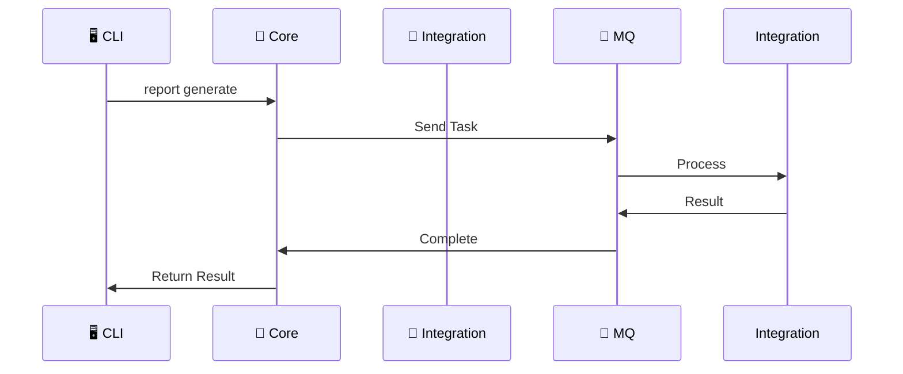

# 整合分析流程

```mermaid
sequenceDiagram
    participant CLI as 🖥️ CLI
    participant Core as 🤖 Core
    participant Intg as 🔗 Integration
    participant MQ as 📨 MQ

    CLI->>Core: report generate
    Core->>MQ: Send Task
    MQ->>Integration: Process
    Integration->>MQ: Result
    MQ->>Core: Complete
    Core->>CLI: Return Result
```

