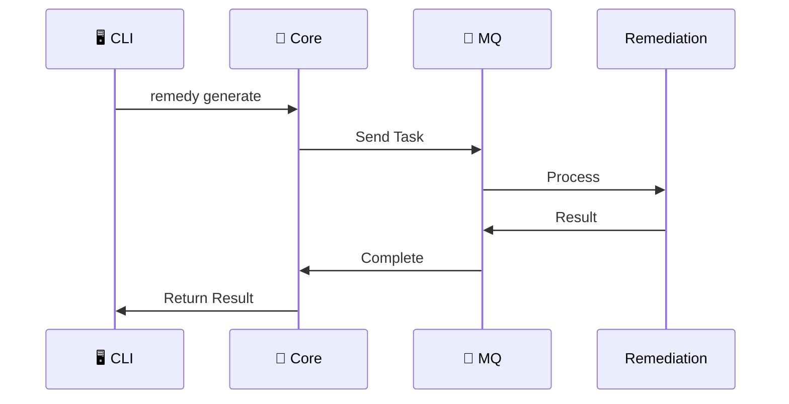

# 修復建議流程

```mermaid
sequenceDiagram
    participant CLI as 🖥️ CLI
    participant Core as 🤖 Core
    participant MQ as 📨 MQ

    CLI->>Core: remedy generate
    Core->>MQ: Send Task
    MQ->>Remediation: Process
    Remediation->>MQ: Result
    MQ->>Core: Complete
    Core->>CLI: Return Result
```

