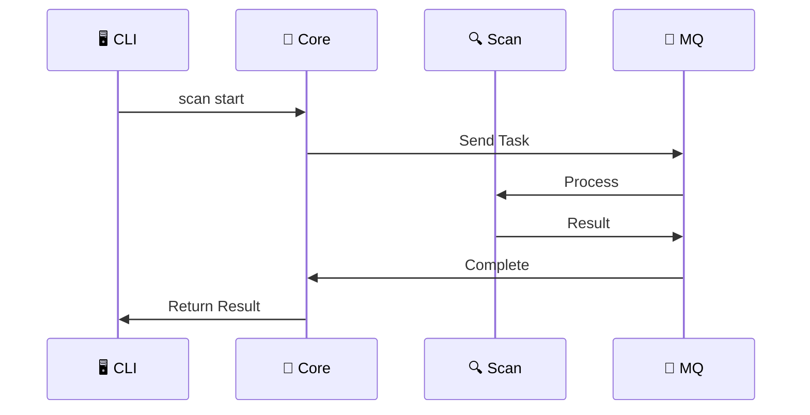

# 掃描流程

```mermaid
sequenceDiagram
    participant CLI as 🖥️ CLI
    participant Core as 🤖 Core
    participant Scan as 🔍 Scan
    participant MQ as 📨 MQ

    CLI->>Core: scan start
    Core->>MQ: Send Task
    MQ->>Scan: Process
    Scan->>MQ: Result
    MQ->>Core: Complete
    Core->>CLI: Return Result
```

