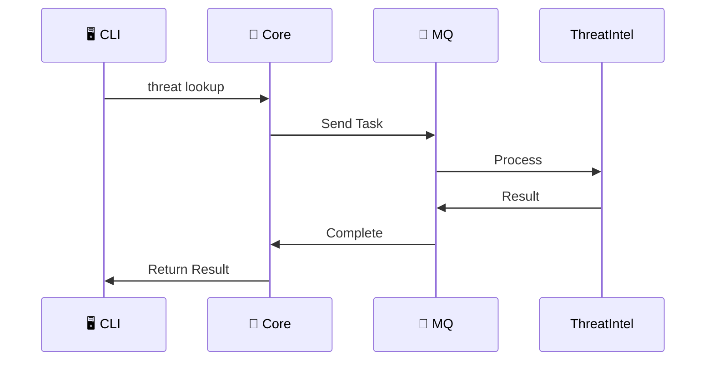

# 威脅情報流程

```mermaid
sequenceDiagram
    participant CLI as 🖥️ CLI
    participant Core as 🤖 Core
    participant MQ as 📨 MQ

    CLI->>Core: threat lookup
    Core->>MQ: Send Task
    MQ->>ThreatIntel: Process
    ThreatIntel->>MQ: Result
    MQ->>Core: Complete
    Core->>CLI: Return Result
```

