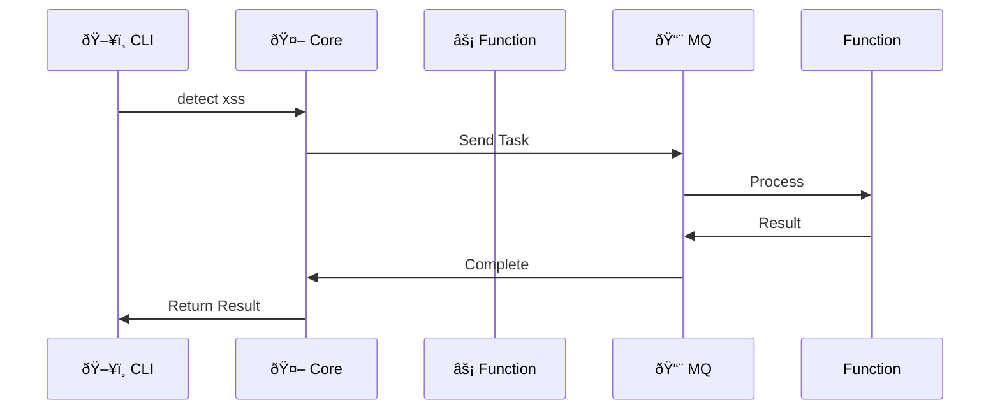

# XSS 檢測æµç¨‹

```mermaid
sequenceDiagram
    participant CLI as ðŸ–¥ï¸ CLI
    participant Core as 🤖 Core
    participant Func as âš¡ Function
    participant MQ as 📨 MQ

    CLI->>Core: detect xss
    Core->>MQ: Send Task
    MQ->>Function: Process
    Function->>MQ: Result
    MQ->>Core: Complete
    Core->>CLI: Return Result
```

