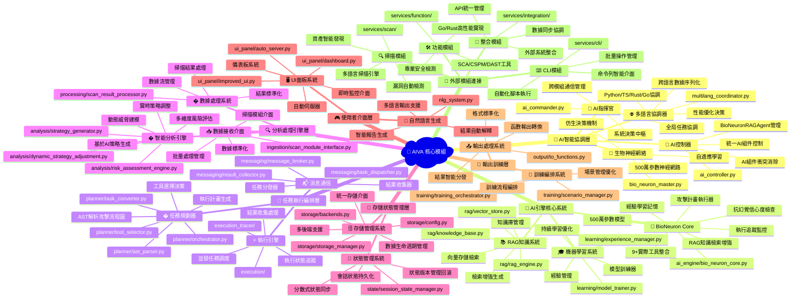
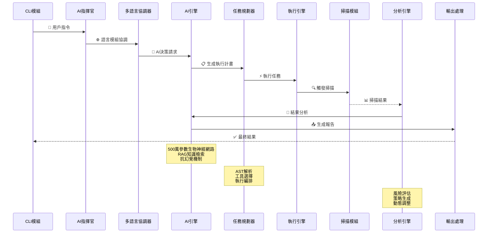

# 🧠 AIVA 核心模組完整指南

> **版本**: 1.0  
> **更新時間**: 2025-10-17  
> **狀態**: 已清理並準備開發

---

## ⚠️ **重要：開發前必讀架構原則**

### 🏛️ 統一架構標準

**在進行任何開發前，必須先確認以下核心架構組件：**

#### 1. 官方 Schema 定義檢查
```bash
# 必須先檢查官方 Schema 是否最新
ls -la services/aiva_common/schemas/
ls -la services/aiva_common/enums/
```

**核心 Schema 文件**:
- `services/aiva_common/schemas/` - 官方數據結構定義
  - `assets.py` - 資產定義
  - `findings.py` - 發現結果結構  
  - `security.py` - 安全相關結構
  - `tasks.py` - 任務定義
  - `telemetry.py` - 遙測數據
- `services/aiva_common/enums/` - 官方枚舉定義
  - `security.py` - 安全相關枚舉
  - `assets.py` - 資產類型枚舉
  - `modules.py` - 模組相關枚舉

#### 2. 架構一致性原則 🔒

| 原則 | 要求 | 檢查點 |
|------|------|--------|
| **官方優先** | 有官方定義的必須使用官方版本 | ✅ 檢查 `aiva_common` 中是否已存在 |
| **避免衝突** | 自定義前必須確認不與官方衝突 | ✅ 名稱、結構、用途都不能重複 |
| **完全一致** | 所有模組使用相同定義 | ✅ 不允許同一概念的不同實現 |
| **協調統一** | 核心模組作為協調中樞 | ✅ 負責跨模組數據流和狀態管理 |
| **強制插件** | 使用格式化和檢查插件 | ✅ Black、mypy、ruff 等 |

#### 3. 開發流程檢查清單 ✅

**新增功能前必須執行：**

```bash
# 1. 檢查官方 Schema 更新
git pull origin main
cd services/aiva_common && git log --oneline -10

# 2. 搜索未完成的開發項目
grep -r "TODO\|FIXME\|XXX" services/aiva_common/

# 3. 檢查依賴關係
find services/aiva_common/ -name "*.py" -exec grep -l "YourNewConcept" {} \;
```

---

## 📁 目錄結構

```
├─core
│   │   ├─aiva_core                                         # AIVA 核心模組
│   │   │   ├─ai_engine                                     # AI 引擎      
│   │   │   │   ├─training                                  # 訓練模組
│   │   │   │   │   ├─__init__.py                           # 模組初始化   
│   │   │   │   │   ├─data_loader.py                        # Python 模組  
│   │   │   │   │   ├─model_updater.py                      # Python 模組  
│   │   │   │   │   └─trainer.py                            # Python 模組  
│   │   │   │   ├─__init__.py                               # 模組初始化   
│   │   │   │   ├─bio_neuron_core.py                        # 生物神經元核 心
│   │   │   │   ├─cli_tools.py                              # 工具集       
│   │   │   │   ├─knowledge_base.py                         # Python 模組
│   │   │   │   ├─simple_matcher.py                         # Python 模組  
│   │   │   │   └─tools.py                                  # 工具集       
│   │   │   ├─ai_engine_backup                              # AI 引擎備份  
│   │   │   │   ├─__init__.py                               # 模組初始化   
│   │   │   │   ├─bio_neuron_core_v2.py                     # 生物神經元核 心 v2
│   │   │   │   ├─bio_neuron_core.py                        # 生物神經元核 心
│   │   │   │   ├─knowledge_base.py                         # Python 模組  
│   │   │   │   └─tools.py                                  # 工具集       
│   │   │   ├─ai_model                                      # AI 模型      
│   │   │   │   └─train_classifier.py                       # Python 模組  
│   │   │   ├─analysis                                      # 分析模組     
│   │   │   │   ├─__init__.py                               # 模組初始化   
│   │   │   │   ├─ast_trace_comparator.py                   # Python 模組
│   │   │   │   ├─dynamic_strategy_adjustment.py            # Python 模組  
│   │   │   │   ├─initial_surface.py                        # Python 模組  
│   │   │   │   ├─plan_comparator.py                        # Python 模組  
│   │   │   │   ├─risk_assessment_engine.py                 # 引擎
│   │   │   │   └─strategy_generator.py                     # Python 模組  
│   │   │   ├─authz                                         # 授權模組     
│   │   │   │   ├─__init__.py                               # 模組初始化   
│   │   │   │   ├─authz_mapper.py                           # 授權模組     
│   │   │   │   ├─matrix_visualizer.py                      # Python 模組  
│   │   │   │   └─permission_matrix.py                      # Python 模組  
│   │   │   ├─bizlogic                                      # 業務邏輯     
│   │   │   │   ├─__init__.py                               # 模組初始化
│   │   │   │   ├─finding_helper.py                         # 輔助函數     
│   │   │   │   └─worker.py                                 # 工作執行器   
│   │   │   ├─execution                                     # 執行模組     
│   │   │   │   ├─__init__.py                               # 模組初始化   
│   │   │   │   ├─execution_status_monitor.py               # 執行模組     
│   │   │   │   ├─plan_executor.py                          # Python 模組  
│   │   │   │   ├─task_generator.py                         # Python 模組  
│   │   │   │   ├─task_queue_manager.py                     # 管理器
│   │   │   │   └─trace_logger.py                           # 日誌
│   │   │   ├─execution_tracer                              # 執行追蹤器   
│   │   │   │   ├─__init__.py                               # 模組初始化   
│   │   │   │   ├─execution_monitor.py                      # 執行模組     
│   │   │   │   ├─task_executor.py                          # Python 模組  
│   │   │   │   └─trace_recorder.py                         # Python 模組  
│   │   │   ├─ingestion                                     # 資料接收     
│   │   │   │   ├─__init__.py                               # 模組初始化   
│   │   │   │   └─scan_module_interface.py                  # Python 模組
│   │   │   ├─learning                                      # 學習模組     
│   │   │   │   ├─__init__.py                               # 模組初始化   
│   │   │   │   ├─experience_manager.py                     # 管理器       
│   │   │   │   └─model_trainer.py                          # Python 模組  
│   │   │   ├─messaging                                     # 訊息處理     
│   │   │   │   ├─__init__.py                               # 模組初始化
│   │   │   │   ├─message_broker.py                         # Python 模組  
│   │   │   │   ├─result_collector.py                       # Python 模組  
│   │   │   │   └─task_dispatcher.py                        # Python 模組  
│   │   │   ├─output                                        # 輸出模組     
│   │   │   │   ├─__init__.py                               # 模組初始化   
│   │   │   │   └─to_functions.py                           # Python 模組  
│   │   │   ├─planner                                       # 規劃器       
│   │   │   │   ├─__init__.py                               # 模組初始化   
│   │   │   │   ├─ast_parser.py                             # Python 模組
│   │   │   │   ├─orchestrator.py                           # Python 模組  
│   │   │   │   ├─task_converter.py                         # Python 模組  
│   │   │   │   └─tool_selector.py                          # Python 模組  
│   │   │   ├─processing
│   │   │   │   ├─__init__.py                               # 模組初始化
│   │   │   │   └─scan_result_processor.py                  # Python 模組  
│   │   │   ├─rag                                           # RAG 檢索增強 
│   │   │   │   ├─__init__.py                               # 模組初始化   
│   │   │   │   ├─demo_rag_integration.py                   # RAG 檢索增強 
│   │   │   │   ├─knowledge_base.py                         # Python 模組  
│   │   │   │   ├─rag_engine.py                             # RAG 檢索增強 
│   │   │   │   └─vector_store.py                           # Python 模組  
│   │   │   ├─state                                         # 狀態管理     
│   │   │   │   ├─__init__.py                               # 模組初始化
│   │   │   │   └─session_state_manager.py                  # 管理器       
│   │   │   ├─storage                                       # 儲存模組     
│   │   │   │   ├─__init__.py                               # 模組初始化   
│   │   │   │   ├─backends.py                               # Python 模組  
│   │   │   │   ├─config.py                                 # 配置管理     
│   │   │   │   ├─models.py                                 # 資料模型     
│   │   │   │   └─storage_manager.py                        # 管理器       
│   │   │   ├─training                                      # 訓練模組     
│   │   │   │   ├─__init__.py                               # 模組初始化
│   │   │   │   ├─scenario_manager.py                       # 管理器       
│   │   │   │   └─training_orchestrator.py                  # 訓練模組     
│   │   │   ├─ui_panel                                      # UI 面板      
│   │   │   │   ├─__init__.py                               # 模組初始化   
│   │   │   │   ├─auto_server.py                            # 伺服器       
│   │   │   │   ├─dashboard.py                              # Python 模組  
│   │   │   │   ├─improved_ui.py                            # Python 模組  
│   │   │   │   └─server.py                                 # 伺服器       
│   │   │   ├─__init__.py                                   # 模組初始化   
│   │   │   ├─ai_commander.py                               # AI 指揮官    
│   │   │   ├─ai_controller.py                              # AI 控制器    
│   │   │   ├─ai_integration_test.py                        # AI 整合測試
│   │   │   ├─ai_ui_schemas.py                              # AI UI 資料結 構
│   │   │   ├─app.py                                        # 應用程式入口 
│   │   │   ├─bio_neuron_master.py                          # 生物神經元主 控
│   │   │   ├─business_schemas.py                           # 業務資料結構 
│   │   │   ├─multilang_coordinator.py                      # 多語言協調器 
│   │   │   ├─nlg_system.py                                 # 自然語言生成 系統
│   │   │   ├─optimized_core.py                             # 最佳化核心   
│   │   │   └─schemas.py                                    # 資料結構定義 
│   │   ├─__init__.py                                       # 模組初始化   
│   │   ├─ai_models.py                                      # AI 模型      
│   │   └─models.py                                         # 資料模型     
│   ├─function
│   │   ├─common
│   │   │   ├─go
│   │   │   │   └─aiva_common_go                            # Go 共用模組
│   │   │   │       ├─config                                # 配置
│   │   │   │       │   ├─config_test.go                    # 配置
│   │   │   │       │   └─config.go                         # 配置管理     
│   │   │   │       ├─logger                                # 日誌
│   │   │   │       │   └─logger.go                         # 日誌記錄器   
│   │   │   │       ├─mq                                    # 訊息佇列     
│   │   │   │       │   ├─client_test.go                    # 測試程式     
│   │   │   │       │   └─client.go                         # 客戶端       
│   │   │   │       └─schemas                               # 資料結構     
│   │   │   │           ├─message_test.go                   # 測試程式
│   │   │   │           └─message.go                        # 訊息處理     
│   │   │   ├─__init__.py                                   # 模組初始化   
│   │   │   ├─advanced_detection_config.py                  # 配置管理     
│   │   │   ├─detection_config.py                           # 配置管理     
│   │   │   ├─unified_smart_detection_manager.py            # 管理器       
│   │   │   └─worker_statistics.py                          # 工作器      

---

## 🎯 核心模組概述

### 🌳 核心模組樹狀架構圖



### 📋 主要職責

| 職責類別 | 具體功能 | 關鍵組件 | 實現檔案 |
|---------|---------|---------|---------|
| **🎯 AI 智能協調** | 全局決策、任務分發、智能協調 | AICommander, AIController | `ai_commander.py`, `ai_controller.py` |
| **🧬 生物神經運算** | 500萬參數神經網路、仿生決策 | BioNeuronMaster, AI引擎 | `bio_neuron_master.py`, `ai_engine/bio_neuron_core.py` |
| **🌐 多語言協調** | Python/TS/Rust/Go模組協調 | MultilangCoordinator | `multilang_coordinator.py` |
| **📋 任務規劃執行** | AST解析、執行計畫、工具選擇 | Orchestrator, TaskConverter | `planner/orchestrator.py`, `execution/` |
| **🔍 數據分析處理** | 風險評估、策略生成、結果處理 | AnalysisEngine, Processor | `analysis/`, `processing/` |
| **📚 知識管理** | RAG系統、向量存儲、知識檢索 | RAGEngine, VectorStore | `rag/rag_engine.py`, `rag/vector_store.py` |
| **🎓 機器學習** | 模型訓練、經驗學習、持續優化 | ModelTrainer, ExperienceManager | `learning/`, `training/` |
| **💾 存儲狀態管理** | 數據持久化、狀態同步、會話管理 | StorageManager, StateManager | `storage/`, `state/` |

### 🔄 核心數據流



---

## ⚙️ 核心組件詳解

### 1. 🎯 AI 指揮官 (AICommander)

**文件**: `aiva_core/ai_commander.py`

**職責**:
- 🎯 全局任務協調和智能分發
- 🌐 跨模組通信管理和協議統一  
- 📊 系統狀態監控和決策中樞
- 🤖 AI組件衝突解決和資源調度

**核心方法**:
```python
class AICommander:
    async def coordinate_modules(self, task: SystemTask) -> TaskResult
    async def distribute_workload(self, workload: WorkloadSpec) -> DistributionResult
    async def monitor_system_health(self) -> SystemHealthStatus
    async def resolve_ai_conflicts(self, conflicts: list[AIConflict]) -> Resolution
```

### 2. 🧬 生物神經網絡主控 (BioNeuronMaster)

**文件**: `aiva_core/bio_neuron_master.py`

**職責**:
- 🧠 500萬參數仿生神經網絡決策
- 🔄 自適應學習和模式識別優化
- 🎯 攻擊策略生成和執行指導
- 💡 智能決策支援和風險評估

**核心特性**:
```python
class BioNeuronMaster:
    # 500萬參數神經網路
    neural_network: NeuralNetwork(params=5_000_000)
    
    # 仿生決策機制
    async def bio_decision(self, context: DecisionContext) -> BiologicalDecision
    
    # 自適應學習
    async def adaptive_learning(self, feedback: LearningFeedback) -> ModelUpdate
```

### 3. 🌐 多語言協調器 (MultilangCoordinator)

**文件**: `aiva_core/multilang_coordinator.py`

**職責**:
- 🔗 Python/TypeScript/Rust/Go 模組無縫協調
- 🔄 跨語言數據序列化和協議轉換
- ⚡ 性能優化決策和負載平衡
- 🛠️ 語言特性最佳化利用

**語言模組管理**:
```python
@dataclass
class LanguageModuleInfo:
    language: str  # Python/TypeScript/Rust/Go
    module_name: str
    ai_capabilities: list[str]
    communication_port: int
    performance_metrics: PerformanceMetrics
    
class MultilangCoordinator:
    async def coordinate_languages(self, task: MultiLangTask) -> CoordinationResult
    async def optimize_performance(self, metrics: SystemMetrics) -> OptimizationPlan
```

### 4. 🚀 AI 引擎核心系統

**目錄**: `aiva_core/ai_engine/`

**🧠 BioNeuron Core** (`bio_neuron_core.py`):
- ✅ 500萬參數生物神經網路
- ✅ RAG 知識檢索與增強生成
- ✅ 抗幻覺機制（信心度檢查）
- ✅ 9+ 實際工具整合
- ✅ 攻擊計畫執行器
- ✅ 執行追蹤與監控
- ✅ 經驗學習與記憶系統

**🛠️ 工具整合** (`tools.py`, `cli_tools.py`):
- 實際工具調用和結果處理
- CLI工具包裝和標準化
- 工具性能監控和優化

### 5. 📋 任務規劃執行引擎

**目錄**: `aiva_core/planner/` & `aiva_core/execution/`

**🎯 攻擊編排器** (`orchestrator.py`):
```python
@dataclass
class ExecutionPlan:
    plan_id: str
    graph: AttackFlowGraph  # AST解析的攻擊流程圖
    task_sequence: TaskSequence  # 任務序列
    tool_decisions: dict[str, ToolDecision]  # 工具選擇決策

class AttackOrchestrator:
    async def orchestrate_attack(self, request: AttackRequest) -> ExecutionPlan
    async def execute_plan(self, plan: ExecutionPlan) -> ExecutionResult
```

**🔄 AST 解析器** (`ast_parser.py`):
- 攻擊語法樹解析和流程圖生成
- 複雜攻擊邏輯分解和優化
- 並行執行路徑識別

**⚡ 任務轉換器** (`task_converter.py`):
- 高級任務到可執行任務的轉換
- 任務依賴關係管理
- 並發執行策略優化

### 6. 🔍 分析處理引擎

**目錄**: `aiva_core/analysis/` & `aiva_core/processing/`

**📊 風險評估引擎** (`risk_assessment_engine.py`):
- 多維度風險評估和量化
- 動態威脅建模和預測
- 風險優先級自動排序

**🎯 策略生成器** (`strategy_generator.py`):
- 基於AI的攻擊策略自動生成
- 目標環境適應性優化
- 成功率預測和策略調整

**🔄 動態策略調整** (`dynamic_strategy_adjustment.py`):
- 實時執行反饋分析
- 策略參數動態調整
- 失敗恢復和替代方案

### 7. 📚 RAG 知識管理系統

**目錄**: `aiva_core/rag/`

**🧠 RAG 引擎** (`rag_engine.py`):
- 向量化知識檢索和相似度匹配
- 上下文感知的知識增強生成
- 多模態知識融合和推理

**📊 向量存儲** (`vector_store.py`):
- 高效向量索引和檢索
- 增量知識更新和管理
- 分散式向量計算支援

**📖 知識庫** (`knowledge_base.py`):
- 安全知識結構化存儲
- 攻擊模式和防護策略庫
- 威脅情報自動更新

### 8. 💾 存儲狀態管理

**目錄**: `aiva_core/storage/` & `aiva_core/state/`

**🗄️ 存儲管理器** (`storage_manager.py`):
- 統一存儲介面和多後端支援
- 數據生命週期管理
- 高可用性和災難恢復

**🔄 狀態管理器** (`session_state_manager.py`):
- 會話狀態持久化和恢復
- 分散式狀態同步
- 狀態版本管理和回滾

---

## 🔧 開發指南

### 新增 AI 模型

1. **檢查官方定義**:
```bash
grep -r "ModelType\|AIModel" services/aiva_common/
grep -r "TrainingConfig\|ModelResult" services/aiva_common/schemas/
```

2. **在 ai_models.py 中定義**:
```python
# 確保遵循 aiva_common 中的官方枚舉
from ..aiva_common.enums.ai import ModelType, TrainingStatus

class YourAIModel(BaseModel):
    model_type: ModelType
    training_status: TrainingStatus
    # ... 其他字段
```

### 新增業務邏輯

1. **在 models.py 中定義數據模型**:
```python
# 使用官方 Schema 基類
from ..aiva_common.schemas.base import BaseSchema

class YourBusinessModel(BaseSchema):
    # 實現您的業務邏輯模型
    pass
```

2. **在相應子系統中實現邏輯**:
```python
# aiva_core/bizlogic/your_logic.py
from ...models import YourBusinessModel
```

### 跨語言集成

**TypeScript 組件集成**:
```python
# aiva_core/multilang_coordinator.py
async def coordinate_typescript_component(self, request: TypeScriptRequest):
    # 實現 TypeScript 組件協調邏輯
    pass
```

**Rust 組件集成**:
```python
# 利用 Rust 的高性能特性
async def delegate_to_rust(self, heavy_computation: RustTask):
    # 委派計算密集型任務給 Rust 組件
    pass
```

---

## 🧪 開發環境設置

### Python 環境配置

```bash
# 設置虛擬環境
cd services/core
python -m venv venv
source venv/bin/activate  # Linux/Mac
# 或
venv\Scripts\activate     # Windows

# 安裝依賴
pip install -r requirements.txt
```

### 代碼質量檢查

```bash
# 格式化代碼
black services/core/aiva_core/ || {
    echo "❌ Python 代碼格式不符合規範，請運行: black services/core/aiva_core/"
    exit 1
}

# 類型檢查
mypy services/core/aiva_core/

# 代碼檢查
ruff check services/core/aiva_core/
```

### VS Code 配置

```json
{
  "python.defaultInterpreterPath": "./venv/bin/python",
  "python.linting.enabled": true,
  "python.linting.mypyEnabled": true,
  "python.formatting.provider": "black",
  "editor.formatOnSave": true,
  "editor.codeActionsOnSave": {
    "source.organizeImports": true,
    "source.fixAll": true
  }
}
```

---

## 🔍 架構檢查

### Schema 兼容性檢查

```python
# services/aiva_common/schemas/__init__.py
def check_schema_compatibility():
    from packaging import version
    # 檢查 Schema 版本兼容性
    pass

from ..aiva_common.schemas import check_schema_compatibility
```

---

## 📊 性能監控

### 關鍵指標

| 指標類別 | 監控項目 | 正常範圍 |
|---------|---------|---------|
| **響應時間** | AI 決策延遲 | < 200ms |
| **吞吐量** | 任務處理速率 | > 100 tasks/min |
| **資源使用** | CPU/記憶體使用率 | < 80% |
| **錯誤率** | 任務失敗率 | < 1% |

### 監控實現

```python
# aiva_core/monitoring/performance_monitor.py
class PerformanceMonitor:
    async def track_ai_decision_time(self, decision_start: datetime):
        # 追蹤 AI 決策時間
        pass
    
    async def monitor_system_resources(self):
        # 監控系統資源使用
        pass
```

---

## 🚀 部署指南

### 本地開發

```bash
# 啟動核心模組開發服務器
cd services/core/aiva_core/ui_panel
python auto_server.py --mode hybrid --ports 8000
```

### 生產環境

```bash
# 使用 Docker 部署
docker-compose -f docker/docker-compose.yml up core-module
```

---

## 🛡️ 架構合規性

**本指南適用於所有 AIVA 平台模組**，包括但不限於：
- ✅ **Scan 模組** (`services/scan/`)
- ✅ **Function 模組** (`services/function/`)  
- ✅ **Integration 模組** (`services/integration/`)
- ✅ **CLI 模組** (`services/cli/`)
- ✅ **所有工具模組** (`tools/`)

**統一要求**：
1. 🔍 **先檢查官方定義** - `services/aiva_common/schemas/` 和 `services/aiva_common/enums/`
2. 🚫 **禁止重複定義** - 有官方版本必須使用官方版本
3. ✅ **完全一致使用** - 所有模組使用相同的架構定義
4. 🤝 **協調優先** - 核心模組作為跨模組協調中樞
5. 🔧 **強制插件使用** - Black、mypy、ruff 等檢查工具

### 下一步行動
1. **整合 AI 模型訓練**: 將 `attack_pattern_trainer.py` 集成到核心 AI 引擎中
   - ⚠️ **首先檢查**: `services/aiva_common/enums/ai.py` 中的 AI 相關定義
   - ⚠️ **統一使用**: 確保 AI 模型類型與官方枚舉一致
2. **優化跨模組協調**: 增強多語言協調器的性能
3. **完善監控系統**: 建立全面的性能和健康監控
4. **擴展 RAG 系統**: 集成更多知識源和學習能力

### 🔧 架構檢查工具

使用以下命令確保遵循架構原則：
```bash
# 檢查 Schema 一致性
python tools/validate_schema_consistency.py

# 檢查代碼格式
./scripts/format_all_modules.sh

# 檢查架構合規性  
./scripts/architecture_compliance_check.sh
```

### 技術支持
- 📧 **架構問題**: 優先檢查 `services/aiva_common/` 官方定義
- 📚 **Schema 更新**: 遵循版本管理和向後兼容原則
- 🔧 **插件配置**: 參考項目根目錄的標準配置文件
- 🏛️ **架構審查**: 所有 PR 必須通過架構一致性檢查

---

**重要提醒**: 🚨 **任何違反架構一致性原則的代碼都不會被合併！** 

**版權聲明**: © 2025 AIVA Security Platform. All rights reserved.