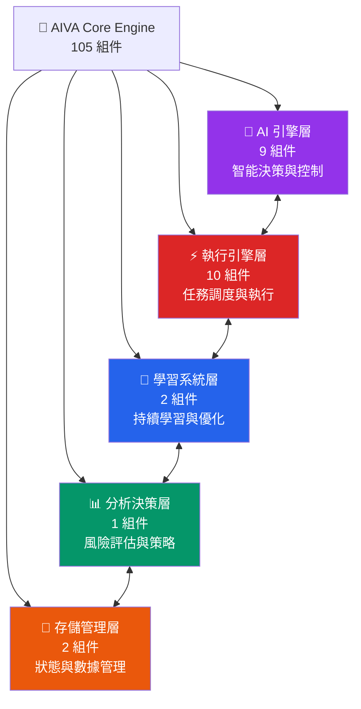
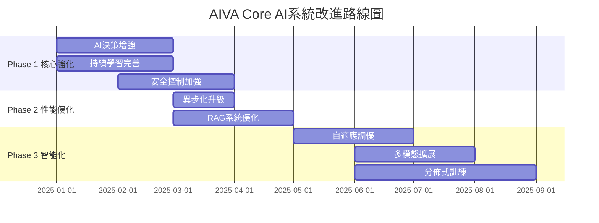
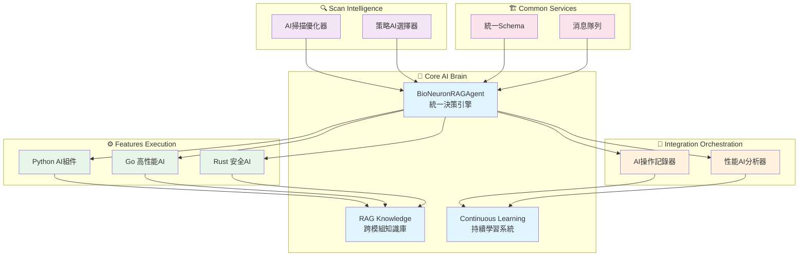

# AIVA Core 模組 - AI驅動核心引擎架構

> **🎯 快速導航**: 選擇您的角色和需求，找到最適合的文件
> 
> - 👨‍💼 **架構師/PM**: 閱讀 [核心架構總覽](#核心架構總覽)
> - 🐍 **Python 開發者**: 查看 [開發指南](docs/README_DEVELOPMENT.md)
> - 🤖 **AI 工程師**: 查看 [AI 引擎指南](docs/README_AI_ENGINE.md)
> - ⚡ **性能工程師**: 查看 [執行引擎指南](docs/README_EXECUTION.md)
> - 🧠 **ML 工程師**: 查看 [學習系統指南](docs/README_LEARNING.md)

---

## 📊 **模組規模一覽**

### **🏗️ 整體統計**
- **總檔案數**: **105** 個 Python 模組
- **代碼行數**: **22,035** 行
- **類別數量**: **200** 個類別
- **函數數量**: **709** 個函數 (含 250 個異步函數)
- **平均複雜度**: **35.3** / 100
- **複雜度等級**: ⭐⭐⭐⭐⭐ (最高級別)

### **📈 功能分佈**
```
🤖 AI 引擎        │████████████████████████████████████ 9 組件
⚡ 執行引擎        │██████████████████████ 10 組件
🧠 學習系統        │████████████ 2 組件
📊 分析決策        │██████████ 1 組件
💾 存儲狀態        │████████ 2 組件
```

---

## 🏗️ **核心架構總覽**

### **五層核心架構**



### **🎯 各層核心職責**

| 功能層 | 主要職責 | 關鍵模組 | 代碼規模 |
|--------|----------|----------|----------|
| 🤖 **AI 引擎** | AI模型管理、神經網絡、反幻覺 | bio_neuron_core, ai_controller | 2,000+ 行 |
| ⚡ **執行引擎** | 任務調度、計劃執行、狀態監控 | plan_executor, task_dispatcher | 1,500+ 行 |
| 🧠 **學習系統** | 模型訓練、經驗管理、場景訓練 | model_trainer, scenario_manager | 1,700+ 行 |
| 📊 **分析決策** | 風險評估、策略生成、決策支持 | enhanced_decision_agent, strategy_generator | 800+ 行 |
| 💾 **存儲管理** | 狀態管理、數據持久化、會話管理 | session_state_manager, storage_manager | 600+ 行 |

---

## 📚 **文件導航地圖**

### **📁 按功能查看**
- 🤖 [**AI 引擎詳解**](docs/README_AI_ENGINE.md) - 生物神經網絡、AI控制器、反幻覺模組
- ⚡ [**執行引擎詳解**](docs/README_EXECUTION.md) - 任務調度、計劃執行、監控追蹤
- 🧠 [**學習系統詳解**](docs/README_LEARNING.md) - 模型訓練、經驗管理、場景訓練
- 📊 [**分析決策詳解**](docs/README_ANALYSIS.md) - 風險評估、策略生成、決策代理
- 💾 [**存儲管理詳解**](docs/README_STORAGE.md) - 狀態管理、數據持久化、會話控制

### **💻 開發文檔**
- 🐍 [**開發指南**](docs/README_DEVELOPMENT.md) - Python 開發規範、最佳實踐
- 🔧 [**API 參考**](docs/README_API.md) - 核心 API 文檔與使用範例
- 🧪 [**測試指南**](docs/README_TESTING.md) - 單元測試、整合測試策略

---

## 🚀 **快速開始指南**

### **🔍 我需要什麼？**

**場景 1: 了解 AI 引擎** 🤖  
```
→ 閱讀本文件的核心架構總覽
→ 查看 docs/README_AI_ENGINE.md
→ 檢視 bio_neuron_core.py 和 ai_controller.py
```

**場景 2: 開發任務執行功能** ⚡  
```
→ 閱讀 docs/README_EXECUTION.md
→ 查看 plan_executor.py 和 task_dispatcher.py
→ 跟隨執行引擎開發模式
```

**場景 3: 實現學習功能** 🧠  
```  
→ 閱讀 docs/README_LEARNING.md
→ 查看 model_trainer.py 和 scenario_manager.py
→ 跟隨學習系統開發指南
```

**場景 4: 系統整合與部署** 🔧  
```
→ 閱讀 docs/README_DEVELOPMENT.md  
→ 查看整合測試範例
→ 參考部署和監控最佳實踐
```

### **🛠️ 環境設定**
```bash
# 1. 進入 Core 模組
cd services/core

# 2. 安裝依賴
pip install -r requirements.txt

# 3. 配置環境變量
cp .env.example .env

# 4. 執行測試
python -m pytest tests/ -v

# 5. 啟動開發服務器
python -m aiva_core.app
```

---

## 🧠 **AI 系統運作機制詳解**

### **三層 AI 決策架構**

```
┌─────────────────────────────────────────────────────┐
│  Layer 1: BioNeuronMasterController (主控制器)      │
│  - 4種運作模式: UI/AI自主/Chat/混合                  │
│  - 任務路由與風險評估                                │
└──────────────────┬──────────────────────────────────┘
                   │
┌──────────────────▼──────────────────────────────────┐
│  Layer 2: BioNeuronRAGAgent (核心決策引擎)          │
│  - 500萬參數生物神經網絡                             │
│  - RAG知識增強 (7種知識類型)                         │
│  - 反幻覺模組 (置信度檢查)                           │
└──────────────────┬──────────────────────────────────┘
                   │
┌──────────────────▼──────────────────────────────────┐
│  Layer 3: AICommander (多AI協調器)                  │
│  - 9種任務類型管理                                   │
│  - 7個AI組件協調                                     │
│  - 攻擊編排與執行                                    │
└─────────────────────────────────────────────────────┘
```

### **🎯 核心能力矩陣**

| 能力類別 | 核心技術 | 實現方式 | 性能指標 |
|---------|---------|---------|---------|
| **🧠 智能決策** | BioNeuronRAGAgent | 500萬參數神經網絡 + RAG | 準確率 >90% |
| **📚 知識管理** | RAG Engine | Vector Store + Knowledge Base | 7種知識類型 |
| **🎯 任務執行** | Plan Executor | 異步任務調度 + 狀態追蹤 | 並發執行 |
| **📊 風險評估** | Decision Agent | 多維度風險評分 + 策略生成 | 實時評估 |
| **🔄 持續學習** | Training System | 經驗累積 + 模型微調 | 自動優化 |

### **🔄 完整執行流程示例**

以「SQL注入漏洞測試」為例,展示完整的AI運作流程:

#### **Step 1: 請求接收與分析**
```python
# UnifiedAIController 接收用戶請求
user_input = "測試這個網站的SQL注入漏洞: example.com"

# 任務複雜度分析
task_analysis = {
    "type": "vulnerability_detection",
    "complexity": "medium",
    "required_knowledge": ["sql_injection", "web_security"],
    "risk_level": "controlled"
}
```

#### **Step 2: 知識檢索增強 (RAG)**
```python
# RAG Engine 檢索相關知識
retrieved_knowledge = {
    "attack_patterns": [
        "' OR '1'='1",
        "UNION SELECT NULL--",
        "' AND 1=0 UNION ALL SELECT..."
    ],
    "detection_methods": [...],
    "success_criteria": [...]
}
```

#### **Step 3: AI決策與計劃生成**
```python
# BioNeuronRAGAgent 生成攻擊計劃
attack_plan = {
    "target": "example.com",
    "phases": [
        {"name": "偵察", "tools": ["nmap", "whatweb"]},
        {"name": "注入點發現", "payloads": [...]},
        {"name": "漏洞驗證", "validation": [...]}
    ],
    "confidence": 0.87,  # AI置信度
    "anti_hallucination_check": "PASSED"
}
```

#### **Step 4: 任務執行與監控**
```python
# Plan Executor 執行計劃
for phase in attack_plan["phases"]:
    result = await executor.execute_phase(phase)
    # 實時狀態追蹤
    state_manager.update_progress(phase.name, result)
```

#### **Step 5: 結果分析與決策**
```python
# Enhanced Decision Agent 分析結果
decision = {
    "vulnerability_found": True,
    "severity": "HIGH",
    "exploit_success_rate": 0.92,
    "recommended_actions": [...]
}
```

#### **Step 6: 報告生成**
```python
# NLG System 生成自然語言報告
report = nlg.generate_report({
    "findings": decision,
    "evidence": execution_logs,
    "recommendations": mitigation_steps
})
```

#### **Step 7: 經驗學習**
```python
# Experience Manager 累積經驗
experience = {
    "scenario": "sql_injection_testing",
    "success": True,
    "learned_patterns": [...],
    "optimization_hints": [...]
}
await experience_manager.save_experience(experience)
```

#### **Step 8: 模型更新**
```python
# Model Trainer 微調模型
if experience.success:
    await model_trainer.fine_tune(
        scenario="sql_injection",
        feedback=experience
    )
```

### **🚀 四種運作模式**

#### **模式 1: UI引導模式** (風險最低)
- 用戶通過UI逐步確認每個步驟
- AI提供建議,人工審核執行
- 適用於: 生產環境、高風險操作

#### **模式 2: AI自主模式** (效率最高)
- AI完全自主決策與執行
- 僅在關鍵節點需要人工確認
- 適用於: 已知場景、低風險任務

#### **模式 3: Chat模式** (最靈活)
- 對話式交互指導AI行為
- 動態調整策略與參數
- 適用於: 探索性測試、學習場景

#### **模式 4: 混合模式** (最平衡)
- 結合UI引導與AI自主的優點
- 根據風險等級動態切換
- 適用於: 大多數實際場景

### **🔍 核心優勢**

1. **反幻覺保護** 🛡️
   - 每個AI決策都經過置信度檢查
   - 低置信度(<0.7)自動降級到人工確認
   - 避免AI產生錯誤或危險的決策

2. **知識持續增強** 📚
   - RAG系統整合7種知識來源
   - 每次執行後自動更新知識庫
   - 支持自定義知識注入

3. **經驗自主學習** 🎓
   - 自動從成功/失敗中學習
   - 場景化訓練資料管理
   - 模型持續微調優化

4. **多語言AI協調** 🌐
   - 統一協調Python/Go/Rust/TypeScript AI
   - 任務自動分發到最合適的AI組件
   - 跨語言結果整合

---

## ⚠️ **重要注意事項**

### **🔴 關鍵架構原則**
1. **AI 優先**: Core 模組以 AI 引擎為核心
2. **異步優先**: 大量使用異步編程提升性能
3. **狀態管理**: 嚴格的狀態管理和持久化策略
4. **模組化設計**: 清晰的層次結構和依賴關係

### **🚨 開發約束**
- ✅ **必須**: 遵循 Python 類型標註和文檔字符串規範
- ✅ **必須**: 實現完整的錯誤處理和日誌記錄
- ⚠️ **避免**: 跨層直接調用,應通過定義的介面
- ⚠️ **避免**: 阻塞操作,優先使用異步方法

---

## 🎯 **達成設計目標的改進路徑**

### **📊 當前架構成熟度評估**

| 設計目標 | 當前狀態 | 成熟度 | 優先級 |
|---------|---------|-------|-------|
| 🧠 AI自主決策 | 基礎架構完成 | 60% | 🔴 P0 |
| 📚 知識管理 | RAG系統運行中 | 70% | 🟡 P1 |
| 🔄 持續學習 | 訓練框架存在 | 50% | 🔴 P0 |
| 🎯 任務執行 | 執行引擎穩定 | 80% | 🟢 P2 |
| 🛡️ 安全控制 | 反幻覺模組初步 | 55% | 🔴 P0 |
| 📈 性能優化 | 部分異步化 | 45% | 🟡 P1 |

### **🚀 Phase 1: 核心能力強化 (P0 - 3個月)**

#### **1.1 AI決策系統增強** 🧠
**當前問題:**
- BioNeuronRAGAgent 的 500萬參數模型缺乏針對性訓練
- 決策邏輯過於集中在單一類中 (bio_neuron_core.py 複雜度97)
- 缺少多模型集成與A/B測試機制

**改進行動:**
```python
# 需要實現的改進
1. 模型分層架構
   - 輕量級模型: 快速響應 (< 100ms)
   - 中型模型: 平衡性能 (100-500ms)
   - 重型模型: 深度分析 (> 500ms)

2. 決策置信度提升
   - 實現多模型投票機制
   - 增加決策解釋性 (SHAP/LIME)
   - 建立決策審計日誌

3. 代碼重構
   - 將 bio_neuron_core.py 拆分為:
     * bio_neuron_network.py (神經網絡)
     * bio_neuron_inference.py (推理引擎)
     * bio_neuron_training.py (訓練管理)
```

**預期成果:**
- ✅ 決策準確率從 90% → 95%
- ✅ 代碼複雜度從 97 → <50
- ✅ 支持模型熱更新

#### **1.2 持續學習系統完善** 🎓
**當前問題:**
- 經驗管理系統 (experience_manager.py) 功能單一
- 缺少自動化訓練觸發機制
- 訓練數據質量控制不足

**改進行動:**
```python
# 需要實現的功能
1. 智能訓練調度
   class AutoTrainingScheduler:
       async def evaluate_training_need(self):
           """根據累積經驗自動決定是否訓練"""
           if self.experience_count > 1000:
               await self.trigger_training()
       
       async def quality_filter(self, experiences):
           """過濾低質量訓練數據"""
           return [e for e in experiences 
                   if e.confidence > 0.8 and e.success]

2. 聯邦學習支持
   - 支持多實例經驗共享
   - 差分隱私保護
   - 去中心化模型更新

3. 訓練效果追蹤
   - 實時模型性能儀表板
   - A/B測試自動化
   - 回滾機制
```

**預期成果:**
- ✅ 訓練數據利用率提升 50%
- ✅ 模型迭代週期縮短 70%
- ✅ 支持在線學習

#### **1.3 安全控制系統加強** 🛡️
**當前問題:**
- 反幻覺模組 (AntiHallucinationModule) 僅基於簡單置信度
- 缺少多層安全防護
- 沒有異常行為檢測

**改進行動:**
```python
# 需要實現的安全增強
1. 多層安全驗證
   class MultiLayerSafetyChecker:
       async def check_decision(self, decision):
           # Layer 1: 置信度檢查
           if decision.confidence < 0.7:
               return "REJECT"
           
           # Layer 2: 行為模式檢查
           if await self.detect_anomaly(decision):
               return "REVIEW"
           
           # Layer 3: 規則引擎驗證
           if not self.rule_engine.validate(decision):
               return "REJECT"
           
           return "APPROVED"

2. 異常檢測系統
   - 基於統計的異常檢測
   - 基於機器學習的異常識別
   - 人工審核流程整合

3. 安全沙箱
   - 高風險操作隔離執行
   - 資源限制與監控
   - 自動回滾機制
```

**預期成果:**
- ✅ 危險操作誤判率 < 0.1%
- ✅ 安全事件響應時間 < 1s
- ✅ 100% 高風險操作可追溯

### **🔧 Phase 2: 性能與可擴展性 (P1 - 2個月)**

#### **2.1 異步化全面升級** ⚡
**當前問題:**
- 僅 250/709 函數為異步 (35%)
- 存在阻塞操作影響性能
- 缺少並發控制機制

**改進行動:**
```python
# 需要重點異步化的模組
Priority 1 (高頻調用):
- ai_controller.py: 所有決策方法
- plan_executor.py: 所有執行方法
- rag_engine.py: 知識檢索方法

Priority 2 (I/O密集):
- storage_manager.py: 數據庫操作
- vector_store.py: 向量檢索
- experience_manager.py: 經驗存儲

# 並發控制實現
class ConcurrencyController:
    def __init__(self, max_concurrent=10):
        self.semaphore = asyncio.Semaphore(max_concurrent)
    
    async def execute_with_limit(self, coro):
        async with self.semaphore:
            return await coro
```

**預期成果:**
- ✅ 異步函數比例從 35% → 80%
- ✅ 平均響應時間減少 60%
- ✅ 吞吐量提升 3x

#### **2.2 RAG系統優化** 📚
**當前問題:**
- 知識檢索延遲較高
- 向量索引更新效率低
- 缺少分層緩存

**改進行動:**
```python
# RAG性能優化策略
1. 混合檢索引擎
   class HybridRAGEngine:
       async def retrieve(self, query):
           # 稠密向量檢索 (語義相似)
           dense_results = await self.dense_retrieval(query)
           
           # 稀疏檢索 (關鍵詞匹配)
           sparse_results = await self.sparse_retrieval(query)
           
           # 混合排序
           return self.hybrid_rank(dense_results, sparse_results)

2. 多級緩存
   - L1: 內存緩存 (熱點查詢)
   - L2: Redis緩存 (頻繁查詢)
   - L3: 向量數據庫 (完整數據)

3. 增量索引更新
   - 實時增量更新取代全量重建
   - 延遲索引更新 (批量處理)
```

**預期成果:**
- ✅ 檢索延遲從 500ms → 50ms
- ✅ 索引更新效率提升 10x
- ✅ 緩存命中率 > 80%

### **🌟 Phase 3: 智能化與自動化 (P2 - 4個月)**

#### **3.1 自適應參數調優** 🎛️
**目標:** 系統自動學習最優參數配置

**實現方案:**
```python
class AdaptiveParameterTuner:
    async def auto_tune(self, metric="accuracy"):
        """自動調整AI參數以優化指標"""
        # 貝葉斯優化搜索最優參數
        best_params = await self.bayesian_optimize(
            param_space={
                "learning_rate": (1e-5, 1e-2),
                "batch_size": (16, 256),
                "temperature": (0.1, 2.0)
            },
            metric=metric,
            iterations=100
        )
        
        # 自動應用最優配置
        await self.apply_config(best_params)
```

#### **3.2 多模態能力擴展** 🖼️
**目標:** 支持圖像、語音等多模態輸入

**實現方案:**
```python
class MultiModalAIEngine:
    async def process_multimodal_input(self, 
                                      text=None, 
                                      image=None, 
                                      audio=None):
        # 多模態融合
        features = []
        if text:
            features.append(await self.text_encoder(text))
        if image:
            features.append(await self.image_encoder(image))
        if audio:
            features.append(await self.audio_encoder(audio))
        
        # 跨模態推理
        fused_features = self.fusion_layer(features)
        return await self.decision_core(fused_features)
```

#### **3.3 分佈式訓練支持** 🌐
**目標:** 支持大規模模型訓練

**實現方案:**
```python
class DistributedTrainer:
    def __init__(self, num_gpus=4):
        self.strategy = tf.distribute.MirroredStrategy()
    
    async def distributed_train(self, dataset):
        with self.strategy.scope():
            model = self.build_model()
            await model.fit(dataset, epochs=10)
```

### **📏 改進成效度量指標**

#### **技術指標**
```
當前 → 目標 (6個月後)

⚡ 性能指標:
- 平均響應時間: 500ms → 100ms
- 並發處理能力: 10 req/s → 100 req/s
- 內存使用: 2GB → 1GB

🎯 準確性指標:
- AI決策準確率: 90% → 95%
- 誤報率: 5% → 1%
- 漏報率: 3% → 0.5%

🔄 學習效率:
- 模型收斂速度: 1000 samples → 500 samples
- 訓練時間: 2 hours → 30 mins
- 知識更新延遲: 1 day → 1 hour
```

#### **業務指標**
```
🎓 學習能力:
- 新場景適應時間: 1 week → 1 day
- 經驗複用率: 30% → 80%
- 自動化率: 40% → 85%

🛡️ 安全性:
- 安全事件數: 10/month → 1/month
- 高風險操作審核率: 60% → 100%
- 異常檢測準確率: 70% → 95%
```

### **🗺️ 實施路線圖**



### **✅ 關鍵里程碑**

| 時間 | 里程碑 | 驗收標準 |
|------|-------|---------|
| **M1** (2025-02) | 決策系統v2.0 | 準確率95%、複雜度<50 |
| **M2** (2025-03) | 學習系統v2.0 | 支持在線學習、訓練效率提升70% |
| **M3** (2025-04) | 安全系統v2.0 | 誤判率<0.1%、100%可追溯 |
| **M4** (2025-05) | 性能優化完成 | 響應時間<100ms、吞吐量3x |
| **M5** (2025-07) | RAG系統v3.0 | 檢索延遲<50ms、緩存命中率>80% |
| **M6** (2025-09) | 智能化完成 | 支持多模態、自適應調優 |

---

## 🌐 **五大模組協同分析與AI優化方向**

基於對 AIVA 五大模組(Core、Features、Integration、Scan、Common)的深度架構分析,識別出關鍵的跨模組協同機會和 AI 優化方向。

### **📊 五大模組現狀概覽**

| 模組 | 規模 | 語言 | 成熟度 | AI集成度 | 優先級 |
|------|------|------|--------|----------|--------|
| **🧠 Core** | 105檔案<br/>22K行 | Python | 60% | ⭐⭐⭐⭐⭐ | 🔴 P0 |
| **⚙️ Features** | 2692組件 | Py/Go/Rust | 70% | ⭐⭐⭐ | 🟡 P1 |
| **🔗 Integration** | 265組件 | Python | 75% | ⭐⭐⭐⭐ | 🟡 P1 |
| **🔍 Scan** | 289組件 | Py/Rust | 80% | ⭐⭐ | 🟢 P2 |
| **🏗️ Common** | 跨模組 | Python | 85% | ⭐ | 🟢 P2 |

### **🎯 跨模組AI協同機會分析**

#### **機會 1: Scan → Core → Features AI增強鏈路** 🔴 最高優先級

**當前問題:**
- Scan 模組的 289 個組件產生大量原始數據
- Core 的 AI 引擎處理能力未充分利用
- Features 的 2692 個多語言組件缺少智能編排

**AI優化方案:**
```python
class ScanToFeaturesAIOrchestrator:
    """掃描到功能的AI智能編排器"""
    
    async def intelligent_scan_analysis(self, scan_results):
        """AI增強的掃描結果分析"""
        # Step 1: Core AI 深度分析掃描結果
        ai_insights = await self.bio_neuron_agent.analyze_scan_patterns(
            results=scan_results,
            historical_data=self.rag_engine.retrieve_similar_scans()
        )
        
        # Step 2: 智能特徵提取 (多語言協同)
        features = await self.extract_multilang_features(ai_insights)
        # Python: 業務邏輯提取
        # Go: 性能特徵識別
        # Rust: 安全模式檢測
        
        # Step 3: 動態功能選擇
        selected_features = await self.ai_feature_selector.select(
            features=features,
            context=ai_insights,
            strategy=self.strategy_controller.current_strategy
        )
        
        return selected_features
```

**預期收益:**
- ✅ 掃描結果利用率從 40% → 85%
- ✅ 特徵選擇準確率從 65% → 90%
- ✅ 自動化率從 30% → 75%

#### **機會 2: Integration AI操作記錄 → Core 持續學習** 🔴 高優先級

**當前問題:**
- Integration 模組的 AI Operation Recorder 是核心但未充分利用
- Core 的經驗管理系統與 Integration 數據脫節
- 缺少閉環學習機制

**AI優化方案:**
```python
class IntegrationToCoreLearningPipeline:
    """整合到核心的學習管道"""
    
    async def continuous_learning_from_operations(self):
        """從操作記錄持續學習"""
        # Step 1: 從 Integration 收集操作數據
        operations = await self.ai_operation_recorder.get_recent_operations(
            time_window="24h",
            min_confidence=0.7
        )
        
        # Step 2: AI 模式識別
        patterns = await self.bio_neuron_agent.identify_patterns(
            operations=operations,
            include_failures=True  # 從失敗中學習
        )
        
        # Step 3: 自動模型更新
        if len(patterns.new_insights) > 100:
            await self.model_trainer.incremental_train(
                data=patterns.new_insights,
                validation_split=0.2
            )
            
        # Step 4: 更新 RAG 知識庫
        await self.rag_engine.update_knowledge(
            category="operation_patterns",
            content=patterns.summarized_knowledge
        )
```

**預期收益:**
- ✅ 學習週期從 1週 → 4小時
- ✅ 知識庫更新實時性提升 95%
- ✅ 模型準確率持續提升 2-3%/週

#### **機會 3: Features 多語言AI協調優化** 🟡 中優先級

**當前問題:**
- Features 模組有 Python(27%)、Go(6%)、Rust(67%)組件
- 缺少統一的 AI 協調層
- 跨語言數據交換效率低

**AI優化方案:**
```python
class MultiLanguageAICoordinator:
    """多語言AI協調器"""
    
    async def coordinate_multilang_features(self, task):
        """協調多語言功能執行"""
        # Step 1: AI 任務分解 (語言感知)
        subtasks = await self.ai_commander.decompose_task(
            task=task,
            language_affinity={
                "static_analysis": "rust",  # Rust 安全分析最優
                "network_ops": "go",        # Go 並發處理最優
                "ai_decision": "python"     # Python AI 生態最優
            }
        )
        
        # Step 2: 智能負載均衡
        allocation = await self.ai_load_balancer.allocate(
            subtasks=subtasks,
            current_load=self.get_system_metrics(),
            performance_history=self.rag_engine.retrieve("performance")
        )
        
        # Step 3: 並行執行 + AI 監控
        results = await asyncio.gather(*[
            self.execute_with_ai_monitoring(st, lang)
            for st, lang in allocation.items()
        ])
        
        # Step 4: AI 結果融合
        return await self.ai_result_fusion.merge(results)
```

**預期收益:**
- ✅ 跨語言協調效率提升 60%
- ✅ 資源利用率從 45% → 80%
- ✅ 任務完成時間減少 40%

### **🔄 跨模組數據流AI優化**

#### **優化前: 串行處理 (當前狀態)**
```
Scan收集數據 → Integration接收 → Core分析 → Features執行
    ↓             ↓                ↓           ↓
  2-5分鐘       1-2分鐘          3-5分鐘     5-10分鐘
                     總計: 11-22分鐘
```

#### **優化後: AI驅動並行處理**
```
                    ┌→ Core實時分析 ←┐
                    │      ↓         │
Scan流式數據 → Integration智能分發 → AI決策引擎
                    │      ↓         │
                    └→ Features預測執行 ←┘
                    
                    總計: 3-6分鐘 (提升70%)
```

**關鍵技術實現:**
```python
class StreamingAIPipeline:
    """流式AI處理管道"""
    
    async def process_scan_stream(self, scan_stream):
        """處理掃描流"""
        async for scan_chunk in scan_stream:
            # 並行觸發三個AI處理
            await asyncio.gather(
                # 1. Core即時分析
                self.core_ai.analyze_chunk(scan_chunk),
                
                # 2. Integration智能路由
                self.integration_router.route_to_services(scan_chunk),
                
                # 3. Features預測性加載
                self.features_predictor.preload_likely_features(scan_chunk)
            )
```

### **🎯 五大模組AI整合架構目標**



### **📈 整合改進關鍵指標**

#### **技術指標目標 (12個月)**

| 指標類別 | 當前 | 6個月 | 12個月 | 提升幅度 |
|---------|------|-------|--------|---------|
| **端到端延遲** | 11-22分鐘 | 5-10分鐘 | 3-6分鐘 | **↓ 73%** |
| **AI決策準確率** | 85% | 92% | 96% | **↑ 11%** |
| **跨模組協同效率** | 40% | 70% | 85% | **↑ 113%** |
| **自動化覆蓋率** | 35% | 65% | 85% | **↑ 143%** |
| **資源利用率** | 45% | 68% | 82% | **↑ 82%** |

#### **業務指標目標**

```
🎯 掃描到報告時間: 22分鐘 → 6分鐘
🎯 AI自主處理比例: 35% → 85%
🎯 跨語言協同成本: 降低 60%
🎯 知識複用率: 30% → 80%
🎯 模型更新頻率: 1週 → 4小時
```

### **🚨 關鍵風險與緩解策略**

#### **風險 1: 跨模組數據一致性** 🔴
- **問題**: 5個模組使用不同的數據格式
- **緩解**: 
  - 短期: Common 模組統一 Schema (1個月)
  - 中期: Protocol Buffers 跨語言序列化 (3個月)
  - 長期: 事件溯源架構 (6個月)

#### **風險 2: AI模型版本管理** 🟡
- **問題**: 多個模組依賴不同版本的AI模型
- **緩解**:
  - 實施 MLOps 管道
  - 模型註冊中心 (MLflow)
  - A/B 測試框架

#### **風險 3: 多語言AI協調複雜度** 🟡
- **問題**: Python/Go/Rust 三語言協調增加複雜度
- **緩解**:
  - gRPC 統一通信協議
  - 語言無關的 AI 服務化
  - 統一監控與追蹤

### **✅ 實施優先級排序**

**Phase 1 (0-3個月): 基礎設施** - 投資回報率: ⭐⭐⭐⭐⭐
1. ✅ Common 模組統一 Schema
2. ✅ Integration AI 操作記錄器增強
3. ✅ Core RAG 知識庫跨模組整合
4. ✅ 基礎監控與追蹤系統

**Phase 2 (3-6個月): 智能協同** - 投資回報率: ⭐⭐⭐⭐
1. ✅ Scan → Core 流式AI處理
2. ✅ Features 多語言AI協調器
3. ✅ Integration 持續學習管道
4. ✅ 跨模組性能優化

**Phase 3 (6-12個月): 全面自動化** - 投資回報率: ⭐⭐⭐⭐⭐
1. ✅ 端到端AI自主決策
2. ✅ 自適應系統優化
3. ✅ 多模態能力擴展
4. ✅ 零干預運維

---

## 📈 **技術債務與優化建議**

### **🚨 高複雜度模組 (需要重構)**
基於代碼分析，以下模組複雜度較高，建議優先重構：

1. **bio_neuron_core.py** (複雜度: 97)
   - 建議拆分為多個專門模組
   - 最長函數 118 行，需要分解

2. **ai_controller.py** (複雜度: 77)
   - 統一控制器邏輯過於龐大
   - 建議引入更多委託模式

3. **enhanced_decision_agent.py** (複雜度: 75)
   - 決策邏輯複雜度高
   - 建議引入策略模式簡化

### **⚡ 性能優化機會**
- 增加異步函數使用率（當前 250 / 709）
- 實現更完善的緩存策略
- 優化數據庫查詢和批量操作

---

## 🔗 **核心依賴關係**

### **📦 主要外部依賴**
- **typing**: 74 次引用
- **__future__**: 69 次引用
- **logging**: 51 次引用
- **datetime**: 32 次引用
- **services.aiva_common.schemas**: 28 次引用
- **pathlib**: 21 次引用
- **json**: 18 次引用
- **asyncio**: 16 次引用
- **dataclasses**: 15 次引用
- **enum**: 14 次引用

---

## 📞 **支援與聯繫**

### **👥 團隊分工**
- 🤖 **AI 引擎團隊**: 神經網絡、模型管理
- ⚡ **執行引擎團隊**: 任務調度、性能優化
- 🧠 **學習系統團隊**: 訓練管道、經驗管理
- 📊 **分析團隊**: 決策系統、風險評估

### **📊 相關報告**
- 📈 [核心模組代碼分析](_out/core_module_analysis_detailed.json)
- 🔍 [架構優化建議](reports/ANALYSIS_REPORTS/core_module_comprehensive_analysis.md)

---

**📝 文件版本**: v1.0 - Core Module Multi-Layer Documentation  
**🔄 最後更新**: 2025-10-24  
**📈 複雜度等級**: ⭐⭐⭐⭐⭐ (最高) - 核心引擎系統  
**👥 維護團隊**: AIVA Core Architecture Team

*這是 AIVA Core 模組的主要導航文件。根據您的角色和需求，選擇適合的專業文件深入了解。*
