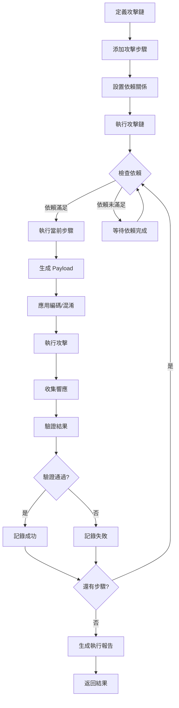

# ⚔️ Attack - 攻擊執行系統

**導航**: [← 返回 Core Capabilities](../README.md) | [← 返回 AIVA Core](../../README.md)

> **版本**: 3.0.0-alpha  
> **代碼量**: 5 個 Python 檔案，約 2015 行代碼  
> **角色**: AIVA 的「武器庫」- 編排和執行多步驟安全測試攻擊鏈

---

## 📋 目錄

- [模組概述](#模組概述)
- [檔案列表](#檔案列表)
- [核心組件](#核心組件)
  - [AttackChain - 攻擊鏈編排器](#attackchain---攻擊鏈編排器)
  - [AttackExecutor - 攻擊執行器](#attackexecutor---攻擊執行器)
  - [AttackValidator - 攻擊驗證器](#attackvalidator---攻擊驗證器)
  - [ExploitManager - 漏洞利用管理器](#exploitmanager---漏洞利用管理器)
  - [PayloadGenerator - Payload 生成器](#payloadgenerator---payload-生成器)
- [使用範例](#使用範例)
- [攻擊鏈執行流程](#攻擊鏈執行流程)

---

## 🎯 模組概述

**Attack** 子模組是 Core Capabilities 的核心執行引擎，負責將安全測試策略轉化為實際的攻擊操作。整合了攻擊鏈編排、執行控制、結果驗證、漏洞利用管理和 Payload 生成等完整能力。

### 核心能力
1. **攻擊鏈編排** - 管理複雜的多步驟攻擊序列
2. **執行控制** - 三種模式（安全/測試/激進）的執行管理
3. **結果驗證** - 自動化的攻擊效果驗證
4. **漏洞利用** - 漏洞庫管理和利用代碼執行
5. **Payload 生成** - 智能 Payload 生成和編碼

### 設計特色
- **安全保障** - 多層級安全檢查和模擬模式
- **依賴管理** - 自動處理攻擊步驟間的依賴關係
- **並行執行** - 支援並行攻擊和條件分支
- **可追溯性** - 完整的執行追蹤和指標收集

---

## 📂 檔案列表

| 檔案名 | 行數 | 核心功能 | 狀態 |
|--------|------|----------|------|
| **attack_chain.py** | 166 | 攻擊鏈編排器 - 管理多步驟攻擊序列 | ✅ 生產 |
| **attack_executor.py** | 562 | 攻擊執行器 - 三種執行模式控制 | ✅ 生產 |
| **attack_validator.py** | 250 | 攻擊驗證器 - 自動化結果驗證 | ✅ 生產 |
| **exploit_manager.py** | 818 | 漏洞利用管理器 - 漏洞庫和利用執行 | ✅ 生產 |
| **payload_generator.py** | 332 | Payload 生成器 - 智能 Payload 生成 | ✅ 生產 |
| **__init__.py** | - | 模組初始化 | - |

**總計**: 約 2128 行代碼（含註解和空行）

---

## 🔧 核心組件

### AttackChain - 攻擊鏈編排器

**檔案**: `attack_chain.py` (166 行)

管理和編排複雜的多步驟攻擊序列，包括依賴關係管理、執行順序編排、條件分支和結果傳遞。

#### 核心類別

```python
class ChainStatus(str, Enum):
    """攻擊鏈狀態"""
    PENDING = "pending"
    RUNNING = "running"
    COMPLETED = "completed"
    FAILED = "failed"
    PAUSED = "paused"

class AttackChain:
    """攻擊鏈編排器
    
    功能:
    - 依賴關係管理
    - 執行順序編排
    - 條件分支處理
    - 結果傳遞和聚合
    """
    
    def add_step(self, step_id: str, attack_config: dict, dependencies: list = None):
        """添加攻擊步驟"""
    
    def execute(self) -> dict:
        """執行完整攻擊鏈"""
    
    def pause(self):
        """暫停執行"""
    
    def resume(self):
        """恢復執行"""
```

#### 依賴管理機制

```python
# 依賴圖示例
dependencies = {
    "step1": [],           # 起始步驟
    "step2": ["step1"],    # 依賴 step1
    "step3": ["step1"],    # 依賴 step1（並行執行）
    "step4": ["step2", "step3"]  # 依賴 step2 和 step3
}

# 執行順序: step1 -> (step2 || step3) -> step4
```

#### 條件分支

```python
# 條件執行
chain.add_step(
    "conditional_step",
    config={
        "condition": "previous_step_success",
        "true_branch": "exploit_step",
        "false_branch": "retry_step"
    }
)
```

---

### AttackExecutor - 攻擊執行器

**檔案**: `attack_executor.py` (562 行)

負責執行實際的安全測試攻擊操作，支援三種執行模式和完整的追蹤機制。

#### 核心類別

```python
class ExecutionMode(str, Enum):
    """執行模式"""
    SAFE = "safe"          # 安全模式 - 僅模擬
    TESTING = "testing"    # 測試模式 - 受控環境
    AGGRESSIVE = "aggressive"  # 激進模式 - 完整測試

class AttackExecutor:
    """攻擊執行器
    
    功能:
    - 多模式執行控制
    - 異步任務調度
    - 性能指標收集
    - 執行追蹤記錄
    """
    
    async def execute_plan(self, plan: AttackPlan) -> PlanExecutionResult:
        """執行攻擊計劃"""
    
    async def execute_step(self, step: AttackStep) -> dict:
        """執行單個攻擊步驟"""
    
    def set_mode(self, mode: ExecutionMode):
        """設置執行模式"""
```

#### 執行模式對比

| 模式 | 實際執行 | 網絡請求 | 數據變更 | 使用場景 |
|------|---------|---------|---------|---------|
| **SAFE** | ❌ 模擬 | ❌ 禁止 | ❌ 禁止 | 策略驗證、演示 |
| **TESTING** | ✅ 部分 | ✅ 受控 | ⚠️ 隔離環境 | 開發、測試環境 |
| **AGGRESSIVE** | ✅ 完整 | ✅ 允許 | ✅ 允許 | 生產滲透測試 |

#### 性能指標收集

```python
class PlanExecutionMetrics:
    """執行指標"""
    total_duration_ms: float      # 總耗時
    steps_executed: int           # 執行步驟數
    steps_successful: int         # 成功步驟數
    steps_failed: int             # 失敗步驟數
    network_requests: int         # 網絡請求數
    bytes_transferred: int        # 傳輸字節數
```

---

### AttackValidator - 攻擊驗證器

**檔案**: `attack_validator.py` (250 行)

自動化驗證攻擊效果和結果準確性，確保測試結果的可靠性。

#### 核心功能

```python
class ValidationRule:
    """驗證規則"""
    rule_id: str
    rule_type: str  # response_code, regex, json_path, timing
    expected_value: Any
    tolerance: float = 0.1

class AttackValidator:
    """攻擊驗證器
    
    功能:
    - HTTP 響應驗證
    - 正則表達式匹配
    - JSON 路徑檢查
    - 時序分析驗證
    """
    
    def validate_response(self, response: dict, rules: list[ValidationRule]) -> bool:
        """驗證響應"""
    
    def validate_timing(self, execution_time: float, expected_time: float) -> bool:
        """驗證時序"""
    
    def generate_report(self) -> dict:
        """生成驗證報告"""
```

#### 驗證規則示例

```python
# HTTP 狀態碼驗證
ValidationRule(
    rule_id="check_status",
    rule_type="response_code",
    expected_value=200
)

# 正則表達式驗證
ValidationRule(
    rule_id="check_token",
    rule_type="regex",
    expected_value=r"token:\s*([a-f0-9]{32})"
)

# JSON 路徑驗證
ValidationRule(
    rule_id="check_admin",
    rule_type="json_path",
    expected_value="$.user.role",
    expected_match="admin"
)

# 時序驗證（檢測 SQL 注入盲注）
ValidationRule(
    rule_id="check_delay",
    rule_type="timing",
    expected_value=5.0,  # 預期延遲 5 秒
    tolerance=0.5         # 容忍 ±0.5 秒
)
```

---

### ExploitManager - 漏洞利用管理器

**檔案**: `exploit_manager.py` (818 行)

管理漏洞利用代碼庫，提供漏洞搜索、篩選和執行能力。

#### 核心類別

```python
class ExploitCategory(str, Enum):
    """漏洞類別"""
    WEB = "web"
    NETWORK = "network"
    API = "api"
    AUTHENTICATION = "authentication"
    AUTHORIZATION = "authorization"
    INJECTION = "injection"
    XSS = "xss"
    CSRF = "csrf"
    DESERIALIZATION = "deserialization"

class ExploitManager:
    """漏洞利用管理器
    
    功能:
    - 漏洞庫管理
    - 漏洞搜索和篩選
    - 利用代碼執行
    - 成功率追蹤
    """
    
    def register_exploit(self, exploit_id: str, config: dict):
        """註冊漏洞利用"""
    
    def search_exploits(self, vulnerability_type: str, target_info: dict) -> list:
        """搜索適用的漏洞利用"""
    
    async def execute_exploit(self, exploit_id: str, target: AttackTarget) -> dict:
        """執行漏洞利用"""
    
    def get_statistics(self, exploit_id: str) -> dict:
        """獲取漏洞利用統計信息"""
```

#### 漏洞利用數據結構

```python
exploit_config = {
    "exploit_id": "CVE-2023-12345",
    "name": "Remote Code Execution via Deserialization",
    "category": ExploitCategory.DESERIALIZATION,
    "severity": "critical",
    "cvss_score": 9.8,
    "affected_versions": ["1.0-2.5"],
    "prerequisites": ["authenticated", "admin_role"],
    "payload_template": "pickle.loads(base64.b64decode('{payload}'))",
    "success_indicators": [
        {"type": "response_contains", "value": "command_output"},
        {"type": "status_code", "value": 200}
    ]
}
```

#### 漏洞庫管理

```python
# 按類別統計
manager.get_statistics_by_category()
# 輸出:
{
    "web": {"total": 45, "success_rate": 0.78},
    "api": {"total": 32, "success_rate": 0.82},
    "injection": {"total": 28, "success_rate": 0.91}
}

# 高成功率漏洞
top_exploits = manager.get_top_exploits(min_success_rate=0.8, limit=10)
```

---

### PayloadGenerator - Payload 生成器

**檔案**: `payload_generator.py` (332 行)

智能生成各類攻擊 Payload，支援多種編碼和混淆技術。

#### 核心類別

```python
class PayloadType(str, Enum):
    """Payload 類型"""
    SQL_INJECTION = "sql_injection"
    XSS = "xss"
    COMMAND_INJECTION = "command_injection"
    XXE = "xxe"
    SSRF = "ssrf"
    DESERIALIZATION = "deserialization"
    TEMPLATE_INJECTION = "template_injection"

class EncodingType(str, Enum):
    """編碼類型"""
    URL = "url"
    BASE64 = "base64"
    HEX = "hex"
    UNICODE = "unicode"
    DOUBLE_URL = "double_url"

class PayloadGenerator:
    """Payload 生成器
    
    功能:
    - 多類型 Payload 生成
    - 智能編碼和混淆
    - 繞過技術應用
    - Payload 變異
    """
    
    def generate(self, payload_type: PayloadType, context: dict) -> str:
        """生成基礎 Payload"""
    
    def encode(self, payload: str, encoding: EncodingType) -> str:
        """編碼 Payload"""
    
    def apply_bypass_technique(self, payload: str, waf_type: str) -> str:
        """應用 WAF 繞過技術"""
    
    def mutate(self, payload: str, num_variations: int = 5) -> list[str]:
        """生成 Payload 變異體"""
```

#### SQL 注入 Payload 生成

```python
# 基礎 SQL 注入
generator.generate(
    PayloadType.SQL_INJECTION,
    context={
        "injection_point": "username",
        "database_type": "mysql",
        "technique": "union"
    }
)
# 輸出: "' UNION SELECT 1,2,3,4,5-- "

# 時間盲注
generator.generate(
    PayloadType.SQL_INJECTION,
    context={
        "technique": "time_blind",
        "delay_seconds": 5
    }
)
# 輸出: "' OR SLEEP(5)-- "

# 布爾盲注
generator.generate(
    PayloadType.SQL_INJECTION,
    context={
        "technique": "boolean_blind",
        "condition": "1=1"
    }
)
# 輸出: "' AND 1=1-- "
```

#### XSS Payload 生成

```python
# 反射型 XSS
generator.generate(
    PayloadType.XSS,
    context={
        "xss_type": "reflected",
        "context": "attribute",
        "target": "javascript:alert()"
    }
)
# 輸出: "\" onload=\"alert(1)"

# 存儲型 XSS
generator.generate(
    PayloadType.XSS,
    context={
        "xss_type": "stored",
        "context": "html",
        "bypass": ["filter_script_tag"]
    }
)
# 輸出: ""

# DOM XSS
generator.generate(
    PayloadType.XSS,
    context={
        "xss_type": "dom",
        "sink": "innerHTML"
    }
)
# 輸出: ""
```

#### 編碼和混淆

```python
payload = "<script>alert(1)</script>"

# URL 編碼
encoded = generator.encode(payload, EncodingType.URL)
# 輸出: "%3Cscript%3Ealert%281%29%3C%2Fscript%3E"

# Base64 編碼
encoded = generator.encode(payload, EncodingType.BASE64)
# 輸出: "PHNjcmlwdD5hbGVydCgxKTwvc2NyaXB0Pg=="

# Unicode 編碼
encoded = generator.encode(payload, EncodingType.UNICODE)
# 輸出: "\u003cscript\u003ealert(1)\u003c/script\u003e"

# 雙重 URL 編碼（繞過某些 WAF）
encoded = generator.encode(payload, EncodingType.DOUBLE_URL)
# 輸出: "%253Cscript%253Ealert%25281%2529%253C%252Fscript%253E"
```

#### WAF 繞過技術

```python
# ModSecurity 繞過
bypassed = generator.apply_bypass_technique(
    "<script>alert(1)</script>",
    waf_type="modsecurity"
)
# 可能輸出: "<scr<script>ipt>alert(1)</scr</script>ipt>"

# Cloudflare 繞過
bypassed = generator.apply_bypass_technique(
    "' OR 1=1-- ",
    waf_type="cloudflare"
)
# 可能輸出: "' OR 1=1--%20"

# AWS WAF 繞過
bypassed = generator.apply_bypass_technique(
    payload="",
    waf_type="aws_waf"
)
# 可能輸出: ""
```

#### Payload 變異

```python
# 生成多個變異體
original = "' OR 1=1-- "
variations = generator.mutate(original, num_variations=5)

# 可能輸出:
[
    "' OR 1=1-- ",           # 原始
    "' OR '1'='1'-- ",       # 字串比較
    "' OR true-- ",          # 布爾值
    "' OR 'a'='a'-- ",       # 字母比較
    "' OR 1-- ",             # 簡化版
    "' || 1=1-- "            # 替代運算符
]
```

---

## 🚀 使用範例

### 完整攻擊鏈示例

```python
from core_capabilities.attack import (
    AttackChain,
    AttackExecutor,
    AttackValidator,
    ExploitManager,
    PayloadGenerator,
    ExecutionMode
)

# 1. 初始化組件
chain = AttackChain("api_takeover_chain")
executor = AttackExecutor(mode=ExecutionMode.TESTING)
validator = AttackValidator()
exploit_mgr = ExploitManager()
payload_gen = PayloadGenerator()

# 2. 構建攻擊鏈
# Step 1: 偵察 - 收集目標信息
chain.add_step(
    "reconnaissance",
    attack_config={
        "type": "info_gathering",
        "targets": ["api.example.com"],
        "techniques": ["subdomain_enum", "port_scan", "service_detection"]
    },
    dependencies=[]
)

# Step 2: 漏洞掃描 - 尋找潛在弱點
chain.add_step(
    "vulnerability_scan",
    attack_config={
        "type": "vuln_scan",
        "scan_types": ["sql_injection", "authentication_bypass", "api_abuse"]
    },
    dependencies=["reconnaissance"]
)

# Step 3: 認證繞過 - 嘗試獲取訪問權限
sql_payload = payload_gen.generate(
    PayloadType.SQL_INJECTION,
    context={"technique": "authentication_bypass"}
)

chain.add_step(
    "auth_bypass",
    attack_config={
        "type": "authentication_bypass",
        "payload": sql_payload,
        "validation_rules": [
            ValidationRule(
                rule_id="check_auth_success",
                rule_type="json_path",
                expected_value="$.authenticated",
                expected_match=True
            )
        ]
    },
    dependencies=["vulnerability_scan"]
)

# Step 4A: 權限提升（如果認證成功）
chain.add_step(
    "privilege_escalation",
    attack_config={
        "type": "privilege_escalation",
        "target_role": "admin",
        "condition": "auth_bypass.success"
    },
    dependencies=["auth_bypass"]
)

# Step 4B: 替代路徑（如果認證失敗）
chain.add_step(
    "api_abuse",
    attack_config={
        "type": "api_rate_limit_bypass",
        "condition": "auth_bypass.failed"
    },
    dependencies=["auth_bypass"]
)

# Step 5: 數據提取（並行執行兩條路徑的後續）
chain.add_step(
    "data_exfiltration",
    attack_config={
        "type": "data_extraction",
        "endpoints": ["/api/users", "/api/admin/config"]
    },
    dependencies=["privilege_escalation", "api_abuse"]
)

# 3. 執行攻擊鏈
result = await chain.execute()

# 4. 驗證結果
validation_passed = validator.validate_response(
    result,
    rules=[
        ValidationRule(
            rule_id="chain_success",
            rule_type="json_path",
            expected_value="$.status",
            expected_match="completed"
        )
    ]
)

# 5. 生成報告
print(f"攻擊鏈執行完成:")
print(f"  - 總步驟: {len(result['steps'])}")
print(f"  - 成功步驟: {result['successful_steps']}")
print(f"  - 失敗步驟: {result['failed_steps']}")
print(f"  - 驗證通過: {validation_passed}")
print(f"  - 執行時間: {result['total_duration_ms']}ms")
```

### 單步攻擊執行

```python
# 使用漏洞利用管理器
exploit = await exploit_mgr.search_exploits(
    vulnerability_type="sql_injection",
    target_info={
        "database": "mysql",
        "version": "5.7",
        "context": "login_form"
    }
)

# 執行最匹配的漏洞利用
result = await exploit_mgr.execute_exploit(
    exploit_id=exploit[0]["exploit_id"],
    target=AttackTarget(
        url="https://api.example.com/login",
        method="POST",
        headers={"Content-Type": "application/json"}
    )
)

# 驗證攻擊效果
if validator.validate_response(result["response"], exploit[0]["success_indicators"]):
    print("✅ 漏洞利用成功!")
    print(f"   獲得的數據: {result['extracted_data']}")
else:
    print("❌ 漏洞利用失敗")
```

### Payload 生成和測試

```python
# 生成並測試多個 SQL 注入變異體
base_payload = "' OR 1=1-- "
variations = payload_gen.mutate(base_payload, num_variations=10)

for i, payload in enumerate(variations, 1):
    # 應用編碼
    encoded = payload_gen.encode(payload, EncodingType.URL)
    
    # 應用 WAF 繞過
    bypassed = payload_gen.apply_bypass_technique(encoded, waf_type="modsecurity")
    
    print(f"Variation {i}:")
    print(f"  Original: {payload}")
    print(f"  Encoded:  {encoded}")
    print(f"  Bypassed: {bypassed}")
    print()
```

---

## 🔄 攻擊鏈執行流程



### 執行階段說明

1. **初始化階段**
   - 創建攻擊鏈實例
   - 註冊所有攻擊步驟
   - 構建依賴關係圖

2. **依賴解析階段**
   - 拓撲排序確定執行順序
   - 識別可並行執行的步驟
   - 檢測循環依賴

3. **Payload 準備階段**
   - 根據攻擊類型生成 Payload
   - 應用目標環境的編碼
   - 套用 WAF 繞過技術

4. **執行階段**
   - 按依賴順序執行步驟
   - 並行執行獨立步驟
   - 實時收集執行指標

5. **驗證階段**
   - 檢查響應狀態
   - 驗證預期結果
   - 提取有用數據

6. **報告階段**
   - 聚合所有步驟結果
   - 計算成功率和性能指標
   - 生成詳細執行報告

---

## 📊 性能指標

| 指標 | 說明 | 典型值 |
|------|------|--------|
| **攻擊鏈吞吐量** | 每秒可執行的完整攻擊鏈數 | 5-10 chains/s |
| **單步執行延遲** | 單個攻擊步驟的平均延遲 | 50-200 ms |
| **並行度** | 同時執行的並行步驟數 | 10-20 steps |
| **Payload 生成速度** | 每秒生成的 Payload 數量 | 1000+ payloads/s |
| **驗證準確率** | 結果驗證的準確率 | >95% |
| **內存佔用** | 執行攻擊鏈時的內存使用 | 50-200 MB |

---

## 🔒 安全機制

### 執行模式控制

```python
# 開發階段 - 使用安全模式
executor.set_mode(ExecutionMode.SAFE)  # 僅模擬，不發送請求

# 測試階段 - 使用測試模式
executor.set_mode(ExecutionMode.TESTING)  # 受控環境執行

# 生產滲透測試 - 使用激進模式（需授權）
executor.set_mode(ExecutionMode.AGGRESSIVE)  # 完整執行
```

### 授權檢查

```python
# 在執行前檢查授權
if not executor.check_authorization(target):
    raise PermissionError("未授權的目標 - 禁止執行攻擊")
```

### 速率限制

```python
# 設置速率限制避免過度測試
executor.set_rate_limit(
    max_requests_per_second=10,
    max_concurrent_attacks=5
)
```

---

## 📚 相關文檔

- [Core Capabilities 主文檔](../README.md)
- [Analysis 子模組](../analysis/README.md) - 代碼分析系統
- [BizLogic 子模組](../bizlogic/README.md) - 業務邏輯測試
- [Task Planning 模組](../../task_planning/README.md) - 任務規劃
- [Service Backbone 模組](../../service_backbone/README.md) - 服務基礎設施

---

**版權所有** © 2024 AIVA Project. 保留所有權利。
