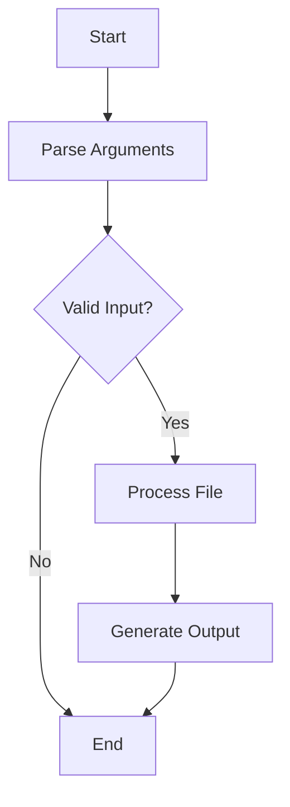

# CLI 指令架構完整分析報告

> **生成時間**: 2025-12-11  
> **分析範圍**: AIVA Services 完整架構與 CLI 指令系統  
> **重點**: Integration 模組作為統一 CLI 入口 + 多語言工具 CLI 實現

---

## 📑 目錄

- [🎯 核心發現](#-核心發現)
- [🏗️ Services 架構設計](#️-services-架構設計)
- [🎨 Integration 模組 - 統一 CLI 中樞](#-integration-模組---統一-cli-中樞)
- [🌐 多語言工具 CLI 實現](#-多語言工具-cli-實現)
- [💻 CLI 指令生成系統](#-cli-指令生成系統)
- [🔄 命令執行流程](#-命令執行流程)
- [📂 CLI 指令存放位置](#-cli-指令存放位置)
- [🔌 調用方式](#-調用方式)
- [📊 實際使用範例](#-實際使用範例)
- [🚀 建議整合方案](#-建議整合方案)

---

## 🎯 核心發現

### 1. **三層架構設計 + Integration 統一出口**

AIVA 採用清晰的三層架構，**Integration 模組作為統一的 CLI 入口和能力調度中心**：

```
┌─────────────────────────────────────────────────────────┐
│                    AI Core (決策層)                       │
│  - cognitive_core: 認知處理                               │
│  - task_planning: AI Commander (任務規劃與執行)            │
│  - internal_exploration: 代碼分析與 CLI 生成               │
└─────────────────────────────────────────────────────────┘
                            ↓
┌─────────────────────────────────────────────────────────┐
│              AI Command Center (命令中樞)                 │
│  位置: services/aiva_common/command_center.py            │
│  職責: 命令路由、執行管理、結果收集                         │
└─────────────────────────────────────────────────────────┘
                            ↓
┌─────────────────────────────────────────────────────────┐
│           ⭐ Integration Module (統一 CLI 中樞) ⭐         │
│  - capability/cli.py: 能力管理 CLI                        │
│  - capability/lifecycle_cli.py: 工具生命週期管理           │
│  - capability/payload_generator.py: PayloadCLI           │
│  - capability/function_recon.py: ReconCLI                │
│  - executable_commands/: CLI 指令存放目錄                  │
└─────────────────────────────────────────────────────────┘
                            ↓
┌─────────────────────────────────────────────────────────┐
│               Feature Modules (執行層)                    │
│  - Scan: 掃描功能                                         │
│  - Features: 各種安全功能 (SQLi, XSS, SSRF...)           │
│  - Core: AI 核心引擎                                      │
└─────────────────────────────────────────────────────────┘
```

### 2. **CLI 指令系統的三大組成部分**

#### 組成 A: **Integration 模組 CLI** ⭐ (統一入口)
- **目的**: 提供用戶級 CLI 介面，整合所有能力
- **核心文件**:
  - `services/integration/capability/cli.py` - 能力管理 CLI
  - `services/integration/capability/lifecycle_cli.py` - 工具生命週期管理
  - `services/integration/capability/payload_generator.py` - PayloadCLI
  - `services/integration/capability/function_recon.py` - ReconCLI
- **存放位置**: `services/integration/executable_commands/`

#### 組成 B: **Multi-Language Tools CLI** ⭐ (工具分析)
- **目的**: 多語言代碼分析與 CLI 指令生成
- **實現語言**: Python, TypeScript, Go, Rust
- **核心功能**:
  - AST 解析與流程圖生成
  - 跨檔案數據流串接 (Stitching)
  - 功能分類與統計
  - CLI 指令手冊自動生成
- **工具位置**: `services/core/aiva_core/internal_exploration/`

#### 組成 C: **Internal Exploration CLI** (內部分析)
- **目的**: 分析 AIVA 自身代碼並生成執行指令
- **生成工具**: `aiva_cli_implementation.py`
- **輸出位置**: `internal_exploration/python_tools/` 下的動態生成檔案

### 3. **多語言 CLI 工具特性對比**

| 特性 | Python | TypeScript | Go | Rust |
|------|--------|------------|-----|------|
| AST 解析 | ✅ | ✅ | ✅ | ✅ |
| 流程圖生成 | ✅ Mermaid | ✅ Mermaid | ✅ Mermaid | ✅ Mermaid |
| 跨檔案串接 | ✅ | ✅ | ✅ | ✅ |
| 功能分類 | ✅ 282 flows | ✅ | ✅ | ✅ |
| CLI 手冊生成 | ✅ MD+JSON | ✅ | ✅ | ✅ |
| 瓶頸分析 | ✅ | ✅ | ✅ | ✅ |
| 主要用途 | AIVA 核心 | 前端分析 | 並發掃描 | 性能引擎 |

---

## 🏗️ Services 架構設計

### 核心目錄結構

```
services/
├── aiva_common/              # 🔗 共享基礎設施
│   ├── command_center.py     # ⭐ AI 命令中心 (核心調度器)
│   ├── schemas/              # 數據 Schema (200+ 模型)
│   │   ├── commands.py       # 命令相關 Schema
│   │   └── ...
│   ├── enums/                # 標準枚舉 (13 個領域)
│   ├── cli/                  # CLI 框架基礎
│   └── ...
│
├── core/aiva_core/           # 🤖 AI 驅動核心
│   ├── cognitive_core/       # 認知處理
│   │   └── internal_loop_connector.py  # 內閉環連接器
│   ├── task_planning/        # 任務規劃
│   │   ├── ai_commander.py   # ⭐ AI 指揮官
│   │   └── command_router.py # 命令路由器
│   ├── internal_exploration/ # ⭐ 代碼分析與 CLI 生成
│   │   ├── python_tools/
│   │   │   ├── aiva_cli_implementation.py  # CLI 指令生成器
│   │   │   ├── aiva_flow_analyzer.py       # 流程分析
│   │   │   ├── aiva_flow_classifier.py     # 流程分類
│   │   │   └── aiva_exploration_pipeline.py # 自動化管線
│   │   ├── typescript_tools/
│   │   │   ├── ts2mermaid.ts               # ⭐ TypeScript CLI 工具
│   │   │   ├── package.json
│   │   │   └── README.md
│   │   ├── go_tools/
│   │   │   ├── go2mermaid.go               # ⭐ Go CLI 工具
│   │   │   ├── go.mod
│   │   │   └── README.md
│   │   └── rust_tools/
│   │       ├── src/main.rs                 # ⭐ Rust CLI 工具
│   │       ├── Cargo.toml
│   │       └── README.md
│   ├── service_backbone/     # 服務骨幹
│   │   └── storage/          # 存儲系統
│   │       ├── command_repository.py      # ⭐ CLI 指令存儲庫
│   │       ├── CLI_COMMAND_STORAGE_GUIDE.md
│   │       └── examples/
│   │           └── cli_integration_example.py
│   └── core_capabilities/    # 核心能力
│       └── dialog/
│           └── assistant.py  # 對話助理 (CLI 生成功能)
│
├── scan/                     # 🔍 掃描引擎
│   └── command_handler.py    # Scan 命令處理器
│
├── features/                 # 🎯 安全功能
│   ├── function_sqli/
│   ├── function_xss/
│   ├── function_ssrf/
│   └── .../handler.py        # 各功能的命令處理器
│
└── integration/              # ⭐ 🔄 統一 CLI 中樞與企業整合
    ├── executable_commands/  # ⭐ CLI 指令存放目錄 (當前為空)
    ├── capability/           # ⭐ 能力管理系統
    │   ├── cli.py            # ⭐ 能力管理 CLI (主要入口)
    │   ├── lifecycle_cli.py  # ⭐ 工具生命週期 CLI
    │   ├── payload_generator.py  # PayloadCLI
    │   ├── function_recon.py     # ReconCLI
    │   ├── models.py         # CLITemplate 等模型
    │   ├── registry.py       # 能力註冊中心
    │   ├── toolkit.py        # 能力工具包
    │   └── ...
    ├── coordinators/         # 協調器
    ├── tools/                # 整合工具
    └── search_command_handler.py
```

---

## 🎨 Integration 模組 - 統一 CLI 中樞

### 核心設計理念

Integration 模組被設計為 **AIVA 的統一 CLI 入口點**，負責：

1. **能力發現與註冊** - 自動掃描系統中的所有能力
2. **CLI 命令管理** - 提供統一的命令行界面
3. **工具生命週期** - 管理工具的安裝、更新、卸載
4. **執行協調** - 協調多個模組的能力執行

### 主要 CLI 工具

#### 1. **Capability Manager CLI** (`capability/cli.py`)

**核心功能**:
```python
class CapabilityManager:
    """AIVA 能力管理器 - 命令行介面"""
    
    async def discover_and_register(self, auto_register: bool = False)
    async def list_capabilities(self, language, capability_type, status, output_format)
    async def inspect_capability(self, capability_id: str)
    async def test_capability(self, capability_id: str, verbose: bool)
    async def validate_capability_schema(self, file: str)
    async def generate_documentation(self, capability_id, output_file)
    async def generate_bindings(self, capability_id, target_languages, output_dir)
    async def show_stats(self)
```

**命令行使用**:
```bash
# 發現並自動註冊能力
python -m services.integration.capability.cli discover --auto-register

# 列出 Python 能力
python -m services.integration.capability.cli list --language python

# 檢查特定能力
python -m services.integration.capability.cli inspect security.sqli.scan

# 測試能力連接性
python -m services.integration.capability.cli test security.sqli.scan

# 驗證能力定義
python -m services.integration.capability.cli validate capability.yaml

# 產生完整報告
python -m services.integration.capability.cli docs --all --output report.md

# 產生跨語言綁定
python -m services.integration.capability.cli bindings security.sqli.scan \
    --languages python go rust --output-dir ./bindings
```

#### 2. **Lifecycle Manager CLI** (`capability/lifecycle_cli.py`)

**核心功能**:
```python
class LifecycleCLI:
    """工具生命週期管理 CLI 介面"""
    
    async def install_tool(self, capability_id: str, force: bool = False)
    async def update_tool(self, capability_id: str)
    async def uninstall_tool(self, capability_id: str, remove_deps: bool)
    async def health_check(self, capability_id: Optional[str] = None)
    def show_events(self, capability_id, event_type, limit)
    async def list_tools(self)
    async def interactive_menu(self)  # Rich UI 互動式選單
```

**命令行使用**:
```bash
# 安裝工具
python -m services.integration.capability.lifecycle_cli install sqlmap

# 更新工具
python -m services.integration.capability.lifecycle_cli update sqlmap

# 卸載工具 (保留依賴)
python -m services.integration.capability.lifecycle_cli uninstall sqlmap

# 健康檢查
python -m services.integration.capability.lifecycle_cli health sqlmap

# 查看事件歷史
python -m services.integration.capability.lifecycle_cli events sqlmap --limit 10

# 互動式選單
python -m services.integration.capability.lifecycle_cli --interactive
```

#### 3. **Payload Generator CLI** (`capability/payload_generator.py`)

**核心功能**:
```python
class PayloadCLI:
    """載荷生成命令行界面 - 基於HackingTool的Rich UI設計"""
    
    def show_main_menu(self) -> str
    async def generate_windows_payload(self)
    async def generate_linux_payload(self)
    async def generate_android_payload(self)
    async def generate_powershell_payload(self)
    async def generate_python_payload(self)
    async def generate_bash_payload(self)
    async def generate_custom_payload(self)
    def show_payload_history(self)
    def show_system_status(self)
    async def run_interactive(self)
```

**使用方式**:
```bash
# 啟動互動式載荷生成器
python -m services.integration.capability.payload_generator

# 將顯示 Rich UI 選單，支持：
# 1. Windows 載荷 (EXE, DLL, MSI)
# 2. Linux 載荷 (ELF, SO)
# 3. Android 載荷 (APK)
# 4. PowerShell 載荷
# 5. Python 載荷
# 6. Bash 載荷
# 7. 自定義載荷
# 8. 載荷歷史
# 9. 系統狀態
```

#### 4. **Recon CLI** (`capability/function_recon.py`)

**核心功能**:
```python
class ReconCLI:
    """偵查功能 CLI 介面"""
    
    async def run_full_recon(self, target: str)
    async def run_subdomain_enum(self, domain: str)
    async def run_port_scan(self, target: str)
    async def run_tech_fingerprint(self, target: str)
    async def generate_report(self, output_format: str)
    async def interactive_menu(self)
```

### CLITemplate 模型設計

Integration 模組使用 `CLITemplate` 數據模型來標準化 CLI 定義：

```python
class CLITemplate(BaseModel):
    """CLI模板定義"""
    
    capability_id: str          # 能力ID
    command: str                # CLI命令
    description: str            # 命令描述
    
    arguments: List[Dict]       # 命令參數
    options: List[Dict]         # 命令選項
    
    examples: List[str]         # 使用示例
    help_text: str              # 幫助文本
    
    template_version: str       # 模板版本
    generated_at: datetime      # 生成時間
```

### executable_commands 目錄

**位置**: `services/integration/executable_commands/`

**目的**: 存放生成的 CLI 指令腳本

**當前狀態**: 空目錄（待填充）

**建議內容**:
```
executable_commands/
├── README.md                 # 目錄說明
├── capability_management/    # 能力管理指令
│   ├── discover.sh
│   ├── list.sh
│   └── inspect.sh
├── lifecycle/                # 生命週期管理指令
│   ├── install.sh
│   ├── update.sh
│   └── uninstall.sh
├── payload_generation/       # 載荷生成指令
│   ├── windows_payload.sh
│   ├── linux_payload.sh
│   └── custom_payload.sh
└── recon/                    # 偵查指令
    ├── full_recon.sh
    ├── subdomain_enum.sh
    └── port_scan.sh
```

---

## 🌐 多語言工具 CLI 實現

### 設計理念

AIVA 實現了 **4 種語言的統一 CLI 工具**，所有工具都具備相同的核心功能：

1. **AST 解析與流程圖生成** - 分析代碼結構並生成 Mermaid 流程圖
2. **跨檔案數據流串接** - Stitching 技術連接多檔案調用關係
3. **功能分類與統計** - 自動分類功能模組並生成統計報告
4. **CLI 指令手冊生成** - 自動生成 Markdown + JSON 格式的 CLI 文檔
5. **瓶頸分析** - 識別系統熱點和性能瓶頸

### 1. Python CLI Tool

**位置**: `services/core/aiva_core/internal_exploration/python_tools/`

**核心文件**:
- `aiva_cli_implementation.py` - CLI 指令生成器
- `aiva_flow_analyzer.py` - 流程分析
- `aiva_flow_classifier.py` - 流程分類
- `aiva_exploration_pipeline.py` - 自動化管線

**使用方式**:
```bash
cd services/core/aiva_core/internal_exploration/python_tools

# 生成 Markdown 手冊
python aiva_cli_implementation.py --generate-doc md

# 生成 JSON 資料庫
python aiva_cli_implementation.py --generate-doc json

# 列出可用流程
python aiva_cli_implementation.py --list

# 預覽執行計畫
python aiva_cli_implementation.py --flow 11 --dry-run

# 實際執行流程
python aiva_cli_implementation.py --flow 11

# 完整分析管線
python aiva_exploration_pipeline.py --workspace ../../../.. --output analysis_report
```

**輸出**:
- `CLI_COMMANDS_REFERENCE.md` - Markdown 格式手冊
- `cli_commands_db.json` - JSON 資料庫
- `classification_data.json` - 282 條流程分類數據

### 2. TypeScript CLI Tool

**位置**: `services/core/aiva_core/internal_exploration/typescript_tools/`

**核心文件**: `ts2mermaid.ts` (770 行，整合 6 大功能)

**功能模組**:
```typescript
// Part 1: 基礎圖形結構 (Mermaid Graph)
class GraphNode { ... }
class Graph { ... }

// Part 2: AST 解析器
class TSAnalyzer extends NodeVisitor { ... }

// Part 3: 跨檔案數據流串接 (Stitcher)
class Stitcher { ... }

// Part 4: 功能分類器
class Classifier { ... }

// Part 5: CLI 指令生成器
class CLIGenerator { ... }

// Part 6: 瓶頸分析
class BottleneckAnalyzer { ... }
```

**使用方式**:
```bash
cd services/core/aiva_core/internal_exploration/typescript_tools

# 安裝依賴
npm install

# 分析單個檔案
npx ts-node ts2mermaid.ts --file src/example.ts --output example.mmd

# 分析整個專案
npx ts-node ts2mermaid.ts --project . --output-dir ./analysis

# 跨檔案串接分析
npx ts-node ts2mermaid.ts --stitch --project . --output system_flow.mmd

# 功能分類
npx ts-node ts2mermaid.ts --classify --project . --output classification.json

# 生成 CLI 手冊
npx ts-node ts2mermaid.ts --generate-cli --output CLI_COMMANDS.md

# 瓶頸分析
npx ts-node ts2mermaid.ts --analyze-bottleneck --project . --output bottleneck_report.json
```

### 3. Go CLI Tool

**位置**: `services/core/aiva_core/internal_exploration/go_tools/`

**核心文件**: `go2mermaid.go` (783 行，整合 5 大功能)

**功能模組**:
```go
// Part 1: 基礎數據結構
type Node struct { ... }
type Graph struct { ... }

// Part 2: 數據流串接系統
type Stitcher struct { ... }
type Connection struct { ... }

// Part 3: AST 分析器
type Analyzer struct { ... }

// Part 4: 功能分類器
type Classifier struct { ... }

// Part 5: CLI 生成器
type CLIGenerator struct { ... }
```

**使用方式**:
```bash
cd services/core/aiva_core/internal_exploration/go_tools

# 編譯工具
go build go2mermaid.go

# 分析單個檔案
./go2mermaid -file example.go -output example.mmd

# 分析整個專案
./go2mermaid -dir . -output-dir ./analysis

# 跨檔案串接
./go2mermaid -stitch -dir . -output system_flow.mmd

# 功能分類
./go2mermaid -classify -dir . -output classification.json

# 生成 CLI 手冊
./go2mermaid -gen-cli -output CLI_COMMANDS.md

# 統計報告
./go2mermaid -stats -dir . -output stats_report.json
```

### 4. Rust CLI Tool

**位置**: `services/core/aiva_core/internal_exploration/rust_tools/`

**核心文件**: `src/main.rs` (739 行，整合 5 大功能)

**功能模組**:
```rust
// Part 1: 基礎數據結構
struct Node { ... }
struct Graph { ... }

// Part 2: 跨檔案串接
struct Stitcher { ... }
struct Connection { ... }

// Part 3: AST 訪問器
struct AstVisitor { ... }

// Part 4: 功能分類器
struct Classifier { ... }

// Part 5: CLI 生成器
struct CLIGenerator { ... }
```

**使用方式**:
```bash
cd services/core/aiva_core/internal_exploration/rust_tools

# 編譯工具
cargo build --release

# 分析單個檔案
./target/release/rs2mermaid --file example.rs --output example.mmd

# 分析整個專案
./target/release/rs2mermaid --project . --output-dir ./analysis

# 跨檔案串接
./target/release/rs2mermaid --stitch --project . --output system_flow.mmd

# 功能分類
./target/release/rs2mermaid --classify --project . --output classification.json

# 生成 CLI 手冊
./target/release/rs2mermaid --gen-cli --output CLI_COMMANDS.md

# 瓶頸分析
./target/release/rs2mermaid --analyze --project . --output analysis_report.json
```

### 多語言工具統一輸出格式

所有語言工具都生成統一格式的輸出：

#### Mermaid 流程圖 (.mmd)


#### CLI 指令手冊 (Markdown)
```markdown
# CLI Commands Reference

## Command: analyze-flow

**Description**: Analyze code flow and generate Mermaid diagram

**Usage**:
```bash
tool --file <path> --output <path>
```

**Arguments**:
- `--file`: Input source file
- `--output`: Output Mermaid file

**Examples**:
1. `tool --file main.py --output main.mmd`
2. `tool --file app.ts --output app.mmd`
```

#### 分類數據 (JSON)
```json
{
  "total_flows": 282,
  "categories": {
    "scan_operations": 45,
    "feature_detection": 68,
    "integration_sync": 52,
    "core_processing": 117
  },
  "flows": [
    {
      "id": "flow_001",
      "capability": "vuln_scan",
      "module": "scan",
      "complexity": "medium",
      "steps": 5
    }
  ]
}
```

---

## 💻 CLI 指令生成系統

### 核心工具: `aiva_cli_implementation.py`

**位置**: `services/core/aiva_core/internal_exploration/python_tools/aiva_cli_implementation.py`

**功能**:
1. **動態流程執行** - 讀取 `classification_data.json` 並執行數據流
2. **文檔生成** - 生成 Markdown 和 JSON 格式的 CLI 指令手冊

### 使用方式

```powershell
# 1. 生成 Markdown 參考手冊
python -m aiva_core.internal_exploration.python_tools.aiva_cli_implementation --generate-doc md

# 2. 生成 JSON 資料庫 (供 AI 檢索)
python -m aiva_core.internal_exploration.python_tools.aiva_cli_implementation --generate-doc json

# 3. 列出可用流程
python -m aiva_core.internal_exploration.python_tools.aiva_cli_implementation --list

# 4. 預覽執行計畫 (Dry Run)
python -m aiva_core.internal_exploration.python_tools.aiva_cli_implementation --flow 11 --dry-run

# 5. 實際執行流程
python -m aiva_core.internal_exploration.python_tools.aiva_cli_implementation --flow 11
```

### 輸出檔案

生成的 CLI 指令文檔存放在:

```
internal_exploration/python_tools/
├── CLI_COMMANDS_REFERENCE.md    # Markdown 格式 (人類閱讀)
└── cli_commands_db.json          # JSON 格式 (AI 檢索)
```

**注意**: 目前這些檔案**不存在**於倉庫中,需要手動生成。

---

## 🔄 命令執行流程

### 完整流程圖

```
┌──────────────────────────────────────────────────────────┐
│  1. AI 決策層 (Core 模組)                                  │
│     - AICommander: 接收任務請求                            │
│     - 決策引擎: 分析並生成 AICommand                        │
└──────────────────────────────────────────────────────────┘
                            ↓
┌──────────────────────────────────────────────────────────┐
│  2. AI 命令中心 (aiva_common/command_center.py)           │
│                                                            │
│     command = AICommand(                                  │
│         command_type=CommandType.SCAN_PHASE0,            │
│         target_module="scan",                            │
│         payload={"scan_id": "...", "targets": [...]}     │
│     )                                                     │
│                                                            │
│     result = await command_center.execute(command)       │
└──────────────────────────────────────────────────────────┘
                            ↓
┌──────────────────────────────────────────────────────────┐
│  3. 模組命令處理器 (各模組的 CommandHandler)                │
│                                                            │
│     Scan 模組:                                             │
│     - ScanCommandHandler.handle_command()                │
│                                                            │
│     Features 模組:                                         │
│     - PayloadGeneratorCommandHandler                     │
│     - SqliCommandHandler                                 │
│     - XssCommandHandler                                  │
│     - ...                                                 │
└──────────────────────────────────────────────────────────┘
                            ↓
┌──────────────────────────────────────────────────────────┐
│  4. 執行引擎 (實際功能實現)                                  │
│     - Rust 掃描引擎                                         │
│     - Go 並發處理                                           │
│     - Python 協調與分析                                     │
└──────────────────────────────────────────────────────────┘
                            ↓
┌──────────────────────────────────────────────────────────┐
│  5. 結果回傳                                                │
│     AICommandResult → AI 決策層 → 用戶/下一步動作            │
└──────────────────────────────────────────────────────────┘
```

### 關鍵組件

#### 1. **AICommandCenter** (`aiva_common/command_center.py`)

```python
class AICommandCenter:
    """AI 命令中心 - 核心調度器"""
    
    def __init__(self):
        self._handlers: Dict[str, CommandHandler] = {}
    
    def register_module(self, module_name: str, handler: CommandHandler):
        """註冊模組處理器"""
        self._handlers[module_name] = handler
    
    async def execute(self, command: AICommand) -> AICommandResult:
        """執行命令"""
        handler = self._handlers.get(command.target_module)
        return await handler.handle_command(command)
```

#### 2. **CommandHandler 協議**

```python
class CommandHandler(Protocol):
    """命令處理器協議 - 所有模組必須實現"""
    
    async def handle_command(
        self, 
        command: AICommand,
        context: Optional[CommandContext] = None
    ) -> AICommandResult:
        """處理命令"""
        ...
```

#### 3. **模組註冊範例** (Scan 模組)

```python
# services/scan/__init__.py
from .command_handler import ScanCommandHandler

def register_scan_to_command_center():
    """註冊 Scan 模組到 AI 命令中心"""
    from services.aiva_common.command_center import get_command_center
    
    command_center = get_command_center()
    scan_handler = ScanCommandHandler()
    command_center.register_module("scan", scan_handler)
    
    logger.info("✅ Scan 模組已註冊到 AI 命令中心")
```

---

## 📂 CLI 指令存放位置

### 完整的 CLI 指令分布圖

```
AIVA Project Root/
│
├── services/integration/                        # ⭐ 主要 CLI 入口
│   ├── executable_commands/                     # ⭐ CLI 指令存放目錄 (當前空)
│   │   ├── capability_management/
│   │   ├── lifecycle/
│   │   ├── payload_generation/
│   │   └── recon/
│   └── capability/
│       ├── cli.py                               # 能力管理 CLI
│       ├── lifecycle_cli.py                     # 生命週期 CLI
│       ├── payload_generator.py                 # PayloadCLI
│       └── function_recon.py                    # ReconCLI
│
├── services/core/aiva_core/internal_exploration/  # ⭐ 多語言工具 CLI
│   ├── python_tools/
│   │   ├── aiva_cli_implementation.py           # Python CLI 生成器
│   │   ├── aiva_flow_analyzer.py
│   │   ├── aiva_flow_classifier.py
│   │   ├── CLI_COMMANDS_REFERENCE.md            # 生成的文檔
│   │   └── cli_commands_db.json                 # 生成的 JSON
│   ├── typescript_tools/
│   │   ├── ts2mermaid.ts                        # TypeScript CLI 工具
│   │   └── [生成的 .mmd, .md, .json]
│   ├── go_tools/
│   │   ├── go2mermaid.go                        # Go CLI 工具
│   │   └── [生成的 .mmd, .md, .json]
│   └── rust_tools/
│       ├── src/main.rs                          # Rust CLI 工具
│       └── [生成的 .mmd, .md, .json]
│
├── services/core/aiva_core/service_backbone/storage/  # CLI 執行歷史
│   ├── command_repository.py                    # 存儲庫
│   ├── CLI_COMMAND_STORAGE_GUIDE.md             # 使用指南
│   └── examples/
│       └── cli_integration_example.py
│
└── services/core/aiva_core/core_capabilities/dialog/
    └── assistant.py                             # CLI 動態生成
```

### CLI 指令位置分類

#### 層級 1: **用戶級 CLI** (Integration 模組)

**位置**: `services/integration/`

**特點**:
- 面向最終用戶
- 提供高層抽象
- Rich UI 互動式界面
- 統一的命令格式

**存放目錄**: 
- `executable_commands/` - 可執行命令腳本
- `capability/*.py` - CLI 實現代碼

#### 層級 2: **工具級 CLI** (Internal Exploration)

**位置**: `services/core/aiva_core/internal_exploration/`

**特點**:
- 面向開發者和 AI 系統
- 多語言實現 (Python, TS, Go, Rust)
- 代碼分析與流程生成
- 自動化工具

**存放目錄**:
- `python_tools/` - Python 工具輸出
- `typescript_tools/` - TypeScript 工具輸出
- `go_tools/` - Go 工具輸出
- `rust_tools/` - Rust 工具輸出

#### 層級 3: **系統級 CLI** (Service Backbone)

**位置**: `services/core/aiva_core/service_backbone/storage/`

**特點**:
- CLI 執行歷史記錄
- 存儲管理接口
- 370+ 複雜流程追蹤
- 數據持久化

**存放目錄**:
- `command_repository.py` - 核心存儲邏輯
- `examples/` - 整合範例

### 建議的標準化路徑

為了統一管理，建議將所有 CLI 指令集中到 Integration 模組：

```bash
services/integration/executable_commands/
├── README.md                           # 目錄說明與使用指南
├── _templates/                         # CLI 模板
│   ├── command_template.sh
│   └── interactive_template.py
│
├── capability/                         # 能力管理指令
│   ├── discover_capabilities.sh
│   ├── list_capabilities.sh
│   ├── inspect_capability.sh
│   ├── test_capability.sh
│   └── generate_docs.sh
│
├── lifecycle/                          # 生命週期管理
│   ├── install_tool.sh
│   ├── update_tool.sh
│   ├── uninstall_tool.sh
│   ├── health_check.sh
│   └── list_tools.sh
│
├── payload/                            # 載荷生成
│   ├── windows_payload.sh
│   ├── linux_payload.sh
│   ├── android_payload.sh
│   ├── powershell_payload.sh
│   └── custom_payload.sh
│
├── recon/                              # 偵查功能
│   ├── full_recon.sh
│   ├── subdomain_enum.sh
│   ├── port_scan.sh
│   ├── tech_fingerprint.sh
│   └── generate_recon_report.sh
│
├── analysis/                           # 代碼分析 (調用多語言工具)
│   ├── analyze_python.sh
│   ├── analyze_typescript.sh
│   ├── analyze_go.sh
│   ├── analyze_rust.sh
│   └── analyze_all.sh
│
└── system/                             # 系統級指令
    ├── start_all_services.sh
    ├── stop_all_services.sh
    ├── health_check_all.sh
    └── generate_system_report.sh
```

---

## 🔌 調用方式

### 方式 1: **Integration CLI** ⭐ (推薦 - 用戶級)

**適用場景**: 最終用戶操作、能力管理、工具部署

#### A. 能力管理 CLI

```bash
# 1. 發現系統能力
python -m services.integration.capability.cli discover --auto-register

# 2. 列出可用能力
python -m services.integration.capability.cli list --language python --type scanner

# 3. 檢查特定能力
python -m services.integration.capability.cli inspect security.sqli.scan

# 4. 測試能力
python -m services.integration.capability.cli test security.sqli.scan --verbose

# 5. 生成文檔
python -m services.integration.capability.cli docs --all --output capabilities.md

# 6. 生成跨語言綁定
python -m services.integration.capability.cli bindings security.sqli.scan \
    --languages python go rust --output-dir ./bindings

# 7. 查看統計
python -m services.integration.capability.cli stats
```

#### B. 生命週期管理 CLI

```bash
# 1. 安裝工具
python -m services.integration.capability.lifecycle_cli install sqlmap

# 2. 更新工具
python -m services.integration.capability.lifecycle_cli update sqlmap

# 3. 健康檢查
python -m services.integration.capability.lifecycle_cli health sqlmap

# 4. 查看事件
python -m services.integration.capability.lifecycle_cli events sqlmap --limit 10

# 5. 互動式選單
python -m services.integration.capability.lifecycle_cli --interactive
```

#### C. 載荷生成 CLI

```bash
# 啟動互動式載荷生成器
python -m services.integration.capability.payload_generator

# 或直接使用 Python API
from services.integration.capability.payload_generator import PayloadCLI

cli = PayloadCLI()
await cli.generate_windows_payload()
```

#### D. 偵查 CLI

```bash
# 啟動互動式偵查工具
python -m services.integration.capability.function_recon

# 或使用 Python API
from services.integration.capability.function_recon import ReconCLI

cli = ReconCLI()
await cli.run_full_recon("https://example.com")
```

### 方式 2: **多語言工具 CLI** ⭐ (開發級)

**適用場景**: 代碼分析、流程生成、系統探索

#### A. Python 工具

```bash
cd services/core/aiva_core/internal_exploration/python_tools

# 生成 CLI 手冊
python aiva_cli_implementation.py --generate-doc md

# 執行流程
python aiva_cli_implementation.py --flow 11

# 完整分析管線
python aiva_exploration_pipeline.py --workspace ../../../.. --output report
```

#### B. TypeScript 工具

```bash
cd services/core/aiva_core/internal_exploration/typescript_tools

# 安裝依賴
npm install

# 分析專案
npx ts-node ts2mermaid.ts --project . --output-dir ./analysis

# 生成 CLI 手冊
npx ts-node ts2mermaid.ts --generate-cli --output CLI_COMMANDS.md
```

#### C. Go 工具

```bash
cd services/core/aiva_core/internal_exploration/go_tools

# 編譯
go build go2mermaid.go

# 分析專案
./go2mermaid -dir . -output-dir ./analysis

# 生成 CLI 手冊
./go2mermaid -gen-cli -output CLI_COMMANDS.md
```

#### D. Rust 工具

```bash
cd services/core/aiva_core/internal_exploration/rust_tools

# 編譯
cargo build --release

# 分析專案
./target/release/rs2mermaid --project . --output-dir ./analysis

# 生成 CLI 手冊
./target/release/rs2mermaid --gen-cli --output CLI_COMMANDS.md
```

### 方式 3: **AI 命令中心** (程式化調用)

**適用場景**: 模組間協作、AI 驅動執行

```python
from services.aiva_common.command_center import get_command_center
from services.aiva_common.schemas import AICommand, CommandType

# 1. 獲取命令中心
command_center = get_command_center()

# 2. 構建命令
command = AICommand(
    command_id="scan_001",
    command_type=CommandType.SCAN_PHASE0,
    target_module="scan",
    payload={
        "scan_id": "scan_001",
        "targets": ["https://example.com"],
        "options": {"depth": 2}
    }
)

# 3. 執行命令
result = await command_center.execute(command)

# 4. 處理結果
if result.success:
    print(f"✅ 掃描完成: {result.data}")
else:
    print(f"❌ 掃描失敗: {result.error}")
```

### 方式 4: **AI Commander** (高層抽象)

**適用場景**: AI 任務規劃、智能決策

```python
from services.core.aiva_core.task_planning.ai_commander import AICommander
from services.aiva_common.enums.ai import AITaskType

# 1. 初始化 AI Commander
commander = AICommander()

# 2. 執行 AI 任務
result = await commander.execute_command(
    task_type=AITaskType.SCAN_RECONNAISSANCE,
    context={
        "target": "https://example.com",
        "scan_type": "comprehensive"
    }
)
```

### 方式 5: **對話助理** (自然語言)

**適用場景**: 用戶交互、CLI 動態生成

```python
from services.core.aiva_core.core_capabilities.dialog.assistant import AIVADialogAssistant

# 1. 初始化對話助理
assistant = AIVADialogAssistant()

# 2. 處理自然語言指令
response = await assistant.process_user_input(
    "掃描 https://example.com 並檢查 SQL 注入漏洞"
)

# 3. 獲取生成的 CLI 指令
if response["intent"] == "generate_cli":
    cli_commands = response["commands"]
    print(f"💻 可執行指令:\n{cli_commands}")
```

### 調用方式選擇指南

| 場景 | 推薦方式 | 複雜度 | 靈活性 |
|------|---------|--------|--------|
| 用戶手動操作 | Integration CLI | ⭐ | ⭐⭐⭐ |
| 代碼分析與探索 | 多語言工具 CLI | ⭐⭐ | ⭐⭐⭐⭐ |
| 模組間協作 | AI Command Center | ⭐⭐⭐ | ⭐⭐⭐ |
| AI 任務規劃 | AI Commander | ⭐⭐⭐⭐ | ⭐⭐⭐⭐ |
| 自然語言交互 | 對話助理 | ⭐⭐⭐⭐⭐ | ⭐⭐⭐⭐⭐ |

---

## 📊 實際使用範例

### 範例 1: 註冊並執行 Scan 模組

```python
# 步驟 1: 註冊模組 (通常在應用啟動時執行一次)
from services.scan import register_scan_to_command_center

register_scan_to_command_center()

# 步驟 2: 執行掃描
from services.aiva_common.command_center import get_command_center
from services.aiva_common.schemas import AICommand, CommandType

command_center = get_command_center()

scan_command = AICommand(
    command_type=CommandType.SCAN_PHASE0,
    target_module="scan",
    payload={
        "scan_id": "vulnerability_scan_001",
        "targets": [
            "https://api.example.com",
            "https://web.example.com"
        ],
        "options": {
            "depth": 3,
            "timeout": 300,
            "concurrent": 5
        }
    }
)

result = await command_center.execute(scan_command)
print(f"掃描結果: {result.data}")
```

### 範例 2: 批量執行多個命令

```python
from services.aiva_common.schemas import AICommandBatch, CommandType

# 構建批量命令
batch = AICommandBatch(
    batch_id="security_audit_001",
    commands=[
        AICommand(
            command_type=CommandType.SCAN_PHASE0,
            target_module="scan",
            payload={"targets": ["https://example.com"]}
        ),
        AICommand(
            command_type=CommandType.FEATURE_SQLI_DETECT,
            target_module="features",
            payload={"url": "https://example.com/api"}
        ),
        AICommand(
            command_type=CommandType.FEATURE_XSS_DETECT,
            target_module="features",
            payload={"url": "https://example.com"}
        )
    ],
    execution_mode="parallel",  # 並行執行
    max_concurrent=3
)

# 執行批量命令
batch_result = await command_center.execute_batch(batch)

# 檢查結果
for i, result in enumerate(batch_result.results):
    print(f"命令 {i+1}: {result.status} - {result.data}")
```

### 範例 3: 存儲 CLI 執行歷史

```python
from services.core.aiva_core.service_backbone.storage import StorageManager

# 初始化存儲管理器
storage = StorageManager()

# 記錄命令執行
command_record = {
    "command_id": "flow_14",
    "capability": "integration_module_sync",
    "primary_module": "service_backbone",
    "flow_length": 4,
    "parameters": {
        "sync_mode": "full",
        "timeout": 60
    },
    "success": True,
    "result_data": {
        "synced_modules": 15,
        "duration": 12.5
    }
}

await storage.store_command_execution(command_record)

# 查詢執行歷史
history = await storage.get_command_history(
    capability="integration_module_sync",
    limit=10
)

for record in history:
    print(f"執行 ID: {record.command_id}, 成功: {record.success}")
```

---

## 🚀 建議整合方案

### 當前狀況總結

#### ✅ 已完成的部分

1. **Integration 模組 CLI 系統**
   - ✅ `capability/cli.py` - 能力管理 CLI (580 行)
   - ✅ `capability/lifecycle_cli.py` - 生命週期管理 CLI (467 行)
   - ✅ `capability/payload_generator.py` - PayloadCLI 實現
   - ✅ `capability/function_recon.py` - ReconCLI 實現
   - ✅ `capability/models.py` - CLITemplate 數據模型

2. **多語言工具 CLI 實現**
   - ✅ Python: `aiva_cli_implementation.py` (641 行)
   - ✅ TypeScript: `ts2mermaid.ts` (770 行)
   - ✅ Go: `go2mermaid.go` (783 行)
   - ✅ Rust: `src/main.rs` (739 行)

3. **基礎設施**
   - ✅ `AICommandCenter` - 統一命令調度
   - ✅ `CommandHandler` 協議 - 模組接口標準
   - ✅ `CommandRepository` - CLI 執行歷史存儲

#### ⚠️ 待完善的部分

1. **CLI 文檔生成**
   - ❌ Python: `CLI_COMMANDS_REFERENCE.md` 未生成
   - ❌ Python: `cli_commands_db.json` 未生成
   - ❌ TypeScript/Go/Rust: 類似文檔未生成

2. **Integration 模組的 executable_commands 目錄**
   - ❌ 目錄為空，缺少可執行指令腳本
   - ❌ 缺少使用範例和模板

3. **統一入口和導航**
   - ❌ 缺少跨模組的統一 CLI 入口
   - ❌ README 中缺少 CLI 使用指南

### 建議整合方案: 四步完善

#### 步驟 1: 生成所有 CLI 文檔 ⭐

##### A. Python 工具文檔生成

```powershell
cd C:\D\fold7\AIVA-git\services\core\aiva_core\internal_exploration\python_tools

# 設定環境變數
$env:PYTHONPATH="C:\D\fold7\AIVA-git\services\common;C:\D\fold7\AIVA-git\services\core"

# 生成 Markdown 手冊
python aiva_cli_implementation.py --generate-doc md

# 生成 JSON 資料庫
python aiva_cli_implementation.py --generate-doc json

# 驗證生成結果
dir CLI_COMMANDS_REFERENCE.md
dir cli_commands_db.json
```

##### B. TypeScript 工具文檔生成

```powershell
cd C:\D\fold7\AIVA-git\services\core\aiva_core\internal_exploration\typescript_tools

# 安裝依賴 (如果尚未安裝)
npm install

# 生成 CLI 手冊
npx ts-node ts2mermaid.ts --generate-cli --output CLI_COMMANDS_REFERENCE.md

# 生成分類數據
npx ts-node ts2mermaid.ts --classify --project . --output classification_data.json
```

##### C. Go 工具文檔生成

```powershell
cd C:\D\fold7\AIVA-git\services\core\aiva_core\internal_exploration\go_tools

# 編譯工具
go build go2mermaid.go

# 生成 CLI 手冊
.\go2mermaid.exe -gen-cli -output CLI_COMMANDS_REFERENCE.md

# 生成分類數據
.\go2mermaid.exe -classify -dir . -output classification_data.json
```

##### D. Rust 工具文檔生成

```powershell
cd C:\D\fold7\AIVA-git\services\core\aiva_core\internal_exploration\rust_tools

# 編譯工具
cargo build --release

# 生成 CLI 手冊
.\target\release\rs2mermaid.exe --gen-cli --output CLI_COMMANDS_REFERENCE.md

# 生成分類數據
.\target\release\rs2mermaid.exe --classify --project . --output classification_data.json
```

#### 步驟 2: 填充 Integration 模組的 executable_commands 目錄 ⭐

**位置**: `services/integration/executable_commands/`

##### 創建目錄結構和腳本

```powershell
cd C:\D\fold7\AIVA-git\services\integration\executable_commands

# 創建子目錄
mkdir capability_management
mkdir lifecycle
mkdir payload
mkdir recon
mkdir analysis
mkdir system

# 創建 README
New-Item -ItemType File -Path README.md
```

**README.md 內容**:

```markdown
# AIVA Executable Commands

此目錄包含所有可執行的 CLI 指令腳本。

## 目錄結構

- `capability_management/` - 能力管理指令
- `lifecycle/` - 工具生命週期管理指令
- `payload/` - 載荷生成指令
- `recon/` - 偵查功能指令
- `analysis/` - 代碼分析指令 (調用多語言工具)
- `system/` - 系統級指令

## 使用方式

所有腳本都可以直接執行，或通過 Integration CLI 調用。

### 範例:

```bash
# 發現能力
./capability_management/discover_capabilities.sh

# 安裝工具
./lifecycle/install_tool.sh sqlmap

# 生成載荷
./payload/windows_payload.sh

# 完整偵查
./recon/full_recon.sh https://example.com

# 分析 Python 代碼
./analysis/analyze_python.sh
```

## 環境設定

確保已設定 PYTHONPATH:

```powershell
$env:PYTHONPATH="C:\D\fold7\AIVA-git\services\common;C:\D\fold7\AIVA-git\services\core"
```
```

##### 創建腳本範例

**capability_management/discover_capabilities.sh**:

```bash
#!/bin/bash
# 發現並註冊系統能力

python -m services.integration.capability.cli discover --auto-register
```

**lifecycle/install_tool.sh**:

```bash
#!/bin/bash
# 安裝工具

if [ -z "$1" ]; then
    echo "用法: $0 <tool_id>"
    exit 1
fi

python -m services.integration.capability.lifecycle_cli install "$1"
```

**analysis/analyze_python.sh**:

```bash
#!/bin/bash
# 分析 Python 代碼並生成 CLI 手冊

cd ../../core/aiva_core/internal_exploration/python_tools
python aiva_cli_implementation.py --generate-doc md
python aiva_cli_implementation.py --generate-doc json
```

#### 步驟 3: 創建統一 CLI 入口 ⭐

**位置**: `services/integration/unified_cli.py`

```python
"""AIVA 統一 CLI 入口

整合所有 CLI 系統：
1. Integration CLI (用戶級)
2. Multi-Language Tools CLI (開發級)
3. AI Command Center (程式級)
"""

import asyncio
import argparse
from typing import Optional, Dict, Any
from pathlib import Path

from services.aiva_common.command_center import get_command_center
from services.aiva_common.schemas import AICommand, CommandType
from services.core.aiva_core.task_planning.ai_commander import AICommander

from .capability.cli import CapabilityManager
from .capability.lifecycle_cli import LifecycleCLI
from .capability.payload_generator import PayloadCLI
from .capability.function_recon import ReconCLI


class AIVAUnifiedCLI:
    """AIVA 統一 CLI 介面"""
    
    def __init__(self):
        # Integration 模組 CLI
        self.capability_manager = CapabilityManager()
        self.lifecycle_cli = LifecycleCLI()
        self.payload_cli = PayloadCLI()
        self.recon_cli = ReconCLI()
        
        # Core 模組
        self.command_center = get_command_center()
        self.ai_commander = AICommander()
    
    # === Integration CLI 方法 ===
    
    async def discover_capabilities(self, auto_register: bool = False):
        """發現並註冊能力"""
        return await self.capability_manager.discover_and_register(auto_register)
    
    async def list_capabilities(self, language=None, capability_type=None, status=None):
        """列出能力"""
        return await self.capability_manager.list_capabilities(
            language, capability_type, status, output_format="table"
        )
    
    async def install_tool(self, tool_id: str, force: bool = False):
        """安裝工具"""
        return await self.lifecycle_cli.install_tool(tool_id, force)
    
    async def generate_payload(self, payload_type: str, **kwargs):
        """生成載荷"""
        # 根據類型調用不同的生成方法
        if payload_type == "windows":
            return await self.payload_cli.generate_windows_payload()
        elif payload_type == "linux":
            return await self.payload_cli.generate_linux_payload()
        # ... 其他類型
    
    async def run_recon(self, target: str, recon_type: str = "full"):
        """執行偵查"""
        if recon_type == "full":
            return await self.recon_cli.run_full_recon(target)
        elif recon_type == "subdomain":
            return await self.recon_cli.run_subdomain_enum(target)
        # ... 其他類型
    
    # === AI Command Center 方法 ===
    
    async def execute_ai_command(
        self,
        command_type: CommandType,
        target_module: str,
        payload: Dict[str, Any]
    ):
        """執行 AI 命令"""
        command = AICommand(
            command_type=command_type,
            target_module=target_module,
            payload=payload
        )
        return await self.command_center.execute(command)
    
    # === Multi-Language Tools 方法 ===
    
    def analyze_python_code(self, project_path: Path, output_dir: Path):
        """分析 Python 代碼"""
        # 調用 python_tools
        import subprocess
        cmd = [
            "python",
            "services/core/aiva_core/internal_exploration/python_tools/aiva_cli_implementation.py",
            "--generate-doc", "md"
        ]
        subprocess.run(cmd)
    
    def analyze_typescript_code(self, project_path: Path, output_dir: Path):
        """分析 TypeScript 代碼"""
        import subprocess
        cmd = [
            "npx", "ts-node",
            "services/core/aiva_core/internal_exploration/typescript_tools/ts2mermaid.ts",
            "--project", str(project_path),
            "--output-dir", str(output_dir)
        ]
        subprocess.run(cmd)
    
    # ... 類似的 Go 和 Rust 方法


async def main():
    """主程式入口"""
    parser = argparse.ArgumentParser(
        description="AIVA 統一 CLI 入口",
        formatter_class=argparse.RawDescriptionHelpFormatter,
        epilog="""
使用範例:
  # Integration CLI
  %(prog)s capability discover --auto-register
  %(prog)s lifecycle install sqlmap
  %(prog)s payload generate --type windows
  %(prog)s recon run --target https://example.com
  
  # Multi-Language Tools
  %(prog)s analyze python --project . --output-dir ./analysis
  %(prog)s analyze typescript --project . --output-dir ./analysis
        """
    )
    
    subparsers = parser.add_subparsers(dest='category', help='命令類別')
    
    # Capability 子命令
    capability_parser = subparsers.add_parser('capability', help='能力管理')
    capability_subparsers = capability_parser.add_subparsers(dest='action')
    
    discover_parser = capability_subparsers.add_parser('discover', help='發現能力')
    discover_parser.add_argument('--auto-register', action='store_true')
    
    # ... 其他子命令
    
    args = parser.parse_args()
    
    cli = AIVAUnifiedCLI()
    
    # 路由到對應的處理方法
    if args.category == 'capability':
        if args.action == 'discover':
            await cli.discover_capabilities(args.auto_register)
    # ... 其他路由


if __name__ == "__main__":
    asyncio.run(main())
```

#### 步驟 4: 更新文檔和導航 ⭐

##### A. 更新 Integration README

**位置**: `services/integration/README.md`

添加 CLI 使用指南章節:

```markdown
## 🚀 CLI 使用指南

### 統一 CLI 入口

```bash
# 使用統一 CLI
python -m services.integration.unified_cli --help
```

### 能力管理

```bash
# 發現能力
python -m services.integration.capability.cli discover --auto-register

# 列出能力
python -m services.integration.capability.cli list --language python
```

### 工具生命週期

```bash
# 安裝工具
python -m services.integration.capability.lifecycle_cli install sqlmap

# 互動式選單
python -m services.integration.capability.lifecycle_cli --interactive
```

### 詳細文檔

- [能力管理 CLI](capability/README.md)
- [生命週期 CLI](capability/lifecycle_cli.py)
- [可執行指令](executable_commands/README.md)
```

##### B. 更新 Core README

**位置**: `services/core/aiva_core/README.md`

添加多語言工具 CLI 章節:

```markdown
## 🛠️ 多語言工具 CLI

### Python 工具

```bash
cd internal_exploration/python_tools
python aiva_cli_implementation.py --generate-doc md
```

### TypeScript 工具

```bash
cd internal_exploration/typescript_tools
npx ts-node ts2mermaid.ts --generate-cli --output CLI_COMMANDS.md
```

### Go 工具

```bash
cd internal_exploration/go_tools
go build go2mermaid.go
./go2mermaid -gen-cli -output CLI_COMMANDS.md
```

### Rust 工具

```bash
cd internal_exploration/rust_tools
cargo build --release
./target/release/rs2mermaid --gen-cli --output CLI_COMMANDS.md
```

### 詳細文檔

- [Python 工具文檔](internal_exploration/python_tools/README.md)
- [TypeScript 工具文檔](internal_exploration/typescript_tools/README.md)
- [Go 工具文檔](internal_exploration/go_tools/README.md)
- [Rust 工具文檔](internal_exploration/rust_tools/README.md)
```

### 預期最終目錄結構

```
services/
├── integration/                                # ⭐ 統一 CLI 中樞
│   ├── unified_cli.py                          # ⭐ 新增: 統一入口
│   ├── executable_commands/                    # ⭐ 已填充
│   │   ├── README.md
│   │   ├── capability_management/
│   │   │   ├── discover_capabilities.sh
│   │   │   └── list_capabilities.sh
│   │   ├── lifecycle/
│   │   │   ├── install_tool.sh
│   │   │   └── update_tool.sh
│   │   ├── payload/
│   │   │   ├── windows_payload.sh
│   │   │   └── linux_payload.sh
│   │   ├── recon/
│   │   │   └── full_recon.sh
│   │   ├── analysis/
│   │   │   ├── analyze_python.sh
│   │   │   ├── analyze_typescript.sh
│   │   │   ├── analyze_go.sh
│   │   │   └── analyze_rust.sh
│   │   └── system/
│   │       ├── start_all.sh
│   │       └── health_check.sh
│   └── capability/
│       ├── cli.py
│       ├── lifecycle_cli.py
│       └── ...
│
└── core/aiva_core/internal_exploration/        # ⭐ 多語言工具
    ├── python_tools/
    │   ├── aiva_cli_implementation.py
    │   ├── CLI_COMMANDS_REFERENCE.md           # ⭐ 已生成
    │   └── cli_commands_db.json                # ⭐ 已生成
    ├── typescript_tools/
    │   ├── ts2mermaid.ts
    │   ├── CLI_COMMANDS_REFERENCE.md           # ⭐ 已生成
    │   └── classification_data.json            # ⭐ 已生成
    ├── go_tools/
    │   ├── go2mermaid.go
    │   ├── CLI_COMMANDS_REFERENCE.md           # ⭐ 已生成
    │   └── classification_data.json            # ⭐ 已生成
    └── rust_tools/
        ├── src/main.rs
        ├── CLI_COMMANDS_REFERENCE.md           # ⭐ 已生成
        └── classification_data.json            # ⭐ 已生成
```

---

## 📝 總結

### 核心架構

1. **AI Command Center** - 統一的命令調度中樞
2. **CommandHandler 協議** - 模組化的命令處理接口
3. **Internal Exploration CLI** - 代碼分析與流程執行工具
4. **CommandRepository** - CLI 執行歷史存儲

### CLI 指令放置

- **生成工具**: `internal_exploration/python_tools/aiva_cli_implementation.py`
- **輸出位置**: 同目錄下的 `CLI_COMMANDS_REFERENCE.md` 和 `cli_commands_db.json`
- **存儲位置**: `service_backbone/storage/command_repository.py` (執行歷史)

### 調用方式

1. **模組化調用**: 通過 `AICommandCenter`
2. **AI 任務**: 通過 `AICommander`
3. **自然語言**: 通過 `AIVADialogAssistant`
4. **直接執行**: 通過 `aiva_cli_implementation.py`

### 下一步行動

1. ✅ **生成 CLI 文檔** - 執行 `aiva_cli_implementation.py --generate-doc md`
2. ⚠️ **創建統一入口** - 實現 `cli_interface.py`
3. ⚠️ **更新導航文檔** - 在各 README 中添加 CLI 使用指南
4. ⚠️ **測試整合** - 驗證所有調用方式正常工作

---

**維護者**: AIVA Team  
**最後更新**: 2025-12-11
