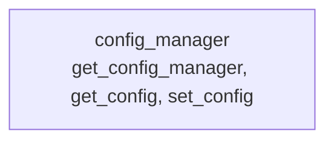

# get_config 拼接序列 2

```mermaid
flowchart TD
    graph_0_config_manager[config_manager\nget_config_manager, get_config, set_config]
```

## 圖序列

1. config_manager

## 檔案路徑

- C:\D\fold7\AIVA-git\services\aiva_common\config_manager.py
