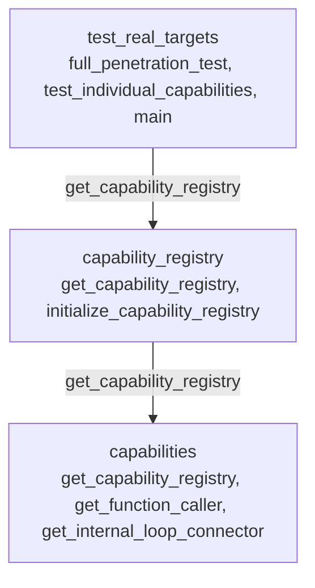

# main 拼接序列 3

## 圖序列

1. test_real_targets
2. capability_registry
3. capabilities

## 檔案路徑

- C:\D\fold7\AIVA-git\test_real_targets.py
- C:\D\fold7\AIVA-git\services\core\aiva_core\core_capabilities\capability_registry.py
- C:\D\fold7\AIVA-git\api\routers\capabilities.py
