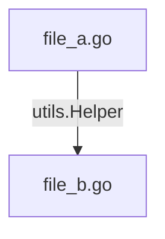

# AIVA Go AST 分析工具使用手冊

## 📑 目錄

- [📋 概述](#-概述)
- [🚀 快速開始](#-快速開始)
- [📊 輸出檔案說明](#-輸出檔案說明)
- [🎯 實際應用場景](#-實際應用場景)
- [🔍 分析結果解讀](#-分析結果解讀)
- [🛠️ 進階技巧](#️-進階技巧)
- [⚙️ 重新編譯](#️-重新編譯)
- [📝 注意事項](#-注意事項)
- [🆚 與 Python 工具對比](#-與-python-工具對比)
- [🐛 疑難排解](#-疑難排解)
- [📚 延伸閱讀](#-延伸閱讀)
- [📄 授權與維護](#-授權與維護)

---

## 📋 概述

`go2mermaid.exe` 是一個整合式 Go 程式碼分析工具，整合了 5 大功能模組：

1. **AST 解析與流程圖生成** (對標 Python `aiva_flow_analyzer.py`)
2. **跨檔案數據流串接** (Data Flow Stitching)
3. **功能分類與統計** (對標 Python `aiva_flow_classifier.py`)
4. **CLI 指令手冊生成** (對標 Python `aiva_cli_implementation.py`)
5. **系統瓶頸分析** (識別高耦合模組)

---

## 🚀 快速開始

### 基本用法

```powershell
# 分析當前目錄
.\go2mermaid.exe

# 指定輸入和輸出目錄
.\go2mermaid.exe --input "目標路徑" --output "輸出路徑"
```

### 參數說明

| 參數 | 說明 | 預設值 |
|------|------|--------|
| `--input` | 要分析的 Go 程式碼目錄 | `.` (當前目錄) |
| `--output` | 分析結果輸出目錄 | `./analysis_output` |

---

## 📊 輸出檔案說明

執行後會在輸出目錄生成以下檔案：

### 1. 函數級流程圖 (`.mmd` 檔案)

**格式**: `<檔名>_<函數名>.mmd`

**範例**: `go2mermaid.go_main.mmd`

**內容**: 單一函數的 Mermaid 流程圖，包含：
- 條件分支 (if/else)
- 迴圈結構 (for/range)
- 函數調用
- 返回語句

**使用方式**:
```powershell
# 用 VS Code Mermaid 擴充套件預覽
code go2mermaid.go_main.mmd
```

### 2. 系統架構圖 (`system_flow.mmd`)

**內容**: 跨檔案數據流關係圖，顯示：
- 檔案間的調用關係
- 數據流向
- 模組依賴

**範例**:


### 3. 完整分析報告 (`analysis_results.json`)

**JSON 結構**:
```json
{
  "summary": {
    "total_files": 3,
    "total_funcs": 25,
    "real_connections": 12,
    "categories": {
      "reconnaissance": 5,
      "analysis": 8,
      "other": 12
    }
  },
  "branch_analysis": {
    "fan_out_nodes": {"file_a.go": 5},
    "fan_in_nodes": {"file_b.go": 3},
    "total_connections": 12
  },
  "flow_chains": [
    {
      "from_script": "file_a.go",
      "from_func": "Process",
      "to_script": "file_b.go",
      "to_func": "Helper",
      "call_expr": "utils.Helper"
    }
  ],
  "functions": [...]
}
```

**欄位說明**:
- `summary`: 總體統計
- `branch_analysis`: 瓶頸分析 (扇入/扇出 > 2 的節點)
- `flow_chains`: 跨檔案調用鏈
- `functions`: 所有函數的詳細元數據

### 4. CLI 指令手冊 (`cli_commands.sh`)

**內容**: 自動生成的執行指令，按分類組織

**範例**:
```bash
## Category: RECONNAISSANCE
# [PLACEHOLDER] ScanNetwork 功能
go run scanner.go --func=ScanNetwork

## Category: ANALYSIS
# [PLACEHOLDER] ParseData 功能
go run parser.go --func=ParseData
```

**重要說明**:
- 註解中的 `[PLACEHOLDER]` 標記表示功能描述預留位置
- 實際描述需要由 **大語言模型 (LLM)** 分析程式碼後填入
- 工具只負責提取函數結構和分類，具體功能說明由 LLM 補充

---

## 🎯 實際應用場景

### 場景 1: 分析 Python 工具目錄

```powershell
cd c:\D\fold7\AIVA-git\services\core\aiva_core\internal_exploration\go_tools

.\go2mermaid.exe `
  --input "c:\D\fold7\AIVA-git\services\core\aiva_core\internal_exploration\python_tools" `
  --output "./python_analysis"
```

**目的**: 
- 視覺化 Python 工具的程式碼結構
- 發現模組間的依賴關係
- 識別重複或冗餘的功能

### 場景 2: 分析整個 services 目錄

```powershell
.\go2mermaid.exe `
  --input "c:\D\fold7\AIVA-git\services" `
  --output "./services_analysis"
```

**目的**:
- 理解整個服務架構
- 找出高耦合的瓶頸模組
- 生成系統級架構文檔

### 場景 3: 分析特定功能模組

```powershell
.\go2mermaid.exe `
  --input "c:\D\fold7\AIVA-git\services\core\aiva_core" `
  --output "./core_analysis"
```

**目的**:
- 深入了解核心模組
- 評估程式碼複雜度
- 規劃重構方向

---

## 🔍 分析結果解讀

### 功能分類 (Categories)

工具會根據函數名稱和檔案路徑自動分類：

| 分類 | 關鍵字 | 說明 |
|------|--------|------|
| **reconnaissance** | scan, detect | 偵察、掃描功能 |
| **exploitation** | exploit, attack | 攻擊、利用功能 |
| **analysis** | analyze, parse | 分析、解析功能 |
| **reporting** | report, generate | 報告生成功能 |
| **persistence** | store, save, db | 資料持久化 |
| **other** | - | 其他未分類功能 |

### 瓶頸識別 (Bottleneck Analysis)

**Fan-out (扇出)**: 一個模組調用多個其他模組
- **高扇出 (> 2)**: 表示該模組責任過重，可能需要拆分

**Fan-in (扇入)**: 一個模組被多個其他模組調用
- **高扇入 (> 2)**: 表示該模組是核心依賴，變更需謹慎

**範例解讀**:
```json
"branch_analysis": {
  "fan_out_nodes": {"controller.go": 5},
  "fan_in_nodes": {"utils.go": 4}
}
```
- `controller.go` 扇出 5：過度依賴外部模組
- `utils.go` 扇入 4：核心工具模組，變更影響廣

---

## 🛠️ 進階技巧

### 1. 批次分析多個目錄

```powershell
$targets = @(
    "c:\D\fold7\AIVA-git\services\core",
    "c:\D\fold7\AIVA-git\services\api",
    "c:\D\fold7\AIVA-git\tools"
)

foreach ($target in $targets) {
    $outputName = Split-Path $target -Leaf
    .\go2mermaid.exe --input $target --output "./analysis_$outputName"
}
```

### 2. 篩選特定類別的函數

分析後可用 `jq` 或 PowerShell 篩選：

```powershell
# 讀取 JSON 並篩選 reconnaissance 類別
$json = Get-Content "./analysis_output/analysis_results.json" | ConvertFrom-Json
$reconFuncs = $json.functions | Where-Object { $_.category -eq "reconnaissance" }
$reconFuncs | Format-Table function_name, source_file
```

### 3. 比較版本差異

```powershell
# 分析舊版本
git checkout v1.0
.\go2mermaid.exe --input "." --output "./analysis_v1"

# 分析新版本
git checkout v2.0
.\go2mermaid.exe --input "." --output "./analysis_v2"

# 比較 JSON 報告
Compare-Object `
  (Get-Content "./analysis_v1/analysis_results.json") `
  (Get-Content "./analysis_v2/analysis_results.json")
```

---

## ⚙️ 重新編譯

如需修改工具源碼後重新編譯：

```powershell
cd c:\D\fold7\AIVA-git\services\core\aiva_core\internal_exploration\go_tools

# 編譯
go build -o go2mermaid.exe go2mermaid.go

# 測試
.\go2mermaid.exe --input "." --output "./test_output"
```

---

## 📝 注意事項

### 1. 僅分析 Go 檔案
- 工具僅處理 `.go` 檔案
- 自動跳過 `_test.go` 測試檔案

### 2. 跨 Package 調用解析
- 目前採用「模糊匹配」策略
- 標準庫和第三方庫調用會被忽略
- 僅追蹤專案內部的跨檔案調用

### 3. 大型專案建議
- 建議分批分析子目錄，避免輸出過多檔案
- 大型專案的 `system_flow.mmd` 可能非常複雜

### 4. Mermaid 圖表預覽
- 推薦安裝 VS Code 擴充套件: `Markdown Preview Mermaid Support`
- 或使用線上工具: https://mermaid.live/

---

## 🆚 與 Python 工具對比

| 功能 | Python 工具 | Go 工具 (本工具) |
|------|-------------|------------------|
| **流程圖生成** | `aiva_flow_analyzer.py` | ✅ 整合 |
| **數據流串接** | `aiva_flow_analyzer.py` | ✅ 整合 |
| **功能分類** | `aiva_flow_classifier.py` | ✅ 整合 |
| **CLI 生成** | `aiva_cli_implementation.py` | ✅ 整合 |
| **系統分析** | `aiva_exploration_pipeline.py` | ✅ 整合 |
| **語言** | Python (解釋執行) | Go (編譯執行) |
| **執行效率** | 較慢 | 快 10-100 倍 |
| **單檔整合** | 4 個獨立腳本 | 1 個可執行檔 |

---

## 🐛 疑難排解

### 問題 1: 編譯失敗

**錯誤訊息**: `cannot find package ...`

**解決方法**:
```powershell
go mod init go2mermaid
go mod tidy
go build -o go2mermaid.exe go2mermaid.go
```

### 問題 2: 中文亂碼

**原因**: PowerShell 編碼問題

**解決方法**:
```powershell
[Console]::OutputEncoding = [System.Text.Encoding]::UTF8
.\go2mermaid.exe --input "." --output "./output"
```

### 問題 3: 無法找到跨檔案連接

**原因**: 
- 可能是標準庫調用 (會被忽略)
- Package 名稱解析失敗

**檢查方法**:
```powershell
# 查看 analysis_results.json 中的 flow_chains
$json = Get-Content "./analysis_output/analysis_results.json" | ConvertFrom-Json
$json.flow_chains
```

---

## 📚 延伸閱讀

- [Mermaid 語法文檔](https://mermaid.js.org/)
- [Go AST 官方文檔](https://pkg.go.dev/go/ast)
- [AIVA 專案架構說明](../../_PROJECT_STRUCTURE_OPTIMIZATION_RECOMMENDATIONS.md)

---

## 📄 授權與維護

- **版本**: 1.0 (整合版)
- **最後更新**: 2025-12-10
- **維護者**: AIVA Team
- **對應 Python 工具**: `python_tools/` 目錄下的 4 個腳本

如有問題或建議，請參考專案根目錄的貢獻指南。
