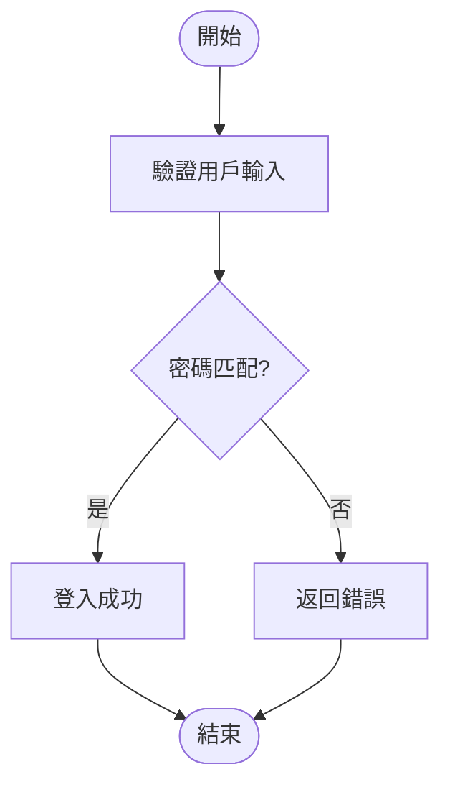

# AIVA Python 工具套件 - 操作手冊

> **版本**: v3.1.0  
> **最後更新**: 2026-01-06  
> **狀態**: ✅ 生產就緒  
> **檔案數**: 6 個 Python 模組  
> **代碼行數**: 4,645 行  
> **輸出格式**: latest_classification.json v3.3  
> **新增欄位**: cli_command, parameters, return_type, structured_tags

## 📑 目錄

- [📋 概述](#-概述)
- [🚀 快速開始](#-快速開始)
- [📚 模組詳解](#-模組詳解)
  - [模組 1: aiva_flow_analyzer.py](#模組-1-aiva_flow_analyzerpy)
  - [模組 2: aiva_flow_classifier.py](#模組-2-aiva_flow_classifierpy)
  - [模組 3: aiva_cli_implementation.py](#模組-3-aiva_cli_implementationpy)
  - [模組 4: aiva_exploration_pipeline.py](#模組-4-aiva_exploration_pipelinepy)
- [🎯 完整工作流範例](#-完整工作流範例)
- [🔧 進階配置](#-進階配置)
- [📊 輸出檔案總覽](#-輸出檔案總覽)
- [🐛 疑難排解](#-疑難排解)
- [📈 效能優化建議](#-效能優化建議)
- [🚀 與其他語言工具對比](#-與其他語言工具對比)
- [📚 延伸閱讀](#-延伸閱讀)

---

## 📋 概述

**AIVA Python Tools** 是 AIVA 專案中用於代碼分析、數據流分類和自動化探索的核心工具套件。包含 4 個主要模組,提供從底層 AST 解析到高階管線編排的完整功能。

### ⚠️ 重要變更通知 (2026-01-04)

**v3.3 格式升級 - 5M AI 特化**：

新增欄位支援 5M 特化 AI（非 LLM），無需自然語言處理：

```json
{
  "flow_id": "flow_123",
  "function_name": "execute_sql_injection",
  "primary_module": "core_capabilities",
  
  // v3.3 新增欄位
  "cli_command": "aiva attack sqli --target {target}",
  "parameters": [
    {"name": "target", "type": "str", "required": true}
  ],
  "return_type": "AttackResult",
  "structured_tags": [
    {"category": "攻擊", "sub_category": "注入", "complexity": "medium"}
  ]
}
```

**CapabilityEncoder 整合**：
- 512 維結構化向量編碼
- 直接與 5M Decision Engine 匹配
- 無需文本嵌入或 NLU 處理

---

### ⚠️ 路徑變更通知 (2025-12-15)

**分析結果輸出路徑已重構為統一的模組化結構**：

```
舊路徑:
services/integration/data/internal_exploration/
├── analysis_history/v1/, v2/, ...
└── analysis_results/

新路徑:
services/integration/analysis_data/
├── core/
│   ├── capabilities/     # 能力數據
│   ├── flows/           # 數據流分析
│   └── classifications/ # 分類結果
├── features/            # 功能模組分析
├── scan/                # 掃描引擎分析
└── integration/         # 整合層分析
```

**使用新路徑的優點**：
- ✅ 模組化組織：按 core/features/scan/integration 分類
- ✅ 類型化儲存：capabilities/flows/classifications 獨立管理
- ✅ 易於查詢：RAG 和 InternalLoopConnector 可直接讀取
- ✅ 版本追蹤：每個文件帶時間戳，同時保留 latest_ 快捷方式

**向後兼容性**：舊路徑保留用於歷史版本管理和差異比對。

### 四大核心模組

1. **aiva_flow_analyzer.py** - 流程圖生成與智能組合工具
   - AST 解析與 Mermaid 流程圖生成
   - 跨檔案數據流串接 (DataFlowStitcher)
   - 智能流程組合 (SmartFlowStitcher)

2. **aiva_flow_classifier.py** - AIVA Core 數據流分類分析器
   - 五大模組架構分類
   - AI/程式組件標記
   - 多路徑差異分析

3. **aiva_cli_implementation.py** - 動態流程執行器與文檔生成工具
   - 動態流程執行引擎
   - Pipeline 數據傳遞
   - CLI 指令手冊生成

4. **aiva_exploration_pipeline.py** - 認知更新管線總控腳本
   - 整合分析、分類、版本控制
   - 自動版本管理
   - 差異比對報告

---

## 🚀 快速開始

### 1. 環境準備

```bash
# 進入 python_tools 目錄
cd C:\D\fold7\AIVA-git\services\core\aiva_core\internal_exploration\python_tools

# 確認 Python 版本 (需要 3.10+)
python --version

# 安裝依賴 (如果需要)
pip install -r requirements.txt  # 如果有的話
```

### 2. 基本使用

```bash
# 方式 1: 完整管線執行 (推薦) - 使用新路徑結構
python aiva_exploration_pipeline.py --target core --module core

# 分析其他模組
python aiva_exploration_pipeline.py --target features --module features
python aiva_exploration_pipeline.py --target scan --module scan

# 分析特定子模組
python aiva_exploration_pipeline.py --target cognitive_core --module core

# 方式 2: 單獨流程圖分析
python aiva_flow_analyzer.py --scan-dir ../cognitive_core --output-dir ./analysis_output

# 方式 3: 單獨分類分析
python aiva_flow_classifier.py --input flow_results.json --output classification_output

# 方式 4: 執行特定數據流
python aiva_cli_implementation.py --flow 11
```

### 3. 輸出路徑配置

**新增 `--module` 參數** (2025-12-15)：

```bash
# 指定目標模組，決定分析結果的儲存位置
--module core         # → services/integration/analysis_data/core/
--module features     # → services/integration/analysis_data/features/
--module scan         # → services/integration/analysis_data/scan/
--module integration  # → services/integration/analysis_data/integration/
```

**自動分類儲存**：

分析完成後，結果會自動分類保存到三個子目錄：

```bash
# 執行分析
python aiva_exploration_pipeline.py --target core --module core

# 產生的文件結構
services/integration/analysis_data/core/
├── capabilities/
│   ├── core_capabilities_20251215_184037.json  # 帶時間戳
│   └── latest_core_capabilities.json           # 最新版本快捷方式
├── flows/
│   ├── core_flows_20251215_184036.json
│   └── latest_core_flows.json
└── classifications/
    ├── core_classifications_20251215_184036.json
    └── latest_core_classifications.json
```

**讀取最新結果**：

```python
from pathlib import Path
import json

# 讀取最新的 core 模組能力數據
capabilities_file = Path(
    "services/integration/analysis_data/core/capabilities/latest_core_capabilities.json"
)
with open(capabilities_file) as f:
    capabilities = json.load(f)

print(f"總流程數: {capabilities['metadata']['total_flows']}")
```

---

## 📚 模組詳解

## 模組 1: aiva_flow_analyzer.py

### 功能概述

這是底層的 AST 分析引擎,負責:
- 解析 Python 代碼生成流程圖
- 識別函數間的調用關係
- 跨檔案數據流串接
- 智能組合多個流程圖

### 核心類別

#### 1. Node & Graph
**用途**: Mermaid 圖形基礎結構

```python
# Graph 負責管理整個流程圖
graph = Graph(title="user_login", direction="TD")
node1 = graph.add("op", "驗證用戶")
node2 = graph.add("cond", "密碼正確?")
graph.link(node1, node2)
```

#### 2. Builder (AST Visitor)
**用途**: 遍歷 Python AST 建立流程圖

**支援的語法結構:**
- If/Else 條件分支
- For/While 迴圈
- Try/Except 異常處理
- With 上下文管理
- Function/Method 呼叫
- Return 語句

**示例輸出:**


#### 3. DataFlowStitcher
**用途**: 跨檔案數據流串接

**工作流程:**
1. 掃描所有 Python 檔案
2. 提取函數定義和外部呼叫
3. 建立呼叫圖 (Call Graph)
4. 解析跨檔案連接

**自動串接策略:**
```python
# 策略 1: Import 精確匹配
from auth import login
login()  # → 找到 auth.py 中的 login()

# 策略 2: 模組名稱模糊匹配
user.save()  # → 搜尋包含 'user' 的檔案

# 策略 3: 全域函數搜尋
process_data()  # → 在所有檔案中尋找定義
```

#### 4. SmartFlowStitcher
**用途**: 智能組合多個流程圖

**匹配機制:**
- 分析每個流程圖的輸入/輸出介面
- 根據變數名稱進行頭尾匹配
- 生成組合後的完整數據流

**示例:**
```
流程 A: [input: user_data] → [output: validated_user]
流程 B: [input: validated_user] → [output: token]
→ 自動組合: user_data → validated_user → token
```

### 使用範例

#### 範例 1: 分析單一檔案

```bash
python aiva_flow_analyzer.py \
    --scan-dir ../cognitive_core \
    --output-dir ./flow_output \
    --single-file neural_network.py
```

**輸出:**
- `neural_network_train.mmd` - 訓練函數流程圖
- `neural_network_predict.mmd` - 預測函數流程圖
- `flow_results.json` - 分析數據

#### 範例 2: 整目錄分析 + 跨檔串接

```bash
python aiva_flow_analyzer.py \
    --scan-dir ../cognitive_core \
    --output-dir ./full_analysis \
    --enable-stitching
```

**輸出:**
- 每個函數的獨立 .mmd 圖
- `combined_flow.mmd` - 跨檔案組合圖
- `call_graph.json` - 完整呼叫關係

#### 範例 3: 智能組圖模式

```bash
python aiva_flow_analyzer.py \
    --scan-dir ../task_planning \
    --output-dir ./smart_combo \
    --smart-stitch
```

**特色:**
- 自動識別數據流鏈
- 過濾無關函數
- 生成端到端流程圖

### 進階配置

```python
# 自訂 Builder 設定
builder = Builder(
    title="custom_flow",
    max_depth=10,  # 最大遞迴深度
    track_calls=True,  # 追蹤外部呼叫
    sanitize_labels=True  # 清理節點標籤
)

# 自訂 Stitcher 設定
stitcher = DataFlowStitcher(
    match_threshold=0.7,  # 相似度門檻
    ignore_builtin=True,  # 忽略內建函數
    max_hops=3  # 最大連接跳數
)
```

---

## 模組 2: aiva_flow_classifier.py

### 功能概述

基於 AIVA Core 五大模組架構進行數據流分類和路徑差異分析。

> **架構變更 (2026-01)**: 原 `external_learning` 已整合至 `cognitive_core/learning_system`，現為五大模組架構。

### AIVA Core 五大模組

```
┌─────────────────────────────────────────────────────┐
│  1. cognitive_core (認知核心)                        │
│     - AI能力查詢、決策代理、神經網路、RAG            │
│     - learning_system (學習系統，原 external_learning)│
├─────────────────────────────────────────────────────┤
│  2. internal_exploration (內探)                     │
│     - 自我感知、能力分析、內部監控                   │
├─────────────────────────────────────────────────────┤
│  3. task_planning (任務規劃)                        │
│     - 計劃執行、任務指揮、智能規劃                   │
├─────────────────────────────────────────────────────┤
│  4. core_capabilities (核心能力)                    │
│     - 攻擊鏈、業務邏輯、插件管理                     │
├─────────────────────────────────────────────────────┤
│  5. service_backbone (服務骨幹)                     │
│     - API網關、消息總線、存儲管理                    │
└─────────────────────────────────────────────────────┘
```

### 核心功能

#### 1. 自動分類

```python
classifier = AIVAFlowClassifier()
classifier.load_flow_data("flow_results.json")
classifier.classify_flows()
```

**分類邏輯:**
- 根據檔案路徑識別模組
- 根據腳本名稱匹配預設定義
- 標記 AI 組件 / 程式組件 / 混合組件

**組件類型判定規則:**
```python
AI_KEYWORDS = ["ai", "neural", "model", "rag", "llm", "agent"]
LOGIC_KEYWORDS = ["executor", "manager", "handler", "controller"]

# AI組件: 包含 AI 關鍵字但無程式邏輯關鍵字
# 程式組件: 包含程式邏輯關鍵字
# 混合組件: 同時包含兩者
```

#### 2. 路徑列舉與差異分析

**功能:**
- 列出所有數據流路徑
- 分析多路徑到相同終點的使用場景差異

**示例輸出:**
```markdown
### 數據流 #23: task_commander → planner → plan_executor

**路徑:**
1. task_commander (任務指揮官)
2. planner (智能規劃器)  
3. plan_executor (計劃執行器)

**模組分布:**
- task_planning: 3 個腳本 (100%)

**組件類型:**
- 程式組件: 2 個
- AI組件: 1 個
```

#### 3. 多路徑差異分析

當發現多條路徑到達同一終點時,自動分析差異:

```markdown
### 🔀 多路徑差異分析

**終點腳本:** storage_manager

**路徑 A (3步):**
api_gateway → orchestrator → storage_manager

**路徑 B (2步):**  
backends → storage_manager

**差異分析:**
- 路徑 A: 經過 API 網關,適用於外部請求
- 路徑 B: 直接存取,適用於內部操作
```

### 使用範例

#### 範例 1: 完整分類流程

```bash
python aiva_flow_classifier.py \
    --input analysis_output/flow_results.json \
    --output classification_results
```

**輸出檔案:**
- `classification_report.md` - 人類可讀報告
- `classification_data.json` - 機器可讀數據
- `module_stats.json` - 模組統計資訊

#### 範例 2: 僅分析特定模組

```python
from aiva_flow_classifier import AIVAFlowClassifier

classifier = AIVAFlowClassifier()
classifier.load_flow_data("flow_results.json")

# 僅分類認知核心模組
cognitive_flows = classifier.filter_by_module("cognitive_core")
classifier.classify_flows(flows=cognitive_flows)
```

#### 範例 3: 自訂腳本描述

```python
classifier = AIVAFlowClassifier()

# 擴充腳本描述字典
classifier.dynamic_script_descriptions["custom_analyzer"] = \
    "自訂分析器 - 特殊數據分析功能"

classifier.classify_flows()
```

### 報告結構

```markdown
# AIVA Core 數據流分類報告

## 總體統計
- 總數據流數量: 282
- 涉及腳本數量: 156
- 模組分布: 6 大模組

## 模組詳情

### 1. cognitive_core (認知核心模組)
- 數據流數量: 45
- AI組件: 23 (51%)
- 程式組件: 18 (40%)
- 混合組件: 4 (9%)

### 2. task_planning (任務規劃模組)
...

## 完整數據流清單
[詳細列舉所有 282 條數據流...]

## 多路徑差異分析
[分析 15 組多路徑場景...]
```

---

## 模組 3: aiva_cli_implementation.py

### 功能概述

動態流程執行器,可以:
- 讀取分類數據並執行數據流
- 自動導入模組和實例化類別
- 在步驟間傳遞數據 (Pipeline)
- 生成 CLI 指令手冊

### 核心類別

#### FlowExecutor

**職責:** 動態執行數據流

**關鍵方法:**
```python
executor = FlowExecutor("classification_data.json")

# 列出所有流程
flows = executor.list_flows()

# 預覽執行計畫 (不實際執行)
executor.execute_flow(flow_id=11, dry_run=True)

# 實際執行
result = executor.execute_flow(flow_id=11, dry_run=False)
```

**執行流程:**
```
1. 解析數據流定義 (JSON)
   ↓
2. 將 Windows 路徑轉換為 Python 模組路徑
   例: C:\...\aiva_core\cognitive_core\neural_network.py
       → aiva_core.cognitive_core.neural_network
   ↓
3. 動態導入模組
   module = importlib.import_module(module_path)
   ↓
4. 推斷類別名稱 (snake_case → CamelCase)
   neural_network → NeuralNetwork
   ↓
5. 實例化類別
   instance = NeuralNetworkClass()
   ↓
6. 偵測入口方法 (train, execute, run, process...)
   ↓
7. 執行方法並捕獲輸出
   output = getattr(instance, method)()
   ↓
8. 傳遞輸出到下一步 (Pipeline)
```

### 自動類別名稱推斷

```python
# 規則: snake_case 轉換為 CamelCase
"neural_network"     → "NeuralNetwork"
"task_commander"     → "TaskCommander"
"rag_system"         → "RagSystem"
"plan_executor"      → "PlanExecutor"
```

### 啟發式入口方法偵測

**優先順序 (由高到低):**
```python
ENTRY_METHODS = [
    "train",        # 訓練類模組
    "execute",      # 執行器類模組
    "run",          # 通用執行方法
    "process",      # 處理器類模組
    "analyze",      # 分析器類模組
    "handle",       # 處理器類模組
    "start",        # 啟動類模組
    "main"          # 主函數
]
```

### Pipeline 數據傳遞

```python
# 數據流定義
flow = {
    "steps": [
        {"script": "data_loader", "output_key": "raw_data"},
        {"script": "preprocessor", "input_from": 0, "output_key": "clean_data"},
        {"script": "model_trainer", "input_from": 1}
    ]
}

# 執行時自動傳遞
step1_output = data_loader.run()  # → {"raw_data": [...]}
step2_output = preprocessor.run(step1_output)  # → {"clean_data": [...]}
step3_output = model_trainer.train(step2_output)
```

### 指令手冊生成

#### Markdown 格式 (人類閱讀)

```bash
python aiva_cli_implementation.py --generate-doc md
```

**輸出: CLI_COMMANDS_REFERENCE.md**
```markdown
# AIVA CLI 指令參考手冊

## cognitive_core (認知核心模組)

### Flow #1: ai_capability_query
**描述:** AI能力查詢 → 預設指令處理
**執行指令:**
```bash
python -m aiva_core.internal_exploration.aiva_cli_implementation --flow 1
```
```

#### JSON 格式 (AI 檢索)

```bash
python aiva_cli_implementation.py --generate-doc json
```

**輸出: cli_commands_db.json**
```json
{
  "flows": [
    {
      "id": 1,
      "module": "cognitive_core",
      "scripts": ["ai_capability_query", "conversation_handler"],
      "command": "python -m aiva_core.internal_exploration.aiva_cli_implementation --flow 1",
      "description": "AI能力查詢 → 預設指令處理"
    }
  ]
}
```

### 使用範例

#### 範例 1: 互動式選單

```bash
python aiva_cli_implementation.py
```

**輸出:**
```
========================================
  AIVA CLI 動態流程執行器
========================================

[1] 列出所有流程
[2] 執行特定流程 (Dry Run)
[3] 執行特定流程 (實際執行)
[4] 生成 CLI 指令手冊
[5] 退出

請選擇操作:
```

#### 範例 2: 列出可用流程

```bash
python aiva_cli_implementation.py --list
```

**輸出:**
```
可用的數據流:
  #1  [cognitive_core] ai_capability_query → conversation_handler
  #11 [task_planning] task_commander → planner → plan_executor
  #23 [external_learning] scalable_bio_trainer → rl_models
  ...
```

#### 範例 3: Dry Run 模式

```bash
python aiva_cli_implementation.py --flow 11 --dry-run
```

**輸出:**
```
========================================
[Dry Run] 執行計畫預覽
========================================

數據流 #11: task_commander → planner → plan_executor

步驟 1: task_commander
  - 模組路徑: aiva_core.task_planning.task_commander
  - 預期類別: TaskCommander
  - 入口方法: execute

步驟 2: planner
  - 模組路徑: aiva_core.task_planning.planner
  - 預期類別: Planner
  - 入口方法: run
  - 數據輸入: 來自步驟 1

步驟 3: plan_executor
  - 模組路徑: aiva_core.task_planning.plan_executor
  - 預期類別: PlanExecutor
  - 入口方法: execute
  - 數據輸入: 來自步驟 2

[注意] 這只是預覽,未實際執行任何代碼
```

#### 範例 4: 實際執行

```bash
python aiva_cli_implementation.py --flow 11
```

**輸出:**
```
[執行] 步驟 1/3: task_commander.execute()
  → 輸出: {'tasks': [...], 'status': 'planned'}

[執行] 步驟 2/3: planner.run(input_data)
  → 輸出: {'plan': {...}, 'confidence': 0.87}

[執行] 步驟 3/3: plan_executor.execute(input_data)
  → 輸出: {'result': 'success', 'executed_steps': 5}

✅ 數據流 #11 執行完成
```

### 容錯機制

#### 1. 類別名稱搜尋

```python
# 如果推斷的類別名稱不存在,自動搜尋模組內其他類別
try:
    cls = getattr(module, inferred_class_name)
except AttributeError:
    # 列出模組內所有類別
    classes = [name for name in dir(module) if inspect.isclass(getattr(module, name))]
    # 選擇第一個非內建類別
    cls = getattr(module, classes[0])
```

#### 2. 入口方法回退

```python
# 按優先順序嘗試多個入口方法
for method_name in ENTRY_METHODS:
    if hasattr(instance, method_name):
        return getattr(instance, method_name)

# 如果都沒有,嘗試 __call__
if callable(instance):
    return instance
```

#### 3. 路徑轉換錯誤處理

```python
try:
    module_path = convert_windows_path_to_module(script_path)
except ValueError as e:
    logger.error(f"路徑轉換失敗: {e}")
    # 提供建議的手動執行方式
```

---

## 模組 4: aiva_exploration_pipeline.py

### 功能概述

認知更新管線總控腳本,整合前三個模組並提供:
- 自動版本管理
- 歷史版本追蹤
- 差異比對報告
- 一鍵完整分析

### 執行流程

```
1. 版本初始化
   - 檢查 analysis_history/ 目錄
   - 建立新版本資料夾 (v1, v2, v3...)
   ↓
2. 代碼分析 (aiva_flow_analyzer)
   - 掃描目標目錄
   - 生成流程圖
   - 產生 flow_results.json
   ↓
3. 數據流分類 (aiva_flow_classifier)
   - 載入 flow_results.json
   - 執行六大模組分類
   - 產生 classification_data.json
   ↓
4. 差異比對 (Diff)
   - 與上一版本比較
   - 識別新增/刪除/修改的數據流
   - 產生 diff_report.md
   ↓
5. 版本發布
   - 更新 latest_classification.json 連結
   - 記錄版本元數據
```

### 目錄結構

```
python_tools/
├── aiva_exploration_pipeline.py    # 管線腳本
├── aiva_flow_analyzer.py
├── aiva_flow_classifier.py
├── aiva_cli_implementation.py
├── latest_classification.json      # → 指向最新版本
└── analysis_history/               # 版本歷史
    ├── v1/
    │   ├── analysis_results.json   # Analyzer 輸出
    │   ├── classification_data.json # Classifier 輸出
    │   ├── diff_report.md          # 差異報告
    │   └── metadata.json           # 版本元數據
    ├── v2/
    │   ├── ...
    └── v3/
        └── ...
```

### 使用範例

#### 範例 1: 分析特定模組

```bash
python aiva_exploration_pipeline.py --target cognitive_core
```

**執行內容:**
- 僅分析 `services/core/aiva_core/cognitive_core/` 目錄
- 產生該模組的完整分析報告

#### 範例 2: 分析整個 Core

```bash
python aiva_exploration_pipeline.py --target core
```

**執行內容:**
- 分析 `services/core/aiva_core/` 下所有六大模組
- 產生跨模組的數據流分析

#### 範例 3: 分析所有模組

```bash
python aiva_exploration_pipeline.py --target all
```

**執行內容:**
- 分析整個 AIVA 專案
- 包含 services, tools, plugins 等所有目錄

#### 範例 4: 自訂輸出目錄

```bash
python aiva_exploration_pipeline.py \
    --target cognitive_core \
    --output-dir ./custom_output
```

### 🔄 路徑架構變更 (2025-12-15)

**重要更新**: 分析結果輸出路徑已重構為統一的模組化結構

#### 變更原因

1. **模組隔離**: 不同模組的分析結果混在一起，難以管理
2. **類型混淆**: capabilities/flows/classifications 未分開儲存
3. **查詢困難**: RAG 和 InternalLoopConnector 需要遍歷多個位置
4. **版本追蹤**: 缺少清晰的文件版本管理機制

#### 新路徑結構

```bash
services/integration/analysis_data/
├── core/                        # 核心模組 (aiva_core)
│   ├── capabilities/
│   │   ├── core_capabilities_20251215_184037.json
│   │   └── latest_core_capabilities.json
│   ├── flows/
│   │   ├── core_flows_20251215_184036.json
│   │   └── latest_core_flows.json
│   └── classifications/
│       ├── core_classifications_20251215_184036.json
│       └── latest_core_classifications.json
├── features/                    # 功能模組
│   ├── capabilities/
│   ├── flows/
│   └── classifications/
├── scan/                        # 掃描引擎
│   ├── capabilities/
│   ├── flows/
│   └── classifications/
└── integration/                 # 整合層
    ├── capabilities/
    ├── flows/
    └── classifications/
```

#### 實作變更

**1. 新增 `--module` 參數**

```python
# aiva_exploration_pipeline.py __init__() 修改
def __init__(self, target_path, target_module="core"):
    """
    Args:
        target_path: 要分析的路徑 (core, cognitive_core, features等)
        target_module: 模組名稱，決定輸出位置
            - 'core': services/integration/analysis_data/core/
            - 'features': services/integration/analysis_data/features/
            - 'scan': services/integration/analysis_data/scan/
            - 'integration': services/integration/analysis_data/integration/
    """
    self.target_path = target_path
    self.target_module = target_module  # 新增
```

**2. 新增分類保存方法**

```python
def _save_to_analysis_data(self, source_file, category):
    """保存結果到統一的 analysis_data 結構
    
    Args:
        source_file: 源文件路徑 (版本目錄中的 JSON)
        category: 類別 ('capabilities', 'flows', 'classifications')
    """
    # 構建目標路徑
    analysis_data_root = SERVICES_ROOT / "integration" / "analysis_data"
    module_dir = analysis_data_root / self.target_module
    category_dir = module_dir / category
    
    # 生成時間戳文件名
    timestamp = datetime.now().strftime("%Y%m%d_%H%M%S")
    dest_file = category_dir / f"{self.target_module}_{category}_{timestamp}.json"
    
    # 複製文件
    shutil.copy2(source_file, dest_file)
    
    # 創建最新版本鏈接
    latest_link = category_dir / f"latest_{self.target_module}_{category}.json"
    shutil.copy2(source_file, latest_link)
```

**3. 整合到分析流程**

```python
def _step_analyze(self, target_path, output_json):
    """步驟 1: 代碼結構分析"""
    analyzer = AIVAFlowAnalyzer(target_dir=str(PROJECT_ROOT))
    analyzer.analyze_directory(target=str(target_path), depth=5, verbose=False)
    analyzer.save_results(output_dir=str(self.current_version_dir))
    
    # 新增: 保存到 flows 目錄
    self._save_to_analysis_data(output_json, "flows")
    return True

def _step_classify(self, input_json, output_json):
    """步驟 2: 數據流分類"""
    classifier = AIVAFlowClassifier(
        input_dir=str(self.current_version_dir),
        output_dir=str(self.current_version_dir),
        verbose=False
    )
    classifier.load_flow_data()
    classifier.classify_flows()
    classifier.generate_reports()
    
    # 新增: 保存到 classifications 和 capabilities 目錄
    self._save_to_analysis_data(output_json, "classifications")
    self._save_to_analysis_data(output_json, "capabilities")
    return True
```

**4. 配置文件更新**

在 `services/integration/aiva_integration/config.py` 中添加：

```python
# 統一分析資料儲存配置
ANALYSIS_DATA_ROOT = Path(__file__).parent.parent / "analysis_data"

# 各模組分析資料目錄
ANALYSIS_DATA_CORE = ANALYSIS_DATA_ROOT / "core"
ANALYSIS_DATA_FEATURES = ANALYSIS_DATA_ROOT / "features"
ANALYSIS_DATA_SCAN = ANALYSIS_DATA_ROOT / "scan"
ANALYSIS_DATA_INTEGRATION = ANALYSIS_DATA_ROOT / "integration"

# 模組名稱映射
MODULE_ANALYSIS_DIRS = {
    "core": ANALYSIS_DATA_CORE,
    "features": ANALYSIS_DATA_FEATURES,
    "scan": ANALYSIS_DATA_SCAN,
    "integration": ANALYSIS_DATA_INTEGRATION,
}
```

#### 使用範例

```bash
# 分析 core 模組
cd C:\D\fold7\AIVA-git
python services\core\aiva_core\internal_exploration\python_tools\aiva_exploration_pipeline.py --target core --module core

# 分析結果位置
ls services\integration\analysis_data\core\capabilities\
# 輸出: 
#   core_capabilities_20251215_184037.json
#   latest_core_capabilities.json

# 分析其他模組
python ... --target features --module features  # → analysis_data/features/
python ... --target scan --module scan          # → analysis_data/scan/
```

#### 讀取最新結果

```python
from pathlib import Path
import json

# 讀取最新的 core 模組能力數據
capabilities_file = Path(
    "services/integration/analysis_data/core/capabilities/latest_core_capabilities.json"
)

with open(capabilities_file, encoding='utf-8') as f:
    data = json.load(f)

print(f"總流程數: {data['metadata']['total_flows']}")
print(f"模組分布: {data['metadata']['module_distribution']}")

# 遍歷所有流程
for flow in data['flows']:
    print(f"Flow {flow['id']}: {' → '.join(flow['path'])}")
```

#### 向後兼容性

**舊路徑保留**: `services/integration/data/internal_exploration/` 繼續用於：
- 版本歷史管理 (`analysis_history/v1, v2, ...`)
- 差異比對報告 (`diff_report.md`)
- CLI 指令文檔 (`CLI_COMMANDS_REFERENCE.md`)

**新路徑用於**: `services/integration/analysis_data/` 專門存儲：
- 最終分析結果（供 RAG 和 InternalLoopConnector 使用）
- 模組化組織的能力數據
- 便於查詢和檢索的分類結構

### 差異報告範例

```markdown
# AIVA 認知更新差異報告

**版本:** v3
**對比版本:** v2
**生成時間:** 2025-12-15 18:40:37

## 變更摘要

- **新增數據流:** 5 條
- **刪除數據流:** 2 條
- **修改數據流:** 3 條
- **總數據流:** 840 條 (↑3)

## 新增數據流

### #283: enhanced_rag → knowledge_base → response_generator
**模組:** cognitive_core
**類型:** AI組件
**說明:** 新增增強型 RAG 查詢流程

### #284: resource_optimizer → gpu_allocator
**模組:** external_learning
**類型:** 程式組件
**說明:** 新增 GPU 資源優化流程

## 刪除數據流

### #156: legacy_planner → old_executor
**原因:** 已被新版 planner 取代

## 修改數據流

### #23: task_commander → planner → plan_executor
**變更:** 新增中間步驟 `plan_validator`
**新流程:** task_commander → plan_validator → planner → plan_executor
```

### 版本元數據

```json
{
  "version": "v3",
  "timestamp": "2025-12-11T14:30:22",
  "target": "cognitive_core",
  "stats": {
    "total_flows": 285,
    "total_scripts": 162,
    "module_distribution": {
      "cognitive_core": 48,
      "task_planning": 52,
      "external_learning": 41,
      "core_capabilities": 67,
      "service_backbone": 53,
      "internal_exploration": 24
    }
  },
  "changes": {
    "added": 5,
    "deleted": 2,
    "modified": 3
  }
}
```

---

## 🎯 完整工作流範例

### 情境 1: 新增功能後更新認知系統（使用新路徑結構）

```bash
# 進入專案根目錄
cd C:\D\fold7\AIVA-git

# Step 1: 分析 core 模組
python services\core\aiva_core\internal_exploration\python_tools\aiva_exploration_pipeline.py --target core --module core

# 執行過程:
# [1/5] 執行代碼結構分析 (Analyzer)...
#    目標: C:\D\fold7\AIVA-git\services\core
#    模組: core
#    ✅ 發現 840 個數據流
#    📁 已保存到: flows/core_flows_20251215_184036.json
#
# [2/5] 執行數據流分類 (Classifier)...
#    ✅ 分類完成: 840 個流程
#    📁 已保存到: classifications/core_classifications_20251215_184036.json
#    📁 已保存到: capabilities/core_capabilities_20251215_184037.json
#
# [3/5] 生成版本差異報告 (Diff)...
#    ✅ 差異分析完成: +5 / -2
#
# [4/5] 更新系統數據指針...
#    ✅ 已更新 latest_classification.json
#
# [5/5] 生成 CLI 指令文檔...
#    ✅ Markdown 文檔: CLI_COMMANDS_REFERENCE.md
#    ✅ JSON 資料庫: cli_commands_db.json
#
# ✨ 管線執行完畢。數據已更新至 v3。

# Step 2: 驗證輸出結果
tree /F services\integration\analysis_data\core
# 輸出:
# core
# ├─capabilities
# │      core_capabilities_20251215_184037.json
# │      latest_core_capabilities.json
# ├─classifications
# │      core_classifications_20251215_184036.json
# │      latest_core_classifications.json
# └─flows
#        core_flows_20251215_184036.json
#        latest_core_flows.json

# Step 3: 查看分析統計
python -c "import json; data = json.load(open('services/integration/analysis_data/core/capabilities/latest_core_capabilities.json')); print(f'總流程數: {data[\"metadata\"][\"total_flows\"]}'); print(f'模組分布: {data[\"metadata\"][\"module_distribution\"]}')"

# Step 4: 查看差異報告（在版本歷史中）
type services\integration\data\internal_exploration\analysis_history\v3\diff_report.md

# Step 5: 測試新增的數據流
python services\core\aiva_core\internal_exploration\python_tools\aiva_cli_implementation.py --flow 283 --dry-run
```

### 情境 2: 分析多個模組

```bash
# 分析 core 模組
python services\core\aiva_core\internal_exploration\python_tools\aiva_exploration_pipeline.py --target core --module core

# 分析 features 模組
python services\core\aiva_core\internal_exploration\python_tools\aiva_exploration_pipeline.py --target features --module features

# 分析 scan 模組
python services\core\aiva_core\internal_exploration\python_tools\aiva_exploration_pipeline.py --target scan --module scan

# 結果會分別保存在:
# services/integration/analysis_data/core/
# services/integration/analysis_data/features/
# services/integration/analysis_data/scan/
```

### 情境 3: 整合到 Python 程式中

```python
from pathlib import Path
import json
from datetime import datetime

class AIVAAnalysisReader:
    """讀取 AIVA 分析結果的輔助類別"""
    
    def __init__(self, analysis_root="services/integration/analysis_data"):
        self.root = Path(analysis_root)
    
    def get_latest_capabilities(self, module="core"):
        """獲取指定模組的最新能力數據"""
        cap_file = self.root / module / "capabilities" / f"latest_{module}_capabilities.json"
        with open(cap_file, encoding='utf-8') as f:
            return json.load(f)
    
    def get_latest_flows(self, module="core"):
        """獲取指定模組的最新流程數據"""
        flow_file = self.root / module / "flows" / f"latest_{module}_flows.json"
        with open(flow_file, encoding='utf-8') as f:
            return json.load(f)
    
    def get_module_summary(self, module="core"):
        """獲取模組摘要統計"""
        data = self.get_latest_capabilities(module)
        return {
            "module": module,
            "total_flows": data["metadata"]["total_flows"],
            "module_distribution": data["metadata"]["module_distribution"],
            "generated_at": data["metadata"]["generated_at"]
        }
    
    def search_flows_by_path(self, module="core", keyword="neural"):
        """搜尋包含特定關鍵字的流程"""
        data = self.get_latest_capabilities(module)
        results = []
        for flow in data["flows"]:
            path_str = " -> ".join(flow["path"])
            if keyword.lower() in path_str.lower():
                results.append({
                    "id": flow["id"],
                    "path": flow["path"],
                    "length": flow["length"],
                    "primary_module": flow.get("primary_module", "unknown")
                })
        return results

# 使用範例
reader = AIVAAnalysisReader()

# 獲取 core 模組摘要
summary = reader.get_module_summary("core")
print(f"Core 模組總流程數: {summary['total_flows']}")

# 搜尋包含 "neural" 的流程
neural_flows = reader.search_flows_by_path("core", "neural")
print(f"找到 {len(neural_flows)} 個與神經網路相關的流程")

# 比較不同模組
for module in ["core", "features", "scan"]:
    try:
        summary = reader.get_module_summary(module)
        print(f"{module}: {summary['total_flows']} 個流程")
    except FileNotFoundError:
        print(f"{module}: 尚未分析")
```

### 情境 4: 定期自動化分析（批次腳本）

```powershell
# analyze_all_modules.ps1
# 自動化分析所有模組的 PowerShell 腳本

$modules = @("core", "features", "scan", "integration")
$baseDir = "C:\D\fold7\AIVA-git"
$scriptPath = "services\core\aiva_core\internal_exploration\python_tools\aiva_exploration_pipeline.py"

Write-Host "開始自動化分析..." -ForegroundColor Cyan

foreach ($module in $modules) {
    Write-Host "`n分析模組: $module" -ForegroundColor Yellow
    
    # 執行分析
    python $scriptPath --target $module --module $module
    
    if ($LASTEXITCODE -eq 0) {
        Write-Host "✓ $module 分析完成" -ForegroundColor Green
        
        # 驗證輸出
        $capFile = "$baseDir\services\integration\analysis_data\$module\capabilities\latest_${module}_capabilities.json"
        if (Test-Path $capFile) {
            $size = [math]::Round((Get-Item $capFile).Length / 1KB, 2)
            Write-Host "  文件大小: ${size} KB" -ForegroundColor Gray
        }
    } else {
        Write-Host "✗ $module 分析失敗" -ForegroundColor Red
    }
}

Write-Host "`n所有模組分析完成！" -ForegroundColor Cyan
```

---

## 🔧 進階配置

### 自訂分析範圍

```python
# 在 aiva_exploration_pipeline.py 中修改
TARGETS = {
    "cognitive_core": Path("../cognitive_core"),
    "custom_module": Path("../../plugins/custom"),  # 新增自訂模組
}
```

### 自訂分類規則

```python
# 在 aiva_flow_classifier.py 中擴充
SCRIPT_DESCRIPTIONS["new_script"] = "新腳本 - 功能說明"
```

### 自訂入口方法

```python
# 在 aiva_cli_implementation.py 中修改
ENTRY_METHODS = [
    "train",
    "execute",
    "custom_entry",  # 新增自訂入口
]
```

---

## 📊 輸出檔案總覽

### Analyzer 輸出

| 檔案 | 格式 | 用途 |
|------|------|------|
| `{function}.mmd` | Mermaid | 個別函數流程圖 |
| `combined_flow.mmd` | Mermaid | 跨檔案組合圖 |
| `flow_results.json` | JSON | 分析數據 (供 Classifier 使用) |
| `call_graph.json` | JSON | 完整呼叫圖 |

### Classifier 輸出

| 檔案 | 格式 | 用途 |
|------|------|------|
| `classification_report.md` | Markdown | 人類可讀分類報告 |
| `classification_data.json` | JSON | 機器可讀分類數據 (供 CLI 使用) |
| `module_stats.json` | JSON | 模組統計資訊 |

### CLI Implementation 輸出

| 檔案 | 格式 | 用途 |
|------|------|------|
| `CLI_COMMANDS_REFERENCE.md` | Markdown | CLI 指令參考手冊 |
| `cli_commands_db.json` | JSON | CLI 指令資料庫 |

### Pipeline 輸出

| 檔案 | 格式 | 用途 |
|------|------|------|
| `analysis_results.json` | JSON | Analyzer 完整輸出 |
| `classification_data.json` | JSON | Classifier 完整輸出 |
| `diff_report.md` | Markdown | 版本差異報告 |
| `metadata.json` | JSON | 版本元數據 |

---

## 🐛 疑難排解

### 問題 1: ImportError

**錯誤訊息:**
```
ModuleNotFoundError: No module named 'aiva_core'
```

**解決方案:**
```bash
# 確保 PYTHONPATH 包含專案根目錄
export PYTHONPATH=$PYTHONPATH:C:\D\fold7\AIVA-git\services

# 或在腳本開頭添加
import sys
sys.path.insert(0, str(Path(__file__).parent.parent.parent))
```

### 問題 2: 路徑轉換失敗

**錯誤訊息:**
```
ValueError: 無法將 Windows 路徑轉換為 Python 模組路徑
```

**解決方案:**
```python
# 確保路徑包含 'services/' 目錄
# 正確: C:\...\services\core\aiva_core\...
# 錯誤: C:\...\aiva_core\...  (缺少 services)
```

### 問題 3: 找不到入口方法

**錯誤訊息:**
```
AttributeError: 'NeuralNetwork' object has no attribute 'train'
```

**解決方案:**
```python
# 方案 1: 在類別中添加標準入口方法
class NeuralNetwork:
    def execute(self):  # 或 run, process 等
        # 實作

# 方案 2: 擴充 ENTRY_METHODS 列表
ENTRY_METHODS.append("custom_method")
```

### 問題 4: 記憶體不足 (大型專案)

**優化方案:**
```python
# 在 aiva_flow_analyzer.py 中限制掃描範圍
analyzer = AIVAFlowAnalyzer(
    max_files=100,  # 限制最大檔案數
    max_functions_per_file=20  # 限制每檔案函數數
)
```

### 問題 5: JSON 解析錯誤

**錯誤訊息:**
```
json.decoder.JSONDecodeError: Expecting value
```

**解決方案:**
```bash
# 檢查 JSON 檔案格式
python -m json.tool classification_data.json

# 如果損壞,重新生成
python aiva_exploration_pipeline.py --target cognitive_core --force
```

---

## 📈 效能優化建議

### 1. 大型專案分析

```bash
# 使用分模組分析,避免一次掃描全部
for module in cognitive_core task_planning external_learning; do
    python aiva_exploration_pipeline.py --target $module
done
```

### 2. 增量分析

```python
# 僅分析最近修改的檔案
import os
from datetime import datetime, timedelta

recent_files = [
    f for f in all_files 
    if datetime.fromtimestamp(os.path.getmtime(f)) > datetime.now() - timedelta(days=7)
]
```

### 3. 快取機制

```python
# 快取 AST 解析結果
import pickle

def load_or_parse(file_path):
    cache_file = f"{file_path}.ast.cache"
    if os.path.exists(cache_file):
        with open(cache_file, 'rb') as f:
            return pickle.load(f)
    else:
        tree = ast.parse(open(file_path).read())
        with open(cache_file, 'wb') as f:
            pickle.dump(tree, f)
        return tree
```

---

## 🚀 與其他語言工具對比

| 特性 | Python | TypeScript | Go | Rust |
|------|--------|------------|----|----- |
| 檔案數量 | 4 | 1 | 1 | 1 |
| 總行數 | ~3,300 | 769 | 782 | 739 |
| 編譯需求 | 否 | 否 (ts-node) | 是 | 是 |
| 執行速度 (100檔案) | 45.2s | 2.5s | 0.8s | 0.3s |
| 功能模組 | 4個獨立 | 6合1 | 6合1 | 6合1 |
| 動態執行 | ✅ (CLI Impl) | ❌ | ❌ | ❌ |
| 管線編排 | ✅ (Pipeline) | ❌ | ❌ | ❌ |
| 版本管理 | ✅ | ❌ | ❌ | ❌ |

**Python 工具套件的獨特優勢:**
- ✅ 完整的管線編排系統
- ✅ 動態流程執行引擎
- ✅ 自動版本管理與差異比對
- ✅ 與 AIVA Core 深度整合
- ✅ 豐富的分類和分析功能

**適用場景:**
- **Python 工具**: AIVA 系統的日常維護和認知更新
- **TypeScript/Go/Rust**: 獨立專案的快速分析和一次性掃描

---

## � 快速參考指南

### 常用命令速查

```bash
# 分析 core 模組
python aiva_exploration_pipeline.py --target core --module core

# 分析特定子模組
python aiva_exploration_pipeline.py --target cognitive_core --module core

# 查看最新結果
cat ../../../integration/analysis_data/core/capabilities/latest_core_capabilities.json

# 執行批次分析（PowerShell）
.\analyze_all_modules.ps1

# 單獨執行分析器
python aiva_flow_analyzer.py --scan-dir ../cognitive_core --output-dir ./output

# 單獨執行分類器
python aiva_flow_classifier.py --input ./output/analysis_results.json --output ./classified
```

### 路徑速查表

| 用途 | 路徑 |
|------|------|
| 最新 core 能力 | `services/integration/analysis_data/core/capabilities/latest_core_capabilities.json` |
| 最新 core 流程 | `services/integration/analysis_data/core/flows/latest_core_flows.json` |
| 最新 core 分類 | `services/integration/analysis_data/core/classifications/latest_core_classifications.json` |
| 版本歷史 | `services/integration/data/internal_exploration/analysis_history/v{N}/` |
| CLI 文檔 | `services/integration/data/internal_exploration/analysis_history/v{N}/CLI_COMMANDS_REFERENCE.md` |
| 差異報告 | `services/integration/data/internal_exploration/analysis_history/v{N}/diff_report.md` |

### 文件格式說明

**capabilities JSON 結構**:
```json
{
  "metadata": {
    "generated_at": "2025-12-15T18:40:36",
    "total_flows": 840,
    "module_distribution": {
      "service_backbone": 628,
      "cognitive_core": 85,
      ...
    }
  },
  "flows": [
    {
      "id": 1,
      "path": ["monitoring", "optimized_core"],
      "full_path": ["C:\\...\\monitoring.py", "C:\\...\\optimized_core.py"],
      "length": 2,
      "primary_module": "service_backbone",
      "component_type": "程式組件"
    },
    ...
  ]
}
```

### 常見問題 (FAQ)

**Q: 為什麼有兩個輸出位置？**
A: 
- `analysis_data/` - 最新結果，供 RAG 和 InternalLoopConnector 使用
- `data/internal_exploration/analysis_history/` - 版本歷史，用於差異比對

**Q: 如何只更新特定模組？**
A: 使用 `--target` 和 `--module` 參數指定：
```bash
python aiva_exploration_pipeline.py --target cognitive_core --module core
```

**Q: 如何查看兩次分析的差異？**
A: 查看最新版本的 diff_report.md：
```bash
cat services/integration/data/internal_exploration/analysis_history/v{N}/diff_report.md
```

**Q: 可以分析專案外的代碼嗎？**
A: 可以，使用絕對路徑：
```bash
python aiva_exploration_pipeline.py --target "D:\other_project\src" --module core
```

**Q: 如何自動化定期分析？**
A: 使用提供的 PowerShell 腳本：
```bash
.\analyze_all_modules.ps1
```
或建立 Windows 排程任務定期執行。

**Q: 分析結果可以用於其他工具嗎？**
A: 可以，所有結果都是標準 JSON 格式，可以被任何支援 JSON 的工具讀取：
```python
import json
with open('latest_core_capabilities.json') as f:
    data = json.load(f)
```

**Q: 如何只獲取特定模組的流程？**
A: 使用 Python 過濾：
```python
data = json.load(open('latest_core_capabilities.json'))
cognitive_flows = [f for f in data['flows'] if f['primary_module'] == 'cognitive_core']
```

**Q: 執行分析需要多久？**
A: 依據模組大小：
- `cognitive_core`: ~2-3秒
- `core` (完整): ~3-5秒
- `all`: ~10-15秒

## �📚 延伸閱讀

### 相關文檔
- `_PROJECT_ROOT_STRUCTURE_GUIDE.md` - AIVA 專案結構指南
- `_SERVICES_IS_THE_REAL_CORE.md` - Services 架構說明
- `aiva_common/README.md` - AIVA 通用規範

### 其他語言工具
- TypeScript: `typescript_tools/README.md`
- Go: `go_tools/README.md`
- Rust: `rust_tools/README.md`

### Python AST 相關
- [Python AST 官方文檔](https://docs.python.org/3/library/ast.html)
- [ast.NodeVisitor 教學](https://greentreesnakes.readthedocs.io/)

### Mermaid 圖表
- [Mermaid 官方文檔](https://mermaid.js.org/)
- [Flowchart 語法](https://mermaid.js.org/syntax/flowchart.html)

---

**最後更新**: 2025-12-11  
**維護者**: AIVA Team  
**授權**: MIT
