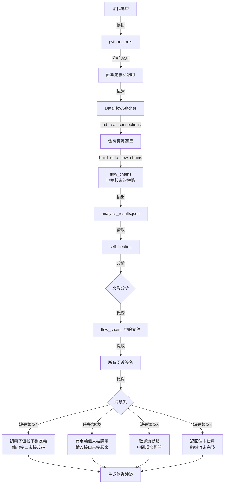

# AIVA Internal Exploration 設計理念釐清
## python_tools 與 self_healing 的正確關係

---

## ✅ 正確的設計理念

### 1. **python_tools** - 連接構建器
**目的：找到能夠連結的並接起來**

#### 核心功能
```python
# aiva_flow_analyzer.py
class DataFlowStitcher:
    """真正的數據流拼接器 - 基於腳本間的頭尾拼接"""
    
    def add_script(self, script_path: str):
        """分析腳本的頭尾特徵"""
        # 分析 import 關係
        # 分析函數定義和調用
        # 確定頭（入口點）：main, run, 未被調用的函數
        # 確定尾（輸出端）：所有定義的函數
    
    def find_real_connections(self):
        """找到真實的腳本間連接"""
        # 檢查外部調用
        # 找到提供函數的腳本
        # 發現真實連接：provider_script → consumer_script
    
    def build_data_flow_chains(self) -> list[list[str]]:
        """構建數據流鏈路 - 已經連接的部分"""
        # 輸出格式: 
        # [
        #   ['script_a.py', 'script_b.py', 'script_c.py'],
        #   ['script_x.py', 'script_y.py']
        # ]
```

#### 輸出產物
- `analysis_results.json`
  - `flow_chains`: 已經連接起來的腳本鏈路
  - `real_connections`: 實際的函數調用關係
  - `script_nodes`: 每個腳本的入口和出口函數

**關鍵點**：python_tools 只記錄**已經成功連接**的部分

---

### 2. **self_healing** - 缺失連接探測器
**目的：在能接起來的之外，了解有哪些輸出入的接口尚未接起來**

#### 核心功能

##### A. 讀取已連接的部分
```python
# analyze_dataflow_breakpoints.py
class DataFlowBreakpointAnalyzer:
    def _load_analysis_results(self):
        # 讀取 analysis_results.json
        # 獲取 flow_chains（python_tools 已接起來的部分）
        
    def build_flow_graph(self):
        """基於 flow_chains 構建圖"""
        flow_chains = self.analysis_data.get('flow_chains', [])
        
        # 這些是 python_tools 已經接起來的連接
        for chain in flow_chains:
            for i in range(len(chain) - 1):
                source = chain[i]
                target = chain[i + 1]
                self.graph[source].add(target)  # 記錄已連接的邊
```

##### B. 找出尚未連接的接口
```python
# analyze_missing_function_connections.py
class MissingConnectionAnalyzer:
    def extract_function_signatures(self):
        """從 flow_chains 涉及的所有文件中提取函數簽名"""
        flow_chains = self.analysis_data.get('flow_chains', [])
        all_files = set()
        for chain in flow_chains:
            all_files.update(chain)  # 獲取所有涉及的文件
        
        # 分析這些文件中的所有函數
        # 找出哪些函數被調用但找不到定義（缺失定義）
        # 找出哪些函數有定義但從未被調用（孤立函數）
    
    def find_missing_definitions(self):
        """調用了但找不到定義 = 接口尚未接起來"""
        for sig in self.function_signatures:
            for called_func in sig.calls_functions:
                if called_func not in self.functions_by_name:
                    # 這是一個尚未接起來的輸出接口
                    self.missing_connections.append(...)
    
    def find_orphaned_functions(self):
        """有定義但未被調用 = 接口尚未接起來"""
        for func_name, signatures in self.functions_by_name.items():
            if not any(sig.called_by for sig in signatures):
                # 這是一個尚未接起來的輸入接口
                self.missing_connections.append(...)
```

**關鍵點**：self_healing 分析的是**應該在 flow_chains 中但不在**的連接

---

## 📊 完整工作流程圖



---

## 🔍 detect_bottlenecks() 的重新理解

### 原始邏輯的問題
```python
# 錯誤的邏輯
def detect_bottlenecks(self):
    # 計算每個腳本的 fan-in/fan-out
    # 如果 fan-out 很高 → 標記為 "瓶頸"
    # 建議 "拆分或優化"
```

### 正確的理解
在 python_tools + self_healing 的框架下，`detect_bottlenecks()` **應該檢測的是**：

1. **高 fan-out 但連接不完整**
   ```python
   # 腳本 A 定義了 10 個函數（潛在的 10 個輸出接口）
   # 但在 flow_chains 中，只有 3 個函數被其他腳本調用
   # → 有 7 個輸出接口尚未接起來
   ```

2. **高 fan-in 但調用未實現**
   ```python
   # 腳本 B 被 10 個腳本 import
   # 但實際調用只發生在 4 個腳本中
   # → 有 6 個潛在連接尚未接起來
   ```

### 正確的 detect_bottlenecks() 應該做什麼

```python
def detect_bottlenecks(self):
    """檢測高連接度但連接不完整的節點"""
    
    for script in self.all_scripts:
        # 1. 計算潛在連接數（應該有多少連接）
        potential_outputs = count_exported_functions(script)
        potential_inputs = count_import_statements(script)
        
        # 2. 計算實際連接數（flow_chains 中有多少連接）
        actual_outputs = len(self.graph[script])
        actual_inputs = len(self.reverse_graph[script])
        
        # 3. 計算缺失連接
        missing_outputs = potential_outputs - actual_outputs
        missing_inputs = potential_inputs - actual_inputs
        
        # 4. 如果缺失比例高，這才是真正的問題
        if missing_outputs > potential_outputs * 0.5:
            issue = BreakpointIssue(
                issue_type="未完整連接的輸出接口",
                severity="warning",
                location=script,
                description=f"定義了 {potential_outputs} 個函數，但只有 {actual_outputs} 個被其他模組調用",
                suggested_fix="檢查是否有應該被調用但未被調用的函數"
            )
```

---

## 💡 設計理念總結

### python_tools（連接器）
- **職責**：主動建立連接
- **輸出**：已連接的數據流鏈路（flow_chains）
- **關鍵類**：
  - `DataFlowStitcher`: 腳本級連接
  - `SmartFlowStitcher`: 智能流程組合
  - `AIVAFlowAnalyzer`: 整合入口

### self_healing（缺失探測器）
- **職責**：發現未連接的接口
- **輸入**：python_tools 的 analysis_results.json
- **輸出**：缺失連接報告、修復建議
- **關鍵類**：
  - `DataFlowBreakpointAnalyzer`: 斷點檢測
  - `MissingConnectionAnalyzer`: 缺失連接分析
  - `PracticalAnalyzer`: 智能過濾

### 核心區別
| 維度 | python_tools | self_healing |
|------|--------------|--------------|
| **目標** | 接起來能接的 | 找出未接起來的 |
| **輸出** | flow_chains（已連接） | missing_connections（未連接） |
| **分析對象** | 真實的函數調用 | 潛在但缺失的調用 |
| **建議類型** | - | 應該建立的連接 |

---

## 🎯 修正方向

### 1. detect_bottlenecks() 需要改寫
- 不應該只看 fan-out 數量
- 應該比對**潛在連接 vs 實際連接**
- 重點在**缺失的連接**而非高連接度本身

### 2. 報告格式應該更清晰
```markdown
## 未完整連接的模組

### services/core/aiva_core/ai_core/rl_models.py

**潛在輸出**: 15 個函數  
**實際連接**: 5 個被調用  
**缺失連接**: 10 個函數未被使用

#### 未被調用的函數
- `train_model()` - 可能應該被 rl_trainers.py 調用
- `save_checkpoint()` - 可能應該被 checkpoint_manager.py 調用
- ...

#### 建議
1. 檢查這些函數是否應該被其他模組調用
2. 如果不需要，考慮移除或標記為內部函數
3. 如果需要，在對應模組中添加調用
```

### 3. MODULE_LOGIC_ANALYSIS.md 需要更新
- 強調 python_tools 是「主動連接者」
- 強調 self_healing 是「缺失發現者」
- 更新所有分析邏輯的解釋

---

## 📝 下一步行動

1. **修正 detect_bottlenecks()**
   - 重寫邏輯，比對潛在 vs 實際連接
   - 改變輸出格式，強調缺失的連接

2. **更新 MODULE_LOGIC_ANALYSIS.md**
   - 基於正確的設計理念重寫
   - 澄清各模組的真實職責

3. **改進報告生成**
   - 報告應該明確指出「應該連接但未連接」的部分
   - 提供可操作的修復建議

---

## ✅ 驗證理解

**提問給用戶**：
1. 這個理解是否正確？
2. detect_bottlenecks() 應該改成比對「潛在連接 vs 實際連接」嗎？
3. 需要我開始修正代碼嗎？
