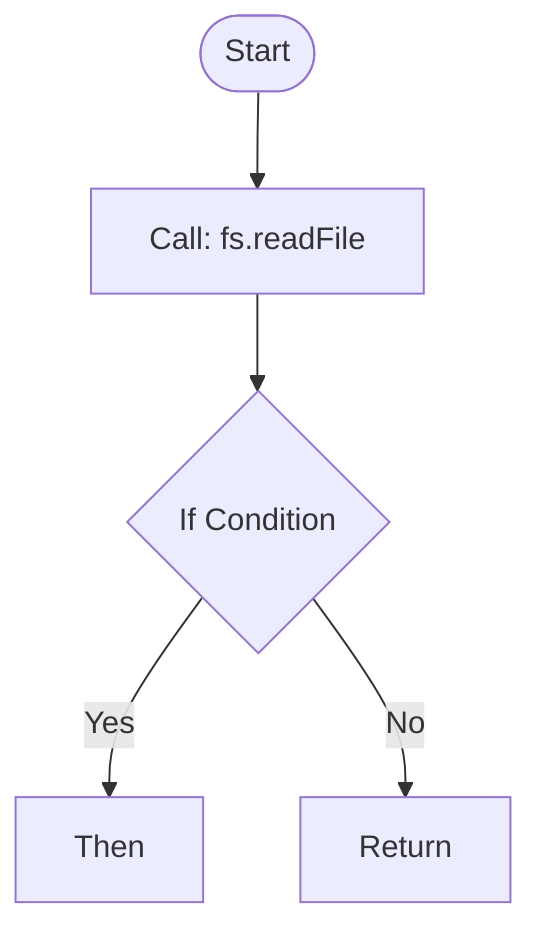

# AIVA TypeScript AST 分析工具

> **版本**: v3.0  
> **最後更新**: 2026-01-18  
> **狀態**: ✅ 生產就緒  
> **核心文件**: ts2mermaid.ts  
> **代碼行數**: 865 行  
> **執行方式**: npx ts-node ts2mermaid.ts

## 📑 目錄

- [📋 概述](#-概述)
- [🎯 設計定位](#-設計定位)
- [🚀 快速開始](#-快速開始)
- [📊 輸出格式](#-輸出格式)
- [🔧 與其他語言工具對比](#-與其他語言工具對比)
- [📝 使用注意事項](#-使用注意事項)
- [⚙️ 開發環境設置](#️-開發環境設置)
- [🤝 與 AIVA 核心整合](#-與-aiva-核心整合)
- [🐛 疑難排解](#-疑難排解)
- [📚 延伸閱讀](#-延伸閱讀)
- [📄 授權與維護](#-授權與維護)

---

## 📋 概述

**typescript_tools/** 是 AIVA 多語言 AST 分析工具套件的 TypeScript 語言實現，專注於 **TypeScript/JavaScript 代碼的 AST 解析與數據流分析**。

---

## 🎯 設計定位

根據 AIVA **雙 CLI 架構設計**，本工具專注於 **語言層** 的 AST 解析：

```
┌─────────────────────────────────────┐
│  語言工具層（AST 解析）            │
│  ├─ python_tools/                  │
│  ├─ go_tools/                      │
│  ├─ rust_tools/                    │
│  └─ typescript_tools/ ← 本工具     │
└─────────────────────────────────────┘
              ↓ 輸出 JSON
┌─────────────────────────────────────┐
│  業務邏輯層（分類與執行）          │
│  ├─ aiva_internal_classifier.py   │
│  ├─ aiva_internal_executor.py     │
│  ├─ aiva_external_classifier.py   │
│  └─ aiva_external_executor.py     │
└─────────────────────────────────────┘
```

**職責範圍**：
- ✅ TypeScript/JavaScript AST 解析
- ✅ 函數調用關係提取
- ✅ 數據流串接（Stitching）
- ✅ 輸出統一 JSON 格式（Schema v3.3）
- ❌ 不包含分類邏輯（由 aiva_external_classifier.py 負責）
- ❌ 不包含執行邏輯（由 aiva_external_executor.py 負責）

---

## 🚀 快速開始

### 1. 安裝依賴

```bash
cd C:\D\fold7\AIVA-git\services\core\aiva_core\internal_exploration\typescript_tools
npm install
```

### 2. 基本執行

```bash
# 分析當前目錄
npx ts-node ts2mermaid.ts --input=. --output=./output

# 分析指定專案目錄
npx ts-node ts2mermaid.ts --input=../../web --output=./web_analysis

# 使用 npm 腳本快速測試
npm run test
```

### 3. 參數格式

- `--input=<路徑>` - 輸入目錄,會遞迴掃描所有 .ts/.tsx 檔案
- `--output=<路徑>` - 輸出目錄,存放所有生成的檔案

---

## 📂 輸出檔案說明

執行後會在輸出目錄產生以下 4 類檔案:

### 1. 個別函數流程圖 (*.mmd)

- **命名格式**: `檔名_函數名.mmd`
- **範例**: `UserService.ts_UserService_login.mmd`
- **內容**: 單一函數的詳細控制流程圖(if/loop/return/call)

### 2. 系統架構圖 (system_flow.mmd)

跨檔案的全域數據流圖,顯示:
- 檔案間的函數呼叫關係
- 邊標籤顯示具體呼叫的函數名稱

### 3. 完整分析報告 (analysis_results.json)

JSON 格式的完整數據,包含:
```json
{
  "summary": {
    "total_files": 5,
    "total_funcs": 23,
    "real_connections": 8
  },
  "classification": { /* 分類結果 */ },
  "branch_analysis": { /* 瓶頸分析 */ },
  "flow_chains": [ /* 跨檔案連接詳細資訊 */ ],
  "functions": [ /* 所有函數 metadata */ ]
}
```

### 4. CLI 指令手冊 (cli_commands.sh)

自動產生的命令腳本,按分類列出所有函數的執行指令:
```bash
## Category: ANALYSIS
# [PLACEHOLDER] parseUserData in utils.ts
npx ts-node ts2mermaid.ts --file "utils.ts" --func "parseUserData"
```

**重要說明**:
- 註解中的 `[PLACEHOLDER]` 標記表示功能描述預留位置
- 實際描述需要由 **大語言模型 (LLM)** 分析程式碼後填入
- 工具只負責提取函數結構，語義理解由 LLM 完成

---

## 🔍 核心功能詳解

### Part 1: AST 解析器 (Builder)

**支援的語法結構:**
- Function Declaration: `function foo() {}`
- Class Method: `class User { login() {} }`
- Arrow Function: `const bar = () => {}`
- Async/Await
- If/Else 分支
- For/While 迴圈
- Return 語句
- 函數呼叫 (Call Expression)

**輸出格式:**


### Part 2: 跨檔案串接器 (Stitcher)

**自動串接策略 (優先順序遞減):**

1. **Import 路徑解析**
   ```typescript
   import { login } from './auth';  // 嚴格路徑匹配
   auth.login();  // → 找到 ./auth.ts 中的 login
   ```

2. **模組別名模糊匹配**
   ```typescript
   user.save();  // → 搜尋檔名包含 'user' 的檔案
   ```

3. **全域函數搜尋**
   - 在所有檔案中尋找符合的函數定義

**副檔名自動補全:**
- 支援 `.ts`, `.tsx`, `.js`, `.jsx`, `/index.ts`

### Part 3: 自動分類器 (Classifier)

**分類規則 (基於函數名關鍵字):**

| 類別 | 關鍵字 | 用途 |
|------|--------|------|
| reconnaissance | scan, detect | 偵察探測 |
| exploitation | exploit, attack | 攻擊利用 |
| analysis | analyze, parse | 數據分析 |
| reporting | report, generate | 報告生成 |
| persistence | store, save, db | 資料持久化 |
| other | (其他) | 未分類功能 |

### Part 4: 瓶頸分析 (Branch Analysis)

**Fan-Out / Fan-In 檢測:**
- **高 Fan-Out (>2)**: 該檔案呼叫多個其他檔案 → 可能是核心調度器
- **高 Fan-In (>2)**: 多個檔案呼叫該檔案 → 可能是共用服務

輸出範例:
```json
{
  "fan_out_nodes": { "orchestrator.ts": 5 },
  "fan_in_nodes": { "database.ts": 4 }
}
```

---

## 💡 實際應用場景

### 場景 1: 重構前的依賴分析

**需求**: 修改 `auth.ts` 前,想知道有哪些模組會受影響

```bash
npx ts-node ts2mermaid.ts --input=./src --output=./refactor_check
```

查看 `system_flow.mmd` 中所有指向 `auth.ts` 的箭頭

### 場景 2: 新人 Onboarding

**需求**: 快速理解專案架構和關鍵流程

```bash
npm run analyze:full
```

1. 先看 `system_flow.mmd` 了解整體架構
2. 再看 `analysis_results.json` 的分類統計
3. 針對關鍵函數查看個別 .mmd 圖

### 場景 3: 程式碼審查

**需求**: 檢查某個 PR 的控制流程是否合理

```bash
npx ts-node ts2mermaid.ts --input=./feature_branch --output=./code_review
```

對比 `cli_commands.sh` 中各函數的分類是否符合預期

---

## 🔧 進階技巧

### 1. 過濾特定檔案類型

修改 `getAllFiles()` 函數:
```typescript
if (fullPath.endsWith('.ts') && !fullPath.includes('.spec.ts')) {
    files.push(fullPath);
}
```

### 2. 自訂分類規則

修改 `Classifier.classify()`:
```typescript
if (name.includes("validate")) cat = "validation";
```

### 3. 整合 CI/CD

```yaml
# .github/workflows/analysis.yml
- name: Run TypeScript Analysis
  run: |
    cd typescript_tools
    npm install
    npm run analyze
    # 上傳 analysis_results.json 作為 artifact
```

---

## 📊 與其他語言工具對比

| 特性 | Python | Go | Rust | TypeScript |
|------|--------|----|----- |------------|
| 單檔案分析 | ✅ | ✅ | ✅ | ✅ |
| 跨檔案串接 | ✅ | ✅ | ✅ | ✅ |
| 自動分類 | ✅ | ✅ | ✅ | ✅ |
| CLI 生成 | ✅ | ✅ | ✅ | ✅ |
| 瓶頸分析 | ✅ | ✅ | ✅ | ✅ |
| 執行速度 | 基準 | 快速 | 最快 | 快速 |
| Class Method 支援 | ✅ | 有限 | ✅ | ✅ |
| Async/Await 支援 | ✅ | N/A | ✅ | ✅ |

**效能參考 (100 檔案專案):**
- Rust: ~0.3s
- Go: ~0.8s
- TypeScript: ~2.5s (含 ts-node 啟動時間)
- Python: ~45s

---

## 🐛 疑難排解

### 問題 1: 找不到 typescript 模組

**錯誤訊息:**
```
Error: Cannot find module 'typescript'
```

**解決方案:**
```bash
npm install typescript ts-node @types/node --save-dev
```

### 問題 2: 跨檔案連接數為 0

**可能原因:**
- Import 路徑不正確
- 函數名稱不匹配
- 檔案未被掃描到

**除錯步驟:**
1. 檢查 `analysis_results.json` 中的 `functions` 陣列,確認函數是否被正確識別
2. 查看 console 輸出的 "發現 X 個 TypeScript 檔案"
3. 手動檢查 import 語句是否使用相對路徑

### 問題 3: 記憶體不足 (大型專案)

**優化方案:**
```bash
# 增加 Node.js heap size
node --max-old-space-size=4096 node_modules/.bin/ts-node ts2mermaid.ts --input=./huge_project
```

### 問題 4: 權限錯誤

**Windows:**
```powershell
# 以管理員身份執行
Set-ExecutionPolicy -Scope CurrentUser -ExecutionPolicy RemoteSigned
```

### 問題 5: 解析失敗

**常見情況:**
- TypeScript 版本不相容
- 使用了實驗性語法

**解決:**
```bash
# 升級 TypeScript 到最新版
npm install typescript@latest
```

---

## 📚 TypeScript 特有功能

### 1. Interface 與 Type

工具會忽略純 type/interface 宣告,僅分析可執行程式碼

### 2. Decorator 支援

```typescript
@log
class Service {
  @validate
  process() {} // 會被識別為 Service.process
}
```

### 3. Namespace 處理

```typescript
namespace Utils {
  export function helper() {} // 識別為 Utils.helper
}
```

### 4. Generic 函數

```typescript
function map<T>(arr: T[]) {} // 識別為 map (忽略泛型參數)
```

---

## 🔄 版本歷史

### v2.0.0 (當前版本)
- ✅ 完整功能對等 Python/Go/Rust
- ✅ 6 大模組整合為單一檔案
- ✅ 支援 Arrow Function 和 Async/Await
- ✅ 優化 Import 解析算法
- ✅ 新增瓶頸分析功能

### v1.0.0 (已棄用)
- 分離式架構 (4 個檔案)
- 功能不完整

---

## 🤝 與 AIVA 核心整合

### 搭配 aiva_common 規範

1. **命名規範**: 遵循 aiva_common README 中的函數命名標準
2. **複雜度控制**: 圖形節點數 >20 時建議重構
3. **文檔同步**: 將生成的 .mmd 檔案納入專案文檔

### 自動化流程

```bash
# 在 AIVA 專案根目錄
cd services/core/aiva_core/internal_exploration/typescript_tools
npm run analyze:full

# 結果會產生在 ./full_analysis/
# 可將 system_flow.mmd 複製到專案 docs/ 目錄
```

---

## 📞 技術支援

**問題回報:**
- 檢查 GitHub Issues
- 查看 `_STATIC_ANALYSIS_REPORT.md`

**效能優化建議:**
- 大型專案 (>500 檔案): 考慮使用 Rust 版本
- 中型專案 (100-500): TypeScript/Go 版本皆可
- 小型專案 (<100): 任何版本

**擴充開發:**
- 新增分類規則: 修改 `Classifier.classify()`
- 自訂輸出格式: 修改 `Graph.toMermaid()`
- 新增語法支援: 擴充 `Builder.visitNode()`

---

## 📖 延伸閱讀

- [Mermaid 官方文檔](https://mermaid.js.org/)
- [TypeScript Compiler API](https://github.com/Microsoft/TypeScript/wiki/Using-the-Compiler-API)
- AIVA 其他語言工具:
  - Python: `python_tools/README.md`
  - Go: `go_tools/README.md`
  - Rust: `rust_tools/README.md`

---

**最後更新**: 2025-12-11  
**維護者**: AIVA Team  
**授權**: MIT
