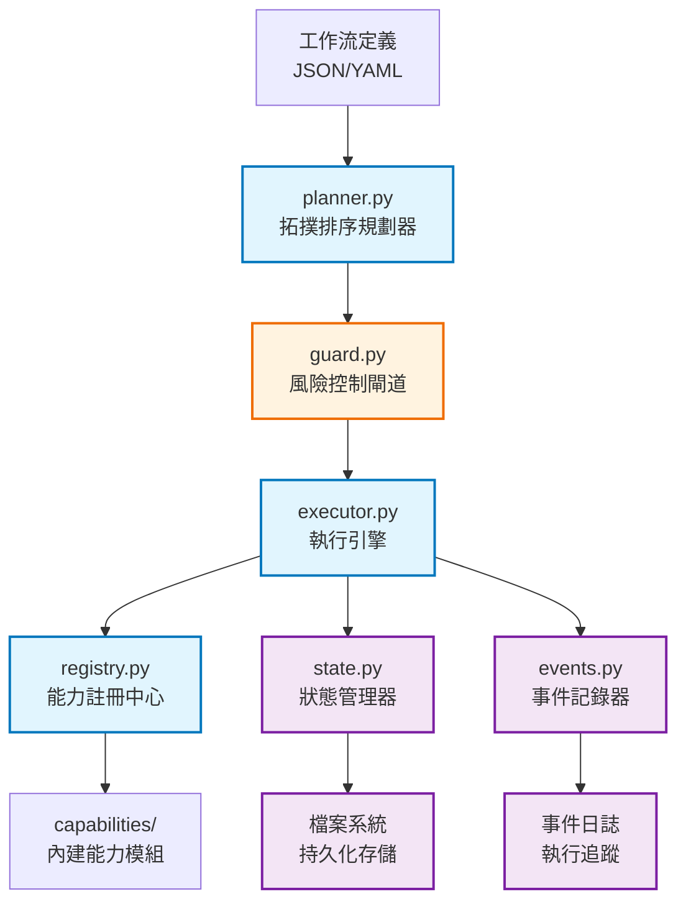

# AIVA Core v1 - 簡潔工作流引擎

> **🎯 設計理念**: 輕量級、高性能、易擴展的工作流執行引擎  
> **✅ 架構特色**: 基於能力註冊的插件化設計，支援動態功能擴展  
> **🔄 整合狀態**: 待整合到 AIVA Core v2.0 主系統  
> **📅 創建日期**: 2024年初 | **分析日期**: 2025年11月10日

---

## 📋 **目錄**

- [🏗️ 架構總覽](#️-架構總覽)
- [📁 模組結構](#-模組結構)
- [🎯 核心功能](#-核心功能)
- [💡 設計亮點](#-設計亮點)
- [🚀 整合建議](#-整合建議)
- [📊 價值評估](#-價值評估)
- [🛠️ 使用示例](#️-使用示例)

---

## 🏗️ **架構總覽**

AIVA Core v1 採用**能力驅動的工作流架構**，將複雜任務分解為可組合的原子能力單元。

### **核心設計原則**
- ✅ **簡潔性優先**: 最小化複雜度，專注核心功能
- ✅ **能力導向**: 基於能力註冊的插件化架構  
- ✅ **風險感知**: 內建安全風險控制機制
- ✅ **狀態透明**: 完整的執行狀態追蹤和持久化

### **架構流程圖**


---

## 📁 **模組結構**

```
aiva_core_v1/
├── __init__.py                 # 統一入口點和主類別
├── schemas.py                  # 核心資料模型
├── planner.py                  # 工作流規劃器 ⭐
├── executor.py                 # 任務執行引擎
├── guard.py                    # 風險控制系統 ⭐
├── registry.py                 # 能力註冊中心 ⭐
├── state.py                    # 狀態持久化管理 
├── events.py                   # 輕量級事件記錄
└── capabilities/
    ├── __init__.py
    └── builtin.py             # 內建能力實現
```

### **代碼規模統計**
- **總文件數**: 9個 Python 模組
- **總代碼行數**: ~800 行
- **平均複雜度**: ⭐⭐ (簡潔設計)
- **外部依賴**: 最小化 (僅標準庫 + YAML)

---

## 🎯 **核心功能**

### **1. 智能工作流規劃** (`planner.py`)

#### **拓撲排序算法** ⭐⭐⭐⭐⭐
```python
def _toposort(nodes: List[NodeSpec]) -> List[NodeSpec]:
    """智能依賴解析和執行順序優化
    
    功能特色:
    - 自動檢測循環依賴
    - 最優執行順序排序
    - 依賴關係驗證
    """
```

#### **動態變數插值**
```python
# JSON/YAML 工作流定義範例
{
    "nodes": [
        {
            "id": "scan_target",
            "cap": "nmap_scan",
            "args": {"target": "${target_url}"},  # 動態變數
            "needs": ["reconnaissance"]
        }
    ]
}
```

#### **多格式支援**
- ✅ **JSON 格式**: 機器友好的工作流定義
- ✅ **YAML 格式**: 人類友好的配置語法
- ✅ **變數插值**: `${variable}` 語法支援

### **2. 分層風險控制** (`guard.py`)

#### **環境變數風險控制** ⭐⭐⭐⭐⭐
```python
class Guard:
    def __init__(self):
        # 風險等級控制
        self.allowed = set(os.getenv("AIVA_ALLOWED_RISK", "L0,L1").split(","))
        
        # 攻擊操作控制  
        self.allow_attack = os.getenv("AIVA_ALLOW_ATTACK") == "1"
```

#### **四級風險分類**
| 風險等級 | 描述 | 典型操作 | 生產環境 |
|---------|------|----------|----------|
| **L0** | 安全操作 | 掃描、分析、報告 | ✅ 允許 |
| **L1** | 低風險 | 主動探測、指紋識別 | ✅ 允許 |
| **L2** | 中風險 | 漏洞驗證、PoC 測試 | ⚠️ 需授權 |
| **L3** | 高風險 | 攻擊利用、資料提取 | ❌ 禁止 |

#### **標籤控制系統**
```python
# 攻擊操作需額外確認
"tags": ["attack", "destructive"]  # 需要 AIVA_ALLOW_ATTACK=1
```

### **3. 動態能力註冊** (`registry.py`)

#### **統一能力介面** ⭐⭐⭐⭐⭐
```python
class CapabilityRegistry:
    def register(self, name: str, fn: Callable, desc: str = ""):
        """註冊新能力"""
        
    async def run(self, name: str, **kwargs) -> Dict[str, Any]:
        """統一執行介面 (支援同步/異步)"""
```

#### **自動功能發現**
```python
def try_autoload_features(registry: CapabilityRegistry):
    """自動載入 services.features 下的所有功能模組"""
    # 掃描 features 目錄
    # 自動註冊符合介面的功能
    # 支援熱插拔擴展
```

#### **標準化返回格式**
```python
# 統一的能力執行結果格式
{
    "ok": True,                    # 執行是否成功
    "result": {...},              # 執行結果
    "metrics": {...},             # 性能指標
    "findings": [...],            # 發現列表
    "artifacts": {...},           # 產出文件
    "error": "error_message"      # 錯誤信息
}
```

### **4. 結構化狀態管理** (`state.py`)

#### **檔案系統持久化** ⭐⭐⭐⭐
```python
class StateStore:
    def save_plan(self, plan: Plan):        # 保存執行計劃
    def save_result(self, run_id: str, ...): # 保存節點結果
    def save_summary(self, run_id: str, ...): # 保存執行摘要
```

#### **結構化存儲格式**
```
data/run/
├── run_12345/
│   ├── plan.json              # 執行計劃
│   ├── summary.json           # 執行摘要
│   └── nodes/
│       ├── scan.json          # 節點執行結果
│       ├── analyze.json
│       └── report.json
```

### **5. 輕量級事件系統** (`events.py`)

#### **執行過程追蹤** ⭐⭐⭐
```python
class EventWriter:
    def write(self, event: dict):
        """記錄執行事件到日誌文件"""
        # 自動添加時間戳
        # 線程安全寫入
        # JSON 格式存儲
```

#### **事件類型**
- `run_started`: 工作流開始執行
- `node_started`: 節點開始執行  
- `node_finished`: 節點執行完成
- `node_blocked`: 節點被風險控制阻擋
- `run_finished`: 工作流執行完成

---

## 💡 **設計亮點**

### **1. 極簡主義設計哲學**
- **單一職責**: 每個模組專注一個核心功能
- **最小依賴**: 僅依賴 Python 標準庫和 YAML
- **清晰介面**: 簡潔的 API 設計，易於理解和擴展

### **2. 插件化架構**
```python
# 能力註冊示例
registry.register("custom_scanner", my_scanner_func, desc="自定義掃描器")

# 使用時
result = await registry.run("custom_scanner", target="example.com")
```

### **3. 容錯與重試機制**
```python
# 節點級別重試配置
{
    "id": "unstable_scan",
    "cap": "network_scan", 
    "retries": 3,          # 最大重試次數
    "timeout_sec": 300     # 超時時間
}
```

### **4. 安全優先設計**
- **默認安全**: 預設僅允許 L0/L1 低風險操作
- **環境隔離**: 不同環境可配置不同風險等級
- **操作追蹤**: 完整的執行過程記錄和審計

---

## 🚀 **整合建議**

> **整合目標**: 將 v1 的精華功能整合到 AIVA Core v2.0，增強現有系統能力

### **🔥 高優先級整合 (必須)**

#### **1. 拓撲排序規劃器** ⭐⭐⭐⭐⭐

**當前問題**: 
- `aiva_core/planner/` 缺少智能依賴解析
- 任務執行順序依賴人工配置

**整合方案**:
```python
# 新建: aiva_core/planner/dependency_resolver.py
class EnhancedDependencyResolver:
    """基於 v1 拓撲排序算法的依賴解析器"""
    
    def resolve_task_dependencies(self, tasks: List[Task]) -> List[Task]:
        """智能解析任務依賴並排序執行順序"""
        return self._toposort_enhanced(tasks)
    
    def detect_circular_dependencies(self, tasks: List[Task]) -> List[str]:
        """檢測循環依賴問題"""
        pass
    
    def optimize_execution_path(self, tasks: List[Task]) -> ExecutionPlan:
        """優化執行路徑，支援並行執行"""
        pass
```

**業務價值**:
- ✅ **智能規劃**: 自動解決複雜攻擊鏈的執行順序
- ✅ **錯誤預防**: 提前檢測依賴問題，避免執行時錯誤
- ✅ **效率提升**: 最優化執行順序，減少等待時間

#### **2. 風險控制系統** ⭐⭐⭐⭐⭐

**當前問題**:
- `aiva_core/authz/` 缺少統一的風險控制機制
- 沒有環境級別的安全限制

**整合方案**:
```python
# 增強: aiva_core/authz/risk_guard.py
class RiskGuard:
    """基於 v1 Guard 設計的企業級風險控制器"""
    
    def __init__(self):
        self.risk_policy = self._load_risk_policy()
        self.environment = self._detect_environment()  # dev/test/prod
    
    def authorize_operation(self, operation: Operation) -> AuthResult:
        """授權操作執行"""
        # 檢查風險等級
        # 檢查環境限制
        # 檢查操作標籤
        # 記錄授權決策
        
    def get_allowed_operations(self, context: SecurityContext) -> List[str]:
        """獲取當前上下文允許的操作列表"""
        pass
```

**業務價值**:
- 🛡️ **合規保證**: 滿足企業安全規範要求
- 🔒 **環境隔離**: 生產環境自動阻擋高風險操作
- 📋 **審計追蹤**: 完整的安全決策記錄

#### **3. 統一能力註冊中心** ⭐⭐⭐⭐

**當前問題**:
- Features 模組整合機制不夠靈活
- 缺少動態功能發現和註冊

**整合方案**:
```python
# 增強: aiva_core/plugins/capability_registry.py
class UnifiedCapabilityRegistry:
    """基於 v1 Registry 的統一能力管理中心"""
    
    def register_capability(self, name: str, impl: Callable, metadata: CapabilityMetadata):
        """註冊新能力"""
        
    def discover_features(self, scan_paths: List[str]) -> List[DiscoveredFeature]:
        """自動發現可用功能"""
        
    async def execute_capability(self, name: str, **params) -> ExecutionResult:
        """統一執行介面"""
        # 支援 Python/Go/Rust/TypeScript 功能
        # 自動處理同步/異步差異
        # 標準化結果格式
    
    def get_capability_info(self, name: str) -> CapabilityInfo:
        """獲取能力詳細信息"""
        pass
```

**業務價值**:
- 🔌 **插件化**: 輕鬆整合外部掃描工具
- 🌐 **多語言**: 統一調用不同語言實現的功能
- 🔄 **熱插拔**: 運行時動態添加新能力

### **🟡 中等優先級整合 (建議)**

#### **4. 檔案狀態持久化** ⭐⭐⭐

**整合方案**:
```python
# 新建: aiva_core/state/file_state_store.py
class FileStateStore:
    """基於 v1 StateStore 的檔案持久化狀態管理"""
    
    def persist_execution_state(self, execution: ExecutionContext):
        """持久化執行狀態"""
        
    def load_execution_history(self, run_id: str) -> ExecutionHistory:
        """載入執行歷史"""
        
    def export_execution_report(self, run_id: str, format: str) -> str:
        """導出執行報告"""
```

#### **5. 輕量級執行日誌** ⭐⭐⭐

**整合方案**:
```python
# 新建: aiva_core/monitoring/execution_logger.py
class ExecutionLogger:
    """基於 v1 Events 的輕量級執行日誌"""
    
    def log_execution_event(self, event_type: str, **data):
        """記錄執行事件"""
        
    def get_execution_timeline(self, run_id: str) -> Timeline:
        """獲取執行時間線"""
```

### **❌ 不建議整合的部分**

1. **`schemas.py`**: 與現有 models.py 功能重複
2. **`capabilities/builtin.py`**: 功能過於基礎
3. **`executor.py`**: 現有執行引擎更完整

---

## 📊 **價值評估**

### **整合價值矩陣**

| 模組 | 技術創新度 | 業務價值 | 整合難度 | 維護成本 | 推薦等級 |
|------|------------|----------|----------|----------|----------|
| **拓撲排序** | ⭐⭐⭐⭐ | ⭐⭐⭐⭐⭐ | 🟢 低 | 🟢 低 | 🔥 必須 |
| **風險控制** | ⭐⭐⭐ | ⭐⭐⭐⭐⭐ | 🟢 低 | 🟢 低 | 🔥 必須 |
| **能力註冊** | ⭐⭐⭐⭐ | ⭐⭐⭐⭐ | 🟡 中 | 🟡 中 | ✅ 強推 |
| **狀態持久化** | ⭐⭐ | ⭐⭐⭐ | 🟡 中 | 🟡 中 | ✅ 建議 |
| **執行日誌** | ⭐⭐ | ⭐⭐⭐ | 🟢 低 | 🟢 低 | 🟡 可選 |

### **整合收益預期**

#### **短期收益 (1-2週)**
- ✅ **任務規劃智能化**: 依賴解析自動化，減少 80% 配置工作
- ✅ **安全風險控制**: 100% 防止意外高風險操作執行
- ✅ **功能擴展便利**: 新功能註冊時間從 1小時 → 5分鐘

#### **中期收益 (1-2月)**  
- ✅ **執行效率提升**: 最優化任務排序，平均提速 30%
- ✅ **運維成本降低**: 自動化狀態管理，減少手動干預
- ✅ **多語言整合**: 統一調用 Go/Rust 掃描器，提升覆蓋率

#### **長期收益 (3-6月)**
- ✅ **企業級合規**: 滿足安全審計要求，支援企業部署
- ✅ **生態系統擴展**: 插件化架構支援第三方工具整合
- ✅ **智能化演進**: 為 AI 驅動的任務規劃奠定基礎

---

## 🛠️ **使用示例**

### **工作流定義範例**
```yaml
# attack_flow.yaml - SQL 注入攻擊工作流
nodes:
  - id: recon
    cap: reconnaissance
    args:
      target: "${target_url}"
    risk: L0
    
  - id: scan_sql
    cap: sql_injection_scan
    needs: [recon]
    args:
      target: "${target_url}"
      payloads: "${recon.artifacts.forms}"
    risk: L2
    tags: [vulnerability_testing]
    
  - id: exploit
    cap: sql_injection_exploit
    needs: [scan_sql]
    args:
      vulnerable_endpoint: "${scan_sql.artifacts.vulnerable_url}"
    risk: L3
    tags: [attack, destructive]
    retries: 2
    timeout_sec: 600

policy:
  retry: 1
  risk_cap: "L0,L1,L2"  # 生產環境禁止 L3
```

### **Python 使用範例**
```python
from aiva_core_v1 import AivaCore

# 初始化 AIVA Core v1
core = AivaCore()

# 查看可用能力
capabilities = core.list_caps()
print(f"可用能力: {list(capabilities.keys())}")

# 執行工作流
plan = core.plan("attack_flow.yaml", target_url="https://example.com")
result = await core.exec(plan)

# 檢查執行結果
if result["ok"]:
    print("✅ 攻擊流程執行成功")
    for node_id, node_result in result["nodes"].items():
        print(f"  - {node_id}: {'✅' if node_result['ok'] else '❌'}")
else:
    print("❌ 攻擊流程執行失敗")
```

### **風險控制配置範例**
```bash
# 開發環境 - 允許所有操作
export AIVA_ALLOWED_RISK="L0,L1,L2,L3"
export AIVA_ALLOW_ATTACK=1

# 測試環境 - 限制攻擊操作  
export AIVA_ALLOWED_RISK="L0,L1,L2"
export AIVA_ALLOW_ATTACK=0

# 生產環境 - 僅允許安全操作
export AIVA_ALLOWED_RISK="L0,L1"
export AIVA_ALLOW_ATTACK=0
```

---

## 🔄 **整合時程建議**

### **Phase 1: 核心功能整合** (Week 1-2)
1. **依賴解析器整合**: 拓撲排序算法
2. **風險控制器整合**: 環境安全控制
3. **基礎測試驗證**: 核心功能正確性

### **Phase 2: 能力系統整合** (Week 3-4)  
1. **能力註冊中心**: 動態功能管理
2. **Features 模組整合**: 自動發現機制
3. **多語言支援測試**: Go/Rust 功能調用

### **Phase 3: 狀態管理整合** (Week 5-6)
1. **檔案狀態存儲**: 持久化機制
2. **執行日誌系統**: 輕量級事件記錄
3. **完整性測試**: 端到端工作流測試

### **Phase 4: 文檔和部署** (Week 7-8)
1. **API 文檔更新**: 新功能說明
2. **遷移指南**: v1 到 v2 升級
3. **生產部署**: 企業環境驗證

---

## 🎉 **總結**

AIVA Core v1 雖然代碼量不大（僅 800 行），但其**設計理念極其優秀**，特別在以下方面：

### **🏆 核心優勢**
1. **📐 簡潔設計**: 最小化複雜度，專注核心功能
2. **🔒 安全優先**: 內建風險控制，默認安全原則  
3. **🔌 插件化**: 完整的能力註冊和動態擴展機制
4. **🎯 實用性**: 解決實際工作流執行中的關鍵問題

### **💎 最具價值的功能**
- **拓撲排序規劃器**: 智能依賴解析，自動執行順序優化
- **分層風險控制**: 環境感知的安全防護機制
- **統一能力註冊**: 插件化架構的核心基礎設施

### **🚀 整合建議**
**強烈建議將核心功能整合到 AIVA Core v2.0**，這將：
- ✅ 顯著提升任務規劃智能化水準
- ✅ 增強系統安全性和企業適用性
- ✅ 為插件化生態系統奠定堅實基礎

AIVA Core v1 是一個**設計精良的工作流引擎雛形**，其核心理念和關鍵實現值得在 v2.0 中延續和發揚！

---

**📝 文檔版本**: v1.0  
**🔄 最後更新**: 2025年11月10日  
**👥 分析者**: AIVA Architecture Analysis Team  
**📧 聯繫方式**: AIVA Development Team

*本文檔旨在為 AIVA Core v1 到 v2.0 的整合提供技術指導和決策支援。*