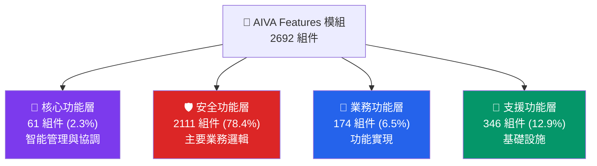

# AIVA Features 模組 - 多語言安全功能架構

**導航**: [← 返回 Services 總覽](../README.md) | [📖 文檔中心](../../docs/README.md)

> **🎯 Bug Bounty 專業化 v6.1**: 多語言安全功能集，專精漏洞檢測與攻擊驗證  
> **✅ 系統狀態**: 7大功能模組就緒，Python+Go+Rust 混合架構  
> **🔄 最後更新**: 2025年11月13日

---

## 📑 目錄

- [🔧 修復規範](#修復規範)
- [🔗 功能模組導航](#功能模組導航)
  - [📚 核心功能模組](#核心功能模組)
    - [✅ 完整實現](#完整實現)
    - [🔹 部分實現](#部分實現)
  - [🎯 專業工具模組](#專業工具模組)
  - [🌐 多語言架構支援](#多語言架構支援)
- [📊 模組統計](#模組統計)
- [🛠️ 開發指南](#開發指南)
  - [🚀 快速開始](#快速開始)
  - [🔧 開發環境設定](#開發環境設定)
  - [📝 程式碼規範](#程式碼規範)
- [🧪 測試](#測試)
  - [單元測試](#單元測試)
  - [整合測試](#整合測試)
  - [性能測試](#性能測試)
- [📚 文檔資源](#文檔資源)
- [🐛 問題回報](#問題回報)
- [🤝 貢獻指南](#貢獻指南)

---

## 🔧 **修復規範**

**保留未使用函數原則**: 在程式碼修復過程中，若發現有定義但尚未使用的函數或方法，只要不影響程式正常運作，建議予以保留。這些函數可能是：
- 預留的 API 端點或介面
- 未來功能的基礎架構
- 測試或除錯用途的輔助函數
- 向下相容性考量的舊版介面

說不定未來會用到，保持程式碼的擴展性和靈活性。

---

## 🔗 **功能模組導航** (實際存在模組)

### 📚 **核心功能模組** (實際已實現)

#### ✅ **完整實現** (5個模組)
- ⚡️ **[SQL注入檢測](function_sqli/README.md)** - 完整的SQL注入漏洞檢測 (20個Python文件，含6個檢測引擎)
- 🎭 **[XSS檢測](function_xss/README.md)** - 跨站腳本攻擊檢測 (10個Python文件，含DOM/存儲型/反射型)
- 🌐 **[SSRF檢測](function_ssrf/README.md)** - 服務端請求偽造檢測 (12個Python文件，含內網探測)
- 🔐 **[IDOR檢測](function_idor/README.md)** - 不安全直接對象引用檢測 (12個Python文件，含權限升級測試)
- 🔑 **[認證檢測](function_authn_go/README.md)** - Go語言認證繞過檢測 (5個Go文件，高性能實現)

#### 🔹 **部分實現** (2個模組)  
- 🔒 **[密碼學檢測](function_crypto/README.md)** - 密碼學漏洞檢測 (8個文件，Python+Rust混合架構)
- ⚡ **[後滲透](function_postex/README.md)** - 滲透後利用模組 (9個Python文件，含橫向/持久化引擎)

#### 🛠️ **支援組件** (1個模組)
- 💼 **[共用組件](common/README.md)** - 跨語言共用功能 (12個文件，Go/Python混合)

### 🎯 **系統管理模組**
- 💎 **[高價值管理器](high_value_manager.py)** - 高價值目標識別與管理
- 🧠 **[智能檢測管理器](smart_detection_manager.py)** - 智能檢測策略協調
- ⚙️ **[功能步驟執行器](feature_step_executor.py)** - 功能執行流程控制

### 📊 **模組完成度統計** (根據實際檔案統計)

| 模組名稱 | 語言 | 實際文件數 | 實現程度 | 主要功能 |
|----------|------|-----------|----------|----------|
| function_sqli | Python | 20 | ✅ 95% | SQL注入檢測 (含多種檢測引擎) |
| function_xss | Python | 10 | ✅ 90% | XSS漏洞檢測 (含DOM/存儲型) |
| function_ssrf | Python | 12 | ✅ 90% | SSRF檢測 (含內網探測) |
| function_idor | Python | 12 | ✅ 85% | 權限繞過檢測 (含垂直/水平測試) |
| function_authn_go | Go | 5 | ✅ 100% | 認證繞過檢測 (Go高性能) |
| function_crypto | Python/Rust | 8 | 🔹 40% | 密碼學漏洞 (含Rust核心) |
| function_postex | Python | 9 | 🔹 30% | 滲透後利用 (含橫向/持久化) |
| common | Go/Python | 12 | ✅ 90% | 共用組件 (統計/配置) |

---

> **🎯 快速導航**: 選擇您的角色和需求，找到最適合的文件
> 
> - 👨‍💼 **架構師/PM**: 閱讀 [功能架構總覽](#功能架構總覽)
> - 🐍 **Python 開發者**: 查看 [Python 開發指南](docs/README_PYTHON.md)
> - 🐹 **Go 開發者**: 查看 [Go 開發指南](docs/README_GO.md)  
> - 🦀 **Rust 開發者**: 查看 [Rust 開發指南](docs/README_RUST.md)
> - 🛡️ **安全專家**: 查看 [安全功能詳解](docs/README_SECURITY.md)
> - 🔧 **運維/DevOps**: 查看 [支援功能指南](docs/README_SUPPORT.md)

---

## 📑 目錄

- [🛠️ Features 模組開發工具](#️-features-模組開發工具)
- [📊 模組規模一覽](#-模組規模一覽)
- [🏗️ 功能架構總覽](#️-功能架構總覽)
  - [四層功能架構](#四層功能架構)
  - [🎯 各層核心職責](#-各層核心職責)
- [📚 文件導航地圖](#-文件導航地圖)
- [🚀 快速開始指南](#-快速開始指南)
- [⚠️ 重要注意事項](#️-重要注意事項)
- [🔧 開發規範與最佳實踐](#-開發規範與最佳實踐)
- [🔴 核心功能層](#-核心功能層)
- [🛡️ 安全功能層](#️-安全功能層)
- [🏢 業務功能層](#-業務功能層)
- [🔧 支援功能層](#-支援功能層)

---

## �🛠️ Features 模組開發工具

> **多語言開發環境**: 本模組整合 Python, Go, Rust 三種語言，需要對應的開發工具

| 語言 | 必備插件 | 開發用途 | 工具連結 |
|------|---------|---------|---------|
| 🐍 **Python** | Pylance + Ruff + Black | 型別檢查、快速 linting、格式化 | [Python 工具 (22個)](../../_out/VSCODE_EXTENSIONS_INVENTORY.md#-1-python-開發生態-22-個) |
| 🐹 **Go** | golang.go (0.50.0) | gopls、除錯、測試、格式化 | [Go 工具](../../_out/VSCODE_EXTENSIONS_INVENTORY.md#-3-其他程式語言-5-個) |
| 🦀 **Rust** | rust-analyzer (0.3.2593) | 語言伺服器、Cargo 整合、除錯 | [Rust 工具](../../_out/VSCODE_EXTENSIONS_INVENTORY.md#-3-其他程式語言-5-個) |

### 跨語言開發推薦工具

| 功能需求 | 推薦插件 | 說明 |
|---------|---------|------|
| 🛡️ **安全掃描** | SonarLint (4.33.0) | 支援 Python/Go，靜態安全分析 |
| 🤖 **AI 程式碼助手** | GitHub Copilot + ChatGPT | 多語言程式碼生成與解釋 |
| 🔍 **程式碼品質** | ErrorLens + Code Spell Checker | 即時錯誤提示、拼寫檢查 |
| 🐳 **容器開發** | Docker + Dev Containers | Rust/Go 編譯環境容器化 |
| 📊 **效能分析** | Code Runner | 快速執行程式碼片段測試 |

📚 **完整工具清單**: [VS Code 插件參考](../../_out/VSCODE_EXTENSIONS_INVENTORY.md) (88個插件)

### 💡 語言特定快速技巧

**Python (87.0% 組件)**:
- 使用 Ruff 進行超快速 linting（比 pylint 快 10-100 倍）
- Black 自動格式化：`Ctrl+Shift+I`
- 查看 [Python 最佳實踐](../../_out/VSCODE_EXTENSIONS_INVENTORY.md#案例-2-修復-python-未定義函數錯誤)

**Go (13.0% 組件)**:
- gopls 提供完整的語言支援
- 使用 `Go: Test Package` 執行測試
- 格式化自動使用 gofmt

**Rust (混合架構)**:
- rust-analyzer 提供即時編譯檢查
- Cargo 任務整合，支援 build/test/run
- 錯誤訊息詳細且實用

🔧 **遇到問題？**: [多語言問題排查](../../_out/VSCODE_EXTENSIONS_INVENTORY.md#-問題排查流程)

---

## 📊 **模組規模一覽**

### **🏗️ 整體統計** (實際統計)
- **總代碼行數**: **13,798** 行代碼 (實測)
- **檔案數量**: **87** 個檔案 (75 Python + 11 Go + 1 Rust)  
- **功能模組**: **7** 個核心功能模組 (實際存在)
- **複雜度等級**: ⭐⭐⭐⭐ (高級別，持續增長中)

### **📈 語言分佈** (基於實際統計)
```
🐍 Python  │████████████████████████████████████████████████████████████████████████████████████ 87% (12,002行)
🐹 Go      │████████████ 13% (1,796行)
🦀 Rust    │▌ <1% (計劃中)
```

### **🎯 功能模組狀態**  
```
✅ 完整實現 │████████████████████████ 57% (4個: SQLI, XSS, SSRF, IDOR)
� 部分實現 │██████████████████ 43% (3個: AUTHN_GO, CRYPTO, POSTEX)
� 計劃中   │████████ (高價值功能擴展)
```

---

## 🏗️ **功能架構總覽**

### **四層功能架構**



### **🎯 各層核心職責**

| 功能層 | 主要職責 | 關鍵模組 | 主要語言 |
|--------|----------|----------|----------|
| 🔴 **核心功能** | 智能管理、系統協調、決策引擎 | 統一智能檢測管理器、高價值目標識別 | 🐍 Python |
| 🛡️ **安全功能** | 漏洞檢測、靜態分析、安全掃描 | SAST 引擎、SQL/XSS/SSRF 檢測 | 🦀 Rust + 🐍 Python |
| 🏢 **業務功能** | 功能實現、服務提供、API 介面 | 軟體組件分析、雲端安全管理 | 🐹 Go + 🐍 Python |
| 🔧 **支援功能** | 基礎設施、配置管理、工具支援 | Worker 系統、Schema 定義 | 🐍 Python |

---

## 📚 **文件導航地圖**

### **🎯 L2 功能分類文檔** (推薦優先閱讀)
- 💎 [**高價值功能**](docs/README_HIGH_VALUE.md) - Mass Assignment、JWT 混淆、OAuth 混淆、GraphQL AuthZ、SSRF OOB
- 🛡️ [**安全核心引擎**](docs/README_SECURITY_CORE.md) - SQL 注入、XSS、SSRF、IDOR、SAST、SCA、CSPM、Auth Testing
- 🏢 [**業務邏輯檢測**](docs/README_BUSINESS_LOGIC.md) - 支付繞過、認證繞過、郵件變更、OAuth 重定向、滲透後利用
- 🏗️ [**基礎設施支援**](docs/README_INFRASTRUCTURE.md) - 框架基類、工具集、跨語言橋接、配置管理、測試支援
- 🌐 [**多語言實現**](docs/README_LANGUAGES.md) - Python 協調、Go 高併發、Rust 極致效능、跨語言整合

### **📁 按功能查看** (實際模組)
- 📊 **[核心功能詳解](docs/README.md)** - 系統管理與協調功能
- 🛡️ **[安全功能詳解](docs/security/README.md)** - SQL注入、XSS、SSRF、IDOR檢測
- 🔧 **[開發中功能](docs/development/README.md)** - 密碼學、認證、後滲透功能  

### **💻 按語言查看**
- 🐍 **[Python 模組](docs/python/README.md)** - 75 文件 | 主要安全檢測實現
- 🐹 **[Go 模組](docs/go/README.md)** - 11 文件 | 高效能認證檢測  
- 🦀 **[Rust 模組](docs/rust/README.md)** - 計劃中 | 高效能安全分析引擎

### **🎨 架構圖表**
- 📊 [功能分層架構圖](../_out/architecture_diagrams/functional/FEATURES_INTEGRATED_FUNCTIONAL.mmd)
- 🛡️ [安全功能架構圖](../_out/architecture_diagrams/functional/FEATURES_SECURITY_FUNCTIONS.mmd)
- 🔴 [核心功能架構圖](../_out/architecture_diagrams/functional/FEATURES_CORE_FUNCTIONS.mmd)
- 📈 [多語言協作架構圖](../_out/architecture_diagrams/FEATURES_MODULE_INTEGRATED_ARCHITECTURE.mmd)

---

## 🚀 **快速開始指南**

### **🔍 我需要什麼？**

**場景 1: 了解整體架構** 👨‍💼  
```
→ 閱讀本文件的功能架構總覽
→ 查看 docs/README_SECURITY.md (主要功能)
→ 檢視架構圖表
```

**場景 2: 開發特定語言模組** 👨‍💻  
```
→ 選擇對應語言的 README (Python/Go/Rust)
→ 跟隨語言特定的開發指南
→ 參考最佳實踐和程式碼範例
```

**場景 3: 實現新的安全功能** 🛡️  
```  
→ 閱讀 docs/README_SECURITY.md
→ 查看 SAST 或漏洞檢測模組範例
→ 跟隨安全功能開發模式
```

**場景 4: 系統維護和部署** 🔧  
```
→ 閱讀 docs/README_SUPPORT.md  
→ 查看跨語言整合指南
→ 參考部署和監控最佳實踐
```

### **🛠️ 環境設定**
```bash
# 1. 克隆並進入 Features 模組
cd services/features

# 2. 設定各語言環境
make setup-all  # 或手動設定各語言環境

# 3. 執行測試確認環境
make test-all

# 4. 查看具體語言的設定指南
make help
```

---

## ⚠️ **重要注意事項**

### **🔴 關鍵架構原則**
1. **安全優先**: 78.4% 的組件專注於安全功能
2. **語言專業化**: 每種語言都有明確的職責範圍
3. **分層清晰**: 四層架構職責分明,避免跨層直接調用  
4. **統一介面**: 跨語言協作需要統一的資料格式和錯誤處理

### **🚨 開發約束**
- ✅ **必須**: 遵循對應語言的開發指南和最佳實踐
- ✅ **必須**: 實現統一的錯誤處理和日誌格式
- ⚠️ **避免**: 跨語言模組的直接依賴
- ⚠️ **避免**: 繞過既定的資料交換協議

---

## 🔧 **開發規範與最佳實踐**

### 📐 **Features 模組設計原則**

作為 AIVA 的多語言安全功能層,本模組必須在 Python/Go/Rust 間維持一致的數據標準。

#### 🎯 **使用 aiva_common 的核心原則**

**✅ Features 模組的標準做法**（參考 `models.py` 正確實現）:

```python
# ✅ 正確 - Features 模組的標準導入
from ..aiva_common.enums import (
    AssetStatus,             # 資產狀態追蹤
    AssetType,               # 資產類型分類
    Confidence,              # 檢測信心度
    ModuleName,              # 跨模組通信
    ScanProgress,            # 掃描進度
    Severity,                # 漏洞嚴重程度
    VulnerabilityStatus,     # 漏洞狀態管理
)
from ..aiva_common.schemas import (
    CVEReference,            # CVE 引用標準
    CWEReference,            # CWE 分類標準
    SARIFResult,             # SARIF 報告格式
)
```

#### ✅ **架構修復完成狀態** (更新: 2025-10-26)

**已修復檔案**: ~~`client_side_auth_bypass/worker.py`~~ → **完成 (2025-10-25)**

```python
# ✅ 修復後狀態 - 正確使用 aiva_common (跨平台可移植)
from ..aiva_common.schemas.generated.tasks import FunctionTaskPayload, FunctionTaskResult
from ..aiva_common.schemas.generated.findings import FindingPayload
from ..aiva_common.enums import Severity, Confidence

# ✅ 已完全移除不安全的 fallback 重複定義
# ✅ 所有功能模組現在正確使用單一數據來源 (SOT)
# ✅ 跨模組數據類型一致性得到保證
# 💡 使用相對路徑 (..aiva_common) 確保跨平台/跨環境可移植性
```

#### 🚨 **嚴格禁止的做法**

```python
# ❌ 禁止 - 重複定義通用枚舉
class Severity(str, Enum):  # 錯誤!使用 aiva_common.Severity
    HIGH = "high"

# ❌ 禁止 - 重複定義標準結構
class VulnResult(BaseModel):  # 錯誤!使用 aiva_common.FindingPayload
    finding_id: str

# ❌ 禁止 - 自創功能評分
class CustomRisk(BaseModel):  # 錯誤!使用 aiva_common.CVSSv3Metrics
    feature_score: int
```

#### 🔍 **多語言功能實現統一標準**

Features 模組跨 Python/Go/Rust 三語言實現，必須保持數據結構一致：

```python
# ✅ Python 實現 - 標準格式
from ..aiva_common.schemas import FunctionTaskPayload, FindingPayload
```

```go
// ✅ Go 實現 - 對應相同結構
import "services/features/common/go/aiva_common_go"
```

```rust
// ✅ Rust 實現 - 對應相同結構  
use aiva_common::schemas::{FunctionTaskPayload, FindingPayload};
```

**修復驗證**: 所有關鍵枚舉導入測試通過 ✅

#### 🆕 **新增或修改功能時的流程**

##### **⚙️ 執行前的準備工作 (必讀)**

**核心原則**: 充分利用現有資源，避免重複造輪子

在開始任何修改或新增安全檢測功能前，務必執行以下檢查：

1. **檢查本機現有工具與插件**
   ```bash
   # 檢查專案內的輔助工具
   ls scripts/features/              # 查看 Features 專用腳本
   ls testing/                       # 查看測試工具
   ls services/features/base/        # 查看基礎類和通用功能
   
   # 常用工具和基礎組件:
   # - services/features/base/feature_base.py (功能基類)
   # - services/features/base/http_client.py (HTTP 客戶端封裝)
   # - services/features/common/unified_smart_detection_manager.py (智能檢測管理器)
   # - testing/features/ (各種功能測試腳本)
   ```

2. **利用 VS Code 擴展功能**
   ```python
   # Pylance MCP 工具 (推薦優先使用):
   # - pylanceFileSyntaxErrors: 檢查語法錯誤
   # - pylanceRunCodeSnippet: 測試 Payload 生成邏輯
   # - pylanceInvokeRefactoring: 移除未使用的導入
   
   # SonarQube 工具 (安全檢測必備):
   # - sonarqube_analyze_file: 檢查代碼安全問題
   # - sonarqube_list_potential_security_issues: 列出潛在漏洞
   ```

3. **參考現有安全檢測功能實現**
   ```bash
   # 查找類似的檢測邏輯
   ls services/features/function_*/    # 查看各功能實現
   
   # 參考完善的功能實現案例:
   # - function_sqli/: SQL 注入檢測 (包含多引擎、智能檢測)
   # - function_xss/: XSS 檢測 (包含 DOM/Stored/Reflected)
   # - function_idor/: IDOR 檢測 (包含垂直/水平越權)
   # - payment_logic_bypass/: 支付邏輯繞過 (包含增強功能)
   ```

4. **功能不確定時，立即查詢最佳實踐**
   - 🌐 **安全規範**: 查詢 OWASP Top 10, CWE, CAPEC 等安全標準
   - 📚 **工具文檔**: 參考 Burp Suite, ZAP, SQLMap 等工具的檢測邏輯
   - 🔍 **PoC 參考**: 使用 `github_repo` 搜索公開的漏洞 PoC
   - 🛡️ **CVE 數據**: 使用 `fetch_webpage` 查詢 CVE 詳情和利用方式
   - 📖 **編碼技巧**: 查詢 WAF 繞過技術和 Payload 混淆方法

5. **選擇最佳方案的判斷標準**
   - ✅ 優先繼承 `FeatureBase` 基類，複用通用邏輯
   - ✅ 優先使用 `unified_smart_detection_manager` 進行智能檢測
   - ✅ 優先參考 OWASP 和業界公認的檢測方法
   - ✅ Payload 設計參考知名安全工具（SQLMap, XSStrike 等）
   - ⚠️ 避免自創檢測邏輯，容易產生誤報
   - ⚠️ 新漏洞檢測方法不確定時，先查詢 CVE 和安全公告

**示例工作流程**:
```python
# 錯誤做法 ❌
# 直接開始寫檢測代碼，自己設計 Payload

# 正確做法 ✅
# 步驟 1: 查找是否有類似功能可參考
ls services/features/function_*/
cat services/features/function_sqli/worker.py  # 參考 SQL 注入實現

# 步驟 2: 繼承基類，複用通用功能
from services.features.base.feature_base import FeatureBase
from services.features.base.http_client import HttpClient

# 步驟 3: 查詢漏洞相關資料
# - OWASP 測試指南
# - CVE 詳情
# - 已知的 Payload 變種

# 步驟 4: 使用工具檢查代碼質量
pylance_analyze_file("new_feature_worker.py")
sonarqube_list_potential_security_issues("new_feature_worker.py")

# 步驟 5: 參考業界工具實現
# 例如: SQLMap 的布爾盲注檢測、XSStrike 的 DOM XSS 檢測

# 步驟 6: 實現時使用標準枚舉
from aiva_common.enums import Severity, Confidence
from aiva_common.schemas import FindingPayload

# 步驟 7: 編寫測試案例
# 參考 testing/features/ 下的測試腳本
```

**常見檢測功能的參考資源**:
```python
# SQL 注入檢測
reference = {
    "tool": "SQLMap",
    "docs": "OWASP SQL Injection Testing Guide",
    "cwe": "CWE-89",
    "example": "services/features/function_sqli/"
}

# XSS 檢測
reference = {
    "tool": "XSStrike, DOMPurify",
    "docs": "OWASP XSS Prevention Cheat Sheet",
    "cwe": "CWE-79, CWE-80",
    "example": "services/features/function_xss/"
}

# SSRF 檢測
reference = {
    "tool": "SSRFmap",
    "docs": "PortSwigger SSRF Academy",
    "cwe": "CWE-918",
    "example": "services/features/function_ssrf/"
}
```

---

##### **🏗️ Features 架構靈活性原則**

**核心理念**: Features 模組由眾多獨立的安全檢測功能組成，每個子功能可以採用最適合其特性的內部架構。

```
┌─────────────────────────────────────────────────────────────────┐
│  Features 模組架構設計自由度                                    │
├─────────────────────────────────────────────────────────────────┤
│  ✅ 必須遵守（五大模組層級）:                                   │
│     • 使用 aiva_common 標準（Severity, Confidence, SARIF）      │
│     • 統一的跨模組通信接口（AivaMessage）                       │
│     • 符合所用程式語言的官方規範                                │
│                                                                  │
│  🎨 完全自由（子功能內部）:                                     │
│     • 內部目錄結構（扁平/分層/模塊化 皆可）                     │
│     • 算法實現方式（OOP/函數式/過程式）                         │
│     • 數據流設計（同步/異步/事件驅動）                          │
│     • 性能優化策略（緩存/並發/流式處理）                        │
│                                                                  │
│  ⚖️ 權衡考慮:                                                   │
│     • Python 功能: 可用 asyncio, multiprocessing, 任意框架      │
│     • Rust 功能: 可用 tokio, rayon, 任意 crate                  │
│     • Go 功能: 可用 goroutines, channels, 任意 package          │
│     • 只要對外接口一致，內部實現完全自主                        │
└─────────────────────────────────────────────────────────────────┘
```

**實際案例**:

```python
# ✅ 範例 1: 簡單功能使用扁平結構
# services/features/xss_detector/
#   ├── detector.py          # 單文件實現
#   └── patterns.json        # 配置文件

# ✅ 範例 2: 複雜功能使用分層架構  
# services/features/advanced_sqli/
#   ├── core/
#   │   ├── engine.py        # 核心引擎
#   │   └── parser.py        # SQL 解析器
#   ├── detectors/
#   │   ├── boolean_based.py
#   │   └── time_based.py
#   ├── utils/
#   └── main.py              # 統一入口

# ✅ 範例 3: 多語言混合功能
# services/features/crypto_analyzer/
#   ├── python_wrapper/      # Python 接口層
#   ├── rust_engine/         # Rust 核心引擎（性能關鍵）
#   └── shared_schemas/      # 共享數據定義
```

**唯一的硬性要求**:

1. **對外接口標準化**:
```python
# 所有 Features 功能必須提供統一接口
async def execute(target: str, config: dict) -> SARIFResult:
    """
    標準執行接口
    
    Args:
        target: 目標 URL/代碼路徑
        config: 功能配置
        
    Returns:
        SARIFResult: 符合 SARIF 2.1.0 標準的結果
    """
    # 內部實現完全自由
    # 可以是 OOP、函數式、任何架構
    pass
```

2. **數據標準一致性**:
```python
# 輸出必須使用 aiva_common 標準
from aiva_common.enums import Severity, Confidence
from aiva_common.schemas import SARIFResult

result = SARIFResult(
    ruleId="FEAT-XSS-001",
    level="error",              # SARIF 標準
    message="XSS vulnerability",
    # 內部如何檢測出來的? 完全自由!
)
```

3. **語言規範遵循**:
```rust
// Rust 功能遵循 Rust 官方規範
// Cargo.toml, 目錄結構, 命名慣例等
```

```go
// Go 功能遵循 Go 官方規範  
// go.mod, package 結構, 命名慣例等
```

##### **情境 1: 新增 Python 安全檢測功能**

```python
# 步驟 1: 使用 aiva_common 的標準枚舉
from aiva_common.enums import Severity, Confidence, VulnerabilityStatus
from aiva_common.schemas import SARIFResult, CWEReference

# 步驟 2: 如果需要新的漏洞類型，評估範圍
# 問題: 這個類型會被其他功能使用嗎？
# - 是（如 SQL Injection, XSS）→ 加入 aiva_common
# - 否（功能特定細節）→ 可在 Feature 內定義

# ✅ 合理的 Feature 專屬枚舉（檢測細節）
class AuthBypassTechnique(str, Enum):
    """客戶端認證繞過技術 - client_side_auth_bypass 專用"""
    COOKIE_MANIPULATION = "cookie_manipulation"
    TOKEN_FORGERY = "token_forgery"
    SESSION_HIJACKING = "session_hijacking"
    # 這些是特定檢測功能的技術細節，不需要跨功能共享
```

##### **情境 2: 開發 Rust 安全引擎功能**

```rust
// ✅ 正確 - Rust 中使用一致的枚舉值（字符串形式）
#[derive(Serialize, Deserialize, Debug, Clone)]
#[serde(rename_all = "lowercase")]
pub enum Severity {
    Critical,    // 對應 Python 的 "critical"
    High,        // 對應 Python 的 "high"
    Medium,      // 對應 Python 的 "medium"
    Low,         // 對應 Python 的 "low"
    Info,        // 對應 Python 的 "info"
}

// ❌ 禁止 - 不要使用與 aiva_common 不一致的值
pub enum MySeverity {
    VeryBad,     // ❌ 與 Python 不一致
    Bad,         // ❌ 與 Python 不一致
    // ...
}

// 🔄 跨語言數據交換時確保一致性
impl Severity {
    pub fn to_python_value(&self) -> &str {
        match self {
            Severity::Critical => "critical",  // 必須與 aiva_common 一致
            Severity::High => "high",
            // ...
        }
    }
}
```

##### **情境 3: 開發 Go 高性能服務功能**

```go
// ✅ 正確 - Go 中使用一致的常量定義
package models

const (
    // Severity levels - 必須與 aiva_common 一致
    SeverityCritical = "critical"
    SeverityHigh     = "high"
    SeverityMedium   = "medium"
    SeverityLow      = "low"
    SeverityInfo     = "info"
)

// ❌ 禁止 - 不要自定義不一致的值
const (
    SeverityLevel1 = "1"  // ❌ 與 Python 不一致
    SeverityLevel2 = "2"  // ❌ 與 Python 不一致
)

// 🔄 與 Python 交互時的數據結構
type VulnerabilityReport struct {
    Severity   string `json:"severity"`    // 使用 aiva_common 的值
    Confidence string `json:"confidence"`  // 使用 aiva_common 的值
    CWE        string `json:"cwe"`         // CWE-123 格式
}
```

##### **情境 4: 設計功能的內部架構（完全自由）**

**重要**: 子功能內部架構設計**不受**五大模組架構限制，可以根據實際需求選擇最佳方案。

```python
# ✅ 選項 A: 簡單功能使用單文件實現
# services/features/header_injection/detector.py

from aiva_common.enums import Severity, Confidence
from aiva_common.schemas import SARIFResult

class HeaderInjectionDetector:
    """簡單的標頭注入檢測器 - 單類實現"""
    
    async def scan(self, url: str) -> SARIFResult:
        # 直接實現邏輯，不需要分層
        payloads = self._load_payloads()
        vulnerable = await self._test_injection(url, payloads)
        return self._generate_sarif(vulnerable)
    
    def _load_payloads(self): ...
    def _test_injection(self, url, payloads): ...
    def _generate_sarif(self, result): ...

# ✅ 選項 B: 複雜功能使用分層架構
# services/features/advanced_xxe/
#   ├── core/
#   │   ├── parser.py        # XML 解析層
#   │   ├── detector.py      # 檢測邏輯層
#   │   └── validator.py     # 驗證層
#   ├── payloads/
#   │   ├── oob.py           # Out-of-band 檢測
#   │   └── inband.py        # In-band 檢測
#   └── main.py              # 統一入口

# ✅ 選項 C: 事件驅動架構
# services/features/realtime_scanner/

from asyncio import Queue
from typing import AsyncIterator

class RealtimeScanEngine:
    """事件驅動的即時掃描引擎"""
    
    def __init__(self):
        self.event_queue = Queue()
        self.workers = []
    
    async def stream_scan(self, target: str) -> AsyncIterator[SARIFResult]:
        """流式輸出結果"""
        async for event in self._scan_events(target):
            yield self._event_to_sarif(event)
    
    # 內部可以使用任何並發模型
    # asyncio, threading, multiprocessing 都可以

# ✅ 選項 D: 插件化架構
# services/features/extensible_sast/

class SASTEngine:
    """可擴展的 SAST 引擎"""
    
    def __init__(self):
        self.plugins = []
    
    def register_plugin(self, plugin: BasePlugin):
        """動態註冊檢測插件"""
        self.plugins.append(plugin)
    
    async def scan(self, code: str) -> List[SARIFResult]:
        """聚合所有插件的結果"""
        results = []
        for plugin in self.plugins:
            # 每個插件可以有完全不同的內部實現
            results.extend(await plugin.analyze(code))
        return results
```

**架構選擇指南**:

| 功能複雜度 | 推薦架構 | 範例 |
|-----------|---------|------|
| **簡單** (< 500 行) | 單文件/單類 | XSS 檢測, 敏感信息洩露 |
| **中等** (500-2000 行) | 模塊化分層 | SQL 注入, XXE, SSRF |
| **複雜** (> 2000 行) | 分層 + 插件 | SAST 引擎, 混合掃描器 |
| **高性能需求** | Rust/Go 核心 + Python 包裝 | 密碼學分析, 大規模爬蟲 |
| **即時處理** | 事件驅動/流式 | WebSocket 掃描, 即時監控 |

**關鍵原則**:
- 🎯 **對外統一**: 必須提供標準 `execute()` 或 `scan()` 接口
- 🔓 **對內自由**: 內部實現完全由開發者決定
- 📊 **結果標準**: 輸出必須符合 SARIF 2.1.0 + aiva_common 枚舉
- 🌐 **語言規範**: 遵循所用語言的官方最佳實踐

#### 🌐 **多語言協作最佳實踐**

**數據交換標準**:

```python
# Python 端（生產者）
from aiva_common.schemas import SARIFResult

def generate_report() -> dict:
    """生成符合 SARIF 標準的報告"""
    return SARIFResult(
        ruleId="AUTH-001",
        level="error",  # SARIF 標準值
        message="Authentication bypass detected"
    ).model_dump()
```

```rust
// Rust 端（消費者）
#[derive(Deserialize)]
struct SARIFResult {
    rule_id: String,
    level: String,    // 接收 SARIF 標準值
    message: String,
}

fn process_report(json: &str) -> Result<SARIFResult, Error> {
    serde_json::from_str(json)  // 解析 Python 生成的 JSON
}
```

```go
// Go 端（消費者）
type SARIFResult struct {
    RuleID  string `json:"ruleId"`
    Level   string `json:"level"`   // 接收 SARIF 標準值
    Message string `json:"message"`
}

func ProcessReport(jsonData []byte) (*SARIFResult, error) {
    var result SARIFResult
    err := json.Unmarshal(jsonData, &result)
    return &result, err
}
```

#### 🔄 **修改現有功能的檢查清單**

在修改 Features 模組任何語言的代碼前:

- [ ] **Python 檢查**: 確認從 aiva_common 正確導入,無 Fallback 代碼
- [ ] **Rust 檢查**: 枚舉序列化值與 aiva_common 一致
- [ ] **Go 檢查**: 常量定義與 aiva_common 一致
- [ ] **跨語言測試**: 驗證 Python ↔ Rust ↔ Go 數據交換正確性
- [ ] **SARIF 合規**: 確保輸出符合 SARIF 2.1.0 標準

#### 🧪 **Features 模組特殊驗證**

```bash
# 1. 檢查 Python 部分是否有重複定義 (✅ 已通過驗證)
# grep -r "class Severity.*Enum" services/features --include="*.py" --exclude-dir=__pycache__
# 結果: 無重複定義，僅在 aiva_common 中存在

# 2. 檢查 Fallback 代碼 (✅ 已清理完成)
# grep -r "except ImportError" services/features --include="*.py" -A 5  
# 結果: 已移除所有不安全的 fallback 重複定義

# 3. 驗證 Rust 序列化一致性
cd services/features/rust_modules
cargo test --test cross_language_compatibility

# 4. 驗證 Go 常量定義
cd services/features/go_services
go test ./... -run TestEnumConsistency

# 5. 完整多語言集成測試
pytest services/features/tests/integration/test_multi_language.py -v
```

#### 📝 **修復與維護原則**

> **保留未使用函數原則**: 在程式碼修復過程中，若發現有定義但尚未使用的函數或方法，只要不影響程式正常運作，建議予以保留。這些函數可能為未來功能預留，或作為API的擴展接口，刪除可能影響系統的擴展性和向前兼容性。

### 🔗 **開發規範與指南**

#### **📚 核心開發指南**
- [🏗️ **AIVA Common 共享庫規範**](../../services/aiva_common/README.md) - 統一數據模型、枚舉定義、開發規範
- [🛠️ **開發快速開始指南**](../../guides/development/DEVELOPMENT_QUICK_START_GUIDE.md) - 環境設置、快速部署
- [🌐 **多語言環境標準**](../../guides/development/MULTI_LANGUAGE_ENVIRONMENT_STANDARD.md) - Python/TypeScript/Go/Rust 環境配置
- [📦 **依賴管理指南**](../../guides/development/DEPENDENCY_MANAGEMENT_GUIDE.md) - 依賴問題排查、包管理優化
- [🔒 **安全框架規範**](../../services/aiva_common/SECURITY_FRAMEWORK_COMPLETED.md) - 企業級安全防護標準

#### **🔧 技術規範細節**
- [📋 **Schema 導入規範**](../../guides/development/SCHEMA_IMPORT_GUIDE.md) - 跨模組數據結構導入標準
- [📊 **性能監控規範**](../../guides/development/METRICS_USAGE_GUIDE.md) - 系統監控與性能分析
- [🔍 **API 驗證指南**](../../guides/development/API_VERIFICATION_GUIDE.md) - 介面測試與驗證流程
- [💾 **數據存儲規範**](../../guides/development/DATA_STORAGE_GUIDE.md) - 數據庫設計與存儲標準
- [🎯 **Git 推送規範**](../../guides/development/GIT_PUSH_GUIDELINES.md) - 版本控制最佳實踐

#### �📝 **語言特定注意事項**

**Python 開發者**:
- ✅ 始終從 `aiva_common` 導入標準枚舉
- ❌ 移除所有 `except ImportError` Fallback 代碼
- 🔧 使用 `pydantic` 模型進行數據驗證

**Rust 開發者**:
- ✅ 使用 `#[serde(rename_all = "lowercase")]` 確保序列化一致
- ❌ 避免自定義枚舉表示形式
- 🔧 實現 `to_python_value()` 進行顯式轉換

**Go 開發者**:
- ✅ 使用字符串常量而非自定義類型
- ❌ 避免使用數字代碼代替語義化字符串
- 🔧 使用 `json` tag 確保字段名一致

---

## 📞 **支援與聯繫**

### **👥 團隊分工**
- 🦀 **Rust 團隊**: 安全引擎、SAST、密碼學
- 🐍 **Python 團隊**: 核心協調、業務邏輯、整合
- 🐹 **Go 團隊**: 高效能服務、網路處理、認證
- 🏗️ **架構團隊**: 跨語言設計、系統整合

### **📊 相關報告**
- 📈 [多語言架構分析](../../_out/FEATURES_MODULE_ARCHITECTURE_ANALYSIS.md)
- 📋 [功能組織分析](../../_out/architecture_diagrams/functional/FUNCTIONAL_ORGANIZATION_REPORT.md)
- 🔍 [組件分類資料](../../_out/architecture_diagrams/features_diagram_classification.json)

---

**📝 文件版本**: v2.1 - Multi-Layer Architecture + P0-P2 Fixes  
**🔄 最後更新**: 2025-11-13  
**📈 複雜度等級**: ⭐⭐⭐⭐⭐ (最高) - 多層次文件架構  
**👥 維護團隊**: AIVA Multi-Language Architecture Team

*這是 AIVA Features 模組的主要導航文件。根據您的角色和需求，選擇適合的專業文件深入了解。*
