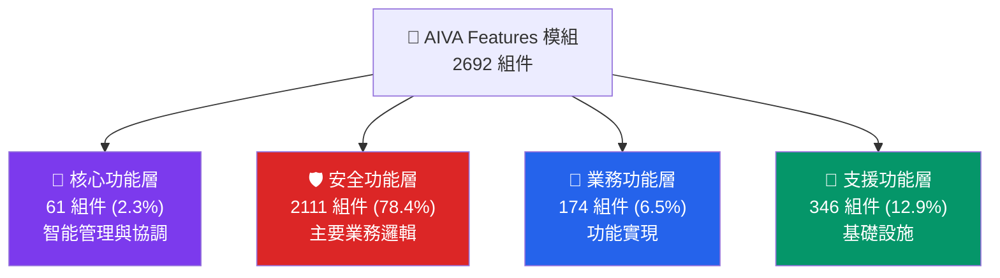

# AIVA Features 模組 - 多語言安全功能架構

> **🎯 快速導航**: 選擇您的角色和需求，找到最適合的文件
> 
> - 👨‍💼 **架構師/PM**: 閱讀 [功能架構總覽](#功能架構總覽)
> - 🐍 **Python 開發者**: 查看 [Python 開發指南](docs/README_PYTHON.md)
> - 🐹 **Go 開發者**: 查看 [Go 開發指南](docs/README_GO.md)  
> - 🦀 **Rust 開發者**: 查看 [Rust 開發指南](docs/README_RUST.md)
> - 🛡️ **安全專家**: 查看 [安全功能詳解](docs/README_SECURITY.md)
> - 🔧 **運維/DevOps**: 查看 [支援功能指南](docs/README_SUPPORT.md)

---

## 📊 **模組規模一覽**

### **🏗️ 整體統計**
- **總組件數**: **2,692** 個組件
- **檔案數量**: **114** 個檔案 (82 Python + 21 Go + 11 Rust)  
- **功能模組**: **50** 個功能模組
- **複雜度等級**: ⭐⭐⭐⭐⭐ (最高級別)

### **📈 語言分佈**
```
🦀 Rust    │████████████████████████████████████████████████████████████████████ 67.0% (1,804)
🐍 Python  │███████████████████████████████ 26.9% (723)
🐹 Go      │███████ 6.1% (165)
```

### **🎯 功能分佈**  
```
🛡️ Security │████████████████████████████████████████████████████████████████████████████████ 78.4% (2,111)
🔧 Support  │████████████████ 12.9% (346)
🏢 Business │███████ 6.5% (174)  
🔴 Core     │███ 2.3% (61)
```

---

## 🏗️ **功能架構總覽**

### **四層功能架構**



### **🎯 各層核心職責**

| 功能層 | 主要職責 | 關鍵模組 | 主要語言 |
|--------|----------|----------|----------|
| 🔴 **核心功能** | 智能管理、系統協調、決策引擎 | 統一智能檢測管理器、高價值目標識別 | 🐍 Python |
| 🛡️ **安全功能** | 漏洞檢測、靜態分析、安全掃描 | SAST 引擎、SQL/XSS/SSRF 檢測 | 🦀 Rust + 🐍 Python |
| 🏢 **業務功能** | 功能實現、服務提供、API 介面 | 軟體組件分析、雲端安全管理 | 🐹 Go + 🐍 Python |
| 🔧 **支援功能** | 基礎設施、配置管理、工具支援 | Worker 系統、Schema 定義 | 🐍 Python |

---

## 📚 **文件導航地圖**

### **📁 按功能查看**
- 📊 [**核心功能詳解**](docs/README_CORE.md) - 智能檢測管理、高價值目標識別
- 🛡️ [**安全功能詳解**](docs/README_SECURITY.md) - SAST、漏洞檢測、安全掃描
- 🏢 [**業務功能詳解**](docs/README_BUSINESS.md) - SCA、CSPM、認證服務  
- 🔧 [**支援功能詳解**](docs/README_SUPPORT.md) - Worker、配置、工具

### **💻 按語言查看**
- 🐍 [**Python 開發指南**](docs/README_PYTHON.md) - 723 組件 | 核心協調與業務邏輯
- 🐹 [**Go 開發指南**](docs/README_GO.md) - 165 組件 | 高效能服務與網路處理  
- 🦀 [**Rust 開發指南**](docs/README_RUST.md) - 1,804 組件 | 安全分析與效能關鍵

### **🎨 架構圖表**
- 📊 [功能分層架構圖](../_out/architecture_diagrams/functional/FEATURES_INTEGRATED_FUNCTIONAL.mmd)
- 🛡️ [安全功能架構圖](../_out/architecture_diagrams/functional/FEATURES_SECURITY_FUNCTIONS.mmd)
- 🔴 [核心功能架構圖](../_out/architecture_diagrams/functional/FEATURES_CORE_FUNCTIONS.mmd)
- 📈 [多語言協作架構圖](../_out/architecture_diagrams/FEATURES_MODULE_INTEGRATED_ARCHITECTURE.mmd)

---

## 🚀 **快速開始指南**

### **🔍 我需要什麼？**

**場景 1: 了解整體架構** 👨‍💼  
```
→ 閱讀本文件的功能架構總覽
→ 查看 docs/README_SECURITY.md (主要功能)
→ 檢視架構圖表
```

**場景 2: 開發特定語言模組** 👨‍💻  
```
→ 選擇對應語言的 README (Python/Go/Rust)
→ 跟隨語言特定的開發指南
→ 參考最佳實踐和程式碼範例
```

**場景 3: 實現新的安全功能** 🛡️  
```  
→ 閱讀 docs/README_SECURITY.md
→ 查看 SAST 或漏洞檢測模組範例
→ 跟隨安全功能開發模式
```

**場景 4: 系統維護和部署** 🔧  
```
→ 閱讀 docs/README_SUPPORT.md  
→ 查看跨語言整合指南
→ 參考部署和監控最佳實踐
```

### **🛠️ 環境設定**
```bash
# 1. 克隆並進入 Features 模組
cd services/features

# 2. 設定各語言環境
make setup-all  # 或手動設定各語言環境

# 3. 執行測試確認環境
make test-all

# 4. 查看具體語言的設定指南
make help
```

---

## ⚠️ **重要注意事項**

### **🔴 關鍵架構原則**
1. **安全優先**: 78.4% 的組件專注於安全功能
2. **語言專業化**: 每種語言都有明確的職責範圍
3. **分層清晰**: 四層架構職責分明，避免跨層直接調用  
4. **統一介面**: 跨語言協作需要統一的資料格式和錯誤處理

### **🚨 開發約束**
- ✅ **必須**: 遵循對應語言的開發指南和最佳實踐
- ✅ **必須**: 實現統一的錯誤處理和日誌格式
- ⚠️ **避免**: 跨語言模組的直接依賴
- ⚠️ **避免**: 繞過既定的資料交換協議

---

## 📞 **支援與聯繫**

### **👥 團隊分工**
- 🦀 **Rust 團隊**: 安全引擎、SAST、密碼學
- 🐍 **Python 團隊**: 核心協調、業務邏輯、整合
- 🐹 **Go 團隊**: 高效能服務、網路處理、認證
- 🏗️ **架構團隊**: 跨語言設計、系統整合

### **📊 相關報告**
- 📈 [多語言架構分析](../../_out/FEATURES_MODULE_ARCHITECTURE_ANALYSIS.md)
- 📋 [功能組織分析](../../_out/architecture_diagrams/functional/FUNCTIONAL_ORGANIZATION_REPORT.md)
- 🔍 [組件分類資料](../../_out/architecture_diagrams/features_diagram_classification.json)

---

**📝 文件版本**: v2.0 - Multi-Layer Architecture  
**🔄 最後更新**: {datetime.now().strftime('%Y-%m-%d')}  
**📈 複雜度等級**: ⭐⭐⭐⭐⭐ (最高) - 多層次文件架構  
**👥 維護團隊**: AIVA Multi-Language Architecture Team

*這是 AIVA Features 模組的主要導航文件。根據您的角色和需求，選擇適合的專業文件深入了解。*
