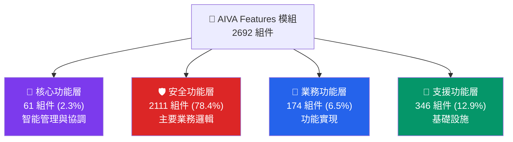

# AIVA Features 模組 - 多語言安全功能架構

> **🎯 快速導航**: 選擇您的角色和需求，找到最適合的文件
> 
> - 👨‍💼 **架構師/PM**: 閱讀 [功能架構總覽](#功能架構總覽)
> - 🐍 **Python 開發者**: 查看 [Python 開發指南](docs/README_PYTHON.md)
> - 🐹 **Go 開發者**: 查看 [Go 開發指南](docs/README_GO.md)  
> - 🦀 **Rust 開發者**: 查看 [Rust 開發指南](docs/README_RUST.md)
> - 🛡️ **安全專家**: 查看 [安全功能詳解](docs/README_SECURITY.md)
> - 🔧 **運維/DevOps**: 查看 [支援功能指南](docs/README_SUPPORT.md)

---

## 📊 **模組規模一覽**

### **🏗️ 整體統計**
- **總組件數**: **2,692** 個組件
- **檔案數量**: **114** 個檔案 (82 Python + 21 Go + 11 Rust)  
- **功能模組**: **50** 個功能模組
- **複雜度等級**: ⭐⭐⭐⭐⭐ (最高級別)

### **📈 語言分佈**
```
🦀 Rust    │████████████████████████████████████████████████████████████████████ 67.0% (1,804)
🐍 Python  │███████████████████████████████ 26.9% (723)
🐹 Go      │███████ 6.1% (165)
```

### **🎯 功能分佈**  
```
🛡️ Security │████████████████████████████████████████████████████████████████████████████████ 78.4% (2,111)
🔧 Support  │████████████████ 12.9% (346)
🏢 Business │███████ 6.5% (174)  
🔴 Core     │███ 2.3% (61)
```

---

## 🏗️ **功能架構總覽**

### **四層功能架構**



### **🎯 各層核心職責**

| 功能層 | 主要職責 | 關鍵模組 | 主要語言 |
|--------|----------|----------|----------|
| 🔴 **核心功能** | 智能管理、系統協調、決策引擎 | 統一智能檢測管理器、高價值目標識別 | 🐍 Python |
| 🛡️ **安全功能** | 漏洞檢測、靜態分析、安全掃描 | SAST 引擎、SQL/XSS/SSRF 檢測 | 🦀 Rust + 🐍 Python |
| 🏢 **業務功能** | 功能實現、服務提供、API 介面 | 軟體組件分析、雲端安全管理 | 🐹 Go + 🐍 Python |
| 🔧 **支援功能** | 基礎設施、配置管理、工具支援 | Worker 系統、Schema 定義 | 🐍 Python |

---

## 📚 **文件導航地圖**

### **📁 按功能查看**
- 📊 [**核心功能詳解**](docs/README_CORE.md) - 智能檢測管理、高價值目標識別
- 🛡️ [**安全功能詳解**](docs/README_SECURITY.md) - SAST、漏洞檢測、安全掃描
- 🏢 [**業務功能詳解**](docs/README_BUSINESS.md) - SCA、CSPM、認證服務  
- 🔧 [**支援功能詳解**](docs/README_SUPPORT.md) - Worker、配置、工具

### **💻 按語言查看**
- 🐍 [**Python 開發指南**](docs/README_PYTHON.md) - 723 組件 | 核心協調與業務邏輯
- 🐹 [**Go 開發指南**](docs/README_GO.md) - 165 組件 | 高效能服務與網路處理  
- 🦀 [**Rust 開發指南**](docs/README_RUST.md) - 1,804 組件 | 安全分析與效能關鍵

### **🎨 架構圖表**
- 📊 [功能分層架構圖](../_out/architecture_diagrams/functional/FEATURES_INTEGRATED_FUNCTIONAL.mmd)
- 🛡️ [安全功能架構圖](../_out/architecture_diagrams/functional/FEATURES_SECURITY_FUNCTIONS.mmd)
- 🔴 [核心功能架構圖](../_out/architecture_diagrams/functional/FEATURES_CORE_FUNCTIONS.mmd)
- 📈 [多語言協作架構圖](../_out/architecture_diagrams/FEATURES_MODULE_INTEGRATED_ARCHITECTURE.mmd)

---

## 🚀 **快速開始指南**

### **🔍 我需要什麼？**

**場景 1: 了解整體架構** 👨‍💼  
```
→ 閱讀本文件的功能架構總覽
→ 查看 docs/README_SECURITY.md (主要功能)
→ 檢視架構圖表
```

**場景 2: 開發特定語言模組** 👨‍💻  
```
→ 選擇對應語言的 README (Python/Go/Rust)
→ 跟隨語言特定的開發指南
→ 參考最佳實踐和程式碼範例
```

**場景 3: 實現新的安全功能** 🛡️  
```  
→ 閱讀 docs/README_SECURITY.md
→ 查看 SAST 或漏洞檢測模組範例
→ 跟隨安全功能開發模式
```

**場景 4: 系統維護和部署** 🔧  
```
→ 閱讀 docs/README_SUPPORT.md  
→ 查看跨語言整合指南
→ 參考部署和監控最佳實踐
```

### **🛠️ 環境設定**
```bash
# 1. 克隆並進入 Features 模組
cd services/features

# 2. 設定各語言環境
make setup-all  # 或手動設定各語言環境

# 3. 執行測試確認環境
make test-all

# 4. 查看具體語言的設定指南
make help
```

---

## ⚠️ **重要注意事項**

### **🔴 關鍵架構原則**
1. **安全優先**: 78.4% 的組件專注於安全功能
2. **語言專業化**: 每種語言都有明確的職責範圍
3. **分層清晰**: 四層架構職責分明,避免跨層直接調用  
4. **統一介面**: 跨語言協作需要統一的資料格式和錯誤處理

### **🚨 開發約束**
- ✅ **必須**: 遵循對應語言的開發指南和最佳實踐
- ✅ **必須**: 實現統一的錯誤處理和日誌格式
- ⚠️ **避免**: 跨語言模組的直接依賴
- ⚠️ **避免**: 繞過既定的資料交換協議

---

## 🔧 **開發規範與最佳實踐**

### 📐 **Features 模組設計原則**

作為 AIVA 的多語言安全功能層,本模組必須在 Python/Go/Rust 間維持一致的數據標準。

#### 🎯 **使用 aiva_common 的核心原則**

**✅ Features 模組的標準做法**（參考 `models.py` 正確實現）:

```python
# ✅ 正確 - Features 模組的標準導入
from ..aiva_common.enums import (
    AssetStatus,             # 資產狀態追蹤
    AssetType,               # 資產類型分類
    Confidence,              # 檢測信心度
    ModuleName,              # 跨模組通信
    ScanProgress,            # 掃描進度
    Severity,                # 漏洞嚴重程度
    VulnerabilityStatus,     # 漏洞狀態管理
)
from ..aiva_common.schemas import (
    CVEReference,            # CVE 引用標準
    CWEReference,            # CWE 分類標準
    SARIFResult,             # SARIF 報告格式
)
```

#### ⚠️ **已發現需要修復的問題**

**問題檔案**: `client_side_auth_bypass/worker.py` (Fallback code)

```python
# ❌ 錯誤 - Fallback 代碼中的重複定義
try:
    from aiva_common.enums import Severity, Confidence
except ImportError:
    class Severity(str, Enum):
        CRITICAL = "critical"
        HIGH = "high"
        # ...

# ✅ 正確修復方式 - 確保 aiva_common 可導入
# 1. 檢查 PYTHONPATH 設定
# 2. 確認模組安裝: pip install -e services/aiva_common
# 3. 移除所有 Fallback 定義
from aiva_common.enums import Severity, Confidence
```

#### 🆕 **新增或修改功能時的流程**

##### **🏗️ Features 架構靈活性原則**

**核心理念**: Features 模組由眾多獨立的安全檢測功能組成，每個子功能可以採用最適合其特性的內部架構。

```
┌─────────────────────────────────────────────────────────────────┐
│  Features 模組架構設計自由度                                    │
├─────────────────────────────────────────────────────────────────┤
│  ✅ 必須遵守（五大模組層級）:                                   │
│     • 使用 aiva_common 標準（Severity, Confidence, SARIF）      │
│     • 統一的跨模組通信接口（AivaMessage）                       │
│     • 符合所用程式語言的官方規範                                │
│                                                                  │
│  🎨 完全自由（子功能內部）:                                     │
│     • 內部目錄結構（扁平/分層/模塊化 皆可）                     │
│     • 算法實現方式（OOP/函數式/過程式）                         │
│     • 數據流設計（同步/異步/事件驅動）                          │
│     • 性能優化策略（緩存/並發/流式處理）                        │
│                                                                  │
│  ⚖️ 權衡考慮:                                                   │
│     • Python 功能: 可用 asyncio, multiprocessing, 任意框架      │
│     • Rust 功能: 可用 tokio, rayon, 任意 crate                  │
│     • Go 功能: 可用 goroutines, channels, 任意 package          │
│     • 只要對外接口一致，內部實現完全自主                        │
└─────────────────────────────────────────────────────────────────┘
```

**實際案例**:

```python
# ✅ 範例 1: 簡單功能使用扁平結構
# services/features/xss_detector/
#   ├── detector.py          # 單文件實現
#   └── patterns.json        # 配置文件

# ✅ 範例 2: 複雜功能使用分層架構  
# services/features/advanced_sqli/
#   ├── core/
#   │   ├── engine.py        # 核心引擎
#   │   └── parser.py        # SQL 解析器
#   ├── detectors/
#   │   ├── boolean_based.py
#   │   └── time_based.py
#   ├── utils/
#   └── main.py              # 統一入口

# ✅ 範例 3: 多語言混合功能
# services/features/crypto_analyzer/
#   ├── python_wrapper/      # Python 接口層
#   ├── rust_engine/         # Rust 核心引擎（性能關鍵）
#   └── shared_schemas/      # 共享數據定義
```

**唯一的硬性要求**:

1. **對外接口標準化**:
```python
# 所有 Features 功能必須提供統一接口
async def execute(target: str, config: dict) -> SARIFResult:
    """
    標準執行接口
    
    Args:
        target: 目標 URL/代碼路徑
        config: 功能配置
        
    Returns:
        SARIFResult: 符合 SARIF 2.1.0 標準的結果
    """
    # 內部實現完全自由
    # 可以是 OOP、函數式、任何架構
    pass
```

2. **數據標準一致性**:
```python
# 輸出必須使用 aiva_common 標準
from aiva_common.enums import Severity, Confidence
from aiva_common.schemas import SARIFResult

result = SARIFResult(
    ruleId="FEAT-XSS-001",
    level="error",              # SARIF 標準
    message="XSS vulnerability",
    # 內部如何檢測出來的? 完全自由!
)
```

3. **語言規範遵循**:
```rust
// Rust 功能遵循 Rust 官方規範
// Cargo.toml, 目錄結構, 命名慣例等
```

```go
// Go 功能遵循 Go 官方規範  
// go.mod, package 結構, 命名慣例等
```

##### **情境 1: 新增 Python 安全檢測功能**

```python
# 步驟 1: 使用 aiva_common 的標準枚舉
from aiva_common.enums import Severity, Confidence, VulnerabilityStatus
from aiva_common.schemas import SARIFResult, CWEReference

# 步驟 2: 如果需要新的漏洞類型，評估範圍
# 問題: 這個類型會被其他功能使用嗎？
# - 是（如 SQL Injection, XSS）→ 加入 aiva_common
# - 否（功能特定細節）→ 可在 Feature 內定義

# ✅ 合理的 Feature 專屬枚舉（檢測細節）
class AuthBypassTechnique(str, Enum):
    """客戶端認證繞過技術 - client_side_auth_bypass 專用"""
    COOKIE_MANIPULATION = "cookie_manipulation"
    TOKEN_FORGERY = "token_forgery"
    SESSION_HIJACKING = "session_hijacking"
    # 這些是特定檢測功能的技術細節，不需要跨功能共享
```

##### **情境 2: 開發 Rust 安全引擎功能**

```rust
// ✅ 正確 - Rust 中使用一致的枚舉值（字符串形式）
#[derive(Serialize, Deserialize, Debug, Clone)]
#[serde(rename_all = "lowercase")]
pub enum Severity {
    Critical,    // 對應 Python 的 "critical"
    High,        // 對應 Python 的 "high"
    Medium,      // 對應 Python 的 "medium"
    Low,         // 對應 Python 的 "low"
    Info,        // 對應 Python 的 "info"
}

// ❌ 禁止 - 不要使用與 aiva_common 不一致的值
pub enum MySeverity {
    VeryBad,     // ❌ 與 Python 不一致
    Bad,         // ❌ 與 Python 不一致
    // ...
}

// 🔄 跨語言數據交換時確保一致性
impl Severity {
    pub fn to_python_value(&self) -> &str {
        match self {
            Severity::Critical => "critical",  // 必須與 aiva_common 一致
            Severity::High => "high",
            // ...
        }
    }
}
```

##### **情境 3: 開發 Go 高性能服務功能**

```go
// ✅ 正確 - Go 中使用一致的常量定義
package models

const (
    // Severity levels - 必須與 aiva_common 一致
    SeverityCritical = "critical"
    SeverityHigh     = "high"
    SeverityMedium   = "medium"
    SeverityLow      = "low"
    SeverityInfo     = "info"
)

// ❌ 禁止 - 不要自定義不一致的值
const (
    SeverityLevel1 = "1"  // ❌ 與 Python 不一致
    SeverityLevel2 = "2"  // ❌ 與 Python 不一致
)

// 🔄 與 Python 交互時的數據結構
type VulnerabilityReport struct {
    Severity   string `json:"severity"`    // 使用 aiva_common 的值
    Confidence string `json:"confidence"`  // 使用 aiva_common 的值
    CWE        string `json:"cwe"`         // CWE-123 格式
}
```

##### **情境 4: 設計功能的內部架構（完全自由）**

**重要**: 子功能內部架構設計**不受**五大模組架構限制，可以根據實際需求選擇最佳方案。

```python
# ✅ 選項 A: 簡單功能使用單文件實現
# services/features/header_injection/detector.py

from aiva_common.enums import Severity, Confidence
from aiva_common.schemas import SARIFResult

class HeaderInjectionDetector:
    """簡單的標頭注入檢測器 - 單類實現"""
    
    async def scan(self, url: str) -> SARIFResult:
        # 直接實現邏輯，不需要分層
        payloads = self._load_payloads()
        vulnerable = await self._test_injection(url, payloads)
        return self._generate_sarif(vulnerable)
    
    def _load_payloads(self): ...
    def _test_injection(self, url, payloads): ...
    def _generate_sarif(self, result): ...

# ✅ 選項 B: 複雜功能使用分層架構
# services/features/advanced_xxe/
#   ├── core/
#   │   ├── parser.py        # XML 解析層
#   │   ├── detector.py      # 檢測邏輯層
#   │   └── validator.py     # 驗證層
#   ├── payloads/
#   │   ├── oob.py           # Out-of-band 檢測
#   │   └── inband.py        # In-band 檢測
#   └── main.py              # 統一入口

# ✅ 選項 C: 事件驅動架構
# services/features/realtime_scanner/

from asyncio import Queue
from typing import AsyncIterator

class RealtimeScanEngine:
    """事件驅動的即時掃描引擎"""
    
    def __init__(self):
        self.event_queue = Queue()
        self.workers = []
    
    async def stream_scan(self, target: str) -> AsyncIterator[SARIFResult]:
        """流式輸出結果"""
        async for event in self._scan_events(target):
            yield self._event_to_sarif(event)
    
    # 內部可以使用任何並發模型
    # asyncio, threading, multiprocessing 都可以

# ✅ 選項 D: 插件化架構
# services/features/extensible_sast/

class SASTEngine:
    """可擴展的 SAST 引擎"""
    
    def __init__(self):
        self.plugins = []
    
    def register_plugin(self, plugin: BasePlugin):
        """動態註冊檢測插件"""
        self.plugins.append(plugin)
    
    async def scan(self, code: str) -> List[SARIFResult]:
        """聚合所有插件的結果"""
        results = []
        for plugin in self.plugins:
            # 每個插件可以有完全不同的內部實現
            results.extend(await plugin.analyze(code))
        return results
```

**架構選擇指南**:

| 功能複雜度 | 推薦架構 | 範例 |
|-----------|---------|------|
| **簡單** (< 500 行) | 單文件/單類 | XSS 檢測, 敏感信息洩露 |
| **中等** (500-2000 行) | 模塊化分層 | SQL 注入, XXE, SSRF |
| **複雜** (> 2000 行) | 分層 + 插件 | SAST 引擎, 混合掃描器 |
| **高性能需求** | Rust/Go 核心 + Python 包裝 | 密碼學分析, 大規模爬蟲 |
| **即時處理** | 事件驅動/流式 | WebSocket 掃描, 即時監控 |

**關鍵原則**:
- 🎯 **對外統一**: 必須提供標準 `execute()` 或 `scan()` 接口
- 🔓 **對內自由**: 內部實現完全由開發者決定
- 📊 **結果標準**: 輸出必須符合 SARIF 2.1.0 + aiva_common 枚舉
- 🌐 **語言規範**: 遵循所用語言的官方最佳實踐

#### 🌐 **多語言協作最佳實踐**

**數據交換標準**:

```python
# Python 端（生產者）
from aiva_common.schemas import SARIFResult

def generate_report() -> dict:
    """生成符合 SARIF 標準的報告"""
    return SARIFResult(
        ruleId="AUTH-001",
        level="error",  # SARIF 標準值
        message="Authentication bypass detected"
    ).model_dump()
```

```rust
// Rust 端（消費者）
#[derive(Deserialize)]
struct SARIFResult {
    rule_id: String,
    level: String,    // 接收 SARIF 標準值
    message: String,
}

fn process_report(json: &str) -> Result<SARIFResult, Error> {
    serde_json::from_str(json)  // 解析 Python 生成的 JSON
}
```

```go
// Go 端（消費者）
type SARIFResult struct {
    RuleID  string `json:"ruleId"`
    Level   string `json:"level"`   // 接收 SARIF 標準值
    Message string `json:"message"`
}

func ProcessReport(jsonData []byte) (*SARIFResult, error) {
    var result SARIFResult
    err := json.Unmarshal(jsonData, &result)
    return &result, err
}
```

#### 🔄 **修改現有功能的檢查清單**

在修改 Features 模組任何語言的代碼前:

- [ ] **Python 檢查**: 確認從 aiva_common 正確導入,無 Fallback 代碼
- [ ] **Rust 檢查**: 枚舉序列化值與 aiva_common 一致
- [ ] **Go 檢查**: 常量定義與 aiva_common 一致
- [ ] **跨語言測試**: 驗證 Python ↔ Rust ↔ Go 數據交換正確性
- [ ] **SARIF 合規**: 確保輸出符合 SARIF 2.1.0 標準

#### 🧪 **Features 模組特殊驗證**

```bash
# 1. 檢查 Python 部分是否有重複定義
grep -r "class Severity.*Enum" services/features --include="*.py" --exclude-dir=__pycache__

# 2. 檢查 Fallback 代碼（應該移除）
grep -r "except ImportError" services/features --include="*.py" -A 5

# 3. 驗證 Rust 序列化一致性
cd services/features/rust_modules
cargo test --test cross_language_compatibility

# 4. 驗證 Go 常量定義
cd services/features/go_services
go test ./... -run TestEnumConsistency

# 5. 完整多語言集成測試
pytest services/features/tests/integration/test_multi_language.py -v
```

#### 📝 **語言特定注意事項**

**Python 開發者**:
- ✅ 始終從 `aiva_common` 導入標準枚舉
- ❌ 移除所有 `except ImportError` Fallback 代碼
- 🔧 使用 `pydantic` 模型進行數據驗證

**Rust 開發者**:
- ✅ 使用 `#[serde(rename_all = "lowercase")]` 確保序列化一致
- ❌ 避免自定義枚舉表示形式
- 🔧 實現 `to_python_value()` 進行顯式轉換

**Go 開發者**:
- ✅ 使用字符串常量而非自定義類型
- ❌ 避免使用數字代碼代替語義化字符串
- 🔧 使用 `json` tag 確保字段名一致

---

## 📞 **支援與聯繫**

### **👥 團隊分工**
- 🦀 **Rust 團隊**: 安全引擎、SAST、密碼學
- 🐍 **Python 團隊**: 核心協調、業務邏輯、整合
- 🐹 **Go 團隊**: 高效能服務、網路處理、認證
- 🏗️ **架構團隊**: 跨語言設計、系統整合

### **📊 相關報告**
- 📈 [多語言架構分析](../../_out/FEATURES_MODULE_ARCHITECTURE_ANALYSIS.md)
- 📋 [功能組織分析](../../_out/architecture_diagrams/functional/FUNCTIONAL_ORGANIZATION_REPORT.md)
- 🔍 [組件分類資料](../../_out/architecture_diagrams/features_diagram_classification.json)

---

**📝 文件版本**: v2.0 - Multi-Layer Architecture  
**🔄 最後更新**: {datetime.now().strftime('%Y-%m-%d')}  
**📈 複雜度等級**: ⭐⭐⭐⭐⭐ (最高) - 多層次文件架構  
**👥 維護團隊**: AIVA Multi-Language Architecture Team

*這是 AIVA Features 模組的主要導航文件。根據您的角色和需求，選擇適合的專業文件深入了解。*
