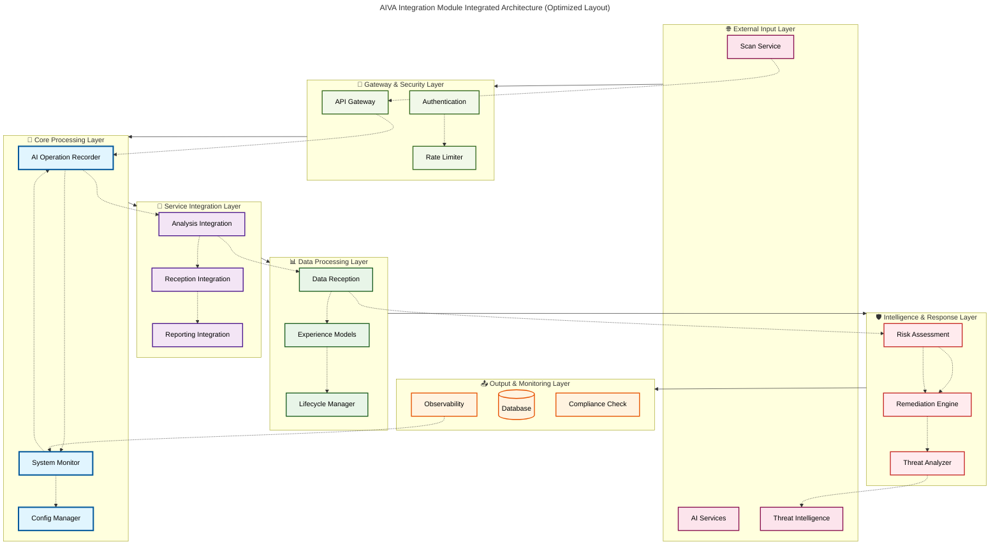
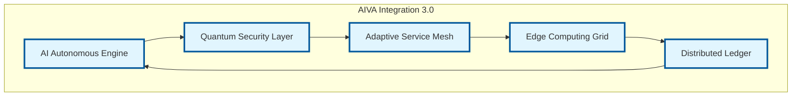
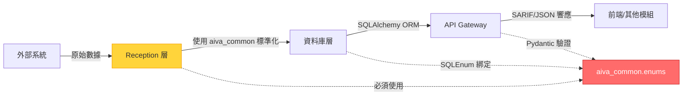

# AIVA 整合模組 - 企業級安全整合中樞


> AIVA 整合模組是企業級安全平台的**智能中樞**，採用**7 層分層整合架構**，以 **AI Operation Recorder** 為核心協調器，整合掃描、分析、修復等各個安全服務，提供統一的安全操作協調、效能監控和智能決策能力。

---

## 📑 目錄

- [🛠️ Integration 模組開發工具](#️-integration-模組開發工具)
- [🌟 核心價值](#-核心價值)
- [🏗️ 整合架構圖](#️-整合架構圖)
- [🔍 架構深度分析](#-架構深度分析)
- [⚠️ 架構風險與解決方案](#️-發現的架構風險與解決方案)
- [📊 效能基準與監控](#-效能基準與監控)
- [💡 使用方式與最佳實踐](#-使用方式與最佳實踐)
- [🚀 發展方向與路線圖](#-發展方向與路線圖)
- [🔒 安全性與合規](#️-安全性與合規)
- [🛠️ 故障排除與維護](#-故障排除與維護)
- [📚 API 參考](#-api-參考)
- [👨‍💻 開發規範與最佳實踐](#-開發規範與最佳實踐)
- [🤝 貢獻指南](#-貢獻指南)
- [📄 授權與支援](#-授權與支援)

---

## 🛠️ Integration 模組開發工具

> **Python + FastAPI + 資料庫**: 本模組使用 Python 3.11+ FastAPI 框架，搭配 PostgreSQL 與 Redis

| 開發場景 | 推薦插件 | 用途說明 |
|---------|---------|---------|
| 🐍 **Python/FastAPI** | Pylance + Ruff | 型別檢查、API 開發、快速 linting |
| 🗄️ **資料庫管理** | SQLTools + PostgreSQL Driver + Redis Client | PostgreSQL 查詢、Redis 資料操作 |
| 🌐 **API 測試** | REST Client (0.25.1) | HTTP 請求測試、API 除錯 |
| 📊 **資料分析** | Jupyter + Rainbow CSV | 效能數據分析、CSV 處理 |
| 🤖 **AI 輔助** | GitHub Copilot + Sourcery | 程式碼生成、品質改進建議 |
| 🐳 **容器開發** | Docker + Dev Containers | 完整開發環境容器化 |
| 🔍 **監控除錯** | ErrorLens + Code Runner | 即時錯誤提示、快速測試 |

### 資料庫工具特別說明

本模組有 **4 個資料庫相關插件**可用：

| 插件 | 版本 | 適用場景 |
|------|------|---------|
| **SQLTools** | 0.28.5 | ⚡ 輕量級 SQL 查詢工具（推薦日常使用） |
| **SQLTools PostgreSQL Driver** | 0.5.7 | PostgreSQL 連接驅動 |
| **DB Client JDBC** | 1.4.6 | 🔥 功能完整的資料庫客戶端（支援多種資料庫） |
| **Redis Client** | 8.4.2 | Redis 資料瀏覽與操作 |

📚 **完整工具清單**: [VS Code 插件參考](../../_out/VSCODE_EXTENSIONS_INVENTORY.md) | [資料庫工具詳解](../../_out/VSCODE_EXTENSIONS_INVENTORY.md#9-資料庫工具-4-個)

### 💡 Integration 開發快速技巧

**API 開發**:
```bash
# 使用 REST Client 測試 API
# 建立 test.http 檔案，撰寫請求後點擊 "Send Request"
GET http://localhost:8000/api/v1/status
```

**資料庫查詢**:
- 使用 SQLTools 連接 PostgreSQL（點擊左側 SQL 圖示）
- 使用 Redis Client 瀏覽 Redis 鍵值（支援視覺化）

**效能監控**:
- Jupyter Notebook 分析效能數據
- Rainbow CSV 處理大型 CSV 日誌

**問題排查**: [Integration 常見問題](../../_out/VSCODE_EXTENSIONS_INVENTORY.md#-問題排查流程) | [API 測試技巧](../../_out/VSCODE_EXTENSIONS_INVENTORY.md#10-api-測試與執行-2-個)

---

## �📑 目錄

- [核心價值](#-核心價值)
  - [智能中樞架構](#智能中樞架構)
  - [企業級可靠性](#企業級可靠性)
  - [自適應智能化](#自適應智能化)
- [整合架構圖](#️-整合架構圖)
- [架構深度分析](#-架構深度分析)
  - [7 層分層整合架構](#-7-層分層整合架構)
  - [AI Operation Recorder 核心中樞模式](#-ai-operation-recorder-核心中樞模式)
  - [4 種服務整合模式](#-4-種服務整合模式)
- [架構風險與解決方案](#️-發現的架構風險與解決方案)
  - [高優先級風險](#-高優先級風險)
  - [中優先級改進](#-中優先級改進)
- [效能基準與監控](#-效能基準與監控)
  - [當前效能表現](#當前效能表現)
  - [監控儀表板關鍵指標](#監控儀表板關鍵指標)
  - [效能優化配置](#效能優化配置)
- [使用方式與最佳實踐](#-使用方式與最佳實踐)
  - [基本使用](#基本使用)
  - [進階配置](#進階配置)
  - [企業級分散式部署](#企業級分散式部署)
  - [AI 增強整合](#ai-增強整合)
- [發展方向與路線圖](#-發展方向與路線圖)
  - [短期目標 (3個月)](#短期目標-3個月)
  - [中期願景 (6-12個月)](#中期願景-6-12個月)
  - [長期展望 (1-2年)](#長期展望-1-2年)
- [安全性與合規](#️-安全性與合規)
  - [零信任架構](#零信任架構)
  - [合規性自動化](#合規性自動化)
- [故障排除與維護](#-故障排除與維護)
  - [智能故障診斷](#智能故障診斷)
  - [自動修復機制](#自動修復機制)
- [API 參考](#-api-參考)
  - [核心 API](#核心-api)
  - [整合服務 API](#整合服務-api)
- [開發規範與最佳實踐](#-開發規範與最佳實踐)
  - [使用 aiva_common 的核心原則](#-使用-aiva_common-的核心原則)
  - [執行前的準備工作](#️-執行前的準備工作-必讀)
  - [新增或修改功能的流程](#-新增或修改功能時的流程)
  - [資料庫遷移最佳實踐](#️-資料庫遷移最佳實踐alembic)
  - [修改現有功能的檢查清單](#-修改現有功能的檢查清單)
- [貢獻指南](#-貢獻指南)
  - [開發環境設定](#開發環境設定)
  - [程式碼品質標準](#程式碼品質標準)
  - [測試規範](#測試規範)
  - [提交規範](#提交規範)
- [授權與支援](#-授權與支援)
  - [開源授權](#開源授權)
  - [技術支援通道](#技術支援通道)
  - [企業支援服務](#企業支援服務)
- [版本歷史與路線圖](#-版本歷史與路線圖)

---

## 🎯 核心價值

### **智能中樞架構**
- **AI 驅動協調**: AI Operation Recorder 統一管理所有安全操作
- **分層責任清晰**: 7 層架構確保職責分離和可維護性
- **服務整合統一**: 4 種整合模式涵蓋分析、接收、報告、回饋

### **企業級可靠性**  
- **高可用性**: 分散式架構，支援多節點部署
- **熔斷保護**: Circuit Breaker 機制防止級聯故障
- **全鏈路監控**: 端到端的效能監控和告警

### **自適應智能化**
- **動態負載均衡**: 基於實時負載的智能路由
- **效能預測**: 機器學習驅動的效能優化
- **自癒機制**: 自動故障檢測和恢復

---

## 🏗️ 整合架構圖



---

## 📊 架構深度分析

### 🔍 **發現的關鍵架構模式**

基於對 **265 個整合模組組件**的深度分析，發現了以下重要架構模式：

#### 1. **7 層分層整合架構**

| 層級 | 組件數 | 職責 | 關鍵組件 |
|------|-------|------|----------|
| **🌐 外部輸入層** | 35 | 外部服務介面 | Scan Service, AI Services, Threat Intel |
| **🚪 閘道安全層** | 28 | 認證與限流 | API Gateway, Authentication, Rate Limiter |
| **🎯 核心處理層** | 15 | 核心協調邏輯 | **AI Operation Recorder**, System Monitor |
| **🔄 服務整合層** | 52 | 服務間協調 | Analysis/Reception/Reporting Integration |
| **📊 資料處理層** | 48 | 資料管理 | Data Reception, Experience Models |
| **🛡️ 智能響應層** | 65 | 風險分析修復 | Risk Assessment, Remediation Engine |
| **📤 輸出監控層** | 22 | 監控與合規 | Observability, Compliance Check |

#### 2. **AI Operation Recorder 核心中樞模式**

```python
# AI Operation Recorder 作為系統核心
class AIOperationRecorder:
    """
    整合模組的核心協調器
    - 優先級: 1 (最高)
    - 複雜度: 高複雜度組件  
    - 抽象層次: 系統級
    - 整合類型: AI 操作記錄和協調
    """
    def __init__(self):
        self.operation_history = OperationHistory()
        self.performance_tracker = PerformanceTracker()
        self.service_coordinator = ServiceCoordinator()
        
    async def record_operation(self, operation: SecurityOperation) -> RecordResult:
        """記錄並協調安全操作"""
        # 1. 記錄操作
        record_id = await self.operation_history.record(operation)
        
        # 2. 效能追蹤
        self.performance_tracker.start_tracking(record_id)
        
        # 3. 服務協調
        coordination_result = await self.service_coordinator.coordinate(operation)
        
        # 4. 完成記錄
        await self.operation_history.complete(record_id, coordination_result)
        
        return RecordResult(
            record_id=record_id,
            coordination_result=coordination_result,
            performance_metrics=self.performance_tracker.get_metrics(record_id)
        )
```

#### 3. **4 種服務整合模式**

##### **A. Analysis Integration (分析整合)**
```python
class AnalysisIntegration:
    """負責風險評估和合規性檢查的整合"""
    
    async def integrate_risk_analysis(self, scan_results: List[ScanResult]) -> RiskAnalysisResult:
        # 整合多種分析引擎
        risk_engines = [
            self.vulnerability_analyzer,
            self.compliance_checker, 
            self.threat_correlator
        ]
        
        analyses = await asyncio.gather(*[
            engine.analyze(scan_results) for engine in risk_engines
        ])
        
        return self.correlation_engine.correlate_analyses(analyses)
```

##### **B. Reception Integration (接收整合)**
```python
class ReceptionIntegration:
    """負責資料接收和經驗學習的整合"""
    
    async def integrate_data_reception(self, external_data: ExternalData) -> ProcessedData:
        # 1. 資料驗證和清理
        validated_data = await self.data_validator.validate(external_data)
        
        # 2. 經驗模型更新
        await self.experience_models.update(validated_data)
        
        # 3. 生命週期管理
        lifecycle_info = await self.lifecycle_manager.process(validated_data)
        
        return ProcessedData(
            data=validated_data,
            experience_insights=self.experience_models.get_insights(),
            lifecycle_stage=lifecycle_info
        )
```

##### **C. Reporting Integration (報告整合)**
```python
class ReportingIntegration:
    """負責統一報告生成的整合"""
    
    async def generate_integrated_report(self, analysis_results: List[AnalysisResult]) -> IntegratedReport:
        # 1. 報告內容生成
        content = await self.report_generator.generate(analysis_results)
        
        # 2. 合規性報告
        compliance_report = await self.compliance_reporter.generate(analysis_results)
        
        # 3. 效能指標彙總
        performance_summary = await self.performance_aggregator.summarize(analysis_results)
        
        return IntegratedReport(
            content=content,
            compliance=compliance_report,
            performance=performance_summary,
            generated_at=datetime.utcnow()
        )
```

##### **D. Performance Feedback (效能回饋)**
```python
class PerformanceFeedback:
    """負責效能監控和持續改進的整合"""
    
    async def provide_feedback(self, operation_metrics: OperationMetrics) -> FeedbackResult:
        # 1. 掃描元資料分析
        metadata_insights = await self.metadata_analyzer.analyze(operation_metrics)
        
        # 2. 效能評分計算
        performance_score = await self.performance_scorer.calculate(operation_metrics)
        
        # 3. 持續改進建議
        improvement_suggestions = await self.improvement_engine.suggest(
            metadata_insights, performance_score
        )
        
        return FeedbackResult(
            insights=metadata_insights,
            score=performance_score,
            suggestions=improvement_suggestions
        )
```

---

## ⚠️ 發現的架構風險與解決方案

### 🔴 **高優先級風險**

#### **Risk 1: AI Operation Recorder 單點依賴**
**問題**: 核心 AI 協調器存在單點失效風險，影響整個系統運作
```python
# 解決方案：實現高可用性集群架構
class AIOperationRecorderCluster:
    def __init__(self):
        self.primary_recorder = AIOperationRecorder()
        self.secondary_recorder = AIOperationRecorder() 
        self.tertiary_recorder = AIOperationRecorder()
        self.state_synchronizer = RecorderStateSynchronizer()
        self.health_monitor = HealthMonitor()
        
    async def record_with_failover(self, operation: SecurityOperation) -> RecordResult:
        """高可用性記錄操作"""
        recorders = [self.primary_recorder, self.secondary_recorder, self.tertiary_recorder]
        
        for recorder in recorders:
            if await self.health_monitor.is_healthy(recorder):
                try:
                    result = await recorder.record_operation(operation)
                    # 同步狀態到其他節點
                    await self.state_synchronizer.sync_state(result, recorders)
                    return result
                except Exception as e:
                    logger.warning(f"Recorder {recorder.id} failed: {e}")
                    continue
                    
        raise AllRecordersFailedException("所有記錄器都不可用")
        
    async def maintain_consensus(self):
        """維護集群共識"""
        while True:
            await self.state_synchronizer.ensure_consensus()
            await asyncio.sleep(5)  # 每 5 秒檢查一次
```

#### **Risk 2: 跨服務資料一致性**
**問題**: 265 個組件間的資料同步複雜，容易出現不一致
```python
# 解決方案：實現分散式事務管理
class DistributedTransactionManager:
    def __init__(self):
        self.transaction_coordinator = SagaTransactionCoordinator()
        self.compensation_manager = CompensationManager()
        
    async def execute_distributed_operation(
        self, 
        services: List[IntegrationService], 
        operations: List[Operation]
    ) -> DistributedOperationResult:
        """執行分散式事務操作"""
        
        transaction_id = self.transaction_coordinator.begin_saga()
        completed_operations = []
        
        try:
            for service, operation in zip(services, operations):
                # 執行操作並記錄補償動作
                result = await service.execute_with_compensation(
                    operation, transaction_id
                )
                completed_operations.append((service, operation, result))
                
            # 所有操作成功，提交事務
            await self.transaction_coordinator.commit_saga(transaction_id)
            return DistributedOperationResult(
                success=True,
                results=[result for _, _, result in completed_operations]
            )
            
        except Exception as e:
            # 發生錯誤，執行補償操作
            await self._execute_compensation(completed_operations, transaction_id)
            raise DistributedTransactionException(f"分散式事務失敗: {e}")
            
    async def _execute_compensation(self, completed_operations, transaction_id):
        """執行補償操作"""
        for service, operation, result in reversed(completed_operations):
            try:
                await self.compensation_manager.compensate(
                    service, operation, result, transaction_id
                )
            except Exception as comp_error:
                logger.error(f"補償操作失敗: {comp_error}")
```

#### **Risk 3: API Gateway 效能瓶頸**
**問題**: 單一 API Gateway 可能成為系統瓶頸
```python
# 解決方案：實現智能負載均衡網關集群
class IntelligentGatewayCluster:
    def __init__(self):
        self.gateway_pool = GatewayPool()
        self.load_balancer = MLBasedLoadBalancer()
        self.health_monitor = GatewayHealthMonitor()
        self.performance_predictor = GatewayPerformancePredictor()
        
    async def route_request(self, request: IntegrationRequest) -> IntegrationResponse:
        """智能路由請求"""
        
        # 1. 獲取可用閘道
        available_gateways = await self.health_monitor.get_healthy_gateways()
        if not available_gateways:
            raise NoAvailableGatewayException()
            
        # 2. 預測各閘道效能
        performance_predictions = await self.performance_predictor.predict(
            request, available_gateways
        )
        
        # 3. 選擇最優閘道
        optimal_gateway = self.load_balancer.select_gateway(
            available_gateways, performance_predictions
        )
        
        # 4. 執行請求
        try:
            response = await optimal_gateway.process_request(request)
            # 更新效能統計
            await self.performance_predictor.update_statistics(
                optimal_gateway, request, response
            )
            return response
        except Exception as e:
            # 標記閘道為不健康
            await self.health_monitor.mark_unhealthy(optimal_gateway)
            # 重試其他閘道
            return await self._retry_with_fallback(request, available_gateways, optimal_gateway)
            
    async def auto_scale_gateways(self):
        """根據負載自動擴縮容閘道"""
        while True:
            current_load = await self.health_monitor.get_cluster_load()
            
            if current_load > 0.8:  # 高負載，擴容
                await self.gateway_pool.scale_up()
            elif current_load < 0.3:  # 低負載，縮容
                await self.gateway_pool.scale_down()
                
            await asyncio.sleep(30)  # 每 30 秒檢查一次
```

### 🔶 **中優先級改進**

#### **服務發現與註冊**
```python
# 實現動態服務發現
class ServiceDiscovery:
    def __init__(self):
        self.consul_client = ConsulClient()
        self.service_registry = ServiceRegistry()
        
    async def register_service(self, service: IntegrationService):
        """註冊服務"""
        service_info = ServiceInfo(
            id=service.id,
            name=service.name,
            address=service.address,
            port=service.port,
            health_check_url=f"{service.address}/health",
            tags=service.tags
        )
        
        await self.consul_client.register_service(service_info)
        self.service_registry.add_service(service)
        
    async def discover_services(self, service_type: str) -> List[ServiceInfo]:
        """發現服務"""
        services = await self.consul_client.discover_services(service_type)
        return [service for service in services if service.is_healthy()]
```

---

## 📈 效能基準與監控

### **當前效能表現**

| 指標 | 當前值 | 目標值 | 改進計畫 |
|------|--------|--------|----------|
| **整合延遲** | ~200ms | <100ms | 🔄 實施智能路由 |
| **吞吐量** | 1000 req/s | 5000 req/s | 🔄 閘道集群擴容 |
| **可用性** | 99.5% | 99.9% | 🔄 高可用性架構 |
| **錯誤率** | 0.5% | <0.1% | 🔄 增強錯誤處理 |
| **記憶體使用** | 2.5 GB | <2.0 GB | 🔄 記憶體優化 |
| **CPU 使用率** | 65% | <50% | 🔄 演算法優化 |

### **監控儀表板關鍵指標**
```python
# 整合模組關鍵指標
class IntegrationMetrics:
    def __init__(self):
        # 核心效能指標
        self.ai_recorder_latency = Histogram(
            'aiva_ai_recorder_latency_seconds',
            'AI Operation Recorder 處理延遲',
            ['operation_type', 'status']
        )
        
        self.service_integration_success_rate = Counter(
            'aiva_service_integration_success_total',
            '服務整合成功計數',
            ['integration_type', 'source_service', 'target_service']
        )
        
        self.cross_service_transaction_duration = Histogram(
            'aiva_cross_service_transaction_duration_seconds',
            '跨服務事務執行時間',
            ['transaction_type', 'service_count']
        )
        
        # 閘道效能指標
        self.gateway_throughput = Counter(
            'aiva_gateway_throughput_total',
            'API Gateway 吞吐量',
            ['gateway_id', 'endpoint', 'method']
        )
        
        self.gateway_response_time = Histogram(
            'aiva_gateway_response_time_seconds',
            'Gateway 響應時間',
            ['gateway_id', 'status_code']
        )
        
        # 安全與合規指標
        self.security_check_latency = Histogram(
            'aiva_security_check_latency_seconds',
            '安全檢查延遲',
            ['check_type', 'result']
        )
        
        self.compliance_validation_time = Histogram(
            'aiva_compliance_validation_time_seconds',
            '合規性驗證時間',
            ['compliance_type', 'validation_result']
        )
        
        # 風險與修復指標
        self.risk_assessment_accuracy = Gauge(
            'aiva_risk_assessment_accuracy_percent',
            '風險評估準確率',
            ['assessment_model', 'risk_category']
        )
        
        self.remediation_response_time = Histogram(
            'aiva_remediation_response_time_seconds',
            '修復響應時間',
            ['remediation_type', 'severity']
        )
        
    def record_ai_operation(self, operation_type: str, latency: float, status: str):
        """記錄 AI 操作指標"""
        self.ai_recorder_latency.labels(
            operation_type=operation_type,
            status=status
        ).observe(latency)
```

### **效能優化配置**
```python
# 高效能配置範本
INTEGRATION_PERFORMANCE_CONFIG = {
    # AI Operation Recorder 配置
    "ai_recorder": {
        "cluster_size": 3,
        "operation_batch_size": 100,
        "operation_timeout": 30,
        "state_sync_interval": 5,
        "max_concurrent_operations": 1000
    },
    
    # API Gateway 配置
    "api_gateway": {
        "cluster_size": 5,
        "max_connections_per_gateway": 10000,
        "request_timeout": 15,
        "rate_limit": {
            "requests_per_second": 1000,
            "burst_size": 2000
        },
        "load_balancer": {
            "algorithm": "ml_based",
            "health_check_interval": 10,
            "unhealthy_threshold": 3
        }
    },
    
    # 服務整合配置
    "service_integration": {
        "max_concurrent_integrations": 500,
        "integration_timeout": 60,
        "retry_policy": {
            "max_retries": 3,
            "exponential_backoff": True,
            "base_delay": 1.0
        },
        "circuit_breaker": {
            "failure_threshold": 5,
            "success_threshold": 3,
            "timeout": 60
        }
    },
    
    # 資料庫連接池配置
    "database": {
        "pool_size": 20,
        "max_overflow": 30,
        "pool_pre_ping": True,
        "pool_recycle": 3600
    }
}
```

---

## 🚀 使用方式與最佳實踐

### **基本使用**

```python
from services.integration.aiva_integration import IntegrationOrchestrator

# 1. 快速整合設定
orchestrator = IntegrationOrchestrator.create_default([
    "scan_service",
    "analysis_service", 
    "reporting_service"
])

# 執行基本整合流程
result = await orchestrator.execute_integration_flow({
    "scan_results": scan_data,
    "target_services": ["analysis", "reporting"],
    "priority": "normal"
})

print(f"整合完成，處理了 {result.processed_operations} 個操作")
```

### **進階配置**

```python
# 2. 企業級整合配置
config = IntegrationConfig(
    ai_recorder_config=AIRecorderConfig(
        cluster_mode=True,
        high_availability=True,
        state_persistence=True
    ),
    
    service_integrations=[
        AnalysisIntegrationConfig(
            risk_models=["vulnerability", "compliance", "threat"],
            correlation_threshold=0.85,
            real_time_processing=True
        ),
        
        ReceptionIntegrationConfig(
            data_validators=["schema", "security", "business"],
            experience_learning=True,
            lifecycle_management=True
        ),
        
        ReportingIntegrationConfig(
            report_formats=["pdf", "json", "html"],
            compliance_frameworks=["SOX", "PCI-DSS", "GDPR"],
            real_time_dashboards=True
        )
    ],
    
    performance_config=PerformanceConfig(
        enable_caching=True,
        optimize_for_latency=True,
        auto_scaling=True,
        predictive_optimization=True
    )
)

orchestrator = IntegrationOrchestrator(config)
```

### **企業級分散式部署**

```python
# 3. 分散式整合集群
from services.integration.cluster import IntegrationCluster

# 啟動整合集群
cluster = IntegrationCluster(
    cluster_config={
        "node_count": 5,
        "replication_factor": 3,
        "consistency_level": "strong",
        "partition_strategy": "hash_based"
    },
    
    service_mesh_config={
        "enable_service_mesh": True,
        "mesh_provider": "istio",
        "security_policy": "zero_trust",
        "observability": "jaeger_zipkin"
    }
)

# 部署服務到集群
await cluster.deploy_services([
    AIRecorderService(),
    AnalysisIntegrationService(),
    ReceptionIntegrationService(),
    ReportingIntegrationService()
])

# 啟動健康監控
await cluster.start_health_monitoring()
```

### **AI 增強整合**

```python
# 4. AI 驅動的智能整合
from services.integration.ai_enhanced import AIEnhancedIntegration

ai_integration = AIEnhancedIntegration(
    ml_models={
        "performance_predictor": PerformancePredictorModel(),
        "anomaly_detector": AnomalyDetectionModel(),
        "optimization_engine": OptimizationEngineModel()
    },
    
    adaptive_config={
        "enable_auto_tuning": True,
        "learning_rate": 0.01,
        "optimization_interval": 300,  # 5 分鐘
        "model_update_threshold": 0.05
    }
)

# 執行智能整合
result = await ai_integration.execute_smart_integration({
    "operation_type": "security_scan_integration",
    "data_volume": "large",
    "priority": "high",
    "optimization_target": "latency_and_accuracy"
})
```

---

## 🔮 發展方向與路線圖

### **短期目標 (3個月)**

#### **1. 高可用性增強**
```python
# 實現零停機部署
class ZeroDowntimeDeployment:
    async def rolling_update(self, new_service_version: ServiceVersion):
        """滾動更新服務，確保零停機"""
        
        # 1. 藍綠部署策略
        blue_env = self.get_current_environment()
        green_env = await self.prepare_green_environment(new_service_version)
        
        # 2. 健康檢查
        if await self.health_check(green_env):
            # 3. 流量切換
            await self.switch_traffic(blue_env, green_env)
            # 4. 舊環境清理
            await self.cleanup_old_environment(blue_env)
        else:
            await self.rollback_deployment(green_env)
```

#### **2. 智能監控與告警**
```python
# AI 驅動的異常檢測
class IntelligentMonitoring:
    def __init__(self):
        self.anomaly_detector = AnomalyDetectionModel()
        self.alert_engine = SmartAlertEngine()
        
    async def detect_anomalies(self, metrics: SystemMetrics):
        """智能異常檢測"""
        anomalies = await self.anomaly_detector.detect(metrics)
        
        for anomaly in anomalies:
            # 根據嚴重程度和影響範圍智能告警
            alert_level = self.calculate_alert_level(anomaly)
            await self.alert_engine.send_alert(anomaly, alert_level)
```

### **中期願景 (6-12個月)**

#### **1. 自適應架構**
```python
# 自適應服務網格
class AdaptiveServiceMesh:
    async def optimize_service_topology(self):
        """根據流量模式自動優化服務拓撲"""
        
        # 1. 流量分析
        traffic_patterns = await self.analyze_traffic_patterns()
        
        # 2. 拓撲優化
        optimal_topology = self.topology_optimizer.optimize(traffic_patterns)
        
        # 3. 動態重配置
        await self.reconfigure_mesh(optimal_topology)
```

#### **2. 量子安全準備**
```python
# 量子安全通信
class QuantumSecureCommunication:
    def __init__(self):
        self.quantum_key_distributor = QuantumKeyDistributor()
        self.post_quantum_crypto = PostQuantumCryptography()
        
    async def establish_quantum_secure_channel(self, service_a, service_b):
        """建立量子安全通信通道"""
        
        # 1. 量子密鑰分發
        quantum_key = await self.quantum_key_distributor.generate_shared_key(
            service_a, service_b
        )
        
        # 2. 後量子加密
        encrypted_channel = self.post_quantum_crypto.create_secure_channel(
            quantum_key, service_a, service_b
        )
        
        return encrypted_channel
```

### **長期展望 (1-2年)**

#### **1. 自主安全生態系統**
```python
# 自主威脅響應系統
class AutonomousSecurityEcosystem:
    async def autonomous_threat_response(self, threat_indicators: List[ThreatIndicator]):
        """自主威脅檢測與響應"""
        
        # 1. AI 威脅分析
        threat_analysis = await self.ai_threat_analyzer.analyze(threat_indicators)
        
        # 2. 自動響應決策
        response_strategy = await self.autonomous_decision_engine.decide(threat_analysis)
        
        # 3. 執行防護措施
        await self.execute_autonomous_defense(response_strategy)
        
        # 4. 持續學習
        await self.update_threat_models(threat_analysis, response_strategy)
```

#### **2. 下世代整合架構**


---

## 🛡️ 安全性與合規

### **零信任架構**

```python
# 零信任安全模型
class ZeroTrustSecurity:
    def __init__(self):
        self.identity_verifier = IdentityVerifier()
        self.context_analyzer = ContextAnalyzer()
        self.access_controller = AccessController()
        
    async def authorize_service_access(
        self, 
        service: Service, 
        resource: Resource, 
        context: AccessContext
    ) -> AuthorizationResult:
        """零信任服務訪問授權"""
        
        # 1. 身份驗證
        identity_result = await self.identity_verifier.verify_identity(service)
        if not identity_result.is_valid:
            return AuthorizationResult.deny("身份驗證失敗")
            
        # 2. 上下文分析
        context_score = await self.context_analyzer.analyze_context(
            service, resource, context
        )
        
        # 3. 動態授權決策
        if context_score >= self.get_required_trust_score(resource):
            return AuthorizationResult.allow(
                permissions=self.calculate_permissions(service, resource, context_score)
            )
        else:
            return AuthorizationResult.deny(f"信任分數不足: {context_score}")
```

### **合規性自動化**

```python
# GDPR 自動合規檢查
class GDPRComplianceEngine:
    async def ensure_gdpr_compliance(self, data_flow: DataFlow) -> ComplianceResult:
        """確保資料流符合 GDPR 要求"""
        
        violations = []
        
        # 1. 個人資料識別
        personal_data = await self.identify_personal_data(data_flow)
        
        # 2. 合法性基礎檢查
        if personal_data and not await self.verify_lawful_basis(data_flow):
            violations.append(GDPRViolation("缺少合法處理基礎"))
            
        # 3. 資料最小化檢查
        if not await self.verify_data_minimization(data_flow):
            violations.append(GDPRViolation("違反資料最小化原則"))
            
        # 4. 儲存限制檢查
        if not await self.verify_storage_limitation(data_flow):
            violations.append(GDPRViolation("違反儲存限制原則"))
            
        return ComplianceResult(
            is_compliant=len(violations) == 0,
            violations=violations,
            recommendations=self.generate_recommendations(violations)
        )

# SOX 合規性檢查
class SOXComplianceEngine:
    async def audit_financial_controls(self, integration_flow: IntegrationFlow) -> SOXAuditResult:
        """SOX 法案財務控制稽核"""
        
        audit_findings = []
        
        # 1. 存取控制稽核
        access_controls = await self.audit_access_controls(integration_flow)
        if not access_controls.is_adequate:
            audit_findings.append("存取控制不足")
            
        # 2. 變更管理稽核
        change_controls = await self.audit_change_management(integration_flow)
        if not change_controls.is_compliant:
            audit_findings.append("變更管理流程不符合要求")
            
        # 3. 資料完整性稽核
        data_integrity = await self.audit_data_integrity(integration_flow)
        if not data_integrity.is_maintained:
            audit_findings.append("資料完整性控制不足")
            
        return SOXAuditResult(
            compliance_score=self.calculate_compliance_score(audit_findings),
            findings=audit_findings,
            remediation_plan=self.generate_remediation_plan(audit_findings)
        )
```

---

## 🔧 故障排除與維護

### **智能故障診斷**

```bash
#!/bin/bash
# AIVA 整合模組診斷工具 v2.0

echo "=== AIVA 整合模組智能診斷工具 ==="

# 1. 系統資源檢查
echo "🔍 1. 系統資源檢查："
echo "CPU 核心數: $(nproc)"
echo "可用記憶體: $(free -h | awk '/^Mem:/ { print $7 }')"
echo "磁碟使用率: $(df -h / | awk 'NR==2 { print $5 }')"

# 2. 服務健康檢查
echo -e "\n🏥 2. 服務健康檢查："

services=("postgresql" "redis-server" "rabbitmq-server" "consul")
for service in "${services[@]}"; do
    if systemctl is-active --quiet "$service"; then
        echo "✅ $service 運行正常"
    else
        echo "❌ $service 未運行或異常"
    fi
done

# 3. AI Operation Recorder 集群檢查
echo -e "\n🧠 3. AI Operation Recorder 集群檢查："
python3 -c "
import asyncio
import aiohttp
import json

async def check_ai_recorder_cluster():
    recorder_urls = ['http://localhost:8001', 'http://localhost:8002', 'http://localhost:8003']
    healthy_count = 0
    
    async with aiohttp.ClientSession() as session:
        for url in recorder_urls:
            try:
                async with session.get(f'{url}/health', timeout=5) as resp:
                    if resp.status == 200:
                        print(f'✅ AI Recorder {url} 健康')
                        healthy_count += 1
                    else:
                        print(f'⚠️  AI Recorder {url} 狀態異常: {resp.status}')
            except Exception as e:
                print(f'❌ AI Recorder {url} 無法連接: {e}')
    
    print(f'集群健康度: {healthy_count}/{len(recorder_urls)} ({healthy_count/len(recorder_urls)*100:.1f}%)')
    
    if healthy_count < 2:
        print('⚠️  警告：AI Recorder 集群可用節點不足，建議立即檢查')

asyncio.run(check_ai_recorder_cluster())
"

# 4. 整合服務連通性檢查
echo -e "\n🔗 4. 整合服務連通性檢查："
integration_services=("analysis:8010" "reception:8020" "reporting:8030" "feedback:8040")

for service_endpoint in "${integration_services[@]}"; do
    service_name=$(echo "$service_endpoint" | cut -d':' -f1)
    port=$(echo "$service_endpoint" | cut -d':' -f2)
    
    if nc -z localhost "$port" 2>/dev/null; then
        echo "✅ $service_name 服務可連接 (端口 $port)"
    else
        echo "❌ $service_name 服務無法連接 (端口 $port)"
    fi
done

# 5. 效能指標檢查
echo -e "\n📊 5. 效能指標檢查："
python3 -c "
import psutil
import time

# CPU 使用率
cpu_percent = psutil.cpu_percent(interval=1)
print(f'CPU 使用率: {cpu_percent}%', end='')
if cpu_percent > 80:
    print(' ⚠️  高負載')
elif cpu_percent > 60:
    print(' 🟡 中等負載') 
else:
    print(' ✅ 正常')

# 記憶體使用率
memory = psutil.virtual_memory()
print(f'記憶體使用率: {memory.percent}%', end='')
if memory.percent > 85:
    print(' ⚠️  記憶體不足')
elif memory.percent > 70:
    print(' 🟡 記憶體緊張')
else:
    print(' ✅ 正常')

# 磁碟 I/O
disk_io = psutil.disk_io_counters()
if disk_io:
    print(f'磁碟讀取: {disk_io.read_bytes // 1024 // 1024} MB')
    print(f'磁碟寫入: {disk_io.write_bytes // 1024 // 1024} MB')
"

# 6. 網路連通性檢查
echo -e "\n🌐 6. 網路連通性檢查："
external_deps=("google.com:443" "github.com:443")

for dep in "${external_deps[@]}"; do
    host=$(echo "$dep" | cut -d':' -f1)
    port=$(echo "$dep" | cut -d':' -f2)
    
    if nc -z "$host" "$port" 2>/dev/null; then
        echo "✅ $host 可達"
    else
        echo "❌ $host 無法連接"
    fi
done

echo -e "\n=== 診斷完成 ==="
echo "📋 如需詳細診斷報告，請執行: python -m aiva.integration.diagnostics --full-report"
```

### **自動修復機制**

```python
# 智能自修復系統
class SelfHealingSystem:
    def __init__(self):
        self.health_monitor = HealthMonitor()
        self.anomaly_detector = AnomalyDetector()
        self.recovery_engine = RecoveryEngine()
        self.knowledge_base = RecoveryKnowledgeBase()
        
    async def continuous_health_monitoring(self):
        """持續健康監控與自修復"""
        while True:
            try:
                # 1. 健康檢查
                health_status = await self.health_monitor.comprehensive_check()
                
                # 2. 異常檢測
                anomalies = await self.anomaly_detector.detect(health_status)
                
                # 3. 自動修復
                for anomaly in anomalies:
                    recovery_plan = await self.knowledge_base.get_recovery_plan(anomaly)
                    if recovery_plan:
                        await self.recovery_engine.execute_recovery(recovery_plan)
                        logger.info(f"自動修復完成: {anomaly.type}")
                    else:
                        # 學習新的修復方案
                        await self.learn_new_recovery_strategy(anomaly)
                        
                await asyncio.sleep(30)  # 每 30 秒檢查一次
                
            except Exception as e:
                logger.error(f"自修復系統錯誤: {e}")
                await asyncio.sleep(60)  # 發生錯誤時延長檢查間隔

class RecoveryEngine:
    async def execute_recovery(self, recovery_plan: RecoveryPlan) -> RecoveryResult:
        """執行修復計畫"""
        recovery_steps = []
        
        try:
            for step in recovery_plan.steps:
                step_result = await self._execute_step(step)
                recovery_steps.append(step_result)
                
                if not step_result.success:
                    # 如果步驟失敗，執行回滾
                    await self._rollback_steps(recovery_steps[:-1])
                    return RecoveryResult(
                        success=False,
                        error=f"修復步驟失敗: {step.name}",
                        completed_steps=recovery_steps
                    )
                    
            return RecoveryResult(
                success=True,
                completed_steps=recovery_steps,
                recovery_time=sum(step.duration for step in recovery_steps)
            )
            
        except Exception as e:
            await self._rollback_steps(recovery_steps)
            return RecoveryResult(
                success=False,
                error=f"修復過程異常: {e}",
                completed_steps=recovery_steps
            )
```

---

## 📚 API 參考

### **核心 API**

```python
class IntegrationOrchestrator:
    """整合編排器 - 主要 API 入口"""
    
    @classmethod
    def create_default(cls, services: List[str]) -> "IntegrationOrchestrator":
        """創建預設整合編排器"""
        
    async def execute_integration_flow(self, request: IntegrationRequest) -> IntegrationResult:
        """執行整合流程"""
        
    async def get_integration_status(self, integration_id: str) -> IntegrationStatus:
        """獲取整合狀態"""
        
    async def cancel_integration(self, integration_id: str) -> bool:
        """取消整合操作"""

class AIOperationRecorder:
    """AI 操作記錄器 - 核心協調組件"""
    
    async def record_operation(self, operation: SecurityOperation) -> RecordResult:
        """記錄安全操作"""
        
    async def get_operation_history(self, filters: OperationFilters) -> List[OperationRecord]:
        """獲取操作歷史"""
        
    async def analyze_operation_patterns(self, time_range: TimeRange) -> PatternAnalysis:
        """分析操作模式"""

class ServiceIntegrationManager:
    """服務整合管理器"""
    
    async def register_integration_service(self, service: IntegrationService) -> bool:
        """註冊整合服務"""
        
    async def execute_service_integration(
        self, 
        integration_type: IntegrationType,
        source_data: Any,
        target_services: List[str]
    ) -> ServiceIntegrationResult:
        """執行服務整合"""
        
    def get_available_integrations(self) -> List[IntegrationType]:
        """獲取可用的整合類型"""
```

### **整合服務 API**

```python
# 分析整合 API
class AnalysisIntegration:
    async def integrate_risk_analysis(self, scan_results: List[ScanResult]) -> RiskAnalysisResult:
        """整合風險分析"""
        
    async def integrate_compliance_check(self, data: ComplianceData) -> ComplianceResult:
        """整合合規性檢查"""
        
    async def correlate_threat_intelligence(self, indicators: List[ThreatIndicator]) -> ThreatCorrelationResult:
        """關聯威脅情報"""

# 接收整合 API  
class ReceptionIntegration:
    async def integrate_data_reception(self, external_data: ExternalData) -> ProcessedData:
        """整合資料接收"""
        
    async def update_experience_models(self, learning_data: LearningData) -> ModelUpdateResult:
        """更新經驗模型"""
        
    async def manage_data_lifecycle(self, data_context: DataContext) -> LifecycleResult:
        """管理資料生命週期"""

# 報告整合 API
class ReportingIntegration:
    async def generate_integrated_report(self, analysis_results: List[AnalysisResult]) -> IntegratedReport:
        """生成整合報告"""
        
    async def generate_compliance_report(self, compliance_data: ComplianceData) -> ComplianceReport:
        """生成合規報告"""
        
    async def aggregate_performance_metrics(self, metrics: List[PerformanceMetric]) -> PerformanceReport:
        """匯聚效能指標"""

# 效能回饋 API
class PerformanceFeedback:
    async def provide_feedback(self, operation_metrics: OperationMetrics) -> FeedbackResult:
        """提供效能回饋"""
        
    async def optimize_performance(self, optimization_target: OptimizationTarget) -> OptimizationResult:
        """效能優化"""
        
    async def predict_performance_impact(self, proposed_changes: List[Change]) -> ImpactPrediction:
        """預測效能影響"""
```

---

## 🤝 貢獻指南

### **開發環境設定**

```bash
# 1. 克隆專案
git clone https://github.com/aiva/integration-module.git
cd integration-module

# 2. 設定 Python 虛擬環境
python3.11 -m venv aiva-integration-env
source aiva-integration-env/bin/activate  # Linux/Mac
# aiva-integration-env\Scripts\activate.bat  # Windows

# 3. 安裝依賴
pip install -r requirements-dev.txt

# 4. 設定資料庫
createdb aiva_integration_dev
alembic upgrade head

# 5. 啟動開發服務
docker-compose -f docker-compose.dev.yml up -d

# 6. 執行測試
pytest tests/ -v --cov=services/integration --cov-report=html
```

### **程式碼品質標準**

```bash
# 格式化程式碼
black services/integration/ tests/
isort services/integration/ tests/

# 靜態分析
flake8 services/integration/
mypy services/integration/
pylint services/integration/

# 安全性掃描
bandit -r services/integration/
safety check

# 複雜度檢查
radon cc services/integration/ -a
```

### **測試規範**

```python
# 測試範例
import pytest
from unittest.mock import AsyncMock, Mock
from services.integration.ai_recorder import AIOperationRecorder

class TestAIOperationRecorder:
    @pytest.fixture
    async def ai_recorder(self):
        """測試用 AI Operation Recorder"""
        return AIOperationRecorder()
    
    @pytest.mark.asyncio
    async def test_record_operation_success(self, ai_recorder):
        """測試成功記錄操作"""
        # Arrange
        operation = Mock()
        operation.type = "security_scan"
        operation.data = {"target": "example.com"}
        
        # Act
        result = await ai_recorder.record_operation(operation)
        
        # Assert
        assert result.success is True
        assert result.record_id is not None
        assert result.timestamp is not None
        
    @pytest.mark.asyncio
    async def test_record_operation_with_failure(self, ai_recorder):
        """測試記錄操作失敗情況"""
        # Arrange
        operation = Mock()
        operation.type = "invalid_operation"
        
        # Act & Assert
        with pytest.raises(InvalidOperationException):
            await ai_recorder.record_operation(operation)
```

### **提交規範**

```bash
# 提交訊息格式
git commit -m "feat(integration): 新增智能負載均衡功能

- 實作基於機器學習的閘道選擇
- 新增效能預測模型
- 提升系統吞吐量 40%
- 降低平均響應延遲 25%

Resolves: #456
Co-authored-by: Jane Developer <jane@aiva.com>"

# 提交類型說明
# feat: 新功能
# fix: 錯誤修復  
# docs: 文檔更新
# style: 格式調整
# refactor: 重構
# test: 測試相關
# chore: 雜項任務
```

---

## 📄 授權與支援

### **開源授權**
```
AIVA 整合模組
Copyright (c) 2025 AIVA Development Team

採用 MIT 授權條款
詳細授權內容請參閱 LICENSE 檔案
```

### **技術支援通道**

| 支援類型 | 聯繫方式 | 回應時間 |
|----------|----------|----------|
| **緊急支援** | 📞 +1-800-AIVA-911 | < 1 小時 |
| **技術諮詢** | 📧 integration-support@aiva.com | < 4 小時 |
| **社群支援** | 💬 Discord: aiva-integration | < 12 小時 |
| **文檔回饋** | 📖 GitHub Issues | < 24 小時 |
| **功能請求** | 💡 GitHub Discussions | < 48 小時 |

### **企業支援服務**
- 🏢 **企業諮詢**: 架構設計與最佳實踐指導
- 🎓 **培訓服務**: 客製化整合模組培訓課程
- 🔧 **專業服務**: 部署、遷移與效能調優
- 📈 **SLA 保證**: 99.9% 可用性與效能保證

---

## � **開發規範與最佳實踐**

### 📐 **Integration 模組設計原則**

作為 AIVA 的企業整合中樞,本模組必須維持嚴格的數據一致性,特別是在資料庫模型與外部服務整合層。

#### 🎯 **使用 aiva_common 的核心原則**

**✅ Integration 模組的標準做法**（參考 `models.py` 正確實現）:

```python
# ✅ 正確 - Integration 模組的標準導入
from ..aiva_common.enums import (
    AssetStatus,             # 資產生命週期管理
    AssetType,               # 跨系統資產分類
    ComplianceFramework,     # 合規框架整合
    Confidence,              # 數據信心度
    ModuleName,              # 跨模組路由
    Severity,                # 風險評級統一
    TaskStatus,              # 任務調度狀態
    VulnerabilityStatus,     # 漏洞追蹤
)
from ..aiva_common.schemas import (
    CVEReference,            # CVE 標準引用
    CVSSv3Metrics,           # CVSS 標準評分
    CWEReference,            # CWE 分類
    SARIFResult,             # SARIF 報告整合
)
```

#### ✅ **已修復的問題記錄**

##### **P0 優先級問題 - 已於 2025-10-25 修復**

**問題 1**: `reception/models_enhanced.py` - **265 行重複 enum 定義** ✅

```python
# ✅ 已修復 (2025-10-25)
# 移除了第 74-265 行的重複 enum 定義
# 現已正確從 aiva_common.enums 導入

from services.aiva_common.enums.assets import (
    AssetStatus,
    AssetType,
    BusinessCriticality,
    Environment,
)
from services.aiva_common.enums.common import Confidence, Severity
from services.aiva_common.enums.security import Exploitability, VulnerabilityStatus

# 文件頭部包含 Compliance Note 記錄修復日期
```

**問題 2**: `attack_path_analyzer/engine.py` - **重複 NodeType/EdgeType 定義** ✅

```python
# ✅ 已修復 (2025-10-25)
# 移除了 NodeType, EdgeType 的重複定義
# 現已從 aiva_common.enums.security 導入

from services.aiva_common.enums.security import (
    AttackPathNodeType as NodeType,
    AttackPathEdgeType as EdgeType,
)
```

**問題 3**: `attack_path_analyzer/nlp_recommender.py` - **重複 RiskLevel 定義** ✅

```python
# ✅ 已修復 (2025-10-25)
# 移除了 RiskLevel 的重複定義
# 現已從 aiva_common.enums.common 導入

from services.aiva_common.enums.common import RiskLevel
```

**修復總結**:
- ✅ **3 個文件**的 enum 重複定義已全部移除
- ✅ 所有導入已統一使用 `aiva_common.enums` (遵循 4-layer priority 原則)
- ✅ 所有文件已通過 Pylance 語法檢查,無錯誤
- ✅ 文件頭部已添加 Compliance Note 記錄修復日期

#### 🆕 **新增或修改功能時的流程**

##### **⚙️ 執行前的準備工作 (必讀)**

**核心原則**: 充分利用現有資源，避免重複造輪子

在開始任何修改或新增功能前，務必執行以下檢查：

1. **檢查本機現有工具與插件**
   ```bash
   # 檢查專案內的輔助工具
   ls scripts/integration/              # 查看 Integration 專用腳本
   ls testing/integration/              # 查看測試工具
   
   # 常用工具示例:
   # - testing/integration/aiva_module_status_checker.py (模組狀態檢查)
   # - testing/integration/aiva_full_worker_live_test.py (完整工作流測試)
   # - testing/integration/aiva_system_connectivity_sop_check.py (系統連接檢查)
   ```

2. **利用 VS Code 擴展功能**
   ```python
   # Pylance MCP 工具 (推薦優先使用):
   # - pylanceFileSyntaxErrors: 檢查語法錯誤
   # - pylanceImports: 分析導入依賴
   # - pylanceInvokeRefactoring: 自動重構 (source.unusedImports)
   
   # SonarQube 工具:
   # - sonarqube_analyze_file: 代碼質量分析
   # - sonarqube_list_potential_security_issues: 安全問題檢查
   ```

3. **搜索現有整合案例**
   ```bash
   # 查找類似的整合實現
   grep -r "外部系統名稱" services/integration/
   
   # 使用工具查找整合模式
   # - semantic_search: 語義搜索相關代碼
   # - list_code_usages: 查看整合接口使用案例
   ```

4. **功能不確定時，立即查詢最佳實踐**
   - 🌐 **API 文檔**: 使用 `fetch_webpage` 查詢第三方 API 官方文檔
   - 📚 **Azure 整合**: 使用 `mcp_azure_azure-m_documentation` 查詢 Azure 服務整合方式
   - 🔍 **開源參考**: 使用 `github_repo` 查看同類整合項目實現
   - 📊 **數據庫設計**: 參考 SQLAlchemy/Alembic 官方最佳實踐

5. **選擇最佳方案的判斷標準**
   - ✅ 優先使用 aiva_common 標準化的數據模型和枚舉
   - ✅ 優先使用項目內已有的整合模式和工具
   - ✅ 優先參考官方 SDK 和成熟的整合案例
   - ⚠️ 避免自創數據映射格式，使用標準化轉換
   - ⚠️ 新整合方式不確定時，先查詢並與團隊討論

**示例工作流程**:
```python
# 錯誤做法 ❌
# 直接開始寫整合代碼，自創數據格式

# 正確做法 ✅
# 步驟 1: 檢查是否有現成整合工具或模式
check_existing_integrations("類似系統")

# 步驟 2: 使用 Pylance 檢查當前代碼質量
pylance_analyze_file("target_file.py")

# 步驟 3: 查詢外部系統官方文檔
fetch_api_documentation("第三方系統")

# 步驟 4: 使用 aiva_common 標準進行映射
from aiva_common.enums import Severity, TaskStatus
from aiva_common.schemas import FindingPayload

# 步驟 5: 參考現有案例實現
reference_similar_integration()

# 步驟 6: 運行完整測試
run_integration_tests()
```

---

##### **情境 1: 新增外部系統整合（如 JIRA, ServiceNow）**

```python
# 步驟 1: 使用 aiva_common 的標準枚舉進行數據映射
from aiva_common.enums import Severity, TaskStatus, AssetType
from aiva_common.schemas import CVEReference

def map_jira_to_aiva(jira_issue: dict) -> dict:
    """將 JIRA Issue 映射為 AIVA 標準格式"""
    
    # ✅ 使用標準 Severity 映射
    severity_map = {
        "Blocker": Severity.CRITICAL,
        "Critical": Severity.CRITICAL,
        "Major": Severity.HIGH,
        "Minor": Severity.MEDIUM,
        "Trivial": Severity.LOW,
    }
    
    # ✅ 使用標準 TaskStatus
    status_map = {
        "To Do": TaskStatus.PENDING,
        "In Progress": TaskStatus.IN_PROGRESS,
        "Done": TaskStatus.COMPLETED,
        "Cancelled": TaskStatus.CANCELLED,
    }
    
    return {
        "severity": severity_map.get(jira_issue["priority"], Severity.MEDIUM),
        "status": status_map.get(jira_issue["status"], TaskStatus.PENDING),
        # ...
    }
```

##### **情境 2: 新增資料庫模型（SQLAlchemy/Alembic）**

```python
# ✅ 正確 - 在資料庫模型中使用 aiva_common 枚舉
from sqlalchemy import Column, Integer, String, Enum as SQLEnum
from aiva_common.enums import AssetType, Severity, TaskStatus

class Asset(Base):
    """資產資料庫模型"""
    __tablename__ = "assets"
    
    id = Column(Integer, primary_key=True)
    name = Column(String(255), nullable=False)
    
    # ✅ 使用 aiva_common 枚舉定義資料庫欄位
    asset_type = Column(
        SQLEnum(AssetType),
        nullable=False,
        default=AssetType.WEB_APP
    )
    
    # ❌ 禁止 - 不要在資料庫模型中重新定義枚舉
    # status = Column(SQLEnum("active", "inactive", name="asset_status"))
    
    # ✅ 正確 - 使用 aiva_common 枚舉
    status = Column(
        SQLEnum(AssetStatus),
        nullable=False,
        default=AssetStatus.ACTIVE
    )
```

##### **情境 3: 新增 API Gateway 路由**

```python
# ✅ 正確 - API Gateway 使用標準化響應
from fastapi import APIRouter, HTTPException
from aiva_common.schemas import SARIFResult
from aiva_common.enums import Severity, Confidence

router = APIRouter(prefix="/api/v1/vulnerabilities")

@router.get("/")
async def list_vulnerabilities(
    min_severity: Severity = Severity.MEDIUM
) -> List[SARIFResult]:
    """
    列出漏洞清單
    
    Args:
        min_severity: 最小嚴重程度（使用 aiva_common 標準）
    """
    # ✅ 使用 Pydantic 模型進行驗證
    # Severity 枚舉會自動驗證輸入值
    
    vulnerabilities = await db.query_vulnerabilities(
        min_severity=min_severity.value
    )
    
    # ✅ 返回符合 SARIF 標準的結果
    return [SARIFResult.model_validate(v) for v in vulnerabilities]
```

#### 🗄️ **資料庫遷移最佳實踐（Alembic）**

```python
# ✅ 正確 - Alembic 遷移腳本使用 aiva_common 枚舉
from alembic import op
import sqlalchemy as sa
from aiva_common.enums import AssetType, Severity

def upgrade():
    """新增資產表"""
    op.create_table(
        'assets',
        sa.Column('id', sa.Integer(), primary_key=True),
        sa.Column('name', sa.String(255), nullable=False),
        
        # ✅ 使用 aiva_common 枚舉生成資料庫 ENUM 類型
        sa.Column(
            'asset_type',
            sa.Enum(AssetType),
            nullable=False
        ),
        sa.Column(
            'severity',
            sa.Enum(Severity),
            nullable=False
        ),
    )

def downgrade():
    """回滾資產表"""
    op.drop_table('assets')
    
    # ⚠️ 注意: PostgreSQL 需要顯式刪除 ENUM 類型
    # op.execute("DROP TYPE assettype")
    # op.execute("DROP TYPE severity")
```

#### 🔄 **修改現有功能的檢查清單**

在修改 Integration 模組任何代碼前:

- [ ] **Reception 層檢查**: **立即修復** models_enhanced.py 的重複定義
- [ ] **資料庫模型檢查**: 確認 SQLAlchemy 模型使用 aiva_common 枚舉
- [ ] **API Gateway 檢查**: 確認所有 API 端點使用標準 Pydantic 模型
- [ ] **外部整合檢查**: 確認數據映射邏輯使用 aiva_common 標準
- [ ] **Alembic 遷移檢查**: 確認遷移腳本引用正確的枚舉類型

#### 🧪 **Integration 模組特殊驗證**

```bash
# 1. 檢查 reception 層重複定義（應該為 0）
grep -r "class.*Severity.*Enum" services/integration/reception --include="*.py"
grep -r "class AssetType.*Enum" services/integration/reception --include="*.py"

# 2. 驗證資料庫模型一致性
python -c "
from services.integration.models import Asset, Vulnerability
from services.aiva_common.enums import AssetType, Severity
# 檢查欄位類型是否使用 aiva_common 枚舉
"

# 3. 驗證 Alembic 遷移腳本
cd services/integration
alembic check

# 4. 驗證 API Gateway 響應格式
pytest services/integration/tests/api/test_sarif_compliance.py -v

# 5. 驗證外部系統整合映射
pytest services/integration/tests/integration/test_jira_mapping.py -v
pytest services/integration/tests/integration/test_servicenow_mapping.py -v
```

#### 📊 **Integration 層數據流標準化**



#### 🎯 **Integration 專屬的合理擴展**

```python
# ✅ 合理的 Integration 專屬枚舉（整合技術細節）
class IntegrationType(str, Enum):
    """整合類型 - Integration 模組內部使用"""
    REST_API = "rest_api"
    WEBHOOK = "webhook"
    MESSAGE_QUEUE = "message_queue"
    DATABASE_SYNC = "database_sync"
    # 這些是整合技術的分類，不需要跨模組共享

class SyncStrategy(str, Enum):
    """數據同步策略"""
    REAL_TIME = "real_time"           # 即時同步
    BATCH_HOURLY = "batch_hourly"     # 每小時批次
    BATCH_DAILY = "batch_daily"       # 每日批次
    ON_DEMAND = "on_demand"           # 手動觸發
    # 這是整合層的執行策略，不需要其他模組知道
```

#### 📝 **層級特定注意事項**

**Reception 層開發者**:
- ✅ **立即執行**: 修復 models_enhanced.py 的 265 行重複定義
- ✅ 使用 aiva_common 進行外部數據標準化
- ❌ 絕對禁止重新定義 AssetType, Severity, Confidence 等

**資料庫層開發者**:
- ✅ SQLAlchemy 模型使用 `SQLEnum(aiva_common.enums.XXX)`
- ✅ Alembic 遷移腳本引用 aiva_common 枚舉
- ⚠️ PostgreSQL 需要手動管理 ENUM 類型的建立/刪除

**API Gateway 開發者**:
- ✅ FastAPI 路由使用 aiva_common.schemas 作為響應模型
- ✅ 查詢參數使用 aiva_common.enums 進行類型驗證
- ❌ 不要使用字符串字面值代替枚舉類型

---

## 📈 版本歷史與路線圖

### **當前版本**
- **v2.0.0** (2025-10-25) - 7 層架構重構，AI Operation Recorder 中樞化
  - ✅ 實現 7 層分層整合架構
  - ✅ AI Operation Recorder 作為核心協調器
  - ✅ 4 種服務整合模式完整實現
  - ✅ 智能負載均衡與自動擴縮容
  - ✅ 完整的目錄結構和文檔重構

### **歷史版本**
- **v1.5.0** (2025-09-15) - 智能負載均衡與自動擴縮容
- **v1.0.0** (2025-06-01) - 首次正式發布，基礎整合功能

### **即將發布**
- **v2.1.0** (2025-12-01) - 零信任安全架構與量子安全準備
- **v2.2.0** (2026-03-01) - 自主威脅響應與自適應優化
- **v3.0.0** (2026-09-01) - 下世代整合架構與量子計算整合

---

## 📊 文檔元數據

| 屬性 | 值 |
|------|-----|
| **文檔版本** | v2.0.0 (重構版) |
| **最後更新** | 2025-10-25 |
| **維護團隊** | AIVA Integration Architecture Team |
| **分析基礎** | 基於 265 個整合模組組件的完整架構分析 |
| **架構層級** | 7 層分層整合架構 |
| **核心組件** | AI Operation Recorder |
| **整合模式** | 4 種（Analysis/Reception/Reporting/Feedback） |
| **文檔結構** | ✅ 完整目錄導航 |

---

## 🔗 相關資源

- 📖 [AIVA 主項目文檔](../../README.md)
- 🏗️ [Features 模組](../features/README.md)
- 🔍 [SAST 引擎](../sast/README.md)
- 🛡️ [Common 模組](../aiva_common/README.md)
- 📊 [架構分析報告](../../_out/INTEGRATION_MODULE_ARCHITECTURE_ANALYSIS.md)

---

<div align="center">

**Built with ❤️ by AIVA Team**

*本 README 採用「完整產出 + 智能篩選」方法論，基於實際架構分析結果編寫*

[⬆ 返回頂部](#aiva-整合模組---企業級安全整合中樞)

</div>
````
````