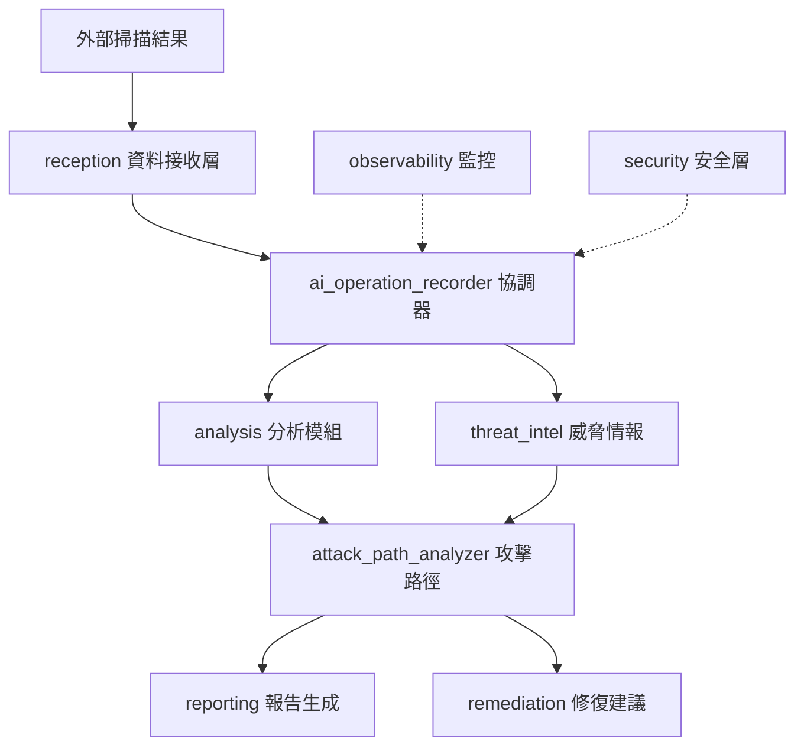

# AIVA Integration Core - 整合核心模組


> **AIVA Integration Core** 是整合模組的核心實現，包含 AI 操作記錄器、多功能分析引擎、威脅情報處理等關鍵組件。本模組實現了從資料接收到智能分析的完整工作流程。

---

## 📑 導航

- **🔗 [整合模組總覽](../README.md)** - 回到上層整合模組文檔
- **📊 [系統架構](#-系統架構)** - 核心架構說明
- **🧩 [核心組件](#-核心組件)** - 各子模組詳解
- **🚀 [快速開始](#-快速開始)** - 使用指南
- **🔧 [配置說明](#-配置說明)** - 配置參數
- **📚 [API 參考](#-api-參考)** - 核心 API

---

## 🏗️ 系統架構

### 檔案結構層次 (實際 7 層深度)

```
aiva_integration/                           # 第 1 層 - 核心模組根目錄
├── ai_operation_recorder.py               # AI 操作記錄器 (核心協調器)
├── app.py                                 # FastAPI 應用程式入口
├── settings.py                            # 配置管理
├── analysis/                              # 第 2 層 - 分析模組
│   ├── risk_assessment_engine.py          
│   ├── vuln_correlation_analyzer.py       
│   └── compliance_policy_checker.py       
├── reception/                             # 第 2 層 - 資料接收層
│   ├── unified_storage_adapter.py         # 統一存儲適配器
│   ├── experience_models.py               # 經驗學習模型
│   └── lifecycle_manager.py               # 資料生命週期管理
├── threat_intel/                          # 第 2 層 - 威脅情報
│   ├── threat_intel/                      # 第 3 層 - 威脅情報核心
│   │   ├── intel_aggregator.py            # 第 4 層 - 情報聚合器
│   │   ├── ioc_enricher.py                # 第 4 層 - IOC 豐富化
│   │   └── mitre_mapper.py                # 第 4 層 - MITRE 映射
│   └── __init__.py                        
├── attack_path_analyzer/                  # 第 2 層 - 攻擊路徑分析
│   ├── engine.py                          # 分析引擎
│   ├── graph_builder.py                   # 圖構建器
│   └── visualizer.py                      # 視覺化工具
├── reporting/                             # 第 2 層 - 報告生成
├── remediation/                           # 第 2 層 - 修復建議
├── security/                              # 第 2 層 - 安全模組
├── observability/                         # 第 2 層 - 可觀測性
└── examples/                              # 第 2 層 - 範例程式
```

### 核心工作流程



---

## 💾 資料儲存與配置

> **🎯 2025-11-16 更新**: 整合模組已完成資料儲存標準化，統一使用 `config.py` 管理所有路徑配置。

### 📂 統一配置系統

整合模組使用 `config.py` 集中管理所有資料儲存路徑和資料庫連線:

```python
from services.integration.aiva_integration.config import (
    # 資料儲存路徑
    INTEGRATION_DATA_DIR,        # 整合模組資料根目錄
    ATTACK_GRAPH_FILE,           # 攻擊路徑圖檔案 (NetworkX pickle)
    EXPERIENCE_DB_URL,           # 經驗資料庫 URL (SQLite)
    TRAINING_DATASET_DIR,        # 訓練資料集目錄
    MODEL_CHECKPOINT_DIR,        # 模型檢查點目錄
    
    # 資料庫連線
    POSTGRES_DSN,                # PostgreSQL 連線字串
    POSTGRES_CONFIG,             # PostgreSQL 配置字典
    
    # 備份配置
    BACKUP_DIR,                  # 備份根目錄
    BACKUP_RETENTION_DAYS,       # 備份保留策略
)
```

### 🗄️ 核心資料庫

#### 1. 攻擊路徑圖 (attack_graph.pkl)
- **類型**: NetworkX DiGraph
- **位置**: `data/integration/attack_paths/attack_graph.pkl`
- **用途**: 資產與漏洞關聯分析
- **更新**: ✅ Neo4j → NetworkX 遷移完成 (2025-11-16)

#### 2. 經驗資料庫 (experience.db)
- **類型**: SQLite 資料庫
- **位置**: `data/integration/experiences/experience.db`
- **表結構**: experience_records, training_datasets, dataset_samples, model_training_history
- **用途**: 經驗重放記憶體 (Experience Replay Memory)

### 🔧 使用範例

```python
# 攻擊路徑引擎 - 使用標準化配置
from services.integration.aiva_integration.attack_path_analyzer import AttackPathEngine
from services.integration.aiva_integration.config import ATTACK_GRAPH_FILE

engine = AttackPathEngine(graph_file=ATTACK_GRAPH_FILE)
paths = engine.find_attack_paths(target_node_type="Database")

# 經驗資料庫 - 使用標準化配置
from services.integration.aiva_integration.reception import ExperienceRepository
from services.integration.aiva_integration.config import EXPERIENCE_DB_URL

repo = ExperienceRepository(database_url=EXPERIENCE_DB_URL)
repo.save_experience(plan_id="...", attack_type="sqli", ...)
```

### 📚 詳細文檔

- 📖 **[資料儲存完整說明](../../../data/integration/README.md)** - 目錄結構、資料庫詳解
- 📖 **[維護腳本文檔](../scripts/README.md)** - 備份與清理工具
- 📖 **[建立報告](../../../reports/INTEGRATION_DATA_STORAGE_SETUP_REPORT.md)** - 完整建立過程

---

## 🧩 核心組件

### 🎯 **AI Operation Recorder** (核心協調器)
**位置**: `ai_operation_recorder.py`  
**功能**: 系統核心協調器，管理所有安全操作的生命週期

```python
from aiva_integration.ai_operation_recorder import AIOperationRecorder

# 初始化核心協調器
recorder = AIOperationRecorder()

# 記錄安全操作
operation_result = await recorder.record_operation({
    "operation_type": "vulnerability_scan",
    "target": "web_application",
    "scan_results": scan_data
})
```

**特點**:
- ✅ 統一操作記錄和追蹤
- ✅ 跨服務協調管理
- ✅ 效能監控和指標收集
- ✅ 支援統一環境變數配置

---

### 📊 **Analysis Module** (分析模組)
**位置**: `analysis/`  
**功能**: 風險評估、漏洞關聯分析、合規性檢查

#### 核心組件
- **`risk_assessment_engine.py`**: 風險評估引擎
- **`vuln_correlation_analyzer.py`**: 漏洞關聯分析器  
- **`compliance_policy_checker.py`**: 合規政策檢查器

```python
from aiva_integration.analysis import RiskAssessmentEngine

# 風險評估
risk_engine = RiskAssessmentEngine()
risk_score = await risk_engine.assess_vulnerability({
    "cve": "CVE-2023-1234",
    "asset_criticality": "high",
    "exposure_level": "external"
})
```

---

### 📨 **Reception Module** (資料接收層)
**位置**: `reception/`  
**功能**: 統一資料接收、存儲適配、經驗學習

#### 核心組件
- **`unified_storage_adapter.py`**: 統一存儲適配器 (支援 PostgreSQL+pgvector)
- **`experience_models.py`**: 機器學習經驗模型
- **`lifecycle_manager.py`**: 資料生命週期管理

```python
from aiva_integration.reception import UnifiedStorageAdapter

# 統一存儲使用
adapter = UnifiedStorageAdapter()
await adapter.store_scan_result({
    "scan_id": "scan_001",
    "findings": vulnerabilities,
    "metadata": scan_metadata
})
```

---

### 🛡️ **Threat Intelligence Module** (威脅情報)
**位置**: `threat_intel/threat_intel/`  
**功能**: 威脅情報聚合、IOC 豐富化、MITRE 映射

#### 7 層深度架構範例
```
threat_intel/
└── threat_intel/           # 第 3 層
    ├── intel_aggregator.py  # 第 4 層 - 情報聚合器
    ├── ioc_enricher.py      # 第 4 層 - IOC 豐富化
    └── mitre_mapper.py      # 第 4 層 - MITRE ATT&CK 映射
```

```python
from aiva_integration.threat_intel.threat_intel import IntelAggregator

# 威脅情報聚合
intel = IntelAggregator()
enriched_iocs = await intel.enrich_indicators([
    {"type": "ip", "value": "192.168.1.100"},
    {"type": "domain", "value": "malicious.example.com"}
])
```

---

### 🕸️ **Attack Path Analyzer** (攻擊路徑分析)
**位置**: `attack_path_analyzer/`  
**功能**: 攻擊路徑建模、圖形分析、視覺化

```python
from aiva_integration.attack_path_analyzer import AttackPathEngine

# 攻擊路徑分析
path_engine = AttackPathEngine()
attack_paths = await path_engine.analyze_attack_vectors({
    "entry_points": network_assets,
    "vulnerabilities": vuln_list,
    "target_assets": critical_systems
})
```

---

### 📋 **Reporting Module** (報告生成)
**位置**: `reporting/`  
**功能**: 多格式報告生成、模板管理

```python
from aiva_integration.reporting import ReportGenerator

# 生成報告
report_gen = ReportGenerator()
report = await report_gen.generate_security_report({
    "format": "pdf",
    "template": "executive_summary",
    "data": analysis_results
})
```

---

### 🔧 **Remediation Module** (修復建議)
**位置**: `remediation/`  
**功能**: 自動修復建議、補丁生成、配置推薦

```python
from aiva_integration.remediation import RemediationEngine

# 修復建議
remediation = RemediationEngine()
fixes = await remediation.suggest_remediation({
    "vulnerability": cve_details,
    "environment": system_context,
    "constraints": business_rules
})
```

---

## 🚀 快速開始

### 1. 環境準備
```bash
# 確保在 services/integration 目錄
cd services/integration

# 激活虛擬環境
source .venv/bin/activate  # Linux/Mac
# .venv\Scripts\activate     # Windows

# 安裝依賴
pip install -r requirements.txt
```

### 2. 配置檢查
```bash
# 檢查統一配置系統
python -c "
from aiva_integration.reception.unified_storage_adapter import UnifiedStorageAdapter
adapter = UnifiedStorageAdapter()
print('✅ 核心模組配置正常')
"
```

### 3. 基本使用
```python
from aiva_integration import AIOperationRecorder
from aiva_integration.analysis import RiskAssessmentEngine
from aiva_integration.reception import UnifiedStorageAdapter

async def main():
    # 初始化核心組件
    recorder = AIOperationRecorder()
    risk_engine = RiskAssessmentEngine()
    storage = UnifiedStorageAdapter()
    
    # 處理掃描結果
    scan_result = {
        "scan_id": "demo_scan_001",
        "vulnerabilities": [...]
    }
    
    # 記錄操作
    operation = await recorder.record_operation({
        "type": "vulnerability_processing",
        "data": scan_result
    })
    
    # 風險評估
    risk_scores = await risk_engine.batch_assess(
        scan_result["vulnerabilities"]
    )
    
    # 存儲結果
    await storage.store_analysis_result({
        "operation_id": operation.id,
        "risk_scores": risk_scores
    })
    
    print(f"✅ 處理完成，操作 ID: {operation.id}")

if __name__ == "__main__":
    import asyncio
    asyncio.run(main())
```

---

## 🔧 配置說明

### 統一環境變數系統
**主要配置文件**: `settings.py`

核心配置項與上層整合模組共享：
- `AIVA_POSTGRES_*`: PostgreSQL 資料庫配置
- `AIVA_REDIS_*`: Redis 快取配置  
- `AIVA_RABBITMQ_*`: 消息隊列配置
- `AIVA_NEO4J_*`: 圖資料庫配置

### 模組特定配置
```python
# settings.py 中的核心配置
class AIIntegrationSettings:
    # AI 操作記錄器配置
    AI_RECORDER_MAX_OPERATIONS = 10000
    AI_RECORDER_CLEANUP_INTERVAL = 3600
    
    # 分析引擎配置
    RISK_ASSESSMENT_THRESHOLD = 0.7
    VULN_CORRELATION_WINDOW = 86400
    
    # 威脅情報配置
    THREAT_INTEL_UPDATE_INTERVAL = 1800
    IOC_ENRICHMENT_TIMEOUT = 30
    
    # 攻擊路徑分析配置
    ATTACK_PATH_MAX_DEPTH = 10
    GRAPH_ANALYSIS_TIMEOUT = 300
```

---

## 📚 API 參考

### 核心 API 端點
**基礎路徑**: `/api/v1/integration/`

| 端點 | 方法 | 功能 | 範例 |
|------|------|------|------|
| `/operations` | POST | 記錄新操作 | `{"type": "scan", "data": {...}}` |
| `/operations/{id}` | GET | 獲取操作詳情 | 操作狀態和結果 |
| `/analysis/risk` | POST | 風險評估 | `{"vulnerabilities": [...]}` |
| `/threat-intel/enrich` | POST | IOC 豐富化 | `{"indicators": [...]}` |
| `/attack-paths/analyze` | POST | 攻擊路徑分析 | `{"assets": [...], "vulns": [...]}` |
| `/reports/generate` | POST | 生成報告 | `{"format": "pdf", "data": {...}}` |

### Python API 範例
```python
# 完整工作流程範例
async def security_analysis_workflow(scan_data):
    """完整的安全分析工作流程"""
    
    # 1. 記錄操作
    recorder = AIOperationRecorder()
    operation = await recorder.record_operation({
        "type": "comprehensive_analysis",
        "source": "automated_scan",
        "data": scan_data
    })
    
    # 2. 風險評估
    risk_engine = RiskAssessmentEngine()
    risk_results = await risk_engine.assess_batch(
        scan_data["vulnerabilities"]
    )
    
    # 3. 威脅情報豐富化
    threat_intel = IntelAggregator()
    enriched_data = await threat_intel.enrich_findings(
        risk_results
    )
    
    # 4. 攻擊路徑分析
    path_analyzer = AttackPathEngine()
    attack_paths = await path_analyzer.find_critical_paths(
        enriched_data
    )
    
    # 5. 生成報告和修復建議
    reporter = ReportGenerator()
    remediation = RemediationEngine()
    
    final_report = await reporter.generate_comprehensive_report({
        "operation_id": operation.id,
        "risk_analysis": risk_results,
        "threat_intelligence": enriched_data,
        "attack_paths": attack_paths,
        "remediation_plans": await remediation.generate_plans(
            attack_paths
        )
    })
    
    # 6. 完成操作記錄
    await recorder.complete_operation(operation.id, {
        "status": "completed",
        "report_id": final_report.id,
        "processing_time": final_report.processing_time
    })
    
    return final_report
```

---

---

## 🔧 開發規範與最佳實踐

### 📐 **aiva_common 修護規範遵循**

> **重要**: 本核心模組嚴格遵循 [aiva_common 修護規範](../../aiva_common/README.md#🔧-開發指南)，確保所有定義、枚舉引用及修復都在同一套標準之下。

#### ✅ **標準導入範例**

```python
# ✅ 正確 - 核心模組標準導入
from services.aiva_common.enums import (
    Severity,                # 風險評級 (CRITICAL, HIGH, MEDIUM, LOW)
    Confidence,              # 信心度 (CERTAIN, FIRM, POSSIBLE)
    TaskStatus,              # 任務狀態 (PENDING, RUNNING, COMPLETED)
    VulnerabilityType,       # 漏洞類型 (SQL_INJECTION, XSS, SSRF)
    AssetType,               # 資產類型 (URL, HOST, REPOSITORY)
)
from services.aiva_common.schemas import (
    FindingPayload,          # 發現結果標準格式
    CVSSv3Metrics,           # CVSS v3.1 標準評分
    SARIFResult,             # SARIF v2.1.0 報告格式
    AivaMessage,             # 統一訊息格式
)
```

#### � **嚴格禁止的做法**

```python
# ❌ 禁止 - 重複定義通用枚舉
class Severity(str, Enum):  # 錯誤!使用 aiva_common.Severity
    CRITICAL = "critical"

# ❌ 禁止 - 重複定義標準結構
class FindingPayload(BaseModel):  # 錯誤!使用 aiva_common.FindingPayload
    finding_id: str

# ❌ 禁止 - 自創評分標準
class CustomCVSS(BaseModel):  # 錯誤!使用 aiva_common.CVSSv3Metrics
    score: float
```

#### 🔍 **模組特定枚舉判斷標準**

只有滿足 **所有** 條件時，才允許在核心模組內定義專屬枚舉：

```python
# ✅ 允許 - 完全專屬於 AI Operation Recorder 的狀態
class OperationPhase(str, Enum):
    """AI 操作協調階段 - 僅用於內部協調邏輯"""
    INITIALIZATION = "initialization"
    COORDINATION = "coordination"
    SYNCHRONIZATION = "synchronization"
    COMPLETION = "completion"
    # 這些是 AI 操作記錄器內部的處理階段，不會跨模組使用

# ✅ 允許 - 高度技術專屬的配置
class StorageBackendType(str, Enum):
    """統一存儲適配器後端類型 - 僅用於內部配置"""
    POSTGRESQL_VECTOR = "postgresql_vector"
    ELASTICSEARCH = "elasticsearch"
    NEO4J_GRAPH = "neo4j_graph"
    # 這是存儲適配器的技術實現選擇，高度專屬
```

#### 📋 **開發檢查清單**

在核心模組開發時，請確認：

- [ ] **國際標準優先**: 優先使用 CVSS、SARIF、CVE、CWE 等官方標準
- [ ] **aiva_common 導入**: 所有通用概念都從 aiva_common 導入
- [ ] **無重複定義**: 確保沒有重複定義已存在的枚舉或 Schema
- [ ] **模組專用性**: 新定義的枚舉確實僅用於本模組內部
- [ ] **文檔完整性**: 所有自定義類型都有完整的 docstring 說明

#### 🛠️ **修復原則**

**保留未使用函數原則**: 在程式碼修復過程中，若發現有定義但尚未使用的函數或方法，只要不影響程式正常運作，建議予以保留。這些可能是預留的 API 介面或未來功能的基礎架構。

---

## 🔗 相關文檔

- **📖 [整合模組總覽](../README.md)** - 上層整合模組完整文檔
- **📐 [aiva_common 修護規範](../../aiva_common/README.md#🔧-開發指南)** - 標準開發規範
- **🏗️ [架構設計指南](../../../guides/architecture/)** - 系統架構設計說明
- **⚙️ [開發環境配置](../../../guides/development/DEVELOPMENT_QUICK_START_GUIDE.md)** - 完整配置參考
- **🧪 [測試策略](../../aiva_common/README.md#🧪-測試策略)** - 測試策略和範例
- **🚀 [部署指南](../../../guides/deployment/)** - 生產部署最佳實踐

---

**維護狀態**: ✅ 積極維護中  
**最後更新**: 2025-10-30  
**版本**: v2.0.0 (核心模組)