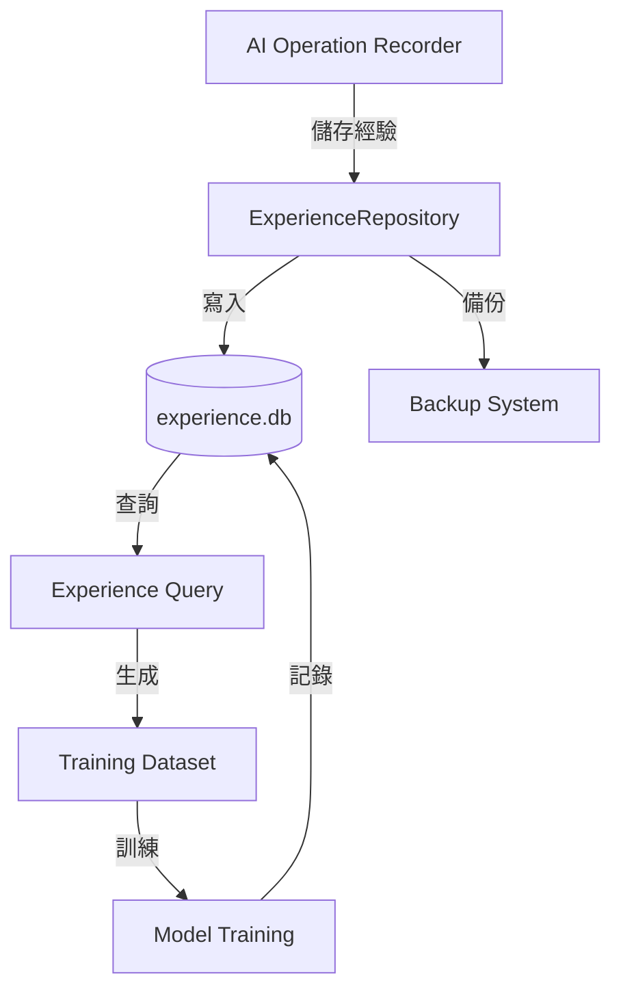

# Reception - 經驗資料庫管理層

> **✅ 2025-11-16 建立**: 經驗學習資料庫完整使用文檔

Experience Reception Layer - 負責儲存、管理、查詢 AI 操作的經驗記錄，支援經驗重放記憶體 (Experience Replay Memory) 功能。

## 🎯 核心功能

- **經驗儲存**: 儲存每次 AI 操作的完整執行記錄
- **經驗查詢**: 支援多維度查詢 (攻擊類型、成功率、時間範圍)
- **訓練資料集管理**: 自動生成訓練資料集並追蹤版本
- **模型訓練歷史**: 記錄模型訓練過程與超參數
- **資料生命週期**: 自動清理過期資料

## 📂 檔案結構

```
reception/
├── experience_models.py           # SQLAlchemy 資料模型
├── experience_repository.py       # 資料庫存取層 (Repository Pattern)
├── unified_storage_adapter.py     # 統一存儲適配器
├── lifecycle_manager.py           # 資料生命週期管理
├── data_reception_layer.py        # 資料接收層
├── models_enhanced.py             # 增強型模型
├── sql_result_database.py         # SQL 結果資料庫
└── README.md                      # 本文件
```

## 🗄️ 資料庫結構

### 資料庫位置
```python
from services.integration.aiva_integration.config import EXPERIENCE_DB_URL

# 預設位置: data/integration/experiences/experience.db
# SQLite 資料庫，支援多執行緒安全存取
```

### 核心資料表

#### 1. experience_records (經驗記錄表)
儲存每次 AI 操作的完整執行記錄。

```sql
CREATE TABLE experience_records (
    id INTEGER PRIMARY KEY AUTOINCREMENT,
    plan_id TEXT NOT NULL,              -- 計劃 ID (UUID)
    attack_type TEXT NOT NULL,          -- 攻擊類型 (sqli, xss, ...)
    target_info TEXT NOT NULL,          -- 目標資訊 (JSON)
    reconnaissance_data TEXT,           -- 偵察資料 (JSON)
    vulnerability_findings TEXT,        -- 漏洞發現 (JSON)
    exploitation_steps TEXT,            -- 利用步驟 (JSON)
    success_indicators TEXT,            -- 成功指標 (JSON)
    failure_reasons TEXT,               -- 失敗原因 (JSON)
    timestamp TIMESTAMP DEFAULT CURRENT_TIMESTAMP,
    metadata TEXT,                      -- 額外元數據 (JSON)
    created_at TIMESTAMP DEFAULT CURRENT_TIMESTAMP
);
```

#### 2. training_datasets (訓練資料集表)
追蹤生成的訓練資料集版本與元數據。

```sql
CREATE TABLE training_datasets (
    id INTEGER PRIMARY KEY AUTOINCREMENT,
    dataset_id TEXT UNIQUE NOT NULL,    -- 資料集 ID (UUID)
    name TEXT NOT NULL,                 -- 資料集名稱
    description TEXT,                   -- 描述
    version TEXT NOT NULL,              -- 版本號 (v1.0)
    file_path TEXT NOT NULL,            -- 檔案路徑
    format TEXT NOT NULL,               -- 格式 (jsonl, csv)
    total_samples INTEGER,              -- 樣本數量
    created_at TIMESTAMP DEFAULT CURRENT_TIMESTAMP,
    metadata TEXT                       -- 額外元數據 (JSON)
);
```

#### 3. dataset_samples (資料集樣本關聯表)
記錄訓練資料集與經驗記錄的關聯關係。

```sql
CREATE TABLE dataset_samples (
    id INTEGER PRIMARY KEY AUTOINCREMENT,
    dataset_id TEXT NOT NULL,           -- 資料集 ID
    experience_id INTEGER NOT NULL,     -- 經驗記錄 ID
    sample_index INTEGER,               -- 樣本索引
    created_at TIMESTAMP DEFAULT CURRENT_TIMESTAMP,
    FOREIGN KEY (experience_id) REFERENCES experience_records (id),
    FOREIGN KEY (dataset_id) REFERENCES training_datasets (dataset_id)
);
```

#### 4. model_training_history (模型訓練歷史表)
記錄模型訓練過程與超參數配置。

```sql
CREATE TABLE model_training_history (
    id INTEGER PRIMARY KEY AUTOINCREMENT,
    training_id TEXT UNIQUE NOT NULL,   -- 訓練 ID (UUID)
    dataset_id TEXT NOT NULL,           -- 使用的資料集 ID
    model_name TEXT NOT NULL,           -- 模型名稱
    hyperparameters TEXT NOT NULL,      -- 超參數 (JSON)
    metrics TEXT,                       -- 訓練指標 (JSON)
    checkpoint_path TEXT,               -- 檢查點路徑
    start_time TIMESTAMP,               -- 開始時間
    end_time TIMESTAMP,                 -- 結束時間
    status TEXT,                        -- 狀態 (running, completed, failed)
    created_at TIMESTAMP DEFAULT CURRENT_TIMESTAMP,
    FOREIGN KEY (dataset_id) REFERENCES training_datasets (dataset_id)
);
```

## 🔧 使用範例

### 1. 初始化資料庫

```python
from services.integration.aiva_integration.reception import ExperienceRepository
from services.integration.aiva_integration.config import EXPERIENCE_DB_URL

# 使用標準化配置
repo = ExperienceRepository(database_url=EXPERIENCE_DB_URL)

# 如果資料庫不存在，會自動建立所有資料表
```

### 2. 儲存經驗記錄

```python
from datetime import datetime

# 儲存一次完整的操作經驗
experience_id = repo.save_experience(
    plan_id="550e8400-e29b-41d4-a716-446655440000",
    attack_type="sqli",
    target_info={
        "url": "https://example.com/login",
        "method": "POST",
        "parameters": ["username", "password"]
    },
    reconnaissance_data={
        "discovered_endpoints": ["/login", "/api/user"],
        "technologies": ["PHP 7.4", "MySQL"]
    },
    vulnerability_findings={
        "vuln_type": "SQL Injection",
        "severity": "high",
        "location": "username parameter"
    },
    exploitation_steps=[
        {"step": 1, "action": "bypass_auth", "payload": "' OR '1'='1"},
        {"step": 2, "action": "dump_database", "result": "success"}
    ],
    success_indicators={
        "authenticated": True,
        "data_extracted": True,
        "access_level": "admin"
    },
    failure_reasons=None,  # 成功案例
    timestamp=datetime.now(),
    metadata={
        "execution_time_ms": 1523,
        "model_version": "v1.2.3"
    }
)

print(f"經驗記錄已儲存，ID: {experience_id}")
```

### 3. 查詢經驗記錄

```python
from datetime import datetime, timedelta

# 查詢最近 7 天的 SQL 注入經驗
recent_sqli = repo.query_experiences(
    attack_type="sqli",
    start_time=datetime.now() - timedelta(days=7),
    limit=50
)

# 查詢成功率最高的攻擊類型
for experience in recent_sqli:
    if experience.success_indicators:
        print(f"計劃 {experience.plan_id} 成功")
    else:
        print(f"計劃 {experience.plan_id} 失敗: {experience.failure_reasons}")

# 按計劃 ID 查詢單一記錄
experience = repo.get_experience_by_plan_id("550e8400-e29b-41d4-a716-446655440000")
```

### 4. 生成訓練資料集

```python
from services.integration.aiva_integration.config import TRAINING_DATASET_DIR
import json

# 生成訓練資料集
dataset_id = repo.create_training_dataset(
    name="SQLi Training Dataset v1.0",
    description="包含 100 個 SQL 注入成功與失敗案例",
    version="v1.0",
    experience_ids=[1, 2, 3, ..., 100],  # 選擇的經驗記錄 ID
    format="jsonl",
    output_dir=TRAINING_DATASET_DIR
)

print(f"訓練資料集已生成，ID: {dataset_id}")
print(f"檔案位置: {TRAINING_DATASET_DIR}/{dataset_id}.jsonl")
```

### 5. 記錄模型訓練

```python
from datetime import datetime

# 開始訓練
training_id = repo.start_model_training(
    dataset_id=dataset_id,
    model_name="AttackPlanGenerator_v2",
    hyperparameters={
        "learning_rate": 0.001,
        "batch_size": 32,
        "epochs": 50,
        "optimizer": "Adam"
    }
)

# 訓練過程中更新指標
repo.update_training_metrics(
    training_id=training_id,
    metrics={
        "epoch": 25,
        "train_loss": 0.023,
        "val_loss": 0.031,
        "accuracy": 0.94
    }
)

# 訓練完成
repo.complete_model_training(
    training_id=training_id,
    status="completed",
    final_metrics={
        "best_epoch": 47,
        "best_val_loss": 0.018,
        "final_accuracy": 0.97
    },
    checkpoint_path=f"{MODEL_CHECKPOINT_DIR}/AttackPlanGenerator_v2_epoch47.pt"
)
```

### 6. 資料生命週期管理

```python
from services.integration.aiva_integration.reception.lifecycle_manager import LifecycleManager
from services.integration.aiva_integration.config import EXPERIENCE_DB_URL

manager = LifecycleManager(database_url=EXPERIENCE_DB_URL)

# 清理 90 天前的經驗記錄
deleted_count = manager.cleanup_old_experiences(retention_days=90)
print(f"已清理 {deleted_count} 筆舊經驗記錄")

# 清理失敗的訓練記錄
manager.cleanup_failed_trainings(retention_days=30)

# 封存舊資料集
manager.archive_old_datasets(retention_days=180)
```

## 🔗 統一配置系統

所有資料庫路徑統一由 `config.py` 管理:

```python
from services.integration.aiva_integration.config import (
    EXPERIENCE_DB_URL,           # 經驗資料庫 URL
    TRAINING_DATASET_DIR,        # 訓練資料集目錄
    MODEL_CHECKPOINT_DIR,        # 模型檢查點目錄
    BACKUP_DIR,                  # 備份目錄
)

# 這些路徑可透過環境變數自訂 (.env):
# AIVA_EXPERIENCE_DB_URL=sqlite:///custom/path/experience.db
# AIVA_TRAINING_DATASET_DIR=C:/custom/datasets
# AIVA_MODEL_CHECKPOINT_DIR=C:/custom/models
```

## 🛠️ 維護與備份

### 自動備份

使用整合模組的備份腳本:

```powershell
# 備份經驗資料庫 (自動包含在 backup.py 中)
cd services/integration/scripts
python backup.py
```

### 資料庫檢視

```python
from services.integration.aiva_integration.reception import ExperienceRepository

repo = ExperienceRepository()

# 取得統計資訊
stats = repo.get_statistics()
print(f"總經驗記錄數: {stats['total_experiences']}")
print(f"攻擊類型分布: {stats['attack_type_distribution']}")
print(f"平均成功率: {stats['average_success_rate']:.2%}")
print(f"訓練資料集數: {stats['total_datasets']}")
```

## 📊 資料流向圖



## 🔗 相關文件

### 核心文檔
- 📖 **[整合模組總覽](../../README.md)** - 整合模組主文檔
- 📖 **[資料儲存說明](../../../../data/integration/README.md)** - 完整資料儲存結構
- 📖 **[Integration Core](../README.md)** - 核心模組實現
- 📖 **[Services 總覽](../../../README.md)** - 五大核心服務

### 配置與維護
- 📖 **[config.py 文檔](../config.py)** - 統一配置系統
- 📖 **[維護腳本文檔](../../scripts/README.md)** - 備份與清理工具
- 📖 **[建立報告](../../../../reports/INTEGRATION_DATA_STORAGE_SETUP_REPORT.md)** - 完整建立過程

### 開發指南
- 📖 **[Data Storage Guide](../../../../guides/development/DATA_STORAGE_GUIDE.md)** - 資料儲存總指南
- 📖 **[Attack Path Analyzer](../attack_path_analyzer/README.md)** - 攻擊路徑分析

## 📝 版本歷史

### v1.0 (2025-11-16)
- ✅ 初始文檔建立
- ✅ 完整資料表結構說明
- ✅ 使用範例與最佳實踐
- ✅ 統一配置系統整合

---

**維護**: Integration Team  
**最後更新**: 2025-11-16  
**版本**: v1.0
