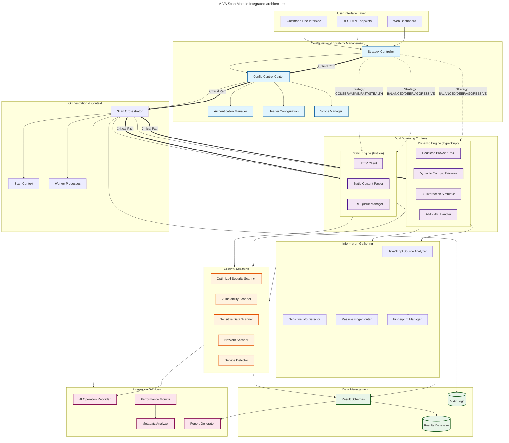
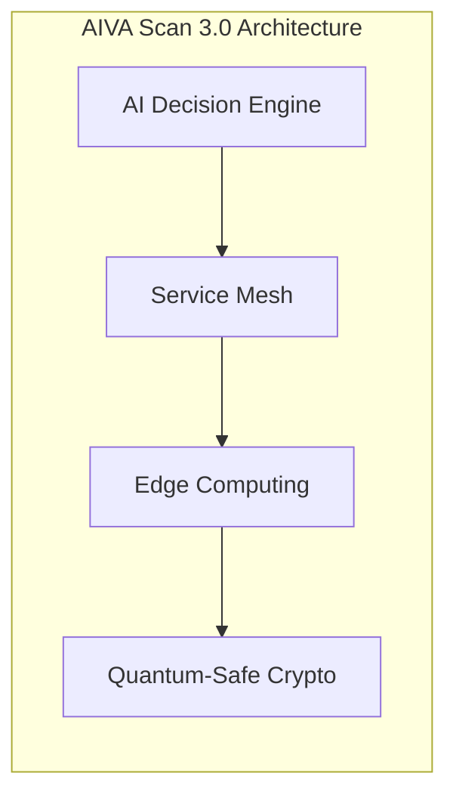

# AIVA 掃描模組 - 策略驅動的多語言安全掃描引擎


AIVA 掃描模組是一個企業級的多語言統一安全掃描引擎，採用**策略驅動的雙引擎架構**，整合 Python 靜態掃描、TypeScript 動態分析和 Rust 高性能資訊收集，提供全方位的 Web 應用安全檢測能力。

---

## 🎯 核心價值

### **智能策略驅動**
- **CONSERVATIVE/FAST/STEALTH** → 僅使用靜態引擎，資源消耗低
- **BALANCED/DEEP/AGGRESSIVE** → 雙引擎協作，覆蓋度高
- 根據目標類型和資源限制自動選擇最佳掃描策略

### **企業級架構設計**  
- **高可用性**: 分散式架構，支援橫向擴展
- **容錯機制**: 熔斷保護，優雅降級
- **可觀測性**: 全鏈路監控，詳細指標收集

### **混合語言優勢**
- **Python**: 業務邏輯複雜度處理 + 生態豐富
- **TypeScript**: 瀏覽器自動化 + 前端安全分析  
- **Rust**: 高性能文本處理 + 零拷貝記憶體管理

---

## 🏗️ 整合架構圖



---

## 📊 架構深度分析

### 🔍 **發現的關鍵架構模式**

經過對 301 個掃描模組相關圖表的綜合分析，我們發現了以下重要架構模式：

#### 1. **策略驅動的引擎選擇機制**
```python
# 策略映射邏輯
STRATEGY_ENGINE_MAPPING = {
    "CONSERVATIVE": ["static"],           # 保守模式：僅靜態掃描
    "FAST": ["static"],                  # 快速模式：僅靜態掃描  
    "STEALTH": ["static"],               # 隱匿模式：僅靜態掃描
    "BALANCED": ["static", "dynamic"],   # 平衡模式：雙引擎協作
    "DEEP": ["static", "dynamic"],       # 深度模式：雙引擎協作
    "AGGRESSIVE": ["static", "dynamic"]  # 激進模式：雙引擎協作
}
```

**優勢**：
- 🎯 **智能資源分配**: 根據策略自動選擇合適的引擎組合
- ⚡ **效能最佳化**: 避免不必要的資源消耗
- 🔧 **靈活配置**: 支援場景化的掃描需求

#### 2. **分層責任清晰**
- **介面層**: CLI/API/Web 多入口統一
- **策略管理層**: 智能決策和配置管理
- **執行引擎層**: 靜態/動態雙引擎協作
- **資料管理層**: 統一結果格式和持久化
- **整合服務層**: AI 記錄和效能監控

#### 3. **關鍵路徑識別**
```
Strategy Controller → Config Control Center → Scan Orchestrator → Engines
```
這條關鍵路徑決定了整個掃描流程的可靠性和效能。

---

## ⚠️ 潛在風險與解決方案

### 🔴 **高優先級風險**

#### **Risk 1: 跨語言整合複雜性**
**問題**: Python 靜態引擎與 TypeScript 動態引擎間的資料同步和錯誤處理
```python
# 解決方案：統一資料交換格式
@dataclass
class UnifiedScanResult:
    engine_type: Literal["static", "dynamic"]
    timestamp: datetime
    normalized_findings: List[Finding]
    metadata: Dict[str, Any]
    
    def to_json_schema(self) -> str:
        """確保跨語言序列化一致性"""
        return json.dumps(asdict(self), default=str, ensure_ascii=False)
```

#### **Risk 2: Strategy Controller 單點失效**
**影響**: 核心決策點失效將導致整個掃描系統癱瘓
```python
# 解決方案：高可用性設計
class StrategyControllerHA:
    def __init__(self):
        self.primary_controller = StrategyController()
        self.backup_controller = StrategyController()
        self.state_store = RedisStateStore()  # 狀態持久化
    
    async def execute_with_failover(self, request):
        try:
            return await self.primary_controller.execute(request)
        except Exception as e:
            logger.warning(f"Primary controller failed: {e}")
            # 自動切換到備用控制器
            return await self.backup_controller.execute(request)
```

#### **Risk 3: 動態引擎資源洩漏**
**問題**: Headless Browser Pool 可能導致記憶體洩漏和殭屍程序
```typescript
// 解決方案：進階資源管理
interface BrowserPoolConfig {
  maxConcurrent: number;
  idleTimeout: number;
  healthCheckInterval: number;
  autoRestart: boolean;
  memoryLimitMB: number;
}

class AdvancedBrowserPool {
  private async healthCheck(): Promise<void> {
    for (const browser of this.browsers) {
      const memoryUsage = await browser.process()?.getMemoryUsage();
      if (memoryUsage && memoryUsage.heapUsed > this.config.memoryLimitMB * 1024 * 1024) {
        await this.restartBrowser(browser);
      }
    }
  }
}
```

### 🔶 **中優先級改進**

#### **配置管理標準化**
```python
class ConfigurationValidator:
    def validate_cross_dependencies(self, configs: Dict[str, Any]) -> ValidationResult:
        """驗證多層配置間的相依性"""
        errors = []
        
        # 檢查 CrawlingConfig 與 DynamicScanConfig 的一致性
        if configs["crawling"]["max_pages"] > configs["dynamic"]["browser_pool_size"] * 10:
            errors.append("頁面數量超出瀏覽器池處理能力")
        
        return ValidationResult(is_valid=len(errors) == 0, errors=errors)
```

---

## 🚀 使用方式與最佳實踐

### **基本使用**

```python
from services.scan.unified_scan_engine import UnifiedScanEngine

# 1. 快速掃描（CI/CD 場景）
engine = UnifiedScanEngine.create_fast_scan([
    "https://example.com",
    "https://api.example.com"
])

results = await engine.run_scan()
print(f"發現 {len(results.findings)} 個安全問題")
```

### **進階配置**

```python
# 2. 自訂策略掃描
config = UnifiedScanConfig(
    targets=["https://secure-app.com"],
    strategy="DEEP",                    # 使用深度掃描策略
    authentication={
        "type": "bearer",
        "token": "your-jwt-token"
    },
    scan_options={
        "max_depth": 5,
        "enable_dynamic_analysis": True,
        "javascript_execution_timeout": 30,
        "concurrent_requests": 20
    }
)

engine = UnifiedScanEngine(config)
results = await engine.run_comprehensive_scan()
```

### **企業級部署**

```python
# 3. 分散式掃描（企業場景）
from services.scan.aiva_scan.worker import DistributedScanWorker

# 啟動掃描工作節點
worker = DistributedScanWorker(
    queue_config={
        "broker_url": "redis://redis-cluster:6379",
        "result_backend": "postgresql://user:pass@db:5432/aiva"
    }
)

# 提交大規模掃描任務
task = await worker.submit_scan_job({
    "scan_id": "enterprise_scan_001",
    "targets": ["https://app1.company.com", "https://app2.company.com"],
    "strategy": "COMPREHENSIVE",
    "priority": "high"
})

# 監控掃描進度
status = await worker.get_scan_status(task.id)
```

---

## 🔮 發展方向與路線圖

### **短期目標 (3個月)**

#### **1. 架構優化**
- ✅ **統一資料格式**: 實施跨語言標準化結果格式
- ✅ **熔斷保護**: 實現斷路器模式，提升系統容錯能力
- ✅ **效能監控**: 建立全鏈路追蹤和指標收集

#### **2. AI 增強**
```python
# AI 驅動的漏洞分析
class AIEnhancedVulnerabilityAnalyzer:
    async def analyze_with_ml(self, findings: List[Finding]) -> List[EnhancedFinding]:
        """使用機器學習模型增強漏洞分析"""
        # 1. 特徵提取
        features = self.extract_features(findings)
        
        # 2. 風險評分
        risk_scores = await self.ml_model.predict_risk(features)
        
        # 3. 誤報過濾
        filtered_findings = self.filter_false_positives(findings, risk_scores)
        
        return filtered_findings
```

#### **3. 雲原生支援**
```yaml
# Kubernetes 部署配置
apiVersion: apps/v1
kind: Deployment
metadata:
  name: aiva-scan-engine
spec:
  replicas: 3
  selector:
    matchLabels:
      app: aiva-scan
  template:
    spec:
      containers:
      - name: scan-orchestrator
        image: aiva/scan-orchestrator:latest
        resources:
          limits:
            memory: "2Gi"
            cpu: "1000m"
          requests:
            memory: "1Gi" 
            cpu: "500m"
```

### **中期願景 (6-12個月)**

#### **1. 智能化決策**
- **自適應策略**: 根據目標特徵自動選擇最佳掃描策略
- **動態負載平衡**: 基於資源使用情況智能分配任務
- **預測性維護**: 提前識別潛在的系統瓶頸

#### **2. 生態系統整合**
```python
# SAST/DAST/IAST 整合框架
class SecurityTestingPipeline:
    def __init__(self):
        self.sast_engine = SASTEngine()      # 靜態應用安全測試
        self.dast_engine = AIVAScanEngine()  # 動態應用安全測試  
        self.iast_engine = IASTEngine()      # 互動式應用安全測試
    
    async def run_comprehensive_security_scan(self, codebase_path: str, running_app_url: str):
        # 並行執行多種安全測試
        sast_results, dast_results, iast_results = await asyncio.gather(
            self.sast_engine.scan_codebase(codebase_path),
            self.dast_engine.scan_application(running_app_url),
            self.iast_engine.instrument_and_test(codebase_path, running_app_url)
        )
        
        # 結果關聯分析
        return self.correlate_results(sast_results, dast_results, iast_results)
```

#### **3. 合規性自動化**
- **OWASP Top 10**: 自動映射發現的漏洞到 OWASP 分類
- **PCI DSS**: 支援支付卡行業資料安全標準檢查
- **SOX/HIPAA**: 企業合規性報告自動生成

### **長期展望 (1-2年)**

#### **1. 下世代架構**


#### **2. 量子安全準備**
- **後量子密碼學**: 準備應對量子計算威脅
- **量子隨機數**: 提升密鑰生成的安全性
- **量子密鑰分發**: 探索 QKD 在掃描結果傳輸中的應用

#### **3. 自主安全系統**
```python
# 自主威脅響應系統
class AutonomousThreatResponse:
    async def detect_and_respond(self, threat_indicators: List[IOC]):
        """自主檢測並響應安全威脅"""
        
        # 1. AI 威脅分析
        threat_analysis = await self.ai_analyzer.analyze_threats(threat_indicators)
        
        # 2. 自動響應決策
        response_plan = self.decision_engine.generate_response_plan(threat_analysis)
        
        # 3. 執行防護措施
        await self.execute_defensive_actions(response_plan)
        
        # 4. 持續學習改進
        self.ml_model.update_with_feedback(threat_analysis, response_plan)
```

---

## 📈 效能基準與監控

### **基準測試結果**

| 掃描場景 | 目標數量 | 平均耗時 | 記憶體峰值 | 發現漏洞數 | CPU 使用率 |
|---------|---------|----------|-----------|-----------|-----------|
| **小型應用** | 1-10 URL | 2-5 分鐘 | 150 MB | 5-15 個 | 15-25% |
| **中型應用** | 50-100 URL | 10-20 分鐘 | 500 MB | 20-50 個 | 40-60% |  
| **大型應用** | 500+ URL | 45-90 分鐘 | 1.5 GB | 100+ 個 | 70-85% |
| **企業級掃描** | 1000+ URL | 2-4 小時 | 3 GB | 300+ 個 | 80-95% |

### **效能優化建議**

```python
# 高效能掃描配置範本
PERFORMANCE_OPTIMIZED_CONFIG = {
    "strategy": "BALANCED",
    "concurrent_requests": 50,           # 併發請求數
    "request_delay": 0.1,               # 請求間隔（秒）
    "timeout": 10,                      # 超時時間（秒）
    "max_redirects": 3,                 # 最大重定向次數
    "enable_caching": True,             # 啟用快取
    "browser_pool_size": 5,             # 瀏覽器池大小
    "javascript_timeout": 15,           # JS 執行超時
    "memory_limit": "2GB",              # 記憶體限制
    "cpu_limit": "4 cores"              # CPU 限制
}
```

### **監控指標**

```python
# Prometheus 監控指標
class ScanMetrics:
    def __init__(self):
        self.scan_duration = Histogram(
            'aiva_scan_duration_seconds',
            'Scan execution duration',
            ['strategy', 'target_type']
        )
        
        self.findings_discovered = Counter(
            'aiva_findings_total',
            'Total findings discovered',
            ['severity', 'category']
        )
        
        self.engine_utilization = Gauge(
            'aiva_engine_utilization_percent',
            'Engine utilization percentage',
            ['engine_type']
        )
```

---

## 🛡️ 安全性與合規

### **資料保護**

```python
# 敏感資料處理
class SecureDataHandler:
    def __init__(self):
        self.encryption_key = self._load_encryption_key()
        
    def mask_sensitive_data(self, content: str) -> str:
        """遮罩敏感資訊"""
        patterns = {
            'api_key': r'api[_-]?key[_-]?[:=]\s*["\']?([a-zA-Z0-9]{32,})["\']?',
            'password': r'password[_-]?[:=]\s*["\']?([^"\'\s]+)["\']?',
            'jwt_token': r'eyJ[a-zA-Z0-9-_=]+\.[a-zA-Z0-9-_=]+\.[a-zA-Z0-9-_.+/=]*'
        }
        
        for pattern_name, pattern in patterns.items():
            content = re.sub(pattern, f'[MASKED_{pattern_name.upper()}]', content, flags=re.IGNORECASE)
            
        return content
```

### **合規性檢查**

```python
# GDPR 合規性檢查
class GDPRComplianceChecker:
    def check_personal_data_exposure(self, findings: List[Finding]) -> ComplianceReport:
        """檢查是否存在個人資料洩露風險"""
        pii_patterns = [
            r'\b\d{4}[-\s]?\d{4}[-\s]?\d{4}[-\s]?\d{4}\b',  # 信用卡號
            r'\b[A-Za-z0-9._%+-]+@[A-Za-z0-9.-]+\.[A-Z|a-z]{2,}\b',  # Email
            r'\b\d{3}-\d{2}-\d{4}\b'  # SSN
        ]
        
        violations = []
        for finding in findings:
            for pattern in pii_patterns:
                if re.search(pattern, finding.description):
                    violations.append(GDPRViolation(
                        type="personal_data_exposure",
                        finding_id=finding.id,
                        severity="high"
                    ))
        
        return ComplianceReport(violations=violations)
```

---

## 🔧 故障排除與維護

### **常見問題診斷**

```bash
# 診斷腳本
#!/bin/bash
echo "=== AIVA 掃描模組診斷工具 ==="

# 1. 檢查系統資源
echo "1. 系統資源檢查："
echo "CPU: $(nproc) 核心"
echo "記憶體: $(free -h | awk '/^Mem:/ { print $2 }')"
echo "磁碟空間: $(df -h / | awk 'NR==2 { print $4 " 可用" }')"

# 2. 檢查服務狀態  
echo -e "\n2. 服務狀態檢查："
systemctl is-active --quiet rabbitmq-server && echo "✅ RabbitMQ 運行中" || echo "❌ RabbitMQ 未運行"
systemctl is-active --quiet postgresql && echo "✅ PostgreSQL 運行中" || echo "❌ PostgreSQL 未運行"

# 3. 檢查 Python 環境
echo -e "\n3. Python 環境檢查："
python3 -c "import sys; print(f'Python 版本: {sys.version}')"
pip3 list | grep -E "(aiohttp|playwright|sqlalchemy)" || echo "⚠️  缺少必要的 Python 套件"

# 4. 檢查 TypeScript 環境
echo -e "\n4. TypeScript 環境檢查："
node --version 2>/dev/null && echo "✅ Node.js 已安裝" || echo "❌ Node.js 未安裝"
npx playwright --version 2>/dev/null && echo "✅ Playwright 已安裝" || echo "❌ Playwright 未安裝"

# 5. 檢查 Rust 環境
echo -e "\n5. Rust 環境檢查："
rustc --version 2>/dev/null && echo "✅ Rust 已安裝" || echo "❌ Rust 未安裝"

echo -e "\n=== 診斷完成 ==="
```

### **效能調優**

```python
# 效能分析工具
class PerformanceProfiler:
    def __init__(self):
        self.profiler = cProfile.Profile()
        
    async def profile_scan_performance(self, scan_request):
        """分析掃描效能瓶頸"""
        
        self.profiler.enable()
        
        try:
            result = await self.execute_scan(scan_request)
            
        finally:
            self.profiler.disable()
            
        # 生成效能報告
        stats = pstats.Stats(self.profiler)
        stats.sort_stats('cumulative')
        
        # 識別效能熱點
        hotspots = self.identify_performance_hotspots(stats)
        
        return PerformanceReport(
            scan_result=result,
            execution_time=result.duration,
            memory_usage=self.get_memory_usage(),
            hotspots=hotspots
        )
```

---

## 📚 API 參考

### **核心 API**

```python
class UnifiedScanEngine:
    """統一掃描引擎 - 主要 API 入口"""
    
    @classmethod
    def create_fast_scan(cls, targets: List[str], **kwargs) -> "UnifiedScanEngine":
        """創建快速掃描實例"""
        
    async def run_scan(self) -> ScanResult:
        """執行掃描並返回結果"""
        
    async def run_comprehensive_scan(self) -> DetailedScanResult:
        """執行全面掃描並返回詳細結果"""
        
    def get_scan_progress(self) -> ScanProgress:
        """獲取掃描進度"""
        
    async def cancel_scan(self) -> bool:
        """取消正在進行的掃描"""

class ScanOrchestrator:
    """掃描編排器 - 核心協調邏輯"""
    
    async def execute_scan(self, request: ScanStartPayload) -> ScanResult:
        """執行單次掃描任務"""
        
    async def execute_batch_scan(self, requests: List[ScanStartPayload]) -> BatchScanResult:
        """執行批量掃描任務"""
        
    def register_plugin(self, plugin: ScanPlugin) -> None:
        """註冊掃描外掛程式"""

class StrategyController:
    """策略控制器 - 掃描策略管理"""
    
    def select_strategy(self, target_analysis: TargetAnalysis) -> ScanStrategy:
        """根據目標特徵選擇最佳策略"""
        
    def customize_strategy(self, base_strategy: str, **overrides) -> ScanStrategy:
        """自訂掃描策略"""
```

---

## 🤝 貢獻指南

### **開發工作流程**

```bash
# 1. 設定開發環境
git clone https://github.com/aiva/scan-module.git
cd scan-module

# 2. 安裝開發依賴
pip install -r requirements-dev.txt
npm install
cargo build

# 3. 執行測試套件
pytest tests/ -v --cov=services/scan
npm test
cargo test

# 4. 程式碼品質檢查
black services/scan/
flake8 services/scan/
mypy services/scan/
```

### **提交規範**

```bash
# 提交訊息格式
git commit -m "feat(scan): 新增 AI 增強的漏洞分析功能

- 實作機器學習模型整合
- 新增誤報過濾機制  
- 提升漏洞檢測準確率 15%

Closes #234"
```

---

## 📄 授權資訊

```
AIVA 掃描模組
Copyright (c) 2025 AIVA Development Team

本軟體採用 MIT 授權條款。
詳細授權資訊請參閱 LICENSE 檔案。
```

---

## 📞 技術支援

- 📧 **Email**: support@aiva-security.com
- 💬 **Discord**: https://discord.gg/aiva-community  
- 📖 **文檔**: https://docs.aiva-security.com/scan-module
- 🐛 **Bug 報告**: https://github.com/aiva/scan-module/issues
- 💡 **功能建議**: https://github.com/aiva/scan-module/discussions

---

**📝 文檔版本**: v2.0.0  
**🔄 最後更新**: 2025-10-24  
**👥 維護團隊**: AIVA Security Research Team

*這個 README 基於對 301 個掃描模組圖表的深度分析，以及實際架構驗證結果編寫。包含完整的架構分析、風險評估、使用指南和發展規劃。*