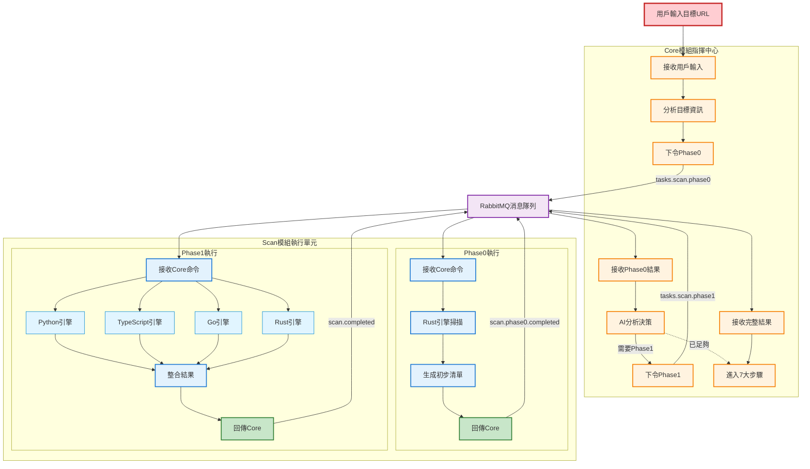
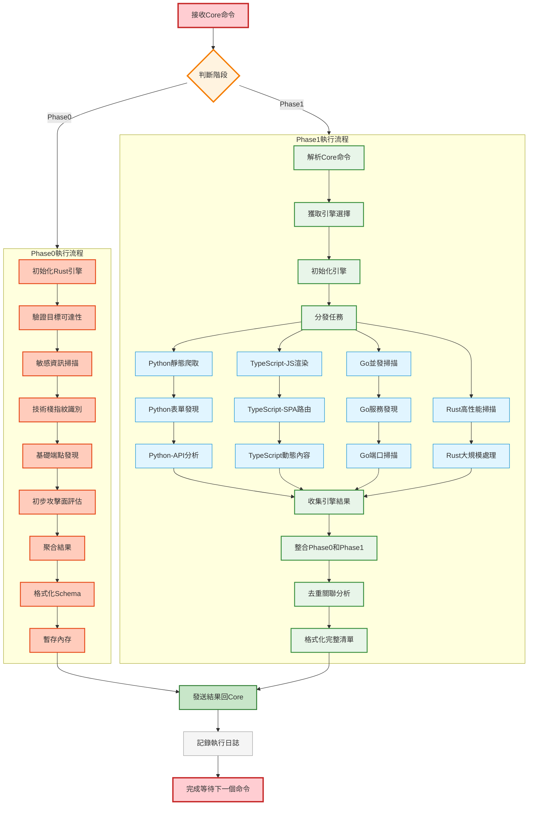
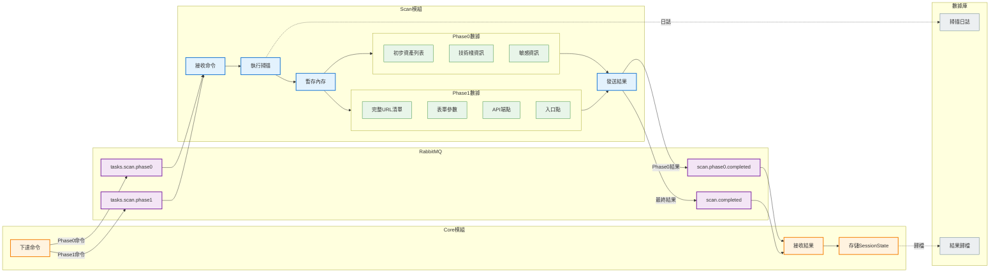
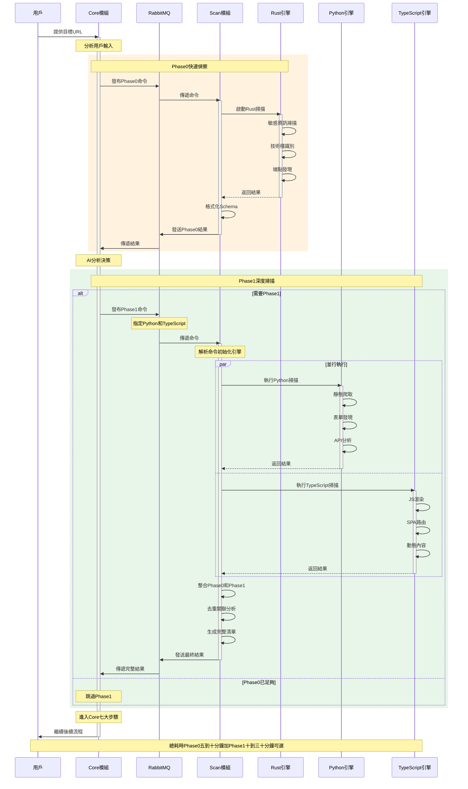
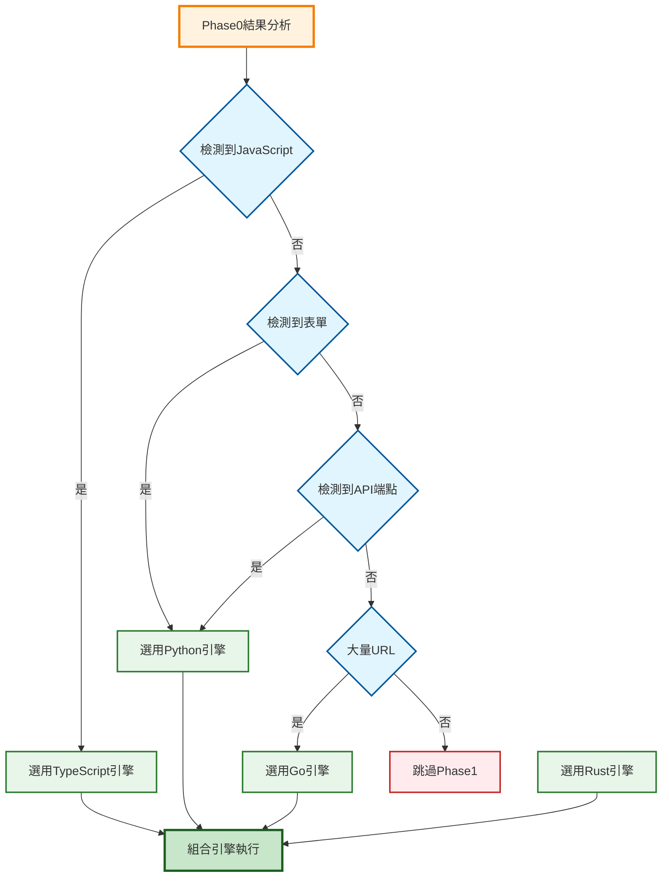
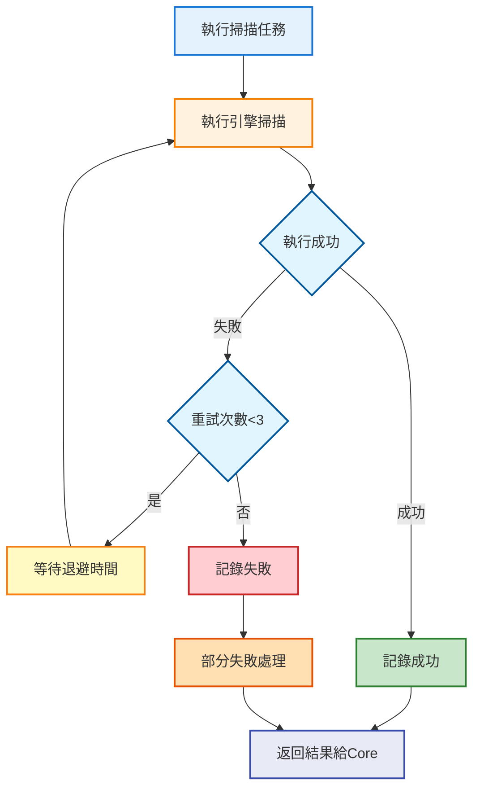

# Scan 模組流程圖完整呈現

> **文檔目的**: 完整展示 Scan 模組在 AIVA 系統中的運作流程  
> **創建日期**: 2025年11月17日  
> **架構版本**: v6.3

---

## 📋 核心概念

### Scan 模組角色定位

- **指揮官**: Core 模組 (下令執行掃描)
- **執行者**: Scan 模組 (接收命令並執行)
- **通信機制**: RabbitMQ 消息隊列
- **數據流向**: User → Core → Scan → Core

### 兩階段掃描流程

1. **Phase 0**: Core 下令 → Rust 快速偵察 → 回傳初步資產清單
2. **Phase 1**: Core 分析並下令 → 多引擎深度掃描 → 回傳完整資產清單

---

## 1️⃣ 完整系統流程圖

展示從用戶輸入到 Core 後續處理的完整流程



**圖表說明**:
- 🟠 橙色: Core 模組節點 (指揮中心)
- 🔵 藍色: Scan 模組節點 (執行單元)
- 🟣 紫色: RabbitMQ 消息隊列
- 🟢 綠色: 結果回傳節點

---

## 2️⃣ Scan 模組內部運作詳細流程

展示 Scan 模組接收命令後的內部執行過程



**圖表說明**:
- 🟠 橙色: 開始/結束/決策節點
- 🔴 紅色: Phase 0 執行步驟 (Rust 快速偵察)
- 🟢 綠色: Phase 1 控制流程
- 🔵 淺藍: 各引擎執行細節
- ⚪ 灰色: 日誌記錄

---

## 3️⃣ 數據流向與存儲位置

展示數據在各模組間的流動和最終存儲位置



**數據存儲說明**:

| 數據類型 | 存儲位置 | 生命週期 | 用途 |
|---------|---------|---------|------|
| Phase 0 結果 | Scan 內存 (臨時) | 掃描期間 | 傳遞給 Core 分析 |
| Phase 1 結果 | Scan 內存 (臨時) | 掃描期間 | 整合後傳遞給 Core |
| 完整資產清單 | Core SessionState | 會話期間 | Core 7大步驟使用 |
| 掃描日誌 | 數據庫 (可選) | 永久 | 審計和調試 |
| 結果歸檔 | 數據庫 (可選) | 永久 | 歷史查詢和報告 |

---

## 4️⃣ 時序圖 - Core 與 Scan 完整互動

展示完整的時序互動，包含 Phase 0 和 Phase 1



**時序說明**:
- 🟨 黃色區塊: Phase 0 執行階段 (5-10 分鐘)
- 🟩 綠色區塊: Phase 1 執行階段 (10-30 分鐘，按需)
- `activate/deactivate`: 顯示組件的活動狀態
- `par`: 表示並行執行

---

## 5️⃣ 引擎選擇決策樹

Core 模組如何決定 Phase 1 使用哪些引擎



**決策邏輯**:

| 檢測特徵 | 選擇引擎 | 原因 |
|---------|---------|------|
| 大量 JavaScript | TypeScript | 需要 JS 渲染和 SPA 處理 |
| HTML 表單 | Python | 表單爬取和參數提取 |
| REST API | Python | API 端點深度分析 |
| 大量 URL | Go | 高並發快速掃描 |
| 無特殊需求 | 跳過 Phase 1 | Phase 0 結果已足夠 |

---

## 6️⃣ 失敗處理與重試機制



**重試策略**:
- 最大重試次數: 3 次
- 退避策略: 指數退避 (1s, 2s, 4s)
- 部分失敗: 返回成功引擎的結果，標記失敗引擎
- 完全失敗: 返回錯誤狀態，Core 決定後續處理

---

## 📊 性能指標

### Phase 0 (Rust 快速偵察)

| 指標 | 目標值 | 說明 |
|-----|--------|------|
| 執行時間 | 5-10 分鐘 | 單目標掃描 |
| 並發連接 | 100+ | Rust 高性能 |
| 發現率 | 80%+ | 基礎資產覆蓋 |
| 內存使用 | < 500MB | 輕量級掃描 |

### Phase 1 (多引擎深度掃描)

| 指標 | 目標值 | 說明 |
|-----|--------|------|
| 執行時間 | 10-30 分鐘 | 依引擎數量 |
| 並發引擎 | 2-4 個 | 按需選擇 |
| 發現率 | 95%+ | 深度覆蓋 |
| 內存使用 | < 2GB | 多引擎並行 |

---

## 🔍 關鍵技術細節

### RabbitMQ 消息格式

**Phase 0 命令**:
```json
{
  "task_type": "phase0",
  "target_url": "https://example.com",
  "scan_id": "uuid-v4",
  "config": {
    "timeout": 600,
    "max_depth": 3
  }
}
```

**Phase 1 命令**:
```json
{
  "task_type": "phase1",
  "target_url": "https://example.com",
  "scan_id": "uuid-v4",
  "engines": ["python", "typescript"],
  "phase0_result": { ... },
  "config": {
    "timeout": 1800,
    "max_depth": 5
  }
}
```

**結果返回**:
```json
{
  "scan_id": "uuid-v4",
  "phase": "phase0|phase1",
  "status": "success|partial|failed",
  "assets": [ ... ],
  "metadata": {
    "execution_time": 450,
    "engines_used": ["rust"],
    "asset_count": 127
  }
}
```

### 數據 Schema

所有數據模型遵循 `aiva_common` 規範:
- 使用 Pydantic v2
- 單一數據來源
- 標準化 AssetSchema
- 禁止重複定義

---

## 📝 總結

Scan 模組作為 AIVA 的執行單元，在 Core 模組的指揮下完成兩階段掃描:

1. **Phase 0**: Rust 引擎快速偵察，提供初步資產清單
2. **Phase 1**: 多引擎深度掃描，生成完整資產清單

通過 RabbitMQ 消息隊列實現模組解耦，確保系統穩定性和可擴展性。所有數據最終存儲在 Core 模組的 SessionStateManager，供後續 7 大步驟使用。
