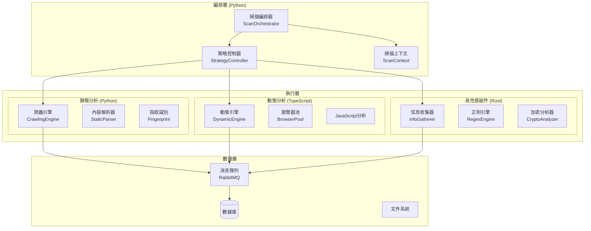

# 🔍 AIVA 掃描模組完整指南

> **版本**: 1.0  
> **更新時間**: 2025-10-17  
> **狀態**: 已清理並準備開發

---

## ⚠️ **重要：開發前必讀架構原則**

### 🏛️ 統一架構標準

**在進行任何開發前，必須先確認以下核心架構組件：**

#### 1. 官方 Schema 定義檢查
```bash
# 必須先檢查官方 Schema 是否最新
ls -la services/aiva_common/schemas/
ls -la services/aiva_common/enums/
```

**核心 Schema 文件**:
- `services/aiva_common/schemas/` - 官方數據結構定義
  - `assets.py` - 資產定義
  - `findings.py` - 發現結果結構  
  - `security.py` - 安全相關結構
  - `tasks.py` - 任務定義
  - `telemetry.py` - 遙測數據
- `services/aiva_common/enums/` - 官方枚舉定義
  - `security.py` - 安全相關枚舉
  - `assets.py` - 資產類型枚舉
  - `modules.py` - 模組相關枚舉

#### 2. 架構一致性原則 🔒

| 原則 | 要求 | 檢查點 |
|------|------|--------|
| **官方優先** | 有官方定義的必須使用官方版本 | ✅ 檢查 `aiva_common` 中是否已存在 |
| **避免衝突** | 自定義前必須確認不與官方衝突 | ✅ 名稱、結構、用途都不能重複 |
| **完全一致** | 所有模組使用相同定義 | ✅ 不允許同一概念的不同實現 |
| **語言規範** | 跨語言時遵循各語言規範 | ✅ TypeScript/Rust 按各自慣例 |
| **強制插件** | 使用格式化和檢查插件 | ✅ ESLint、rustfmt、Black等 |

#### 3. 開發流程檢查清單 ✅

**新增功能前必須執行：**

```bash
# 1. 檢查官方 Schema 更新
git pull origin main
cd services/aiva_common && git log --oneline -10

# 2. 確認無新增需求
grep -r "TODO\|FIXME\|XXX" services/aiva_common/

# 3. 檢查是否有相關定義
find services/aiva_common/ -name "*.py" -exec grep -l "YourNewConcept" {} \;

# 4. 驗證插件配置
# Python: Black + isort + mypy
# TypeScript: ESLint + Prettier + TypeScript strict
# Rust: rustfmt + clippy
```

**⚠️ 違反架構原則的後果：**
- 🚫 代碼審查被拒絕
- 🚫 集成測試失敗  
- 🚫 部署被阻止
- 🚫 數據不一致問題

---

## 📋 目錄

1. [架構原則](#⚠️-重要開發前必讀架構原則) *(已閱讀)*
2. [現況概覽](#📊-現況概覽)
3. [技術架構](#🏗️-技術架構)
4. [核心組件](#⚙️-核心組件)
5. [開發路線圖](#🚀-開發路線圖)
6. [修改注意事項](#⚠️-修改注意事項)
7. [部署指南](#🚀-部署指南)
8. [故障排除](#🔧-故障排除)

---

## 📊 現況概覽

### 模組狀態
- **總文件數**: 57個（已清理 node_modules）
- **主要語言**: Python (核心) + TypeScript (動態) + Rust (高性能)
- **架構狀態**: 多語言混合架構，模組化設計
- **開發階段**: 基礎架構完成，功能開發中

### 文件結構
```
services/scan/
├── aiva_scan/               # Python 核心掃描引擎 (35 files)
│   ├── core_crawling_engine/    # 爬蟲引擎
│   ├── dynamic_engine/          # 動態分析引擎
│   ├── info_gatherer/          # 信息收集
│   ├── scan_orchestrator.py    # 掃描編排器 (核心)
│   ├── strategy_controller.py  # 策略控制器
│   └── ...                    # 其他專用模組
├── aiva_scan_node/         # TypeScript 動態掃描 (6 files)
│   ├── src/                    # TypeScript 源碼
│   ├── package.json           # Node.js 配置
│   └── tsconfig.json          # TypeScript 配置
├── info_gatherer_rust/     # Rust 高性能收集器 (7 files)
│   ├── src/                   # Rust 源碼
│   ├── Cargo.toml            # Rust 配置
│   └── Cargo.lock            # 依賴鎖定
├── discovery_schemas.py    # 發現模式定義
├── models.py              # 數據模型
└── __init__.py           # 模組初始化
```

---

## 🏗️技術架構

### 多語言分層架構



### 語言職責分配

| 語言 | 職責範圍 | 性能特點 | 適用場景 |
|------|----------|----------|----------|
| **Python** | 編排、業務邏輯、AI集成 | 中等性能、開發快速 | 主控制流程、策略決策 |
| **TypeScript** | 動態分析、瀏覽器控制 | 中高性能、異步處理 | JavaScript執行、DOM操作 |
| **Rust** | 高性能計算、模式匹配 | 極高性能、內存安全 | 大量數據處理、安全分析 |

---

## ⚙️ 核心組件

### 1. 掃描編排器 (ScanOrchestrator)
**文件**: `aiva_scan/scan_orchestrator.py`

**職責**:
- 統一管理掃描流程
- 協調各子引擎
- 處理掃描生命週期

**核心方法**:
```python
class ScanOrchestrator:
    async def start_scan(self, payload: ScanStartPayload) -> str
    async def process_asset(self, asset: Asset) -> Summary
    async def complete_scan(self, scan_id: str) -> ScanCompletedPayload
```

### 2. 策略控制器 (StrategyController)
**文件**: `aiva_scan/strategy_controller.py`

**職責**:
- 掃描策略選擇
- 參數配置管理
- 性能優化控制

### 3. 多引擎架構

#### 3.1 靜態爬蟲引擎 (Python)
**目錄**: `aiva_scan/core_crawling_engine/`

**組件**:
- `HiHttpClient`: 高性能 HTTP 客戶端
- `StaticContentParser`: 靜態內容解析
- `UrlQueueManager`: URL 隊列管理

#### 3.2 動態分析引擎 (TypeScript)
**目錄**: `aiva_scan_node/src/`

**特性**:
- Playwright 瀏覽器自動化
- JavaScript 運行時分析
- DOM 動態變化檢測

**技術棧**:
```json
{
  "核心依賴": {
    "playwright": "^1.56.1",
    "amqplib": "^0.10.5",
    "pino": "^9.0.0"
  },
  "開發工具": {
    "typescript": "^5.7.2",
    "tsx": "^4.19.0",
    "vitest": "^2.0.0"
  }
}
```

#### 3.3 信息收集器 (Rust)
**目錄**: `info_gatherer_rust/src/`

**性能特點**:
- 極高性能正則匹配
- 並行處理能力
- 低內存占用

**技術棧**:
```toml
[主要依賴]
regex = "1.11"         # 正則引擎
rayon = "1.10"         # 並行處理
lapin = "2.5"          # RabbitMQ 客戶端
serde_json = "1.0"     # JSON 序列化
```

### 4. 專用管理器

#### 4.1 認證管理器 (AuthenticationManager)
- 多種認證方式支持
- 會話管理
- 憑證存儲

#### 4.2 指紋管理器 (FingerprintManager)
- 技術棧識別
- 版本檢測
- 安全配置分析

#### 4.3 敏感數據掃描器 (SensitiveDataScanner)
- 密鑰檢測
- 個人信息識別
- 配置洩露檢查

---

## 🚀 開發路線圖

### Phase 1: 基礎架構完善 (已完成 ✅)
- [x] 多語言架構設計
- [x] 核心組件實現
- [x] 文件清理和組織
- [x] 基本配置建立

### Phase 2: 功能增強 (進行中 🔄)
- [ ] **攻擊模式整合**: 將 AttackPatternTrainer 集成到掃描流程
- [ ] **智能策略**: 基於 AI 的掃描策略選擇
- [ ] **性能優化**: Rust 組件的進一步優化
- [ ] **錯誤處理**: 完善的異常處理機制

### Phase 3: 高級功能 (計劃中 📋)
- [ ] **實時威脅檢測**: 整合即時威脅分析
- [ ] **自適應掃描**: 根據目標特點調整策略
- [ ] **報告生成**: 綜合性安全報告
- [ ] **API 擴展**: RESTful API 接口

### Phase 4: 企業級特性 (未來 🔮)
- [ ] **集群部署**: 分佈式掃描能力
- [ ] **監控儀表板**: 實時監控界面
- [ ] **插件系統**: 可擴展的插件架構
- [ ] **合規檢查**: 符合安全標準的檢查

---

## ⚠️ 修改注意事項

### 🏛️ **架構一致性要求（最高優先級）**

#### 1. Schema 使用規範

**✅ 正確的 Schema 使用流程**:
```python
# 1. 首先檢查官方 Schema
from ..aiva_common.schemas.findings import VulnerabilityFinding
from ..aiva_common.enums.security import VulnerabilityType, SeverityLevel

# 2. 確認是否有需要的定義
if VulnerabilityType.SQL_INJECTION in VulnerabilityType:
    # 使用官方定義
    finding = VulnerabilityFinding(
        vulnerability_type=VulnerabilityType.SQL_INJECTION,
        severity=SeverityLevel.HIGH
    )

# ❌ 錯誤：重新定義已存在的概念
class MyVulnerabilityType(Enum):
    SQL_INJECTION = "sql_injection"  # 與官方衝突！
```

**🔍 Schema 檢查命令**:
```bash
# 檢查是否已有相關定義
grep -r "VulnerabilityType\|AttackPattern" services/aiva_common/
grep -r "ScanResult\|Finding" services/aiva_common/schemas/
```

#### 2. 跨語言一致性

**Python** (使用 dataclass + typing):
```python
from dataclasses import dataclass
from typing import List, Optional
from ..aiva_common.schemas.base import BaseSchema

@dataclass
class ScanRequest(BaseSchema):
    target_url: str
    scan_types: List[str]
    timeout_seconds: Optional[int] = 300
```

**TypeScript** (使用 interface + zod):
```typescript
// 必須與 Python Schema 保持一致
interface ScanRequest {
  targetUrl: string;           // snake_case -> camelCase
  scanTypes: string[];
  timeoutSeconds?: number;     // Optional 用 ?
}

// 使用 zod 進行運行時驗證
import { z } from 'zod';

const ScanRequestSchema = z.object({
  targetUrl: z.string().url(),
  scanTypes: z.array(z.string()),
  timeoutSeconds: z.number().optional().default(300)
});
```

**Rust** (使用 serde + 結構體):
```rust
use serde::{Deserialize, Serialize};

#[derive(Debug, Serialize, Deserialize)]
#[serde(rename_all = "snake_case")]  // 保持與 Python 一致
pub struct ScanRequest {
    pub target_url: String,
    pub scan_types: Vec<String>,
    #[serde(default = "default_timeout")]
    pub timeout_seconds: u32,
}

fn default_timeout() -> u32 { 300 }
```

#### 3. 強制插件配置

**Python 項目配置**:
```toml
# pyproject.toml
[tool.black]
line-length = 88
target-version = ['py311']

[tool.isort]
profile = "black"
src_paths = ["services", "tools"]

[tool.mypy]
python_version = "3.11"
strict = true
warn_return_any = true
```

**TypeScript 項目配置**:
```json
// .eslintrc.json
{
  "extends": [
    "@typescript-eslint/recommended",
    "prettier"
  ],
  "rules": {
    "@typescript-eslint/no-unused-vars": "error",
    "@typescript-eslint/explicit-function-return-type": "warn"
  }
}

// tsconfig.json
{
  "compilerOptions": {
    "strict": true,
    "noUnusedLocals": true,
    "noUnusedParameters": true
  }
}
```

**Rust 項目配置**:
```toml
# Cargo.toml
[lints.rust]
unused_variables = "deny"
dead_code = "deny"

[lints.clippy]
all = "warn"
pedantic = "warn"
```

#### 4. 開發前檢查腳本

創建標準化檢查腳本：
```bash
#!/bin/bash
# scripts/pre_development_check.sh

echo "🔍 執行開發前架構檢查..."

# 1. 檢查官方 Schema 更新
echo "檢查官方 Schema 更新..."
cd services/aiva_common
git log --oneline -5 -- schemas/ enums/

# 2. 檢查是否有新增需求
echo "檢查待辦事項..."
grep -r "TODO\|FIXME\|XXX" schemas/ enums/ || echo "✅ 無待辦事項"

# 3. 驗證格式化工具
echo "驗證格式化工具..."
which black isort mypy || echo "❌ Python 工具缺失"
which npx || echo "❌ Node.js 工具缺失" 
which cargo || echo "❌ Rust 工具缺失"

echo "✅ 架構檢查完成，可以開始開發"
```

### 🔒 關鍵原則

#### 1. 保持語言職責清晰
```python
# ✅ 正確: Python 負責編排邏輯
class ScanOrchestrator:
    async def coordinate_scan(self):
        # 調用不同語言的組件
        await self.rust_analyzer.analyze()
        await self.node_engine.process()
        
# ❌ 錯誤: Python 做高性能計算
def heavy_regex_processing(large_data):
    # 這應該交給 Rust 處理
    pass
```

#### 2. 異步編程最佳實踐
```python
# ✅ 正確: 使用異步上下文管理器
async with ScanContext(scan_id) as ctx:
    result = await orchestrator.process_asset(asset)
    
# ❌ 錯誤: 阻塞式調用
result = orchestrator.process_asset_sync(asset)  # 會阻塞整個事件循環
```

#### 3. 錯誤處理統一化
```python
# ✅ 正確: 統一的錯誤處理
try:
    result = await scan_operation()
except ScanEngineError as e:
    logger.error(f"掃描引擎錯誤: {e}")
    await self.handle_scan_failure(e)
except Exception as e:
    logger.critical(f"未預期錯誤: {e}")
    await self.emergency_cleanup()
```

### 📐 架構約束

#### 1. 組件間通信
- **消息隊列**: 組件間異步通信使用 RabbitMQ
- **共享狀態**: 通過 ScanContext 管理
- **配置傳遞**: 使用結構化配置對象

#### 2. 性能考量
- **大數據處理**: 必須使用 Rust 組件
- **I/O 密集**: 優先使用異步 Python 或 Node.js
- **CPU 密集**: 考慮多進程或 Rust 並行處理

#### 3. 安全要求
- **輸入驗證**: 所有外部輸入必須驗證
- **資源限制**: 防止資源耗盡攻擊
- **敏感數據**: 安全存儲和傳輸

### 🔧 代碼修改指導

#### 1. 添加新的掃描類型（使用官方 Schema）

**第一步：檢查官方定義**
```bash
# 檢查是否已有相關定義
grep -r "ScanType\|VulnerabilityType" services/aiva_common/
```

**第二步：使用官方 Schema**
```python
# 1. 導入官方定義
from ..aiva_common.schemas.tasks import ScanTask, ScanConfig
from ..aiva_common.enums.security import VulnerabilityType
from ..aiva_common.schemas.findings import SecurityFinding

# 2. 擴展而非重新定義
@dataclass
class CustomScanConfig(ScanConfig):
    """擴展官方 ScanConfig，不要重新定義"""
    custom_parameters: Dict[str, Any] = field(default_factory=dict)
    
    def __post_init__(self):
        # 驗證自定義參數不與官方衝突
        super().__post_init__()
        self._validate_custom_params()

# 3. 在 strategy_controller.py 中使用官方枚舉
class StrategyController:
    def get_strategy_for_vulnerability_type(self, vuln_type: VulnerabilityType):
        """使用官方 VulnerabilityType 枚舉"""
        strategy_map = {
            VulnerabilityType.SQL_INJECTION: self._sql_injection_strategy,
            VulnerabilityType.XSS: self._xss_strategy,
            VulnerabilityType.PATH_TRAVERSAL: self._path_traversal_strategy,
        }
        return strategy_map.get(vuln_type, self._default_strategy)
        
# 4. 在 scan_orchestrator.py 中生成標準化結果
class ScanOrchestrator:
    async def generate_finding(self, 
                             vuln_type: VulnerabilityType, 
                             severity: SeverityLevel) -> SecurityFinding:
        """生成符合官方 Schema 的發現結果"""
        return SecurityFinding(
            vulnerability_type=vuln_type,
            severity=severity,
            confidence_score=0.95,
            affected_asset=self.current_asset,
            evidence=self._collect_evidence(),
            remediation_advice=self._get_remediation(vuln_type)
        )
```

#### 2. 跨語言 Schema 同步示例

**Python 定義** (官方 Schema):
```python
# services/aiva_common/schemas/scan_results.py
@dataclass
class ScanResult:
    scan_id: str
    target_asset: Asset
    findings: List[SecurityFinding]
    scan_metadata: ScanMetadata
    created_at: datetime
```

**TypeScript 同步** (必須完全對應):
```typescript
// services/scan/aiva_scan_node/src/types/scan-results.ts
import { Asset, SecurityFinding, ScanMetadata } from '../../../aiva_common/schemas';

interface ScanResult {
  scanId: string;              // scan_id -> scanId (camelCase)
  targetAsset: Asset;          // target_asset -> targetAsset
  findings: SecurityFinding[]; // 保持複數形式
  scanMetadata: ScanMetadata;  // scan_metadata -> scanMetadata
  createdAt: Date;            // created_at -> createdAt
}

// 運行時驗證
const validateScanResult = (data: unknown): ScanResult => {
  return ScanResultSchema.parse(data);
};
```

**Rust 同步** (使用 serde):
```rust
// services/scan/info_gatherer_rust/src/types/scan_results.rs
use serde::{Deserialize, Serialize};
use chrono::{DateTime, Utc};

#[derive(Debug, Serialize, Deserialize)]
pub struct ScanResult {
    pub scan_id: String,
    pub target_asset: Asset,
    pub findings: Vec<SecurityFinding>,
    pub scan_metadata: ScanMetadata,
    #[serde(with = "chrono::serde::ts_seconds")]
    pub created_at: DateTime<Utc>,
}

// 確保與 Python Schema 兼容
impl ScanResult {
    pub fn to_json(&self) -> Result<String, serde_json::Error> {
        serde_json::to_string(self)
    }
    
    pub fn from_json(json: &str) -> Result<Self, serde_json::Error> {
        serde_json::from_str(json)
    }
}
```

#### 3. 插件強制使用示例

**Git Pre-commit Hook**:
```bash
#!/bin/sh
# .git/hooks/pre-commit

echo "🔍 執行代碼格式檢查..."

# Python 格式化檢查
black --check services/scan/aiva_scan/ || {
    echo "❌ Python 代碼格式不符合規範，請運行: black services/scan/aiva_scan/"
    exit 1
}

# TypeScript 格式化檢查
cd services/scan/aiva_scan_node
npm run lint || {
    echo "❌ TypeScript 代碼格式不符合規範，請運行: npm run format"
    exit 1
}

# Rust 格式化檢查
cd ../../info_gatherer_rust
cargo fmt --check || {
    echo "❌ Rust 代碼格式不符合規範，請運行: cargo fmt"
    exit 1
}

echo "✅ 代碼格式檢查通過"
```

**VS Code 統一配置**:
```json
// .vscode/settings.json
{
  "python.defaultInterpreterPath": "./venv/bin/python",
  "python.formatting.provider": "black",
  "python.linting.mypyEnabled": true,
  "typescript.preferences.includePackageJsonAutoImports": "on",
  "rust-analyzer.checkOnSave.command": "clippy",
  "editor.formatOnSave": true,
  "editor.codeActionsOnSave": {
    "source.organizeImports": true,
    "source.fixAll.eslint": true
  }
}
```

#### 4. Schema 版本管理

**版本檢查機制**:
```python
# services/aiva_common/schemas/__init__.py
SCHEMA_VERSION = "1.2.0"

def check_schema_compatibility(required_version: str) -> bool:
    """檢查 Schema 版本兼容性"""
    from packaging import version
    return version.parse(SCHEMA_VERSION) >= version.parse(required_version)

# 在掃描模組中使用
from ..aiva_common.schemas import check_schema_compatibility

if not check_schema_compatibility("1.2.0"):
    raise RuntimeError("Schema 版本不兼容，請更新 aiva_common")
```

#### 2. 性能優化建議
```python
# ✅ 使用異步批處理
async def process_urls_batch(urls: List[str]):
    tasks = [process_single_url(url) for url in urls]
    results = await asyncio.gather(*tasks, return_exceptions=True)
    
# ✅ 使用連接池
async with aiohttp.ClientSession(
    connector=aiohttp.TCPConnector(limit=100)
) as session:
    # 重用連接
    pass
```

### 🚨 常見陷阱

#### 1. 避免阻塞事件循環
```python
# ❌ 錯誤: 同步 I/O 操作
def bad_file_operation():
    with open("large_file.txt") as f:
        return f.read()  # 阻塞事件循環
        
# ✅ 正確: 異步 I/O 操作
async def good_file_operation():
    async with aiofiles.open("large_file.txt") as f:
        return await f.read()
```

#### 2. 內存洩漏預防
```python
# ✅ 正確: 適當的資源清理
class ScanEngine:
    def __init__(self):
        self._resources = []
        
    async def __aenter__(self):
        return self
        
    async def __aexit__(self, exc_type, exc_val, exc_tb):
        await self.cleanup_resources()
```

#### 3. 跨語言數據傳遞
```python
# ✅ 正確: 使用結構化數據
@dataclass
class ScanRequest:
    target_url: str
    scan_options: Dict[str, Any]
    
    def to_json(self) -> str:
        return json.dumps(asdict(self))
        
# 傳遞給 Rust/Node.js 組件
rust_result = await rust_analyzer.analyze(request.to_json())
```

---

## 🚀 部署指南

### 環境需求

#### Python 環境
```bash
# Python 3.11+ 
pip install -r requirements.txt
```

#### Node.js 環境
```bash
# Node.js 22.0.0+
cd services/scan/aiva_scan_node
npm install
npm run install:browsers  # 安裝瀏覽器
```

#### Rust 環境
```bash
# Rust 1.70+
cd services/scan/info_gatherer_rust
cargo build --release
```

### 配置文件

#### 掃描配置示例
```yaml
# scan_config.yaml
scan:
  max_concurrent_requests: 50
  timeout_seconds: 30
  retry_attempts: 3
  
engines:
  static:
    enabled: true
    max_depth: 5
  dynamic:
    enabled: true
    browser_pool_size: 3
  rust_analyzer:
    enabled: true
    thread_count: 8
```

### 服務啟動

#### 開發環境
```bash
# 啟動 Python 掃描服務
python -m services.scan.aiva_scan.scan_orchestrator

# 啟動 Node.js 動態引擎
cd services/scan/aiva_scan_node
npm run dev

# 啟動 Rust 信息收集器
cd services/scan/info_gatherer_rust
cargo run
```

#### 生產環境
```bash
# 使用 Docker Compose
docker-compose up -d scan-services
```

---

## 🔧 故障排除

### 常見問題

#### 1. Playwright 瀏覽器問題
```bash
# 重新安裝瀏覽器
cd services/scan/aiva_scan_node
npm run install:browsers

# 檢查瀏覽器狀態
npx playwright doctor
```

#### 2. Rust 編譯問題
```bash
# 清理並重新編譯
cd services/scan/info_gatherer_rust
cargo clean
cargo build --release
```

#### 3. 性能調優
```python
# 監控掃描性能
async def monitor_scan_performance():
    start_time = time.time()
    result = await scan_operation()
    duration = time.time() - start_time
    
    if duration > PERFORMANCE_THRESHOLD:
        logger.warning(f"掃描耗時過長: {duration}s")
```

### 日誌分析

#### 啟用詳細日誌
```python
# Python 組件
logging.basicConfig(level=logging.DEBUG)

# Node.js 組件 
export LOG_LEVEL=debug

# Rust 組件
export RUST_LOG=debug
```

#### 關鍵指標監控
- 掃描完成率
- 平均響應時間
- 錯誤率
- 資源使用情況

---

## 📝 結語

AIVA 掃描模組採用現代化的多語言架構，結合各語言的優勢，提供高性能、可擴展的安全掃描能力。

### 🏛️ **架構遵循聲明**

**本指南適用於所有 AIVA 平台模組**，包括但不限於：
- ✅ **Core 模組** (`services/core/`)
- ✅ **Function 模組** (`services/function/`)  
- ✅ **Integration 模組** (`services/integration/`)
- ✅ **CLI 模組** (`services/cli/`)
- ✅ **所有工具模組** (`tools/`)

**統一要求**：
1. 🔍 **先檢查官方定義** - `services/aiva_common/schemas/` 和 `services/aiva_common/enums/`
2. 🚫 **禁止重複定義** - 有官方版本必須使用官方版本
3. ✅ **完全一致使用** - 所有模組使用相同的架構定義
4. 🌍 **跨語言規範** - TypeScript/Rust/Go 按各自語言慣例適配
5. 🔧 **強制插件使用** - Black、ESLint、rustfmt、gofmt 等格式化工具

### 下一步行動
1. **整合攻擊模式訓練器**: 將您的 `attack_pattern_trainer.py` 集成到掃描流程中
   - ⚠️ **首先檢查**: `services/aiva_common/enums/security.py` 中的 `VulnerabilityType` 定義
   - ⚠️ **統一使用**: 確保攻擊類型定義與官方枚舉一致
2. **增強智能決策**: 基於 AI 模型的智能掃描策略  
3. **性能優化**: 繼續優化 Rust 組件的性能
4. **完善文檔**: 補充 API 文檔和使用示例

### 🔧 架構檢查工具

使用以下命令確保遵循架構原則：
```bash
# 檢查 Schema 一致性
python tools/validate_schema_consistency.py

# 檢查代碼格式
./scripts/format_all_modules.sh

# 檢查架構合規性  
./scripts/architecture_compliance_check.sh
```

### 技術支持
- 📧 **架構問題**: 優先檢查 `services/aiva_common/` 官方定義
- 📚 **Schema 更新**: 遵循版本管理和向後兼容原則
- 🔧 **插件配置**: 參考項目根目錄的標準配置文件
- 🏛️ **架構審查**: 所有 PR 必須通過架構一致性檢查

---

**重要提醒**: 🚨 **任何違反架構一致性原則的代碼都不會被合併！** 

**版權聲明**: © 2025 AIVA Security Platform. All rights reserved.