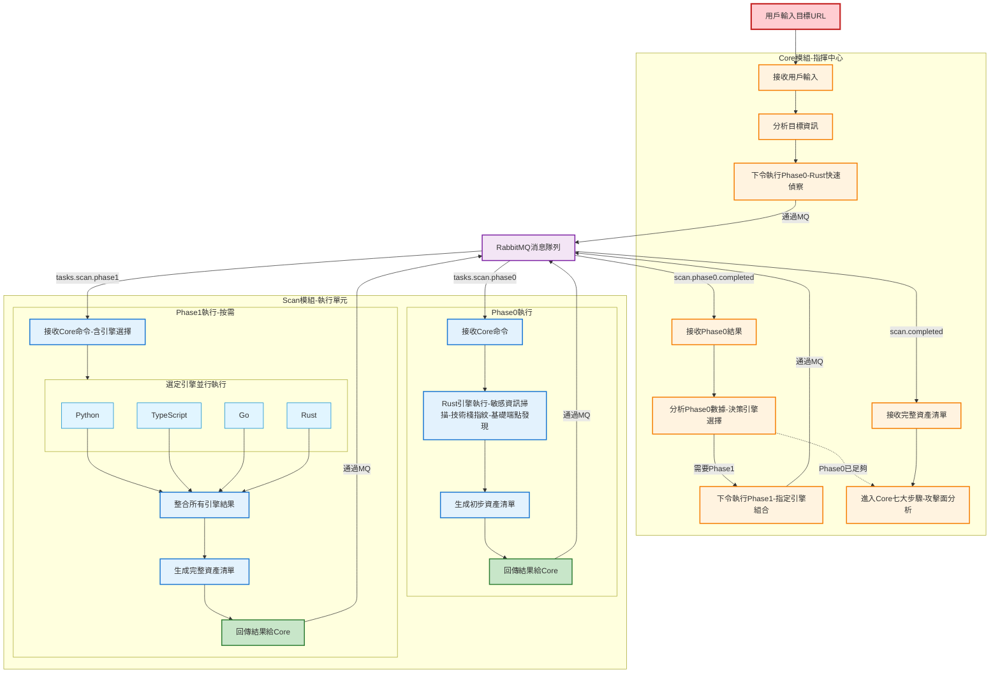
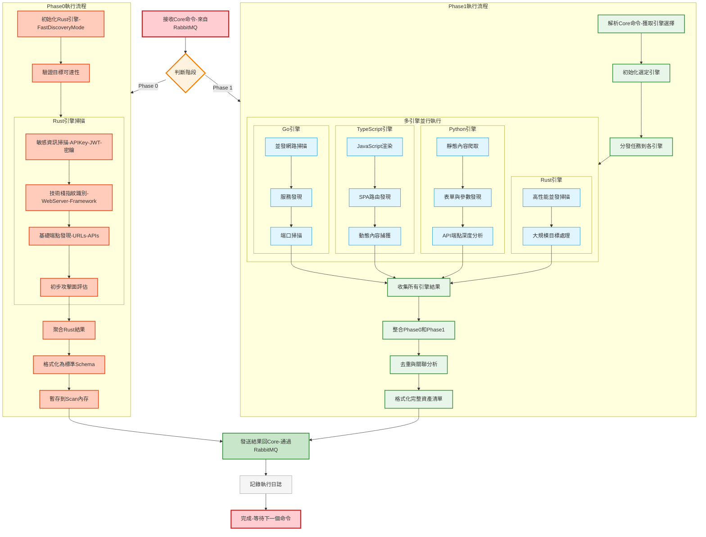
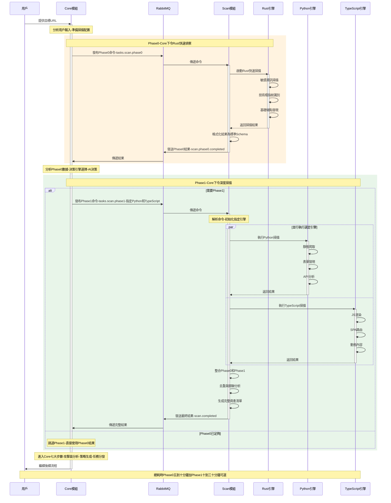
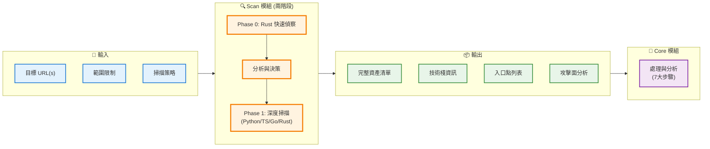
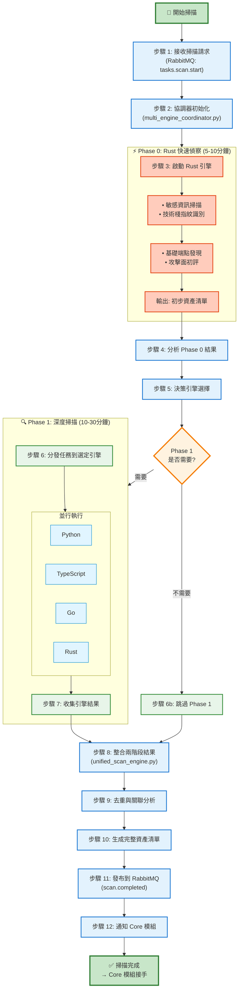

# 🔧 AIVA Scan 模組完整修復計劃

> **目標**: 基於五個核心模組架構,完成功能完整的多語言掃描引擎  
> **創建日期**: 2025年11月17日  
> **架構版本**: v6.3 (4個語言引擎 + 1個協調器)  
> **優先級**: P0 (阻塞) → P1 (核心) → P2 (增強)

---

## 📊 **當前架構狀態**

### ✅ **已完成的重構**

```
services/scan/
├── engines/              # 4個語言引擎模組
│   ├── python_engine/    # Python 靜態掃描引擎
│   ├── typescript_engine/# TypeScript 動態渲染引擎
│   ├── rust_engine/      # Rust 高性能資訊收集
│   └── go_engine/        # Go 並發掃描引擎
├── coordinators/         # 協調器模組 (第5個核心模組)
│   ├── scan_models.py           # 遵循 aiva_common 規範的數據模型
│   ├── multi_engine_coordinator.py  # 多引擎協調器
│   ├── unified_scan_engine.py       # 統一掃描引擎
│   ├── scan_orchestrator.py         # 掃描編排器
│   ├── target_generators/           # 測試目標生成器
│   └── __init__.py
├── archived_docs/        # 歸檔文檔 (已清理)
│   └── MULTI_ENGINE_COORDINATION_GUIDE.md
├── README.md             # 主要文檔 (1567行)
└── __init__.py           # 模組初始化 (已遵循 aiva_common 規範)
```

### 🎯 **核心設計原則**

1. **遵循 aiva_common 規範**
   - ✅ 基於 Pydantic v2
   - ✅ 禁止重複定義 Schema
   - ✅ 單一數據來源原則
   - ✅ 優先使用標準 Schema

2. **五個核心模組架構**
   - ✅ 4個語言引擎 (engines/)
   - ✅ 1個協調器 (coordinators/)
   - ❌ 不再有 shared/ 或 utilities/ 模組
   - ✅ 工具功能已移至 integration 模組

3. **模組職責清晰**
   - **engines/**: 執行實際掃描任務
   - **coordinators/**: 協調、編排、整合結果
   - **integration/**: 企業整合、報告生成、SARIF轉換

### Scan 模組在 AIVA 系統中的角色

> **🎯 核心重點**: 
> 
> **掃描模組是執行者,不是決策者**
> - **指揮官**: Core 模組 (下令執行掃描)
> - **執行者**: Scan 模組 (接收命令並執行)
> - **數據流向**: User → Core → Scan (Phase 0) → Core (分析) → Scan (Phase 1) → Core
> 
> **兩階段掃描由 Core 模組指揮**:
> 1. Core 模組接收用戶目標後,下令 Scan 執行 Phase 0 (Rust快速偵察)
> 2. Scan 完成 Phase 0,將結果回傳給 Core
> 3. Core 分析結果,決定 Phase 1 引擎組合
> 4. Core 下令 Scan 執行 Phase 1 (選定的引擎深度掃描)
> 5. Scan 完成後,將完整資產清單回傳給 Core
> 
> ⚠️ **關鍵設計**: Core 是大腦,Scan 是手腳

#### **完整系統流程圖 (含 Core 指揮)**



#### **Scan 模組內部運作詳細流程**



#### **數據流向與存儲位置**

```mermaid
flowchart LR
    subgraph CORE[Core模組]
        CORE_CMD[下達命令]
        CORE_RECEIVE[接收結果]
        CORE_STORE[存儲到Core內存-SessionStateManager]
    end
    
    subgraph MQ[RabbitMQ隊列]
        direction TB
        Q_CMD_P0[tasks.scan.phase0]
        Q_CMD_P1[tasks.scan.phase1]
        Q_RESULT_P0[scan.phase0.completed]
        Q_RESULT[scan.completed]
    end
    
    subgraph SCAN[Scan模組]
        direction TB
        
        SCAN_RECEIVE[接收命令]
        SCAN_EXEC[執行掃描]
        SCAN_TEMP[暫存結果-Scan內存]
        SCAN_SEND[發送結果]
        
        subgraph DATA_P0[Phase0數據]
            P0_ASSETS[初步資產列表]
            P0_TECH[技術棧資訊]
            P0_SENSITIVE[敏感資訊發現]
        end
        
        subgraph DATA_P1[Phase1數據]
            P1_URLS[完整URL清單]
            P1_FORMS[表單與參數]
            P1_APIS[API端點詳情]
            P1_ENTRY[入口點分析]
        end
    end
    
    subgraph DB[數據庫-可選]
        SCAN_LOG[掃描日誌]
        RESULT_ARCHIVE[結果歸檔]
    end
    
    CORE_CMD -->|Phase0命令| Q_CMD_P0
    CORE_CMD -->|Phase1命令| Q_CMD_P1
    
    Q_CMD_P0 --> SCAN_RECEIVE
    Q_CMD_P1 --> SCAN_RECEIVE
    
    SCAN_RECEIVE --> SCAN_EXEC
    SCAN_EXEC --> SCAN_TEMP
    SCAN_TEMP --> DATA_P0
    SCAN_TEMP --> DATA_P1
    
    DATA_P0 --> SCAN_SEND
    DATA_P1 --> SCAN_SEND
    
    SCAN_SEND -->|Phase0結果| Q_RESULT_P0
    SCAN_SEND -->|最終結果| Q_RESULT
    
    Q_RESULT_P0 --> CORE_RECEIVE
    Q_RESULT --> CORE_RECEIVE
    
    CORE_RECEIVE --> CORE_STORE
    
    SCAN_EXEC -.日誌.-> SCAN_LOG
    CORE_STORE -.歸檔.-> RESULT_ARCHIVE
    
    style CORE_CMD fill:#fff3e0,stroke:#f57c00,stroke-width:2px
    style CORE_RECEIVE fill:#fff3e0,stroke:#f57c00,stroke-width:2px
    style CORE_STORE fill:#fff3e0,stroke:#f57c00,stroke-width:2px
    style Q_CMD_P0 fill:#f3e5f5,stroke:#7b1fa2,stroke-width:2px
    style Q_CMD_P1 fill:#f3e5f5,stroke:#7b1fa2,stroke-width:2px
    style Q_RESULT_P0 fill:#f3e5f5,stroke:#7b1fa2,stroke-width:2px
    style Q_RESULT fill:#f3e5f5,stroke:#7b1fa2,stroke-width:2px
    style SCAN_RECEIVE fill:#e3f2fd,stroke:#1976d2,stroke-width:2px
    style SCAN_EXEC fill:#e3f2fd,stroke:#1976d2,stroke-width:2px
    style SCAN_TEMP fill:#e3f2fd,stroke:#1976d2,stroke-width:2px
    style SCAN_SEND fill:#e3f2fd,stroke:#1976d2,stroke-width:2px
    style P0_ASSETS fill:#e8f5e9,stroke:#388e3c,stroke-width:1px
    style P0_TECH fill:#e8f5e9,stroke:#388e3c,stroke-width:1px
    style P0_SENSITIVE fill:#e8f5e9,stroke:#388e3c,stroke-width:1px
    style P1_URLS fill:#e8f5e9,stroke:#388e3c,stroke-width:1px
    style P1_FORMS fill:#e8f5e9,stroke:#388e3c,stroke-width:1px
    style P1_APIS fill:#e8f5e9,stroke:#388e3c,stroke-width:1px
    style P1_ENTRY fill:#e8f5e9,stroke:#388e3c,stroke-width:1px
    style SCAN_LOG fill:#eceff1,stroke:#607d8b,stroke-width:1px
    style RESULT_ARCHIVE fill:#eceff1,stroke:#607d8b,stroke-width:1px
```



#### **時序圖: Core 與 Scan 的完整互動**



---

## 🎯 **預計完成的功能**

### **核心功能清單**

#### **1. 兩階段掃描能力**

**Phase 0: Rust 快速偵察 (必須執行)**
```python
# Rust 引擎 - 第一階段快速資訊收集
rust_phase0 = {
    "purpose": "快速獲取目標基本資訊",
    "tasks": [
        "敏感資訊掃描 (API Key, JWT, 密鑰)",
        "技術棧指紋識別",
        "基礎端點發現",
        "初步攻擊面評估"
    ],
    "output": "初步資產清單",
    "execution_time": "快速 (<5分鐘)"
}
```

**Phase 1: 四引擎深度掃描 (根據情況選擇)**
```python
# 四個掃描引擎 - 第二階段深度分析
engines = {
    "python": "靜態內容爬取、表單發現、API端點深度分析",
    "typescript": "JavaScript渲染、SPA路由發現、動態內容捕獲",
    "rust": "高性能並發掃描、大規模目標處理",
    "go": "並發網路掃描、服務發現、端口掃描"
}
```

**技術特點**:
- ✅ **兩階段架構**: Phase 0 (Rust快速) → Phase 1 (四引擎深度)
- ✅ **智能決策**: 根據 Phase 0 結果決定 Phase 1 引擎組合
- ✅ **引擎獨立**: 四引擎互不依賴,失敗隔離
- ✅ **統一格式**: SARIF v2.1.0 標準輸出

#### **2. 智能協調策略**

```python
# 協調器模式
coordination_modes = {
    "SEQUENTIAL": "順序執行,適合資源受限環境",
    "PARALLEL": "並行執行,最快完成時間",
    "ADAPTIVE": "自適應選擇,根據目標特性動態調整"
}

# 掃描策略
scan_strategies = {
    "CONSERVATIVE": "保守模式,最小資源消耗",
    "BALANCED": "平衡模式,速度與準確度兼顧",
    "AGGRESSIVE": "激進模式,最大覆蓋率"
}
```

**運作方式**:
1. 接收掃描請求 (通過 RabbitMQ `tasks.scan.start`)
2. **Phase 0**: 啟動 Rust 引擎快速偵察
3. **Phase 0 結果分析**: 評估目標特性和攻擊面
4. **Phase 1**: 根據 Phase 0 結果選擇引擎組合
5. **Phase 1 執行**: 分發任務到選定的引擎
6. 收集並整合兩階段結果
7. 去重和關聯分析
8. 輸出完整資產清單給 Core 模組

#### **3. 資產與目標管理**

```python
# 支持的資產類型
asset_types = [
    "WEB_APPLICATION",      # Web應用程式
    "API_ENDPOINT",         # API端點
    "MOBILE_APP",           # 移動應用
    "CLOUD_SERVICE",        # 雲服務
    "NETWORK_SERVICE"       # 網路服務
]

# 目標管理功能
- 多目標批次掃描
- 目標優先級排序
- 動態目標調整
- 掃描進度追蹤
```

#### **4. 結果處理與報告**

```python
# 結果聚合
result_aggregation = {
    "去重": "移除重複發現",
    "關聯": "關聯相關發現",
    "評分": "CVSS v3.1 風險評分",
    "分類": "OWASP Top 10 / CWE 分類"
}

# 輸出格式
output_formats = [
    "SARIF v2.1.0",     # 標準格式
    "JSON",             # 機器可讀
    "HTML",             # 人類可讀
    "PDF"               # 報告格式
]
```

---

## 🔧 **修復計劃詳細步驟**

### **P0 - 阻塞性問題 (立即修復)**

#### ✅ **已完成**

- [x] 清理過時導入 (shared.models, utilities)
- [x] 遵循 aiva_common 規範重構數據模型
- [x] 移除重複定義的 Schema
- [x] 清理 archived_docs/ 過時文檔

#### 🔄 **待完成**

##### **P0.1 - 協調器組件導入修復**

**問題**: `multi_engine_coordinator.py` 等文件可能存在導入錯誤

```python
# 錯誤示例
from aiva_common.schemas import AssetType  # AssetType 不存在

# 修正方式
from aiva_common.schemas.assets import Asset, AssetMetadata
from services.scan.coordinators.scan_models import ScanCoordinationMetadata
```

**修復步驟**:
1. 檢查 coordinators/ 下所有 Python 文件的導入
2. 修正不存在的導入 (參考 aiva_common.schemas)
3. 確保只從 aiva_common 導入標準 Schema
4. 協調器特有模型從 scan_models.py 導入

**優先級**: P0 (阻塞基本功能)

##### **P0.2 - 各引擎基礎功能驗證**

**目標**: 確保四個引擎能獨立運作

**測試項目**:
```python
# 1. Python 引擎
python_engine = PythonScanEngine()
result = await python_engine.scan(target="https://example.com")
assert result.findings_count > 0

# 2. TypeScript 引擎
typescript_engine = TypeScriptScanEngine()
result = await typescript_engine.scan(target="https://example.com")
assert result.findings_count > 0

# 3. Rust 引擎
# 需要確認 Cargo.toml 和 Rust 依賴
cargo build --release
./target/release/rust_scanner --target https://example.com

# 4. Go 引擎
# 需要確認 go.mod 和 Go 依賴
go build -o go_scanner
./go_scanner -target https://example.com
```

**驗證標準**:
- ✅ 能接收目標參數
- ✅ 能執行掃描任務
- ✅ 能輸出標準結果
- ✅ 錯誤處理正常

---

### **P1 - 核心功能 (必須實現)**

#### **P1.1 - 統一掃描引擎完善**

**文件**: `coordinators/unified_scan_engine.py`

**需要實現的功能**:
```python
class UnifiedScanEngine:
    """統一掃描引擎,實現兩階段掃描架構"""
    
    async def scan(
        self,
        target: Asset,
        strategy: ScanStrategy = ScanStrategy.BALANCED
    ) -> MultiEngineCoordinationResult:
        """
        執行兩階段掃描
        
        工作流程:
        1. Phase 0: Rust 快速資訊收集
        2. 分析 Phase 0 結果
        3. 決定 Phase 1 引擎組合
        4. Phase 1: 深度掃描執行
        5. 整合兩階段結果
        6. 返回完整資產清單
        """
        # Phase 0: Rust 快速偵察 (必須執行)
        phase0_result = await self._execute_phase0(target)
        
        # 根據 Phase 0 結果決定 Phase 1 策略
        phase1_engines = self._select_phase1_engines(
            phase0_result=phase0_result,
            strategy=strategy
        )
        
        # Phase 1: 深度掃描 (如果需要)
        if phase1_engines:
            phase1_result = await self._execute_phase1(
                target=target,
                phase0_data=phase0_result,
                engines=phase1_engines
            )
        else:
            phase1_result = None
        
        # 整合結果
        return self._merge_results(phase0_result, phase1_result)
    
    async def _execute_phase0(self, target: Asset) -> RustScanResult:
        """Phase 0: Rust 快速資訊收集"""
        rust_engine = RustScanEngine(mode="fast_discovery")
        return await rust_engine.scan(target)
    
    def _select_phase1_engines(
        self,
        phase0_result: RustScanResult,
        strategy: ScanStrategy
    ) -> List[str]:
        """根據 Phase 0 結果和策略選擇 Phase 1 引擎"""
        engines = []
        
        # 根據目標特性決定
        if phase0_result.is_spa_application:
            engines.extend(["python", "typescript"])
        elif phase0_result.is_api_focused:
            engines.extend(["python", "go"])
        elif phase0_result.is_complex_site:
            engines.extend(["python", "typescript", "rust", "go"])
        
        # 根據策略調整
        if strategy == ScanStrategy.CONSERVATIVE:
            return engines[:1] if engines else []
        elif strategy == ScanStrategy.BALANCED:
            return engines[:2] if engines else []
        else:  # AGGRESSIVE
            return engines
    
    async def _execute_phase1(
        self,
        target: Asset,
        phase0_data: RustScanResult,
        engines: List[str]
    ) -> List[ScanResult]:
        """Phase 1: 深度掃描"""
        tasks = []
        for engine_name in engines:
            engine = self._get_engine(engine_name)
            task = engine.scan(target, phase0_hints=phase0_data)
            tasks.append(task)
        
        return await asyncio.gather(*tasks)
```

**優先級**: P1 (核心功能,實現兩階段架構)

#### **P1.2 - 多引擎協調器完善**

**文件**: `coordinators/multi_engine_coordinator.py`

**需要實現的功能**:
```python
class MultiEngineCoordinator:
    """多引擎協調器,負責任務分發和結果收集"""
    
    async def coordinate_scan(
        self,
        scan_request: ScanStartPayload
    ) -> MultiEngineCoordinationResult:
        """
        協調多引擎掃描
        
        工作流程:
        1. 驗證掃描請求
        2. 創建協調元數據
        3. 分發到統一掃描引擎
        4. 監控掃描進度
        5. 收集並整合結果
        6. 發布結果到 RabbitMQ
        """
        pass
    
    async def monitor_progress(
        self,
        scan_id: str
    ) -> ScanProgress:
        """監控掃描進度"""
        pass
    
    async def handle_engine_failure(
        self,
        engine: str,
        error: Exception
    ):
        """處理引擎失敗"""
        pass
```

**優先級**: P1 (核心功能)

#### **P1.3 - RabbitMQ 整合**

**需要實現的隊列**:
```python
# 輸入隊列
SCAN_START_QUEUE = "tasks.scan.start"           # 接收掃描請求
SCAN_CANCEL_QUEUE = "tasks.scan.cancel"         # 取消掃描

# 輸出隊列
SCAN_RESULT_QUEUE = "findings.new"              # 發布新發現
SCAN_STATUS_QUEUE = "scan.status"               # 掃描狀態更新
SCAN_COMPLETE_QUEUE = "scan.complete"           # 掃描完成通知
```

**實現要點**:
```python
class ScanQueueConsumer:
    """掃描隊列消費者"""
    
    async def consume_scan_requests(self):
        """消費掃描請求"""
        async for message in self.channel.consume("tasks.scan.start"):
            scan_request = ScanStartPayload.model_validate_json(message.body)
            result = await self.coordinator.coordinate_scan(scan_request)
            await self.publish_result(result)
    
    async def publish_result(self, result: MultiEngineCoordinationResult):
        """發布掃描結果"""
        await self.channel.publish(
            "findings.new",
            result.model_dump_json()
        )
```

**優先級**: P1 (核心功能)

---

### **P2 - 增強功能 (後續優化)**

#### **P2.1 - Docker Compose 配置更新**

**文件**: `coordinators/docker-compose.scan.yml`

**需要更新**:
- 確保所有引擎容器配置正確
- 統一環境變數管理
- 健康檢查配置
- 日誌聚合配置

#### **P2.2 - 測試目標生成器完善**

**文件**: `coordinators/target_generators/`

**需要實現**:
- 更多內建測試目標
- 自定義目標生成
- 目標驗證功能

#### **P2.3 - 監控與可觀測性**

**需要實現**:
- Prometheus 指標導出
- 掃描進度追蹤
- 引擎健康檢查
- 效能指標收集

---

## 🚀 **運作方式說明**

### **數據流向圖**



### **完整掃描流程 (詳細步驟)**



### **兩階段引擎選擇邏輯**

```python
def select_phase1_engines(
    phase0_result: RustScanResult, 
    strategy: ScanStrategy
) -> List[str]:
    """
    根據 Phase 0 結果和策略選擇 Phase 1 引擎組合
    
    Phase 0 已經由 Rust 完成快速偵察,
    Phase 1 根據結果決定是否需要深度掃描及使用哪些引擎
    """
    engines = []
    
    # 根據 Phase 0 發現的目標特性決定
    if phase0_result.is_spa_application:
        # SPA 應用: 需要 JavaScript 渲染
        engines = ["python", "typescript"]
        
    elif phase0_result.is_api_focused:
        # API 服務: 需要高效並發測試
        engines = ["python", "go"]
        
    elif phase0_result.is_complex_website:
        # 複雜網站: 需要全面掃描
        engines = ["python", "typescript", "go"]
        
    elif phase0_result.is_static_site:
        # 靜態網站: Phase 0 可能已足夠
        engines = []  # 跳過 Phase 1
        
    else:
        # 未知類型: 使用 Python 基礎掃描
        engines = ["python"]
    
    # 根據策略調整引擎數量
    if strategy == ScanStrategy.CONSERVATIVE:
        # 保守模式: 最多1個引擎 (可能跳過 Phase 1)
        engines = engines[:1]
        
    elif strategy == ScanStrategy.BALANCED:
        # 平衡模式: 最多2個引擎
        engines = engines[:2]
        
    elif strategy == ScanStrategy.AGGRESSIVE:
        # 激進模式: 所有建議的引擎 + Rust 高性能補充
        if engines and "rust" not in engines:
            engines.append("rust")
    
    return engines

# 使用範例
def execute_two_phase_scan(target_url: str, strategy: ScanStrategy):
    """完整的兩階段掃描流程"""
    
    # Phase 0: Rust 快速偵察 (必須執行)
    print("🚀 Phase 0: Rust 快速資訊收集...")
    rust_engine = RustScanEngine(mode="fast_discovery")
    phase0_result = rust_engine.scan(target_url)
    print(f"✅ Phase 0 完成: 發現 {phase0_result.endpoints_count} 個端點")
    
    # 決定 Phase 1 引擎
    phase1_engines = select_phase1_engines(phase0_result, strategy)
    
    if not phase1_engines:
        print("ℹ️  Phase 0 結果已足夠,跳過 Phase 1")
        return phase0_result
    
    # Phase 1: 深度掃描
    print(f"🚀 Phase 1: 深度掃描 (引擎: {', '.join(phase1_engines)})")
    phase1_results = []
    for engine_name in phase1_engines:
        engine = get_engine(engine_name)
        result = engine.scan(target_url, phase0_hints=phase0_result)
        phase1_results.append(result)
    
    # 整合結果
    final_result = merge_results(phase0_result, phase1_results)
    print(f"✅ 掃描完成: 總共發現 {final_result.total_assets_count} 個資產")
    
    return final_result
```

### **失敗處理機制**

```python
async def execute_scan_with_fallback(
    engine: str,
    target: Asset
) -> Optional[ScanResult]:
    """
    執行掃描並處理失敗
    """
    try:
        # 嘗試執行掃描
        result = await engines[engine].scan(target)
        return result
    
    except EngineTimeoutError:
        # 超時: 記錄並繼續
        logger.warning(f"{engine} 引擎超時,跳過此引擎")
        return None
    
    except EngineFailureError as e:
        # 引擎失敗: 記錄並嘗試降級
        logger.error(f"{engine} 引擎失敗: {e}")
        
        # 如果是關鍵引擎,嘗試重試
        if engine in CRITICAL_ENGINES:
            logger.info(f"重試 {engine} 引擎")
            return await retry_scan(engine, target, max_retries=2)
        
        return None
    
    except Exception as e:
        # 未預期錯誤: 記錄並繼續
        logger.exception(f"{engine} 引擎發生未預期錯誤")
        return None
```

---

## 📊 **預期成果**

### **功能完整性**

- ✅ **多引擎掃描**: 4個語言引擎協同工作
- ✅ **智能協調**: 根據策略自動選擇引擎
- ✅ **結果整合**: 去重、關聯、評分、分類
- ✅ **標準輸出**: SARIF v2.1.0 格式
- ✅ **失敗隔離**: 單一引擎失敗不影響整體

### **效能指標**

| 指標 | 目標 | 測量方式 |
|------|------|----------|
| **掃描速度** | <5分鐘/目標 | 平均完成時間 |
| **覆蓋率** | >90% OWASP Top 10 | 檢測能力測試 |
| **準確率** | >95% | 誤報率 <5% |
| **並發能力** | >10 並發掃描 | 負載測試 |
| **引擎可用性** | >99% | 健康檢查 |

### **測試驗證**

```python
# 1. 單元測試
pytest services/scan/coordinators/tests/

# 2. 整合測試
pytest services/scan/tests/integration/

# 3. 端到端測試
python services/scan/tests/e2e/test_full_scan.py

# 4. 效能測試
python services/scan/tests/performance/test_concurrent_scans.py
```

---

## 📚 **參考文檔**

- [aiva_common 規範](../aiva_common/README.md)
- [多引擎協同指南](archived_docs/MULTI_ENGINE_COORDINATION_GUIDE.md)
- [Services 總覽](../README.md)
- [SARIF 標準](https://docs.oasis-open.org/sarif/sarif/v2.1.0/sarif-v2.1.0.html)

---

## 🎯 **執行時間表**

| 階段 | 任務 | 預計時間 | 負責人 |
|------|------|----------|--------|
| **Week 1** | P0.1 協調器導入修復 | 2天 | - |
| **Week 1** | P0.2 引擎基礎驗證 | 3天 | - |
| **Week 2** | P1.1 統一掃描引擎 | 4天 | - |
| **Week 2** | P1.2 多引擎協調器 | 3天 | - |
| **Week 3** | P1.3 RabbitMQ 整合 | 3天 | - |
| **Week 3** | 整合測試與調整 | 4天 | - |
| **Week 4** | P2 增強功能 | 5天 | - |
| **Week 4** | 文檔更新與發布 | 2天 | - |

**總計**: 約 4 週完成所有功能

---

## ✅ **驗收標準**

### **必須通過的測試**

1. ✅ 所有 Python 文件無導入錯誤
2. ✅ 四個引擎能獨立運作
3. ✅ 多引擎協調器能正確分發任務
4. ✅ 結果整合功能正常
5. ✅ RabbitMQ 整合測試通過
6. ✅ 端到端掃描流程完整
7. ✅ 效能指標達標

### **可選的增強項目**

- [ ] Docker Compose 一鍵啟動
- [ ] 監控儀表板
- [ ] 自動化測試覆蓋率 >80%
- [ ] 完整的 API 文檔

---

**最後更新**: 2025年11月17日  
**文檔版本**: v1.0  
**架構版本**: v6.3 (五個核心模組)
