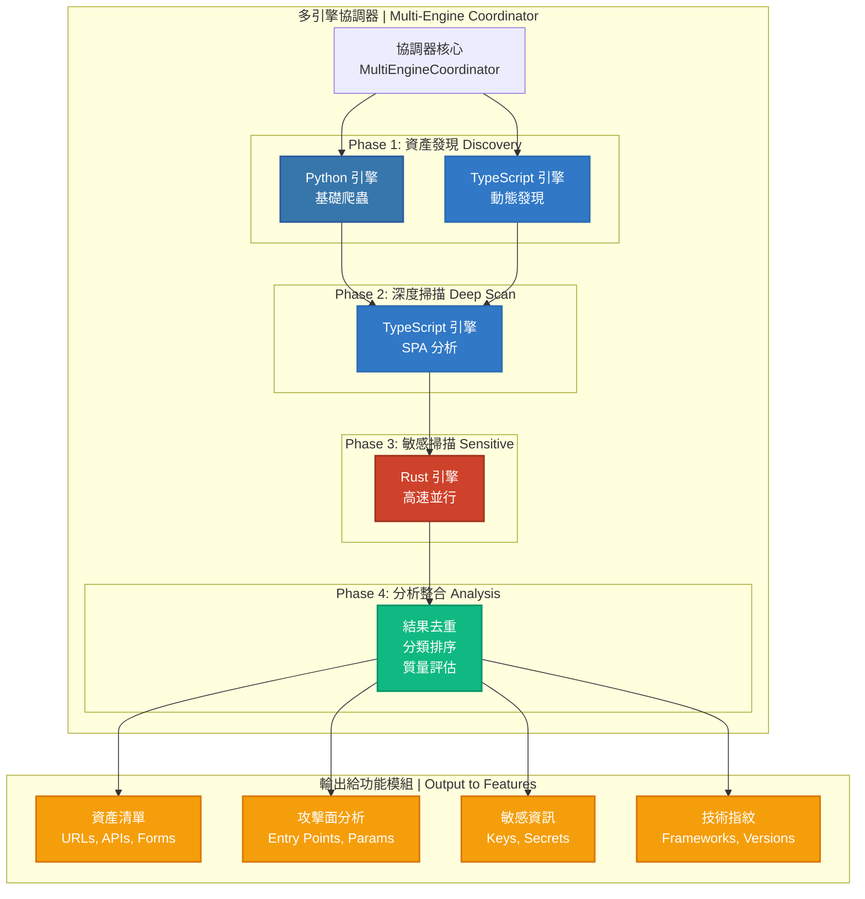

# 🎯 多引擎協同掃描指南

## 📋 目錄

- [核心設計理念](#核心設計理念)
- [架構設計](#架構設計)
- [三引擎協同策略](#三引擎協同策略)
- [使用指南](#使用指南)
- [最佳實踐](#最佳實踐)

---

## 🎯 核心設計理念

### 設計目標

AIVA 掃描模組的定位是為功能模組提供**高質量的測試目標**，而非直接發現高價值漏洞。根據 Bug Bounty 實戰統計，80% 的收入來自簡單且低價值的漏洞，因此我們的策略是:

```
✅ 廣度優先         (全面資產發現)
✅ 基礎檢測         (OWASP Top 10 覆蓋)
✅ 三引擎協同       (並行執行優化)
✅ 為功能模組服務   (提供測試目標)
```

### 設計特色

| 特性 | 說明 |
|------|------|
| **定位** | 為 AI 功能模組提供高質量測試目標 |
| **廣度** | 三引擎協同：Python (靜態) + TypeScript (動態) + Rust (敏感) |
| **深度** | 基礎檢測 + AI 增強 (複雜漏洞由功能模組處理) |
| **執行** | 並行執行：Phase 1 Python ∥ TypeScript 同時運行 |
| **智能** | AI 決策引擎驅動資產優先級排序 |
| **輸出** | 結構化資產清單 + 攻擊面分析 + 技術指紋 |

**關鍵理念**: AIVA 掃描模組專注於**資產發現和基礎檢測**，將結果交給功能模組進行**深度漏洞挖掘**。

---

## 🏗️ 架構設計

### 整體架構



### 四階段掃描流程

#### **Phase 1: 資產發現 (並行執行)**

```python
# Python 引擎: 基礎爬蟲 (快速廣度優先)
- HTTP/HTTPS 爬取
- 靜態內容解析
- URL 隊列管理
- 表單發現
- 參數提取

# TypeScript 引擎: 動態發現 (JavaScript 渲染)
- Playwright 自動化
- 動態頁面渲染
- AJAX 請求捕獲
- WebSocket 檢測
- DOM 事件監聽

⏱️ 預計時間: 30-120 秒 (並行執行)
📊 輸出: 初始資產清單 (URLs, Forms, APIs)
```

#### **Phase 2: 深度掃描 (TypeScript 重點)**

```python
# TypeScript 引擎: 深度分析
- SPA 路由發現
- API 端點完整映射
- 隱藏功能挖掘
- 客戶端邏輯分析
- 狀態遷移追蹤

⏱️ 預計時間: 60-300 秒
📊 輸出: 深度資產 (Hidden Endpoints, SPA Routes)
```

#### **Phase 3: 敏感掃描 (Rust 極速)**

```python
# Rust 引擎: 高速並行掃描
- AWS Keys (正則 + 驗證)
- GitHub Tokens
- API Keys (多種格式)
- JWT Tokens
- Database Credentials
- Email & IP 洩漏

⏱️ 預計時間: 5-30 秒 (極快)
📊 輸出: 敏感資訊位置 + 風險等級
```

#### **Phase 4: 分析整合**

```python
# 結果處理
1. 去重: URL 正規化、內容去重
2. 分類: 按資產類型、風險等級
3. 排序: 高價值資產優先
4. 質量評估: 覆蓋率、深度分數

⏱️ 預計時間: 5-15 秒
📊 輸出: 結構化資產清單 + 質量報告
```

---

## 🔄 三引擎協同策略

### 策略 1: 全協同 (Full Coordination)

**條件**: Python + TypeScript + Rust 三引擎全部可用

```python
Phase 1: Python 爬蟲 || TypeScript 動態發現  (並行)
    ↓
Phase 2: TypeScript 深度掃描 (基於 Phase 1 結果)
    ↓
Phase 3: Rust 敏感掃描 (高速並行處理所有內容)
    ↓
Phase 4: 結果整合 + 去重 + 分類 + 質量評估

✅ 覆蓋率: 95%+
✅ 深度: 高
✅ 速度: 快
⏱️ 預計時間: 100-450 秒
```

### 策略 2: 部分協同 (Partial Coordination)

**條件**: 僅有兩個引擎可用

#### 2A: Python + TypeScript

```python
Phase 1: Python 爬蟲 + TypeScript 動態發現 (並行)
    ↓
Phase 2: TypeScript 深度掃描
    ↓
Phase 3: 跳過 (無 Rust 引擎)
    ↓
Phase 4: 結果整合

✅ 覆蓋率: 85%+
✅ 深度: 高
⚠️ 敏感資訊掃描能力下降
⏱️ 預計時間: 90-420 秒
```

#### 2B: Python + Rust

```python
Phase 1: Python 爬蟲 (單獨執行)
    ↓
Phase 2: 跳過 (無 TypeScript 深度掃描)
    ↓
Phase 3: Rust 敏感掃描
    ↓
Phase 4: 結果整合

✅ 覆蓋率: 70%+
⚠️ 動態內容發現能力下降
✅ 敏感資訊掃描: 極快
⏱️ 預計時間: 35-150 秒
```

### 策略 3: 單引擎降級 (Single Engine)

**條件**: 僅有一個引擎可用

```python
使用唯一可用的引擎執行基礎掃描

⚠️ 覆蓋率: 50%+
⚠️ 功能受限
⏱️ 預計時間: 30-180 秒
```

---

## 💻 使用指南

### 基礎使用

```python
from services.scan.multi_engine_coordinator import MultiEngineCoordinator, coordinate_scan
from services.aiva_common.schemas import ScanStartPayload

# 方式 1: 使用便利函數
async def quick_scan():
    request = ScanStartPayload(
        scan_id="test_scan_001",
        targets=["https://example.com"],
        strategy="COMPREHENSIVE"
    )
    
    result = await coordinate_scan(request)
    
    print(f"總資產數: {result.total_assets}")
    print(f"協調策略: {result.coordination_strategy}")
    print(f"覆蓋率分數: {result.get_asset_coverage()}")
    print(f"深度分數: {result.get_depth_score()}")

# 方式 2: 手動創建協調器
async def advanced_scan():
    # 自定義配置
    config = {
        "enable_python": True,
        "enable_typescript": True,
        "enable_rust": True,
        "parallel_execution": True
    }
    
    coordinator = MultiEngineCoordinator(config)
    
    request = ScanStartPayload(
        scan_id="advanced_scan_001",
        targets=["https://example.com", "https://api.example.com"],
        strategy="AGGRESSIVE",
        custom_headers={"Authorization": "Bearer token"}
    )
    
    result = await coordinator.execute_coordinated_scan(request)
    
    # 詳細結果分析
    for engine_result in result.engine_results:
        print(f"\n{engine_result.engine.value} 引擎:")
        print(f"  階段: {engine_result.phase.value}")
        print(f"  資產數: {len(engine_result.assets)}")
        print(f"  執行時間: {engine_result.execution_time:.2f}s")
        print(f"  狀態: {'成功' if engine_result.success else '失敗'}")

# 執行
import asyncio
asyncio.run(quick_scan())
```

### 與功能模組整合

```python
from services.scan.multi_engine_coordinator import coordinate_scan
from services.core.aiva_core.ai_engine.real_neural_core import RealDecisionEngine

async def scan_then_attack():
    """完整流程: 掃描 → AI 分析 → 攻擊"""
    
    # Step 1: 執行協同掃描
    scan_result = await coordinate_scan(
        ScanStartPayload(
            scan_id="hunt_001",
            targets=["https://target.com"],
            strategy="COMPREHENSIVE"
        )
    )
    
    print(f"✅ 掃描完成: 發現 {scan_result.total_assets} 個資產")
    
    # Step 2: 提取高價值資產
    high_value_assets = []
    for asset_type, count in scan_result.assets_by_type.items():
        if asset_type in ["api_endpoint", "form", "sensitive_info"]:
            # 從 engine_results 中提取相應資產
            for engine_result in scan_result.engine_results:
                high_value_assets.extend([
                    a for a in engine_result.assets 
                    if str(a.asset_type) == asset_type
                ])
    
    print(f"🎯 高價值資產: {len(high_value_assets)} 個")
    
    # Step 3: AI 決策引擎分析
    ai_engine = RealDecisionEngine()
    
    for asset in high_value_assets[:10]:  # 處理前 10 個
        # AI 決策: 這個資產值得深度測試嗎?
        decision = ai_engine.generate_decision(
            task_description=f"分析資產: {asset.value}",
            context={
                "asset_type": str(asset.asset_type),
                "metadata": asset.metadata
            }
        )
        
        if decision.get("priority", 0) > 0.7:
            print(f"🔥 高優先級資產: {asset.value}")
            # TODO: 調用功能模組進行深度測試
    
    # Step 4: 生成攻擊計畫
    attack_plan = {
        "scan_id": scan_result.scan_id,
        "total_targets": len(high_value_assets),
        "estimated_time": len(high_value_assets) * 30,  # 秒
        "priority_order": sorted(
            high_value_assets,
            key=lambda a: ai_engine.estimate_priority(a),
            reverse=True
        )
    }
    
    return attack_plan
```

### 配置選項

```python
# config.yaml 或環境變數
SCAN_CONFIG = {
    # 引擎開關
    "engines": {
        "python": {
            "enabled": True,
            "strategy": "COMPREHENSIVE",  # FAST, COMPREHENSIVE, AGGRESSIVE
            "max_depth": 3,
            "max_pages": 500
        },
        "typescript": {
            "enabled": True,
            "enable_deep_scan": True,
            "playwright_timeout": 30000,  # ms
            "max_browser_contexts": 5
        },
        "rust": {
            "enabled": True,
            "parallel_workers": 8,
            "enable_verification": True  # 驗證發現的密鑰
        }
    },
    
    # 協調策略
    "coordination": {
        "parallel_discovery": True,  # Phase 1 並行執行
        "asset_deduplication": True,
        "quality_threshold": 0.7  # 質量閾值
    },
    
    # 性能調優
    "performance": {
        "max_concurrent_requests": 50,
        "request_timeout": 30,  # 秒
        "rate_limit": 10  # requests/sec
    }
}
```

---

## 🎯 最佳實踐

### 1. 掃描策略選擇

```python
# 快速初探 (CI/CD 集成)
strategy = "FAST"
max_depth = 1
max_pages = 50
⏱️ 預計時間: 30-60 秒

# 標準掃描 (日常測試)
strategy = "COMPREHENSIVE"
max_depth = 3
max_pages = 500
⏱️ 預計時間: 2-5 分鐘

# 深度掃描 (重要目標)
strategy = "AGGRESSIVE"
max_depth = 5
max_pages = 2000
⏱️ 預計時間: 5-15 分鐘
```

### 2. 認證處理

```python
# 基礎認證
request = ScanStartPayload(
    targets=["https://example.com"],
    authentication={
        "type": "bearer",
        "token": "your_jwt_token"
    }
)

# Cookie 認證
request = ScanStartPayload(
    targets=["https://example.com"],
    custom_headers={
        "Cookie": "session=abc123; user_id=456"
    }
)

# 多步驟認證
# 方式: 先登錄獲取 token，再掃描
async def authenticated_scan():
    # Step 1: 登錄
    login_result = await login_api("user", "pass")
    token = login_result["token"]
    
    # Step 2: 攜帶 token 掃描
    result = await coordinate_scan(
        ScanStartPayload(
            targets=["https://example.com/dashboard"],
            authentication={"type": "bearer", "token": token}
        )
    )
```

### 3. 結果過濾與排序

```python
async def filter_high_value_assets(scan_result: CoordinatedScanResult):
    """提取高價值資產"""
    
    high_value = []
    
    for engine_result in scan_result.engine_results:
        for asset in engine_result.assets:
            # 過濾條件
            if (
                str(asset.asset_type) in ["api_endpoint", "form", "sensitive_info"]
                and asset.metadata.get("risk_score", 0) > 0.5
            ):
                high_value.append({
                    "asset": asset,
                    "engine": engine_result.engine.value,
                    "risk_score": asset.metadata.get("risk_score", 0)
                })
    
    # 按風險分數排序
    high_value.sort(key=lambda x: x["risk_score"], reverse=True)
    
    return high_value[:50]  # 返回 Top 50
```

### 4. 與 Core 模組集成

```python
from services.core.aiva_core.messaging.message_broker import MessageBroker
from services.aiva_common.enums import Topic, ModuleName

async def scan_and_notify_core():
    """掃描完成後通知 Core 模組"""
    
    # 執行掃描
    scan_result = await coordinate_scan(
        ScanStartPayload(
            scan_id="hunt_001",
            targets=["https://target.com"]
        )
    )
    
    # 通知 Core 模組
    broker = MessageBroker(ModuleName.SCAN)
    
    await broker.publish(
        topic=Topic.SCAN_COMPLETED,
        message=AivaMessage(
            header=MessageHeader(
                module_name=ModuleName.SCAN,
                trace_id="hunt_001"
            ),
            payload=ScanCompletedPayload(
                scan_id=scan_result.scan_id,
                status="completed",
                summary=Summary(
                    total_assets=scan_result.total_assets,
                    execution_time=scan_result.total_time
                ),
                assets=[]  # 從 engine_results 提取
            )
        )
    )
```

### 5. 錯誤處理

```python
from services.scan.multi_engine_coordinator import MultiEngineCoordinator

async def robust_scan():
    """帶錯誤處理的掃描"""
    
    coordinator = MultiEngineCoordinator()
    
    try:
        result = await coordinator.execute_coordinated_scan(request)
        
        # 檢查引擎失敗情況
        failed_engines = [
            er for er in result.engine_results 
            if not er.success
        ]
        
        if failed_engines:
            print(f"⚠️ {len(failed_engines)} 個引擎失敗:")
            for er in failed_engines:
                print(f"  - {er.engine.value}: {er.error}")
        
        # 檢查質量指標
        coverage = result.quality_metrics.get("coverage_score", 0)
        if coverage < 50:
            print(f"⚠️ 警告: 覆蓋率偏低 ({coverage}%)")
        
        return result
        
    except Exception as e:
        print(f"❌ 掃描失敗: {e}")
        # 降級策略: 使用單引擎
        return None
```

---

## 🔧 故障排查

### 常見問題

#### 1. TypeScript 引擎不可用

```bash
# 檢查 Node.js 服務
cd services/scan/aiva_scan_node
npm run dev

# 查看日誌
tail -f logs/typescript_engine.log
```

#### 2. Rust 引擎編譯失敗

```bash
# 重新編譯
cd services/scan/info_gatherer_rust
cargo clean
cargo build --release
```

#### 3. 掃描結果為空

```python
# 檢查引擎可用性
coordinator = MultiEngineCoordinator()
print(f"可用引擎: {coordinator.available_engines}")
print(f"協調策略: {coordinator.coordination_strategy}")

# 如果是 "no_engine"，需要修復引擎問題
```

---

## 📚 參考資料

- [OWASP Testing Guide](https://owasp.org/www-project-web-security-testing-guide/)
- [OWASP ASVS](https://owasp.org/www-project-application-security-verification-standard/)
- [Bug Bounty Playbook](https://paulsec.github.io/bug-bounty-reference/)
- [WAVSEP - Web Application Scanner Evaluation](https://github.com/sectooladdict/wavsep)

---

**更新時間**: 2025-11-17  
**維護者**: AIVA Development Team
