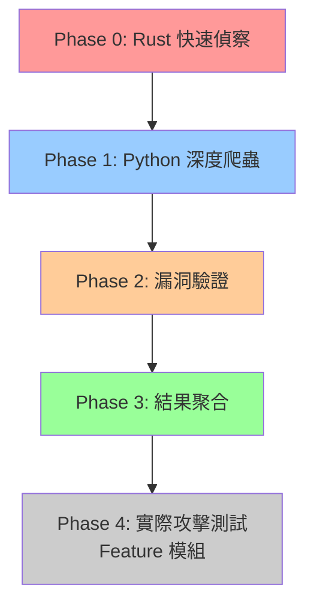

# 多引擎協調操作指南

> **文檔目的**: 詳細說明如何使用多引擎協調器執行 Phase 0→1→2→3 完整掃描流程  
> **適用角色**: 開發者、測試人員、系統管理員  
> **最後更新**: 2025-11-19  
> **狀態**: ✅ Phase 1→2 閉環已驗證 | ⏳ Phase 0→1 整合待測試

---

## 📑 目錄

- [🎯 快速開始](#-快速開始)
  - [30秒快速測試](#30秒快速測試)
  - [5分鐘完整測試](#5分鐘完整測試)
- [📋 架構概覽](#-架構概覽)
  - [四階段掃描流程](#四階段掃描流程)
  - [三引擎職責劃分](#三引擎職責劃分)
  - [模組間協作關係](#模組間協作關係)
- [🔧 環境準備](#-環境準備)
  - [Python Engine 環境](#python-engine-環境)
  - [Go Engine 環境](#go-engine-環境)
  - [Rust Engine 環境](#rust-engine-環境)
  - [協調器環境](#協調器環境)
- [🚀 Phase 0: Rust 快速偵察](#-phase-0-rust-快速偵察)
  - [功能說明](#phase-0-功能說明)
  - [執行步驟](#phase-0-執行步驟)
  - [結果格式](#phase-0-結果格式)
  - [常見問題](#phase-0-常見問題)
- [🐍 Phase 1: Python 深度爬蟲](#-phase-1-python-深度爬蟲)
  - [功能說明](#phase-1-功能說明)
  - [執行步驟](#phase-1-執行步驟)
  - [結果驗證](#phase-1-結果驗證)
  - [故障排查](#phase-1-故障排查)
- [🔍 Phase 2: 漏洞驗證](#-phase-2-漏洞驗證)
  - [功能說明](#phase-2-功能說明)
  - [自動觸發機制](#phase-2-自動觸發機制)
  - [結果分析](#phase-2-結果分析)
  - [優化建議](#phase-2-優化建議)
- [📊 Phase 3: 結果聚合](#-phase-3-結果聚合)
  - [功能說明](#phase-3-功能說明)
  - [執行步驟](#phase-3-執行步驟)
  - [輸出格式](#phase-3-輸出格式)
- [🎓 完整操作示例](#-完整操作示例)
  - [示例 1: 單目標完整掃描](#示例-1-單目標完整掃描)
  - [示例 2: 多目標並行掃描](#示例-2-多目標並行掃描)
  - [示例 3: 僅執行特定階段](#示例-3-僅執行特定階段)
- [📈 性能優化](#-性能優化)
  - [並發控制](#並發控制)
  - [資源限制](#資源限制)
  - [超時設置](#超時設置)
- [🐛 故障排查指南](#-故障排查指南)
  - [常見錯誤](#常見錯誤)
  - [日誌分析](#日誌分析)
  - [調試技巧](#調試技巧)
- [🔗 引擎操作文檔](#-引擎操作文檔)
  - [Python Engine 文檔](#python-engine-文檔)
  - [Go Engine 文檔](#go-engine-文檔)
  - [Rust Engine 文檔](#rust-engine-文檔)
- [📞 技術支持](#-技術支持)

---

## 🎯 快速開始

### 30秒快速測試

適用於快速驗證協調器是否正常工作：

```powershell
# 設置環境變量
$env:PYTHONPATH="C:\D\fold7\AIVA-git"

# 執行單階段測試（僅 Phase 1）
python -c "
import asyncio
from services.scan.engines.python_engine.scan_orchestrator import ScanOrchestrator
from services.aiva_common.schemas import ScanStartPayload

async def quick_test():
    orchestrator = ScanOrchestrator()
    request = ScanStartPayload(
        scan_id='scan_quick_test',
        targets=['http://localhost:3000'],
        strategy='fast'  # 快速模式
    )
    result = await orchestrator.execute_scan(request)
    print(f'✅ Assets: {len(result.assets)}, URLs: {result.summary.urls_found}')

asyncio.run(quick_test())
"
```

**預期結果**: 5-10 秒內完成，發現 10-50 個資產

---

### 5分鐘完整測試

執行完整的 Phase 1→2 閉環測試：

```powershell
# 使用標準測試腳本
cd C:\D\fold7\AIVA-git
$env:PYTHONPATH="C:\D\fold7\AIVA-git"

# 執行完整測試（包含 Phase 2 漏洞驗證）
python services/scan/engines/python_engine/test_phase_loop.py
```

**預期結果**: 
- Phase 1: 1400-1500 個資產，20 URLs，25 表單
- Phase 2: 10 個目標漏洞掃描，🚨 漏洞警告輸出
- 總時間: 90-120 秒

**詳細驗證報告**: 參考 [Phase 1→2 閉環驗證報告](../engines/python_engine/PHASE_LOOP_VERIFICATION_REPORT.md)

---

## 📋 架構概覽

### 四階段掃描流程



| Phase | 引擎 | 耗時 | 主要功能 | 狀態 |
|-------|------|------|---------|------|
| **Phase 0** | Rust | 5-10秒 | 快速發現端點、技術棧識別 | ⏳ 待整合 |
| **Phase 1** | Python | 60-120秒 | 靜態/動態爬蟲、表單/API發現 | ✅ 已完成 |
| **Phase 2** | Python | 5-10秒 | 漏洞驗證（SQL注入、XSS等） | ✅ 已完成 |
| **Phase 3** | Integration | 2-5秒 | 結果去重、關聯分析 | ⏳ 待實施 |
| **Phase 4** | Feature | 變動 | 實際攻擊測試 | 📋 規劃中 |

---

### 三引擎職責劃分

#### 🦀 Rust Engine - 高性能快速偵察

**職責**:
- Phase 0 大範圍快速掃描
- 敏感資訊檢測（密鑰、憑證）
- 技術棧指紋識別

**優勢**:
- 速度快（10-100倍於 Python）
- 記憶體效率高
- 適合大規模並發

**文檔**: [Rust Engine README](../engines/rust_engine/README.md)

---

#### 🐍 Python Engine - 深度爬蟲與分析

**職責**:
- Phase 1 深度爬蟲（靜態 + 動態）
- 表單發現和參數提取
- JavaScript 源碼分析
- Phase 2 漏洞驗證

**優勢**:
- 生態系統完整（BeautifulSoup、Playwright）
- 動態渲染支持（SPA 友好）
- 靈活的錯誤處理

**關鍵文檔**:
- [Python Engine README](../engines/python_engine/README.md) - 總覽
- [全域環境安裝指南](../engines/python_engine/GLOBAL_ENVIRONMENT_SETUP.md) - 環境配置
- [BeautifulSoup 修復記錄](../engines/python_engine/BEAUTIFULSOUP_FIX.md) - 故障排查
- [Phase 1→2 閉環驗證](../engines/python_engine/PHASE_LOOP_VERIFICATION_REPORT.md) - 驗證結果
- [快速參考卡](../engines/python_engine/QUICK_REFERENCE.md) - 快速命令

**當前狀態**: ✅ Phase 1→2 閉環已完成並驗證

---

#### 🟦 Go Engine - 專業漏洞掃描

**職責**:
- SSRF 掃描
- 雲端安全配置檢測（CSPM）
- 軟體組成分析（SCA）

**優勢**:
- 並發性能優秀
- 編譯型高效執行
- 適合特定漏洞深度檢測

**關鍵文檔**:
- [Go Engine README](../engines/go_engine/README.md) - 總覽
- [構建指南](../engines/go_engine/README.md#構建掃描器) - 如何編譯
- [使用方式](../engines/go_engine/README.md#使用方式) - 執行命令

**當前狀態**: ✅ 獨立掃描器可用

---

### 模組間協作關係

```
┌─────────────────────────────────────────────────────┐
│              Core Module (AI 決策)                   │
│  • 分析 Phase 0 結果                                 │
│  • 決定引擎組合策略                                  │
│  • 生成掃描任務                                      │
└────────────────┬────────────────────────────────────┘
                 │
                 ▼
┌─────────────────────────────────────────────────────┐
│         Scan Module (協調器) ← 您在這裡！           │
│  ┌──────────────┬──────────────┬──────────────┐   │
│  │ Rust Engine  │Python Engine │  Go Engine   │   │
│  │  (Phase 0)   │ (Phase 1→2)  │ (專項掃描)   │   │
│  └──────────────┴──────────────┴──────────────┘   │
└────────────────┬────────────────────────────────────┘
                 │
                 ▼
┌─────────────────────────────────────────────────────┐
│       Integration Module (結果聚合)                  │
│  • 去重和關聯分析                                    │
│  • 生成統一報告                                      │
│  • 為 Feature 模組提供測試目標                       │
└────────────────┬────────────────────────────────────┘
                 │
                 ▼
┌─────────────────────────────────────────────────────┐
│         Feature Module (實際攻擊測試)                │
│  • XSS/SQLi/SSRF 等實際驗證                         │
│  • 基於掃描結果動態調整                              │
└─────────────────────────────────────────────────────┘
```

---

## 🔧 環境準備

### Python Engine 環境

Python Engine 是協調器的核心，必須首先配置：

```powershell
# 1. 安裝核心依賴
python -m pip install beautifulsoup4 lxml playwright httpx pydantic

# 2. 安裝瀏覽器驅動（動態渲染必需）
playwright install chromium

# 3. 驗證安裝
python -c "from bs4 import BeautifulSoup; print('✅ BeautifulSoup')"
python -c "from playwright.async_api import async_playwright; print('✅ Playwright')"
```

**詳細步驟**: 參考 [Python Engine 全域環境安裝指南](../engines/python_engine/GLOBAL_ENVIRONMENT_SETUP.md)

**驗證方法**: 執行 [快速參考卡](../engines/python_engine/QUICK_REFERENCE.md) 中的測試命令

---

### Go Engine 環境

Go Engine 用於專業漏洞掃描（可選）：

```powershell
# 1. 檢查 Go 版本（需要 1.21+）
go version

# 2. 構建掃描器
cd C:\D\fold7\AIVA-git\services\scan\engines\go_engine
.\build_scanners.ps1

# 3. 驗證構建
ls ssrf_scanner/worker.exe
ls cspm_scanner/worker.exe
ls sca_scanner/worker.exe
```

**詳細步驟**: 參考 [Go Engine README - 構建掃描器](../engines/go_engine/README.md#構建掃描器)

---

### Rust Engine 環境

Rust Engine 用於 Phase 0 快速偵察（規劃中）：

```powershell
# 1. 檢查 Rust 版本
rustc --version

# 2. 構建引擎（待實施）
cd C:\D\fold7\AIVA-git\services\scan\engines\rust_engine
cargo build --release

# 3. 驗證（待實施）
# 目前 Phase 0 尚未與協調器整合
```

**狀態**: ⏳ Rust Engine 獨立功能已完成，協調器整合待實施

---

### 協調器環境

確保協調器可以訪問所有引擎：

```powershell
# 設置 Python 路徑
$env:PYTHONPATH="C:\D\fold7\AIVA-git"

# 驗證協調器導入
python -c "
from services.scan.coordinators.multi_engine_coordinator import MultiEngineCoordinator
print('✅ 協調器導入成功')
"

# 驗證引擎訪問
python -c "
from services.scan.engines.python_engine.scan_orchestrator import ScanOrchestrator
from services.scan.engines.python_engine.vulnerability_scanner import VulnerabilityScanner
print('✅ Python Engine 可訪問')
print('✅ VulnerabilityScanner 可訪問')
"
```

---

## 🚀 Phase 0: Rust 快速偵察

### Phase 0 功能說明

**目標**: 5-10 秒內快速發現目標的基礎資訊

**主要功能**:
- 🔍 技術棧指紋識別（PHP/Java/Node.js/.NET）
- 🌐 基礎端點發現（robots.txt、sitemap.xml）
- 🔑 敏感資訊快速掃描（API密鑰、憑證）
- 📊 服務器響應頭分析

**輸出**:
- 發現的端點列表
- 技術棧資訊
- 敏感資訊警告

---

### Phase 0 執行步驟

**當前狀態**: ⏳ Phase 0 與協調器整合尚未完成

**預計使用方式** (待實施):

```python
from services.scan.coordinators.multi_engine_coordinator import MultiEngineCoordinator
from services.aiva_common.schemas import ScanStartPayload

# 創建協調器
coordinator = MultiEngineCoordinator()

# 創建掃描請求
request = ScanStartPayload(
    scan_id='scan_with_phase0',
    targets=['http://localhost:3000'],
    strategy='deep'
)

# 執行完整掃描（包含 Phase 0）
result = await coordinator.execute_scan(request)

# Phase 0 結果
print(f"Phase 0 發現: {len(result.phase0_endpoints)} 個端點")
print(f"技術棧: {result.phase0_technologies}")
```

---

### Phase 0 結果格式

```json
{
  "phase": "rust_fast_discovery",
  "execution_time": 8.5,
  "discovered_endpoints": [
    "http://localhost:3000/api/users",
    "http://localhost:3000/api/products",
    "http://localhost:3000/admin"
  ],
  "technologies": {
    "framework": "Express.js",
    "database": "SQLite",
    "language": "Node.js"
  },
  "sensitive_findings": [
    {
      "type": "API_KEY",
      "location": "http://localhost:3000/config.js",
      "severity": "HIGH"
    }
  ]
}
```

---

### Phase 0 常見問題

**Q: Phase 0 可以跳過嗎？**  
A: 可以。如果不需要快速偵察，可以直接執行 Phase 1。

**Q: Phase 0 會影響目標系統嗎？**  
A: 不會。Phase 0 僅發送基本的 HTTP 請求，不執行任何攻擊性測試。

**Q: Phase 0 的結果如何傳遞給 Phase 1？**  
A: 通過 `Phase1StartPayload.phase0_result` 欄位自動傳遞。

---

## 🐍 Phase 1: Python 深度爬蟲

### Phase 1 功能說明

**目標**: 60-120 秒內完成深度爬蟲和資產發現

**主要功能**:
- 📄 **靜態爬取**: HTML 解析、鏈接提取、深度控制
- 🎭 **動態渲染**: Playwright 整合、JavaScript 執行、SPA 支持
- 📋 **表單發現**: 登入/註冊/搜尋表單識別和參數提取
- 🔌 **API 分析**: RESTful API 端點發現、參數挖掘
- 📜 **JS 分析**: API 端點提取、敏感資訊檢測
- 🔍 **指紋識別**: Web 服務器、框架、CMS 識別

**輸出**:
- 1000-1500 個資產（URL、表單、API）
- 20-30 個有效表單
- 60-100 個 JavaScript 資產
- 技術棧指紋

**參考文檔**: [Python Engine README - 功能特性](../engines/python_engine/README.md#-功能特性)

---

### Phase 1 執行步驟

#### 方法 1: 使用標準測試腳本（推薦）

```powershell
cd C:\D\fold7\AIVA-git
$env:PYTHONPATH="C:\D\fold7\AIVA-git"

# 執行完整測試（包含 Phase 1 和 Phase 2）
python services/scan/engines/python_engine/test_phase_loop.py
```

#### 方法 2: 直接調用 API

```powershell
$env:PYTHONPATH="C:\D\fold7\AIVA-git"
python -c "
import asyncio
from services.scan.engines.python_engine.scan_orchestrator import ScanOrchestrator
from services.aiva_common.schemas import ScanStartPayload

async def phase1_test():
    orchestrator = ScanOrchestrator()
    request = ScanStartPayload(
        scan_id='scan_phase1_test',
        targets=['http://localhost:3000'],
        strategy='deep'  # 啟用 Playwright 動態渲染
    )
    result = await orchestrator.execute_scan(request)
    
    print(f'========== Phase 1 結果 ==========')
    print(f'總資產: {len(result.assets)}')
    print(f'URLs: {result.summary.urls_found}')
    print(f'表單: {result.summary.forms_found}')
    print(f'執行時間: {result.summary.scan_duration_seconds}s')
    
    return result

asyncio.run(phase1_test())
"
```

#### 方法 3: 使用快速參考命令

參考 [Python Engine 快速參考卡](../engines/python_engine/QUICK_REFERENCE.md) 中的 3 步驟安裝和測試。

---

### Phase 1 結果驗證

檢查以下關鍵指標確認 Phase 1 正常運行：

| 指標 | 預期值 | 驗證方法 |
|------|--------|---------|
| **資產總數** | 1400-1500 | `len(result.assets)` |
| **URL 數量** | 15-25 | `result.summary.urls_found` |
| **表單數量** | 20-30 | `result.summary.forms_found` |
| **JS 資產** | 60-100 | 過濾 `type='javascript'` 的資產 |
| **執行時間** | 60-120秒 | `result.summary.scan_duration_seconds` |
| **錯誤數** | 0 | 檢查日誌無 `ERROR` |

**詳細驗證檢查清單**: 參考 [Phase 1→2 閉環驗證報告 - 檢查清單](../engines/python_engine/PHASE_LOOP_VERIFICATION_REPORT.md#-閉環驗證檢查清單)

---

### Phase 1 故障排查

#### 問題 1: Playwright 初始化失敗

**症狀**:
```
ERROR - Failed to initialize browser pool
```

**解決方案**:
```powershell
# 重新安裝 Playwright 瀏覽器
playwright install chromium

# 驗證安裝
playwright --version
```

**詳細排查**: [全域環境安裝指南 - 故障排查](../engines/python_engine/GLOBAL_ENVIRONMENT_SETUP.md#-故障排查)

---

#### 問題 2: BeautifulSoup 導入錯誤

**症狀**:
```
WARNING - Script extraction failed: name 'BeautifulSoup' is not defined
```

**解決方案**:
此問題已在 2025-11-19 修復。如果仍遇到，請：

```powershell
# 確認 BeautifulSoup 版本
python -m pip show beautifulsoup4

# 重新安裝
python -m pip install --upgrade beautifulsoup4
```

**詳細分析**: [BeautifulSoup 修復記錄](../engines/python_engine/BEAUTIFULSOUP_FIX.md)

---

#### 問題 3: 資產數量過少

**症狀**: 只發現 10-50 個資產，遠低於預期

**可能原因**:
1. 目標網站無法訪問
2. 深度限制過低
3. Playwright 未啟用

**解決方案**:
```python
# 檢查目標可訪問性
import httpx
response = httpx.get('http://localhost:3000')
print(f"狀態碼: {response.status_code}")

# 調整掃描策略
request = ScanStartPayload(
    scan_id='scan_test',
    targets=['http://localhost:3000'],
    strategy='deep',  # 確保使用 deep 策略
    max_depth=5,      # 增加深度
    max_pages=1000    # 增加頁面限制
)
```

---

## 🔍 Phase 2: 漏洞驗證

### Phase 2 功能說明

**目標**: 在 Phase 1 完成後自動驗證潛在漏洞

**主要功能**:
- 🔴 **SQL 注入檢測**: 使用多種 payload 測試
- 🟠 **XSS 檢測**: 測試反射型和存儲型 XSS
- 🟡 **目錄遍歷**: 檢測路徑遍歷漏洞
- 🟢 **文件包含**: 測試本地/遠程文件包含

**特點**:
- ✅ **自動觸發**: Phase 1 完成後自動執行
- ✅ **智能篩選**: 僅測試可能存在漏洞的資產
- ✅ **MVP 限制**: 預設測試前 10 個目標
- ✅ **清晰日誌**: 🚨 標識漏洞發現

**當前狀態**: ✅ MVP 功能已完成並驗證

---

### Phase 2 自動觸發機制

Phase 2 會在 Phase 1 掃描完成後**自動觸發**，無需手動干預：

```python
# Phase 1 掃描完成
result = await orchestrator.execute_scan(request)

# 自動觸發 Phase 2（在 execute_scan 內部）
# 日誌輸出:
# INFO - 🔄 Phase 2 Handover: Found 1509 assets. Starting vulnerability verification...
# INFO - 🎯 Selected 10 targets for vulnerability scan: [...]
# WARNING - 🚨 [VULNERABILITY FOUND] http://... has 4 issues!
```

**觸發條件**:
1. Phase 1 完成，`context.assets` 不為空
2. 存在可測試的資產類型（URL/form/link/api_endpoint）
3. VulnerabilityScanner 成功初始化

**日誌標識**:
- `🔄 Phase 2 Handover` - Phase 2 開始
- `🎯 Selected X targets` - 目標已篩選
- `🚨 [VULNERABILITY FOUND]` - 發現漏洞

---

### Phase 2 結果分析

#### 查看漏洞摘要

執行掃描後，檢查日誌中的漏洞警告：

```
2025-11-19T15:58:24 WARNING - 🚨 [VULNERABILITY FOUND] http://localhost:3000/api/users has 4 issues!
2025-11-19T15:58:24 WARNING -    - SQL Injection: 發現SQL注入漏洞，使用payload: '
2025-11-19T15:58:24 WARNING -    - Cross-Site Scripting (XSS): 發現XSS漏洞，可執行惡意腳本
2025-11-19T15:58:24 WARNING -    - Directory Traversal: 發現目錄遍歷漏洞，可能洩露敏感檔案
2025-11-19T15:58:24 WARNING -    - File Inclusion: 發現本地檔案包含漏洞
```

#### 統計漏洞數量

```python
# 從日誌中提取（當前方式）
# 或者等待 Phase 2 結果存儲到 ScanContext 後直接訪問
```

**改進計劃**: Phase 2 結果將在未來版本中存入 `ScanCompletedPayload`

---

### Phase 2 優化建議

#### 調整測試目標數量

預設限制為 10 個目標（MVP），可以修改：

```python
# 在 scan_orchestrator.py 中修改
max_vuln_targets = 50  # 增加到 50 個目標
```

#### 並發執行

當前 Phase 2 串行執行，可以優化為並發：

```python
# 未來優化方向
import asyncio

async def scan_targets_concurrently(targets):
    tasks = [self.vuln_scanner.scan_target(t) for t in targets]
    results = await asyncio.gather(*tasks, return_exceptions=True)
    return results
```

#### 自定義掃描類型

```python
# 指定掃描類型
vuln_results = await self.vuln_scanner.scan_target(
    target,
    scan_types=['sql_injection', 'xss']  # 僅測試 SQL 注入和 XSS
)
```

**詳細驗證數據**: 參考 [Phase 1→2 閉環驗證報告](../engines/python_engine/PHASE_LOOP_VERIFICATION_REPORT.md)

---

## 📊 Phase 3: 結果聚合

### Phase 3 功能說明

**目標**: 整合多引擎結果，去重並生成統一報告

**主要功能**:
- 🔄 **去重**: 移除重複的資產和漏洞
- 🔗 **關聯**: 將相關資產關聯起來
- 📊 **統計**: 生成摘要統計資訊
- 📄 **報告**: 生成 SARIF 或 JSON 格式報告

**當前狀態**: ⏳ 待實施

---

### Phase 3 執行步驟

**預計使用方式** (待實施):

```python
from services.scan.coordinators.multi_engine_coordinator import MultiEngineCoordinator

coordinator = MultiEngineCoordinator()

# 執行完整掃描
result = await coordinator.execute_scan(request)

# Phase 3 聚合結果
print(f"總資產: {result.total_assets}")
print(f"去重後: {result.unique_assets}")
print(f"漏洞總數: {result.total_vulnerabilities}")
```

---

### Phase 3 輸出格式

```json
{
  "scan_id": "scan_001",
  "total_assets": 1509,
  "unique_assets": 1245,
  "assets_by_type": {
    "URL": 20,
    "form": 25,
    "api_endpoint": 15,
    "javascript": 64
  },
  "vulnerabilities": [
    {
      "type": "SQL Injection",
      "severity": "HIGH",
      "target": "http://localhost:3000/api/users",
      "description": "發現SQL注入漏洞"
    }
  ],
  "engines_used": ["rust", "python", "go"],
  "total_time": 135.5
}
```

---

## 🎓 完整操作示例

### 示例 1: 單目標完整掃描

**場景**: 對 Juice Shop 執行完整的 Phase 1→2 掃描

```powershell
# 1. 啟動目標（另一個終端）
cd <juice-shop-path>
npm start
# 等待 http://localhost:3000 啟動

# 2. 執行掃描
cd C:\D\fold7\AIVA-git
$env:PYTHONPATH="C:\D\fold7\AIVA-git"
python services/scan/engines/python_engine/test_phase_loop.py

# 3. 查看結果
# 終端會顯示:
# ✅ Assets: 1509, URLs: 20, Forms: 25
# 🚨 [VULNERABILITY FOUND] ... (10 次)
```

**預期輸出**:
- Phase 1: 90-120 秒
- Phase 2: 5-10 秒
- 總時間: ~100-130 秒
- 發現 1400-1500 個資產
- 發現 10 個目標的漏洞

---

### 示例 2: 多目標並行掃描

**場景**: 同時掃描多個目標

```python
import asyncio
from services.scan.engines.python_engine.scan_orchestrator import ScanOrchestrator
from services.aiva_common.schemas import ScanStartPayload

async def scan_multiple_targets():
    orchestrator = ScanOrchestrator()
    
    # 創建多個掃描任務
    targets = [
        'http://localhost:3000',
        'http://localhost:3001',
        'http://localhost:3002'
    ]
    
    tasks = []
    for i, target in enumerate(targets):
        request = ScanStartPayload(
            scan_id=f'scan_parallel_{i}',
            targets=[target],
            strategy='deep'
        )
        task = orchestrator.execute_scan(request)
        tasks.append(task)
    
    # 並行執行
    results = await asyncio.gather(*tasks)
    
    # 輸出結果
    for i, result in enumerate(results):
        print(f"Target {i}: {len(result.assets)} assets")

asyncio.run(scan_multiple_targets())
```

---

### 示例 3: 僅執行特定階段

**場景**: 只執行 Phase 1，跳過 Phase 2

**方法**: 目前 Phase 2 自動觸發，無法直接跳過。未來版本將支持階段選擇。

**暫時方案**: 修改 `scan_orchestrator.py` 註解 Phase 2 代碼塊。

---

## 📈 性能優化

### 並發控制

```python
# 在 ScanStartPayload 中設置並發參數
request = ScanStartPayload(
    scan_id='scan_optimized',
    targets=['http://localhost:3000'],
    strategy='deep',
    rate_limit={
        'requests_per_second': 10,  # 每秒請求數
        'concurrent_requests': 5     # 並發請求數
    }
)
```

---

### 資源限制

```python
# 限制瀏覽器池大小
pool_config = PoolConfig(
    min_instances=1,
    max_instances=2,  # 降低記憶體使用
    headless=True
)
```

---

### 超時設置

```python
# 設置掃描超時
request = ScanStartPayload(
    scan_id='scan_with_timeout',
    targets=['http://localhost:3000'],
    strategy='deep',
    timeout=1800  # 30 分鐘超時
)
```

---

## 🐛 故障排查指南

### 常見錯誤

#### 錯誤 1: 協調器導入失敗

**症狀**:
```
ModuleNotFoundError: No module named 'services.scan.coordinators'
```

**解決方案**:
```powershell
# 設置 PYTHONPATH
$env:PYTHONPATH="C:\D\fold7\AIVA-git"

# 驗證導入
python -c "from services.scan.coordinators.multi_engine_coordinator import MultiEngineCoordinator; print('OK')"
```

---

#### 錯誤 2: 引擎不可用

**症狀**:
```
ERROR - Python engine failed to initialize
```

**解決方案**:
1. 檢查 Python Engine 環境: [全域環境安裝指南](../engines/python_engine/GLOBAL_ENVIRONMENT_SETUP.md)
2. 驗證依賴: `pip freeze | grep playwright`
3. 重新安裝: `playwright install chromium`

---

#### 錯誤 3: Phase 2 未觸發

**症狀**: 掃描完成但沒有漏洞掃描日誌

**檢查項目**:
1. Phase 1 是否發現資產？
2. 資產類型是否包含 URL/form/link？
3. VulnerabilityScanner 是否初始化成功？

**查看日誌**:
```
# 應該看到:
INFO - 🔄 Phase 2 Handover: Found X assets...

# 如果沒有，檢查:
INFO - Scan completed for scan_xxx: 0 URLs, 0 forms
# ↑ 說明 Phase 1 沒有發現可測試資產
```

---

### 日誌分析

#### 關鍵日誌標識

| 標識 | 階段 | 含義 |
|------|------|------|
| `🚀 Phase 0` | Phase 0 | Rust 快速偵察開始 |
| `🐍 Phase 1` | Phase 1 | Python 深度爬蟲開始 |
| `Initializing dynamic scan engine` | Phase 1 | Playwright 初始化 |
| `Extracted X dynamic contents` | Phase 1 | 動態內容提取成功 |
| `🔄 Phase 2 Handover` | Phase 2 | 漏洞驗證開始 |
| `🎯 Selected X targets` | Phase 2 | 目標篩選完成 |
| `🚨 [VULNERABILITY FOUND]` | Phase 2 | 發現漏洞 |
| `Scan completed` | 完成 | 掃描結束 |

---

### 調試技巧

#### 技巧 1: 啟用詳細日誌

```python
import logging
logging.basicConfig(level=logging.DEBUG)
```

#### 技巧 2: 單步執行

```python
# 分步執行各階段
orchestrator = ScanOrchestrator()

# 僅執行爬蟲
result = await orchestrator.execute_scan(request)

# 手動觸發 Phase 2
vuln_scanner = VulnerabilityScanner()
await vuln_scanner.initialize()
for asset in result.assets[:5]:
    if asset.type == 'URL':
        vuln_result = await vuln_scanner.scan_target(asset.value)
        print(vuln_result)
```

#### 技巧 3: 使用快速模式測試

```python
# 使用 fast 策略快速驗證
request = ScanStartPayload(
    scan_id='scan_debug',
    targets=['http://localhost:3000'],
    strategy='fast',  # 跳過動態渲染，加速測試
    max_pages=5       # 限制頁面數
)
```

---

## 🔗 引擎操作文檔

### Python Engine 文檔

| 文檔 | 用途 | 連結 |
|------|------|------|
| **README** | 總覽和功能特性 | [Python Engine README](../engines/python_engine/README.md) |
| **全域環境安裝** | 環境配置詳細步驟 | [GLOBAL_ENVIRONMENT_SETUP.md](../engines/python_engine/GLOBAL_ENVIRONMENT_SETUP.md) |
| **BeautifulSoup 修復** | 故障排查和修復記錄 | [BEAUTIFULSOUP_FIX.md](../engines/python_engine/BEAUTIFULSOUP_FIX.md) |
| **Phase 1→2 閉環驗證** | 完整驗證結果和性能數據 | [PHASE_LOOP_VERIFICATION_REPORT.md](../engines/python_engine/PHASE_LOOP_VERIFICATION_REPORT.md) |
| **快速參考卡** | 3 步驟安裝和快速命令 | [QUICK_REFERENCE.md](../engines/python_engine/QUICK_REFERENCE.md) |
| **操作完成報告** | 完整操作日誌和下次操作指南 | [OPERATION_COMPLETION_REPORT.md](../engines/python_engine/OPERATION_COMPLETION_REPORT.md) |

---

### Go Engine 文檔

| 文檔 | 用途 | 連結 |
|------|------|------|
| **README** | 總覽和使用指南 | [Go Engine README](../engines/go_engine/README.md) |
| **構建指南** | 如何編譯掃描器 | [README - 構建掃描器](../engines/go_engine/README.md#構建掃描器) |
| **使用方式** | 執行命令和配置 | [README - 使用方式](../engines/go_engine/README.md#使用方式) |

**可用掃描器**:
- SSRF Scanner - Server-Side Request Forgery 檢測
- CSPM Scanner - Cloud Security Posture Management
- SCA Scanner - Software Composition Analysis

---

### Rust Engine 文檔

| 文檔 | 用途 | 連結 |
|------|------|------|
| **README** | 總覽 | [Rust Engine README](../engines/rust_engine/README.md) |

**當前狀態**: ⏳ 獨立功能已完成，協調器整合待實施

---

## 📞 技術支持

### 快速幫助

**遇到問題？按順序檢查**:

1. **環境問題** → [Python Engine 全域環境安裝指南](../engines/python_engine/GLOBAL_ENVIRONMENT_SETUP.md#-故障排查)
2. **BeautifulSoup 錯誤** → [BeautifulSoup 修復記錄](../engines/python_engine/BEAUTIFULSOUP_FIX.md)
3. **驗證測試** → [快速參考卡](../engines/python_engine/QUICK_REFERENCE.md)
4. **性能問題** → [Phase 1→2 閉環驗證報告](../engines/python_engine/PHASE_LOOP_VERIFICATION_REPORT.md#-性能統計)

---

### 文檔反饋

如果本指南有任何不清楚或遺漏的地方，請：

1. 檢查相關引擎的專屬文檔
2. 查看 [Phase 1→2 閉環驗證報告](../engines/python_engine/PHASE_LOOP_VERIFICATION_REPORT.md) 中的實際驗證數據
3. 參考 [快速參考卡](../engines/python_engine/QUICK_REFERENCE.md) 獲取快速命令

---

### 版本資訊

| 版本 | 日期 | 變更內容 |
|------|------|---------|
| 1.0.0 | 2025-11-19 | 初版發布：Phase 1→2 閉環驗證完成 |

**下一步計劃**:
- [ ] 整合 Phase 0 (Rust) 到協調器
- [ ] 實施 Phase 3 結果聚合
- [ ] Phase 2 結果存入 ScanCompletedPayload
- [ ] 支援階段選擇（跳過特定階段）

---

**最後更新**: 2025-11-19  
**維護者**: AIVA Team  
**授權**: MIT License
