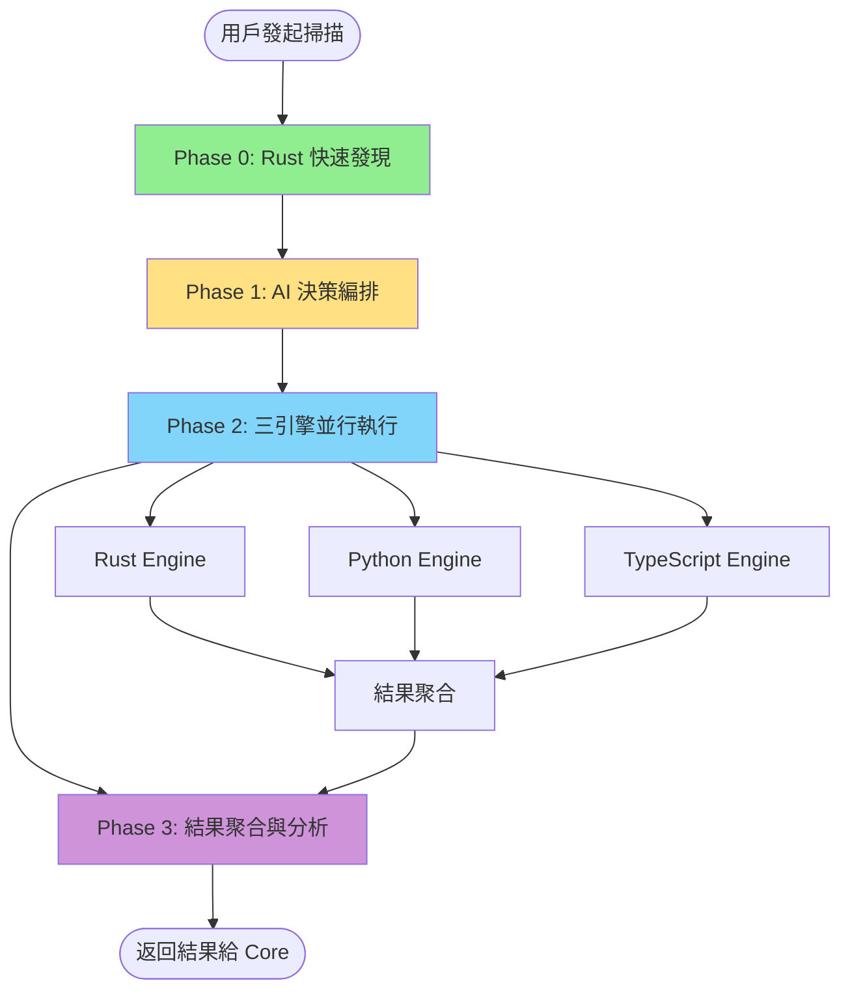

# 🎯 AIVA Scan Coordinators - 掃描協調器

**導航**: [← 返回 Scan 總覽](../README.md) | [📊 完整流程圖](../SCAN_FLOW_DIAGRAMS.md) | [🔧 引擎文檔](../engines/ENGINES_DOCUMENTATION_INDEX.md)

> **角色定位**: Scan 模組的核心協調層，負責管理和協調四個語言引擎的掃描工作  
> **設計原則**: 遵循 aiva_common 規範，禁止重複定義，實現單一數據來源  
> **當前狀態**: 🟡 部分實現 - Rust 已驗證，Python 功能不完整，TypeScript/Go 待整合  
> **最後更新**: 2025-11-20

---

## 📋 目錄

### 核心組件
- [📊 功能概覽](#功能概覽)
- [🏗️ 架構設計](#架構設計)
- [📦 核心模組](#核心模組)
  - [MultiEngineCoordinator](#multienginecoordinator---多引擎協調器)
  - [UnifiedScanEngine](#unifiedscanengine---統一掃描引擎)
  - [ScanModels](#scanmodels---數據模型)
  - [Target Generators](#target-generators---目標生成器)

### 技術文檔
- [🔄 掃描流程](#掃描流程)
- [📡 消息架構](#消息架構)
- [🎯 使用方式](#使用方式)
- [📊 實際狀態](#實際狀態)

### 開發指南
- [🛠️ 開發規範](#開發規範)
- [🧪 測試驗證](#測試驗證)
- [🔗 相關文檔](#相關文檔)

---

## 📊 功能概覽

### 核心職責

協調器模組作為 Scan 模組的核心協調層，負責：

1. **引擎管理** - 協調 4 個掃描引擎（Rust、Python、TypeScript、Go）
2. **掃描編排** - 實現多階段掃描流程（Phase 0 → Phase 1 → Phase 2）
3. **結果聚合** - 整合各引擎掃描結果，去重和關聯分析
4. **消息通信** - 通過 RabbitMQ 與其他模組交互
5. **數據標準化** - 遵循 aiva_common 規範，確保數據一致性

### 組件統計

| 指標 | 數值 | 說明 |
|------|------|------|
| **Python 模組** | 4 個 | 核心協調邏輯 |
| **文檔文件** | 4 個 | 設計和狀態文檔 |
| **目標生成器** | 2 個 | 測試目標和實時掃描 |
| **數據模型** | 3 類 | 協調元數據、引擎狀態、結果聚合 |
| **支援引擎** | 4 個 | Rust、Python、TypeScript、Go |

---

## 🏗️ 架構設計

### 設計原則

協調器遵循以下核心設計原則：

```
┌─────────────────────────────────────────────────────────┐
│                    設計原則                              │
├─────────────────────────────────────────────────────────┤
│  1. aiva_common 優先 - 禁止重複定義 Schema              │
│  2. 單一數據來源 - 所有標準數據從 aiva_common 導入      │
│  3. 異步消息架構 - 使用 MessageBroker 進行模組通信      │
│  4. 階段式掃描 - Phase 0 → Phase 1 → Phase 2           │
│  5. 引擎協同 - 發揮各引擎技術優勢                        │
└─────────────────────────────────────────────────────────┘
```

### 架構層次

```
services/scan/coordinators/
│
├─ 📊 數據層 (Data Layer)
│   └─ scan_models.py - 數據模型定義（最小化，優先使用 aiva_common）
│
├─ 🎯 協調層 (Coordination Layer)
│   ├─ multi_engine_coordinator.py - 多引擎協調器
│   └─ unified_scan_engine.py - 統一掃描引擎
│
├─ 🔧 工具層 (Utility Layer)
│   └─ target_generators/ - 目標生成器
│       ├─ generate_test_targets.py - 測試目標生成
│       └─ live_target_scanner.py - 實時目標掃描
│
└─ 📚 文檔層 (Documentation Layer)
    ├─ COORDINATOR_ACTUAL_STATUS.md - 實際狀態報告
    ├─ COORDINATOR_ENGINE_INTEGRATION_DESIGN.md - 引擎整合設計
    ├─ MULTI_ENGINE_COORDINATION_COMPLETE_ANALYSIS.md - 完整分析
    └─ PYTHON_ENGINE_USAGE_GUIDE.md - Python 引擎使用指南
```

---

## 📦 核心模組

### MultiEngineCoordinator - 多引擎協調器

**文件**: `multi_engine_coordinator.py` (689 行)

**功能**: 協調 Rust、Python、TypeScript、Go 四個引擎的掃描工作

#### 核心特性

1. **階段式掃描** (基於 OWASP 和 Nmap 最佳實踐)
   - **Phase 0**: Rust 快速發現 (Fast Discovery)
   - **Phase 1**: AI 決策編排 (Core 模組)
   - **Phase 2**: 三引擎並行執行
   - **Phase 3**: 結果聚合與分析 (Integration 模組)

2. **引擎管理**
   - 動態引擎選擇
   - 並行執行控制
   - 錯誤處理和恢復
   - 超時管理

3. **結果處理**
   - 資產去重
   - 關聯分析
   - 質量評分
   - 統計報告

#### 使用範例

```python
from services.scan.coordinators import MultiEngineCoordinator
from services.aiva_common.schemas import ScanStartPayload

# 創建協調器
coordinator = MultiEngineCoordinator()

# 配置掃描
scan_request = ScanStartPayload(
    scan_id="scan_001",
    targets=["https://example.com"],
    max_depth=3
)

# 執行多引擎掃描
result = await coordinator.coordinate_scan(scan_request)

# 查看結果
print(f"總資產: {result.total_assets}")
print(f"掃描時間: {result.total_time}秒")
```

#### 關鍵方法

| 方法 | 功能 | 返回 |
|------|------|------|
| `coordinate_scan()` | 協調多引擎掃描 | `CoordinatedScanResult` |
| `_run_rust_engine()` | 執行 Rust 引擎 | `EngineResult` |
| `_run_python_engine()` | 執行 Python 引擎 | `EngineResult` |
| `_run_typescript_engine()` | 執行 TypeScript 引擎 | `EngineResult` |
| `_aggregate_results()` | 聚合引擎結果 | `CoordinatedScanResult` |

---

### UnifiedScanEngine - 統一掃描引擎

**文件**: `unified_scan_engine.py` (302 行)

**功能**: 提供統一的掃描接口，基於異步消息隊列架構

#### 核心特性

1. **異步消息架構**
   - 使用 `MessageBroker` 進行消息通信
   - 實施異步任務派發和結果收集
   - 遵循 12-factor app 原則

2. **掃描模式**
   - **Fast**: 快速掃描模式
   - **Comprehensive**: 綜合掃描模式
   - **Aggressive**: 激進掃描模式

3. **配置管理**
   - 靈活的掃描配置
   - 動態參數調整
   - 會話管理

#### 使用範例

```python
from services.scan.coordinators import UnifiedScanEngine
from services.scan.coordinators.unified_scan_engine import UnifiedScanConfig

# 配置掃描
config = UnifiedScanConfig(
    targets=["https://example.com"],
    scan_type="comprehensive",
    max_depth=3,
    max_pages=100
)

# 創建引擎
engine = UnifiedScanEngine(config)

# 執行掃描
result = await engine.run_comprehensive_scan()
```

#### 配置參數

| 參數 | 類型 | 預設值 | 說明 |
|------|------|--------|------|
| `targets` | `List[str]` | 必填 | 掃描目標 URL 列表 |
| `scan_type` | `str` | `"comprehensive"` | 掃描類型 |
| `max_depth` | `int` | `3` | 最大爬取深度 |
| `max_pages` | `int` | `100` | 最大頁面數 |
| `enable_plugins` | `bool` | `True` | 啟用插件 |
| `output_format` | `str` | `"json"` | 輸出格式 |

---

### ScanModels - 數據模型

**文件**: `scan_models.py` (174 行)

**功能**: 定義協調器特有的數據模型，遵循 aiva_common 規範

#### 設計原則

```
┌─────────────────────────────────────────────────────────┐
│              ScanModels 設計原則                         │
├─────────────────────────────────────────────────────────┤
│  ✅ 優先使用 aiva_common 的標準 Schema                   │
│  ✅ 禁止重複定義，遵循單一數據來源原則                   │
│  ✅ 只定義協調器特有的、aiva_common 中不存在的模型        │
│  ✅ 所有新模型都要有明確的業務場景和必要性說明            │
└─────────────────────────────────────────────────────────┘
```

#### 從 aiva_common 導入的標準 Schema

```python
# 枚舉
from services.aiva_common.enums import (
    AssetType, Confidence, Severity,
    VulnerabilityStatus, VulnerabilityType
)

# 基礎 Schema
from services.aiva_common.schemas import (
    Asset, Vulnerability, ScanStartPayload,
    ScanCompletedPayload, Summary
)

# 資產 Schema
from services.aiva_common.schemas.assets import (
    AssetInventoryItem, DiscoveredAsset, EASMAsset
)

# 分析 Schema
from services.aiva_common.schemas.findings import (
    JavaScriptAnalysisResult
)
```

#### 協調器特有模型（僅 3 個）

| 模型 | 用途 | 必要性說明 |
|------|------|-----------|
| `ScanCoordinationMetadata` | 協調控制元數據 | 追蹤多引擎協調過程 |
| `EngineStatus` | 引擎狀態監控 | 記錄各引擎執行狀態 |
| `MultiEngineCoordinationResult` | 結果聚合 | 整合多引擎掃描結果 |

**關鍵原則**: 只保留 3 個真正的協調器特有模型，其餘全部從 aiva_common 導入。

---

### Target Generators - 目標生成器

**目錄**: `target_generators/` (2 個文件)

#### 1. generate_test_targets.py - 測試目標生成器

**功能**: 生成多種測試目標配置，用於開發和驗證

**支援目標類型**:
- OWASP Juice Shop (完整 Bug Bounty 測試)
- DVWA (漏洞測試平台)
- WebGoat (OWASP 教學平台)
- Damn Vulnerable GraphQL (GraphQL 漏洞測試)
- 自定義測試目標

**使用方式**:
```bash
# 生成測試目標
python target_generators/generate_test_targets.py

# 選擇目標類型
# [1] Juice Shop
# [2] DVWA
# [3] All Targets
```

#### 2. live_target_scanner.py - 實時目標掃描

**功能**: 對實時目標執行掃描，用於生產環境

**特性**:
- 支援多目標並行掃描
- 實時結果回饋
- 錯誤處理和重試
- 進度追蹤

---

## 🔄 掃描流程

### 完整掃描流程（4 階段）



### Phase 0: Rust 快速發現

**執行者**: Rust Engine  
**時間限制**: 10 分鐘  
**目標**: 大範圍快速掃描，識別技術棧

**輸出**:
- 目標基礎資訊
- 技術棧識別（PHP/Java/Node.js/.NET）
- 敏感特徵標記（API 端點/管理介面/配置檔）
- 初步端點列表

### Phase 1: AI 決策編排

**執行者**: Core 模組（非 Scan 職責）  
**輸入**: Phase 0 Rust 掃描結果  
**輸出**: 三引擎組合策略

**決策邏輯**:
- 分析目標特徵
- 生成引擎組合策略
- 分配掃描任務

### Phase 2: 三引擎並行執行

**執行者**: Scan 模組（協調器控制）  
**並行引擎**:
1. **Python 引擎** - 靜態內容抓取
2. **TypeScript 引擎** - 動態渲染（SPA/React/Vue）
3. **Rust 引擎** - 敏感資訊深度掃描 + 密鑰驗證

### Phase 3: 結果聚合與分析

**執行者**: Integration 模組（部分在 Scan 完成）  
**處理流程**:
1. 整合三引擎掃描結果
2. 去重和關聯分析
3. 質量評分
4. 生成統計報告

---

## 📡 消息架構

### RabbitMQ 通信模式

協調器使用 RabbitMQ 進行模組間通信：

```
┌─────────────────────────────────────────────────────────┐
│                    消息流向                              │
├─────────────────────────────────────────────────────────┤
│                                                          │
│  Core Module                                             │
│      ↓ (發送掃描任務)                                     │
│  RabbitMQ: task.scan.phase0                              │
│      ↓                                                   │
│  Scan Coordinator                                        │
│      ↓ (派發引擎任務)                                     │
│  ├─ Rust Worker (task.scan.rust)                        │
│  ├─ Python Worker (task.scan.python)                    │
│  └─ TypeScript Worker (task.scan.typescript)            │
│      ↓ (收集結果)                                         │
│  Scan Coordinator                                        │
│      ↓ (返回結果)                                         │
│  RabbitMQ: results.scan.completed                        │
│      ↓                                                   │
│  Core Module                                             │
│                                                          │
└─────────────────────────────────────────────────────────┘
```

### 關鍵隊列

| 隊列名稱 | 方向 | 用途 |
|---------|------|------|
| `task.scan.phase0` | Core → Scan | Phase 0 掃描任務 |
| `task.scan.phase1` | Core → Scan | Phase 1 掃描任務 |
| `task.scan.rust` | Coordinator → Rust | Rust 引擎任務 |
| `task.scan.python` | Coordinator → Python | Python 引擎任務 |
| `task.scan.typescript` | Coordinator → TypeScript | TypeScript 引擎任務 |
| `results.scan.completed` | Scan → Core | 掃描完成結果 |

---

## 🎯 使用方式

### 基本使用

```python
import asyncio
from services.scan.coordinators import MultiEngineCoordinator
from services.aiva_common.schemas import ScanStartPayload

async def run_scan():
    # 創建協調器
    coordinator = MultiEngineCoordinator()
    
    # 配置掃描請求
    scan_request = ScanStartPayload(
        scan_id="scan_001",
        targets=["https://juice-shop.herokuapp.com"],
        max_depth=3,
        plugins=["xss", "sqli"]
    )
    
    # 執行掃描
    result = await coordinator.coordinate_scan(scan_request)
    
    # 處理結果
    print(f"✅ 掃描完成！")
    print(f"  總資產: {result.total_assets}")
    print(f"  掃描時間: {result.total_time:.2f}秒")
    print(f"  引擎結果: {len(result.engine_results)} 個")
    
    # 按類型查看資產
    for asset_type, count in result.assets_by_type.items():
        print(f"  - {asset_type}: {count} 個")

# 運行
asyncio.run(run_scan())
```

### 高級配置

```python
from services.scan.coordinators import MultiEngineCoordinator

# 自定義引擎選擇
coordinator = MultiEngineCoordinator(
    enabled_engines=["rust", "python"],  # 只使用 Rust 和 Python
    coordination_strategy="sequential"   # 順序執行而非並行
)

# 自定義超時
scan_request = ScanStartPayload(
    scan_id="scan_002",
    targets=["https://example.com"],
    timeout=1800,  # 30 分鐘超時
    max_concurrent_requests=50
)

result = await coordinator.coordinate_scan(scan_request)
```

---

## 📊 實際狀態

> **詳細報告**: [COORDINATOR_ACTUAL_STATUS.md](./COORDINATOR_ACTUAL_STATUS.md)

### ✅ 已實現並驗證

| 組件 | 狀態 | 驗證情況 |
|------|------|----------|
| **Rust Engine** | ✅ 完全可用 | 真實靶場測試：84 個 JS findings |
| **Rust Worker** | ✅ 正常運作 | 通過 RabbitMQ Phase 0 測試 |
| **協調器框架** | ✅ 基本完成 | 可調用各引擎，結果聚合功能正常 |

### ⚠️ 部分實現

| 組件 | 狀態 | 問題描述 |
|------|------|----------|
| **Python Engine** | ⚠️ 功能不完整 | 只能爬取首頁，無法深度爬取 |
| **Phase 1 爬蟲** | ⚠️ 淺層爬取 | 測試結果：1 URL, 0 forms（應該有100+）|
| **協調器 Python 調用** | ✅ 已修正 | 可實際調用 ScanOrchestrator |

### ❌ 未實現功能

| 組件 | 狀態 | 原因 |
|------|------|------|
| **TypeScript Engine** | ❌ 未實現 | Worker 尚未創建，返回空結果 |
| **Go Engine** | ❌ 未整合 | 文檔中未說明調用方式 |
| **多引擎並行** | ❌ 不可用 | 僅 Rust 和 Python 有功能，但 Python 不完整 |

### 改進建議

1. **完善 Python Engine** - 實現真正的深度爬取功能
2. **整合 TypeScript Engine** - 創建 Worker 並實現 SPA 掃描
3. **添加 Go Engine** - 整合 SSRF/CSPM/SCA 掃描器
4. **優化結果聚合** - 改進去重和關聯分析算法
5. **增加測試覆蓋** - 添加更多單元測試和集成測試

---

## 🛠️ 開發規範

### 數據模型規範

**必須遵循**:
1. ✅ 優先使用 `aiva_common` 的標準 Schema
2. ✅ 禁止重複定義，遵循單一數據來源原則
3. ✅ 只在 `aiva_common` 沒有的情況下才定義新模型
4. ✅ 所有新模型都要有明確的業務場景和必要性說明

**審查清單**:
- [ ] 檢查 `aiva_common` 是否已有相同功能的 Schema
- [ ] 確認新模型的業務必要性
- [ ] 添加詳細的文檔說明
- [ ] 在 `__init__.py` 中正確導出

### 代碼風格

遵循 Python PEP 8 和 AIVA 項目規範：

```python
# ✅ 好的範例
from services.aiva_common.schemas import Asset, ScanStartPayload
from services.scan.coordinators import MultiEngineCoordinator

async def coordinate_scan(request: ScanStartPayload) -> CoordinatedScanResult:
    """協調多引擎掃描
    
    Args:
        request: 掃描請求
        
    Returns:
        CoordinatedScanResult: 協調掃描結果
    """
    coordinator = MultiEngineCoordinator()
    return await coordinator.coordinate_scan(request)

# ❌ 壞的範例
from services.scan.coordinators.scan_models import Asset  # 重複定義！
```

### 異步編程規範

```python
# ✅ 正確的異步調用
async def run_engines():
    # 並行執行
    results = await asyncio.gather(
        run_rust_engine(),
        run_python_engine(),
        run_typescript_engine()
    )
    return results

# ❌ 錯誤的同步調用
def run_engines():
    results = []
    results.append(run_rust_engine())  # 阻塞！
    return results
```

---

## 🧪 測試驗證

### 單元測試

```bash
# 運行所有測試
pytest services/scan/coordinators/tests/

# 運行特定測試
pytest services/scan/coordinators/tests/test_multi_engine_coordinator.py

# 查看覆蓋率
pytest --cov=services.scan.coordinators --cov-report=html
```

### 集成測試

```bash
# 使用測試目標生成器
cd services/scan/coordinators
python target_generators/generate_test_targets.py

# 運行實時掃描測試
python target_generators/live_target_scanner.py
```

### Docker 測試

```bash
# 啟動測試環境
cd services/scan/coordinators
docker-compose -f docker-compose.scan.yml up -d

# 發送測試任務
docker-compose -f docker-compose.scan.yml run --rm test-target-generator

# 查看日誌
docker logs -f aiva-rust-deep-analysis
```

---

## 🔗 相關文檔

### 內部文檔

- **[COORDINATOR_ACTUAL_STATUS.md](./COORDINATOR_ACTUAL_STATUS.md)** - 實際狀態報告（詳細功能驗證）
- **[COORDINATOR_ENGINE_INTEGRATION_DESIGN.md](./COORDINATOR_ENGINE_INTEGRATION_DESIGN.md)** - 引擎整合設計
- **[MULTI_ENGINE_COORDINATION_COMPLETE_ANALYSIS.md](./MULTI_ENGINE_COORDINATION_COMPLETE_ANALYSIS.md)** - 完整協調分析
- **[PYTHON_ENGINE_USAGE_GUIDE.md](./PYTHON_ENGINE_USAGE_GUIDE.md)** - Python 引擎使用指南

### 引擎文檔

- **[Rust Engine](../engines/rust_engine/README.md)** - Phase0 核心 + Phase1 高性能
- **[Python Engine](../engines/python_engine/README.md)** - Phase1 主力爬蟲引擎
- **[TypeScript Engine](../engines/typescript_engine/README.md)** - SPA 動態渲染引擎
- **[Go Engine](../engines/go_engine/README.md)** - SSRF/CSPM/SCA 專用引擎

### 架構文檔

- **[Scan 總覽](../README.md)** - Scan 模組完整說明
- **[完整流程圖](../SCAN_FLOW_DIAGRAMS.md)** - 兩階段掃描架構
- **[引擎完成度分析](../engines/ENGINE_COMPLETION_ANALYSIS.md)** - 各引擎狀態對比
- **[引擎文檔索引](../engines/ENGINES_DOCUMENTATION_INDEX.md)** - 所有引擎文檔入口

### 核心架構

- **[aiva_common 文檔](../../aiva_common/README.md)** - 共享數據模型和工具
- **[Core 模組](../../core/README.md)** - 指揮官模組
- **[Integration 模組](../../integration/README.md)** - 結果整合模組

---

## 📞 技術支持

### 常見問題

**Q: 為什麼 Python Engine 無法深度爬取？**  
A: 當前 Python Engine 功能不完整，只能爬取首頁。需要完善深度爬取邏輯。

**Q: TypeScript Engine 返回空結果？**  
A: TypeScript Worker 尚未實現，需要創建對應的 Worker 來處理 SPA 掃描。

**Q: 如何添加新的引擎？**  
A: 1) 在 `engines/` 目錄創建引擎；2) 在 `multi_engine_coordinator.py` 添加引擎調用方法；3) 更新 `EngineType` 枚舉。

**Q: 數據模型應該定義在哪裡？**  
A: 優先使用 `aiva_common` 的標準 Schema。只有協調器特有的模型才定義在 `scan_models.py`。

### 獲取幫助

- **GitHub Issues**: [AIVA 問題追蹤](https://github.com/kyle0527/AIVA/issues)
- **文檔中心**: [AIVA 完整文檔](../../../docs/README.md)
- **開發團隊**: 查看項目 README 聯繫方式

---

**最後更新**: 2025-11-20  
**維護者**: AIVA 開發團隊  
**版本**: 1.0.0
