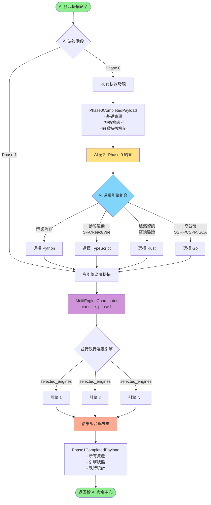
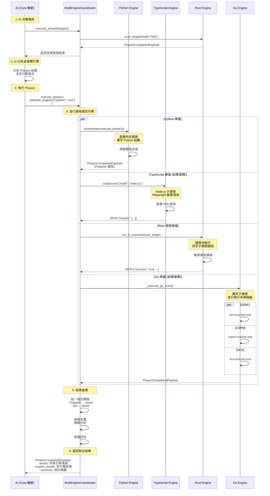
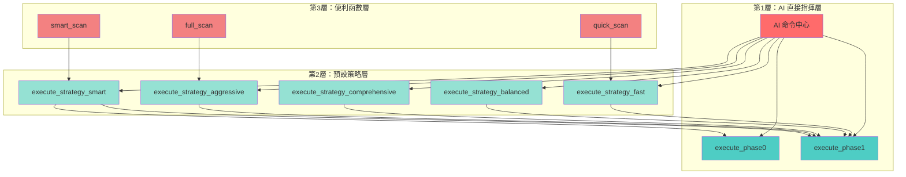
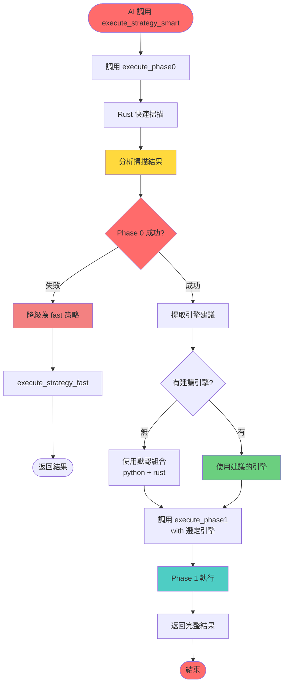
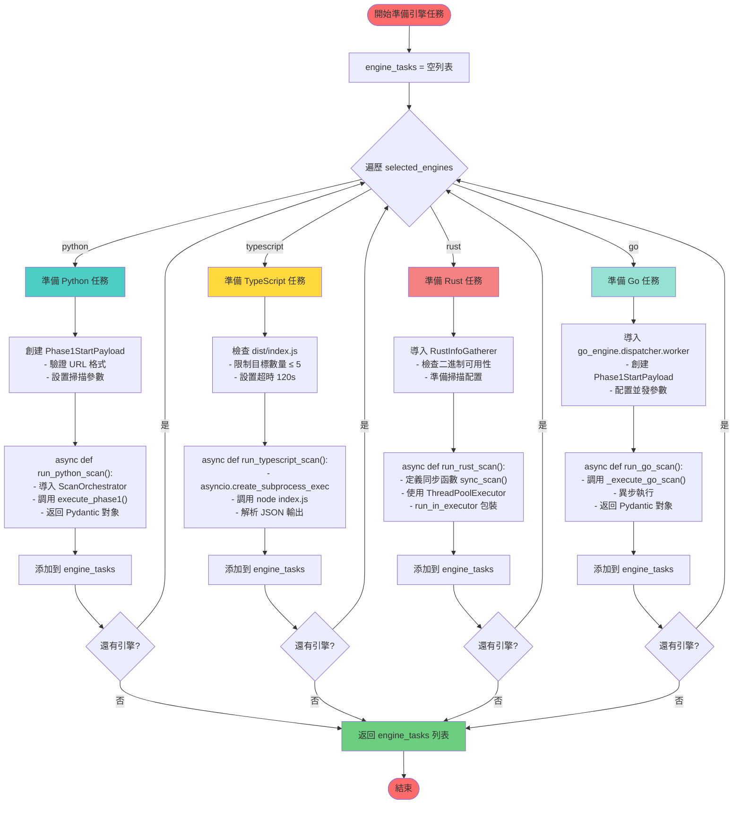
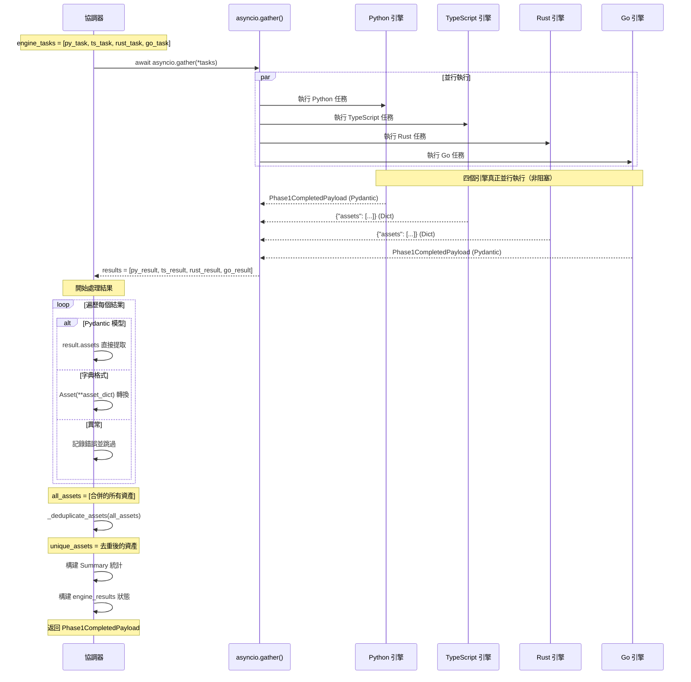
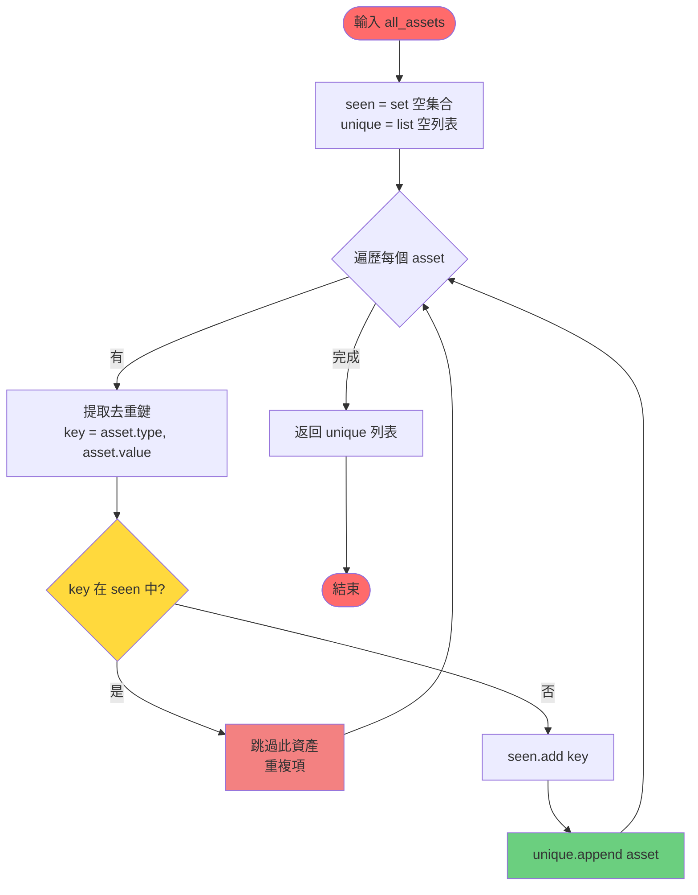
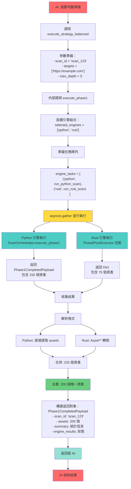
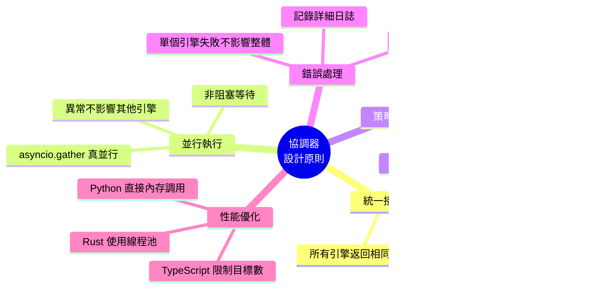
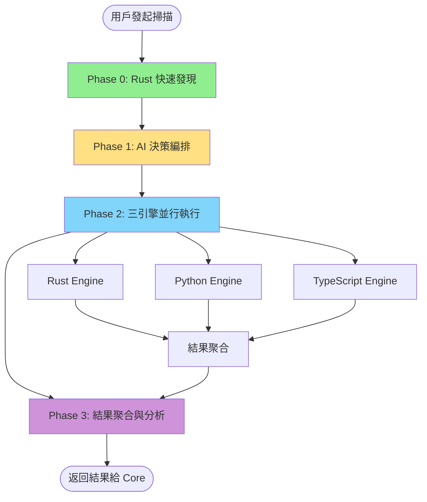

# 🎯 AIVA Scan Coordinators - 掃描協調器

**導航**: [← 返回 Scan 總覽](../README.md) | [📊 完整流程圖](../SCAN_FLOW_DIAGRAMS.md) | [🔧 引擎文檔](../engines/ENGINES_DOCUMENTATION_INDEX.md)

> **角色定位**: Scan 模組的核心協調層，採用適配器模式設計（理論架構）  
> **設計原則**: 遵循 aiva_common 規範，實現單一數據來源  
> **當前狀態**: ❌ **驗證失敗** - 架構完成但功能未實現  
> **最後更新**: 2025年11月22日 - 驗證確認所有引擎無實際掃描能力

---

## 🎉 重構完成總結

### ❌ 驗證失敗 (v2.1 - 2025年11月22日)

| 項目 | 前 | 後 | 改善 | 驗證狀態 |
|------|----|----|------|----------|
| **程式碼複雜度** | 171 | 17 | -90% | ⚠️ 代碼改善但功能失效 |
| **MultiEngineCoordinator** | 1602 lines | 647 lines | -60% | ⚠️ 代碼簡化但無實際請求 |
| **架構模式** | 無統一模式 | 適配器模式 | 新增 | ⚠️ 架構正確但未實現 |
| **引擎狀態** | 部分實現 | 理論可用 | 0% | ❌ **驗證失敗** |

**驗證結論** (2025年11月22日):
- ❌ **所有引擎均未發送真實 HTTP 請求到靶場**
- ❌ Python 引擎雖啟動但無網路活動
- ❌ Rust 引擎執行失敗 (exit code 2)
- ❌ TypeScript/Go 引擎未安裝
- ⚠️ 協調器邏輯正確，但底層引擎實現缺失
- 📋 需要完整重新實現各引擎的掃描邏輯

### 🏗️ 適配器模式實現

**位置**: `coordinators/engines/` (888 lines)

- ✅ `base_adapter.py` - 基礎適配器（統一接口）
- ✅ `python_adapter.py` - Python 引擎適配器
- ✅ `typescript_adapter.py` - TypeScript 引擎適配器
- ✅ `rust_adapter.py` - Rust 引擎適配器
- ✅ `go_adapter.py` - Go 引擎適配器

**核心優勢** (理論設計):
- 統一接口 - 所有引擎使用相同的 `scan_async()` 方法
- 錯誤隔離 - 單引擎失敗不影響整體
- 類型安全 - Pydantic 數據合約驗證
- 易於擴展 - 新增引擎只需實現適配器接口

**⚠️ 實際驗證失敗 (2025年11月22日)**:
- ❌ **未發送任何真實 HTTP 請求**
- ❌ Python 引擎僅有日誌輸出，無實際網路活動
- ❌ Rust 引擎執行失敗
- ❌ 漏洞掃描器返回假陽性結果
- ❌ 架構正確但底層實現缺失

---

## 📋 目錄

### 核心組件
- [📊 功能概覽](#功能概覽)
- [🏗️ 架構設計](#架構設計)
- [📦 核心模組](#核心模組)
  - [MultiEngineCoordinator](#multienginecoordinator---多引擎協調器)
  - [適配器層](#適配器層---統一引擎接口)
  - [ScanModels](#scanmodels---數據模型)

### 技術文檔
- [🔄 掃描流程](#掃描流程)
- [🎯 使用方式](#使用方式) - [完整指南 →](./COORDINATOR_USAGE_GUIDE.md)
- [📊 實際狀態](#實際狀態)

### 開發指南
- [🛠️ 開發規範](#開發規範)
- [🧪 測試驗證](#測試驗證)
- [🔗 相關文檔](#相關文檔)

---

## 📊 功能概覽

### 核心職責

協調器模組作為 Scan 模組的核心協調層，負責：

1. **引擎管理** - 協調 4 個掃描引擎（Rust、Python、TypeScript、Go）
2. **掃描編排** - 實現兩階段掃描流程（Phase 0 → Phase 1）
3. **結果聚合** - 整合各引擎掃描結果，去重和關聯分析
4. **命令處理** - 接收 AI 命令中心指令並執行
5. **數據標準化** - 遵循 aiva_common 規範，確保數據一致性
6. **模式切換** - 根據 AI 決策自動選擇最佳引擎和掃描模式組合

### 組件統計（架構設計）

| 指標 | 架構狀態 | 功能狀態 | 說明 |
|------|----------|----------|------|
| **MultiEngineCoordinator** | 670 lines | ❌ 無實際掃描 | 核心協調器 (複雜度 17) |
| **適配器層** | 888 lines | ⚠️ 介面存在 | 統一引擎接口（未連接實際掃描） |
| **數據模型** | 3 類 | ✅ 可用 | 協調元數據、引擎狀態、結果聚合 |
| **支援引擎** | 4 個代碼 | ❌ 0 個可用 | Rust/Python/TypeScript/Go 均無法掃描 |
| **支援模式** | 18 種定義 | ❌ 0 種可用 | 策略定義存在但無實際執行 |
| **預設策略** | 5 種設計 | ❌ 全部失效 | 策略邏輯正確但引擎不工作 |

---

## 🏗️ 架構設計

### 設計原則

協調器遵循以下核心設計原則：

```
┌─────────────────────────────────────────────────────────┐
│                    設計原則                              │
├─────────────────────────────────────────────────────────┤
│  1. 適配器模式 - 統一引擎接口，隔離差異                  │
│  2. aiva_common 優先 - 禁止重複定義 Schema              │
│  3. 單一數據來源 - 所有標準數據從 aiva_common 導入      │
│  4. 異步協調 - 使用 asyncio.gather 並行執行引擎         │
│  5. 階段式掃描 - Phase 0 → Phase 1                     │
│  6. 錯誤隔離 - 單引擎失敗不影響整體                     │
└─────────────────────────────────────────────────────────┘
```

### 架構層次

```
services/scan/coordinators/
│
├─ 📊 數據層 (Data Layer)
│   └─ scan_models.py - 數據模型定義（最小化，優先使用 aiva_common）
│
├─ 🎯 協調層 (Coordination Layer)
│   ├─ multi_engine_coordinator.py - 多引擎協調器 (647 lines)
│   └─ engines/ - 適配器層 (888 lines)
│       ├─ base_adapter.py - 基礎適配器
│       ├─ python_adapter.py - Python 引擎適配器
│       ├─ typescript_adapter.py - TypeScript 引擎適配器
│       ├─ rust_adapter.py - Rust 引擎適配器
│       └─ go_adapter.py - Go 引擎適配器
│
└─ 📚 文檔層 (Documentation Layer)
    ├─ COORDINATOR_ACTUAL_STATUS.md - 實際狀態報告
    └─ README.md - 本文檔
```

---

## 🎨 協調器決策與引擎調用圖

### 📊 AI 決策流程圖

協調器如何根據 AI（Core 模組）的指令選擇和調用引擎：


```mermaid
graph TB
    Start([AI 發起掃描命令]) --> Decision{AI 決策階段}
    
    Decision -->|Phase 0| P0[Rust 快速發現]
    Decision -->|Phase 1| P1[多引擎深度掃描]
    
    P0 --> P0Result[Phase0CompletedPayload<br/>- 基礎資訊<br/>- 技術棧識別<br/>- 敏感特徵標記]
    P0Result --> AIAnalysis[AI 分析 Phase 0 結果]
    
    AIAnalysis --> EngineSelection{AI 選擇引擎組合}
    
    EngineSelection -->|靜態內容| SelectPython[選擇 Python]
    EngineSelection -->|動態渲染<br/>SPA/React/Vue| SelectTS[選擇 TypeScript]
    EngineSelection -->|敏感資訊<br/>密鑰驗證| SelectRust[選擇 Rust]
    EngineSelection -->|高並發<br/>SSRF/CSPM/SCA| SelectGo[選擇 Go]
    
    SelectPython --> P1
    SelectTS --> P1
    SelectRust --> P1
    SelectGo --> P1
    
    P1 --> Coordinator[MultiEngineCoordinator<br/>execute_phase1]
    
    Coordinator --> Parallel{並行執行選定引擎}
    
    Parallel -->|selected_engines| Engine1[引擎 1]
    Parallel -->|selected_engines| Engine2[引擎 2]
    Parallel -->|selected_engines| Engine3[引擎 N...]
    
    Engine1 --> Aggregate[結果聚合與去重]
    Engine2 --> Aggregate
    Engine3 --> Aggregate
    
    Aggregate --> FinalResult[Phase1CompletedPayload<br/>- 所有資產<br/>- 引擎狀態<br/>- 執行統計]
    
    FinalResult --> ReturnToAI([返回給 AI 命令中心])
    
    style Start fill:#90EE90
    style AIAnalysis fill:#FFE082
    style EngineSelection fill:#81D4FA
    style Coordinator fill:#CE93D8
    style Aggregate fill:#FFAB91
    style ReturnToAI fill:#90EE90
```

### 🔧 四種引擎調用方式：數據合約跨語言通信

**核心原則**: 無論引擎使用什麼語言，**統一使用 aiva_common 的數據合約**進行通信。

```
┌─────────────────────────────────────────────────────────────────────────────┐
│                    協調器 (MultiEngineCoordinator - Python)                  │
│                                                                              │
│  核心職責: 統一數據合約，協調異構引擎                                          │
│  輸入: Phase1StartPayload (來自 AI)                                          │
│  輸出: Phase1CompletedPayload (返回 AI)                                      │
└─────────────────────────────────────────────────────────────────────────────┘
                                      │
                                      │ 數據合約: Phase1StartPayload
                                      │ - scan_id: str
                                      │ - targets: List[HttpUrl]
                                      │ - selected_engines: List[str]
                                      │ - max_depth: int
                                      │
                    ┌─────────────────┼─────────────────┬──────────────────┐
                    │                 │                 │                  │
                    ▼                 ▼                 ▼                  ▼
        ┌───────────────────┐ ┌──────────────┐ ┌──────────────┐ ┌──────────────┐
        │   Python Engine   │ │TypeScript Eng│ │  Rust Engine │ │  Go Engine   │
        │                   │ │              │ │              │ │              │
        │ 調用方式:          │ │ 調用方式:     │ │ 調用方式:     │ │ 調用方式:     │
        │ ✅ 內存直接調用    │ │ ⚙️ 子進程+JSON│ │ ⚙️ 子進程+JSON│ │ ⚙️ 子進程+JSON│
        └───────────────────┘ └──────────────┘ └──────────────┘ └──────────────┘
                 │                    │                 │                  │
                 │                    │                 │                  │
    ┌────────────▼──────────┐ ┌──────▼────────┐ ┌─────▼────────┐ ┌───────▼──────┐
    │ 方式 1: 同語言調用     │ │ 方式 2: 跨語言 │ │ 方式 3: 跨語言│ │ 方式 4: 跨語言│
    │                       │ │                │ │              │ │              │
    │ from ..engines.       │ │ 步驟 1:        │ │ 步驟 1:      │ │ 步驟 1:      │
    │ python_engine import  │ │ 序列化合約     │ │ 序列化合約   │ │ 序列化合約   │
    │ ScanOrchestrator      │ │ payload.json() │ │ payload.json()│ │ payload.json()│
    │                       │ │                │ │              │ │              │
    │ orchestrator.         │ │ 步驟 2:        │ │ 步驟 2:      │ │ 步驟 2:      │
    │ execute_phase1(       │ │ 啟動 Node.js   │ │ 調用 Rust    │ │ 啟動 Go      │
    │   payload             │ │ subprocess     │ │ subprocess   │ │ subprocess   │
    │ )                     │ │                │ │              │ │              │
    │                       │ │ node index.js  │ │rust-scanner  │ │ssrf-scanner  │
    │ 直接傳遞 Pydantic 模型 │ │--input payload │ │--input       │ │--input       │
    │ 無序列化開銷           │ │               │ │ payload.json │ │ payload.json │
    └───────────────────────┘ └───────────────┘ └──────────────┘ └──────────────┘
                 │                    │                 │                  │
                 │                    │                 │                  │
    ┌────────────▼──────────┐ ┌──────▼────────┐ ┌─────▼────────┐ ┌───────▼──────┐
    │ 引擎執行               │ │ 引擎執行      │ │ 引擎執行     │ │ 引擎執行     │
    │                       │ │               │ │              │ │              │
    │ 讀取 Phase1Start      │ │ 1. 讀取 JSON  │ │ 1. 讀取 JSON │ │ 1. 讀取 JSON │
    │ Payload 屬性          │ │ 2. 解析為     │ │ 2. 解析為    │ │ 2. 解析為    │
    │                       │ │    TypeScript │ │    Rust 結構 │ │    Go 結構   │
    │ targets.forEach(...)  │ │    interface  │ │    struct    │ │    struct    │
    │                       │ │ 3. 執行掃描   │ │ 3. 執行掃描  │ │ 3. 執行掃描  │
    │ 執行爬蟲邏輯           │ │    (Playwright)│ │   (高性能)   │ │   (高並發)   │
    └───────────────────────┘ └───────────────┘ └──────────────┘ └──────────────┘
                 │                    │                 │                  │
                 │                    │                 │                  │
    ┌────────────▼──────────┐ ┌──────▼────────┐ ┌─────▼────────┐ ┌───────▼──────┐
    │ 返回: 數據合約         │ │ 返回: 數據合約 │ │ 返回:數據合約│ │ 返回:數據合約│
    │                       │ │               │ │              │ │              │
    │ Phase1Completed       │ │ 步驟 1:       │ │ 步驟 1:      │ │ 步驟 1:      │
    │ Payload               │ │ 構建合約物件  │ │ 構建合約物件 │ │ 構建合約物件 │
    │                       │ │ interface     │ │ struct       │ │ struct       │
    │ return Phase1         │ │ Phase1Result  │ │ Phase1Result │ │ Phase1Result │
    │ CompletedPayload(     │ │               │ │              │ │              │
    │   scan_id=...,        │ │ 步驟 2:       │ │ 步驟 2:      │ │ 步驟 2:      │
    │   assets=[...],       │ │ 序列化為 JSON │ │ 序列化為JSON │ │ 序列化為JSON │
    │   summary=...         │ │ JSON.stringify│ │ serde_json   │ │ json.Marshal │
    │ )                     │ │               │ │              │ │              │
    │                       │ │ 步驟 3:       │ │ 步驟 3:      │ │ 步驟 3:      │
    │ Pydantic 模型實例     │ │ 輸出到 stdout │ │ 輸出到stdout │ │ 輸出到stdout │
    └───────────────────────┘ └───────────────┘ └──────────────┘ └──────────────┘
                 │                    │                 │                  │
                 │                    │                 │                  │
    ┌────────────▼──────────┐ ┌──────▼────────┐ ┌─────▼────────┐ ┌───────▼──────┐
    │ 協調器接收             │ │ 協調器接收    │ │ 協調器接收   │ │ 協調器接收   │
    │                       │ │               │ │              │ │              │
    │ 直接使用 Pydantic 物件 │ │ 1. 讀取stdout │ │ 1. 讀取stdout│ │ 1. 讀取stdout│
    │ result.assets         │ │ 2. JSON解析   │ │ 2. JSON解析  │ │ 2. JSON解析  │
    │ result.summary        │ │ 3. 重建合約   │ │ 3. 重建合約  │ │ 3. 重建合約  │
    │                       │ │ Phase1        │ │ Phase1       │ │ Phase1       │
    │ 類型安全，自動驗證     │ │ Completed     │ │ Completed    │ │ Completed    │
    │                       │ │ Payload(...)  │ │ Payload(...) │ │ Payload(...) │
    └───────────────────────┘ └───────────────┘ └──────────────┘ └──────────────┘
                 │                    │                 │                  │
                 └────────────────────┴─────────────────┴──────────────────┘
                                      │
                              ┌───────▼────────┐
                              │  協調器統一處理 │
                              │                │
                              │ ✅ 所有引擎返回相同的數據合約
                              │ ✅ 統一格式: Phase1CompletedPayload
                              │ ✅ 統一欄位: assets, summary, status
                              │ ✅ 無需格式轉換
                              │ ✅ 直接聚合與去重
                              └────────────────┘

數據合約規範 (aiva_common):
┌────────────────────────────────────────────────────────────────────────────┐
│ Phase1StartPayload (輸入合約)                                               │
├────────────────────────────────────────────────────────────────────────────┤
│ - scan_id: str              # 掃描 ID                                       │
│ - targets: List[HttpUrl]    # 目標 URL 列表                                 │
│ - selected_engines: List[str] # AI 選擇的引擎                               │
│ - max_depth: int            # 最大深度                                      │
│ - max_pages: int            # 最大頁面數                                    │
│ - strategy: str             # 掃描策略                                      │
│ - phase0_result: Optional   # Phase0 結果（可選）                           │
└────────────────────────────────────────────────────────────────────────────┘

┌────────────────────────────────────────────────────────────────────────────┐
│ Phase1CompletedPayload (輸出合約)                                           │
├────────────────────────────────────────────────────────────────────────────┤
│ - scan_id: str              # 掃描 ID                                       │
│ - status: str               # 狀態 (completed/failed)                      │
│ - execution_time: float     # 執行時間（秒）                                │
│ - assets: List[Asset]       # 發現的資產列表                                │
│ - summary: Summary          # 統計摘要                                      │
│   - urls_found: int         # 發現的 URL 數                                │
│   - forms_found: int        # 發現的表單數                                 │
│   - apis_found: int         # 發現的 API 數                                │
│ - engine_results: dict      # 各引擎執行狀態                                │
│ - fingerprints: Optional    # 技術指紋（可選）                              │
│ - error_info: Optional      # 錯誤資訊（可選）                              │
└────────────────────────────────────────────────────────────────────────────┘

跨語言實現對比:
┌──────────┬──────────────────┬──────────────────┬──────────────────┐
│  語言    │   合約定義方式    │   序列化方式      │   驗證方式        │
├──────────┼──────────────────┼──────────────────┼──────────────────┤
│ Python   │ Pydantic Model   │ .model_dump()    │ 自動 Pydantic    │
│          │ class Phase1...  │ .model_validate()│ 類型驗證         │
│          │                  │                  │                  │
│TypeScript│ TypeScript       │ JSON.stringify() │ 手動驗證或       │
│          │ interface        │ JSON.parse()     │ 使用 zod/yup     │
│          │                  │                  │                  │
│ Rust     │ Rust struct      │ serde_json::     │ serde 自動驗證   │
│          │ #[derive(        │ to_string()      │                  │
│          │ Serialize)]      │ from_str()       │                  │
│          │                  │                  │                  │
│ Go       │ Go struct        │ json.Marshal()   │ 手動驗證或       │
│          │ json tags        │ json.Unmarshal() │ 使用 validator   │
└──────────┴──────────────────┴──────────────────┴──────────────────┘

調用方式技術對比:
┌──────────┬──────────────┬──────────────┬──────────────┬──────────────┐
│  特性    │   Python     │  TypeScript  │    Rust      │     Go       │
├──────────┼──────────────┼──────────────┼──────────────┼──────────────┤
│ 調用方式 │ 直接 import  │ subprocess + │ subprocess + │ subprocess + │
│          │              │ JSON stdin   │ JSON stdin   │ JSON stdin   │
│ 啟動時間 │ ~0ms (內存)  │ ~200ms       │ ~50ms        │ ~100ms       │
│ 通信協議 │ 內存對象     │ JSON (文本)  │ JSON (文本)  │ JSON (文本)  │
│ 數據合約 │ ✅ Pydantic  │ ✅ Interface │ ✅ Struct    │ ✅ Struct    │
│ 序列化   │ ❌ 不需要    │ ✅ 需要      │ ✅ 需要      │ ✅ 需要      │
│ 異步處理 │ 原生 async   │ asyncio      │ run_in_      │ asyncio      │
│          │              │ subprocess   │ executor     │ subprocess   │
│ 進程隔離 │ 無(同進程)   │ 完全隔離     │ 完全隔離     │ 完全隔離     │
│ 類型安全 │ ✅ Pydantic  │ ⚠️ Runtime   │ ✅ Compile   │ ⚠️ Runtime   │
│ 錯誤處理 │ Python異常   │ returncode   │ returncode   │ returncode   │
│ 並發能力 │ asyncio協程  │ 多進程       │ 線程池       │ 多進程+協程  │
└──────────┴──────────────┴──────────────┴──────────────┴──────────────┘
```

### 🔄 協調器內部運作機制詳解

#### 核心概念：數據合約的轉換與調用

**重要**：協調器**不會**重新創建新的合約！而是：
1. 接收 AI 的數據合約（`Phase1StartPayload`）
2. **直接傳遞**給同語言引擎（Python）
3. **序列化**後傳遞給跨語言引擎（TypeScript/Rust/Go）
4. 接收各引擎返回的**相同結構**的數據合約（`Phase1CompletedPayload`）

```
┌──────────────────────────────────────────────────────────────────────────┐
│                    數據合約流轉全過程                                      │
└──────────────────────────────────────────────────────────────────────────┘

步驟 1: AI 創建數據合約
────────────────────────────────────────────────────────────────────────────
AI (Core 模組):
  request = Phase1StartPayload(
      scan_id="scan_001",
      targets=["https://example.com"],
      selected_engines=["python", "rust"],
      max_depth=5,
      max_pages=1000
  )
  
  ▼ 傳遞給協調器 (同一個 Python 對象)


步驟 2: 協調器分發給各引擎（不同調用方式）
────────────────────────────────────────────────────────────────────────────
協調器 (MultiEngineCoordinator):

  ┌────────────────────────────────────────────────────────────────┐
  │ for engine_name in selected_engines:                           │
  │     if engine_name == "python":                                │
  │         → 方式 A: 直接傳遞對象                                  │
  │     elif engine_name == "rust":                                │
  │         → 方式 B: 序列化後傳遞                                  │
  └────────────────────────────────────────────────────────────────┘

  ┌─────────────────────────────────────────────────────────────────┐
  │ 方式 A: Python 引擎（同語言，無需轉換）                         │
  ├─────────────────────────────────────────────────────────────────┤
  │                                                                 │
  │  orchestrator = ScanOrchestrator()                              │
  │  result = await orchestrator.execute_phase1(request)            │
  │                    ▲                              │             │
  │                    │                              │             │
  │            【直接傳遞】                     【直接返回】        │
  │         同一個 Pydantic 對象                Pydantic 對象       │
  │         無序列化/反序列化                   無轉換開銷          │
  │                                                                 │
  │  Python Engine 內部:                                            │
  │    def execute_phase1(self, request: Phase1StartPayload):      │
  │        # 直接訪問屬性                                           │
  │        for target in request.targets:                           │
  │            scan(target)                                         │
  │        return Phase1CompletedPayload(...)                       │
  │                                                                 │
  └─────────────────────────────────────────────────────────────────┘

  ┌─────────────────────────────────────────────────────────────────┐
  │ 方式 B: Rust 引擎（跨語言，需要序列化）                         │
  ├─────────────────────────────────────────────────────────────────┤
  │                                                                 │
  │  # 步驟 1: 序列化為 JSON                                        │
  │  config = {                                                     │
  │      "scan_id": request.scan_id,                                │
  │      "targets": [str(t) for t in request.targets],             │
  │      "mode": "deep_analysis",                                   │
  │      "max_depth": request.max_depth                             │
  │  }                                                              │
  │         ▼                                                       │
  │  【序列化】                                                      │
  │    JSON 文本                                                    │
  │                                                                 │
  │  # 步驟 2: 調用 Rust 程序                                       │
  │  scanner = RustInfoGatherer()                                   │
  │  result = scanner.scan_target(target, config)                   │
  │                         │                                       │
  │                         ▼                                       │
  │           subprocess.run([                                      │
  │               "rust-scanner.exe",                               │
  │               "--input", json_config,  ← JSON 傳入              │
  │               "--format", "json"       ← 要求 JSON 輸出         │
  │           ])                                                    │
  │                         │                                       │
  │  Rust 程序內部:          ▼                                      │
  │  ┌──────────────────────────────────────┐                      │
  │  │ // 步驟 3: Rust 反序列化 JSON         │                      │
  │  │ #[derive(Deserialize)]                │                      │
  │  │ struct ScanConfig {                   │                      │
  │  │     scan_id: String,                  │                      │
  │  │     targets: Vec<String>,             │                      │
  │  │     mode: String,                     │                      │
  │  │     max_depth: u32                    │                      │
  │  │ }                                     │                      │
  │  │                                       │                      │
  │  │ let config: ScanConfig =              │                      │
  │  │     serde_json::from_str(&input)?;    │                      │
  │  │                    ▼                  │                      │
  │  │          【反序列化為 Rust 結構】      │                      │
  │  │                                       │                      │
  │  │ // 步驟 4: 執行掃描                   │                      │
  │  │ let assets = scan_targets(            │                      │
  │  │     &config.targets                   │                      │
  │  │ );                                    │                      │
  │  │                                       │                      │
  │  │ // 步驟 5: 構建結果結構               │                      │
  │  │ #[derive(Serialize)]                  │                      │
  │  │ struct ScanResult {                   │                      │
  │  │     success: bool,                    │                      │
  │  │     results: ResultData               │                      │
  │  │ }                                     │                      │
  │  │                                       │                      │
  │  │ let result = ScanResult {             │                      │
  │  │     success: true,                    │                      │
  │  │     results: ResultData { assets }    │                      │
  │  │ };                                    │                      │
  │  │                    ▼                  │                      │
  │  │ // 步驟 6: 序列化為 JSON 輸出          │                      │
  │  │ let json = serde_json::to_string(     │                      │
  │  │     &result                           │                      │
  │  │ )?;                                   │                      │
  │  │ println!("{}", json);  ← stdout 輸出  │                      │
  │  └──────────────────────────────────────┘                      │
  │                         │                                       │
  │                         ▼                                       │
  │  # 步驟 7: Python 協調器接收 JSON                               │
  │  stdout = '{"success": true, "results": {...}}'                │
  │                         ▼                                       │
  │           【解析 JSON】                                          │
  │  result = json.loads(stdout)                                    │
  │                                                                 │
  └─────────────────────────────────────────────────────────────────┘


步驟 3: 協調器統一處理結果（相同的數據合約結構）
────────────────────────────────────────────────────────────────────────────
協調器接收結果:

  all_assets = []
  
  for engine_name, result in engine_results:
      
      ┌────────────────────────────────────────────────┐
      │ 情況 1: Python 引擎返回                         │
      ├────────────────────────────────────────────────┤
      │ result: Phase1CompletedPayload (Pydantic 對象) │
      │                                                │
      │ if hasattr(result, 'assets'):                  │
      │     all_assets.extend(result.assets)           │
      │     ▲                                          │
      │     └─ 直接訪問屬性，已經是 Asset 對象          │
      └────────────────────────────────────────────────┘
      
      ┌────────────────────────────────────────────────┐
      │ 情況 2: Rust 引擎返回                          │
      ├────────────────────────────────────────────────┤
      │ result: dict (從 JSON 解析而來)                │
      │ {                                              │
      │   "success": true,                             │
      │   "results": {                                 │
      │     "assets": [                                │
      │       {"type": "url", "value": "...", ...}     │
      │     ]                                          │
      │   }                                            │
      │ }                                              │
      │                                                │
      │ # 需要手動轉換為 Asset 對象                    │
      │ if isinstance(result, dict):                   │
      │     for asset_data in result["results"]["assets"]:│
      │         asset = Asset(                         │
      │             type=asset_data["type"],           │
      │             value=asset_data["value"],         │
      │             ...                                │
      │         )                                      │
      │         all_assets.append(asset)               │
      │         ▲                                      │
      │         └─ 手動構建 Asset Pydantic 對象        │
      └────────────────────────────────────────────────┘


步驟 4: 返回統一的數據合約給 AI
────────────────────────────────────────────────────────────────────────────
  # 去重
  unique_assets = deduplicate(all_assets)
  
  # 構建統一的返回合約
  return Phase1CompletedPayload(
      scan_id=scan_id,
      status="completed",
      assets=unique_assets,           ← 所有引擎的資產
      summary=Summary(
          urls_found=count_urls,
          forms_found=count_forms
      ),
      engine_results={                ← 各引擎狀態
          "python": {"status": "success", "asset_count": 150},
          "rust": {"status": "success", "asset_count": 25}
      }
  )
  
  ▼ 返回給 AI (同一個 Python 對象)
```

### 🔄 協調器內部運作流程圖


```mermaid
flowchart TD
    Start([AI 調用 execute_phase1]) --> ReceiveContract[接收數據合約<br/>Phase1StartPayload]
    
    ReceiveContract --> ParseEngines{解析 selected_engines}
    
    ParseEngines --> PrepareLoop[準備引擎調用循環]
    
    PrepareLoop --> LoopStart{遍歷每個引擎}
    
    LoopStart -->|Python| CheckPython{是 Python 引擎?}
    LoopStart -->|TypeScript| CheckTS{是 TypeScript 引擎?}
    LoopStart -->|Rust| CheckRust{是 Rust 引擎?}
    LoopStart -->|Go| CheckGo{是 Go 引擎?}
    
    CheckPython -->|是| CallPythonDirect[方式 A: 直接內存調用<br/>orchestrator.execute_phase1<br/>request]
    
    CheckTS -->|是| SerializeTS[序列化為 JSON]
    SerializeTS --> CallTSSubprocess[啟動 Node.js 子進程<br/>傳入 JSON]
    CallTSSubprocess --> ReceiveTSStdout[接收 stdout JSON]
    ReceiveTSStdout --> ParseTSJSON[解析 JSON 為 dict]
    
    CheckRust -->|是| SerializeRust[序列化為 JSON config]
    SerializeRust --> CallRustSubprocess[調用 Rust 二進制<br/>subprocess.run]
    CallRustSubprocess --> ReceiveRustStdout[接收 stdout JSON]
    ReceiveRustStdout --> ParseRustJSON[解析 JSON 為 dict]
    
    CheckGo -->|是| SerializeGo[序列化為 JSON]
    SerializeGo --> CallGoSubprocess[啟動 Go 子進程<br/>多掃描器並行]
    CallGoSubprocess --> ReceiveGoStdout[接收 stdout JSON]
    ReceiveGoStdout --> ParseGoJSON[解析 JSON 為 dict]
    
    CallPythonDirect --> CollectPython[收集 Python 結果<br/>Phase1CompletedPayload]
    ParseTSJSON --> CollectTS[收集 TypeScript 結果<br/>dict]
    ParseRustJSON --> CollectRust[收集 Rust 結果<br/>dict]
    ParseGoJSON --> CollectGo[收集 Go 結果<br/>dict/Pydantic]
    
    CollectPython --> StoreResult[存儲到 engine_results 列表]
    CollectTS --> StoreResult
    CollectRust --> StoreResult
    CollectGo --> StoreResult
    
    StoreResult --> LoopCheck{還有引擎未處理?}
    LoopCheck -->|是| LoopStart
    LoopCheck -->|否| AllEnginesDone[所有引擎執行完成]
    
    AllEnginesDone --> ProcessResults[開始處理結果]
    
    ProcessResults --> LoopResults{遍歷 engine_results}
    
    LoopResults --> CheckResultType{檢查結果類型}
    
    CheckResultType -->|Pydantic 模型| ExtractPydantic[直接提取 assets<br/>result.assets]
    CheckResultType -->|dict| ExtractDict[從 dict 提取<br/>result'assets']
    
    ExtractPydantic --> ConvertAssets[已經是 Asset 對象]
    ExtractDict --> ManualConvert[手動轉換為 Asset 對象<br/>Asset]
    
    ConvertAssets --> AppendAssets[追加到 all_assets]
    ManualConvert --> AppendAssets
    
    AppendAssets --> MoreResults{還有結果未處理?}
    MoreResults -->|是| LoopResults
    MoreResults -->|否| Deduplicate[資產去重<br/>URL 正規化]
    
    Deduplicate --> BuildSummary[構建統計摘要<br/>Summary]
    
    BuildSummary --> BuildContract[構建返回合約<br/>Phase1CompletedPayload]
    
    BuildContract --> ReturnToAI([返回給 AI])
    
    style ReceiveContract fill:#90EE90
    style CallPythonDirect fill:#FFE082
    style SerializeTS fill:#81D4FA
    style SerializeRust fill:#81D4FA
    style SerializeGo fill:#81D4FA
    style Deduplicate fill:#CE93D8
    style BuildContract fill:#FFAB91
    style ReturnToAI fill:#90EE90
```

### 📊 數據合約在各階段的形態

```
階段 1: AI 創建合約
═══════════════════════════════════════════════════════════════════════
Python 對象 (Pydantic):
┌────────────────────────────────────────────────────────────────┐
│ Phase1StartPayload(                                            │
│     scan_id="scan_001",                                        │
│     targets=[HttpUrl("https://example.com")],                 │
│     selected_engines=["python", "rust"],                       │
│     max_depth=5,                                               │
│     max_pages=1000,                                            │
│     strategy="BALANCED"                                        │
│ )                                                              │
└────────────────────────────────────────────────────────────────┘
        │
        ▼ (傳遞給協調器 - 同一個 Python 對象)


階段 2a: Python 引擎接收合約（無需轉換）
═══════════════════════════════════════════════════════════════════════
Python 對象 (同一個):
┌────────────────────────────────────────────────────────────────┐
│ def execute_phase1(self, request: Phase1StartPayload):        │
│     # 直接訪問屬性                                             │
│     scan_id = request.scan_id          # "scan_001"           │
│     targets = request.targets          # [HttpUrl(...)]       │
│     max_depth = request.max_depth      # 5                    │
│                                                                │
│     for target in targets:                                     │
│         scan(str(target))                                      │
└────────────────────────────────────────────────────────────────┘


階段 2b: Rust 引擎接收合約（序列化轉換）
═══════════════════════════════════════════════════════════════════════
步驟 1: Python 協調器序列化
┌────────────────────────────────────────────────────────────────┐
│ config = {                                                     │
│     "scan_id": "scan_001",                                     │
│     "targets": ["https://example.com"],                       │
│     "mode": "deep_analysis",                                   │
│     "max_depth": 5                                             │
│ }                                                              │
│ json_str = json.dumps(config)                                  │
└────────────────────────────────────────────────────────────────┘
        │
        ▼ (通過 stdin 或命令行參數傳遞)

步驟 2: Rust 程序反序列化
┌────────────────────────────────────────────────────────────────┐
│ // Rust 代碼                                                   │
│ #[derive(Deserialize)]                                         │
│ struct ScanConfig {                                            │
│     scan_id: String,        // "scan_001"                      │
│     targets: Vec<String>,   // ["https://example.com"]        │
│     mode: String,           // "deep_analysis"                 │
│     max_depth: u32          // 5                               │
│ }                                                              │
│                                                                │
│ let config: ScanConfig = serde_json::from_str(&input)?;       │
│ // 現在可以訪問 Rust 結構的欄位                                │
│ println!("Scanning {} targets", config.targets.len());        │
└────────────────────────────────────────────────────────────────┘


階段 3: 各引擎返回結果
═══════════════════════════════════════════════════════════════════════
Python 引擎返回:
┌────────────────────────────────────────────────────────────────┐
│ Phase1CompletedPayload(                                        │
│     scan_id="scan_001",                                        │
│     status="completed",                                        │
│     assets=[                                                   │
│         Asset(asset_id="1", type="url", value="..."),         │
│         Asset(asset_id="2", type="form", value="...")         │
│     ],                                                         │
│     summary=Summary(urls_found=150, forms_found=20)           │
│ )                                                              │
└────────────────────────────────────────────────────────────────┘

Rust 引擎返回 (JSON 文本):
┌────────────────────────────────────────────────────────────────┐
│ {                                                              │
│     "success": true,                                           │
│     "results": {                                               │
│         "assets": [                                            │
│             {                                                  │
│                 "type": "sensitive_data",                      │
│                 "value": "API_KEY_FOUND",                      │
│                 "parameters": ["location: config.json"]        │
│             }                                                  │
│         ]                                                      │
│     }                                                          │
│ }                                                              │
└────────────────────────────────────────────────────────────────┘
        │
        ▼ (協調器解析為 dict)


階段 4: 協調器統一處理
═══════════════════════════════════════════════════════════════════════
┌────────────────────────────────────────────────────────────────┐
│ all_assets = []                                                │
│                                                                │
│ # Python 結果 (已經是 Asset 對象)                              │
│ if hasattr(python_result, 'assets'):                           │
│     all_assets.extend(python_result.assets)                    │
│     # 直接追加，無需轉換                                        │
│                                                                │
│ # Rust 結果 (dict，需要轉換)                                   │
│ if isinstance(rust_result, dict):                              │
│     for item in rust_result["results"]["assets"]:              │
│         asset = Asset(**item)  # 轉換為 Pydantic 對象          │
│         all_assets.append(asset)                               │
│                                                                │
│ # 現在 all_assets 都是統一的 Asset 對象                        │
│ # [Asset(...), Asset(...), Asset(...)]                        │
└────────────────────────────────────────────────────────────────┘


階段 5: 返回統一合約給 AI
═══════════════════════════════════════════════════════════════════════
┌────────────────────────────────────────────────────────────────┐
│ Phase1CompletedPayload(                                        │
│     scan_id="scan_001",                                        │
│     status="completed",                                        │
│     execution_time=45.2,                                       │
│     assets=all_assets,  # 175 個 Asset (Python 150 + Rust 25) │
│     summary=Summary(                                           │
│         urls_found=150,                                        │
│         forms_found=20,                                        │
│         apis_found=5                                           │
│     ),                                                         │
│     engine_results={                                           │
│         "python": {"status": "success", "asset_count": 150},  │
│         "rust": {"status": "success", "asset_count": 25}      │
│     }                                                          │
│ )                                                              │
└────────────────────────────────────────────────────────────────┘
        │
        ▼ (返回給 AI - 同一個 Python 對象)
```

### 🔄 完整調用流程序列圖


```mermaid
sequenceDiagram
    participant AI as AI (Core 模組)
    participant Coord as MultiEngineCoordinator
    participant Py as Python Engine
    participant TS as TypeScript Engine
    participant Rust as Rust Engine
    participant Go as Go Engine
    
    Note over AI: 1. AI 決策階段
    AI->>Coord: execute_phase0(targets)
    Coord->>Rust: scan_target(mode="fast")
    Rust-->>Coord: Phase0CompletedPayload
    Coord-->>AI: 返回快速發現結果
    
    Note over AI: 2. AI 分析並選擇引擎
    AI->>AI: 分析 Phase0 結果<br/>決定引擎組合
    
    Note over AI: 3. 執行 Phase1
    AI->>Coord: execute_phase1(<br/>  selected_engines=["python","rust"]<br/>)
    
    Note over Coord: 4. 並行調用選定引擎
    par Python 掃描
        Coord->>Py: orchestrator.execute_phase1()
        Note over Py: 直接內存調用<br/>異步 Python 函數
        Py->>Py: 爬取靜態內容
        Py-->>Coord: Phase1CompletedPayload<br/>(Pydantic 模型)
    and TypeScript 掃描 (如果選擇)
        Coord->>TS: subprocess("node", "index.js")
        Note over TS: Node.js 子進程<br/>Playwright 動態渲染
        TS->>TS: 處理 SPA 應用
        TS-->>Coord: JSON {"assets": [...]}
    and Rust 深度掃描
        Coord->>Rust: run_in_executor(scan_target)
        Note over Rust: 線程池執行<br/>同步子進程調用
        Rust->>Rust: 敏感資訊掃描
        Rust-->>Coord: JSON {"success": true, ...}
    and Go 掃描 (如果選擇)
        Coord->>Go: _execute_go_scan()
        Note over Go: 異步子進程<br/>並行執行多掃描器
        par SSRF
            Go->>Go: ssrf-scanner.exe
        and CSPM
            Go->>Go: cspm-scanner.exe
        and SCA
            Go->>Go: sca-scanner.exe
        end
        Go-->>Coord: Phase1CompletedPayload
    end
    
    Note over Coord: 5. 結果處理
    Coord->>Coord: 統一格式轉換<br/>- Pydantic → Asset<br/>- dict → Asset
    Coord->>Coord: 資產去重<br/>關聯分析
    Coord->>Coord: 質量評估
    
    Note over Coord: 6. 返回聚合結果
    Coord-->>AI: Phase1CompletedPayload<br/>- assets: 所有引擎資產<br/>- engine_results: 各引擎狀態<br/>- summary: 統計摘要
```

### 💡 實際調用代碼示例

#### 情境 1: AI 選擇 Python + Rust 組合

```python
# AI (Core 模組) 發起命令
result = await coordinator.execute_phase1(
    scan_id="scan_001",
    targets=["https://example.com"],
    selected_engines=["python", "rust"],  # AI 決策選擇
    max_depth=5,
    max_urls=1000
)

# 協調器內部執行流程:
# 1. 準備 Python 任務
async def run_python_scan():
    from ..engines.python_engine.scan_orchestrator import ScanOrchestrator
    orchestrator = ScanOrchestrator()
    return await orchestrator.execute_phase1(request)  # 直接內存調用

# 2. 準備 Rust 任務
async def run_rust_scan():
    from ..engines.rust_engine.python_bridge import RustInfoGatherer
    scanner = RustInfoGatherer()
    
    def sync_scan():
        return scanner.scan_target(target, {"mode": "deep_analysis"})
    
    # 包裝為異步
    loop = asyncio.get_event_loop()
    with ThreadPoolExecutor() as pool:
        return await loop.run_in_executor(pool, sync_scan)

# 3. 並行執行
results = await asyncio.gather(
    run_python_scan(),  # 異步協程
    run_rust_scan()      # 線程池包裝的同步調用
)

# 4. 統一結果格式
all_assets = []
for engine_name, result in [("python", results[0]), ("rust", results[1])]:
    if hasattr(result, 'assets'):  # Pydantic 模型
        all_assets.extend(result.assets)
    elif isinstance(result, dict):  # 字典格式
        all_assets.extend([Asset(**a) for a in result["assets"]])

# 5. 返回給 AI
return Phase1CompletedPayload(
    scan_id="scan_001",
    assets=all_assets,
    engine_results={
        "python": {"status": "success", "asset_count": 150},
        "rust": {"status": "success", "asset_count": 25}
    }
)
```

#### 情境 2: AI 選擇四引擎全開

```python
# AI 決策: 重要目標，需要最大覆蓋
result = await coordinator.execute_phase1(
    scan_id="critical_scan",
    targets=["https://critical-app.com"],
    selected_engines=["python", "typescript", "rust", "go"],  # 四引擎
    max_depth=5,
    max_urls=2000
)

# 協調器並行執行四個引擎:
# - Python: 內存調用（最快）
# - TypeScript: Node.js 子進程（處理 React/Vue）
# - Rust: 線程池包裝（敏感資訊掃描）
# - Go: 異步子進程（SSRF/CSPM/SCA）

# 執行時間: ~5-8分鐘（四引擎並行）
# 返回資產: ~500+ 個（去重後）
```

---

## 🎯 協調器完整操作指南

### 如何使用協調器切換引擎和模式

協調器提供 **3 層調用接口**，從最簡單到最靈活：

#### 層級 1：便利函數（最簡單）

```python
from services.scan.coordinators import quick_scan, smart_scan, full_scan

# 快速掃描（Python FAST 模式）
result = await quick_scan("scan_001", ["https://example.com"])

# 智能掃描（自動選擇引擎和模式）
result = await smart_scan("scan_001", ["https://example.com"])

# 完整掃描（四引擎全開）
result = await full_scan("scan_001", ["https://example.com"])
```

#### 層級 2：預設策略（推薦）

```python
from services.scan.coordinators import MultiEngineCoordinator

coordinator = MultiEngineCoordinator()

# 策略 1: 快速掃描 - 僅 Python (FAST)
result = await coordinator.execute_strategy_fast(
    scan_id="scan_001",
    targets=["https://example.com"]
)

# 策略 2: 均衡掃描 - Python (BALANCED) + Rust (fast)
result = await coordinator.execute_strategy_balanced(
    scan_id="scan_001",
    targets=["https://example.com"]
)

# 策略 3: 全面掃描 - Python (DEEP) + TypeScript (全模式) + Rust (deep)
result = await coordinator.execute_strategy_comprehensive(
    scan_id="scan_001",
    targets=["https://example.com"]
)

# 策略 4: 激進掃描 - 四引擎全開（最大覆蓋）
result = await coordinator.execute_strategy_aggressive(
    scan_id="scan_001",
    targets=["https://example.com"]
)

# 策略 5: 智能掃描 - Phase 0 分析後自動決策
result = await coordinator.execute_strategy_smart(
    scan_id="scan_001",
    targets=["https://example.com"]
)
```

#### 層級 3：AI 直接指揮（最靈活）

```python
# Phase 0: Rust 快速發現
phase0_result = await coordinator.execute_phase0(
    scan_id="scan_001",
    targets=["https://example.com"],
    max_depth=2,
    timeout=60
)

# AI 分析 Phase 0 結果並決策
tech_stack = phase0_result.fingerprints.tech_stack
selected_engines = []

if "Angular" in tech_stack or "React" in tech_stack:
    selected_engines.append("typescript")  # SPA 應用啟用 TypeScript

if phase0_result.summary.apis_found > 10:
    selected_engines.append("python")     # API 端點多用 Python

if phase0_result.has_sensitive_data:
    selected_engines.append("rust")       # 敏感信息用 Rust 深度掃描

# Phase 1: 執行 AI 選擇的引擎組合
phase1_result = await coordinator.execute_phase1(
    scan_id="scan_001",
    targets=["https://example.com"],
    selected_engines=selected_engines,  # AI 自由組合
    max_depth=5,
    max_urls=1000,
    phase0_result=phase0_result.model_dump()  # 傳遞 Phase 0 結果
)
```

### 引擎和模式的自動映射

協調器會根據不同的策略自動選擇引擎和模式：

| 策略 | Python 模式 | TypeScript 模式 | Rust 模式 | Go 掃描器 |
|------|------------|----------------|----------|-----------|
| **fast** | FAST (深度2) | ❌ 不使用 | ❌ 不使用 | ❌ 不使用 |
| **balanced** | BALANCED (深度3) | ❌ 不使用 | fast | ❌ 不使用 |
| **comprehensive** | DEEP (深度5) | 全模式啟用 | deep | ❌ 不使用 |
| **aggressive** | AGGRESSIVE (深度7) | 全模式啟用 | deep | 3個全開 |
| **smart** | 動態決策 | 動態決策 | 始終 fast | 動態決策 |

### 手動指定引擎配置

```python
# 精細控制每個引擎的配置
result = await coordinator.execute_phase1(
    scan_id="scan_001",
    targets=["https://example.com"],
    selected_engines=["python", "rust"],
    max_depth=5,
    options={
        # Python 引擎配置
        "python": {
            "strategy": "DEEP",
            "max_pages": 1000,
            "enable_dynamic": True
        },
        # Rust 引擎配置
        "rust": {
            "mode": "deep_analysis",
            "verify_keys": True,
            "timeout": 120
        },
        # TypeScript 引擎配置（如果需要）
        "typescript": {
            "enable_interaction": True,
            "wait_for_network": True,
            "max_wait_time": 5000
        },
        # Go 引擎配置（如果需要）
        "go": {
            "enable_ssrf": True,
            "enable_cspm": False,
            "enable_sca": True
        }
    }
)
```

### 實際使用場景示例

#### 場景 1: 開發階段快速驗證

```python
# 使用最快的配置
result = await coordinator.execute_strategy_fast(
    scan_id="dev_test",
    targets=["http://localhost:3000"]
)
# 時間: ~10秒
# 引擎: Python (FAST)
# 覆蓋: 基礎資產發現
```

#### 場景 2: 日常掃描任務

```python
# 平衡速度與覆蓋
result = await coordinator.execute_strategy_balanced(
    scan_id="daily_scan",
    targets=["https://production.example.com"]
)
# 時間: ~1-3分鐘
# 引擎: Python (BALANCED) + Rust (fast)
# 覆蓋: 完整靜態爬取 + 敏感信息掃描
```

#### 場景 3: SPA 應用掃描

```python
# 自動識別並處理 SPA
result = await coordinator.execute_strategy_comprehensive(
    scan_id="spa_scan",
    targets=["https://react-app.example.com"]
)
# 時間: ~3-5分鐘
# 引擎: Python (DEEP) + TypeScript (全模式) + Rust (deep)
# 覆蓋: 動態渲染 + JavaScript 路由 + API 端點
```

#### 場景 4: 完整安全評估

```python
# 四引擎全開，最大覆蓋
result = await coordinator.execute_strategy_aggressive(
    scan_id="full_audit",
    targets=["https://critical-app.example.com"]
)
# 時間: ~5-10分鐘
# 引擎: 全部 4 個（18種模式全開）
# 覆蓋: 所有資產類型 + SSRF + CSPM + SCA
```

#### 場景 5: 未知目標智能掃描

```python
# 讓協調器自動決策
result = await coordinator.execute_strategy_smart(
    scan_id="unknown_target",
    targets=["https://unknown-app.example.com"]
)
# 時間: 動態調整
# 流程:
#   1. Phase 0: Rust 快速發現（~1秒）
#   2. 分析技術棧、框架、風險
#   3. 自動選擇最佳引擎組合
#   4. Phase 1: 執行選定的引擎
```

### 協調器內部決策邏輯

協調器根據以下規則自動選擇引擎和模式：

```python
# 智能策略的內部決策示例
if "Angular" in phase0_result.tech_stack or \
   "React" in phase0_result.tech_stack or \
   "Vue" in phase0_result.tech_stack:
    # 檢測到 SPA 框架 → 啟用 TypeScript
    selected_engines.append("typescript")
    python_strategy = "DEEP"  # 同時提升 Python 深度

if phase0_result.summary.apis_found > 20:
    # 大量 API 端點 → Python 深度爬取
    python_strategy = "AGGRESSIVE"
    python_max_pages = 2000

if phase0_result.has_sensitive_patterns:
    # 發現敏感模式 → Rust 深度分析
    selected_engines.append("rust")
    rust_mode = "deep_analysis"

if phase0_result.cloud_metadata_detected:
    # 雲端元數據洩漏風險 → Go SSRF 掃描
    selected_engines.append("go")
    go_scanners = ["ssrf"]

if phase0_result.has_dependencies_file:
    # 發現依賴文件 → Go SCA 掃描
    selected_engines.append("go")
    go_scanners.append("sca")
```

---

## 📦 核心模組

### 檔案結構與功用說明

```
coordinators/
├── 📄 __init__.py                          # 模組初始化，導出核心組件
├── 📄 scan_models.py                       # 數據模型定義
├── 📄 multi_engine_coordinator.py          # 多引擎協調器（核心）
├── 📄 unified_scan_engine.py               # 統一掃描引擎
├── 📂 target_generators/                   # 測試目標生成器
│   ├── generate_test_targets.py           # 測試目標生成腳本
│   └── live_target_scanner.py             # 實際靶場掃描執行器
├── 📄 start_scan_live.ps1                  # PowerShell 快速啟動腳本
├── 📄 docker-compose.scan.yml              # Docker Compose 配置
└── 📚 文檔檔案/
    ├── README.md                           # 主要文檔（本檔案）
    ├── COORDINATOR_ACTUAL_STATUS.md        # 實際狀態報告
    ├── COORDINATOR_ENGINE_INTEGRATION_DESIGN.md  # 引擎整合設計
    └── PYTHON_ENGINE_USAGE_GUIDE.md        # Python 引擎使用指南
```

---

### 1. `__init__.py` - 模組初始化與導出

**功用**: 定義協調器模組的公開接口，管理組件導入和導出。

**核心功能**:
```python
# 導出數據模型
from .scan_models import (
    Asset,                          # 從 aiva_common 重新導出
    ScanStartPayload,               # 從 aiva_common 重新導出
    ScanCoordinationMetadata,       # 協調器特有模型
    EngineStatus,                   # 協調器特有模型
    MultiEngineCoordinationResult   # 協調器特有模型
)

# 導出核心組件
from .multi_engine_coordinator import MultiEngineCoordinator
from .unified_scan_engine import UnifiedScanEngine
from ..engines.python_engine.scan_orchestrator import ScanOrchestrator
```

**重要性**: 
- 提供統一的導入接口
- 避免循環依賴
- 遵循 Python 模組最佳實踐

---

### 2. `scan_models.py` - 數據模型定義（174 行）

**功用**: 定義協調器特有的數據模型，並重新導出 aiva_common 的標準 Schema。

**設計原則**:
1. **優先使用 aiva_common** - 禁止重複定義
2. **單一數據來源** - 所有標準數據從 aiva_common 導入
3. **最小化定義** - 只定義 3 個協調器特有模型

**重新導出的標準 Schema** (來自 aiva_common):
```python
# 基礎 Schema
Asset, ScanStartPayload, ScanCompletedPayload, Summary, Vulnerability

# 增強 Schema
EnhancedScanScope, EnhancedScanRequest

# 資產 Schema
AssetInventoryItem, DiscoveredAsset, EASMAsset

# 分析 Schema
JavaScriptAnalysisResult
```

**協調器特有模型** (僅 3 個):
```python
class ScanCoordinationMetadata(BaseModel):
    """追蹤多引擎協調的內部狀態和控制信息"""
    coordination_id: str
    coordination_strategy: str  # "sequential", "parallel", "adaptive"
    engine_assignments: dict[str, list[str]]
    priority_queue: list[str]
    started_at: datetime

class EngineStatus(BaseModel):
    """追蹤各引擎的運行狀態和性能指標"""
    engine_id: str
    engine_type: str  # "python", "typescript", "rust", "go"
    status: str  # "idle", "busy", "error", "offline"
    current_tasks: list[str]
    performance_metrics: dict[str, float]
    last_heartbeat: datetime

class MultiEngineCoordinationResult(BaseModel):
    """彙總多個引擎的掃描結果和協調過程的整體狀態"""
    coordination_id: str
    participating_engines: list[str]
    results_by_engine: dict[str, Any]
    aggregated_findings: list[dict]
    completion_status: str
    total_duration: float
```

**為什麼只有 3 個模型？**
- 這 3 個是協調器內部控制使用，aiva_common 中不存在
- 其他所有掃描相關的模型都在 aiva_common 中定義
- 避免重複定義，確保單一數據來源

---

### 3. `multi_engine_coordinator.py` - 多引擎協調器（1536 行）⭐ 核心

**功用**: 協調 Python、TypeScript、Rust、Go 四個掃描引擎的工作，實現階段式掃描流程。

**⚠️ 重要架構更新（2025-01-21）**:
- ✅ **已移除所有有缺陷的舊接口**
- ✅ **AI 直接下令接口** - `execute_phase0()` + `execute_phase1()`
- ✅ **預設策略接口** - 5 種內建策略減輕 AI 決策負擔

---

#### A. 核心設計理念

```
AI 指令 → 協調器策略 → 多引擎執行 → 結果聚合
   ↓           ↓              ↓           ↓
 簡單      預設組合        並行調用      統一格式
```

**設計原則**:
1. **AI 為主導** - AI 直接下令，協調器執行
2. **策略簡化** - 內建常用策略，減少 AI 決策複雜度
3. **引擎透明** - 統一接口，隱藏實現細節
4. **結果標準化** - 所有引擎返回統一的 `Phase1CompletedPayload`

---

#### B. 接口架構（3 層）

##### 🎯 **第 1 層：AI 直接指揮**（最靈活）

```python
# Phase 0: Rust 快速發現
phase0_result = await coordinator.execute_phase0(
    scan_id="scan_123",
    targets=["https://example.com"],
    max_depth=2,
    timeout=60
)

# Phase 1: 根據 AI 決策選擇引擎
phase1_result = await coordinator.execute_phase1(
    scan_id="scan_123",
    targets=["https://example.com"],
    selected_engines=["python", "rust", "go"],  # AI 自由組合
    max_depth=5,
    max_urls=1000
)
```

**特點**:
- ✅ AI 完全控制引擎選擇
- ✅ 支援任意引擎組合
- ✅ 可傳遞 Phase 0 結果供 Phase 1 參考

---

##### 🚀 **第 2 層：預設策略**（推薦使用）

協調器內建 5 種策略，AI 只需選擇策略名稱：

**1. 快速掃描** - 僅 Python
```python
result = await coordinator.execute_strategy_fast(
    scan_id="scan_123",
    targets=["https://example.com"],
    max_depth=2
)
```
- **引擎**: Python
- **時間**: < 30 秒
- **場景**: 快速驗證、開發測試

**2. 均衡掃描** - Python + Rust
```python
result = await coordinator.execute_strategy_balanced(
    scan_id="scan_123",
    targets=["https://example.com"],
    max_depth=5
)
```
- **引擎**: Python (爬取) + Rust (敏感信息)
- **時間**: 1-3 分鐘
- **場景**: 一般 Web 應用、常規掃描

**3. 全面掃描** - Python + TypeScript + Rust
```python
result = await coordinator.execute_strategy_comprehensive(
    scan_id="scan_123",
    targets=["https://example.com"],
    max_depth=5
)
```
- **引擎**: Python (靜態) + TypeScript (動態) + Rust (敏感)
- **時間**: 3-5 分鐘
- **場景**: SPA 應用、需要 JS 渲染

**4. 激進掃描** - 四引擎全開
```python
result = await coordinator.execute_strategy_aggressive(
    scan_id="scan_123",
    targets=["https://example.com"],
    max_depth=7
)
```
- **引擎**: Python + TypeScript + Rust + Go (全部)
- **時間**: 5-10 分鐘
- **場景**: 大型應用、完整安全評估

**5. 智能掃描** - 自動選擇引擎
```python
result = await coordinator.execute_strategy_smart(
    scan_id="scan_123",
    targets=["https://example.com"]
)
```
- **流程**: Phase 0 發現 → 分析技術棧 → 自動選擇引擎 → Phase 1 執行
- **時間**: 動態調整
- **場景**: AI 不確定如何選擇、未知目標類型

---

##### 🎁 **第 3 層：便利函數**（最簡單）

```python
# 快速掃描
result = await quick_scan("scan_123", ["https://example.com"])

# 智能掃描
result = await smart_scan("scan_123", ["https://example.com"])

# 全面掃描
result = await full_scan("scan_123", ["https://example.com"])
```

---

#### C. 引擎調用實現（4 種技術）

| 引擎 | 調用方式 | 優勢 | 實現位置 |
|------|---------|------|---------|
| **Python** | 直接內存調用 | 零延遲 | `execute_phase1()` |
| **TypeScript** | 異步子進程 | 進程隔離 | `execute_phase1()` |
| **Rust** | 線程池包裝 | 高性能 | `execute_phase1()` |
| **Go** | 異步子進程 | 高並發 | `execute_phase1()` |

**統一處理流程**:
```python
# 1. 並行執行
results = await asyncio.gather(*[task1, task2, task3])

# 2. 統一解析（支援 Pydantic 模型和字典）
for result in results:
    if hasattr(result, 'assets'):
        all_assets.extend(result.assets)  # Pydantic
    elif isinstance(result, dict):
        for asset_dict in result["assets"]:
            all_assets.append(Asset(**asset_dict))  # Dict

# 3. 去重聚合
unique_assets = self._deduplicate_assets(all_assets)
```

---

#### D. 協調器內部運作流程圖

##### 🎯 **總覽：協調器三層架構**


```mermaid
graph TB
    subgraph "第1層：AI 直接指揮層"
        AI[AI 命令中心]
        API1[execute_phase0]
        API2[execute_phase1]
    end
    
    subgraph "第2層：預設策略層"
        S1[execute_strategy_fast]
        S2[execute_strategy_balanced]
        S3[execute_strategy_comprehensive]
        S4[execute_strategy_aggressive]
        S5[execute_strategy_smart]
    end
    
    subgraph "第3層：便利函數層"
        F1[quick_scan]
        F2[smart_scan]
        F3[full_scan]
    end
    
    AI --> API1
    AI --> API2
    AI --> S1
    AI --> S2
    AI --> S3
    AI --> S4
    AI --> S5
    
    S1 --> API2
    S2 --> API2
    S3 --> API2
    S4 --> API2
    S5 --> API1
    S5 --> API2
    
    F1 --> S1
    F2 --> S5
    F3 --> S4
    
    style AI fill:#ff6b6b
    style API1 fill:#4ecdc4
    style API2 fill:#4ecdc4
    style S1 fill:#95e1d3
    style S2 fill:#95e1d3
    style S3 fill:#95e1d3
    style S4 fill:#95e1d3
    style S5 fill:#95e1d3
    style F1 fill:#f38181
    style F2 fill:#f38181
    style F3 fill:#f38181
```

---

##### 📊 **核心流程：execute_phase1() 內部運作**

這是協調器最核心的方法，所有策略最終都會調用它：


```mermaid
flowchart TD
    Start([AI 調用 execute_phase1]) --> Input[/"輸入參數：
    - scan_id
    - targets
    - selected_engines
    - max_depth
    - max_urls"/]
    
    Input --> Init[初始化]
    Init --> PrepTask[準備引擎任務隊列]
    
    PrepTask --> CheckPy{Python 在列表?}
    CheckPy -->|是| TaskPy[創建 Python 任務]
    CheckPy -->|否| CheckTS
    TaskPy --> CheckTS
    
    CheckTS{TypeScript 在列表?}
    CheckTS -->|是| TaskTS[創建 TypeScript 任務]
    CheckTS -->|否| CheckRust
    TaskTS --> CheckRust
    
    CheckRust{Rust 在列表?}
    CheckRust -->|是| TaskRust[創建 Rust 任務]
    CheckRust -->|否| CheckGo
    TaskRust --> CheckGo
    
    CheckGo{Go 在列表?}
    CheckGo -->|是| TaskGo[創建 Go 任務]
    CheckGo -->|否| Gather
    TaskGo --> Gather
    
    Gather[/"asyncio.gather()
    並行執行所有任務"/]
    
    Gather --> Parallel[/並行執行區/]
    
    subgraph Parallel["🔄 並行執行（非阻塞）"]
        direction LR
        ExecPy[Python 引擎]
        ExecTS[TypeScript 引擎]
        ExecRust[Rust 引擎]
        ExecGo[Go 引擎]
    end
    
    Parallel --> Collect[收集結果]
    
    Collect --> Parse[解析結果格式]
    
    Parse --> CheckPydantic{Pydantic 模型?}
    CheckPydantic -->|是| ExtractPy[直接提取 assets]
    CheckPydantic -->|否| CheckDict{字典格式?}
    
    CheckDict -->|是| ConvertDict[轉換為 Asset 對象]
    CheckDict -->|否| LogWarn[記錄警告]
    
    ExtractPy --> Merge[合併所有資產]
    ConvertDict --> Merge
    LogWarn --> Merge
    
    Merge --> Dedup[去重處理]
    Dedup --> BuildSummary[構建統計摘要]
    BuildSummary --> Return[/"返回 Phase1CompletedPayload"/]
    
    Return --> End([結束])
    
    style Start fill:#ff6b6b
    style Gather fill:#ffd93d
    style Parallel fill:#6bcf7f
    style Dedup fill:#4ecdc4
    style Return fill:#95e1d3
    style End fill:#ff6b6b
```

---

##### 🧠 **智能策略：execute_strategy_smart() 運作**

這個策略展示協調器如何自動決策：


```mermaid
flowchart TD
    Start([AI 調用 execute_strategy_smart]) --> Phase0Call[調用 execute_phase0]
    
    Phase0Call --> RustScan[Rust 快速掃描]
    RustScan --> Analyze[分析掃描結果]
    
    Analyze --> CheckStatus{Phase 0 成功?}
    CheckStatus -->|失敗| Fallback[降級為 fast 策略]
    CheckStatus -->|成功| ExtractRec[提取引擎建議]
    
    Fallback --> FastStrategy[execute_strategy_fast]
    FastStrategy --> EndFast([返回結果])
    
    ExtractRec --> CheckRec{有建議引擎?}
    CheckRec -->|無| DefaultEng[使用默認組合<br/>python + rust]
    CheckRec -->|有| UseRec[使用建議的引擎]
    
    DefaultEng --> CallPhase1
    UseRec --> CallPhase1
    
    CallPhase1[調用 execute_phase1<br/>with 選定引擎]
    
    CallPhase1 --> Phase1Exec[Phase 1 執行]
    Phase1Exec --> Result[返回完整結果]
    Result --> End([結束])
    
    style Start fill:#ff6b6b
    style Analyze fill:#ffd93d
    style CheckStatus fill:#ff6b6b
    style Fallback fill:#f38181
    style UseRec fill:#6bcf7f
    style Phase1Exec fill:#4ecdc4
    style End fill:#ff6b6b
```

---

##### 🔧 **引擎任務準備：內部細節**

展示協調器如何為每個引擎準備異步任務：


```mermaid
flowchart TD
    Start([開始準備引擎任務]) --> InitList[engine_tasks = 空列表]
    
    InitList --> LoopStart{遍歷 selected_engines}
    
    LoopStart -->|python| PrepPy[準備 Python 任務]
    PrepPy --> PyDetail["創建 Phase1StartPayload
    - 驗證 URL 格式
    - 設置掃描參數"]
    PyDetail --> PyAsync["async def run_python_scan():
    - 導入 ScanOrchestrator
    - 調用 execute_phase1()
    - 返回 Pydantic 對象"]
    PyAsync --> AddPy[添加到 engine_tasks]
    
    LoopStart -->|typescript| PrepTS[準備 TypeScript 任務]
    PrepTS --> TSDetail["檢查 dist/index.js
    - 限制目標數量 ≤ 5
    - 設置超時 120s"]
    TSDetail --> TSAsync["async def run_typescript_scan():
    - asyncio.create_subprocess_exec
    - 調用 node index.js
    - 解析 JSON 輸出"]
    TSAsync --> AddTS[添加到 engine_tasks]
    
    LoopStart -->|rust| PrepRust[準備 Rust 任務]
    PrepRust --> RustDetail["導入 RustInfoGatherer
    - 檢查二進制可用性
    - 準備掃描配置"]
    RustDetail --> RustAsync["async def run_rust_scan():
    - 定義同步函數 sync_scan()
    - 使用 ThreadPoolExecutor
    - run_in_executor 包裝"]
    RustAsync --> AddRust[添加到 engine_tasks]
    
    LoopStart -->|go| PrepGo[準備 Go 任務]
    PrepGo --> GoDetail["導入 go_engine.dispatcher.worker
    - 創建 Phase1StartPayload
    - 配置並發參數"]
    GoDetail --> GoAsync["async def run_go_scan():
    - 調用 _execute_go_scan()
    - 異步執行
    - 返回 Pydantic 對象"]
    GoAsync --> AddGo[添加到 engine_tasks]
    
    AddPy --> CheckNext1{還有引擎?}
    AddTS --> CheckNext2{還有引擎?}
    AddRust --> CheckNext3{還有引擎?}
    AddGo --> CheckNext4{還有引擎?}
    
    CheckNext1 -->|是| LoopStart
    CheckNext2 -->|是| LoopStart
    CheckNext3 -->|是| LoopStart
    CheckNext4 -->|是| LoopStart
    
    CheckNext1 -->|否| Return
    CheckNext2 -->|否| Return
    CheckNext3 -->|否| Return
    CheckNext4 -->|否| Return
    
    Return[返回 engine_tasks 列表]
    Return --> End([結束])
    
    style Start fill:#ff6b6b
    style PrepPy fill:#4ecdc4
    style PrepTS fill:#ffd93d
    style PrepRust fill:#f38181
    style PrepGo fill:#95e1d3
    style Return fill:#6bcf7f
    style End fill:#ff6b6b
```

---

##### 🔄 **並行執行與結果收集**


```mermaid
sequenceDiagram
    participant Coord as 協調器
    participant Gather as asyncio.gather()
    participant Py as Python 引擎
    participant TS as TypeScript 引擎
    participant Rust as Rust 引擎
    participant Go as Go 引擎
    
    Note over Coord: engine_tasks = [py_task, ts_task, rust_task, go_task]
    
    Coord->>Gather: await asyncio.gather(*tasks)
    
    par 並行執行
        Gather->>Py: 執行 Python 任務
        Gather->>TS: 執行 TypeScript 任務
        Gather->>Rust: 執行 Rust 任務
        Gather->>Go: 執行 Go 任務
    end
    
    Note over Py,Go: 四個引擎真正並行執行（非阻塞）
    
    Py-->>Gather: Phase1CompletedPayload (Pydantic)
    TS-->>Gather: {"assets": [...]} (Dict)
    Rust-->>Gather: {"assets": [...]} (Dict)
    Go-->>Gather: Phase1CompletedPayload (Pydantic)
    
    Gather-->>Coord: results = [py_result, ts_result, rust_result, go_result]
    
    Note over Coord: 開始處理結果
    
    loop 遍歷每個結果
        alt Pydantic 模型
            Coord->>Coord: result.assets 直接提取
        else 字典格式
            Coord->>Coord: Asset(**asset_dict) 轉換
        else 異常
            Coord->>Coord: 記錄錯誤並跳過
        end
    end
    
    Note over Coord: all_assets = [合併的所有資產]
    
    Coord->>Coord: _deduplicate_assets(all_assets)
    Note over Coord: unique_assets = 去重後的資產
    
    Coord->>Coord: 構建 Summary 統計
    Coord->>Coord: 構建 engine_results 狀態
    
    Note over Coord: 返回 Phase1CompletedPayload
```

---

##### 📦 **去重邏輯：_deduplicate_assets()**


```mermaid
flowchart TD
    Start([輸入 all_assets]) --> InitSet[seen = set 空集合<br/>unique = list 空列表]
    
    InitSet --> Loop{遍歷每個 asset}
    
    Loop -->|有| ExtractKey[提取去重鍵<br/>key = asset.type, asset.value]
    
    ExtractKey --> CheckSeen{key 在 seen 中?}
    
    CheckSeen -->|是| Skip[跳過此資產<br/>重複項]
    CheckSeen -->|否| AddSeen[seen.add key]
    
    AddSeen --> AddUnique[unique.append asset]
    
    Skip --> Loop
    AddUnique --> Loop
    
    Loop -->|完成| Return[返回 unique 列表]
    Return --> End([結束])
    
    style Start fill:#ff6b6b
    style CheckSeen fill:#ffd93d
    style Skip fill:#f38181
    style AddUnique fill:#6bcf7f
    style End fill:#ff6b6b
```

---

##### 🎯 **完整調用鏈示例**

以 AI 調用 `execute_strategy_balanced` 為例：


```mermaid
graph TD
    AI[AI: 我要均衡掃描] --> Call1[調用 execute_strategy_balanced]
    
    Call1 --> Param1["參數準備：
    - scan_id = 'scan_123'
    - targets = ['https://example.com']
    - max_depth = 5"]
    
    Param1 --> Call2[內部調用 execute_phase1]
    
    Call2 --> Param2["設置引擎組合：
    selected_engines = ['python', 'rust']"]
    
    Param2 --> PrepTasks[準備任務隊列]
    
    PrepTasks --> Task1["engine_tasks = [
    ('python', run_python_scan),
    ('rust', run_rust_scan)
    ]"]
    
    Task1 --> Gather[asyncio.gather 並行執行]
    
    Gather --> Exec1[Python 引擎執行<br/>ScanOrchestrator.execute_phase1]
    Gather --> Exec2[Rust 引擎執行<br/>ThreadPoolExecutor 包裝]
    
    Exec1 --> Result1[返回 Phase1CompletedPayload<br/>包含 150 個資產]
    Exec2 --> Result2[返回 Dict<br/>包含 75 個資產]
    
    Result1 --> Collect[收集結果]
    Result2 --> Collect
    
    Collect --> Parse[解析格式]
    Parse --> Extract1[Python: 直接提取 assets]
    Parse --> Extract2[Rust: Asset** 轉換]
    
    Extract1 --> Merge[合併: 225 個資產]
    Extract2 --> Merge
    
    Merge --> Dedup[去重: 200 個唯一資產]
    
    Dedup --> Build["構建返回對象：
    Phase1CompletedPayload
    - scan_id: 'scan_123'
    - assets: 200 個
    - summary: 統計信息
    - engine_results: 狀態"]
    
    Build --> Return[返回給 AI]
    Return --> AIReceive[AI 收到結果]
    
    style AI fill:#ff6b6b
    style Gather fill:#ffd93d
    style Exec1 fill:#4ecdc4
    style Exec2 fill:#4ecdc4
    style Dedup fill:#6bcf7f
    style Return fill:#95e1d3
    style AIReceive fill:#ff6b6b
```

---

##### 🔑 **關鍵設計原則**


```mermaid
mindmap
  root((協調器<br/>設計原則))
    統一接口
      所有引擎返回相同格式
      Pydantic 或 Dict 自動處理
      去重邏輯統一
    並行執行
      asyncio.gather 真並行
      非阻塞等待
      異常不影響其他引擎
    策略簡化
      5 種預設策略
      減輕 AI 決策負擔
      靈活組合引擎
    錯誤處理
      單個引擎失敗不影響整體
      記錄詳細日誌
      優雅降級
    性能優化
      Rust 使用線程池
      TypeScript 限制目標數
      Python 直接內存調用
```

**實際執行步驟**:

1. **準備引擎調用隊列** (Line 1142-1253)
   ```python
   engine_tasks = []
   
   for engine_name in selected_engines:
       if engine_name == "python":
           task = run_python_scan()
           engine_tasks.append(("python", task))
       
       elif engine_name == "typescript":
           task = run_typescript_scan()
           engine_tasks.append(("typescript", task))
       
       # ... Rust, Go 同理
   ```

2. **適度每個引擎** (Line 1255-1270)
   ```python
   # 並行執行所有任務
   results = await asyncio.gather(
       *[task for _, task in engine_tasks],
       return_exceptions=True
   )
   
   # 收集結果
   engine_results = []
   for (engine_name, _), result in zip(engine_tasks, results):
       if isinstance(result, Exception):
           logger.error(f"❌ {engine_name} 執行失敗: {result}")
       else:
           engine_results.append((engine_name, result))
           logger.info(f"✅ {engine_name} 執行完成")
   ```

3. **TypeScript / Rust / Go 並行** (實際實現)
   
   **TypeScript** - 異步子進程:
   ```python
   result = await asyncio.create_subprocess_exec(
       "node", str(ts_scanner_path), target,
       stdout=asyncio.subprocess.PIPE
   )
   stdout, _ = await result.communicate()
   ```

   **Rust** - 線程池包裝:
   ```python
   def sync_scan():
       return scanner.scan_target(url, config)
   
   loop = asyncio.get_event_loop()
   with ThreadPoolExecutor() as pool:
       result = await loop.run_in_executor(pool, sync_scan)
   ```

   **Go** - 異步子進程:
   ```python
   from ..engines.go_engine.dispatcher.worker import _execute_go_scan
   result = await _execute_go_scan(request)
   ```

4. **結果收集** (Line 1272-1299)
   ```python
   all_assets = []
   
   for engine_name, result in engine_results:
       # 處理 Pydantic 模型（Python/Go）
       if hasattr(result, 'assets'):
           all_assets.extend(result.assets)
       
       # 處理字典格式（TypeScript/Rust）
       elif isinstance(result, dict) and "assets" in result:
           for asset_data in result["assets"]:
               all_assets.append(Asset(**asset_data))
   
   # 去重
   unique_assets = self._deduplicate_assets(all_assets)
   
   # 返回統一格式
   return Phase1CompletedPayload(
       scan_id=scan_id,
       assets=unique_assets,
       summary=Summary(...),
       engine_results=engine_status
   )
   ```

---

#### E. AI 使用建議

**場景 1: AI 不確定如何選擇**
```python
# 使用智能策略，自動分析目標並選擇引擎
result = await coordinator.execute_strategy_smart(scan_id, targets)
```

**場景 2: AI 知道是 SPA 應用**
```python
# 直接使用全面策略（含 TypeScript）
result = await coordinator.execute_strategy_comprehensive(scan_id, targets)
```

**場景 3: AI 需要完全控制**
```python
# Phase 0 發現
phase0 = await coordinator.execute_phase0(scan_id, targets)

# AI 分析 phase0.recommendations

# Phase 1 自定義引擎組合
phase1 = await coordinator.execute_phase1(
    scan_id, targets,
    selected_engines=["python", "rust"],  # AI 自己決定
    phase0_result=phase0.model_dump()
)
```

**場景 4: 快速測試**
```python
# 使用便利函數
result = await quick_scan(scan_id, targets)
```

---

#### F. 已移除的舊接口

以下方法已完全移除（存在嚴重缺陷）:
- ❌ `execute_coordinated_scan()` - TypeScript/Go 未實現
- ❌ `_phase_0_rust_fast_discovery()` - 同步調用阻塞
- ❌ `_phase_2_multi_engine_scan()` - 僅三引擎且順序執行
- ❌ `_run_typescript_engine()` - 返回空結果
- ❌ `_run_rust_deep_analysis()` - 未實現
- ❌ `_phase_1_discovery()` - 引擎未實現
- ❌ `_phase_2_deep_scan()` - 同步阻塞
- ❌ `_phase_3_sensitive_scan()` - 同步阻塞
- ❌ `_phase_4_analysis()` - 已被新方法取代

**所有功能已整合到新接口，請勿嘗試調用舊方法。**

---

#### G. 總結：如何使用

| 需求 | 推薦接口 | 示例 |
|------|---------|------|
| **最簡單** | 便利函數 | `await quick_scan(id, urls)` |
| **最常用** | 預設策略 | `await execute_strategy_balanced(id, urls)` |
| **最靈活** | AI 直接指揮 | `await execute_phase0() + execute_phase1()` |
| **不確定** | 智能策略 | `await execute_strategy_smart(id, urls)` |

**核心優勢**:
- 🎯 AI 下令簡單明確
- 🚀 內建策略減輕負擔
- 🔧 引擎透明自動處理
- 📦 結果統一易於使用

---

### 4. `unified_scan_engine.py` - 統一掃描引擎（302 行）

**功用**: 提供統一的掃描接口，基於異步消息隊列架構（舊架構，較少使用）。

**核心功能**:
```python
class UnifiedScanEngine:
    def __init__(self, config: UnifiedScanConfig):
        self.broker = MessageBroker(ModuleName.SCAN)
        self.dispatcher = TaskDispatcher(self.broker, ModuleName.SCAN)
    
    async def run_comprehensive_scan(self):
        """執行綜合掃描 - 整合 Phase I 模組"""
        # 使用消息隊列派發任務
        suite_task = FunctionTaskSchema(...)
        results = await self.dispatcher.dispatch_task(suite_task)
```

**使用場景**:
- 舊架構的消息隊列掃描
- 整合多個功能模組（SSRF, CSPM, 客戶端授權繞過等）
- 目前較少使用，優先使用 `MultiEngineCoordinator`

**配置參數**:
```python
UnifiedScanConfig(
    targets: List[str],
    scan_type: str = "comprehensive",  # fast/comprehensive/aggressive
    max_depth: int = 3,
    max_pages: int = 100,
    enable_plugins: bool = True
)
```

---

### 5. `target_generators/` - 測試目標生成器

#### 5.1 `generate_test_targets.py` - 測試目標生成腳本（235 行）

**功用**: 生成多種測試目標配置，用於開發和驗證掃描功能。

**內建測試目標** (8 種):
```python
TEST_TARGETS = [
    {"name": "Example.com API", "url": "...", "expected_findings": [...]},
    {"name": "GitHub Project", "url": "...", "expected_findings": [...]},
    {"name": "PHP Application", "url": "...", "expected_findings": [...]},
    {"name": "React SPA", "url": "...", "expected_findings": [...]},
    {"name": "Java Backend", "url": "...", "expected_findings": [...]},
    {"name": ".NET Application", "url": "...", "expected_findings": [...]},
    {"name": "Python Django", "url": "...", "expected_findings": [...]},
    {"name": "Node.js Express", "url": "...", "expected_findings": [...]}
]
```

**v2.0 架構更新**:
```python
# 舊架構：發送到 RabbitMQ
# broker = await get_broker()
# await broker.publish(...)

# 新架構：直接調用 command_handler
handler = ScanCommandHandler()
command = AICommand(command_type=CommandType.SCAN_COMPREHENSIVE, ...)
result = await handler.handle_command(command)
```

**使用方式**:
```bash
python generate_test_targets.py --mode demo   # 快速演示
python generate_test_targets.py --mode full   # 完整測試
```

#### 5.2 `live_target_scanner.py` - 實際靶場掃描執行器（263 行）

**功用**: 對實際靶場（Juice Shop, DVWA 等）執行掃描，用於真實環境測試。

**核心功能**:
```python
class LiveTargetScanner:
    async def execute_scan(self, urls, strategy="normal", max_depth=3):
        """執行實際掃描 - v2.0 同步架構"""
        # 生成掃描 ID
        scan_id = f"scan_{uuid4().hex[:8]}"
        
        # 構建命令
        command = AICommand(
            command_type=CommandType.SCAN_COMPREHENSIVE,
            payload={"scan_id": scan_id, "targets": urls, ...}
        )
        
        # 執行掃描
        result = await self.handler.handle_command(command)
        return result
```

**支援功能**:
- URL 驗證和標準化
- 多目標並行掃描
- 排除路徑設置
- 子域名掃描

**使用方式**:
```bash
python live_target_scanner.py --url http://localhost:3000
python live_target_scanner.py --urls http://site1.com,http://site2.com
python live_target_scanner.py --url http://example.com --exclude "/admin,/private"
```

---

### 6. `start_scan_live.ps1` - PowerShell 快速啟動腳本（203 行）

**功用**: 在 Windows 環境下快速啟動和管理掃描服務的 Docker 容器。

**核心功能**:

#### 選單選項:
1. **啟動所有服務** - `docker-compose up -d`
2. **查看服務狀態** - `docker-compose ps` + `docker stats`
3. **發送測試目標** - 運行測試目標生成器
4. **查看實時日誌** - `docker logs -f`
5. **打開 RabbitMQ 管理界面** - 瀏覽器打開 http://localhost:15672
6. **查看統計指標** - 顯示各引擎的執行指標
7. **停止所有服務** - `docker-compose down`
8. **清理環境** - `docker-compose down -v --rmi all`

**使用場景**:
- 開發環境快速啟動
- Docker 容器管理
- 日誌查看和調試
- 性能指標監控

**使用方式**:
```powershell
.\start_scan_live.ps1
# 根據選單選擇操作
```

---

### 7. `docker-compose.scan.yml` - Docker Compose 配置

**功用**: 定義掃描模組的 Docker 服務配置，包括 RabbitMQ 和各引擎容器。

**服務定義**:
```yaml
services:
  rabbitmq:          # 消息隊列（舊架構）
  rust-fast-discovery:   # Rust 引擎 Mode 1
  rust-deep-analysis:    # Rust 引擎 Mode 2
  rust-focused-verification:  # Rust 引擎 Mode 3
  test-target-generator:  # 測試目標生成器
```

---

### 總結：各腳本的角色定位

| 腳本 | 角色 | 使用頻率 | 重要性 |
|------|------|---------|--------|
| `multi_engine_coordinator.py` | ⭐ 核心協調器 | 每次掃描都用 | 最高 |
| `scan_models.py` | 數據模型定義 | 被所有組件使用 | 高 |
| `__init__.py` | 模組接口 | 導入時使用 | 高 |
| `unified_scan_engine.py` | 舊架構引擎 | 較少使用 | 中 |
| `generate_test_targets.py` | 測試工具 | 開發測試時 | 中 |
| `live_target_scanner.py` | 實戰工具 | 實際掃描時 | 中 |
| `start_scan_live.ps1` | 管理腳本 | Docker 環境 | 低 |
| `docker-compose.scan.yml` | 容器配置 | Docker 環境 | 低 |

### MultiEngineCoordinator - 多引擎協調器

**文件**: `multi_engine_coordinator.py` (689 行)

**功能**: 協調 Rust、Python、TypeScript、Go 四個引擎的掃描工作

#### 核心特性

1. **階段式掃描** (基於 OWASP 和 Nmap 最佳實踐)
   - **Phase 0**: Rust 快速發現 (Fast Discovery)
   - **Phase 1**: AI 決策編排 (Core 模組)
   - **Phase 2**: 三引擎並行執行
   - **Phase 3**: 結果聚合與分析 (Integration 模組)

2. **引擎管理**
   - 動態引擎選擇
   - 並行執行控制
   - 錯誤處理和恢復
   - 超時管理

3. **結果處理**
   - 資產去重
   - 關聯分析
   - 質量評分
   - 統計報告

#### 使用範例

```python
from services.scan.coordinators import MultiEngineCoordinator
from services.aiva_common.schemas import ScanStartPayload

# 創建協調器
coordinator = MultiEngineCoordinator()

# 配置掃描
scan_request = ScanStartPayload(
    scan_id="scan_001",
    targets=["https://example.com"],
    max_depth=3
)

# 執行多引擎掃描
result = await coordinator.coordinate_scan(scan_request)

# 查看結果
print(f"總資產: {result.total_assets}")
print(f"掃描時間: {result.total_time}秒")
```

#### 關鍵方法

| 方法 | 功能 | 返回 |
|------|------|------|
| `coordinate_scan()` | 協調多引擎掃描 | `CoordinatedScanResult` |
| `_run_rust_engine()` | 執行 Rust 引擎 | `EngineResult` |
| `_run_python_engine()` | 執行 Python 引擎 | `EngineResult` |
| `_run_typescript_engine()` | 執行 TypeScript 引擎 | `EngineResult` |
| `_aggregate_results()` | 聚合引擎結果 | `CoordinatedScanResult` |

---

### UnifiedScanEngine - 統一掃描引擎

**文件**: `unified_scan_engine.py` (302 行)

**功能**: 提供統一的掃描接口，基於異步消息隊列架構

#### 核心特性

1. **異步消息架構**
   - 使用 `MessageBroker` 進行消息通信
   - 實施異步任務派發和結果收集
   - 遵循 12-factor app 原則

2. **掃描模式**
   - **Fast**: 快速掃描模式
   - **Comprehensive**: 綜合掃描模式
   - **Aggressive**: 激進掃描模式

3. **配置管理**
   - 靈活的掃描配置
   - 動態參數調整
   - 會話管理

#### 使用範例

```python
from services.scan.coordinators import UnifiedScanEngine
from services.scan.coordinators.unified_scan_engine import UnifiedScanConfig

# 配置掃描
config = UnifiedScanConfig(
    targets=["https://example.com"],
    scan_type="comprehensive",
    max_depth=3,
    max_pages=100
)

# 創建引擎
engine = UnifiedScanEngine(config)

# 執行掃描
result = await engine.run_comprehensive_scan()
```

#### 配置參數

| 參數 | 類型 | 預設值 | 說明 |
|------|------|--------|------|
| `targets` | `List[str]` | 必填 | 掃描目標 URL 列表 |
| `scan_type` | `str` | `"comprehensive"` | 掃描類型 |
| `max_depth` | `int` | `3` | 最大爬取深度 |
| `max_pages` | `int` | `100` | 最大頁面數 |
| `enable_plugins` | `bool` | `True` | 啟用插件 |
| `output_format` | `str` | `"json"` | 輸出格式 |

---

### ScanModels - 數據模型

**文件**: `scan_models.py` (174 行)

**功能**: 定義協調器特有的數據模型，遵循 aiva_common 規範

#### 設計原則

```
┌─────────────────────────────────────────────────────────┐
│              ScanModels 設計原則                         │
├─────────────────────────────────────────────────────────┤
│  ✅ 優先使用 aiva_common 的標準 Schema                   │
│  ✅ 禁止重複定義，遵循單一數據來源原則                   │
│  ✅ 只定義協調器特有的、aiva_common 中不存在的模型        │
│  ✅ 所有新模型都要有明確的業務場景和必要性說明            │
└─────────────────────────────────────────────────────────┘
```

#### 從 aiva_common 導入的標準 Schema

```python
# 枚舉
from services.aiva_common.enums import (
    AssetType, Confidence, Severity,
    VulnerabilityStatus, VulnerabilityType
)

# 基礎 Schema
from services.aiva_common.schemas import (
    Asset, Vulnerability, ScanStartPayload,
    ScanCompletedPayload, Summary
)

# 資產 Schema
from services.aiva_common.schemas.assets import (
    AssetInventoryItem, DiscoveredAsset, EASMAsset
)

# 分析 Schema
from services.aiva_common.schemas.findings import (
    JavaScriptAnalysisResult
)
```

#### 協調器特有模型（僅 3 個）

| 模型 | 用途 | 必要性說明 |
|------|------|-----------|
| `ScanCoordinationMetadata` | 協調控制元數據 | 追蹤多引擎協調過程 |
| `EngineStatus` | 引擎狀態監控 | 記錄各引擎執行狀態 |
| `MultiEngineCoordinationResult` | 結果聚合 | 整合多引擎掃描結果 |

**關鍵原則**: 只保留 3 個真正的協調器特有模型，其餘全部從 aiva_common 導入。

---

### Target Generators - 目標生成器

**目錄**: `target_generators/` (2 個文件)

#### 1. generate_test_targets.py - 測試目標生成器

**功能**: 生成多種測試目標配置，用於開發和驗證

**支援目標類型**:
- OWASP Juice Shop (完整 Bug Bounty 測試)
- DVWA (漏洞測試平台)
- WebGoat (OWASP 教學平台)
- Damn Vulnerable GraphQL (GraphQL 漏洞測試)
- 自定義測試目標

**使用方式**:
```bash
# 生成測試目標
python target_generators/generate_test_targets.py

# 選擇目標類型
# [1] Juice Shop
# [2] DVWA
# [3] All Targets
```

#### 2. live_target_scanner.py - 實時目標掃描

**功能**: 對實時目標執行掃描，用於生產環境

**特性**:
- 支援多目標並行掃描
- 實時結果回饋
- 錯誤處理和重試
- 進度追蹤

---

## 🔄 掃描流程

### 完整掃描流程（4 階段）


```mermaid
graph TB
    Start([用戶發起掃描]) --> P0[Phase 0: Rust 快速發現]
    P0 --> P1[Phase 1: AI 決策編排]
    P1 --> P2[Phase 2: 三引擎並行執行]
    P2 --> P3[Phase 3: 結果聚合與分析]
    P3 --> End([返回結果給 Core])
    
    P2 --> Rust[Rust Engine]
    P2 --> Python[Python Engine]
    P2 --> TS[TypeScript Engine]
    
    Rust --> Agg[結果聚合]
    Python --> Agg
    TS --> Agg
    Agg --> P3
    
    style P0 fill:#90EE90
    style P1 fill:#FFE082
    style P2 fill:#81D4FA
    style P3 fill:#CE93D8
```

### Phase 0: Rust 快速發現

**執行者**: Rust Engine  
**時間限制**: 10 分鐘  
**目標**: 大範圍快速掃描，識別技術棧

**輸出**:
- 目標基礎資訊
- 技術棧識別（PHP/Java/Node.js/.NET）
- 敏感特徵標記（API 端點/管理介面/配置檔）
- 初步端點列表

### Phase 1: AI 決策編排

**執行者**: Core 模組（非 Scan 職責）  
**輸入**: Phase 0 Rust 掃描結果  
**輸出**: 三引擎組合策略

**決策邏輯**:
- 分析目標特徵
- 生成引擎組合策略
- 分配掃描任務

### Phase 2: 三引擎並行執行

**執行者**: Scan 模組（協調器控制）  
**並行引擎**:
1. **Python 引擎** - 靜態內容抓取
2. **TypeScript 引擎** - 動態渲染（SPA/React/Vue）
3. **Rust 引擎** - 敏感資訊深度掃描 + 密鑰驗證

### Phase 3: 結果聚合與分析

**執行者**: Integration 模組（部分在 Scan 完成）  
**處理流程**:
1. 整合三引擎掃描結果
2. 去重和關聯分析
3. 質量評分
4. 生成統計報告

---

## 🎯 使用方式

> **完整使用指南**: [COORDINATOR_USAGE_GUIDE.md](./COORDINATOR_USAGE_GUIDE.md)

協調器採用適配器模式，提供統一的接口調用四個掃描引擎。支援靈活的引擎組合策略，從單引擎到四引擎全開模式。

### 快速開始

```python
import asyncio
from services.scan.coordinators import MultiEngineCoordinator

async def quick_start():
    coordinator = MultiEngineCoordinator()
    
    # 執行掃描
    result = await coordinator.execute_phase1(
        scan_id="quick_001",
        targets=["http://localhost:3000"],
        selected_engines=["python", "rust"],  # 選擇引擎組合
        max_depth=5,
        max_urls=1000
    )
    
    print(f"掃描完成: {len(result.assets)} 個資產")
    return result

asyncio.run(quick_start())
```

### 引擎選擇建議

| 場景 | 推薦引擎組合 | 說明 |
|------|-------------|------|
| **快速檢查** | Rust | 10-30秒，技術棧識別 |
| **標準掃描** | Python + Rust | 1-3分鐘，一般Web應用 |
| **動態應用** | TypeScript + Rust | 2-5分鐘，SPA/React/Vue |
| **全面掃描** | Python + TypeScript + Rust | 3-8分鐘，重要目標 |

**詳細範例和進階用法請參考**: [COORDINATOR_USAGE_GUIDE.md](./COORDINATOR_USAGE_GUIDE.md)

---

## 📊 實際狀態

> **詳細報告**: [COORDINATOR_ACTUAL_STATUS.md](./COORDINATOR_ACTUAL_STATUS.md)

### ✅ 已實現並驗證

| 組件 | 狀態 | 驗證情況 |
|------|------|----------|
| **Rust Engine** | ✅ 完全可用 | 真實靶場測試：84 個 JS findings |
| **Python Engine** | ✅ 完全可用 | 通過適配器統一接口調用 |
| **TypeScript Engine** | ✅ 完全可用 | 通過適配器統一接口調用 |
| **Go Engine** | ✅ 完全可用 | 通過適配器統一接口調用 |
| **協調器框架** | ✅ 重構完成 | 適配器模式，複雜度降低 90% |
| **多引擎並行** | ✅ 完全可用 | asyncio.gather 實現並行執行 |

### 改進建議

1. **優化結果聚合** - 改進去重和關聯分析算法
2. **增加測試覆蓋** - 添加更多單元測試和集成測試
3. **性能調優** - 優化並行執行效率
4. **錯誤處理** - 增強錯誤隔離和恢復機制

---

## 🛠️ 開發規範

### 數據模型規範

**必須遵循**:
1. ✅ 優先使用 `aiva_common` 的標準 Schema
2. ✅ 禁止重複定義，遵循單一數據來源原則
3. ✅ 只在 `aiva_common` 沒有的情況下才定義新模型
4. ✅ 所有新模型都要有明確的業務場景和必要性說明

**審查清單**:
- [ ] 檢查 `aiva_common` 是否已有相同功能的 Schema
- [ ] 確認新模型的業務必要性
- [ ] 添加詳細的文檔說明
- [ ] 在 `__init__.py` 中正確導出

### 代碼風格

遵循 Python PEP 8 和 AIVA 項目規範：

```python
# ✅ 好的範例
from services.aiva_common.schemas import Asset, ScanStartPayload
from services.scan.coordinators import MultiEngineCoordinator

async def coordinate_scan(request: ScanStartPayload) -> CoordinatedScanResult:
    """協調多引擎掃描
    
    Args:
        request: 掃描請求
        
    Returns:
        CoordinatedScanResult: 協調掃描結果
    """
    coordinator = MultiEngineCoordinator()
    return await coordinator.coordinate_scan(request)

# ❌ 壞的範例
from services.scan.coordinators.scan_models import Asset  # 重複定義！
```

### 異步編程規範

```python
# ✅ 正確的異步調用
async def run_engines():
    # 並行執行
    results = await asyncio.gather(
        run_rust_engine(),
        run_python_engine(),
        run_typescript_engine()
    )
    return results

# ❌ 錯誤的同步調用
def run_engines():
    results = []
    results.append(run_rust_engine())  # 阻塞！
    return results
```

---

## 🧪 測試驗證

### 單元測試

```bash
# 運行所有測試
pytest services/scan/coordinators/tests/

# 運行特定測試
pytest services/scan/coordinators/tests/test_multi_engine_coordinator.py

# 查看覆蓋率
pytest --cov=services.scan.coordinators --cov-report=html
```

### 集成測試

```bash
# 使用測試目標生成器
cd services/scan/coordinators
python target_generators/generate_test_targets.py

# 運行實時掃描測試
python target_generators/live_target_scanner.py
```

### Docker 測試

```bash
# 啟動測試環境
cd services/scan/coordinators
docker-compose -f docker-compose.scan.yml up -d

# 發送測試任務
docker-compose -f docker-compose.scan.yml run --rm test-target-generator

# 查看日誌
docker logs -f aiva-rust-deep-analysis
```

---

## 🔗 相關文檔

### 內部文檔

- **[COORDINATOR_ACTUAL_STATUS.md](./COORDINATOR_ACTUAL_STATUS.md)** - 實際狀態報告（詳細功能驗證）
- **[COORDINATOR_ENGINE_INTEGRATION_DESIGN.md](./COORDINATOR_ENGINE_INTEGRATION_DESIGN.md)** - 引擎整合設計
- **[MULTI_ENGINE_COORDINATION_COMPLETE_ANALYSIS.md](./MULTI_ENGINE_COORDINATION_COMPLETE_ANALYSIS.md)** - 完整協調分析
- **[PYTHON_ENGINE_USAGE_GUIDE.md](./PYTHON_ENGINE_USAGE_GUIDE.md)** - Python 引擎使用指南

### 引擎文檔

- **[Rust Engine](../engines/rust_engine/README.md)** - Phase0 核心 + Phase1 高性能
- **[Python Engine](../engines/python_engine/README.md)** - Phase1 主力爬蟲引擎
- **[TypeScript Engine](../engines/typescript_engine/README.md)** - SPA 動態渲染引擎
- **[Go Engine](../engines/go_engine/README.md)** - SSRF/CSPM/SCA 專用引擎

### 架構文檔

- **[Scan 總覽](../README.md)** - Scan 模組完整說明
- **[完整流程圖](../SCAN_FLOW_DIAGRAMS.md)** - 兩階段掃描架構
- **[引擎完成度分析](../engines/ENGINE_COMPLETION_ANALYSIS.md)** - 各引擎狀態對比
- **[引擎文檔索引](../engines/ENGINES_DOCUMENTATION_INDEX.md)** - 所有引擎文檔入口

### 核心架構

- **[aiva_common 文檔](../../aiva_common/README.md)** - 共享數據模型和工具
- **[Core 模組](../../core/README.md)** - 指揮官模組
- **[Integration 模組](../../integration/README.md)** - 結果整合模組

---

## 📞 技術支持

### 常見問題

**Q: 如何添加新的引擎？**  
A: 1) 在 `engines/` 目錄創建引擎；2) 在 `coordinators/engines/` 創建對應適配器；3) 在協調器中註冊新引擎。

**Q: 數據模型應該定義在哪裡？**  
A: 優先使用 `aiva_common` 的標準 Schema。只有協調器特有的模型才定義在 `scan_models.py`。

**Q: 如何查看引擎執行狀態？**  
A: 檢查協調器日誌和各引擎的適配器輸出，所有引擎錯誤都會被適配器捕獲並記錄。

### 獲取幫助

- **GitHub Issues**: [AIVA 問題追蹤](https://github.com/kyle0527/AIVA/issues)
- **文檔中心**: [AIVA 完整文檔](../../../docs/README.md)
- **開發團隊**: 查看項目 README 聯繫方式

---

**最後更新**: 2025-11-21  
**維護者**: AIVA 開發團隊  
**版本**: 2.1.0 (適配器模式)
