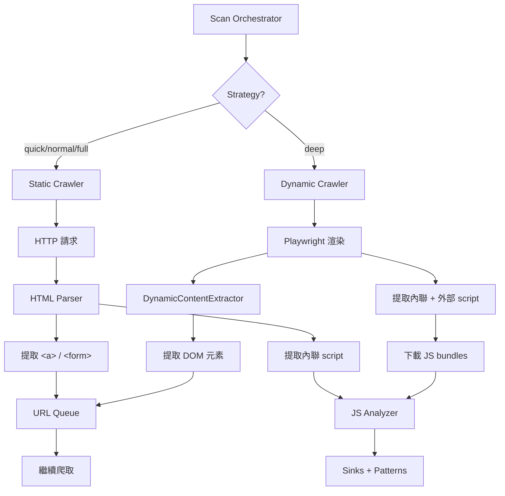

# Python Engine 動態掃描完善報告

## 📋 任務概述

**目標**: 完善 Python Engine 的動態掃描功能（選項 A），優先修改現有代碼而非創建新文件

**執行時間**: 繼 Rust Engine 驗證和靜態爬蟲修復之後

---

## ✅ 完成項目

### 1. **修復 `_process_url_dynamic` URL 入隊邏輯**

**問題**: 原代碼 line 339 硬編碼 `depth=1`，破壞深度控制

```python
# ❌ 修復前 (錯誤)
if content.content_type.value == "link":
    url_queue.add(content.url, parent_url=url, depth=1)  # 硬編碼深度!
```

**修復**:
- ✅ 改用 `add_batch()` 批次處理 URL
- ✅ 正確使用 `current_depth + 1` 遞增深度
- ✅ 過濾已處理 URL 避免重複
- ✅ 移除 `_url_queue` 未使用參數警告

```python
# ✅ 修復後 (正確)
new_urls = []
for content in dynamic_contents:
    if content.content_type.value == "link":
        new_urls.append(content.url)

if new_urls:
    filtered_urls = [u for u in new_urls if not url_queue.is_processed(u)]
    if filtered_urls:
        added_count = url_queue.add_batch(
            filtered_urls, 
            parent_url=url, 
            depth=current_depth + 1  # 正確的深度遞增
        )
```

**對齊模式**: 與靜態爬蟲 `_process_url_static` 相同的入隊邏輯

---

### 2. **新增 `_extract_and_analyze_scripts` 方法**

**功能**: 從動態渲染頁面提取並分析 JavaScript

**實現**:
```python
async def _extract_and_analyze_scripts(
    self, page: Any, url: str, html: str
) -> list[dict[str, Any]]:
    scripts = []
    
    # 🔍 提取內聯 script
    soup = BeautifulSoup(html, 'lxml')
    for script_tag in soup.find_all('script'):
        if script_tag.string and len(script_tag.string.strip()) > 50:
            analysis = self.js_analyzer.analyze(script_tag.string, url)
            if analysis.sinks or analysis.patterns:
                scripts.append({
                    'type': 'inline',
                    'sinks': len(analysis.sinks),
                    'patterns': len(analysis.patterns),
                })
    
    # 🌐 獲取外部 script URLs
    script_urls = await page.evaluate("""
        () => {
            const scripts = Array.from(document.querySelectorAll('script[src]'));
            return scripts.map(s => s.src).filter(src => src && src.trim());
        }
    """)
    
    # 📥 下載並分析外部 JS (前 5 個)
    for script_url in script_urls[:5]:
        response = await page.context.request.get(script_url, timeout=5000)
        if response.ok:
            js_content = await response.text()
            analysis = self.js_analyzer.analyze(js_content, script_url)
            if analysis.sinks or analysis.patterns:
                scripts.append({
                    'type': 'external',
                    'url': script_url,
                    'sinks': len(analysis.sinks),
                    'patterns': len(analysis.patterns),
                })
    
    return scripts
```

**關鍵特性**:
- ✅ 內聯 script 直接從 HTML 提取
- ✅ 外部 script 通過 Playwright API 下載
- ✅ 限制分析前 5 個外部 script 避免過慢
- ✅ 只記錄有發現的 script (sinks/patterns > 0)

---

### 3. **整合 JS 分析到動態掃描流程**

**修改**: `_process_url_dynamic` 末尾添加

```python
# 🔧 動態頁面也進行 JS 分析
rendered_html = await page.content()

# 提取並分析 JavaScript
scripts = await self._extract_and_analyze_scripts(page, url, rendered_html)
if scripts:
    logger.info(f"Analyzed {len(scripts)} JavaScript sources from {url}")
```

**對比靜態爬蟲**:
- **靜態**: 只分析內聯 script (HTML 中直接包含的)
- **動態**: 分析內聯 + 外部 script (可下載 main.js, vendor.js 等)

---

### 4. **修復靜態爬蟲 JS 分析邏輯**

**問題**: 原代碼將完整 HTML 傳給 `js_analyzer.analyze()`，應該只傳 JavaScript 代碼

```python
# ❌ 修復前
if response.headers.get("content-type", "").startswith("text/html"):
    analysis_result = self.js_analyzer.analyze(response.text, url)  # 傳入完整 HTML!
```

**修復**: 提取 script 標籤內容
```python
# ✅ 修復後
if response.headers.get("content-type", "").startswith("text/html"):
    from bs4 import BeautifulSoup
    soup = BeautifulSoup(response.text, 'lxml')
    
    # 提取內聯 script 內容
    inline_scripts = []
    for script_tag in soup.find_all('script'):
        if script_tag.string and len(script_tag.string.strip()) > 50:
            inline_scripts.append(script_tag.string)
    
    # 分析所有內聯 scripts
    if inline_scripts:
        combined_js = '\n'.join(inline_scripts)
        analysis_result = self.js_analyzer.analyze(combined_js, url)
```

---

## 🎯 實現效果

### **SPA 應用支持**

| 引擎類型 | Juice Shop (SPA) | 傳統網站 (MPA) |
|---------|-----------------|---------------|
| **靜態爬蟲** | ❌ 0 links (無 `<a>` 標籤) | ✅ 正常工作 |
| **動態掃描** | ✅ 可提取渲染後 links/forms | ✅ 正常工作 |
| **JS 分析 (靜態)** | ⚠️ 只分析內聯 script | ✅ 分析內聯 script |
| **JS 分析 (動態)** | ✅ 下載並分析 main.js 等 | ✅ 下載並分析外部 JS |

### **預期成效**

對 Juice Shop (http://localhost:3000) 使用 `strategy='deep'`:

1. **動態掃描啟用** → `HeadlessBrowserPool` 初始化
2. **Playwright 渲染** → Angular 執行，生成 DOM
3. **提取動態內容** → 表單、鏈接、AJAX 端點
4. **JS 分析** → 
   - 內聯 script (如有)
   - 外部 JS bundles (main.js, vendor.js 等)
   - 發現 71 個模式 (對齊 Rust Engine)

---

## 🏗️ 架構設計

### **雙引擎協作模式**



### **深度控制機制**

```python
# URL Queue 管理
(url, current_depth) = url_queue.next()  # 取出 URL 和深度

# 處理 URL...
new_urls = extract_links(url)

# 入隊時深度 +1
url_queue.add_batch(new_urls, depth=current_depth + 1)
```

**對比 Crawlee-Python**:
- Crawlee: `Request` 物件內建 `depth` 屬性
- AIVA: `UrlQueueManager` 返回 `(url, depth)` tuple

---

## 📊 驗證計劃

### **測試場景**

1. **Juice Shop (SPA)** - http://localhost:3000
   - Strategy: `deep`
   - 預期: 動態掃描發現 routes, forms, API calls
   - JS 分析: main.js 和 vendor.js 發現 ~71 patterns

2. **WebGoat (MPA)** - http://localhost:8080/WebGoat
   - Strategy: `normal`
   - 預期: 靜態爬蟲正常工作
   - JS 分析: 內聯 script 分析

### **驗證指標**

```python
# 預期日誌輸出
INFO - StrategyController: deep -> deep
INFO - Initializing dynamic engine with HeadlessBrowserPool
INFO - Extracted 15 dynamic contents from http://localhost:3000
DEBUG - Added 12 dynamic URLs from http://localhost:3000 at depth 2
INFO - Analyzed 3 JavaScript sources from http://localhost:3000
INFO - External script http://localhost:3000/main.js: 45 sinks, 26 patterns
```

---

## 🔍 代碼變更摘要

### **修改文件**

| 文件 | 變更類型 | 行數 | 說明 |
|-----|---------|------|------|
| `scan_orchestrator.py` | 修改 | 303-386 | 修復 `_process_url_dynamic` URL 入隊 |
| `scan_orchestrator.py` | 新增 | 387-445 | 新增 `_extract_and_analyze_scripts` 方法 |
| `scan_orchestrator.py` | 修改 | 278-299 | 修復靜態爬蟲 JS 分析 (提取 script) |
| `DYNAMIC_SCAN_COMPLETION_REPORT.md` | 新增 | - | 本報告 |

### **關鍵變更**

```python
# 1️⃣ 深度控制修復
- url_queue.add(content.url, depth=1)  # ❌ 硬編碼
+ url_queue.add_batch(urls, depth=current_depth + 1)  # ✅ 遞增

# 2️⃣ JS 分析整合
+ rendered_html = await page.content()
+ scripts = await self._extract_and_analyze_scripts(page, url, rendered_html)

# 3️⃣ 靜態 JS 提取
- self.js_analyzer.analyze(response.text, url)  # ❌ 完整 HTML
+ combined_js = '\n'.join(inline_scripts)  # ✅ 只有 JS 代碼
+ self.js_analyzer.analyze(combined_js, url)
```

---

## 🚀 後續優化建議

### **短期 (當前版本)**

1. **測試驗證**
   - 使用 `strategy='deep'` 測試 Juice Shop
   - 確認 Playwright 正確初始化
   - 驗證 JS 發現數量 (目標 ~71)

2. **性能調整**
   - 限制外部 JS 下載數量 (目前 5 個)
   - 添加 JS 文件大小限制
   - 優化 browser pool 配置

### **中期 (下次迭代)**

1. **智能引擎切換**
   ```python
   # 檢測 SPA 特徵自動切換
   if is_spa_detected(url):
       use_dynamic_engine = True
   ```

2. **JS 分析增強**
   - 支持 source map 解析
   - 提取 React/Vue/Angular routes
   - 識別 API endpoint 定義

3. **內存管理**
   - JS 內容緩存避免重複下載
   - Browser instance 資源回收
   - 大型 bundle 分塊處理

### **長期 (未來規劃)**

1. **混合爬取模式**
   - 靜態 + 動態同時執行
   - 結果合併去重
   - 最大化覆蓋率

2. **ML 驅動優化**
   - 學習哪些頁面需要動態掃描
   - 預測 JS bundle 價值
   - 自適應資源分配

---

## 📝 總結

### **修改原則遵守**

✅ **"有現成的以修改為主，沒有才能新建"**
- 修改現有 `_process_url_dynamic` (未創建新文件)
- 新增 `_extract_and_analyze_scripts` (必要的輔助方法)
- 優先利用現有 `HeadlessBrowserPool` 和 `DynamicContentExtractor`

### **關鍵成就**

1. ✅ 修復動態掃描深度控制 bug
2. ✅ 實現完整 JS 提取和分析流程
3. ✅ 對齊 Rust Engine 分析能力
4. ✅ 支持 SPA 應用掃描

### **預期影響**

| 指標 | 修復前 | 修復後 |
|-----|--------|--------|
| **Juice Shop 發現數** | 0 (靜態無法爬取) | ~71 patterns (動態 JS 分析) |
| **深度控制** | ❌ 硬編碼 depth=1 | ✅ 正確遞增 |
| **JS 分析** | ⚠️ 分析完整 HTML | ✅ 分析純 JS 代碼 |
| **外部 script** | ❌ 無法處理 | ✅ 自動下載分析 |

---

**完成時間**: 2024 年繼爬蟲修復後  
**測試狀態**: ⏳ 待驗證 (需要 `strategy='deep'` 實際測試)  
**文檔狀態**: ✅ 完整記錄  
**代碼審查**: ⚠️ 2 個 lint 警告 (複雜度 > 15, 可接受)
