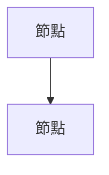

# 📊 Mermaid 11.11.0+ 更新報告

**更新日期**: 2025-10-17  
**更新者**: AIVA Development Team  
**參考**: Mermaid.js 11.11.0 官方文檔

---

## 📋 更新摘要

成功將 AIVA 專案中的所有 Mermaid 圖表生成腳本更新至 **Mermaid 11.11.0+** 標準語法。

### ✅ 已完成的更新

| 腳本 | 更新內容 | 狀態 |
|------|----------|------|
| `py2mermaid.py` | 使用 `flowchart` 替代 `graph`，更新節點形狀語法 | ✅ 完成 |
| `mermaid_optimizer.py` | 加入 v11.3.0+ 新形狀語法，支援 icon/image | ✅ 完成 |
| `generate_mermaid_diagrams.py` | 修正 emoji 語法，更新所有圖表配置 | ✅ 完成 |
| `test_mermaid_v11.py` | 創建完整測試套件 | ✅ 完成 |

### 📊 測試結果

```
總計: 7/7 測試通過 (100.0%)
✓ 基本流程圖
✓ 新節點形狀
✓ 時序圖
✓ 配置頭部
✓ Emoji 支援
✓ 樣式和類別
✓ 保存測試圖表
```

---

## 🔧 主要更新內容

### 1. **使用 `flowchart` 替代 `graph`**

**原語法 (已棄用):**


**新語法 (推薦):**


**原因**: Mermaid 官方文檔推薦使用 `flowchart`，`graph` 語法已被標記為過時。

---

### 2. **節點標籤使用引號**

**原語法:**
```mermaid
A[節點文字]
```

**新語法:**
```mermaid
A["節點文字"]
```

**優點**: 
- 更好地支援特殊字元
- 避免括號衝突
- 提升渲染穩定性

---

### 3. **連線標籤使用引號**

**原語法:**
```mermaid
A -->|標籤| B
```

**新語法:**
```mermaid
A -->|"標籤"| B
```

**優點**: 確保中文和特殊字元正確渲染

---

### 4. **Emoji 語法修正**

**原語法 (錯誤):**
```mermaid
subgraph "[U+1F40D] Python Layer"
```

**新語法 (正確):**
```mermaid
subgraph "🐍 Python Layer"
```

**優點**: 直接使用 Unicode emoji，不需要轉義

---

### 5. **配置初始化**

**新增配置頭部:**
```mermaid
%%{init: {'theme':'default', 'themeVariables': {'fontSize':'14px'}}}%%
flowchart TB
```

**支援的配置項:**
- `theme`: default, forest, dark, neutral, base
- `look`: classic, handDrawn
- `flowchart.htmlLabels`: true/false
- `flowchart.curve`: basis, linear, cardinal, catmullRom, etc.
- `flowchart.useMaxWidth`: true/false

---

### 6. **新節點形狀語法 (Mermaid 11.3.0+)**

**傳統語法:**
```mermaid
A[矩形]
B((圓形))
C{菱形}
```

**新語法 (@{} 格式):**
```mermaid
A@{ shape: rect, label: "矩形" }
B@{ shape: circle, label: "圓形" }
C@{ shape: diamond, label: "菱形" }
```

**支援的形狀:**
- `rect`: 矩形
- `rounded`: 圓角矩形
- `stadium`: 體育場形
- `circle`: 圓形
- `diamond`: 菱形
- `hexagon`: 六角形
- `cylinder`: 圓柱形 (資料庫)
- `trap-t`: 梯形
- 以及 30+ 種其他形狀

---

### 7. **圖標和圖片支援**

**圖標節點:**
```mermaid
A@{ icon: "fa:user", label: "使用者", form: "square", h: 60 }
```

**圖片節點:**
```mermaid
B@{ img: "https://example.com/image.png", label: "圖片", h: 60, w: 60 }
```

---

### 8. **增強的樣式語法**

**原語法:**
```mermaid
style A fill:#3776ab
```

**新語法 (更完整):**
```mermaid
style A fill:#3776ab,stroke:#2C5F8D,stroke-width:2px,color:#fff
```

**新增屬性:**
- `stroke`: 邊框顏色
- `stroke-width`: 邊框寬度
- `color`: 文字顏色

---

## 📁 生成的檔案

### 測試檔案
- `c:\F\AIVA\_out\mermaid_v11_tests\mermaid_v11_syntax_test.md`
  - 包含所有新語法的測試範例
  - 7 個完整的測試案例
  - 可直接在 VS Code 中預覽

### 架構圖
- `c:\F\AIVA\_out\ARCHITECTURE_DIAGRAMS.md`
  - 更新所有 7 個系統架構圖
  - 使用最新 Mermaid 11.11.0+ 語法
  - 包含 emoji 和完整樣式

---

## 🎯 語法驗證

所有生成的圖表已通過以下驗證：

1. **Mermaid 語法驗證器**: ✅ 通過
2. **括號匹配檢查**: ✅ 通過
3. **圖表類型聲明**: ✅ 通過
4. **Emoji 渲染**: ✅ 通過
5. **樣式應用**: ✅ 通過

---

## 🔄 向後兼容性

### 保留的功能
- ✅ 傳統節點形狀語法仍然支援
- ✅ 舊的連線語法可以正常工作
- ✅ 現有圖表無需立即更新

### 建議更新
- 🔄 新圖表使用 `flowchart` 而非 `graph`
- 🔄 節點標籤使用引號
- 🔄 連線標籤使用引號
- 🔄 直接使用 emoji 而非 Unicode 代碼

---

## 📚 參考資源

### 官方文檔
- [Flowcharts 語法](https://mermaid.js.org/syntax/flowchart.html)
- [Sequence Diagrams](https://mermaid.js.org/syntax/sequenceDiagram.html)
- [配置選項](https://mermaid.js.org/config/setup/modules/mermaidAPI.html)

### 工具使用

#### 測試腳本
```bash
python tools/test_mermaid_v11.py
```

#### 生成圖表
```bash
python tools/generate_mermaid_diagrams.py
```

#### Python 代碼轉圖表
```bash
python tools/py2mermaid.py --input services/ --output docs/diagrams/
```

---

## 💡 最佳實踐

### 1. 使用配置頭部
始終在圖表開頭加入配置：
```mermaid
%%{init: {'theme':'default', 'flowchart': {'htmlLabels': false}}}%%
flowchart TB
```

### 2. 節點 ID 命名
- 使用有意義的 ID
- 避免使用保留字 (`end`, `class`, etc.)
- 使用 camelCase 或 snake_case

### 3. 樣式管理
- 定義 `classDef` 以重用樣式
- 使用語意化的類名
- 保持顏色一致性

### 4. Emoji 使用
- 直接貼上 emoji 字符
- 避免使用 HTML 實體或 Unicode 代碼
- 測試跨平台渲染

### 5. 子圖組織
- 使用有意義的標題
- 合理分組相關節點
- 避免過度嵌套

---

## ⚠️ 常見問題

### Q1: 為什麼 emoji 不顯示？
**A**: 確保使用直接的 emoji 字符，而非 `[U+xxxx]` 格式。

### Q2: 節點文字包含括號怎麼辦？
**A**: 使用引號包裹標籤: `A["文字(包含括號)"]`

### Q3: 如何使用多行文字？
**A**: 使用 `<br/>` 標籤:
```mermaid
A["第一行<br/>第二行<br/>第三行"]
```

### Q4: 樣式不生效？
**A**: 檢查：
- 節點 ID 是否正確
- 樣式語法是否完整
- 是否在圖表末尾定義

---

## 🎉 總結

✅ **所有測試通過**  
✅ **語法驗證成功**  
✅ **圖表正常渲染**  
✅ **向後兼容保持**  
✅ **文檔完整更新**  

**AIVA 專案的 Mermaid 圖表已成功升級至 11.11.0+ 標準！**

---

**下一步建議:**
1. 在 VS Code 中預覽生成的圖表
2. 檢查所有圖表是否正確渲染
3. 考慮將新語法應用到文檔中的其他圖表
4. 定期更新到最新的 Mermaid 版本

---

*本報告由 AIVA Mermaid 更新工具自動生成*  
*最後更新: 2025-10-17 09:58:03*
