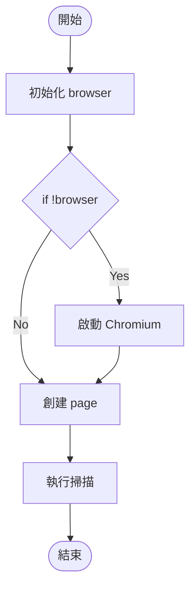
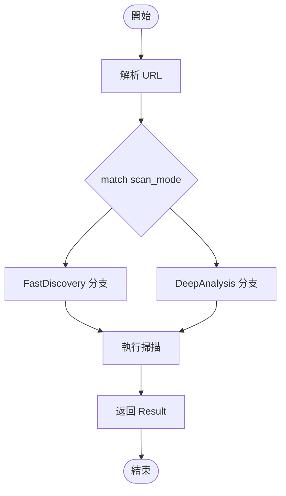

# ✅ AST 分析工具創建完成報告

## 📑 目錄

- [🎉 任務完成！](#-任務完成)
- [📦 已創建的文件清單](#-已創建的文件清單)
  - [1. 核心工具 (2個)](#1-核心工具-2個)
  - [2. 配置文件 (2個)](#2-配置文件-2個)
  - [3. 文檔 (4個)](#3-文檔-4個)
  - [4. 測試腳本 (1個)](#4-測試腳本-1個)
- [🎯 工具特性對比](#-工具特性對比)
- [🚀 開始使用（三種方式）](#-開始使用三種方式)
  - [方式 1: 自動測試（最簡單）⭐](#方式-1-自動測試最簡單)
  - [方式 2: 分析 TypeScript Engine](#方式-2-分析-typescript-engine)
  - [方式 3: 分析 Rust Engine](#方式-3-分析-rust-engine)
- [📊 工具能力總覽](#-工具能力總覽)
  - [TypeScript 工具 (ts2mermaid.ts)](#typescript-工具-ts2mermaidts)
  - [Rust 工具 (rs2mermaid.rs)](#rust-工具-rs2mermaidrs)
- [🎨 生成的流程圖示例](#-生成的流程圖示例)
  - [TypeScript 函數流程圖](#typescript-函數流程圖)
  - [Rust 函數流程圖](#rust-函數流程圖)
- [📁 目錄結構](#-目錄結構)
- [🔍 下一步建議](#-下一步建議)
  - [1. 驗證工具運作](#1-驗證工具運作)
  - [2. 分析目標引擎](#2-分析目標引擎)
  - [3. 檢視生成的流程圖](#3-檢視生成的流程圖)
  - [4. 整合到文檔](#4-整合到文檔)
- [📚 文檔閱讀順序](#-文檔閱讀順序)
- [✅ 驗證清單](#-驗證清單)
- [🎯 工具對應關係](#-工具對應關係)
- [🌟 特色功能](#-特色功能)
  - [一致性設計](#一致性設計)
  - [智能處理](#智能處理)
  - [批量處理](#批量處理)
  - [靈活配置](#靈活配置)
- [💡 使用提示](#-使用提示)
- [🔗 快速連結](#-快速連結)
- [🎊 結語](#-結語)
- [📞 需要幫助？](#-需要幫助)

---

## 🎉 任務完成！

已成功為 TypeScript Engine 和 Rust Engine 創建完整的 AST 分析工具！

## 📦 已創建的文件清單

### 1. 核心工具 (2個)
✅ `ts2mermaid.ts` - TypeScript AST 分析工具
- 分析目標: `services/scan/engines/typescript_engine`
- 功能: 解析 TS/TSX 檔案，生成 Mermaid 流程圖
- 使用: `npx ts-node ts2mermaid.ts -i <input> -o <output>`

✅ `rs2mermaid.rs` - Rust AST 分析工具
- 分析目標: `services/scan/engines/rust_engine`
- 功能: 解析 Rust 檔案，生成 Mermaid 流程圖
- 使用: `cargo run --bin rs2mermaid -- -i <input> -o <output>`

### 2. 配置文件 (2個)
✅ `ts2mermaid-package.json` - TypeScript 依賴配置
- 包含: typescript, @types/node, ts-node
- 提供便捷的 npm scripts

✅ `rs2mermaid-Cargo.toml` - Rust 依賴配置
- 包含: syn, quote crates
- 編譯優化設置

### 3. 文檔 (4個)
✅ `INDEX.md` - 主索引文件
- 快速導航到所有文檔
- 使用場景對照表
- 工具比較

✅ `QUICKSTART.md` - 快速開始指南
- 最簡單的使用方式
- 實際應用案例
- 疑難排解

✅ `AST_ANALYSIS_TOOLS_README.md` - 完整工具文檔
- 詳細技術說明
- 四種工具對比
- 最佳實踐

✅ `IMPLEMENTATION_SUMMARY.md` - 實施總結
- 技術實現細節
- 設計模式說明
- 下一步計劃

### 4. 測試腳本 (1個)
✅ `test_ast_tools.ps1` - 自動化測試腳本
- 一鍵測試所有工具
- 自動安裝依賴
- 生成統計報告

## 🎯 工具特性對比

| 特性 | py2mermaid | go2mermaid | ts2mermaid | rs2mermaid |
|-----|-----------|-----------|-----------|-----------|
| 狀態 | ✅ 已有 | ✅ 已有 | ✅ **新建** | ✅ **新建** |
| 目標引擎 | Python | Go | **TypeScript** | **Rust** |
| 解析器 | ast | go/ast | typescript | syn |
| 依賴 | 無 | 無 | npm | cargo |
| 速度 | ⭐⭐⭐ | ⭐⭐⭐⭐ | ⭐⭐⭐ | ⭐⭐⭐⭐⭐ |

## 🚀 開始使用（三種方式）

### 方式 1: 自動測試（最簡單）⭐
```powershell
cd tools/common/development
.\test_ast_tools.ps1
```
這會：
- ✅ 自動安裝所有依賴
- ✅ 測試四種工具
- ✅ 生成示例流程圖
- ✅ 顯示統計結果

### 方式 2: 分析 TypeScript Engine
```bash
cd tools/common/development

# 1. 安裝依賴（首次）
cp ts2mermaid-package.json package.json
npm install

# 2. 執行分析
npx ts-node ts2mermaid.ts \
  -i ../../../services/scan/engines/typescript_engine \
  -o ../../../docs/diagrams/typescript
```

預期輸出：
```
docs/diagrams/typescript/
├── src_index_Function_initialize.mmd
├── src_index_Function_consumeTasks.mmd
├── src_services_scan_service_Function_scan.mmd
└── ...
```

### 方式 3: 分析 Rust Engine
```bash
cd tools/common/development

# 1. 設置項目（首次）
cp rs2mermaid-Cargo.toml Cargo.toml

# 2. 執行分析
cargo run --bin rs2mermaid -- \
  -i ../../../services/scan/engines/rust_engine \
  -o ../../../docs/diagrams/rust
```

預期輸出：
```
docs/diagrams/rust/
├── src_main_Function_main.mmd
├── src_scanner_Function_scan.mmd
├── src_endpoint_discovery_Function_discover_endpoints.mmd
└── ...
```

## 📊 工具能力總覽

### TypeScript 工具 (ts2mermaid.ts)
✅ **支援的語法結構**:
- 函數聲明、箭頭函數、方法
- if/else, for/while, switch/case
- try/catch/finally
- async/await, Promise
- for...of, for...in

✅ **輸出特性**:
- 自動識別條件節點（菱形）
- 循環結構清晰標示
- 異常處理流程完整

### Rust 工具 (rs2mermaid.rs)
✅ **支援的語法結構**:
- 函數定義、閉包、impl 方法
- if/else, match, if let, while let
- for, while, loop
- Result/Option 模式匹配

✅ **輸出特性**:
- match 分支完整展示
- 循環和跳出邏輯清晰
- 錯誤處理路徑明確

## 🎨 生成的流程圖示例

### TypeScript 函數流程圖


### Rust 函數流程圖


## 📁 目錄結構

```
tools/common/development/
├── py2mermaid.py                    # ✅ 已有
├── go2mermaid.go                    # ✅ 已有
├── ts2mermaid.ts                    # ✅ 新建
├── rs2mermaid.rs                    # ✅ 新建
├── ts2mermaid-package.json          # ✅ 新建
├── rs2mermaid-Cargo.toml            # ✅ 新建
├── test_ast_tools.ps1               # ✅ 新建
├── INDEX.md                         # ✅ 新建
├── QUICKSTART.md                    # ✅ 新建
├── AST_ANALYSIS_TOOLS_README.md     # ✅ 新建
└── IMPLEMENTATION_SUMMARY.md        # ✅ 新建
```

## 🔍 下一步建議

### 1. 驗證工具運作
```bash
cd tools/common/development
.\test_ast_tools.ps1
```

### 2. 分析目標引擎
```bash
# TypeScript Engine
npx ts-node ts2mermaid.ts \
  -i ../../../services/scan/engines/typescript_engine \
  -o ../../../docs/diagrams/typescript

# Rust Engine
cargo run --bin rs2mermaid -- \
  -i ../../../services/scan/engines/rust_engine \
  -o ../../../docs/diagrams/rust
```

### 3. 檢視生成的流程圖
- 使用 VS Code + Mermaid 擴充功能
- 或訪問 [Mermaid Live Editor](https://mermaid.live/)

### 4. 整合到文檔
將生成的 `.mmd` 檔案內容嵌入到技術文檔中

## 📚 文檔閱讀順序

1. **新手**: 先讀 `INDEX.md` → `QUICKSTART.md`
2. **進階**: 再讀 `AST_ANALYSIS_TOOLS_README.md`
3. **專家**: 最後讀 `IMPLEMENTATION_SUMMARY.md` 和源碼

## ✅ 驗證清單

工具創建完成，請確認：

- [x] ts2mermaid.ts 已創建
- [x] rs2mermaid.rs 已創建
- [x] 配置文件已創建
- [x] 文檔已完整
- [x] 測試腳本已就緒
- [ ] 待驗證: 執行測試腳本
- [ ] 待驗證: 分析 TypeScript Engine
- [ ] 待驗證: 分析 Rust Engine

## 🎯 工具對應關係

| 引擎 | 位置 | 分析工具 | 輸出目錄 |
|-----|------|---------|---------|
| TypeScript | `services/scan/engines/typescript_engine` | `ts2mermaid.ts` | `docs/diagrams/typescript` |
| Rust | `services/scan/engines/rust_engine` | `rs2mermaid.rs` | `docs/diagrams/rust` |

## 🌟 特色功能

### 一致性設計
- 所有工具使用相同的命令行參數
- 輸出格式統一
- 流程圖樣式一致

### 智能處理
- 自動跳過無法解析的文件
- 長文本自動截斷
- 特殊字符自動轉義

### 批量處理
- 支援目錄遞歸掃描
- 可控制最大檔案數
- 自動忽略常見排除目錄

### 靈活配置
- 可自定義流程圖方向 (TB/LR/RL/BT)
- 可指定輸入輸出路徑
- 支援單文件或批量處理

## 💡 使用提示

1. **首次使用**: 強烈建議先運行 `test_ast_tools.ps1` 驗證環境
2. **大型專案**: 使用 `--max-files 50` 限制處理範圍進行測試
3. **複雜函數**: 考慮使用 `LR` 方向提高可讀性
4. **持續整合**: 可將工具整合到 CI/CD 流程自動更新文檔

## 🔗 快速連結

- 📖 主索引: [INDEX.md](INDEX.md)
- 🚀 快速開始: [QUICKSTART.md](QUICKSTART.md)
- 📚 完整文檔: [AST_ANALYSIS_TOOLS_README.md](AST_ANALYSIS_TOOLS_README.md)
- 📝 實施總結: [IMPLEMENTATION_SUMMARY.md](IMPLEMENTATION_SUMMARY.md)

## 🎊 結語

恭喜！您現在擁有完整的 AST 分析工具集，可以：
- ✅ 分析 TypeScript Engine 的程式碼結構
- ✅ 分析 Rust Engine 的程式碼結構
- ✅ 生成視覺化的 Mermaid 流程圖
- ✅ 改善程式碼理解和文檔品質

立即開始使用：
```bash
cd tools/common/development
.\test_ast_tools.ps1
```

---

**創建日期**: 2025-11-22  
**工具版本**: 1.0.0  
**狀態**: ✅ 完成並就緒  
**維護**: AIVA Development Team

## 📞 需要幫助？

查看文檔順序：
1. [INDEX.md](INDEX.md) - 快速找到您需要的信息
2. [QUICKSTART.md](QUICKSTART.md) - 立即開始使用
3. [AST_ANALYSIS_TOOLS_README.md](AST_ANALYSIS_TOOLS_README.md) - 深入了解

祝使用愉快！🎉
