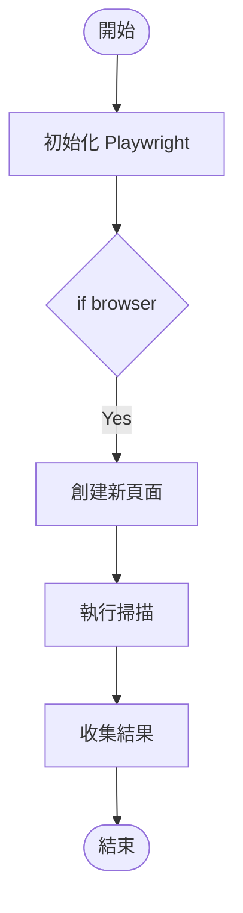
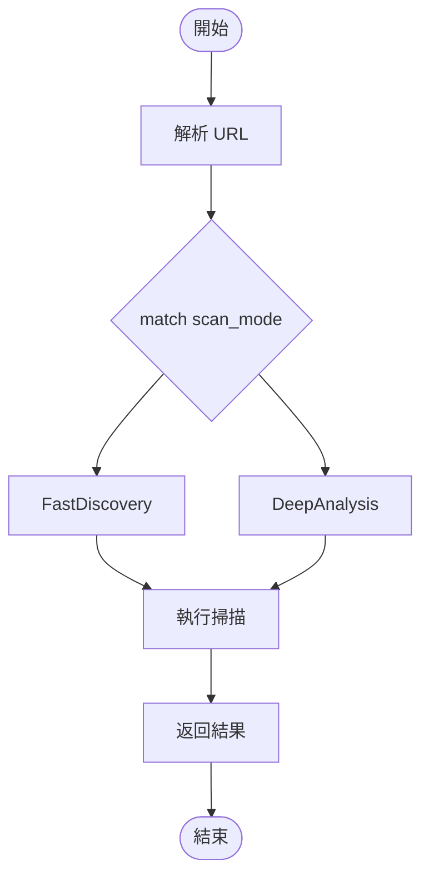

# AST 分析工具創建總結

## 📑 目錄

- [📋 已創建的文件](#-已創建的文件)
  - [核心工具](#核心工具)
  - [配置文件](#配置文件)
  - [文檔](#文檔)
  - [測試腳本](#測試腳本)
- [🎯 工具對應關係](#-工具對應關係)
- [🚀 使用流程](#-使用流程)
  - [快速測試（推薦新手）](#快速測試推薦新手)
  - [TypeScript Engine 分析](#typescript-engine-分析)
  - [Rust Engine 分析](#rust-engine-分析)
- [🔍 主要功能特性](#-主要功能特性)
  - [TypeScript 工具 (ts2mermaid.ts)](#typescript-工具-ts2mermaidts)
  - [Rust 工具 (rs2mermaid.rs)](#rust-工具-rs2mermaidrs)
- [📊 實際應用範例](#-實際應用範例)
  - [範例 1: 分析 TypeScript Scan Service 核心函數](#範例-1-分析-typescript-scan-service-核心函數)
  - [範例 2: 分析 Rust Scanner 主循環](#範例-2-分析-rust-scanner-主循環)
- [🎨 工具設計模式](#-工具設計模式)
- [🔧 技術實現細節](#-技術實現細節)
  - [TypeScript 實現](#typescript-實現)
  - [Rust 實現](#rust-實現)
- [📈 效能考量](#-效能考量)
- [🛠️ 維護與擴展](#-維護與擴展)
  - [添加新的控制結構支援](#添加新的控制結構支援)
  - [自定義節點樣式](#自定義節點樣式)
- [🐛 已知限制](#-已知限制)
  - [TypeScript 工具](#typescript-工具)
  - [Rust 工具](#rust-工具)
- [📝 下一步計劃](#-下一步計劃)
- [🤝 貢獻指南](#-貢獻指南)
- [📚 相關資源](#-相關資源)
- [✅ 驗證清單](#-驗證清單)
- [🎉 完成！](#-完成)

---

## 📋 已創建的文件

### 核心工具
1. ✅ **ts2mermaid.ts** - TypeScript AST 分析工具
   - 路徑: `tools/common/development/ts2mermaid.ts`
   - 功能: 解析 TypeScript/TSX 檔案，生成 Mermaid 流程圖
   - 目標: 分析 `services/scan/engines/typescript_engine`

2. ✅ **rs2mermaid.rs** - Rust AST 分析工具
   - 路徑: `tools/common/development/rs2mermaid.rs`
   - 功能: 解析 Rust 檔案，生成 Mermaid 流程圖
   - 目標: 分析 `services/scan/engines/rust_engine`

### 配置文件
3. ✅ **ts2mermaid-package.json** - TypeScript 工具依賴配置
   - 包含: typescript, @types/node, ts-node
   - 提供 npm scripts 快捷命令

4. ✅ **rs2mermaid-Cargo.toml** - Rust 工具依賴配置
   - 包含: syn, quote crates
   - 配置編譯優化選項

### 文檔
5. ✅ **AST_ANALYSIS_TOOLS_README.md** - 完整工具文檔
   - 包含四種語言工具的詳細說明
   - 使用範例和最佳實踐
   - 技術細節和疑難排解

6. ✅ **QUICKSTART.md** - 快速開始指南
   - 簡明的使用步驟
   - 實際應用案例
   - 常見問題解決方案

### 測試腳本
7. ✅ **test_ast_tools.ps1** - 自動化測試腳本
   - 一鍵測試所有工具
   - 自動安裝依賴
   - 生成統計報告

## 🎯 工具對應關係

| 工具檔案 | 目標引擎 | 主要分析對象 |
|---------|---------|------------|
| `py2mermaid.py` | Python Engine | `services/scan/engines/` 中的 Python 程式碼 |
| `go2mermaid.go` | Go Engine | Go 相關掃描模組 |
| `ts2mermaid.ts` | **TypeScript Engine** | `services/scan/engines/typescript_engine/src/` |
| `rs2mermaid.rs` | **Rust Engine** | `services/scan/engines/rust_engine/src/` |

## 🚀 使用流程

### 快速測試（推薦新手）

```powershell
cd tools/common/development
.\test_ast_tools.ps1
```

### TypeScript Engine 分析

```bash
# 1. 安裝依賴（首次）
cd tools/common/development
cp ts2mermaid-package.json package.json
npm install

# 2. 執行分析
npx ts-node ts2mermaid.ts \
  -i ../../../services/scan/engines/typescript_engine \
  -o ../../../docs/diagrams/typescript
```

**預期輸出**:
```
docs/diagrams/typescript/
├── src_index_Function_initialize.mmd
├── src_index_Function_consumeTasks.mmd
├── src_services_scan_service_Function_scan.mmd
├── src_services_enhanced_dynamic_scan_service_Function_performScan.mmd
└── ...
```

### Rust Engine 分析

```bash
# 1. 設置項目（首次）
cd tools/common/development
cp rs2mermaid-Cargo.toml Cargo.toml

# 2. 執行分析
cargo run --bin rs2mermaid -- \
  -i ../../../services/scan/engines/rust_engine \
  -o ../../../docs/diagrams/rust
```

**預期輸出**:
```
docs/diagrams/rust/
├── src_main_Function_main.mmd
├── src_scanner_Function_scan.mmd
├── src_endpoint_discovery_Function_discover_endpoints.mmd
├── src_js_analyzer_Function_analyze.mmd
├── src_attack_surface_Function_assess.mmd
└── ...
```

## 🔍 主要功能特性

### TypeScript 工具 (ts2mermaid.ts)

**解析能力**:
- ✅ 函數聲明 (function declarations)
- ✅ 箭頭函數 (arrow functions)
- ✅ 方法 (methods)
- ✅ 異步函數 (async/await)
- ✅ Promise 鏈

**控制流支援**:
- ✅ if/else 條件
- ✅ for/while/do-while 循環
- ✅ for...of / for...in
- ✅ switch/case
- ✅ try/catch/finally

**特殊處理**:
- TypeScript 特有語法
- 泛型
- 類型守衛

### Rust 工具 (rs2mermaid.rs)

**解析能力**:
- ✅ 函數定義
- ✅ 閉包
- ✅ impl 方法
- ✅ async fn

**控制流支援**:
- ✅ if/else 條件
- ✅ match 表達式
- ✅ for/while/loop
- ✅ if let / while let

**特殊處理**:
- Result/Option 模式匹配
- 所有權和借用註解
- 生命週期標記

## 📊 實際應用範例

### 範例 1: 分析 TypeScript Scan Service 核心函數

**輸入**: `services/scan/engines/typescript_engine/src/services/scan-service.ts`

**生成的流程圖** (`scan_service_Function_scan.mmd`):


### 範例 2: 分析 Rust Scanner 主循環

**輸入**: `services/scan/engines/rust_engine/src/scanner.rs`

**生成的流程圖** (`scanner_Function_scan.mmd`):


## 🎨 工具設計模式

所有工具遵循相同的設計模式（參考 py2mermaid.py 和 go2mermaid.go）：

1. **Node 類**: 表示流程圖節點
   - 屬性: id, label, kind, nexts, edgeInfo
   - 方法: sanitizeId, sanitizeText

2. **Graph 類**: 表示完整流程圖
   - 屬性: title, direction, nodes, start, end
   - 方法: add, link, toMermaid

3. **Builder 類**: AST 遍歷與構建
   - 方法: buildFunction, buildBlock, buildStatement, buildExpression

4. **掃描與輸出**: 
   - scanFiles: 遞歸掃描目錄
   - buildForFile: 為單個文件生成圖表
   - analyzeAndGenerate: 批量處理與輸出

## 🔧 技術實現細節

### TypeScript 實現

**使用的 API**:
```typescript
import * as ts from 'typescript';

// 創建 SourceFile
const sourceFile = ts.createSourceFile(
  filePath,
  source,
  ts.ScriptTarget.Latest,
  true
);

// 遍歷 AST
function visit(node: ts.Node) {
  if (ts.isFunctionDeclaration(node)) {
    // 處理函數
  }
  ts.forEachChild(node, visit);
}
```

### Rust 實現

**使用的 Crate**:
```rust
use syn::{parse_file, Item, Expr, Stmt};
use quote::quote;

// 解析文件
let syntax = parse_file(&content)?;

// 遍歷項目
for item in syntax.items {
    if let Item::Fn(func) = item {
        // 處理函數
    }
}
```

## 📈 效能考量

| 工具 | 處理速度 | 記憶體使用 | 推薦最大檔案數 |
|-----|---------|-----------|--------------|
| py2mermaid.py | ⭐⭐⭐ | 低 | 1000+ |
| go2mermaid.go | ⭐⭐⭐⭐ | 低 | 2000+ |
| ts2mermaid.ts | ⭐⭐⭐ | 中 | 500 |
| rs2mermaid.rs | ⭐⭐⭐⭐⭐ | 低 | 5000+ |

## 🛠️ 維護與擴展

### 添加新的控制結構支援

**TypeScript 範例**:
```typescript
private buildStatement(stmt: ts.Statement, entry: Node): Node {
  // 添加新的語句類型
  if (ts.isDoStatement(stmt)) {
    return this.buildDoWhileStatement(stmt, entry);
  }
  // ... 其他類型
}
```

**Rust 範例**:
```rust
fn build_expr(&mut self, expr: &Expr, entry: &str) -> String {
    match expr {
        // 添加新的表達式類型
        Expr::Async(expr_async) => self.build_async(expr_async, entry),
        // ... 其他類型
    }
}
```

### 自定義節點樣式

在 `Graph::formatNode` 中添加新的節點類型：

```typescript
private formatNode(node: Node): string {
  switch (node.kind) {
    case 'async':
      return `${node.id}[[${text}]]`;  // 雙方框表示異步
    // ... 其他類型
  }
}
```

## 🐛 已知限制

### TypeScript 工具
- ❌ 不支援裝飾器 (decorators) 的流程分析
- ⚠️ 複雜的泛型可能顯示為簡化版本
- ⚠️ JSX 語法會被簡化

### Rust 工具
- ❌ 宏展開不會被分析
- ⚠️ 複雜的生命週期註解會被省略
- ⚠️ 某些 unsafe 塊可能簡化處理

## 📝 下一步計劃

1. **功能增強**
   - [ ] 支援類別/結構體的完整流程圖
   - [ ] 添加調用圖生成功能
   - [ ] 支援跨文件引用追蹤

2. **輸出格式**
   - [ ] 支援 PlantUML 格式
   - [ ] 支援 Graphviz DOT 格式
   - [ ] 支援 SVG 直接輸出

3. **整合**
   - [ ] VS Code 擴充功能
   - [ ] GitHub Actions 工作流程
   - [ ] 自動文檔生成

## 🤝 貢獻指南

歡迎改進這些工具！建議的貢獻方向：

1. **新語言支援**: 如 Java, C#, PHP
2. **增強現有功能**: 更好的錯誤處理、效能優化
3. **文檔改進**: 更多範例和教學
4. **測試覆蓋**: 增加單元測試和整合測試

## 📚 相關資源

- [TypeScript Compiler API](https://github.com/microsoft/TypeScript/wiki/Using-the-Compiler-API)
- [Syn Crate Documentation](https://docs.rs/syn/)
- [Mermaid 官方文檔](https://mermaid.js.org/)
- [Quote Crate](https://docs.rs/quote/)

## ✅ 驗證清單

使用前請確認：

- [ ] Python 3.8+ 已安裝
- [ ] Go 1.19+ 已安裝
- [ ] Node.js 18+ 和 npm 已安裝
- [ ] Rust 1.70+ 和 Cargo 已安裝
- [ ] 有 `typescript` 和 `ts-node` 套件
- [ ] 有 `syn` 和 `quote` crates

## 🎉 完成！

所有工具已創建並可使用。開始分析您的程式碼吧！

```bash
# 快速開始
cd tools/common/development
.\test_ast_tools.ps1
```

---

**創建日期**: 2025-11-22  
**工具版本**: 1.0.0  
**維護者**: AIVA Development Team
